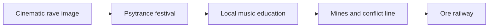
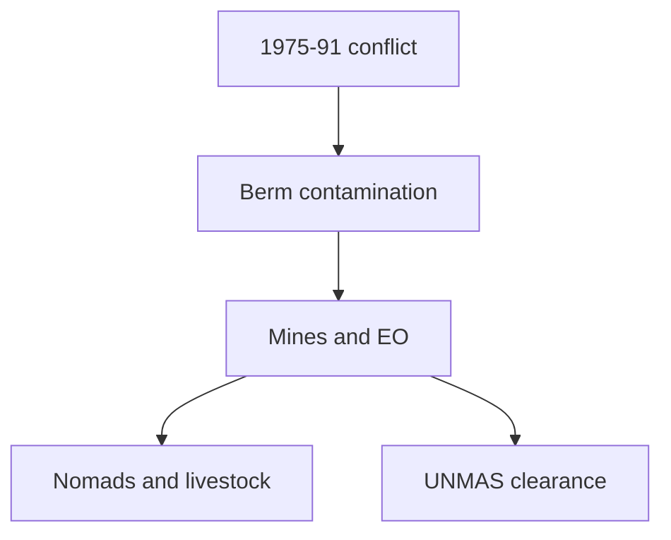

# Desert raves in Morocco and Mauritania: organizers, religion, mines, railways, and conflict history

## 1. Executive Summary

"Desert rave" around southern Morocco, Western Sahara, and Mauritania is not one unified phenomenon. The free-party image made visible by the film *Sirât*, Moroccan psytrance festivals, commercial electronic music events around Ouarzazate, and community music projects in M'hamid El Ghizlane involve different organizers and purposes. Based on the available evidence, these events are not centrally led by a religious or political organization. <SourceNote>The *Sirât* premise is based on [Festival de Cannes](https://www.festival-cannes.com/en/2025/sirat-oliver-laxes-mystical-odyssey-in-the-desert/) and [The Guardian](https://www.theguardian.com/film/2026/feb/09/cinemas-new-rave-desert-thriller-sirat-deep-dives-into-dance-culture-oliver-laxe). Transahara is based on [Underground Sound](https://undergroundsound.eu/festivals/transahara-the-most-authentic-desert-psy-trance-festival/), and Zamane/Joudour Sahara is based on [Joudour Sahara](https://joudoursahara.org/zamane/).</SourceNote>

The religious profile is clear. Morocco is more than 99 percent Sunni Muslim, and the state gives special weight to Maliki Sunni-Ashari religious education and regulation. Mauritania is also overwhelmingly Sunni Muslim, with government estimates placing Sunni Muslims at about 99 percent of the population; Islam is defined as the sole religion of the state and citizenry. The religious relevance of desert raves is therefore not that religious groups run them. It is that conservative Islamic social norms, tourism, youth culture, European free-party culture, and Sufi/Gnawa musical traditions meet in the same social space. <SourceNote>[U.S. Department of State, 2023 Report on International Religious Freedom: Morocco](https://www.state.gov/reports/2023-report-on-international-religious-freedom/morocco/) and [Mauritania](https://www.state.gov/reports/2023-report-on-international-religious-freedom/mauritania/) provide the religious demography. Gnawa's religious-cultural character is based on [UNESCO, Gnawa decision 14.COM 10.B.26](https://ich.unesco.org/en/decisions/14.COM/10.B.26).</SourceNote>

The main security issue is the Moroccan Berm and landmine/explosive ordnance contamination in Western Sahara. UNMAS says much contamination is concentrated along the 1,465 km sand berm that divides the region, and that since 2008 it has released approximately 150 million square meters of hazardous land. The broader Moroccan Wall/Berm is often described as being roughly 2,700 km long. This is not an empty desert. It is a space shaped by ceasefire monitoring, mine action, nomadic movement, livestock, and military boundaries. <SourceNote>[UNMAS, Territory of Western Sahara](https://unmas.org/en/where-we-work/territory-of-western-sahara), [MINURSO, Mine action](https://minurso.unmissions.org/en/mine-action), and [Mine Action Review, Western Sahara](https://www.mineactionreview.org/country/western-sahara/) are the main sources.</SourceNote>

The most important railway is Mauritania's SNIM iron-ore railway. SNIM's own 2024 stakeholder plan describes the existing railway as a 704 km single-track line linking the M'Haoudatt side to the Nouadhibou ore port. The iron-ore train that appears in travel writing and film discussion is an industrial railway, not the same thing as the landmine belt or the Western Sahara military boundary. <SourceNote>[SNIM, Plan de participation des parties prenantes, October 2024 PDF](https://snim.com/sites/default/files/RAPPORT%20P3P%20SNIM%20V%20FINAL%20OCT%202024.pdf). Morocco's rail expansion plans are covered by [Reuters](https://www.reuters.com/world/africa/morocco-launches-10-billion-rail-expansion-plan-2025-04-24/) and [France 24](https://www.france24.com/en/africa/20250424-morocco-green-lights-10-billion-rail-expansion-plan).</SourceNote>

## 2. Three Different Meanings of "Desert Rave"

The first meaning is the free-party image foregrounded by *Sirât*. Cannes describes the film as a story in which a father and son search for a daughter who disappeared at a rave in Morocco. The Guardian reports that Oliver Laxe organized his own music festival in the Moroccan desert for the shoot and brought in lifelong ravers from across Europe. The film draws on real rave culture, but its rave should not be treated as a regular public event run by one identifiable local organization. <SourceNote>[Festival de Cannes](https://www.festival-cannes.com/en/2025/sirat-oliver-laxes-mystical-odyssey-in-the-desert/), [The Guardian](https://www.theguardian.com/film/2026/feb/09/cinemas-new-rave-desert-thriller-sirat-deep-dives-into-dance-culture-oliver-laxe), and [Film Comment](https://www.filmcomment.com/interview-oliver-laxe-on-sirat/) are the sources.</SourceNote>

The second meaning is a psytrance desert festival such as Transahara. Underground Sound describes Transahara as a psytrance desert festival at an undisclosed dune location north of Merzouga and names Nomadstribe as the related organizing collective. The exact location is undisclosed, and the event's continuity appears to vary by year. The best classification is therefore not religious movement or state cultural policy, but an international psytrance/festival-travel collective. <SourceNote>[Underground Sound, Transahara](https://undergroundsound.eu/festivals/transahara-the-most-authentic-desert-psy-trance-festival/) and [Transahara Instagram](https://www.instagram.com/transaharafestival/?hl=en) are the sources.</SourceNote>

The third meaning is community music and education work such as Joudour Sahara/Zamane. Zamane takes place in M'hamid El Ghizlane. Its 2025 edition included more than 225 youth and musician performers, including more than 150 Gnawa youth and musicians. Joudour Sahara is a Playing For Change Foundation program focused on music education, girls' and youth opportunity, environmental work, anti-desertification, and cultural heritage. This is not a rave; it is cultural infrastructure in the Sahara edge region. <SourceNote>[Joudour Sahara, Zamane](https://joudoursahara.org/zamane/) and [Joudour Sahara, About](https://joudoursahara.org/about/) are the sources.</SourceNote>

| Type | Example | Lead actor | How to read it |
| --- | --- | --- | --- |
| Cinematic free party | The desert rave in *Sirât* | Film production plus European rave participants | A staged event using real rave culture; not proof of a recurring local public event |
| Psytrance desert festival | Transahara | Nomadstribe, according to available coverage | International, undisclosed-location festival travel; not a religious organization |
| Community culture festival | Zamane / Joudour Sahara | Playing For Change Foundation-linked program and local partners | Music education, heritage, and environment; not a rave |
| Commercial electronic festival | Oasis: Into the Wild and similar events | Commercial festival organizers | Tourism and electronic music industry; separate from Western Sahara/Mauritania risk zones |

## 3. Religious Distribution and Relevance

Morocco and Mauritania are overwhelmingly Sunni Muslim societies. The State Department's Morocco report gives a population of 37.4 million, more than 99 percent Sunni Muslim, and less than one percent combined Christians, Jews, Shia Muslims, Baha'is, and other minorities. It also describes state supervision of religious education, sermons, and Islamic materials around the Maliki Sunni-Ashari tradition. <SourceNote>[U.S. Department of State, Morocco 2023 IRF Report](https://www.state.gov/reports/2023-report-on-international-religious-freedom/morocco/).</SourceNote>

In Mauritania, government estimates put Sunni Muslims at about 99 percent of the population. Islam is designated as the sole religion of the state and citizenry. Apostasy and blasphemy are defined as capital crimes, although the State Department says the death penalty has never been applied for those crimes. The institutional space for public non-Islamic religious life is narrower than in Morocco. <SourceNote>[U.S. Department of State, Mauritania 2023 IRF Report](https://www.state.gov/reports/2023-report-on-international-religious-freedom/mauritania/).</SourceNote>

The relationship between raves and religion has three layers. First, organizer identity: the major examples identified here are psytrance/festival travel, community music education, or commercial electronic music events, not religious institutions. Second, social friction: alcohol, drugs, mixed-gender night events, and tourist behavior operate within police administration, family expectations, local reputation, and Islamic norms. Third, musical tradition: UNESCO describes Gnawa as Sufi brotherhood music tied to therapeutic ritual and performance, which should not be collapsed into electronic dance festivals. <SourceNote>The organizer comparison is based on [Underground Sound](https://undergroundsound.eu/festivals/transahara-the-most-authentic-desert-psy-trance-festival/), [Joudour Sahara](https://joudoursahara.org/about/), and [OkayAfrica on Oasis Into the Wild](https://www.okayafrica.com/oasis-into-the-wild-is-bringing-electronic-music-to-the-moroccan-desert/143200). Gnawa is based on [UNESCO](https://ich.unesco.org/en/decisions/14.COM/10.B.26).</SourceNote>

The religious frame of *Sirât* is separate. The title refers to the Sirat Bridge, which Cannes describes as the bridge in Islamic tradition separating hell from heaven. The film uses the rave less as a religious ritual than as a symbolic space for loss, passage, death, and community. That is a cinematic reading, not evidence about real event organizers or local religious demography. <SourceNote>[Festival de Cannes](https://www.festival-cannes.com/en/2025/sirat-oliver-laxes-mystical-odyssey-in-the-desert/) and [Film Comment](https://www.filmcomment.com/interview-oliver-laxe-on-sirat/).</SourceNote>

## 4. How Large Are the Mine-Affected Areas?

Western Sahara's landmine problem is better understood as a linear hazard around the Berm than as one clean area total. UNMAS says landmines and explosive ordnance are a legacy of the 1975-1991 conflict and that much contamination is concentrated along the 1,465 km sand berm dividing the region. Since 2008, UNMAS Western Sahara reports releasing approximately 150 million square meters of hazardous land, including 43 of 67 known minefields and 508 of 541 cluster munition strike areas. <SourceNote>[UNMAS, Territory of Western Sahara](https://unmas.org/en/where-we-work/territory-of-western-sahara). The page gives data as of January 2026 and shows a June 2026 update date.</SourceNote>

The MINURSO mine-action page gives lower cumulative figures: more than 84 million square meters released, 42 of 66 known minefields released, and 505 of 540 cluster strike areas released. The difference appears to reflect update timing and scope. The important point is not a single definitive contaminated square-kilometer total. The area is managed through known hazardous areas, suspected hazardous areas, released areas, route verification, and the Berm's length. <SourceNote>[MINURSO, Mine action](https://minurso.unmissions.org/en/mine-action) compared with [UNMAS, Territory of Western Sahara](https://unmas.org/en/where-we-work/territory-of-western-sahara).</SourceNote>

Mauritania's remaining contamination is also a legacy of the Western Sahara conflict. Landmine Monitor says that as of the end of 2024, Mauritania reported 22 confirmed hazardous areas for antipersonnel mines, nine confirmed hazardous areas for cluster munition remnants, 1.5 square kilometers of suspected hazardous area for cluster munition remnants, and 16.88 square kilometers of suspected hazardous area for explosive remnants of war. <SourceNote>[Landmine and Cluster Munition Monitor, Mauritania impact profile](https://the-monitor.org/country-profile/mauritania/impact).</SourceNote>

## 5. Where Are the Railways?

The railway with the strongest real-world significance is Mauritania's SNIM iron-ore railway. SNIM's 2024 stakeholder participation plan states that the existing railway is a 704 km single-track line linking M'Haoudatt station to the Nouadhibou ore port, with 17 passing sidings. SNIM holds the railway right-of-way from Zouerate to Nouadhibou. <SourceNote>[SNIM, RAPPORT P3P SNIM V FINAL OCT 2024 PDF](https://snim.com/sites/default/files/RAPPORT%20P3P%20SNIM%20V%20FINAL%20OCT%202024.pdf).</SourceNote>

Morocco is modernizing and expanding its rail system, but that should not be confused with an existing railway into the desert rave zones or the Berm. The 2025 expansion plan reported by Reuters and France 24 focuses on major investment and a high-speed extension to Marrakech by 2030. Future southern extension concepts and current desert travel routes need to be kept separate. <SourceNote>[Reuters](https://www.reuters.com/world/africa/morocco-launches-10-billion-rail-expansion-plan-2025-04-24/) and [France 24](https://www.france24.com/en/africa/20250424-morocco-green-lights-10-billion-rail-expansion-plan).</SourceNote>

## 6. History, Conflict, and Social Issues

The political history of the region cannot be explained without Western Sahara. Western Sahara was a Spanish colony until 1976. During decolonization, Morocco and Mauritania claimed the territory, while the Frente POLISARIO opposed both claims. After the 1975 Madrid Accords transferred Spain's administrative responsibilities to Morocco and Mauritania, armed conflict broke out between the Polisario Front and the two states. Mauritania gave up its claim in 1979; Morocco then administered the area vacated by Mauritania. <SourceNote>[MINURSO, Background](https://minurso.unmissions.org/en/background) and [Britannica, Western Sahara](https://www.britannica.com/place/Western-Sahara).</SourceNote>

In 1991, Security Council Resolution 690 established MINURSO to prepare a referendum. The referendum was never held because of disputes over implementation, including voter identification. MINURSO continues to monitor military developments and reduce explosive-ordnance threats. In 2020, the Polisario Front announced withdrawal from the ceasefire and a resumption of armed struggle. Resolution 2797 in 2025 renewed MINURSO for one year and gave more weight to Morocco's autonomy proposal as a basis for negotiations, while the Polisario Front and Algeria continued to emphasize self-determination. <SourceNote>[MINURSO, Mandate](https://minurso.unmissions.org/en/mandate), [MINURSO, Background](https://minurso.unmissions.org/en/background), and [Security Council Report, Western Sahara April 2026](https://www.securitycouncilreport.org/monthly-forecast/2026-04/western-sahara-16.php).</SourceNote>

The social issues sit on two levels. In Western Sahara, Freedom House describes the territory as a UN-listed non-self-governing territory and says Morocco controls more than three-quarters of it. It also reports restrictions on Sahrawi activists and journalists who support self-determination. Amnesty International and Human Rights Watch similarly report harassment, surveillance, arrests, and restrictions on association and expression. <SourceNote>[Freedom House, Western Sahara 2025](https://freedomhouse.org/country/western-sahara/freedom-world/2025), [Amnesty International, Morocco and Western Sahara](https://www.amnesty.org/en/location/middle-east-and-north-africa/north-africa/morocco-and-western-sahara/report-morocco-and-western-sahara/), and [Human Rights Watch, Morocco/Western Sahara](https://www.hrw.org/middle-east/north-africa/morocco/western-sahara).</SourceNote>

In Mauritania, the key social issues are the legacy of slavery, discrimination against Haratine and Afro-Mauritanians, pressure on activists, employment, and dependence on extractive industries. Freedom House says the government has taken steps against slavery and discrimination but has also arrested activists working on those issues. Climate risk adds pressure: the PIK/GIZ climate profile projects a 2.0-4.5 degree Celsius temperature increase by 2080 compared with pre-industrial levels, with impacts on water, agriculture, pastoral livelihoods, drought, flooding, and desertification. <SourceNote>[Freedom House, Mauritania 2025](https://freedomhouse.org/country/mauritania/freedom-world/2025) and [PIK/GIZ, Climate Risk Profile: Mauritania](https://www.pik-potsdam.de/en/institute/departments/climate-resilience/projects/project-pages/agrica/giz_climate-risk-profile-mauritania_en_final).</SourceNote>

## 7. Practical Reading

Three misreadings should be avoided. First, do not use cinematic lawlessness to understand real security conditions. Mines, explosive ordnance, military boundaries, and UN monitoring are real even when they are invisible on tourist maps. Second, do not reduce the issue to religion. The main organizers identified here are not religious groups, but event tolerance is shaped by Sunni Maliki-centered state and social norms. Third, do not treat the iron-ore train and desert mobility only as adventure. The SNIM railway is industrial infrastructure tied to mining, employment, and state revenue. <SourceNote>Security is based on [UNMAS](https://unmas.org/en/where-we-work/territory-of-western-sahara); religion is based on [State Department Morocco](https://www.state.gov/reports/2023-report-on-international-religious-freedom/morocco/) and [Mauritania](https://www.state.gov/reports/2023-report-on-international-religious-freedom/mauritania/); railway facts are based on the [SNIM PDF](https://snim.com/sites/default/files/RAPPORT%20P3P%20SNIM%20V%20FINAL%20OCT%202024.pdf).</SourceNote>

The best conclusion is that desert raves around Morocco and Mauritania are neither a religious movement nor a geopolitical movement. They are a visible overlap among European free-party culture, Morocco's festival and tourism economy, Sahara music education, Islamic social norms, the unresolved Western Sahara conflict, and Mauritania's mining infrastructure. For research or travel decisions, the relevant unit is not the word "rave." It is the event location, permit status, organizer, border and military boundary, mine-action information, and transport route. <SourceNote>This conclusion is an inference from the film-festival materials, event sources, religious-freedom reports, UN/MINURSO/UNMAS material, Landmine Monitor, and SNIM documents cited above.</SourceNote>

## References

- [Festival de Cannes, Sirât, Oliver Laxe's mystical odyssey in the desert](https://www.festival-cannes.com/en/2025/sirat-oliver-laxes-mystical-odyssey-in-the-desert/)
- [The Guardian, how Sirāt went on a road trip to the dark heart of rave](https://www.theguardian.com/film/2026/feb/09/cinemas-new-rave-desert-thriller-sirat-deep-dives-into-dance-culture-oliver-laxe)
- [Film Comment, Interview: Oliver Laxe on Sirât](https://www.filmcomment.com/interview-oliver-laxe-on-sirat/)
- [Underground Sound, Transahara](https://undergroundsound.eu/festivals/transahara-the-most-authentic-desert-psy-trance-festival/)
- [Joudour Sahara, Zamane](https://joudoursahara.org/zamane/)
- [Joudour Sahara, About](https://joudoursahara.org/about/)
- [U.S. Department of State, 2023 Report on International Religious Freedom: Morocco](https://www.state.gov/reports/2023-report-on-international-religious-freedom/morocco/)
- [U.S. Department of State, 2023 Report on International Religious Freedom: Mauritania](https://www.state.gov/reports/2023-report-on-international-religious-freedom/mauritania/)
- [UNESCO, Gnawa decision 14.COM 10.B.26](https://ich.unesco.org/en/decisions/14.COM/10.B.26)
- [UNMAS, Territory of Western Sahara](https://unmas.org/en/where-we-work/territory-of-western-sahara)
- [MINURSO, Mine action](https://minurso.unmissions.org/en/mine-action)
- [Landmine and Cluster Munition Monitor, Mauritania impact profile](https://the-monitor.org/country-profile/mauritania/impact)
- [MINURSO, Background](https://minurso.unmissions.org/en/background)
- [MINURSO, Mandate](https://minurso.unmissions.org/en/mandate)
- [Security Council Report, Western Sahara April 2026](https://www.securitycouncilreport.org/monthly-forecast/2026-04/western-sahara-16.php)
- [SNIM, Plan de participation des parties prenantes PDF](https://snim.com/sites/default/files/RAPPORT%20P3P%20SNIM%20V%20FINAL%20OCT%202024.pdf)
- [Freedom House, Western Sahara 2025](https://freedomhouse.org/country/western-sahara/freedom-world/2025)
- [Freedom House, Mauritania 2025](https://freedomhouse.org/country/mauritania/freedom-world/2025)
- [PIK/GIZ, Climate Risk Profile: Mauritania](https://www.pik-potsdam.de/en/institute/departments/climate-resilience/projects/project-pages/agrica/giz_climate-risk-profile-mauritania_en_final)
