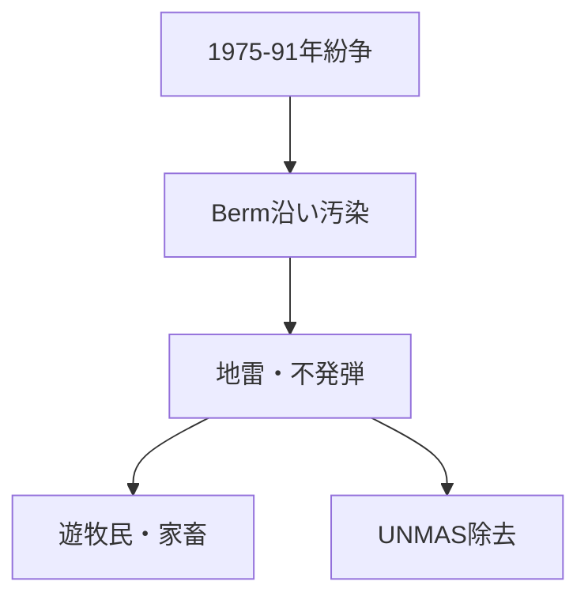

# モロッコ・モーリタニア砂漠レイブの主催者、宗教、地雷、鉄道、紛争史

## 1. エグゼクティブサマリー

モロッコ南部から西サハラ、モーリタニアへ向かう砂漠地帯の「レイブ」は、一つの現象ではない。映画『Sirât』が描くような遊牧的な free party、モロッコの psytrance フェス、Ouarzazate 周辺の商業電子音楽フェス、M'hamid El Ghizlane の地域音楽・教育フェスは、主催者も目的も違う。現時点で確認できる範囲では、これらを宗教団体や政治組織が一元的に主導しているとは言えない。<SourceNote>『Sirât』の前提は [Festival de Cannes](https://www.festival-cannes.com/en/2025/sirat-oliver-laxes-mystical-odyssey-in-the-desert/) と [The Guardian](https://www.theguardian.com/film/2026/feb/09/cinemas-new-rave-desert-thriller-sirat-deep-dives-into-dance-culture-oliver-laxe) に基づく。Transahara は [Underground Sound](https://undergroundsound.eu/festivals/transahara-the-most-authentic-desert-psy-trance-festival/) 、Zamane/Joudour Sahara は [Joudour Sahara](https://joudoursahara.org/zamane/) に基づく。</SourceNote>

宗教分布はかなり明確である。モロッコは人口の99%超がスンニ派ムスリムとされ、国家はマリキ派スンニ・アシュアリー系の教育と宗教管理を重視する。モーリタニアも政府推計で約99%がスンニ派ムスリムで、イスラムが国家と市民の唯一の宗教と位置づけられる。したがって、レイブとの宗教関連性は「宗教団体が主催している」というより、保守的イスラム社会の規範、観光・若者文化、欧州 free party 文化、Sufi/Gnawa 系音楽伝統が交差する背景として読むべきである。<SourceNote>[U.S. Department of State, 2023 Report on International Religious Freedom: Morocco](https://www.state.gov/reports/2023-report-on-international-religious-freedom/morocco/) と [Mauritania](https://www.state.gov/reports/2023-report-on-international-religious-freedom/mauritania/) に基づく。Gnawa の宗教文化的性格は [UNESCO, Gnawa decision 14.COM 10.B.26](https://ich.unesco.org/en/decisions/14.COM/10.B.26) に基づく。</SourceNote>

安全保障上の核心は、西サハラの Moroccan Berm と地雷・不発弾である。UNMAS は、汚染の多くが地域を分断する 1,465km の砂の Berm 沿いに集中するとし、2008年以降に約1億5000万平方メートルの危険地を解放したと報告する。一方で、一般に Moroccan Wall / Berm 全体は 2,700km 級とも表記される。ここは「砂漠は空白地帯」というイメージではなく、停戦監視、地雷除去、遊牧民の移動、軍事境界が重なる空間として見る必要がある。<SourceNote>[UNMAS, Territory of Western Sahara](https://unmas.org/en/where-we-work/territory-of-western-sahara)、[MINURSO, Mine action](https://minurso.unmissions.org/en/mine-action)、[Mine Action Review, Western Sahara](https://www.mineactionreview.org/country/western-sahara/) に基づく。</SourceNote>

鉄道は、モーリタニア側に実在する SNIM の鉄鉱石鉄道が重要である。公式資料は、既存鉄道が 704km の単線で、M'Haoudatt 側から Nouadhibou の鉱石港までを結ぶと説明する。映画や旅行記で印象的に扱われる鉄鉱石列車はこの産業インフラであり、地雷帯や西サハラの政治境界と同一視してはいけない。<SourceNote>[SNIM, Plan de participation des parties prenantes, Octobre 2024 PDF](https://snim.com/sites/default/files/RAPPORT%20P3P%20SNIM%20V%20FINAL%20OCT%202024.pdf) に基づく。モロッコの鉄道拡張計画は [Reuters, Morocco launches $10 billion rail expansion plan](https://www.reuters.com/world/africa/morocco-launches-10-billion-rail-expansion-plan-2025-04-24/) と [France 24](https://www.france24.com/en/africa/20250424-morocco-green-lights-10-billion-rail-expansion-plan) に基づく。</SourceNote>

## 2. 「砂漠レイブ」を三つに分ける

第一は、映画『Sirât』が強く可視化した free party 的なレイブ像である。Cannes 公式は、父と息子がモロッコのレイブで失踪した娘を探す物語として同作を説明する。Guardian は、Oliver Laxe が撮影のためにモロッコ砂漠で自前の音楽フェスティバルを組み、欧州各地から lifelong ravers が参加したと報じている。これは実在の rave culture を取り込んだ作品だが、映画内のレイブを、特定の現地団体が定期開催する公的イベントと同一視するのは危険である。<SourceNote>[Festival de Cannes](https://www.festival-cannes.com/en/2025/sirat-oliver-laxes-mystical-odyssey-in-the-desert/) と [The Guardian](https://www.theguardian.com/film/2026/feb/09/cinemas-new-rave-desert-thriller-sirat-deep-dives-into-dance-culture-oliver-laxe)、[Film Comment interview](https://www.filmcomment.com/interview-oliver-laxe-on-sirat/) に基づく。</SourceNote>

第二は、Transahara のような psytrance 系の砂漠フェスである。Underground Sound は、Transahara を Merzouga 北方の非公開砂丘で行われる psytrance desert festival と説明し、関連コレクティブとして Nomadstribe を挙げる。ただし、場所は非公開で、開催継続性や中止の有無は年によって揺れる。したがって、これは「宗教団体」でも「国家的文化政策」でもなく、国際的な psytrance / festival travel 圏の運営コレクティブとして見るのが妥当である。<SourceNote>[Underground Sound, Transahara](https://undergroundsound.eu/festivals/transahara-the-most-authentic-desert-psy-trance-festival/) と [Transahara Instagram](https://www.instagram.com/transaharafestival/?hl=en) に基づく。</SourceNote>

第三は、Joudour Sahara / Zamane のような地域文化・教育型の音楽事業である。Zamane は M'hamid El Ghizlane で開催され、2025年版では225人超の若者・ミュージシャン、150人超の Gnawa 系若者・ミュージシャンを含んだと説明される。Joudour Sahara は Playing For Change Foundation のプログラムで、音楽教育、女性や若者の機会、環境・反砂漠化、地域文化継承を掲げる。これは「レイブ」ではなく、サハラ地域の文化インフラである。<SourceNote>[Joudour Sahara, Zamane](https://joudoursahara.org/zamane/) と [Joudour Sahara, About](https://joudoursahara.org/about/) に基づく。</SourceNote>

| 類型 | 例 | 主導主体 | 読み方 |
| --- | --- | --- | --- |
| 映画的 free party | 『Sirât』の砂漠レイブ | 映画制作側と欧州 rave culture 参加者 | 実在文化を使った演出。定期現地イベントとは断定しない |
| psytrance 砂漠フェス | Transahara | Nomadstribe とされる運営コレクティブ | 非公開立地・国際参加型。宗教団体ではない |
| 地域文化フェス | Zamane / Joudour Sahara | Playing For Change Foundation 系プログラムと地域パートナー | 音楽教育・文化継承・環境事業。レイブではない |
| 商業電子音楽フェス | Oasis: Into the Wild など | 商業フェス運営 | 観光・都市電子音楽産業。西サハラ/モーリタニアの危険地帯とは別 |

## 3. 宗教分布とレイブとの関連性

モロッコとモーリタニアはいずれも、宗教的にはスンニ派イスラムが圧倒的多数である。モロッコでは、国務省報告が人口 3,740万人、スンニ派ムスリム 99%超、キリスト教徒・ユダヤ教徒・シーア派・バハイなどは合計1%未満と整理する。同報告は、政府がマリキ派スンニ・アシュアリー系の教育、説教、宗教資料配布を管理することも述べている。<SourceNote>[U.S. Department of State, Morocco 2023 IRF Report](https://www.state.gov/reports/2023-report-on-international-religious-freedom/morocco/) に基づく。</SourceNote>

モーリタニアでは、政府推計で約99%がスンニ派ムスリム、非ムスリムはほぼ非市民居住者とされる。イスラムは国家と市民の唯一の宗教とされ、背教・冒涜は死刑相当の犯罪と規定されるが、同報告はこれらの犯罪に死刑が適用されたことはないと説明している。宗教的自由の制度空間は、モロッコよりさらに狭い。<SourceNote>[U.S. Department of State, Mauritania 2023 IRF Report](https://www.state.gov/reports/2023-report-on-international-religious-freedom/mauritania/) に基づく。</SourceNote>

レイブとの関係は三つに分けられる。第一に、主催団体の宗教性である。確認できる主要事例では、Transahara は psytrance / festival travel 系、Joudour Sahara は音楽教育・地域開発系、Oasis は商業電子音楽フェスであり、宗教団体が主催しているとは確認できない。第二に、社会規範との摩擦である。保守的なイスラム社会では、飲酒、薬物、男女混合の夜間イベント、外国人観光客の行動は、宗教法そのものだけでなく、警察行政、家族規範、地域社会の評判と結びつく。第三に、音楽文化の宗教的層である。Gnawa は UNESCO が Sufi brotherhood music として説明するように、治癒儀礼・霊的実践・音楽が結びつく文化であり、電子音楽フェスと単純に同じではない。<SourceNote>主催者類型は [Underground Sound](https://undergroundsound.eu/festivals/transahara-the-most-authentic-desert-psy-trance-festival/)、[Joudour Sahara](https://joudoursahara.org/about/)、[OkayAfrica, Oasis Into the Wild](https://www.okayafrica.com/oasis-into-the-wild-is-bringing-electronic-music-to-the-moroccan-desert/143200) を比較した。Gnawa については [UNESCO](https://ich.unesco.org/en/decisions/14.COM/10.B.26) に基づく。</SourceNote>

『Sirât』の宗教関連性は別物である。同作の題名はイスラム文化の Sirāt Bridge を参照し、Cannes 公式も「地獄と天国を分ける橋」と説明する。つまり、映画はレイブを宗教儀礼として描くのではなく、喪失、通過、死、共同性を考えるための象徴としてイスラム的イメージを使っている。現実の砂漠フェスや現地宗教分布を読む根拠としてではなく、映画的な読みとして扱うべきである。<SourceNote>[Festival de Cannes](https://www.festival-cannes.com/en/2025/sirat-oliver-laxes-mystical-odyssey-in-the-desert/) と [Film Comment interview](https://www.filmcomment.com/interview-oliver-laxe-on-sirat/) に基づく。</SourceNote>

## 4. 地雷地帯はどれだけあるのか

西サハラの地雷問題は、面積よりも「Berm とその周辺」という線的な危険として理解した方が正確である。UNMAS は、1975-1991年の紛争の遺産として、地雷と不発弾の多くが地域を分断する 1,465km の砂の Berm 沿いに集中していると説明する。2008年以降、UNMAS Western Sahara は約1億5000万平方メートルの危険地を解放し、既知地雷原67件中43件、クラスター弾着弾区域541件中508件を解放したとする。<SourceNote>[UNMAS, Territory of Western Sahara](https://unmas.org/en/where-we-work/territory-of-western-sahara) に基づく。データは同ページの 2026年1月時点情報と 2026年6月更新表示に基づく。</SourceNote>

MINURSO 側の mine action ページでは、2008年以降に 8,400万平方メートル超の危険地解放、66件中42件の既知地雷原解放、540件中505件のクラスター弾着弾区域解放が示されている。UNMAS の別ページより数字が小さいのは、更新時点や集計範囲が違うためと見られる。本文では新しい UNMAS ページの数値を主に使うが、重要なのは「総面積が一つに確定されている」のではなく、既知区域・疑い区域・解放済み区域・Berm 長で管理されているという点である。<SourceNote>[MINURSO, Mine action](https://minurso.unmissions.org/en/mine-action) と [UNMAS, Territory of Western Sahara](https://unmas.org/en/where-we-work/territory-of-western-sahara) の数値を比較した。</SourceNote>

モーリタニア国内の汚染も、西サハラ紛争の遺産である。Landmine Monitor は、モーリタニアの汚染は1975-1978年の西サハラ紛争に由来し、2024年末時点で対人地雷の confirmed hazardous area が22件、クラスター弾残存物の confirmed hazardous area が9件、さらにクラスター弾残存物の suspected hazardous area 1.5平方キロメートル、不発弾等の suspected hazardous area 16.88平方キロメートルがあると整理する。<SourceNote>[Landmine and Cluster Munition Monitor, Mauritania impact profile](https://the-monitor.org/country-profile/mauritania/impact) に基づく。</SourceNote>

## 5. 鉄道はどこにあるのか

この地域で実在性が高く、象徴性も強い鉄道は、モーリタニアの SNIM 鉄鉱石鉄道である。SNIM の2024年ステークホルダー参加計画は、既存鉄道が 704km の単線で、M'Haoudatt 駅から Nouadhibou の鉱石港までを結び、17か所の待避線で列車交換を可能にしていると説明する。SNIM は Zouerate から Nouadhibou までの鉄道敷を保有するとされる。<SourceNote>[SNIM, RAPPORT P3P SNIM V FINAL OCT 2024 PDF](https://snim.com/sites/default/files/RAPPORT%20P3P%20SNIM%20V%20FINAL%20OCT%202024.pdf) に基づく。</SourceNote>

モロッコ側は、鉄道網の近代化・高速鉄道延伸を進めているが、現在の砂漠レイブ候補地や西サハラの Berm 周辺を直接結ぶ実在鉄道としては扱えない。2025年に報じられた約960億ディルハム規模の鉄道拡張計画は、2030年までの高速鉄道 Marrakech 延伸などが中心である。将来的な南部延伸構想と、現時点の砂漠移動経路は分けて読む必要がある。<SourceNote>[Reuters](https://www.reuters.com/world/africa/morocco-launches-10-billion-rail-expansion-plan-2025-04-24/) と [France 24](https://www.france24.com/en/africa/20250424-morocco-green-lights-10-billion-rail-expansion-plan) に基づく。</SourceNote>

## 6. 歴史・紛争・社会問題

対象地域の政治史は、西サハラを抜きに説明できない。西サハラは1976年までスペイン植民地であり、脱植民地化の過程でモロッコとモーリタニアが領有を主張し、Frente POLISARIO が反対した。1975年の Madrid Accords でスペインの行政責任がモロッコとモーリタニアに移されると、POLISARIO と両国の間で武力紛争が起きた。モーリタニアは1979年に領有主張を放棄し、モロッコがその部分も管理するようになった。<SourceNote>[MINURSO, Background](https://minurso.unmissions.org/en/background) と [Britannica, Western Sahara](https://www.britannica.com/place/Western-Sahara) に基づく。</SourceNote>

1991年、安保理決議690で MINURSO が設立され、住民投票を準備する予定だった。しかし、有権者認定などをめぐる対立で投票は実施されず、MINURSO は停戦監視、軍事動向の監視、地雷・不発弾リスク低減を続けている。2020年には POLISARIO が停戦離脱と武装闘争再開を宣言し、停戦は以前のような安定を失った。2025年の安保理決議2797は MINURSO 任務を1年延長し、モロッコの自治提案を交渉の基礎として扱う方向を強めたが、POLISARIO とアルジェリアは自己決定権を主張し続けている。<SourceNote>[MINURSO, Mandate](https://minurso.unmissions.org/en/mandate)、[MINURSO, Background](https://minurso.unmissions.org/en/background)、[Security Council Report, Western Sahara April 2026](https://www.securitycouncilreport.org/monthly-forecast/2026-04/western-sahara-16.php) に基づく。</SourceNote>

社会問題は二つの層で見るべきである。西サハラでは、Freedom House が同地域を国連上の非自治地域とし、モロッコが4分の3超を支配していると整理する。モロッコ統治下では、サハラウィの自己決定を支持する活動家やジャーナリストへのハラスメント、逮捕、移動・表現の制約が指摘される。<SourceNote>[Freedom House, Western Sahara 2025](https://freedomhouse.org/country/western-sahara/freedom-world/2025)、[Amnesty International, Morocco and Western Sahara](https://www.amnesty.org/en/location/middle-east-and-north-africa/north-africa/morocco-and-western-sahara/report-morocco-and-western-sahara/)、[Human Rights Watch, Morocco/Western Sahara](https://www.hrw.org/middle-east/north-africa/morocco/western-sahara) に基づく。</SourceNote>

モーリタニアでは、奴隷制の制度的遺産、Haratine や Afro-Mauritanian への差別、活動家への圧力、雇用と抽出産業依存が中心論点である。Freedom House は、政府が奴隷制と差別への対応を進めている一方で、関連活動家の逮捕もあると整理する。気候面では、GIZ/PIK の Climate Risk Profile が、2080年までに気温が産業化以前比で 2.0-4.5度上昇し、水資源、農牧業、干ばつ・洪水、砂漠化が生計に影響すると予測している。<SourceNote>[Freedom House, Mauritania 2025](https://freedomhouse.org/country/mauritania/freedom-world/2025) と [PIK/GIZ, Climate Risk Profile: Mauritania](https://www.pik-potsdam.de/en/institute/departments/climate-resilience/projects/project-pages/agrica/giz_climate-risk-profile-mauritania_en_final) に基づく。</SourceNote>

## 7. 実務的な読み方

この地域の砂漠レイブを理解するには、三つの誤読を避けるべきである。第一に、映画的な無法地帯イメージで現実の安全保障を読むこと。地雷、不発弾、軍事境界、国連監視は、観光地図には出にくいが実在する。第二に、宗教を単純な対立軸にすること。主催者の多くは宗教団体ではないが、イベントの許容範囲はスンニ派マリキ法学派中心の国家・社会規範の中で決まる。第三に、鉄鉱石列車や砂漠の移動を「冒険」としてだけ読むこと。SNIM 鉄道は産業インフラであり、地域社会の雇用、鉱業依存、国家財政と結びついている。<SourceNote>安全保障は [UNMAS](https://unmas.org/en/where-we-work/territory-of-western-sahara)、宗教は [State Department Morocco](https://www.state.gov/reports/2023-report-on-international-religious-freedom/morocco/) と [Mauritania](https://www.state.gov/reports/2023-report-on-international-religious-freedom/mauritania/)、鉄道は [SNIM PDF](https://snim.com/sites/default/files/RAPPORT%20P3P%20SNIM%20V%20FINAL%20OCT%202024.pdf) に基づく。</SourceNote>

結論として、モロッコ・モーリタニア周辺の砂漠レイブは、宗教運動でも地政学運動でもない。むしろ、欧州 free party 文化、モロッコの観光・フェス産業、サハラ地域の音楽教育、イスラム社会の規範、未解決の西サハラ紛争、鉱業インフラが同じ地図上で重なって見える現象である。調査や訪問の判断では、イベント名ではなく、開催地、許認可、主催者、国境・軍事境界、地雷情報、移動手段を個別に確認する必要がある。<SourceNote>この結論は、上記の映画祭資料、イベント資料、宗教自由報告、UN/MINURSO/UNMAS、Landmine Monitor、SNIM 資料を統合した公表情報からの推定である。</SourceNote>

## 参考情報

- [Festival de Cannes, Sirât, Oliver Laxe's mystical odyssey in the desert](https://www.festival-cannes.com/en/2025/sirat-oliver-laxes-mystical-odyssey-in-the-desert/)
- [The Guardian, how Sirāt went on a road trip to the dark heart of rave](https://www.theguardian.com/film/2026/feb/09/cinemas-new-rave-desert-thriller-sirat-deep-dives-into-dance-culture-oliver-laxe)
- [Film Comment, Interview: Oliver Laxe on Sirât](https://www.filmcomment.com/interview-oliver-laxe-on-sirat/)
- [Underground Sound, Transahara](https://undergroundsound.eu/festivals/transahara-the-most-authentic-desert-psy-trance-festival/)
- [Joudour Sahara, Zamane](https://joudoursahara.org/zamane/)
- [Joudour Sahara, About](https://joudoursahara.org/about/)
- [U.S. Department of State, 2023 Report on International Religious Freedom: Morocco](https://www.state.gov/reports/2023-report-on-international-religious-freedom/morocco/)
- [U.S. Department of State, 2023 Report on International Religious Freedom: Mauritania](https://www.state.gov/reports/2023-report-on-international-religious-freedom/mauritania/)
- [UNESCO, Gnawa decision 14.COM 10.B.26](https://ich.unesco.org/en/decisions/14.COM/10.B.26)
- [UNMAS, Territory of Western Sahara](https://unmas.org/en/where-we-work/territory-of-western-sahara)
- [MINURSO, Mine action](https://minurso.unmissions.org/en/mine-action)
- [Landmine and Cluster Munition Monitor, Mauritania impact profile](https://the-monitor.org/country-profile/mauritania/impact)
- [MINURSO, Background](https://minurso.unmissions.org/en/background)
- [MINURSO, Mandate](https://minurso.unmissions.org/en/mandate)
- [Security Council Report, Western Sahara April 2026](https://www.securitycouncilreport.org/monthly-forecast/2026-04/western-sahara-16.php)
- [SNIM, Plan de participation des parties prenantes PDF](https://snim.com/sites/default/files/RAPPORT%20P3P%20SNIM%20V%20FINAL%20OCT%202024.pdf)
- [Freedom House, Western Sahara 2025](https://freedomhouse.org/country/western-sahara/freedom-world/2025)
- [Freedom House, Mauritania 2025](https://freedomhouse.org/country/mauritania/freedom-world/2025)
- [PIK/GIZ, Climate Risk Profile: Mauritania](https://www.pik-potsdam.de/en/institute/departments/climate-resilience/projects/project-pages/agrica/giz_climate-risk-profile-mauritania_en_final)
