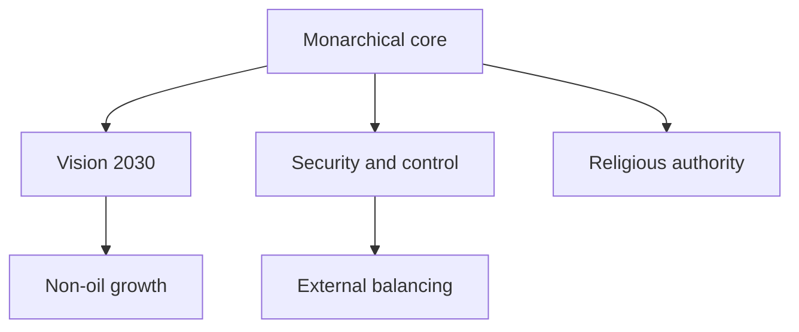
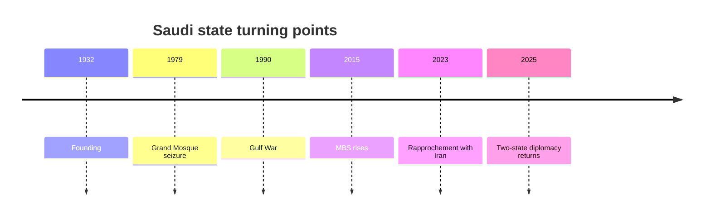

# A Kingdom Changing While Staying an Oil State

## 1. Executive Summary

Saudi Arabia is less a kingdom that lives on oil than a kingdom that keeps rule alive with oil while rebuilding its governing base. <SourceNote>[Saudi government system overview](https://my.gov.sa/en/content/govmechanism) and [Vision 2030 overview](https://www.vision2030.gov.sa/en/overview) support this reading.</SourceNote>

The crown, religious authority, the security state, Vision 2030, and external balancing all sit inside the same governing machine, so domestic reform and foreign policy cannot be separated. <SourceNote>[Vision 2030 official reports](https://www.vision2030.gov.sa/en/annual-reports/annual-report-2024/) and [Saudi Shura Council](https://shura.gov.sa/wps/wcm/connect/ShuraEn/internet/Home/) support this reading.</SourceNote>

The Salman-MBS center tries to modernize the state while keeping political participation tightly managed. <SourceNote>[Saudi government system overview](https://my.gov.sa/en/content/govmechanism) and [Freedom House, Saudi Arabia 2026](https://freedomhouse.org/country/saudi-arabia/freedom-world/2026) support this reading.</SourceNote>

For Japan, Saudi Arabia is not just a crude supplier and shipping node; it is also a key point for reading Gulf order and Saudi-U.S., Saudi-China, and Saudi-Iran relations. <SourceNote>[IMF, Saudi Arabia Article IV 2026](https://www.imf.org/en/Countries/SAU) and [Vision 2030 official reports](https://www.vision2030.gov.sa/en/annual-reports/annual-report-2024/) support this reading.</SourceNote>

## 2. Historical and State Formation

Modern Saudi Arabia was shaped by the 1932 founding, its alliance with religious authority, the nationalization of oil revenue, the 1979 Grand Mosque seizure, and the 1990-91 Gulf War. <SourceNote>[Saudi history overview](https://my.gov.sa/en/content/know-about-kingdom) and [Britannica, Saudi Arabia](https://www.britannica.com/place/Saudi-Arabia) support this reading.</SourceNote>

1979 matters because the Iranian Revolution and a domestic religious shock happened at the same time, which sharpened Saudi Arabia’s sense of security and social control. <SourceNote>[Britannica, Saudi Arabia](https://www.britannica.com/place/Saudi-Arabia) and [CIA World Factbook, Saudi Arabia](https://www.cia.gov/the-world-factbook/countries/saudi-arabia/) support this reading.</SourceNote>

Since the late 2010s, the main turning points have been MBS’s consolidation of power, the 2018 Khashoggi killing, the 2023 restoration of relations with Iran, and the renewed emphasis on Palestinian diplomacy after 2025. <SourceNote>[Saudi Arabia and Iran joint statement](https://www.mofa.gov.sa/en/ministry/statements/Pages/saudi-arabia-and-iran-joint-statement.aspx) and [Saudi-led two-state initiative](https://www.mofa.gov.sa/en/ministry/statements/Pages/Two-State-Solution-Conference.aspx) support this reading.</SourceNote>

## 3. Political System and Power Structure

Legally, the kingdom is a monarchy, and its basic law says the Qur'an and the Sunna are the basis of governance. <SourceNote>[Saudi government system overview](https://my.gov.sa/en/content/govmechanism) supports this reading.</SourceNote>

There is no national party competition or competitive election at the top level, and the members of the Shura Council are appointed by the king. <SourceNote>[Saudi Shura Council](https://shura.gov.sa/wps/wcm/connect/ShuraEn/internet/Home/) and [Freedom House, Saudi Arabia 2026](https://freedomhouse.org/country/saudi-arabia/freedom-world/2026) support this reading.</SourceNote>

As a result, legislation, oversight, the budget, security, and religious administration all converge on royal consolidation even when they appear institutionally separate. <SourceNote>[Saudi government system overview](https://my.gov.sa/en/content/govmechanism) and [Saudi Shura Council](https://shura.gov.sa/wps/wcm/connect/ShuraEn/internet/Home/) support this reading.</SourceNote>

In practice, the kingdom is driven by the king, the crown prince and prime minister, the ministries of interior, defense, and foreign affairs, the PIF, and the religious establishment. <SourceNote>[PIF annual report 2024](https://www.pif.gov.sa/en/annual-report/) and [Saudi government system overview](https://my.gov.sa/en/content/govmechanism) support this reading.</SourceNote>

| Main actor | Role | What to watch |
| --- | --- | --- |
| King Salman | Final arbiter of the system | Succession and legitimacy |
| Crown Prince MBS | Policy engine | Reform, control, external bargaining |
| PIF | State capital vehicle | Megaprojects and industrial policy |
| Shura Council | Appointed advisory body | How far institutional change can go |

## 4. Foreign Relations

The U.S. relationship rests on security cooperation that dates back to the 1945 Quincy meeting. <SourceNote>[U.S. relations with Saudi Arabia](https://www.state.gov/u-s-relations-with-saudi-arabia/) supports this reading.</SourceNote>

But in recent years the relationship has become more conditional around deterrence against Iran, Gaza ceasefire diplomacy, oil policy, and human rights. <SourceNote>[U.S. relations with Saudi Arabia](https://www.state.gov/u-s-relations-with-saudi-arabia/) and [Freedom House, Saudi Arabia 2026](https://freedomhouse.org/country/saudi-arabia/freedom-world/2026) support this reading.</SourceNote>

The China relationship is deep at three layers: oil and investment, industrial cooperation, and diplomatic mediation. <SourceNote>[China-Saudi joint statement](https://www.fmprc.gov.cn/eng/zy/wjdt/ghxx/202312/t20231209_11202539.html) and [Vision 2030 annual report 2024](https://www.vision2030.gov.sa/en/annual-reports/annual-report-2024/) support this reading.</SourceNote>

The 2023 Saudi-Iran rapprochement brokered in Beijing showed that Saudi Arabia can use China not as a security substitute, but as a mediator for tension management. <SourceNote>[Saudi Arabia and Iran joint statement](https://www.mofa.gov.sa/en/ministry/statements/Pages/saudi-arabia-and-iran-joint-statement.aspx) supports this reading.</SourceNote>

Relations with Iran have improved, but the regional competition itself has not disappeared. <SourceNote>[Saudi Arabia and Iran joint statement](https://www.mofa.gov.sa/en/ministry/statements/Pages/saudi-arabia-and-iran-joint-statement.aspx) and [U.S. relations with Saudi Arabia](https://www.state.gov/u-s-relations-with-saudi-arabia/) support this reading.</SourceNote>

In Yemen, Saudi Arabia is looking for an exit from a long war, but border security and Red Sea instability remain. <SourceNote>[UN Yemen briefings](https://www.un.org/sg/en/content/sg/press-encounter/2025-05-14/un-special-envoy-for-yemen-hans-grundberg) and [Reuters, Middle East coverage](https://www.reuters.com/world/middle-east/) support this reading.</SourceNote>

Normalization with Israel will not move forward, as Riyadh has made clear, without recognition of an independent Palestinian state. <SourceNote>[Saudi-led two-state initiative](https://www.mofa.gov.sa/en/ministry/statements/Pages/Two-State-Solution-Conference.aspx) and [Reuters, Middle East coverage](https://www.reuters.com/world/middle-east/) support this reading.</SourceNote>

| Counterpart | Main logic | What to verify |
| --- | --- | --- |
| United States | Security anchor | Defense ties, human rights, oil policy |
| China | Investment and mediation | Energy, industry, technology cooperation |
| Iran | Tension management and rivalry | Durability of dialogue and proxy activity |
| Yemen | Border and sea-lane security | Truce, missiles, Red Sea safety |
| Israel / Palestine | Conditional normalization | Whether two-state diplomacy becomes concrete |

## 5. Society, Economy, and Everyday Life

Vision 2030 is not just branding around de-oilization; it is an official redistribution plan that bundles state investment, tourism, logistics, entertainment, and women’s employment. <SourceNote>[Vision 2030 overview](https://www.vision2030.gov.sa/en/overview) and [Vision 2030 annual report 2024](https://www.vision2030.gov.sa/en/annual-reports/annual-report-2024/) support this reading.</SourceNote>

The 2024 Vision 2030 report says international tourism rose, women’s labor-force participation increased, and non-oil exports expanded. <SourceNote>[Vision 2030 annual report 2024](https://www.vision2030.gov.sa/en/annual-reports/annual-report-2024/) supports this reading.</SourceNote>

Still, oil remains the base of the economy, and the IMF sees strong non-oil growth as requiring structural reform and demand management. <SourceNote>[IMF, Saudi Arabia Article IV 2026](https://www.imf.org/en/Countries/SAU) supports this reading.</SourceNote>

The population reached 35.3 million in mid-2024, and non-Saudis were about 15.7 million, or about 44 percent. <SourceNote>[GASTAT, Population Estimates 2024](https://www.stats.gov.sa/en/news/2024-population-estimates) supports this reading.</SourceNote>

That population mix offers the advantages of youth and urbanization, but it also imports the frictions of migrant labor and social control. <SourceNote>[GASTAT, Population Estimates 2024](https://www.stats.gov.sa/en/news/2024-population-estimates) and [ILO Saudi Arabia materials](https://www.ilo.org/) support this reading.</SourceNote>

Freedom House still classifies Saudi Arabia as Not Free in 2026, while HRW and Amnesty continue to flag restrictions on speech, labor exploitation, passport confiscation, and freedom of movement. <SourceNote>[Freedom House, Saudi Arabia 2026](https://freedomhouse.org/country/saudi-arabia/freedom-world/2026), [Human Rights Watch, World Report 2026](https://www.hrw.org/world-report/2026), and [Amnesty International, Saudi Arabia](https://www.amnesty.org/en/location/middle-east-and-north-africa/saudi-arabia/) support this reading.</SourceNote>

Women's public participation has increased, but that does not mean political freedom has expanded in parallel. <SourceNote>[Vision 2030 annual report 2024](https://www.vision2030.gov.sa/en/annual-reports/annual-report-2024/) and [Freedom House, Saudi Arabia 2026](https://freedomhouse.org/country/saudi-arabia/freedom-world/2026) support this reading.</SourceNote>

## 6. What It Means for Japan and East Asia

For Japan, the most important thing is to treat Saudi Arabia both as a crude supplier and as a maker of Gulf political order. <SourceNote>[U.S. relations with Saudi Arabia](https://www.state.gov/u-s-relations-with-saudi-arabia/) and [IMF, Saudi Arabia Article IV 2026](https://www.imf.org/en/Countries/SAU) support this reading.</SourceNote>

When the Strait of Hormuz, the Red Sea, Yemen, Iran, or Israel shifts, the shock spreads not only to energy prices but also to insurance, shipping, construction, and investment projects. <SourceNote>[UN Yemen briefings](https://www.un.org/sg/en/content/sg/press-encounter/2025-05-14/un-special-envoy-for-yemen-hans-grundberg) and [Reuters, Middle East coverage](https://www.reuters.com/world/middle-east/) support this reading.</SourceNote>

On the investment side, PIF-led megaprojects are attractive, but contract enforcement, labor, sanctions, and reputational risk all have to be assessed at once. <SourceNote>[PIF annual report 2024](https://www.pif.gov.sa/en/annual-report/) and [Human Rights Watch, World Report 2026](https://www.hrw.org/world-report/2026) support this reading.</SourceNote>

## 7. Monitoring Points and Limits

The key monitoring points are oil policy, defense cooperation with the United States, economic dependence on China, tension with Iran, and regional reordering after the Gaza ceasefire debate. <SourceNote>[IMF, Saudi Arabia Article IV 2026](https://www.imf.org/en/Countries/SAU) and [U.S. relations with Saudi Arabia](https://www.state.gov/u-s-relations-with-saudi-arabia/) support this reading.</SourceNote>

This country cannot be read through a single line because it pushes liberalization and control, modernization and conservatism, regional stability and outward assertiveness at the same time. <SourceNote>[Vision 2030 overview](https://www.vision2030.gov.sa/en/overview) and [Freedom House, Saudi Arabia 2026](https://freedomhouse.org/country/saudi-arabia/freedom-world/2026) support this reading.</SourceNote>

So in news reading, it is better to track power distribution, cash allocation, and diplomatic priorities than the performance of reform rhetoric. <SourceNote>[Vision 2030 annual report 2024](https://www.vision2030.gov.sa/en/annual-reports/annual-report-2024/) supports this reading.</SourceNote>

On the basis of public information, Saudi Arabia looks less like a state leaving oil behind than a state redesigning governance with oil money. <SourceNote>[Vision 2030 overview](https://www.vision2030.gov.sa/en/overview) and [IMF, Saudi Arabia Article IV 2026](https://www.imf.org/en/Countries/SAU) support this reading.</SourceNote>

## References

- [Saudi government system overview](https://my.gov.sa/en/content/govmechanism)
- [Saudi history overview](https://my.gov.sa/en/content/know-about-kingdom)
- [Saudi Shura Council](https://shura.gov.sa/wps/wcm/connect/ShuraEn/internet/Home/)
- [Vision 2030 overview](https://www.vision2030.gov.sa/en/overview)
- [Vision 2030 annual report 2024](https://www.vision2030.gov.sa/en/annual-reports/annual-report-2024/)
- [Saudi Arabia and Iran joint statement](https://www.mofa.gov.sa/en/ministry/statements/Pages/saudi-arabia-and-iran-joint-statement.aspx)
- [Saudi-led two-state initiative](https://www.mofa.gov.sa/en/ministry/statements/Pages/Two-State-Solution-Conference.aspx)
- [U.S. relations with Saudi Arabia](https://www.state.gov/u-s-relations-with-saudi-arabia/)
- [GASTAT, Population Estimates 2024](https://www.stats.gov.sa/en/news/2024-population-estimates)
- [Freedom House, Saudi Arabia 2026](https://freedomhouse.org/country/saudi-arabia/freedom-world/2026)
- [Human Rights Watch, World Report 2026](https://www.hrw.org/world-report/2026)
