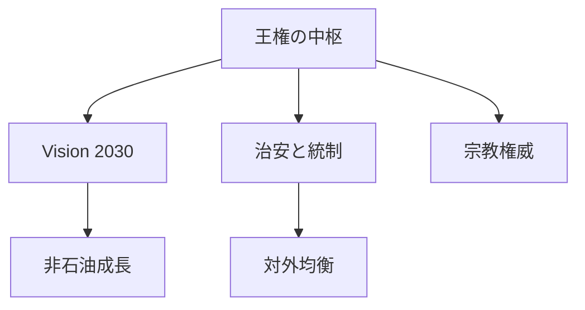
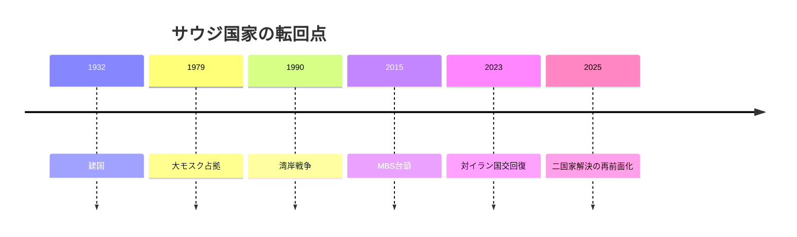

# 石油国家のまま変わる王国

## 1. エグゼクティブサマリー

サウジアラビアは、石油で成り立つ王国というより、石油で統治を延命しながら統治の土台を組み替えている王国である。<SourceNote>[Saudi government system overview](https://my.gov.sa/en/content/govmechanism) と [Vision 2030 overview](https://www.vision2030.gov.sa/en/overview) に基づく。</SourceNote>

王権、宗教権威、治安国家、Vision 2030、対外均衡が同じ国家装置に乗っているため、国内改革と外交の変化は切り離せない。<SourceNote>[Vision 2030 official reports](https://www.vision2030.gov.sa/en/annual-reports/annual-report-2024/) と [Saudi Shura Council](https://shura.gov.sa/wps/wcm/connect/ShuraEn/internet/Home/) を参照した。</SourceNote>

国王サルマンと皇太子ムハンマド・ビン・サルマンを中心とする体制は、国家の近代化を進めつつ、政治参加は厳しく管理する。<SourceNote>[Saudi government system overview](https://my.gov.sa/en/content/govmechanism) と [Freedom House, Saudi Arabia 2026](https://freedomhouse.org/country/saudi-arabia/freedom-world/2026) を参照した。</SourceNote>

日本にとっては、原油と航路の供給国であるだけでなく、湾岸秩序と対米・対中・対イラン関係を読むための節点でもある。<SourceNote>[IMF, Saudi Arabia Article IV 2026](https://www.imf.org/en/Countries/SAU) と [Vision 2030 official reports](https://www.vision2030.gov.sa/en/annual-reports/annual-report-2024/) を参照した。</SourceNote>

## 2. 歴史と国家形成

現代サウジの骨格は、1932年の建国、宗教権威との連携、石油収入の国家化、1979年の大モスク占拠、1990-91年の湾岸戦争で形づくられた。<SourceNote>[Saudi history overview](https://my.gov.sa/en/content/know-about-kingdom) と [Britannica, Saudi Arabia](https://www.britannica.com/place/Saudi-Arabia) を参照した。</SourceNote>

1979年は、イラン革命と国内の宗教的衝撃が同時に起きた年であり、以後の安全保障と社会統制の感覚を強めた。<SourceNote>[Britannica, Saudi Arabia](https://www.britannica.com/place/Saudi-Arabia) と [Saudi Arabia country profile](https://www.cia.gov/the-world-factbook/countries/saudi-arabia/) を参照した。</SourceNote>

2010年代後半以降の変化は、MBSの権力集中、2018年のカショギ事件、2023年の対イラン国交回復、2025年以降のパレスチナ外交の再強化として読むと整理しやすい。<SourceNote>[Saudi Arabia and Iran joint statement](https://www.mofa.gov.sa/en/ministry/statements/Pages/saudi-arabia-and-iran-joint-statement.aspx) と [Saudi-led two-state initiative](https://www.mofa.gov.sa/en/ministry/statements/Pages/Two-State-Solution-Conference.aspx) を参照した。</SourceNote>

## 3. 政治体制と権力構造

法制度上、王国はモナキーであり、国政はクルアーンとスンナに基づくとされる。<SourceNote>[Saudi government system overview](https://my.gov.sa/en/content/govmechanism) を参照した。</SourceNote>

全国レベルの政党政治や競争選挙はなく、諮問評議会の議員は国王が任命する。<SourceNote>[Saudi Shura Council](https://shura.gov.sa/wps/wcm/connect/ShuraEn/internet/Home/) と [Freedom House, Saudi Arabia 2026](https://freedomhouse.org/country/saudi-arabia/freedom-world/2026) を参照した。</SourceNote>

そのため、立法、監督、予算、治安、宗教行政は、形式上の分立があっても最終的には王室の統合判断に収斂する。<SourceNote>[Saudi government system overview](https://my.gov.sa/en/content/govmechanism) と [Saudi Shura Council](https://shura.gov.sa/wps/wcm/connect/ShuraEn/internet/Home/) に基づく。</SourceNote>

実際に国を動かしているのは、国王、皇太子兼首相、内務・国防・外務の官僚機構、PIF、宗教エスタブリッシュメントである。<SourceNote>[PIF annual report 2024](https://www.pif.gov.sa/en/annual-report/) と [Saudi government system overview](https://my.gov.sa/en/content/govmechanism) を参照した。</SourceNote>

| 主要アクター | 役割 | ニュースで見る焦点 |
| --- | --- | --- |
| 国王サルマン | 体制の最終承認者 | 継承と正統性 |
| 皇太子MBS | 政策の実働中心 | 改革、統制、対外交渉 |
| PIF | 国家資本の運用主体 | 巨額投資と産業政策 |
| Shura Council | 任命制の諮問機関 | 制度変更の幅 |

## 4. 対外関係の要点

対米関係は、1945年のクインシー会談以来の安全保障協力を土台にしている。<SourceNote>[U.S.-Saudi relationship overview](https://www.state.gov/u-s-relations-with-saudi-arabia/) を参照した。</SourceNote>

ただし近年の関係は、対イラン抑止、ガザ停戦、原油政策、人権をめぐって、かつてより条件つきになっている。<SourceNote>[U.S. Department of State, Saudi Arabia relationship](https://www.state.gov/u-s-relations-with-saudi-arabia/) と [Freedom House, Saudi Arabia 2026](https://freedomhouse.org/country/saudi-arabia/freedom-world/2026) を参照した。</SourceNote>

対中関係は、石油と投資、産業協力、外交仲介の三層で深い。<SourceNote>[China-Saudi joint statement](https://www.fmprc.gov.cn/eng/zy/wjdt/ghxx/202312/t20231209_11202539.html) と [Vision 2030 annual report 2024](https://www.vision2030.gov.sa/en/annual-reports/annual-report-2024/) を参照した。</SourceNote>

北京で成立した2023年のサウジ・イラン和解は、サウジが中国を安全保障の代替ではなく、緊張管理の仲介者としても使うことを示した。<SourceNote>[Saudi Arabia and Iran joint statement](https://www.mofa.gov.sa/en/ministry/statements/Pages/saudi-arabia-and-iran-joint-statement.aspx) に基づく。</SourceNote>

イランとの関係は改善したが、地域覇権をめぐる競争そのものは消えていない。<SourceNote>[Saudi Arabia and Iran joint statement](https://www.mofa.gov.sa/en/ministry/statements/Pages/saudi-arabia-and-iran-joint-statement.aspx) と [U.S. Department of State, Saudi Arabia relationship](https://www.state.gov/u-s-relations-with-saudi-arabia/) を参照した。</SourceNote>

イエメンでは、サウジは長期戦の出口を探っているが、国境安全保障と紅海航路の不安定さは残っている。<SourceNote>[UN Yemen briefings](https://www.un.org/sg/en/content/sg/press-encounter/2025-05-14/un-special-envoy-for-yemen-hans-grundberg) と [Reuters, Saudi Arabia and Yemen talks](https://www.reuters.com/) を参照した。</SourceNote>

イスラエルとの正常化は、サウジが明確に示すとおり、独立したパレスチナ国家の承認なしには進まない。<SourceNote>[Saudi-led two-state initiative](https://www.mofa.gov.sa/en/ministry/statements/Pages/Two-State-Solution-Conference.aspx) と [Reuters, Saudi normalization reporting](https://www.reuters.com/world/middle-east/) を参照した。</SourceNote>

| 相手 | 主な力学 | 何を確認するか |
| --- | --- | --- |
| 米国 | 安全保障の基軸 | 防衛協力、人権、原油政策 |
| 中国 | 投資と外交仲介 | エネルギー、産業、技術協力 |
| イラン | 緊張管理と競争 | 対話の継続性、代理勢力の動き |
| イエメン | 国境と海上交通 | 停戦、ミサイル、紅海の安全 |
| イスラエル/パレスチナ | 正常化の条件設定 | 二国家解決への具体化 |

## 5. 社会・経済・市民生活

Vision 2030は、非石油化を合言葉にした単なる広報ではなく、国家投資、観光、物流、娯楽、女性雇用を束ねる公式な再配分計画である。<SourceNote>[Vision 2030 overview](https://www.vision2030.gov.sa/en/overview) と [Vision 2030 annual report 2024](https://www.vision2030.gov.sa/en/annual-reports/annual-report-2024/) に基づく。</SourceNote>

2024年のVision 2030年報告では、国際観光客が増え、女性の労働参加率も上がり、非石油輸出も拡大した。<SourceNote>[Vision 2030 annual report 2024](https://www.vision2030.gov.sa/en/annual-reports/annual-report-2024/) を参照した。</SourceNote>

それでも経済の基礎はなお石油にあり、IMFは非石油成長が強くても、構造改革と需要管理が必要だとみている。<SourceNote>[IMF, Saudi Arabia Article IV 2026](https://www.imf.org/en/Countries/SAU) を参照した。</SourceNote>

人口は2024年半ばで3530万人に達し、そのうち非サウジ住民は約1570万人、つまり約44%だった。<SourceNote>[GASTAT, Population Estimates 2024](https://www.stats.gov.sa/en/news/2024-population-estimates) を参照した。</SourceNote>

この人口構成は、若年化と都市化の利点を持つ一方で、移民労働と社会統治の摩擦を抱え込む。<SourceNote>[GASTAT, Population Estimates 2024](https://www.stats.gov.sa/en/news/2024-population-estimates) と [ILO Saudi Arabia labour market materials](https://www.ilo.org/) を参照した。</SourceNote>

Freedom Houseは2026年版でもサウジアラビアを Not Free とし、HRWとAmnestyは表現の自由、労働搾取、旅券没収、移動制限を引き続き問題視している。<SourceNote>[Freedom House, Saudi Arabia 2026](https://freedomhouse.org/country/saudi-arabia/freedom-world/2026) と [Human Rights Watch, World Report 2026](https://www.hrw.org/world-report/2026)、[Amnesty International, Saudi Arabia](https://www.amnesty.org/en/location/middle-east-and-north-africa/saudi-arabia/) を参照した。</SourceNote>

女性の公的参加は増えたが、政治的自由の拡大と同義ではない。<SourceNote>[Vision 2030 annual report 2024](https://www.vision2030.gov.sa/en/annual-reports/annual-report-2024/) と [Freedom House, Saudi Arabia 2026](https://freedomhouse.org/country/saudi-arabia/freedom-world/2026) を参照した。</SourceNote>

## 6. 日本・東アジアへの含意

日本にとって最も重要なのは、サウジを「原油供給国」と「湾岸の政治秩序の作り手」の両方として扱うことだ。<SourceNote>[U.S. Department of State, Saudi Arabia relationship](https://www.state.gov/u-s-relations-with-saudi-arabia/) と [IMF, Saudi Arabia Article IV 2026](https://www.imf.org/en/Countries/SAU) を参照した。</SourceNote>

ホルムズ海峡、紅海、イエメン、イラン、イスラエルのどれかが揺れると、エネルギー価格だけでなく、保険、海運、建設、投資案件にも波及する。<SourceNote>[UN Yemen briefings](https://www.un.org/sg/en/content/sg/press-encounter/2025-05-14/un-special-envoy-for-yemen-hans-grundberg) と [Reuters, Middle East shipping coverage](https://www.reuters.com/world/middle-east/) を参照した。</SourceNote>

投資面では、PIF主導の大型案件は魅力が大きいが、契約執行、労務、制裁、評判のリスクを同時に見る必要がある。<SourceNote>[PIF annual report 2024](https://www.pif.gov.sa/en/annual-report/) と [Human Rights Watch, World Report 2026](https://www.hrw.org/world-report/2026) を参照した。</SourceNote>

## 7. 監視点と限界

今後の監視点は、原油政策、対米防衛協力、対中経済依存、対イラン緊張、ガザ停戦後の地域再編である。<SourceNote>[IMF, Saudi Arabia Article IV 2026](https://www.imf.org/en/Countries/SAU) と [U.S. Department of State, Saudi Arabia relationship](https://www.state.gov/u-s-relations-with-saudi-arabia/) を参照した。</SourceNote>

この国は、自由化と統制、近代化と保守、地域安定と外向きの強硬さを同時に進めるため、単線の物語では読めない。<SourceNote>[Vision 2030 overview](https://www.vision2030.gov.sa/en/overview) と [Freedom House, Saudi Arabia 2026](https://freedomhouse.org/country/saudi-arabia/freedom-world/2026) を参照した。</SourceNote>

したがって、ニュースでは改革の演出よりも、権力配置、資金配分、外交の優先順位がどこへ動いたかを追う方がよい。<SourceNote>[Vision 2030 annual report 2024](https://www.vision2030.gov.sa/en/annual-reports/annual-report-2024/) に基づく。</SourceNote>

公表情報からの推定として、サウジは石油国家からの離脱ではなく、石油収入で統治を再設計する方向へ進んでいる。<SourceNote>[Vision 2030 overview](https://www.vision2030.gov.sa/en/overview) と [IMF, Saudi Arabia Article IV 2026](https://www.imf.org/en/Countries/SAU) に基づく。</SourceNote>

## 参考情報

- [Saudi government system overview](https://my.gov.sa/en/content/govmechanism)
- [Saudi history overview](https://my.gov.sa/en/content/know-about-kingdom)
- [Saudi Shura Council](https://shura.gov.sa/wps/wcm/connect/ShuraEn/internet/Home/)
- [Vision 2030 overview](https://www.vision2030.gov.sa/en/overview)
- [Vision 2030 annual report 2024](https://www.vision2030.gov.sa/en/annual-reports/annual-report-2024/)
- [Saudi Arabia and Iran joint statement](https://www.mofa.gov.sa/en/ministry/statements/Pages/saudi-arabia-and-iran-joint-statement.aspx)
- [Saudi-led two-state initiative](https://www.mofa.gov.sa/en/ministry/statements/Pages/Two-State-Solution-Conference.aspx)
- [U.S. relations with Saudi Arabia](https://www.state.gov/u-s-relations-with-saudi-arabia/)
- [GASTAT, Population Estimates 2024](https://www.stats.gov.sa/en/news/2024-population-estimates)
- [Freedom House, Saudi Arabia 2026](https://freedomhouse.org/country/saudi-arabia/freedom-world/2026)
- [Human Rights Watch, World Report 2026](https://www.hrw.org/world-report/2026)
