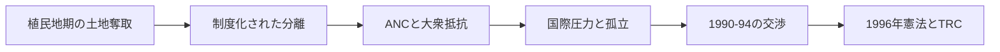

# 南アフリカのアパルトヘイト史と民主化

## 1. エグゼクティブサマリー

南アフリカのアパルトヘイトは、単なる人種差別ではなく、土地、居住、労働、教育、政治参加を分割統治する法制度だった。植民地期の土地奪取と隔離の慣行が土台をつくった。1913年土地法、1936年の政治権利制限、1948年以降の国民党政権、1950年代の人種分類と居住分離法が積み上がり、黒人多数派の生活空間を行政的に狭めた。<SourceNote>[South African History Online, History of apartheid in South Africa](https://www.sahistory.org.za/article/history-apartheid-south-africa), [South African History Online, History of Separate Development in South Africa](https://www.sahistory.org.za/article/history-separate-development-south-africa)</SourceNote>

実務上の読み方は明確である。アパルトヘイトは「偏見が強かった時代」ではなく、法によって人びとの移動、住宅、教育、労働市場、投票権を別々に制御した国家設計だった。民主化後の和解も、暴力の終結と憲法秩序の再建には成功したが、土地と富の再配分、加害責任の追及、世代をまたぐ不平等の修復までは完了していない。<SourceNote>[ANC, The Freedom Charter](https://www.anc1912.org.za/the-freedom-charter-2/), [South African Truth and Reconciliation Commission documentation](https://www.justice.gov.za/trc/), [AP News, South Africa inquiry into apartheid-era killings](https://apnews.com/article/south-africa-apartheid-era-prosecutions-2025)</SourceNote>

この図は、制度化から民主化までの主要な転換点を簡略化したものである。<SourceNote>図は [South African History Online](https://www.sahistory.org.za/article/history-apartheid-south-africa)、[South African History Online](https://www.sahistory.org.za/article/history-separate-development-south-africa)、[ANC, The Freedom Charter](https://www.anc1912.org.za/the-freedom-charter-2/)、[South African TRC documentation](https://www.justice.gov.za/trc/) を統合した公開情報の要約である。</SourceNote>

## 2. 背景と年表

南アフリカの支配構造は、オランダ植民地、英国支配、ボーア系白人国家、そしてアパルトヘイト国家という層の上に形成された。重要なのは、1948年に突然「差別が生まれた」のではなく、それ以前から土地の奪取、都市への制限的流入、雇用の従属化が進んでいたことである。<SourceNote>[South African History Online, History of apartheid in South Africa](https://www.sahistory.org.za/article/history-apartheid-south-africa), [South African History Online, History of Separate Development in South Africa](https://www.sahistory.org.za/article/history-separate-development-south-africa)</SourceNote>

| 年代 | できごと | 意味 |
| --- | --- | --- |
| 1913 | 土地法 | 黒人農民の土地所有と小作の余地を強く制限した。 |
| 1936 | 政治権利の再編 | 黒人の国政参加をさらに狭めた。 |
| 1948 | 国民党政権成立 | アパルトヘイトが国家方針として明文化された。 |
| 1950年代 | 人種登録、居住地法、通行証、バントゥー教育 | 生活の細部まで分離を埋め込んだ。 |
| 1960 | シャープビル虐殺後の非常事態 | 平和的抗議と国家暴力の対立が国際化した。 |
| 1977 | 国連の武器禁輸 | 国際的孤立が制度化された。 |
| 1990-94 | 交渉と選挙 | 一党支配から多党民主主義へ移行した。 |
| 1996 | 真実和解委員会と新憲法 | 真実、責任、和解を制度化した。 |

この年表の核は、アパルトヘイトが「差別法」ではなく、土地と都市、労働と教育、投票と国籍を連動させる統治装置だったという点にある。<SourceNote>[South African History Online, History of apartheid in South Africa](https://www.sahistory.org.za/article/history-apartheid-south-africa)</SourceNote>

## 3. アパルトヘイトの作動原理

| 領域 | 具体的な仕組み | 実際の効果 |
| --- | --- | --- |
| 人種分類 | 人口登録法によって白人、黒人、カラード、インド系などに分類した。 | 行政上の身分が先に決まり、権利配分が後から従った。 |
| 居住分離 | 集団地域法、強制移住、タウンシップ、バントゥースタンで空間を分けた。 | 生活圏の混在を防ぎ、都市中心部を白人支配に保った。 |
| 労働統制 | 通行証、流入規制、技能職の排除、移住労働に依存した。 | 黒人労働を必要なときだけ都市に入れる「可用な労働力」にした。 |
| 教育 | バントゥー教育で、従属的労働に適した教育を別枠で与えた。 | 教育を上昇移動の手段ではなく、地位固定の装置にした。 |
| 政治参加 | 共同有権者名簿からの排除、代表制の縮小、ホームランド化。 | 多数派である黒人の制度的発言権を奪った。 |

この仕組みは、どれか一つがあれば成り立つのではなく、土地、都市、労働、学校、選挙が相互に補強し合っていたから長く持続した。<SourceNote>[South African History Online, History of apartheid in South Africa](https://www.sahistory.org.za/article/history-apartheid-south-africa), [South African History Online, History of Separate Development in South Africa](https://www.sahistory.org.za/article/history-separate-development-south-africa)</SourceNote>

とくに労働統制は重要である。都市は産業のために黒人労働を必要としたが、政治的権利や永住権は与えたくなかった。そのためアパルトヘイト国家は、黒人を都市の「住民」ではなく、期限付きの「労働力」として扱った。<SourceNote>[South African History Online, History of Separate Development in South Africa](https://www.sahistory.org.za/article/history-separate-development-south-africa)</SourceNote>

## 4. 抵抗と国際圧力

ANC は1912年に結成され、当初は請願と法的抗議を中心に戦ったが、1950年代以降は大衆動員と自由憲章の政治に進んだ。自由憲章は、土地、住宅、雇用、教育、法の下の平等を掲げ、アパルトヘイト国家が否定した市民権の別案を示した。<SourceNote>[ANC, The Freedom Charter](https://www.anc1912.org.za/the-freedom-charter-2/), [South African History Online, History of apartheid in South Africa](https://www.sahistory.org.za/article/history-apartheid-south-africa)</SourceNote>

1960年のシャープビル虐殺は、国内抗議の局面を変えた。以後、ANC などの主要組織は弾圧で地下化・亡命化し、国内抵抗は労組、学生、教会、市民運動へ分散していった。<SourceNote>[South African History Online, History of apartheid in South Africa](https://www.sahistory.org.za/article/history-apartheid-south-africa)</SourceNote>

国際圧力は段階的に強まった。国連は1960年代以降、南アフリカを非難し、武器禁輸や制裁を積み上げたが、冷戦の下では米英などが反共戦略や地政学上の理由から強い包囲に慎重だった。ここでの「冷戦が制裁を遅らせた」という理解は、公開記録からの推定である。<SourceNote>[South African History Online, South Africa and the UN: 1946-1990](https://www.sahistory.org.za/article/south-africa-and-un-1946-1990), [South African History Online, History of apartheid in South Africa](https://www.sahistory.org.za/article/history-apartheid-south-africa)</SourceNote>

国内抵抗と国際制裁は別々の力ではない。国内で統治の正統性が崩れ、国外で経済と外交のコストが上がったことで、アパルトヘイトは「維持できるが正当化できない制度」になっていった。<SourceNote>[South African History Online, South Africa and the UN: 1946-1990](https://www.sahistory.org.za/article/south-africa-and-un-1946-1990)</SourceNote>

## 5. 民主化、マンデラ、TRC

1990年のマンデラ釈放と ANC 合法化は、単なる象徴事件ではなく、武力衝突を交渉に置き換える転換点だった。1994年の初の全人種参加選挙で ANC が勝利し、マンデラ政権の下で新憲法と移行期の制度設計が進んだ。<SourceNote>[The Guardian, 2026 documentary review mentioning Mandela's 1990 release and 1994 election](https://www.theguardian.com/tv-and-radio/2026/jun/11/free-nelson-mandela-struggle-against-apartheid-tv-show-documentary-channel-four) に基づく。</SourceNote>

TRC は、真実の申告、被害の記録、条件付き恩赦、補償と名誉回復を組み合わせた制度だった。狙いは、全面的な報復ではなく、公的記録を通じて新しい憲法秩序の共通基盤をつくることにあった。<SourceNote>[South African Truth and Reconciliation Commission documentation](https://www.justice.gov.za/trc/)</SourceNote>

| 観点 | 成果 | 限界 |
| --- | --- | --- |
| 真実 | 被害の公的記録を残した。 | 告白しない加害や未解明事件は残った。 |
| 司法 | 報復の連鎖を抑え、移行期の合意を支えた。 | 恩赦が責任追及を弱めた。 |
| 補償 | 公式の承認と象徴的救済を与えた。 | 土地、教育、富の格差は埋まらなかった。 |

TRC の最大の強みは、勝者の正義だけで新国家を作らずに済ませたことだった。最大の弱みは、真実の公開と構造的不平等の是正が同じ速度では進まなかったことにある。これは制度設計の欠陥というより、移行期に現実的に取りうる妥協の限界である。<SourceNote>[South African Truth and Reconciliation Commission documentation](https://www.justice.gov.za/trc/), [South African History Online, History of apartheid in South Africa](https://www.sahistory.org.za/article/history-apartheid-south-africa)</SourceNote>

アパルトヘイト時代の犯罪をめぐる現在の訴追や再調査が続いている事実は、TRC が「終わり」を宣言したのではなく、「公的な出発点」を作ったにすぎないことを示している。2025年の AP の報道でも、家族や遺族はなお責任追及を求めている。<SourceNote>[AP News, South Africa inquiry into apartheid-era killings](https://apnews.com/article/51e910faa6bc7251f081ec5eb97c601e)</SourceNote>

## 6. 和解モデルの評価

TRC を高く評価できる理由は三つある。第一に、移行期の暴力を全体報復にしなかった。第二に、国家暴力を被害者の語りとして公的に残した。第三に、民主化を「選挙」だけでなく「記憶の制度化」として扱った。<SourceNote>[South African Truth and Reconciliation Commission documentation](https://www.justice.gov.za/trc/)</SourceNote>

ただし、和解モデルには明確な限界がある。真実を話した者を一部免責し、刑事責任を後回しにしたため、被害者から見れば「知ったが、裁かれていない」という感覚が残りやすい。さらに、土地再分配、都市空間の再編、教育格差の解消が追いつかなかったため、制度的人種差別の経済的遺産は長く残った。<SourceNote>[South African Truth and Reconciliation Commission documentation](https://www.justice.gov.za/trc/), [AP News, South Africa inquiry into apartheid-era killings](https://apnews.com/article/51e910faa6bc7251f081ec5eb97c601e)</SourceNote>

したがって、南アフリカの事例は「和解があれば十分」という教訓ではない。正確には、和解は暴力の停止と政治秩序の再建には有効だが、配分正義と生活再建は別の政策として続けなければならない、という教訓である。<SourceNote>[South African History Online, History of apartheid in South Africa](https://www.sahistory.org.za/article/history-apartheid-south-africa), [South African Truth and Reconciliation Commission documentation](https://www.justice.gov.za/trc/)</SourceNote>

## 7. 実務含意

この歴史を実務で読むなら、第一に「制度は差別を意図して設計されうる」と理解することが重要である。人口分類、居住制限、移動規制、教育の分離、政治参加の遮断は、別々の政策ではなく、ひとつの支配体系をつくる。<SourceNote>[South African History Online, History of apartheid in South Africa](https://www.sahistory.org.za/article/history-apartheid-south-africa)</SourceNote>

第二に、民主化は制度の終わりではない。1994年以後の南アフリカでも、土地、雇用、治安、教育、記憶をめぐる争いは続いている。過去の制度をどう記憶し、どう補償し、どう再配分するかは、今日の政策設計にも残る課題である。<SourceNote>[South African Truth and Reconciliation Commission documentation](https://www.justice.gov.za/trc/), [AP News, South Africa inquiry into apartheid-era killings](https://apnews.com/article/51e910faa6bc7251f081ec5eb97c601e)</SourceNote>

第三に、他国の比較では、TRC を「万能の模範」にしない方がよい。移行期正義は、国家が壊れないことと、被害者が忘れさせられないことの両方を満たす必要があるが、その両立は難しい。南アフリカは、その難しさを比較可能な形で示した稀有な事例である。<SourceNote>[South African Truth and Reconciliation Commission documentation](https://www.justice.gov.za/trc/)</SourceNote>

## 参考情報

- [South African History Online, History of apartheid in South Africa](https://www.sahistory.org.za/article/history-apartheid-south-africa)
- [South African History Online, History of Separate Development in South Africa](https://www.sahistory.org.za/article/history-separate-development-south-africa)
- [South African History Online, South Africa and the UN: 1946-1990](https://www.sahistory.org.za/article/south-africa-and-un-1946-1990)
- [ANC, The Freedom Charter](https://www.anc1912.org.za/the-freedom-charter-2/)
- [South African Truth and Reconciliation Commission documentation](https://www.justice.gov.za/trc/)
- [AP News, South Africa inquiry into apartheid-era killings](https://apnews.com/article/south-africa-apartheid-era-prosecutions-2025)
