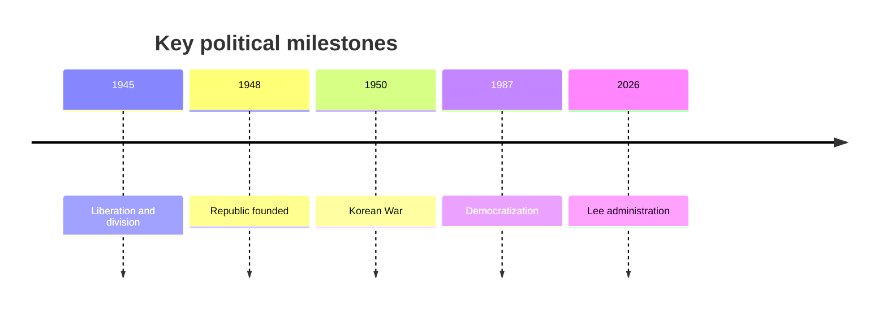
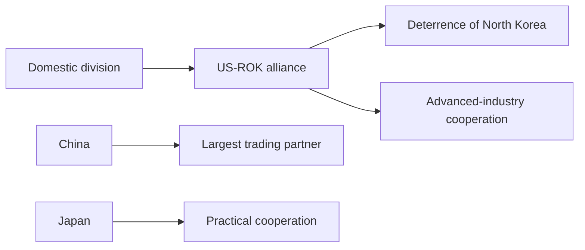

# Korea Carries the Weight of a Frontline State

## 1. Executive Summary

South Korea is a country that tries to deter North Korea through the US-ROK alliance while keeping economic and security ties moving between China and Japan. <SourceNote>[Republic of Korea Ministry of Foreign Affairs](https://www.mofa.go.kr/eng/index.do) and [Korea.net: Constitution and Government](https://www.korea.net/Government/Constitution-and-Government/Executive-Legislature-and-Judiciary) support this reading.</SourceNote>

As of autumn 2026, the president is Lee Jae Myung, and the government cannot easily abandon either dialogue or deterrence. <SourceNote>[President of the Republic of Korea](https://english.president.go.kr/) and [Republic of Korea Ministry of Foreign Affairs](https://www.mofa.go.kr/eng/index.do) support this reading.</SourceNote>

The key to reading the country is to treat history, institutional design, export structure, and demographic pressure as one bundle rather than as separate topics. <SourceNote>This is an analytical synthesis from public information.</SourceNote>

If you follow the history, liberation, division, the Korean War, rapid industrialization, and the 1987 democratic transition all shaped the state South Korea is now. <SourceNote>[Korea.net: History of Korea](https://www.korea.net/AboutKorea/History) supports this statement.</SourceNote>

Since the 1948 founding, South Korean politics has moved between military rule, authoritarianism, and democratization, and that path produced today’s strong presidency. <SourceNote>[Korea.net: Constitution and Government](https://www.korea.net/Government/Constitution-and-Government/Executive-Legislature-and-Judiciary) supports this statement.</SourceNote>

The result is that South Korean news often looks like separate stories about diplomacy, courts, industry, and households, even though they sit on the same tension. <SourceNote>This is an analytical inference from public information.</SourceNote>

## 2. The Current Political System

The constitution gives the president a single five-year term with no re-election, and the National Assembly is a unicameral 300-seat legislature. <SourceNote>[Korea.net: Constitution and Government](https://www.korea.net/Government/Constitution-and-Government/Executive-Legislature-and-Judiciary) supports this statement.</SourceNote>

In that system, a change of government can swing policy direction and personnel sharply, so disputes over prosecutors, conglomerates, and the media tend to stay near the center of politics. <SourceNote>This is an analytical inference from South Korea’s constitutional design and political history.</SourceNote>

South Korea’s political conflict is not only conservative versus progressive politics. <SourceNote>This is an analytical inference from public information.</SourceNote>

It is also a fight over how much state control is acceptable. <SourceNote>This is an analytical inference from public information.</SourceNote>

In short, the main actors share one political space: the president, the legislature, the courts, the bureaucracy, conglomerates, unions, and the media. <SourceNote>This is an analytical synthesis of South Korean institutional politics.</SourceNote>

## 3. Foreign Policy and Security

North Korea is South Korea’s nearest military threat, and the nuclear and missile issue keeps the US-ROK alliance at the center of policy. <SourceNote>[Republic of Korea Ministry of Foreign Affairs](https://www.mofa.go.kr/eng/index.do) and [Republic of Korea Ministry of National Defense](https://www.mnd.go.kr/english/) support this statement.</SourceNote>

The government still talks about resuming dialogue, but it has not stopped relying on deterrence and defense readiness. <SourceNote>[Republic of Korea Ministry of Foreign Affairs](https://www.mofa.go.kr/eng/index.do) supports this statement.</SourceNote>

The US-ROK alliance is not only about nuclear deterrence, but also functions as a bundle of missile defense, extended deterrence, and advanced-industry cooperation. <SourceNote>[Republic of Korea Ministry of Foreign Affairs](https://www.mofa.go.kr/eng/index.do) and [The White House](https://www.whitehouse.gov/) support this statement.</SourceNote>

China is South Korea’s largest trading partner, and bilateral trade in 2025 reached about $273 billion. <SourceNote>[Republic of Korea Ministry of Foreign Affairs](https://www.mofa.go.kr/eng/index.do) supports this statement.</SourceNote>

That leaves South Korea inside a dual structure: security pull toward the United States and economic pull toward China. <SourceNote>This is an analytical inference from public information.</SourceNote>

Relations with Japan still carry history problems, but trade, components, tourism, and security cooperation remain necessary. <SourceNote>[Republic of Korea Ministry of Foreign Affairs](https://www.mofa.go.kr/eng/index.do) supports this statement.</SourceNote>

By 2025, the Korea-Japan relationship had moved past the 60th anniversary of normalization, with cooperation and friction advancing at the same time. <SourceNote>[Republic of Korea Ministry of Foreign Affairs](https://www.mofa.go.kr/eng/index.do) supports this statement.</SourceNote>

The diagram shows that South Korea’s foreign relations move as a bundle of alliances, trade, memory, and deterrence rather than as a single diplomatic line. <SourceNote>This is an analytical inference from public information.</SourceNote>

## 4. Industry and External Demand

The economic core is semiconductors, shipbuilding, automobiles, batteries, precision components, and content. <SourceNote>[Ministry of Trade, Industry and Energy](https://english.motie.go.kr/) and [Ministry of Culture, Sports and Tourism](https://www.mcst.go.kr/english/) support this statement.</SourceNote>

In the first half of 2025, South Korea’s exports reached about $335 billion, with semiconductors at about $73 billion and ships at about $14 billion. <SourceNote>[Ministry of Trade, Industry and Energy](https://english.motie.go.kr/) supports this statement.</SourceNote>

Shipbuilding and semiconductors are not just export lines. <SourceNote>This is an analytical inference from public information.</SourceNote>

They sit where jobs, diplomacy, and supply chains overlap. <SourceNote>This is an analytical inference from public information.</SourceNote>

K-culture is both a cultural industry and a diplomatic asset that lifts the country’s visibility. <SourceNote>[Ministry of Culture, Sports and Tourism](https://www.mcst.go.kr/english/) supports this statement.</SourceNote>

South Korea’s economic security map now runs far beyond semiconductors and includes batteries, materials, shipping, cloud services, and cultural exports. <SourceNote>This is an analytical inference from public information.</SourceNote>

## 5. Civic Life and Social Pressure

Low fertility is one of South Korea’s biggest long-run risks, and Statistics Korea’s latest public releases still show extremely low births and continuing population aging. <SourceNote>[Statistics Korea](https://kostat.go.kr/) supports this statement.</SourceNote>

In the 2025 population and household data, young people, low-income households, and older households all face rent burdens and housing insecurity at the same time. <SourceNote>[Statistics Korea](https://kostat.go.kr/) supports this statement.</SourceNote>

Military service for men starting at age 18 is part of the national defense system, but it also slows education, job entry, and household formation for young men. <SourceNote>[Republic of Korea Military Manpower Administration](https://www.mma.go.kr/english/index.do) supports this statement.</SourceNote>

As housing, jobs, marriage, and childbirth stopped forming one continuous life course, the political system absorbed sharper intergenerational and gender tensions. <SourceNote>This is an analytical inference from public information.</SourceNote>

The 2026 interest-rate environment has not removed that pressure either. <SourceNote>[Bank of Korea](https://www.bok.or.kr/eng/main/contents.do?menuNo=400690) supports this statement.</SourceNote>

## 6. What This Means for Japan and East Asia

From Japan’s perspective, South Korea is not an alliance partner, but it is an indispensable security partner, and the two countries are linked through semiconductors, batteries, shipbuilding, sea lanes, and North Korea policy. <SourceNote>[Republic of Korea Ministry of Foreign Affairs](https://www.mofa.go.kr/eng/index.do) and [Ministry of Trade, Industry and Energy](https://english.motie.go.kr/) support this statement.</SourceNote>

If Japan-South Korea relations fray, both economic-security policy and crisis management get more expensive. <SourceNote>This is an analytical inference from public information.</SourceNote>

If Seoul leans too far toward Beijing, alliance confidence weakens; if it leans too far on Washington, exports and supply chains feel the recoil. <SourceNote>This is an analytical inference from public information.</SourceNote>

When you read South Korea, it is better to ask how much room remains in its domestic population, housing, jobs, and military-service system before asking what foreign-policy option it will choose. <SourceNote>This is the article’s main inference from public information.</SourceNote>

## 7. Watchpoints

1. Will the US-ROK alliance and deterrence against North Korea stay stable across changes of government?
2. Will South Korea keep balancing pressure from China with industrial cooperation with the United States?
3. Can semiconductors and shipbuilding keep attracting investment while staying high value-added?
4. Will low fertility and housing burdens harden the political mood of younger generations even further?
5. Can Japan-South Korea cooperation keep expanding while historical disputes remain unresolved?

South Korea is a strong state, but the basis of that strength is itself a balancing act. <SourceNote>This is the article’s concluding inference from public information.</SourceNote>

## References

- [Korea.net: Constitution and Government](https://www.korea.net/Government/Constitution-and-Government/Executive-Legislature-and-Judiciary)
- [Korea.net: History of Korea](https://www.korea.net/AboutKorea/History)
- [Republic of Korea Ministry of Foreign Affairs](https://www.mofa.go.kr/eng/index.do)
- [Republic of Korea Ministry of National Defense](https://www.mnd.go.kr/english/)
- [Republic of Korea Military Manpower Administration](https://www.mma.go.kr/english/index.do)
- [President of the Republic of Korea](https://english.president.go.kr/)
- [Statistics Korea](https://kostat.go.kr/)
- [Bank of Korea](https://www.bok.or.kr/eng/main/contents.do?menuNo=400690)
- [Ministry of Trade, Industry and Energy](https://english.motie.go.kr/)
- [Ministry of Culture, Sports and Tourism](https://www.mcst.go.kr/english/)
