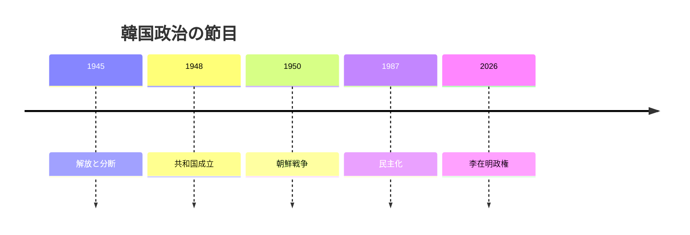
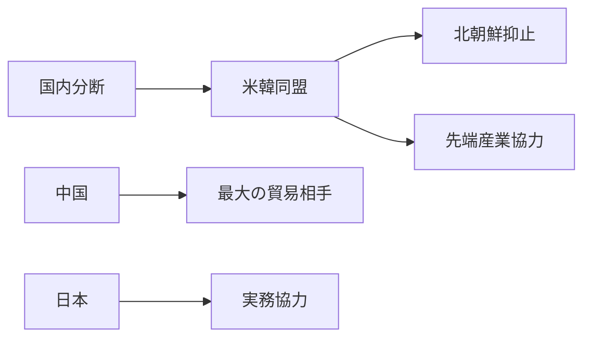

# 前線国家の重さを引き受ける韓国

## 1. エグゼクティブサマリー

韓国は、米韓同盟を軸に北朝鮮を抑止しつつ、中国と日本の間で経済と安全保障を同時に回す国である。<SourceNote>[Republic of Korea Ministry of Foreign Affairs](https://www.mofa.go.kr/eng/index.do) と [Korea.net: Constitution and Government](https://www.korea.net/Government/Constitution-and-Government/Executive-Legislature-and-Judiciary) に基づく。</SourceNote>

2026年秋時点の大統領は李在明であり、政府は対話再開を掲げつつも、同盟と抑止を外せない。<SourceNote>[President of the Republic of Korea](https://english.president.go.kr/) と [Republic of Korea Ministry of Foreign Affairs](https://www.mofa.go.kr/eng/index.do) に基づく。</SourceNote>

この国を読む鍵は、選挙結果だけではなく、歴史記憶、制度設計、輸出構造、人口圧力を束で見ることにある。<SourceNote>公開情報からの統合であり、歴史・制度・経済・人口の結びつきは本稿の分析である。</SourceNote>

歴史をたどると、解放、分断、朝鮮戦争、急速な工業化、1987年の民主化が現在の国家像を形づくった。<SourceNote>[Korea.net: History of Korea](https://www.korea.net/AboutKorea/History) に基づく。</SourceNote>

1948年の建国以降、韓国政治は軍事政権、権威主義、民主化を往復しながら、いまの強い大統領制に収れんした。<SourceNote>[Korea.net: Constitution and Government](https://www.korea.net/Government/Constitution-and-Government/Executive-Legislature-and-Judiciary) に基づく。</SourceNote>

その結果、韓国のニュースは、外交、司法、産業、家計が別々に動いているように見えて、実際には同じ張力の上に乗っている。<SourceNote>公開情報からの推定であり、後続の章でその結びつきを確認する。</SourceNote>

## 2. 現在の政治体制

憲法上の大統領任期は5年で再選はなく、国会は一院制の300議席である。<SourceNote>[Korea.net: Constitution and Government](https://www.korea.net/Government/Constitution-and-Government/Executive-Legislature-and-Judiciary) に基づく。</SourceNote>

この制度では、政権交代は政策の向きと人事を大きく揺らし、検察、財閥、メディアをめぐる争いが政治の中心に残りやすい。<SourceNote>公開情報からの推定であり、強い大統領制と党派対立の組み合わせから導いた整理である。</SourceNote>

韓国の政治対立は、保守と進歩の対立であると同時に、国家の統制をどこまで許すかという争いでもある。<SourceNote>公開情報からの推定である。</SourceNote>

主要アクターを短く言えば、大統領、国会、司法、官僚機構、財閥、労組、メディアが同じ政治空間を共有している。<SourceNote>公開情報からの推定であり、韓国政治の制度史と経済構造を束ねた整理である。</SourceNote>

## 3. 外交と安全保障

北朝鮮は韓国にとって最も近い軍事リスクであり、核・ミサイル問題は米韓同盟を政策の基礎に戻し続ける。<SourceNote>[Republic of Korea Ministry of Foreign Affairs](https://www.mofa.go.kr/eng/index.do) と [Republic of Korea Ministry of National Defense](https://www.mnd.go.kr/english/) に基づく。</SourceNote>

韓国政府は対話再開を唱える一方、抑止と防衛態勢の維持をやめていない。<SourceNote>[Republic of Korea Ministry of Foreign Affairs](https://www.mofa.go.kr/eng/index.do) に基づく。</SourceNote>

米韓同盟は、核抑止だけでなく、ミサイル防衛、拡張抑止、先端産業協力の束として運用されている。<SourceNote>[Republic of Korea Ministry of Foreign Affairs](https://www.mofa.go.kr/eng/index.do) と [The White House](https://www.whitehouse.gov/) に基づく。</SourceNote>

中国は最大の貿易相手であり、2025年の韓中貿易は2,727.3億ドルだった。<SourceNote>[Republic of Korea Ministry of Foreign Affairs](https://www.mofa.go.kr/eng/index.do) に基づく。</SourceNote>

そのため、韓国は安全保障では米国へ、経済では中国へ引力を持つ二重構造の中に置かれている。<SourceNote>公開情報からの推定であり、同盟と貿易の配置をまとめた分析である。</SourceNote>

日本との関係は、歴史問題を抱えながらも、輸出入、部材、観光、安保で実務協力を必要としている。<SourceNote>[Republic of Korea Ministry of Foreign Affairs](https://www.mofa.go.kr/eng/index.do) に基づく。</SourceNote>

2025年の日韓関係は国交正常化60年を越え、協力と摩擦が同時に進む局面にある。<SourceNote>[Republic of Korea Ministry of Foreign Affairs](https://www.mofa.go.kr/eng/index.do) に基づく。</SourceNote>

この図が示すのは、韓国の対外関係が単独の外交線ではなく、同盟、貿易、歴史、抑止の束として動くことだ。<SourceNote>公開情報からの推定であり、外交通商と安全保障の結びつきを要約したものである。</SourceNote>

## 4. 産業と外需

経済の骨格は、半導体、造船、自動車、電池、精密部材、コンテンツである。<SourceNote>[Ministry of Trade, Industry and Energy](https://english.motie.go.kr/) と [Ministry of Culture, Sports and Tourism](https://www.mcst.go.kr/english/) に基づく。</SourceNote>

2025年上半期の韓国輸出は3,347億ドルで、半導体は733億ドル、船舶は139億ドルだった。<SourceNote>[Ministry of Trade, Industry and Energy](https://english.motie.go.kr/) に基づく。</SourceNote>

造船と半導体は、単なる輸出品ではなく、雇用、外交、供給網の交点である。<SourceNote>公開情報からの推定であり、輸出統計と産業政策の結びつきに基づく。</SourceNote>

Kカルチャーは、文化産業であると同時に、国の認知を押し上げる外交資産でもある。<SourceNote>[Ministry of Culture, Sports and Tourism](https://www.mcst.go.kr/english/) に基づく。</SourceNote>

韓国の経済安全保障は、半導体だけでなく、電池、素材、海運、クラウド、文化輸出まで含む広い地図になっている。<SourceNote>公開情報からの推定であり、産業政策の射程をまとめた分析である。</SourceNote>

## 5. 市民生活と社会の圧力

少子化は韓国の最大級の中長期リスクであり、統計庁の最新公表でも出生率は極めて低く、人口の高齢化は進んでいる。<SourceNote>[Statistics Korea](https://kostat.go.kr/) に基づく。</SourceNote>

2025年の人口・家計統計では、若者、低所得層、高齢層の賃貸負担と住居不安が重なっている。<SourceNote>[Statistics Korea](https://kostat.go.kr/) に基づく。</SourceNote>

18歳からの男性を中心とする兵役は、国防の制度であると同時に、若年男性の教育、就職、家計形成を遅らせる社会制度でもある。<SourceNote>[Republic of Korea Military Manpower Administration](https://www.mma.go.kr/english/index.do) に基づく。</SourceNote>

住宅、就職、結婚、出産が一続きのライフコースではなくなったことで、世代間と男女間の感情のねじれが政治に入り込む。<SourceNote>公開情報からの推定であり、少子化、兵役、住宅圧力を束ねた整理である。</SourceNote>

2026年の金利環境も、この圧力をやわらげていない。<SourceNote>[Bank of Korea](https://www.bok.or.kr/eng/main/contents.do?menuNo=400690) に基づく。</SourceNote>

## 6. 日本と東アジアへの含意

日本にとって韓国は、同盟国ではないが不可欠な安全保障パートナーであり、半導体、電池、造船、海上交通、対北朝鮮対応で結びつく。<SourceNote>[Republic of Korea Ministry of Foreign Affairs](https://www.mofa.go.kr/eng/index.do) と [Ministry of Trade, Industry and Energy](https://english.motie.go.kr/) に基づく。</SourceNote>

逆に言えば、日韓関係がぎくしゃくすると、経済安全保障と危機管理の両方にコストが出る。<SourceNote>公開情報からの推定であり、産業と安保の接続から導いた判断である。</SourceNote>

中国との距離を詰めすぎれば同盟の安心感が削れ、米国への依存を強めすぎれば輸出と供給網に揺り戻しが来る。<SourceNote>公開情報からの推定であり、対中貿易と米韓同盟の両立がもつ制約を要約したものである。</SourceNote>

韓国を見るときは、外交の選択肢より先に、国内の人口、住宅、雇用、兵役がどの程度の余白を残しているかを見たほうがよい。<SourceNote>公開情報からの推定であり、本稿全体の結論である。</SourceNote>

## 7. 監視点

1. 米韓同盟と対北朝鮮抑止が、政権交代でぶれないか。
2. 中国依存の圧力と対米産業協力の両立が続くか。
3. 半導体と造船が高付加価値のまま投資を維持できるか。
4. 少子化と住宅負担が若年層の政治感情をさらに硬化させないか。
5. 日韓関係が歴史問題を抱えながらも実務協力を積み増せるか。

韓国は、強い国家であると同時に、強さの前提がすべて綱渡りである国だ。<SourceNote>公開情報からの推定であり、本稿の総括である。</SourceNote>

## 参考ソース

- [Korea.net: Constitution and Government](https://www.korea.net/Government/Constitution-and-Government/Executive-Legislature-and-Judiciary)
- [Korea.net: History of Korea](https://www.korea.net/AboutKorea/History)
- [Republic of Korea Ministry of Foreign Affairs](https://www.mofa.go.kr/eng/index.do)
- [Republic of Korea Ministry of National Defense](https://www.mnd.go.kr/english/)
- [Republic of Korea Military Manpower Administration](https://www.mma.go.kr/english/index.do)
- [President of the Republic of Korea](https://english.president.go.kr/)
- [Statistics Korea](https://kostat.go.kr/)
- [Bank of Korea](https://www.bok.or.kr/eng/main/contents.do?menuNo=400690)
- [Ministry of Trade, Industry and Energy](https://english.motie.go.kr/)
- [Ministry of Culture, Sports and Tourism](https://www.mcst.go.kr/english/)
