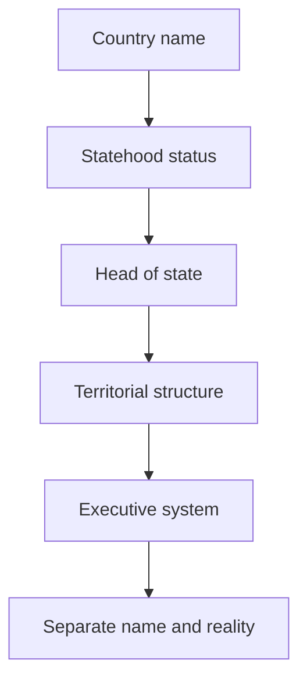

# How to Read Types of States and Country Names

## 1. Executive Summary

Words such as republic, kingdom, federal, united, people’s, democratic, Islamic, and Commonwealth do not all describe the same kind of thing. Some words describe the head of state. Others describe the relationship between the central government and territorial units. Others are ideological, historical, or diplomatic self-descriptions. Reading a country name alone as proof of democracy, independence, or federalism is therefore unreliable.

The practical first step is to separate statehood, UN membership, and official self-description. The United Nations currently has 193 Member States, and the UN maintains both a member-state list and official country-name materials. <SourceNote>[United Nations, Member States](https://www.un.org/en/about-us/member-states) and [UN Member States on the Record](https://www.un.org/en/library/unms) show the current 193 members. Formal country names were checked against the UN DGACM [official names of countries PDF](https://www.un.org/dgacm/sites/www.un.org.dgacm/files/Documents_Protocol/officialnamesofcountries.pdf).</SourceNote>

After that, read five layers separately: head of state, territorial power structure, executive system, ideological language, and international legal status. A republic usually lacks a hereditary monarch, but that does not guarantee democracy. A kingdom or constitutional monarchy can still be a parliamentary democracy. Federal and united terms usually speak to central-local authority, not to whether a country has a monarch. People’s Republic and Democratic People’s Republic are often political self-descriptions, not evidence of competitive elections.

The bottom line is simple. A country name is not just a map label; it is a compressed claim about how the state describes itself. But that claim does not automatically prove institutional reality, democratic quality, human-rights conditions, or the degree of international recognition.

## 2. Split the Name into Six Axes

Country-name terms are easier to read when split into six axes.

| Axis                        | Common words                                        | What the axis tells you                                                       |
| --------------------------- | --------------------------------------------------- | ----------------------------------------------------------------------------- |
| International legal status  | State, sovereign state, observer state, territory   | Whether the entity is an independent state, constituent unit, or territory    |
| Head of state               | Republic, Kingdom, Principality, Sultanate, Emirate | Whether there is a hereditary monarch                                         |
| Territorial power structure | Federal, United States, Federation, Confederation   | How power is divided between the center and territorial units                 |
| Executive system            | Parliamentary, Presidential, Semi-presidential      | Who holds executive authority and how it relates to the legislature           |
| Ideology and legitimacy     | Democratic, People’s, Socialist, Islamic, Arab      | The state’s political, religious, revolutionary, or national self-description |
| Historical composition      | Commonwealth, United Kingdom, Union                 | How multiple kingdoms, states, colonies, or territories came together         |

The important point is that one country name can contain several axes at once. Federal Republic combines a republican head-of-state claim with federal territorial structure. United Kingdom is a kingdom with multiple constituent parts, but it is not a federation like the United States or the UAE. Democratic People’s Republic combines democratic, people’s, and republic language, but the name alone does not prove free elections or separation of powers.

Government systems also need to be separated from labels. The Australian Parliamentary Education Office lists monarchy, dictatorship, oligarchy, theocracy, and one-party rule as forms of government outside democracy. <SourceNote>The Australian Parliamentary Education Office, [Apart from democracy what other forms of governments are there?](https://peo.gov.au/understand-our-parliament/your-questions-on-notice/questions/apart-from-democracy-what-other-forms-of-governments-are-there), gives a concise classification of non-democratic government forms.</SourceNote>

## 3. Sovereign State and UN Status

The first question is not whether something is casually called a country, but whether it is a state in international-law terms. The classic entry point is Article 1 of the Montevideo Convention, which lists a permanent population, a defined territory, government, and capacity to enter into relations with other states. This is not a complete decision rule for every modern status dispute, but it remains a useful starting point for thinking about statehood. <SourceNote>[Montevideo Convention on the Rights and Duties of States](https://www.jus.uio.no/english/services/library/treaties/01/1-02/rights-duties-states.html) Article 1 lists permanent population, defined territory, government, and capacity to enter into relations with other states.</SourceNote>

Statehood, recognition, and UN membership are related but not identical. There are 193 UN Member States. There are also non-member observer states: the Holy See and the State of Palestine. UN status is a major clue to international standing, but it does not erase the political disputes surrounding recognition and territory. <SourceNote>The UN pages on [Non-Member States](https://www.un.org/en/about-us/non-member-states) and the [observer status FAQ](https://ask.un.org/faq/14519) identify the Holy See and the State of Palestine as non-member observer states.</SourceNote>

Not everything called a country is a sovereign state. England, Scotland, Wales, and Northern Ireland may be called countries in ordinary language, but they are constituent parts of the United Kingdom, not separate UN Member States. The UK government’s toponymic guidelines describe the United Kingdom as consisting of England, Scotland, Wales, and Northern Ireland, with devolved administrative structures in Scotland, Wales, and Northern Ireland. <SourceNote>GOV.UK, [Toponymic guidelines](https://www.gov.uk/government/publications/toponymic-guidelines/toponymic-guidelines-for-map-and-other-editors-united-kingdom-of-great-britain-and-northern-ireland--2), explains the four constituent parts of the United Kingdom and the devolution pattern.</SourceNote>

## 4. Republic Does Not Mean Democracy

A republic is normally a state without a hereditary monarch as head of state. The head of state may be a president, a state chair, a collective organ, or another non-hereditary institution. The word is useful when distinguishing a state from a monarchy.

But republic is not a synonym for democracy. Republic, People’s Republic, Democratic Republic, and Socialist Republic do not automatically indicate competitive elections, press freedom, separation of powers, or rights protection. Conversely, constitutional monarchies such as the United Kingdom, Japan, and the Netherlands can operate as parliamentary democracies.

The Democratic People’s Republic of Korea shows why the distinction matters. Its formal English name contains democratic, people’s, and republic language, but Australia’s Department of Foreign Affairs and Trade describes it as a highly centralised totalitarian state. The word democratic in the name is therefore a self-description, not evidence of institutional democracy. <SourceNote>Australia DFAT, [DPRK country brief](https://www.dfat.gov.au/geo/democratic-peoples-republic-of-korea/democratic-peoples-republic-of-korea-north-korea-country-brief), describes the DPRK as a highly centralised totalitarian state.</SourceNote>

| Term                | First reading                                        | Main caution                             |
| ------------------- | ---------------------------------------------------- | ---------------------------------------- |
| Republic            | No hereditary monarch                                | Not necessarily democratic               |
| Federal Republic    | Republic plus federal structure                      | Two axes are combined                    |
| People’s Republic   | Popular, revolutionary, or socialist legitimacy      | Does not prove pluralism                 |
| Democratic Republic | Claims democratic republican identity                | Reality must be checked separately       |
| Islamic Republic    | Republic with Islamic legitimacy in the state design | Religious institutions differ by country |

## 5. Kingdoms and Constitutional Monarchies

A kingdom has a king or queen as a hereditary head of state. The real political power of the monarch varies widely. In a constitutional monarchy, the monarch’s authority is constrained by the constitution, conventions, parliament, and cabinet. In an absolute monarchy, the monarch holds much more direct governing power.

Japan is a frequent source of confusion. Its official English country name is Japan, not Kingdom of Japan. But Japan is also not a republic. Article 1 of the Constitution of Japan defines the Emperor as the symbol of the state and of the unity of the people, deriving his position from the will of the people with whom sovereign power resides. Article 4 states that the Emperor performs only constitutional acts in matters of state and has no powers related to government. Japan is therefore best read as a parliamentary state with popular sovereignty and a symbolic hereditary Emperor. <SourceNote>[Japanese Law Translation, The Constitution of Japan](https://www.japaneselawtranslation.go.jp/en/laws/view/174/en) provides the bilingual constitutional text. Articles 1, 3, and 4 define the symbolic status of the Emperor, cabinet advice and approval, and the absence of governmental powers.</SourceNote>

Commonwealth Realm is another term that is often confused with colonial status. The current King is sovereign of 14 Commonwealth realms in addition to the United Kingdom, and the Commonwealth itself is a voluntary association of 56 independent countries. Canada, Australia, and New Zealand are not British colonies; they are independent states that share the same person as their monarch. <SourceNote>The Royal Family page, [The Commonwealth](https://www.royal.uk/the-commonwealth), states that the King is sovereign of 14 Commonwealth realms in addition to the UK and that the Commonwealth is a voluntary association of 56 independent countries. The Commonwealth Secretariat, [About us](https://thecommonwealth.org/about-us), also describes the association as 56 independent and equal countries.</SourceNote>

## 6. Federation, United States, and Unitary State

Federal, United States, and Federation terms speak to the relationship between the central government and territorial units. They do not tell you whether the state is a monarchy or a republic. The United States, Germany, India, Brazil, Australia, and the UAE all have federal features, but their institutions differ.

A unitary state places sovereign legislative authority primarily at the center. It may still have local autonomy or devolution, but those territorial units do not have the same constitutional position as states in a federation. Japan, France, and South Korea can broadly be read as unitary states.

Some unitary or monarchy-based systems are still complex. The United Kingdom has four constituent parts and devolved institutions. The Kingdom of the Netherlands includes the European Netherlands as well as Aruba, Curaçao, and St Maarten as countries within the Kingdom, while Bonaire, St Eustatius, and Saba are special municipalities of the Netherlands. Foreign relations, defence, and Dutch nationality law sit at the Kingdom level, while many domestic policy areas are handled by the individual countries. <SourceNote>The Dutch government page, [Responsibilities of the Netherlands, Aruba, Curaçao and St Maarten](https://www.government.nl/themes/government-and-democracy/caribbean-parts-of-the-kingdom/responsibilities-of-the-netherlands-aruba-curacao-and-st-maarten), separates Kingdom-level responsibilities from country-level policy responsibilities.</SourceNote>

| Word             | Practical reading                       | Examples                   |
| ---------------- | --------------------------------------- | -------------------------- |
| Federal Republic | Republic plus federation                | Germany, Nigeria, Brazil   |
| United States    | State units joined into one state       | United States, Mexico      |
| Federation       | Federal state with constituent units    | Russia, Malaysia           |
| United Kingdom   | Kingdom with multiple constituent parts | United Kingdom             |
| Unitary state    | Central authority is primary            | Japan, France, South Korea |

## 7. Reading People’s, Democratic, Islamic, and Socialist

People’s, Democratic, Islamic, Socialist, and Arab are often legitimacy words rather than precise institutional classifications. They place revolution, anti-colonial history, religion, nationhood, socialism, or popular sovereignty into the formal name.

These words should always be read separately from institutional reality. People’s Republic of China, Lao People’s Democratic Republic, Democratic People’s Republic of Korea, Islamic Republic of Iran, and Socialist Republic of Viet Nam have different political systems, governing practices, and diplomatic positions. Putting them in the same box because of one word in the name obscures more than it explains.

The UN official country-name list includes Republic, Kingdom, State, People’s Democratic Republic, Islamic Republic, Socialist Republic, and Principality among formal names. That is a naming record, not an assessment of political freedom or governance quality. <SourceNote>The UN DGACM [official names of countries PDF](https://www.un.org/dgacm/sites/www.un.org.dgacm/files/Documents_Protocol/officialnamesofcountries.pdf) shows how formal country names mix Republic, Kingdom, State, People’s Democratic Republic, Islamic Republic, and other terms.</SourceNote>

## 8. Useful Problem Cases

Japan does not contain Kingdom in its English name, but it has a hereditary Emperor as a constitutional symbol. It is not a republic, and the Emperor has no governmental powers. The constitutional role matters more than the absence of the word kingdom.

The United Kingdom is sometimes mistaken for a federation because of the word united. It is better read as a kingdom with four constituent parts and substantial devolution, not as a US-style federation.

The Netherlands is often used casually to mean the European Netherlands, but formally it is part of the Kingdom of the Netherlands. Aruba, Curaçao, and St Maarten are countries within the Kingdom. Bonaire, St Eustatius, and Saba are special municipalities of the Netherlands.

On the Korean peninsula, the Republic of Korea and the Democratic People’s Republic of Korea both contain republic language. Their political systems, alliances, and international assessments are radically different. Republic is an entry point, not a complete diagnosis.

## 9. A Practical Reading Order

Use this order when reading country names.

1. Ask whether the entity is a UN Member State, non-member observer state, limited-recognition entity, constituent country, autonomous territory, or overseas territory.
2. Use republic, kingdom, principality, emirate, and sultanate language to identify whether a hereditary monarch is present.
3. Use federal, United States, federation, and confederation language to identify central-local authority.
4. Use parliamentary, presidential, and semi-presidential language to identify where executive authority sits.
5. Treat democratic, people’s, Islamic, socialist, and similar words as self-description until institutions are checked.
6. Confirm the actual system through constitutions, official government explanations, UN materials, and foreign-ministry sources.

This order keeps name, institution, and reality apart. A country name is a useful entry point, but it is not an evaluation of the country itself. For democracy, human rights, autonomy, recognition, or territorial disputes, return to primary sources and current institutions rather than relying on the label.

## References

- [United Nations, Member States](https://www.un.org/en/about-us/member-states)
- [UN Member States on the Record](https://www.un.org/en/library/unms)
- [UN, Non-Member States](https://www.un.org/en/about-us/non-member-states)
- [Montevideo Convention on the Rights and Duties of States](https://www.jus.uio.no/english/services/library/treaties/01/1-02/rights-duties-states.html)
- [Japanese Law Translation, The Constitution of Japan](https://www.japaneselawtranslation.go.jp/en/laws/view/174/en)
- [GOV.UK, Toponymic guidelines](https://www.gov.uk/government/publications/toponymic-guidelines/toponymic-guidelines-for-map-and-other-editors-united-kingdom-of-great-britain-and-northern-ireland--2)
- [Government of the Netherlands, Caribbean parts of the Kingdom](https://www.government.nl/themes/government-and-democracy/caribbean-parts-of-the-kingdom/responsibilities-of-the-netherlands-aruba-curacao-and-st-maarten)
- [The Royal Family, The Commonwealth](https://www.royal.uk/the-commonwealth)
- [The Commonwealth, About us](https://thecommonwealth.org/about-us)
- [DFAT, DPRK country brief](https://www.dfat.gov.au/geo/democratic-peoples-republic-of-korea/democratic-peoples-republic-of-korea-north-korea-country-brief)
