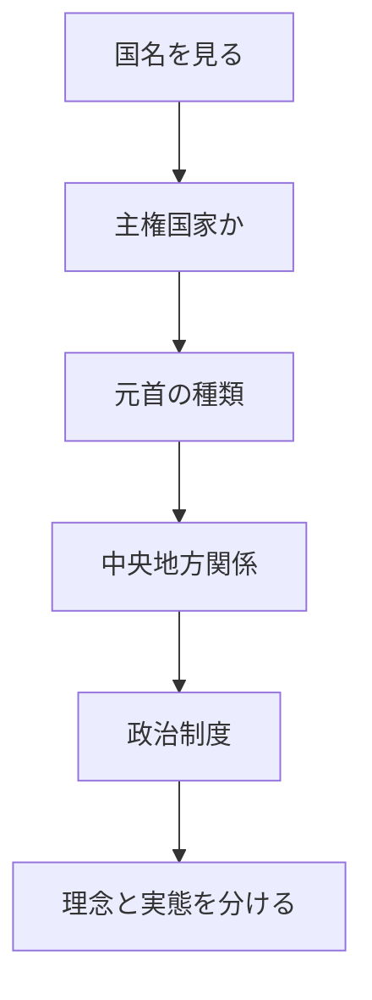

# 国の種別と国名ルールの読み方

## 1. エグゼクティブサマリー

国名に付く「共和国」「王国」「連邦」「合衆国」「人民」「民主」「イスラム」「Commonwealth」は、ひとつの分類軸を表しているわけではない。ある語は元首の種類を、別の語は中央政府と地方政府の関係を、さらに別の語は政治理念や歴史的自己表現を示す。したがって、国名だけを見て「民主的」「独立国」「連邦国家」と判断すると誤る。

実務上は、まず「主権国家か」「国連加盟国か」「国名上の自己表現か」を分ける必要がある。国連加盟国は現在193か国であり、国連は加盟国一覧と公式国名リストを管理している。<SourceNote>[United Nations, Member States](https://www.un.org/en/about-us/member-states) と国連図書館の [UN Member States on the Record](https://www.un.org/en/library/unms) は193加盟国を示す。国名の正式表記は国連DGACMの [official names of countries PDF](https://www.un.org/dgacm/sites/www.un.org.dgacm/files/Documents_Protocol/officialnamesofcountries.pdf) を参照した。</SourceNote>

次に見るべきなのは、元首、権力分配、政治制度、理念、国際法上の地位である。共和国は原則として世襲君主を置かないが、民主制を保証しない。王国や立憲君主制は世襲君主を置くが、英国、オランダ、日本のように議会制民主主義と両立しうる。連邦や合衆国は、元首ではなく中央と州の権限配分の話である。People’s Republic や Democratic People’s Republic は、制度実態ではなく政治的自己表現として読むべき場合が多い。

この記事の結論は単純である。国名は「地図のラベル」ではなく、国家が自分をどう説明しているかの圧縮表現である。ただし、その表現は制度実態、民主性、人権状況、国際承認の程度をそのまま保証しない。

## 2. まず六つの軸に分ける

国名の語を読むときは、次の六つの軸に分けると混乱しにくい。

| 軸             | 代表語                                              | 何を見ているか                                     |
| -------------- | --------------------------------------------------- | -------------------------------------------------- |
| 国際法上の地位 | State, sovereign state, observer state, territory   | 独立した主権国家なのか、構成国や領域なのか         |
| 元首の種類     | Republic, Kingdom, Principality, Sultanate, Emirate | 世襲君主を置くか、置かないか                       |
| 中央地方関係   | Federal, United States, Federation, Confederation   | 中央政府と州や構成単位の権限配分                   |
| 行政権の仕組み | Parliamentary, Presidential, Semi-presidential      | 誰が行政権を担い、議会とどう関係するか             |
| 理念と正統性   | Democratic, People’s, Socialist, Islamic, Arab      | 国家が掲げる政治理念、宗教、革命史、民族的自己認識 |
| 歴史的構成     | Commonwealth, United Kingdom, Union                 | 複数の王国、州、植民地、自治領のまとまり方         |

この表で重要なのは、同じ国名に複数の軸が重なることである。たとえば「Federal Republic」は「共和国」と「連邦制」を同時に示す。「United Kingdom」は王国であり、複数の構成部分を持つが、米国やUAEのような連邦国家ではない。「Democratic People’s Republic」は民主、人民、共和国の語を重ねるが、それだけで自由選挙や権力分立があるとは読めない。

政府形態の分類でも、民主制以外に君主制、独裁制、寡頭制、神権政治、一党支配などがある。オーストラリア議会教育局は、民主制と並べて、君主制、独裁制、寡頭制、神権政治、一党制を説明している。<SourceNote>オーストラリア議会教育局の [Apart from democracy what other forms of governments are there?](https://peo.gov.au/understand-our-parliament/your-questions-on-notice/questions/apart-from-democracy-what-other-forms-of-governments-are-there) は、民主制以外の政府形態を短く整理している。</SourceNote>

## 3. 主権国家と国連上の地位

最初の基準は、日常語の「国」ではなく、国際法上の国家性である。古典的には、モンテビデオ条約1条が、国家の要件として、恒久的住民、明確な領域、政府、他国と関係を結ぶ能力を挙げる。これは現代国際法のすべてを決める万能基準ではないが、主権国家を考える入口として今も便利である。<SourceNote>[Montevideo Convention on the Rights and Duties of States](https://www.jus.uio.no/english/services/library/treaties/01/1-02/rights-duties-states.html) 1条は、国家の資格として permanent population、defined territory、government、capacity to enter into relations with other states を列挙する。</SourceNote>

ただし、国家性、承認、国連加盟は同じではない。国連加盟国は193である一方、国連には非加盟オブザーバー国家としてHoly SeeとState of Palestineも存在する。国連上の席次は、国際社会での地位を読む重要な手掛かりだが、それだけで国家性をめぐる政治問題が消えるわけではない。<SourceNote>国連の [Non-Member States](https://www.un.org/en/about-us/non-member-states) と [observer status FAQ](https://ask.un.org/faq/14519) は、Holy See と State of Palestine を非加盟オブザーバー国家として示している。</SourceNote>

「国」と呼ばれるものがすべて主権国家ではない点も重要である。イングランド、スコットランド、ウェールズ、北アイルランドは日常語では country と呼ばれるが、国連加盟国としての独立国ではなく、英国という主権国家の構成部分である。英国政府の地名ガイドは、英国がイングランド、スコットランド、ウェールズ、北アイルランドの四つの構成部分から成り、スコットランド、ウェールズ、北アイルランドには分権行政構造があると説明している。<SourceNote>英国政府の [Toponymic guidelines](https://www.gov.uk/government/publications/toponymic-guidelines/toponymic-guidelines-for-map-and-other-editors-united-kingdom-of-great-britain-and-northern-ireland--2) は、United Kingdom の四つの constituent parts と分権構造を説明する。</SourceNote>

## 4. 共和国は民主制の同義語ではない

共和国は、原則として世襲君主を国家元首に置かない国である。元首は大統領、国家主席、集団指導機関などになりうる。フランス共和国、イタリア共和国、大韓民国のように、共和国という語は君主制ではないことを示すには有用である。

しかし、共和国は民主制の保証ではない。Republic、People’s Republic、Democratic Republic、Socialist Republic は、選挙競争、報道の自由、権力分立、人権保障の実態を自動的に示さない。逆に、英国、日本、オランダのような君主制国家でも、議会制民主主義が存在する。

朝鮮民主主義人民共和国は、この切り分けを理解する典型例である。正式英語名は Democratic People’s Republic of Korea だが、オーストラリア外務貿易省は同国を高度に中央集権化された全体主義国家と説明している。つまり、国名中の Democratic は制度実態の証明ではなく、国家の自己表現として読む必要がある。<SourceNote>オーストラリア外務貿易省の [DPRK country brief](https://www.dfat.gov.au/geo/democratic-peoples-republic-of-korea/democratic-peoples-republic-of-korea-north-korea-country-brief) は、DPRK を highly centralised totalitarian state と説明している。</SourceNote>

| 名称                | まず読む意味                       | 注意点                                   |
| ------------------- | ---------------------------------- | ---------------------------------------- |
| Republic            | 世襲君主を置かない国家             | 民主制とは限らない                       |
| Federal Republic    | 共和国かつ連邦制                   | 元首と中央地方関係の二軸                 |
| People’s Republic   | 人民、革命、社会主義の正統性を強調 | 複数政党制の有無とは別                   |
| Democratic Republic | 民主的共和国を名乗る               | 実態は制度別に確認する                   |
| Islamic Republic    | 共和国にイスラム的正統性を組み込む | 宗教機関や法体系の位置づけが国ごとに違う |

## 5. 王国と立憲君主制

王国は、国王や女王などの世襲君主を元首に置く国である。ただし、君主がどれだけ政治権力を持つかは国ごとに大きく異なる。立憲君主制では、君主の権限は憲法や慣習、議会、内閣によって制限される。絶対君主制では、君主が実質的に大きな統治権を持つ。

日本は、この分類でよく誤解される。日本の正式英語名は Kingdom of Japan ではなく Japan である。しかし、日本国憲法1条は天皇を日本国と日本国民統合の象徴とし、その地位は主権の存する日本国民の総意に基づくと定める。4条は、天皇が憲法の定める国事行為のみを行い、国政に関する権能を有しないと定める。したがって、日本は「共和国」ではなく、「天皇を象徴として持つ国民主権の議院内閣制国家」と読むのが正確である。<SourceNote>日本国憲法の英訳と日本語対照は [Japanese Law Translation, The Constitution of Japan](https://www.japaneselawtranslation.go.jp/en/laws/view/174/en) で確認できる。1条、3条、4条が天皇の象徴性、内閣の助言と承認、国政権能の不存在を定める。</SourceNote>

Commonwealth Realm も、植民地と混同しやすい。現国王は英国に加えて14のCommonwealth realmsの君主であり、Commonwealth自体は56の独立国からなる自発的な連合体である。つまり、カナダ、オーストラリア、ニュージーランドなどは英国の植民地ではなく、同じ人物を自国の君主として持つ独立国である。<SourceNote>英国王室の [The Commonwealth](https://www.royal.uk/the-commonwealth) は、国王が英国に加えて14のCommonwealth realmsの君主であり、Commonwealthが56の独立国の voluntary association であると説明する。Commonwealth事務局の [About us](https://thecommonwealth.org/about-us) も56の独立かつ平等な国の連合体として説明している。</SourceNote>

## 6. 連邦、合衆国、単一国家

連邦、合衆国、Federation は、君主か共和国かではなく、中央政府と州や構成単位の関係を示す。アメリカ合衆国、ドイツ連邦共和国、インド、ブラジル、オーストラリア、UAEは、それぞれ制度は違うが、中央と構成単位の権限配分が国の骨格になっている。

一方、単一国家は、主権と立法権の中心が中央政府にある国である。地方自治や分権があっても、州が連邦構成単位として憲法上の固有権限を持つ制度とは異なる。日本、フランス、韓国は大きくは単一国家として読める。

ただし、単一国家にも複雑なものがある。英国は四つの構成部分と分権行政を持つ。オランダ王国は、欧州のオランダだけではなく、Aruba、Curaçao、St Maartenを含む王国であり、Bonaire、St Eustatius、Sabaはオランダの特別自治体である。王国全体の外交、防衛、国籍法は王国レベルの責任であり、医療、観光、雇用などの多くは各国が政策を決める。<SourceNote>オランダ政府の [Responsibilities of the Netherlands, Aruba, Curaçao and St Maarten](https://www.government.nl/themes/government-and-democracy/caribbean-parts-of-the-kingdom/responsibilities-of-the-netherlands-aruba-curacao-and-st-maarten) は、王国全体の外交、防衛、国籍法と、各countryの政策責任を分けて説明している。</SourceNote>

| 語               | 代表的な読み方             | 例                             |
| ---------------- | -------------------------- | ------------------------------ |
| Federal Republic | 共和国かつ連邦制           | ドイツ、ナイジェリア、ブラジル |
| United States    | 複数州が結合した国家       | アメリカ、メキシコ             |
| Federation       | 構成単位を持つ連邦国家     | ロシア、マレーシア             |
| United Kingdom   | 複数構成部分を持つ王国     | 英国                           |
| Unitary state    | 中央政府が主権的権限の中心 | 日本、フランス、韓国           |

## 7. People’s、Democratic、Islamic、Socialistの読み方

People’s、Democratic、Islamic、Socialist、Arab は、制度分類というより、国家の正統性を語る語である。革命、反植民地主義、宗教、民族、社会主義、人民主権を国名に刻むことで、国家が自分の起源や理念を説明している。

この種の語は、制度実態と必ず分けて読む。People’s Republic of China、Lao People’s Democratic Republic、Democratic People’s Republic of Korea、Islamic Republic of Iran、Socialist Republic of Viet Nam は、それぞれ違う政治制度、統治実態、外交関係を持つ。国名の語だけで同じ箱に入れると、むしろ理解を誤る。

国連の公式国名リストを見ると、Republic、Kingdom、State、People’s Democratic Republic、Islamic Republic、Socialist Republic、Principality などが混在している。これは国連が各国の正式名称を扱っているからであり、その名称が政治的自由度や統治品質の評価を意味するわけではない。<SourceNote>国連DGACMの [official names of countries PDF](https://www.un.org/dgacm/sites/www.un.org.dgacm/files/Documents_Protocol/officialnamesofcountries.pdf) は、加盟国の正式名称に Republic、Kingdom、State、People’s Democratic Republic、Islamic Republic などが混在することを示す。</SourceNote>

## 8. 紛らわしい固有例

日本は、国名にKingdomを含まないが、世襲の天皇を象徴として持つ。共和国ではないが、天皇に国政権能はない。したがって、国名ではなく憲法上の地位と政治制度で読む必要がある。

英国は、United Kingdomという名前から「連邦」と誤解されることがある。しかし、United Kingdomは連邦国家ではなく、イングランド、スコットランド、ウェールズ、北アイルランドという構成部分を持つ王国である。分権の程度は強いが、米国型の連邦制とは別である。

オランダは、日常的には欧州のNetherlandsを思い浮かべやすいが、正式にはKingdom of the Netherlandsという王国の枠組みで読む必要がある。Aruba、Curaçao、St Maartenは王国内のcountriesであり、Bonaire、St Eustatius、Sabaはオランダの特別自治体である。

朝鮮半島では、Republic of Korea と Democratic People’s Republic of Korea が並ぶ。どちらも「Republic」を含むが、政治制度、同盟関係、国際評価は大きく異なる。共和国という語は元首の性質を読む入口にはなるが、政治実態の評価には足りない。

## 9. 実務での読み方

国名を見るときは、次の順番で読むとよい。

1. 国連加盟国、非加盟オブザーバー、未承認または限定承認の主体、構成国、自治領、海外領土のどれかを見る。
2. 共和国、王国、公国、首長国、スルタン国などから、世襲君主の有無を見る。
3. Federal、United States、Federation、Confederationなどから、中央地方関係を見る。
4. Parliamentary、Presidential、Semi-presidentialなどから、行政権の所在を見る。
5. Democratic、People’s、Islamic、Socialistなどを、制度実態ではなく自己表現として読む。
6. 最後に、憲法、政府公式説明、国連資料、外交当局資料で制度実態を確認する。

この順序にすると、「名前」と「制度」と「実態」を混ぜずに済む。国名は便利な入口だが、国そのものの評価ではない。とくに民主性、人権、自治、承認、領土問題を扱う場合は、国名からの印象ではなく、一次資料と現行制度に戻るべきである。

## 参考情報

- [United Nations, Member States](https://www.un.org/en/about-us/member-states)
- [UN Member States on the Record](https://www.un.org/en/library/unms)
- [UN, Non-Member States](https://www.un.org/en/about-us/non-member-states)
- [Montevideo Convention on the Rights and Duties of States](https://www.jus.uio.no/english/services/library/treaties/01/1-02/rights-duties-states.html)
- [Japanese Law Translation, The Constitution of Japan](https://www.japaneselawtranslation.go.jp/en/laws/view/174/en)
- [GOV.UK, Toponymic guidelines](https://www.gov.uk/government/publications/toponymic-guidelines/toponymic-guidelines-for-map-and-other-editors-united-kingdom-of-great-britain-and-northern-ireland--2)
- [Government of the Netherlands, Caribbean parts of the Kingdom](https://www.government.nl/themes/government-and-democracy/caribbean-parts-of-the-kingdom/responsibilities-of-the-netherlands-aruba-curacao-and-st-maarten)
- [The Royal Family, The Commonwealth](https://www.royal.uk/the-commonwealth)
- [The Commonwealth, About us](https://thecommonwealth.org/about-us)
- [DFAT, DPRK country brief](https://www.dfat.gov.au/geo/democratic-peoples-republic-of-korea/democratic-peoples-republic-of-korea-north-korea-country-brief)
