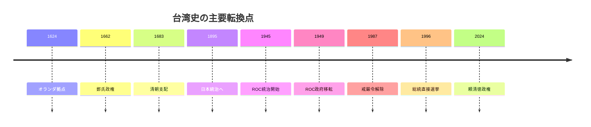
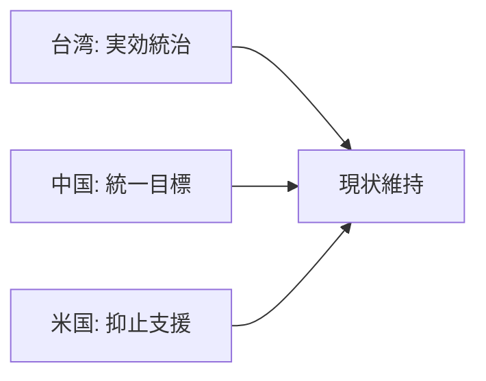

## 1. エグゼクティブサマリー

台湾は、単なる「中国と対立する島」ではない。17世紀以降のオランダ・スペイン勢力、鄭氏政権、清朝統治、日本統治、戦後の中華民国統治、1949年以降の中華人民共和国との分断、1987年以降の民主化という複数の歴史層を持つ。現在の台湾は、事実上の独自政府、軍、通貨、選挙制度を持つ民主政体であり、同時に国連加盟国として広く承認されているわけではない。

<SourceNote>台湾政府の歴史ページは、1949年以降「台湾と中国はそれぞれ異なる政府の統治下にある」とし、PRCが台湾を統治したことはないと説明している。参照: [Taiwan.gov.tw, History](https://www.taiwan.gov.tw/content_3.php)。中国政府は逆に、2022年白書で「台湾は中国の一部」とする立場を明示している。参照: [PRC State Council, The Taiwan Question and China's Reunification in the New Era](https://english.www.gov.cn/archive/whitepaper/202208/10/content_WS62f34f46c6d02e533532f0ac.html?wptouch_preview_theme=enabled)。</SourceNote>

台湾の国際的重要度は三つに集約できる。第一に、半導体、特に先端ロジック・ファウンドリの中核であること。第二に、台湾海峡が世界の海上貿易の主要ルートであること。第三に、米中競争における軍事、技術、同盟政治の焦点であること。台湾有事は地域紛争にとどまらず、サプライチェーン、金融市場、同盟信頼性、国際秩序を同時に揺らす。

<SourceNote>台湾統計当局は、2025年の実質GDP成長率を8.68%とし、AIなど新興技術需要に支えられた輸出と、半導体・コンピュータ・電子光学製品の生産拡大を説明している。参照: [DGBAS, GDP Preliminary Estimate for 2025Q4](https://eng.stat.gov.tw/News_Content.aspx?n=2317&s=235721)。CSISは2022年時点で約2.45兆ドル、世界海上貿易の5分の1超が台湾海峡を通過したと推計している。参照: [CSIS, Disruptions to Trade in the Taiwan Strait](https://www.csis.org/analysis/disruptions-trade-taiwan-strait-would-severely-impact-chinas-economy)。</SourceNote>

## 2. 歴史の流れ

台湾史は「中国史の一部」とだけ見ても、「完全に中国と無関係な島」とだけ見ても理解を誤る。先住民社会を基層に、17世紀以降に外部勢力と漢人移住が重なり、1885年に清朝の省となり、1895年から1945年まで日本統治を経験した。1945年以降は中華民国が統治し、1949年の国共内戦の結果、中華民国政府が台湾へ移った。ここで現在の争点の原型ができた。

<SourceNote>台湾政府の年表は、1624年オランダ拠点、1662年鄭成功、1683年清朝支配、1885年台湾省、1895年下関条約、1949年ROC政府移転と戒厳令を主要節目としている。参照: [Taiwan.gov.tw, History](https://www.taiwan.gov.tw/content_3.php)。</SourceNote>

戦後台湾の政治体制は、長期の権威主義から民主主義へ移った。1947年の二・二八事件、1949年から1987年までの戒厳令、白色テロを経て、1987年の戒厳令解除、1991年の臨時条項廃止、1996年の総統直接選挙、2000年の政権交代に至る。現在の台湾の政治的正統性は、単に中華民国憲法の継続だけでなく、台湾住民による反復的な選挙にも依拠している。

<SourceNote>台湾政府年表は、1987年の戒厳令解除、1991年から1992年の全面改選、1996年の初の直接総統選挙、2000年の初の政党間政権交代を民主化の節目として記載している。参照: [Taiwan.gov.tw, History](https://www.taiwan.gov.tw/content_3.php)。</SourceNote>

## 3. 中国との関係

中台関係の核心は、台湾をめぐる「主権の主張」と「統治の事実」が一致していない点にある。中国政府は、台湾を中国の一部とし、国家統一を歴史的任務と位置づける。台湾側は、中華民国政府が台湾と周辺島嶼を実効統治しており、PRCは台湾を統治したことがないと説明する。この二つは単なる言葉の違いではなく、国際機関参加、軍事行動、外交承認、経済交流のすべてに影響する。

<SourceNote>中国政府2022年白書は、台湾が中国の一部であり、国家統一を実現するという立場を示す。参照: [PRC State Council, 2022 Taiwan White Paper](https://english.www.gov.cn/archive/whitepaper/202208/10/content_WS62f34f46c6d02e533532f0ac.html?wptouch_preview_theme=enabled)。台湾政府は、1949年以降、ROCが台湾等を統治し、PRCはROC統治地域を統治していないと説明する。参照: [Taiwan.gov.tw, History](https://www.taiwan.gov.tw/content_3.php)。</SourceNote>

実務上の安定は、完全な合意ではなく、曖昧さと抑止の組み合わせで成立してきた。台湾は独自の民主政治と防衛能力を強める。中国は統一目標を掲げ、軍事・外交・経済的圧力を維持する。米国は台湾を国家として正式承認しない一方、台湾関係法に基づいて防衛装備を提供し、武力・威圧による現状変更に反対する。

## 4. 主要産業

台湾経済の中核は、半導体を頂点とするICT製造業である。2025年はAI需要により輸出と製造業が大きく伸び、DGBASは2025年通年の実質GDP成長率を8.68%とした。製造業の伸びは半導体、コンピュータ、電子・光学製品の生産拡大に支えられている。

<SourceNote>DGBASは2025年第4四半期に製造業が前年同期比24.68%成長し、半導体、コンピュータ、電子・光学製品の拡大を主因と説明している。参照: [DGBAS, GDP Preliminary Estimate for 2025Q4](https://eng.stat.gov.tw/News_Content.aspx?n=2317&s=235721)。</SourceNote>

主要産業を実務的に分けると、次のようになる。

| 産業                 | 位置づけ                                                      | 国際政治上の意味                                   |
| -------------------- | ------------------------------------------------------------- | -------------------------------------------------- |
| 半導体製造           | TSMCを中心とする先端ロジック・ファウンドリ、UMCなど成熟ノード | AI、スマホ、データセンター、自動車、防衛産業に直結 |
| IC設計・電子部品     | MediaTek、Realtek、電子部品・基板・パッケージング             | 米国ファブレス企業や世界の電子機器企業と結合       |
| ICT機器・EMS         | PC、サーバ、ネットワーク機器、電子機器受託製造                | AIサーバとクラウド投資の供給網に関与               |
| 精密機械・工作機械   | 半導体装置周辺、産業機械、自動化                              | 製造業の裾野を支える                               |
| 石化・素材           | プラスチック、化学品、素材供給                                | 電子材料・輸出産業の基盤                           |
| サービス・金融・物流 | 卸小売、金融、運輸、専門サービス                              | 製造・貿易中心経済を支える国内基盤                 |

TSMCの重要性は、単に「台湾に大企業がある」という話ではない。TSMCはファブレス企業が設計し、専業ファウンドリが製造する分業モデルを成立させた中心企業であり、米国のNVIDIA、Apple、AMDなどの競争力とも結びついている。この相互依存が、台湾を米国の産業政策と安全保障政策の両方に組み込んでいる。

<SourceNote>CSISは、台湾の半導体産業が米国の消費者電子機器、自動車、AI、軍民両用技術に組み込まれていると整理し、TSMCの専業ファウンドリモデルが米国ファブレス企業の成長を支えたと説明している。参照: [CSIS, Silicon Island](https://www.csis.org/analysis/silicon-island-assessing-taiwans-importance-us-economic-growth-and-security)。TSMC自身も、2025年年次報告書で専業ファウンドリ事業とグローバル顧客基盤を説明している。参照: [TSMC 2025 Annual Report](https://investor.tsmc.com/sites/ir/annual-report/2025/2025%20Annual%20Report_E.pdf)。</SourceNote>

## 5. 国際政治における重要度

台湾の重要度は、地政学、技術、制度の三層で理解すると見通しがよい。

第一に、台湾海峡は東アジアの海上交通路である。台湾有事は台湾と中国だけでなく、日本、韓国、東南アジア、米国、欧州企業の物流に波及する。CSISの推計では、2022年に台湾海峡を通過した貨物は約2.45兆ドルで、世界海上貿易の5分の1超に相当する。中国自身の輸出入も台湾海峡に大きく依存しているため、封鎖や検疫型の危機は中国経済にも大きな損害を与える。

<SourceNote>台湾海峡貿易額と中国依存度は [CSIS, Disruptions to Trade in the Taiwan Strait](https://www.csis.org/analysis/disruptions-trade-taiwan-strait-would-severely-impact-chinas-economy) に基づく。</SourceNote>

第二に、台湾は先端半導体供給網の中核である。AI、クラウド、スマートフォン、自動車、防衛装備は、設計、製造装置、材料、EDA、ファウンドリ、先端パッケージングをまたぐ巨大な国際分業で成立している。台湾はその中でも製造・量産のボトルネックに近い位置を占める。このため、台湾の安定は「民主主義支援」だけでなく、米国と同盟国の経済安全保障そのものになっている。

<SourceNote>CSISは、半導体がほぼ全ての電子システムに入っており、台湾の半導体産業が米国の重要・新興技術産業を支えると整理している。参照: [CSIS, Silicon Island](https://www.csis.org/analysis/silicon-island-assessing-taiwans-importance-us-economic-growth-and-security)。</SourceNote>

第三に、台湾は国際秩序のテストケースである。米国の立場では、台湾海峡の平和と安定は「地域・世界の安全と繁栄」に関わる国際的関心事項である。一方、中国は台湾問題を内政・主権問題と位置づける。この認識差が、軍事抑止と外交危機管理を難しくしている。

<SourceNote>2022年の米国国家安全保障戦略は、台湾海峡の平和と安定を地域・世界の安全と繁栄に重要で、国際的関心事項であると位置づける。参照: [White House, National Security Strategy 2022](https://www.whitehouse.gov/wp-content/uploads/2022/11/8-November-Combined-PDF-for-Upload.pdf)。</SourceNote>

## 6. 米国の認識と過去発言

米国の台湾認識は、時代ごとに変化したが、1979年以降の実務枠組みはかなり一貫している。正式にはPRCを中国の唯一の合法政府として承認し、台湾とは非公式関係を維持する。同時に、台湾関係法、三つの米中共同コミュニケ、六つの保証を組み合わせ、台湾の自衛能力と台湾海峡の平和を重視する。

|        年 | 発言・文書       | 米国認識の要点                                                                                                   |
| --------: | ---------------- | ---------------------------------------------------------------------------------------------------------------- |
|      1950 | トルーマン声明   | 朝鮮戦争を受け、第7艦隊に台湾攻撃阻止を命令。台湾の将来地位は太平洋の安全回復、対日講和、国連検討を待つとした。  |
|      1972 | 上海コミュニケ   | 米国は、台湾海峡両岸の中国人が「一つの中国、台湾は中国の一部」とする立場を認識し、これに異議を唱えないと表現。   |
|      1979 | 台湾関係法       | 公式承認断絶後も台湾との商業・文化等の関係を継続し、防衛的性格の武器提供と、武力・威圧への抵抗能力維持を政策化。 |
|      1982 | 六つの保証       | 台湾への武器売却終了時期を定めず、PRCと事前協議せず、台湾の主権に関する米国立場を変更しない等を保証。            |
|      2022 | 国家安全保障戦略 | 一つの中国政策を維持し、台湾独立を支持しない一方、台湾海峡の平和と安定を国際的関心事項と位置づける。             |
| 2021-2022 | バイデン発言     | 台湾防衛への関与を示す発言を複数回行ったが、政権は政策変更ではないと説明した。                                   |

<SourceNote>1950年トルーマン声明は [Harry S. Truman Library](https://www.trumanlibrary.gov/library/public-papers/173/statement-president-situation-korea)。1972年上海コミュニケは [AIT, Shanghai Communique](https://web-archive-2017.ait.org.tw/en/us-joint-communique-1972.html)。台湾関係法は [AIT, Taiwan Relations Act](https://web-archive-2017.ait.org.tw/en/taiwan-relations-act.html)。六つの保証は [AIT, Declassified Cables: Six Assurances](https://web-archive-2022.ait.org.tw/our-relationship/policy-history/key-u-s-foreign-policy-documents-region/six-assurances-1982/index.html)。2022年国家安全保障戦略は [White House, National Security Strategy](https://www.whitehouse.gov/wp-content/uploads/2022/11/8-November-Combined-PDF-for-Upload.pdf)。</SourceNote>

この流れで重要なのは、米国の「一つの中国政策」と中国の「一つの中国原則」は同じではない点である。米国はPRCを中国の唯一の合法政府として承認するが、台湾に関しては、上海コミュニケで両岸中国人の立場を「認識」し、台湾関係法と六つの保証で台湾との実務関係と防衛支援を制度化した。したがって、米国政策は「台湾を国家承認しない」ことと「台湾への武力・威圧を問題視する」ことを同時に含む。

<SourceNote>台湾関係法は、台湾の将来を平和的手段で決めるという期待、防衛的武器の提供、武力・威圧への抵抗能力維持を米国政策として掲げている。参照: [AIT, Taiwan Relations Act](https://web-archive-2017.ait.org.tw/en/taiwan-relations-act.html)。六つの保証は、米国が台湾主権に関する立場を変更していないこと、台湾にPRCとの交渉を迫らないことを含む。参照: [AIT, Six Assurances](https://web-archive-2022.ait.org.tw/our-relationship/policy-history/key-u-s-foreign-policy-documents-region/six-assurances-1982/index.html)。</SourceNote>

## 7. 実務的な読み方

台湾を理解する上で避けるべき単純化は三つある。

第一に、「台湾は中国の一部か独立国か」という二択だけで見ること。現実には、台湾は高度な実効統治と民主的正統性を持つが、国際承認は限定される。ここを押さえないと、国際機関、通商、軍事支援の制度設計が見えない。

第二に、「半導体があるから米国は必ず守る」と決めつけること。半導体は台湾の戦略的重要性を高めるが、同時に米国や日本が生産分散を進める理由にもなる。シリコン・シールドは抑止要因であると同時に、台湾集中リスクを可視化する概念でもある。

第三に、「中国にとって台湾は経済問題」と見ること。中国政府文書では、台湾は国家統一、主権、民族復興の問題として語られる。半導体や貿易の損得だけでは、中国側の行動を十分に予測できない。

## 8. 参考情報

- [Taiwan.gov.tw, History](https://www.taiwan.gov.tw/content_3.php)
- [PRC State Council, The Taiwan Question and China's Reunification in the New Era](https://english.www.gov.cn/archive/whitepaper/202208/10/content_WS62f34f46c6d02e533532f0ac.html?wptouch_preview_theme=enabled)
- [DGBAS, GDP Preliminary Estimate for 2025Q4](https://eng.stat.gov.tw/News_Content.aspx?n=2317&s=235721)
- [TSMC 2025 Annual Report](https://investor.tsmc.com/sites/ir/annual-report/2025/2025%20Annual%20Report_E.pdf)
- [CSIS, Disruptions to Trade in the Taiwan Strait](https://www.csis.org/analysis/disruptions-trade-taiwan-strait-would-severely-impact-chinas-economy)
- [CSIS, Silicon Island](https://www.csis.org/analysis/silicon-island-assessing-taiwans-importance-us-economic-growth-and-security)
- [AIT, Taiwan Relations Act](https://web-archive-2017.ait.org.tw/en/taiwan-relations-act.html)
- [AIT, Shanghai Communique](https://web-archive-2017.ait.org.tw/en/us-joint-communique-1972.html)
- [AIT, Declassified Cables: Six Assurances](https://web-archive-2022.ait.org.tw/our-relationship/policy-history/key-u-s-foreign-policy-documents-region/six-assurances-1982/index.html)
- [Harry S. Truman Library, Statement by the President on the Situation in Korea](https://www.trumanlibrary.gov/library/public-papers/173/statement-president-situation-korea)
- [White House, National Security Strategy 2022](https://www.whitehouse.gov/wp-content/uploads/2022/11/8-November-Combined-PDF-for-Upload.pdf)
