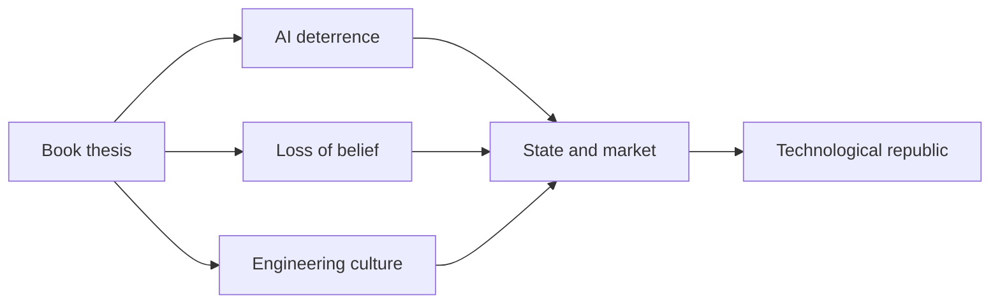
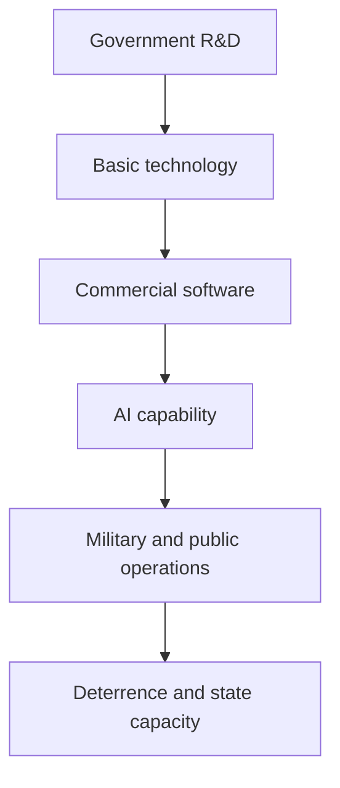

## 1. Executive Summary

`The Technological Republic: Hard Power, Soft Belief, and the Future of the West` is a critique of the technology industry, a national-security argument, and a public account of Palantir’s political worldview. It was written by Palantir cofounder and CEO Alexander C. Karp and Palantir executive Nicholas W. Zamiska. Crown Currency lists the book as published on February 18, 2025, at 320 pages. <SourceNote>[Penguin Random House, The Technological Republic](https://www.penguinrandomhouse.com/books/760945/the-technological-republic-by-alexander-c-karp-and-nicholas-w-zamiska/) provides publication date, length, author profiles, and the official description.</SourceNote>

The central claim is direct: Silicon Valley once worked with government, universities, industry, and the military to build semiconductors, space systems, the internet, and defense technology, but too much of today’s talent has drifted into consumer apps, advertising, entertainment, and financialized growth. If AI and software are becoming central to military power, industrial capacity, and public administration, technologists should return to national-scale problems. <SourceNote>The official site frames the book as an argument that the software industry should renew its commitment to urgent challenges, including the AI arms race. See [The Technological Republic official site](https://techrepublicbook.com/).</SourceNote>

The book is not only a call for more defense startups. Its structure runs through four parts and 18 chapters: the software century and AI deterrence, the loss of American belief, Palantir-style engineering culture, and a final argument about rebuilding the West through technology, religion, culture, and long-term public purpose. <SourceNote>The chapter structure was checked against the publisher sample and library metadata. See [Penguin sample PDF](https://cdn.penguin.co.uk/dam-assets/books/9781847928528/9781847928528-sample.pdf) and [bibliotek.dk bibliographic record](https://bibliotek.dk/materiale/the-technological-republic_alexander-c-karp/work-of%3A125320-katalog%3A2024041592).</SourceNote>

Three cautions matter. First, some of the diagnosis is statistically grounded: U.S. R&D was roughly $939.6 billion in 2023; businesses funded 75.5% of total R&D, while the federal government still funded 40.5% of basic research. Second, AI really has become a geopolitical arena: Stanford AI Index 2026 reports U.S. private AI investment of $285.88 billion in 2025, versus $12.41 billion in China, while the top U.S.-China model performance gap had narrowed to 2.7% by March 2026. Third, Palantir is not a neutral observer. A company that builds Maven Smart System, works with NATO and the U.S. military, and sells operational AI to governments has a direct stake in the argument that Western hard power will be built in software. <SourceNote>R&D figures come from [NSF/NCSES Science & Engineering Indicators 2025](https://ncses.nsf.gov/pubs/nsb20257/trends-in-u-s-r-d-performance-and-funding). AI investment and performance figures come from [Stanford HAI AI Index 2026 overview](https://hai.stanford.edu/ai-index/2026-ai-index-report) and [chapter 4 economy PDF](https://hai.stanford.edu/assets/files/ai_index_report_2026_chapter_4_economy.pdf). Maven context comes from [Palantir/Business Wire, Maven Smart System](https://www.businesswire.com/news/home/20240920746094/en/Palantir-Expands-Maven-Smart-System-AIML-Capabilities-to-Military-Services) and [Palantir Blog, Maven Smart System for NATO](https://blog.palantir.com/maven-smart-system-innovating-for-the-alliance-5ebc31709eea).</SourceNote>

This report’s conclusion is:

1. The book is less a product explainer than an externalized political operating system for Palantir.
2. Its strongest argument is that AI and software now shape deterrence, industrial mobilization, and administrative capacity.
3. Its weakest argument is that it demands thicker belief, Western purpose, and cultural confidence without fully translating them into governance design.
4. The practical question is not whether technologists should serve the state, but how public purpose, military power, corporate incentives, and democratic control can be designed together.

## 2. Before Reading

Reading the book only as a conservative manifesto misses half the point. Karp and Zamiska are not speaking from a generic AI-company position. They speak from a national-security software company whose products connect data, ontology, operational actions, permissions, and audit trails across military, government, and enterprise environments.

The book sits against a real shift in U.S. R&D. In 2023, total U.S. R&D was an estimated $939.6 billion. Business funded 75.5% of total R&D and the federal government funded 18.3%. But in basic research, the federal government still funded 40.5%, compared with 34.9% from business. <SourceNote>[NSF/NCSES, Trends in U.S. R&D Performance and Funding](https://ncses.nsf.gov/pubs/nsb20257/trends-in-u-s-r-d-performance-and-funding) provides the 2023 R&D scale and funding-source breakdown.</SourceNote>

That matters because the issue is not that government disappeared. The issue is whether public purpose, commercial incentives, procurement systems, universities, and defense ethics are connected well enough for a software-first era.

AI also supports the authors’ sense of urgency. Stanford AI Index 2026 reports $344.66 billion in global private AI investment in 2025 and $170.87 billion in private generative-AI investment. The U.S. led with $285.88 billion in private AI investment, 23.1 times China’s $12.41 billion. Yet U.S. and Chinese models had traded the lead multiple times since early 2025, and the top U.S. model led by only 2.7% in March 2026. <SourceNote>See [Stanford HAI, Inside the AI Index](https://hai.stanford.edu/news/inside-the-ai-index-12-takeaways-from-the-2026-report), [Technical Performance](https://hai.stanford.edu/ai-index/2026-ai-index-report/technical-performance), and [Economy chapter PDF](https://hai.stanford.edu/assets/files/ai_index_report_2026_chapter_4_economy.pdf).</SourceNote>

So the right question is not whether to believe Palantir. The right question is: if AI and software now shape state capacity, what forms of public control, procurement, transparency, rights protection, and allied governance should surround them?

## 3. The 18-Chapter Map

The table below keeps the actual structure visible.

| Part | Chapter | Title | Role |
| --- | ---: | --- | --- |
| Part I: The Software Century | 1 | Lost Valley | Introduces the claim that Silicon Valley left national and industrial problems behind |
| Part I | 2 | Sparks of Intelligence | Frames generative AI as a transformation on the scale of atomic technology |
| Part I | 3 | The Winner's Fallacy | Argues that post-Cold War confidence produced Western complacency |
| Part I | 4 | End of the Atomic Age | Moves from nuclear deterrence toward AI and software deterrence |
| Part II: The Hollowing Out of the American Mind | 5 | The Abandonment of Belief | Critiques elites who cannot state shared public commitments |
| Part II | 6 | Technological Agnostics | Critiques technologists who pretend purpose is not their problem |
| Part II | 7 | A Balloon Cut Loose | Attacks elite education detached from tradition and civic obligation |
| Part II | 8 | "Flawed Systems" | Defends imperfect institutions and imperfect public servants |
| Part II | 9 | Lost in Toyland | Critiques consumer-app culture and entertainment drift |
| Part III: The Engineering Mindset | 10 | The Eck Swarm | Uses edge-of-the-swarm exploration as an organizational metaphor |
| Part III | 11 | The Improvisational Startup | Explains Palantir’s preference for field improvisation over bureaucracy |
| Part III | 12 | The Disapproval of the Crowd | Defends leaders willing to face public disapproval |
| Part III | 13 | Building a Better Rifle | Separates disagreement over war from better tools for soldiers |
| Part III | 14 | A Cloud or a Clock | Warns against treating complex systems as fully clocklike machines |
| Part IV: Rebuilding the Technological Republic | 15 | Into the Desert | Calls technologists into harder public missions |
| Part IV | 16 | Piety and Its Price | Brings religion, reverence, and elite secularism into the argument |
| Part IV | 17 | The Next Thousand Years | Extends the argument to long-run Western continuity |
| Part IV | 18 | An Aesthetic Point of View | Ends by treating technology and politics as an aesthetic order |

<SourceNote>Chapter titles are from [Penguin sample PDF](https://cdn.penguin.co.uk/dam-assets/books/9781847928528/9781847928528-sample.pdf) and [bibliotek.dk](https://bibliotek.dk/materiale/the-technological-republic_alexander-c-karp/work-of%3A125320-katalog%3A2024041592). The role column is this report’s synthesis from the sample, official descriptions, Palantir’s 22-point summary, and major reviews.</SourceNote>

## 4. Part I: The Software Century

Part I is the book’s strongest section. The authors describe early Silicon Valley as a product of government, universities, the military, semiconductor firms, space programs, and national demand. They contrast that with a contemporary technology sector that spends too much talent on engagement, advertising, and convenience markets.

The statistical backdrop complicates the nostalgia. U.S. R&D is not small, and government has not vanished. The better reading is that the authors are objecting to weak coordination among public mission, commercial incentives, procurement, and software speed.

Chapter 2 places AI in the role of a general-purpose technology with military, educational, cultural, and organizational consequences. The AI Index supports the strategic part of that concern: capital is concentrated in the United States, but the performance gap with China has narrowed sharply. <SourceNote>Stanford HAI reports a 23.1-to-1 U.S.-China private AI investment ratio in 2025 and a 2.7% top-model gap in March 2026. See [AI Index overview](https://hai.stanford.edu/ai-index/2026-ai-index-report) and [Economy chapter](https://hai.stanford.edu/assets/files/ai_index_report_2026_chapter_4_economy.pdf).</SourceNote>

Chapter 3’s “winner’s fallacy” is the claim that post-Cold War victory made the West assume that market liberalism and globalization would remain self-sustaining. Chapter 4 then argues that deterrence is moving from a nuclear-centered age toward a software-and-AI layer that includes sensing, targeting, logistics, drones, cyber operations, command and control, and information fusion.

Palantir’s Maven Smart System is the operational example. Palantir describes Maven as part of NGA’s AI infrastructure and as software that supports AI-enabled battlespace awareness, global integration, force management, contested logistics, joint fires, and targeting workflows. It also describes NATO MSS integrations with satellite imagery, drone tasking, and course-of-action generation. <SourceNote>See [Palantir/Business Wire](https://www.businesswire.com/news/home/20240920746094/en/Palantir-Expands-Maven-Smart-System-AIML-Capabilities-to-Military-Services) and [Palantir Blog](https://blog.palantir.com/maven-smart-system-innovating-for-the-alliance-5ebc31709eea).</SourceNote>

## 5. Part II: The Hollowing Out of the American Mind

Part II shifts from technology to culture. The authors argue that elites no longer know what they are defending, and technologists too often claim neutrality rather than responsibility.

Chapter 5 is the moral center: the abandonment of belief. Chapter 6 attacks technological agnosticism: in domains such as AI weapons, surveillance, data integration, crime prevention, border enforcement, and military planning, “we only build tools” is not enough. Customer choice, model access, audit design, and deployment constraints are product decisions.

Chapter 7 criticizes elite education that is cut loose from tradition, history, and civic obligation. Chapter 8 and Chapter 12 defend public figures and institutions that are imperfect but still capable of action. Palantir’s April 2026 “in brief” summary makes this part explicit: it discusses AI weapons, national service, public forgiveness, psychologized politics, religious belief, and cultural judgment. <SourceNote>Palantir Technologies’ LinkedIn post [The Technological Republic, in brief](https://www.linkedin.com/pulse/technological-republic-brief-palantir-technologies-ktdde) published a 22-point summary on April 18, 2026.</SourceNote>

The weakness is that the book asks for belief more than it designs institutions for that belief. The Scholar’s Stage criticizes the book for demanding public conviction without specifying enough of the substantive moral vision. That criticism is useful: “belief” must be translated into rights, minority protections, checks and balances, military auditability, and AI accountability. <SourceNote>[The Scholar's Stage, Book Notes: The Technological Republic](https://scholars-stage.org/book-notes-the-technological-republic-2025/) argues that the book does not sufficiently state what its richer moral vision should contain.</SourceNote>

## 6. Part III: The Engineering Mindset

Part III is best read as Palantir’s organizational theory. Engineering is not just coding. It is entering uncertain environments, learning from the field, improvising, changing tools, and connecting analysis to operations.

Chapter 10 uses the swarm edge as a metaphor for how peripheral explorers can move the group. Chapter 11 explains the improvisational startup: in defense, healthcare, finance, manufacturing, and public administration, requirements are rarely complete at the start. Data, permissions, legacy systems, politics, and users all change the product.

Chapter 13, “Building a Better Rifle,” is the most controversial and important chapter. The authors separate disagreement over military action from the obligation to provide better tools to people sent into danger. This is also an ethical defense of Palantir’s defense business. Maven Smart System is described as supporting workflows from battlespace awareness to joint fires and targeting. <SourceNote>[Palantir/Business Wire](https://www.businesswire.com/news/home/20240920746094/en/Palantir-Expands-Maven-Smart-System-AIML-Capabilities-to-Military-Services) describes the Maven contract, services covered, and supported workflows.</SourceNote>

The stronger this argument becomes, the more governance it requires. Better tools for soldiers can be a valid goal, but targeting, surveillance, collateral harm, allied political accountability, and international humanitarian law cannot be handled by engineering quality alone.

Chapter 14 warns against treating complex systems as clocks. That warning matters for AI. LLMs and agentic tools can make plausible recommendations in uncertain environments. In battlefields, policing, medicine, and public administration, probabilistic output must be tied to institutional responsibility.

## 7. Part IV: Rebuilding the Technological Republic

Part IV is the most philosophical section. The authors ask technologists to leave comfortable markets and reenter national, religious, cultural, and civilizational questions. The technological republic is not merely a government contracting boom. It is a desired alignment among technologists, government, the military, universities, firms, and culture around shared public purpose.

The 22-point summary clarifies the endgame. Palantir says democratic societies need hard power, and that hard power in this century will be built on software. It says the question is not whether AI weapons will be built, but who builds them and for what purpose. It also calls for serious consideration of national service, rethinking postwar German and Japanese security constraints, resisting elite intolerance toward religion, and rejecting empty pluralism. <SourceNote>[Palantir Technologies, The Technological Republic, in brief](https://www.linkedin.com/pulse/technological-republic-brief-palantir-technologies-ktdde) presents these points as excerpts from the book.</SourceNote>

Supporters will read this as a recovery of public spirit. Critics will read it as corporate interest wrapped in Western civilizational language. Both readings capture part of the truth. Palantir is more deeply involved in state capacity than a normal SaaS company. That makes its practical knowledge valuable, and its political power risky.

## 8. Statistical Check

| Emphasis in the book | Relevant statistic | Interpretation |
| --- | --- | --- |
| Government-technology linkage matters | U.S. R&D was roughly $939.6B in 2023. Business funded 75.5% of total R&D; the federal government funded 40.5% of basic research. | Government did not disappear; the question is connection design. |
| AI is a geopolitical contest | U.S. private AI investment was $285.88B in 2025, China $12.41B. Top model gap was 2.7% in March 2026. | U.S. capital dominance does not guarantee lasting performance dominance. |
| Defense procurement is too slow | GAO says DOD plans nearly $2.4T across 106 major weapon programs, while initial capability takes almost 12 years on average. | The authors’ speed critique has institutional support. |
| Defense tech is growing | SVDG NatSec100 2026 reports $4.3B in FY25 federal obligations and $39.6B in 2025 private capital raised without OpenAI. | Capital has surged, but contract conversion remains the hard part. |
| National service and military manpower are stressed | U.S. services missed FY2023 recruiting goals by about 41,000; the Regular Army hit 76.6% of its FY2023 goal, then met its FY2024 target. | The crisis was real, but recent recovery complicates simple collapse narratives. |
| Violent crime demands serious public action | FBI preliminary 2025 data estimates violent crime down 9.3% and murder/non-negligent manslaughter down 18.1% from 2024. | Crime remains a public issue, but national crisis rhetoric needs current data. |
| Allies are rearming | NATO says all Allies met or exceeded the 2% target in 2025; Europe and Canada rose from 1.4% of GDP in 2014 to 2.3% in 2025. | Germany/Japan burden-sharing debates sit inside an already changing alliance context. |

<SourceNote>GAO data comes from [Defense Acquisition Reform, GAO-25-108528](https://www.gao.gov/products/gao-25-108528). Defense-tech data comes from [SVDG NatSec100 2026](https://www.natsec100.org/). Recruiting data comes from [U.S. Department of Defense recruiting shortfall statement](https://www.war.gov/News/News-Stories/Article/article/3616786/dod-addresses-recruiting-shortfall-challenges/) and [U.S. Army Recruiting Facts and Figures](https://recruiting.army.mil/pao/facts_figures/). Crime data comes from [FBI First Look: 2025 Crime Data](https://www.fbi.gov/news/press-releases/fbi-releases-historic-early-look-at-annual-crime-data). NATO data comes from [Defence expenditures and NATO's 5% commitment](https://www.nato.int/en/what-we-do/introduction-to-nato/defence-expenditures-and-natos-5-commitment).</SourceNote>

The data suggests that the authors’ crisis language is not pure exaggeration. AI competition, procurement delay, recruiting stress, and defense-tech capital inflows are real. But the leap from those facts to a Palantir-style fusion of state, technology, and culture is not automatic. That leap requires separate evaluation of democratic oversight, military ethics, procurement competition, public-data rights, and human-rights impact.

## 9. Reading It as a Palantir Book

The book cannot be separated from Palantir. Palantir’s core product logic is operational AI: data, objects, actions, permissions, and audit logs joined into a layer that helps institutions act.

That makes the book unusually transparent. Palantir is not claiming that technology is neutral. It says it chooses the West, works on national security, and wants AI implemented in battlefields, public administration, and industry. The transparency is useful. The risk is equally clear: a politically committed company is building software for state decision-making.

Maven Smart System is the product expression of the thesis. It connects sensors, satellite imagery, algorithms, operational workflows, LLMs, drones, and course-of-action generation. It is the practical version of the claim that hard power will be built in software. <SourceNote>[Palantir Blog](https://blog.palantir.com/maven-smart-system-innovating-for-the-alliance-5ebc31709eea) describes NATO MSS integrations involving imagery, AI detections, drone tasking, and course-of-action generation.</SourceNote>

Readers should hold two ideas together. Palantir likely has unusually practical knowledge about operational AI in public and defense settings. That knowledge is also commercially and politically interested.

## 10. Strengths and Weaknesses

The book’s strength is that it treats AI as a matter of state capacity, deterrence, industry, and culture, not merely productivity or consumer experience. That is correct for 2026. AI firms, cloud providers, semiconductors, data centers, electricity, defense, education, and procurement are no longer separate policy domains.

It also refuses to let technologists hide behind neutrality. In AI weapons, surveillance, medical triage, predictive policing, immigration enforcement, sanctions, and battlefield awareness, designers, deployers, operators, and institutions share responsibility.

The weakness is that its cultural argument does not become an institutional design. Belief, piety, the West, nationhood, civilization, and aesthetics do not by themselves produce AI auditing, procurement competition, abuse prevention, international humanitarian law compliance, civilian protection, or data rights.

The book also criticizes the market while being written from inside a market firm. If consumer apps are shallow, defense software can also be opaque, contract-driven, locked-in, and politically influential. A serious critique must apply pressure in both directions.

## 11. Practical Reading

The book is most useful as a checklist:

1. Does a technology strategy connect to public, industrial, or security problems rather than only consumer UX or short-term revenue?
2. Does an AI deployment design data, permissions, execution, audit, and responsibility, not just model performance?
3. Does public-sector AI procurement increase speed while preserving competition, transparency, logs, and third-party audit?
4. In defense AI, are soldier support, political decisions about war, international law, humanitarian risk, and allied accountability separated clearly?
5. When leaders invoke Western values or the public good, do they specify how minority rights, criticism, religious freedom, and pluralism are protected?

The shortest serious summary is this: Karp and Zamiska argue that the West needs hard power built in software and a thick belief structure to justify and guide it. Their concern is grounded in real shifts. Their prescription is deeply entangled with Palantir’s business. The book should therefore be read both as an argument about AI-era state capacity and as the worldview of a company that sells state capacity.

## References

- Alexander C. Karp and Nicholas W. Zamiska, `The Technological Republic: Hard Power, Soft Belief, and the Future of the West`, Crown Currency, 2025.
- [The Technological Republic official site](https://techrepublicbook.com/)
- [Penguin Random House book page](https://www.penguinrandomhouse.com/books/760945/the-technological-republic-by-alexander-c-karp-and-nicholas-w-zamiska/)
- [Penguin sample PDF](https://cdn.penguin.co.uk/dam-assets/books/9781847928528/9781847928528-sample.pdf)
- [Palantir Technologies, The Technological Republic, in brief](https://www.linkedin.com/pulse/technological-republic-brief-palantir-technologies-ktdde)
- [NSF/NCSES, Trends in U.S. R&D Performance and Funding](https://ncses.nsf.gov/pubs/nsb20257/trends-in-u-s-r-d-performance-and-funding)
- [Stanford HAI, The 2026 AI Index Report](https://hai.stanford.edu/ai-index/2026-ai-index-report)
- [GAO, Defense Acquisition Reform](https://www.gao.gov/products/gao-25-108528)
- [SVDG, NatSec100 2026](https://www.natsec100.org/)
