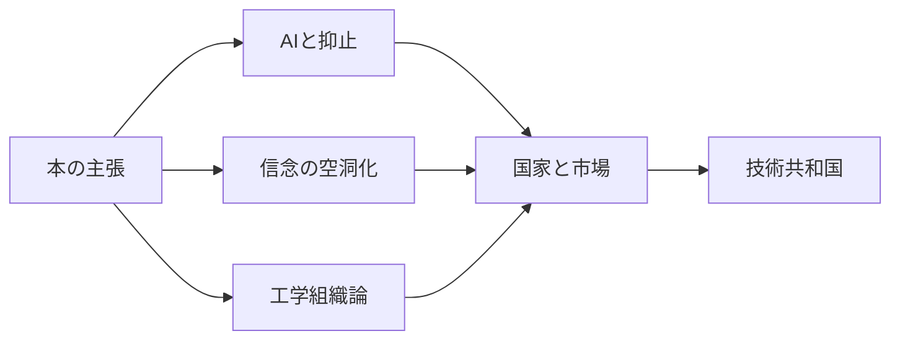
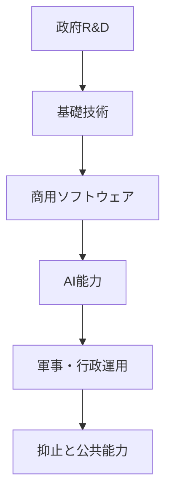

## 1. エグゼクティブサマリー

`The Technological Republic: Hard Power, Soft Belief, and the Future of the West` は、Palantir共同創業者兼CEOのAlexander C. Karpと同社幹部Nicholas W. Zamiskaが書いた、テック業界への批判であり、国家安全保障論であり、Palantirの自己説明でもある。Crown Currency版は2025年2月18日刊行、320ページの本として案内されている。<SourceNote>[Penguin Random House, The Technological Republic](https://www.penguinrandomhouse.com/books/760945/the-technological-republic-by-alexander-c-karp-and-nicholas-w-zamiska/) は刊行日、ページ数、著者プロフィール、公式の書籍説明を掲載している。</SourceNote>

本書の中心命題は単純である。Silicon Valleyは、かつて政府・大学・産業と結びついて半導体、宇宙、インターネット、防衛技術を生んだが、いまは消費者アプリ、広告、エンタメ、金融化された成長に才能を吸われている。AIとソフトウェアが軍事・統治・産業競争の中心になるなら、技術者は国家的課題へ戻るべきだ、というのが著者たちの主張である。<SourceNote>公式サイトは、ソフトウェア産業がAI軍拡を含む緊急課題へ再びコミットすべきだと説明している。[The Technological Republic official site](https://techrepublicbook.com/) を参照。</SourceNote>

ただし、この本は「防衛スタートアップを増やせ」というだけの本ではない。章立てを見ると、4部18章で、前半はソフトウェア世紀とAI時代の抑止、中央部はアメリカの信念喪失と高等教育・エリート文化批判、後半はPalantir流のエンジニアリング組織論、最後は宗教・文化・美学まで含む「西側の再構築」論へ進む。<SourceNote>出版社サンプルと図書館メタデータで、Part IからPart IVまでの18章構成を確認した。[Penguin sample PDF](https://cdn.penguin.co.uk/dam-assets/books/9781847928528/9781847928528-sample.pdf)、[bibliotek.dk bibliographic record](https://bibliotek.dk/materiale/the-technological-republic_alexander-c-karp/work-of%3A125320-katalog%3A2024041592) を参照。</SourceNote>

読むときの注意点は三つある。第一に、著者たちの問題意識には統計的裏付けがある。米国R&Dは2023年に約9,396億ドル規模で、事業会社が総R&D資金の75.5%を担う一方、基礎研究では連邦政府が40.5%を担っており、国家と市場の分業はいまも残る。第二に、AI競争は本当に安全保障化している。Stanford AI Index 2026は、2025年の米国AI民間投資を2,858.8億ドル、中国を124.1億ドルとしつつ、米中トップモデル性能差は2026年3月時点で2.7%まで縮まったとする。第三に、Palantir自身がこの議論の利害関係者である。Maven Smart System、NATO、米軍、CJADC2に関わる企業が「西側のソフトウェア再軍備」を説いているため、思想と事業戦略を切り離して読んではいけない。<SourceNote>R&D統計は [NSF/NCSES Science & Engineering Indicators 2025](https://ncses.nsf.gov/pubs/nsb20257/trends-in-u-s-r-d-performance-and-funding)。AI投資と性能差は [Stanford HAI AI Index 2026 overview](https://hai.stanford.edu/ai-index/2026-ai-index-report) と [chapter 4 economy PDF](https://hai.stanford.edu/assets/files/ai_index_report_2026_chapter_4_economy.pdf)。Mavenは [Palantir/Business Wire, Maven Smart System](https://www.businesswire.com/news/home/20240920746094/en/Palantir-Expands-Maven-Smart-System-AIML-Capabilities-to-Military-Services) と [Palantir Blog, Maven Smart System for NATO](https://blog.palantir.com/maven-smart-system-innovating-for-the-alliance-5ebc31709eea) を参照。</SourceNote>

本稿の結論は次の通りである。

1. 本書は、Palantirの製品説明ではなく、Palantirの「政治的オペレーティングシステム」を外に出した本である。
2. 最も強い論点は、AI・ソフトウェアが抑止、産業動員、行政能力に直結するという主張である。
3. 最も弱い論点は、「西側の価値」「信念」「文化」を強く求めながら、その中身を十分に制度設計へ落とし切っていない点である。
4. 読者が持ち帰るべき問いは、「技術者は国家に奉仕すべきか」ではなく、「AI時代の公共目的、軍事力、企業利害、民主的統制をどう同時に設計するか」である。

## 2. 読む前に押さえる前提

この本を単なる保守的マニフェストとして読むと、半分しか見えない。KarpとZamiskaは、AI企業の経営者としてではなく、国家安全保障ソフトウェア企業の経営者として語っている。Palantirは、政府・防衛・情報機関向けGotham、企業・公共向けFoundry、生成AI/エージェント基盤AIP、閉域環境を含むデプロイ基盤Apolloを持つ。つまり、本書の「ソフトウェアが国家能力を決める」という主張は、同社の事業領域そのものと重なる。

本書の背景には、米国のR&D構造の長期変化がある。2023年の米国R&Dは推定9,396億ドルで、事業会社がR&D実施の最大主体である。資金源で見ると、事業会社が総R&Dの75.5%、連邦政府が18.3%を担う。ただし基礎研究に限ると、連邦政府40.5%、事業会社34.9%で、いまも政府は基礎研究の最大資金源である。<SourceNote>[NSF/NCSES, Trends in U.S. R&D Performance and Funding](https://ncses.nsf.gov/pubs/nsb20257/trends-in-u-s-r-d-performance-and-funding) は、2023年の総R&D、資金源、基礎研究の資金構成を示している。</SourceNote>

この数字は、著者たちの郷愁を補正して読む材料になる。政府と技術の関係が消えたわけではない。むしろ、基礎研究では政府がなお中心的で、商用化・開発では企業が圧倒的である。問題は「政府が何もしなくなった」ことではなく、国家的課題、商業的インセンティブ、調達制度、大学文化、軍事倫理の接続が弱くなったことだと整理すると、本書の射程が見えやすい。

AIについても、著者たちの危機感には根拠がある。Stanford AI Index 2026は、2025年の世界AI民間投資を3,446.6億ドル、生成AI民間投資を1,708.7億ドルとし、米国のAI民間投資は2,858.8億ドル、中国の23.1倍だったとする。一方で、米中トップモデルの性能差は2026年3月時点で2.7%まで縮まった。<SourceNote>[Stanford HAI, Inside the AI Index: 12 Takeaways from the 2026 Report](https://hai.stanford.edu/news/inside-the-ai-index-12-takeaways-from-the-2026-report)、[Technical Performance](https://hai.stanford.edu/ai-index/2026-ai-index-report/technical-performance)、[Economy chapter PDF](https://hai.stanford.edu/assets/files/ai_index_report_2026_chapter_4_economy.pdf) を参照。</SourceNote>

したがって、本書の読み方は「Palantirの主張を信じるか」ではない。正しい問いは、AIとソフトウェアが国家能力を左右するという観察を認めたうえで、どのような公共統制、調達、透明性、人権制約、同盟運用を設計するかである。

## 3. 18章の全体地図

章を取りこぼさないため、まず構造を並べる。各章は短く、思想書というより、断章的な論説、Palantirの組織論、歴史的比喩、文化批判を束ねた構成になっている。

| 部 | 章 | 章題 | 役割 |
| --- | ---: | --- | --- |
| Part I: The Software Century | 1 | Lost Valley | Silicon Valleyが国家的・産業的課題から離れたという導入 |
| Part I | 2 | Sparks of Intelligence | 生成AIを原子力級の転換点として置く |
| Part I | 3 | The Winner's Fallacy | 冷戦後の勝者意識が西側の油断を生んだという議論 |
| Part I | 4 | End of the Atomic Age | 核抑止中心の時代からAI・ソフトウェア抑止への移行 |
| Part II: The Hollowing Out of the American Mind | 5 | The Abandonment of Belief | エリート層が共有信念を語れなくなったという批判 |
| Part II | 6 | Technological Agnostics | 技術者が目的に中立を装うことへの批判 |
| Part II | 7 | A Balloon Cut Loose | 教育・教養・共同体から切り離されたエリート批判 |
| Part II | 8 | "Flawed Systems" | 不完全な制度や人物を許容できない文化への反論 |
| Part II | 9 | Lost in Toyland | 消費者アプリと娯楽へ才能が向かうことへの批判 |
| Part III: The Engineering Mindset | 10 | The Eck Swarm | 辺縁の探索者が群れを動かすという組織比喩 |
| Part III | 11 | The Improvisational Startup | Palantir的な即興・現場対応・反官僚制の組織論 |
| Part III | 12 | The Disapproval of the Crowd | 群衆の不承認を恐れないリーダー論 |
| Part III | 13 | Building a Better Rifle | 戦争への賛否と兵士への技術提供を分ける議論 |
| Part III | 14 | A Cloud or a Clock | 複雑系を機械のように扱う限界、判断の不確実性 |
| Part IV: Rebuilding the Technological Republic | 15 | Into the Desert | 退却ではなく困難な公共目的へ入ることの比喩 |
| Part IV | 16 | Piety and Its Price | 宗教・敬虔さ・世俗エリート批判 |
| Part IV | 17 | The Next Thousand Years | 西側の長期存続と制度的継承 |
| Part IV | 18 | An Aesthetic Point of View | 技術・政治・文化を美学的な構成として見る結論 |

<SourceNote>章題は [Penguin sample PDF](https://cdn.penguin.co.uk/dam-assets/books/9781847928528/9781847928528-sample.pdf) と [bibliotek.dk](https://bibliotek.dk/materiale/the-technological-republic_alexander-c-karp/work-of%3A125320-katalog%3A2024041592) の目次情報に基づく。章ごとの役割は、公開サンプル、公式説明、Palantirの22点要約、主要レビューからの総合整理である。</SourceNote>

## 4. Part I: ソフトウェア世紀

第1部は、本書で最も説得力がある部分である。著者たちは、Silicon Valleyの初期成功を、政府、大学、軍、半導体企業、宇宙開発、防衛需要の接続として描く。現代のテック企業が「写真共有」「広告最適化」「フードデリバリー」のような市場で才能を使うことに対し、国家的課題へ戻れと求める。

この批判を統計で見ると、単純な「官から民へ」の物語では足りない。米国R&Dは巨大化し、総額では民間主導である。しかし基礎研究、大学研究、FFRDC、国防R&D、宇宙、半導体政策などでは政府の資金・調達・規制が依然として重要である。著者たちの本当の不満は、政府資金の量ではなく、ソフトウェア時代の公共目的と調達制度が、AI時代の速度に合っていないことにある。

第2章は、AIを「知性の火花」として扱う。ここでAIは、単なる生産性ツールではなく、軍事、教育、文化、組織判断を変える汎用技術として置かれる。Stanford AI Index 2026が示すように、AI投資は急増し、モデル性能の国際差は縮小している。米国が資本で圧倒していても、中国との性能差が小さいなら、資本量だけでは安全保障優位を保証しない。<SourceNote>Stanford HAIは、米国AI民間投資が中国の23.1倍である一方、米中トップモデル性能差が2026年3月に2.7%と説明している。[AI Index overview](https://hai.stanford.edu/ai-index/2026-ai-index-report)、[Economy chapter](https://hai.stanford.edu/assets/files/ai_index_report_2026_chapter_4_economy.pdf) を参照。</SourceNote>

第3章の「勝者の誤謬」は、冷戦後の米国が、自由市場とグローバル化の勝利を永続的なものと誤認したという議論である。ここでは中国、ロシア、イラン、権威主義国家、AI軍拡が背景になる。著者たちは、敵対国がAI兵器や監視技術をためらわず使うなら、民主主義側だけが倫理的躊躇で実装を遅らせることは危険だと見る。

第4章は、核の時代からAIの時代への移行である。もちろん核抑止が消えるわけではない。だが、偵察、標的識別、ドローン、サイバー、物流、指揮統制、情報融合では、ソフトウェアが抑止力の中核になる。この点はPalantirのMaven Smart Systemと直結する。PalantirはMavenがNGAのAIインフラの一部であり、CJADC2の取り組みを支えると説明している。さらにNATO向けMSSでは、衛星画像、ドローン、作戦案生成などの統合が語られている。<SourceNote>[Palantir/Business Wire, Maven Smart System](https://www.businesswire.com/news/home/20240920746094/en/Palantir-Expands-Maven-Smart-System-AIML-Capabilities-to-Military-Services) と [Palantir Blog, Maven Smart System: Innovating for the Alliance](https://blog.palantir.com/maven-smart-system-innovating-for-the-alliance-5ebc31709eea) を参照。</SourceNote>

## 5. Part II: アメリカ精神の空洞化

第2部は、技術論から文化論へ移る。著者たちは、現代のエリートが「何を守るのか」「どの共同体に奉仕するのか」を語れず、技術者も「自分は中立的なツールを作るだけ」と言いがちだと批判する。

第5章「The Abandonment of Belief」は、本書の道徳的中心である。著者たちは、技術者、創業者、官僚、大学人が、信念を公に語ることを避け、群衆やメディアの制裁を恐れると見る。ここでの信念とは、単なる宗教ではなく、国家、公共善、西側、自由、秩序、責任を引き受ける構えである。

第6章「Technological Agnostics」は、技術的不可知論への批判である。技術は中立で、使う側の問題だという立場は、AI兵器、監視、データ統合、犯罪対策、国境管理では不十分になる。Palantirのような企業の場合、どの顧客に売るか、どの政府に協力するか、どの機能を制限するかは、製品設計そのものになる。

第7章「A Balloon Cut Loose」は、教育と教養から切り離されたエリートの比喩として読める。著者たちは、西洋古典、宗教、国家史、公共的義務を軽視する教育文化が、技術者を「市場の需要に漂う存在」にしたと見る。この部分は、Allan Bloom的な大学批判の系譜に近い。

第8章「Flawed Systems」と第12章「The Disapproval of the Crowd」はつながっている。著者たちは、完全な人物、完全な制度、完全な動機だけを求めると、公共空間から強い人材が消えると考える。Palantirが2026年4月に公開した22点要約でも、公人の私生活暴露、赦しの欠如、政治の心理化、宗教的不寛容が論点として並ぶ。<SourceNote>Palantir TechnologiesのLinkedIn投稿 [The Technological Republic, in brief](https://www.linkedin.com/pulse/technological-republic-brief-palantir-technologies-ktdde) は2026年4月18日に22項目の要約を掲載し、AI兵器、国家奉仕、宗教、文化、公共生活を論じている。</SourceNote>

ここで批判的に読むべき点がある。著者たちは「信念が必要だ」と強く言うが、その信念を、権利、少数者保護、権力分立、軍事利用の監査、AIの説明責任へどう制度化するかは薄い。The Scholar's Stageの批評は、この本が「何を信じるべきか」を十分に言わないと批判している。これは妥当な懸念である。<SourceNote>[The Scholar's Stage, Book Notes: The Technological Republic](https://scholars-stage.org/book-notes-the-technological-republic-2025/) は、本書が信念の必要性を語る一方で、具体的な価値内容を十分に示さないと批判している。</SourceNote>

## 6. Part III: Palantir流の工学マインド

第3部は、Palantirの組織論として読むとわかりやすい。著者たちは、工学を単なる計算や製品開発ではなく、不確実な現場に入り、失敗し、即興し、道具を作り直し、運用へつなぐ態度として描く。

第10章「The Eck Swarm」は、群れの周辺にいる探索者が集団の方向を変えるという比喩である。これは、中央集権的な計画よりも、現場の探索、異端、周辺からのシグナルを重視するPalantir的な組織観を示す。

第11章「The Improvisational Startup」は、Palantirの実務文化に近い。防衛・医療・金融・製造のような現場では、要件定義が最初から完全に与えられることは少ない。ユーザー、データ、権限、既存システム、政治的制約が絡むため、プロダクトは「仕様どおりに納める」より「現場で変え続ける」必要がある。

第13章「Building a Better Rifle」は、本書で最も論争的だが重要な章である。著者たちは、戦争や外交政策に反対することと、危険に置かれた兵士へ良い装備・ソフトウェアを渡すことを分ける。これはPalantirの防衛事業の倫理的正当化でもある。米軍のMaven契約では、PalantirのプラットフォームがAI対応の戦場認識、統合、兵站、共同火力、標的ワークフローを支えると説明されている。<SourceNote>[Palantir/Business Wire](https://www.businesswire.com/news/home/20240920746094/en/Palantir-Expands-Maven-Smart-System-AIML-Capabilities-to-Military-Services) は、Maven Smart Systemの契約額、対象軍種、支援するワークフローを説明している。</SourceNote>

この章の問題は、論理が強いほど危険も増すことだ。兵士に良い道具を渡すべきだという主張は説得力がある。しかし、その道具が標的識別、監視、越境作戦、誤爆、民間人被害、同盟国の政治判断にどう関わるかは別問題である。技術提供の倫理は、「道具を良くする」だけでは完結しない。誰が使い、どの法的枠組みで、どのログを残し、誤用時に誰が責任を負うかまで含めて評価する必要がある。

第14章「A Cloud or a Clock」は、複雑な社会・戦争・組織を時計のように制御できると考える危険を扱う章として読める。AI時代には、ここが重要になる。LLMやAIエージェントは、因果が不確実な状況で説得的な提案を出す。だが、戦場、犯罪対策、医療、行政では、確率的判断を制度的責任に接続する設計が必要である。

## 7. Part IV: 技術共和国の再建

第4部は、本書の最も思想的な部分である。著者たちは、技術者が市場から一歩出て、国家、宗教、文化、長期文明、公共目的へ戻るべきだと論じる。ここでいう「Technological Republic」は、単にAI企業が政府案件を取る状態ではない。技術者、政府、軍、大学、企業、文化が、共通目的のもとで結び直される共和国像である。

第15章「Into the Desert」は、快適な市場から不毛で難しい公共課題へ入る比喩である。第16章「Piety and Its Price」は、世俗的エリートが宗教や敬虔さを軽視することへの批判である。第17章「The Next Thousand Years」は、西側の長期存続を問題にする。第18章「An Aesthetic Point of View」は、政治と技術を単なる効率ではなく、何を美しい秩序とみなすかという観点から締める。

ここで22点要約を見ると、本書の終盤の輪郭がはっきりする。Palantirは、ソフトパワーだけでは民主社会は勝てず、ハードパワーが必要で、そのハードパワーは今世紀ソフトウェアで作られると書く。また、AI兵器は「作られるかどうか」ではなく「誰が何の目的で作るか」だとする。さらに、全員がリスクを負う国家奉仕、ドイツ・日本の戦後安全保障体制の再考、宗教的不寛容への反発、空疎な多元主義批判まで踏み込む。<SourceNote>[Palantir Technologies, The Technological Republic, in brief](https://www.linkedin.com/pulse/technological-republic-brief-palantir-technologies-ktdde) は、22項目を本書からの抜粋として掲載している。</SourceNote>

この終盤は、支持者には「失われた公共精神の回復」に見える。一方、批判者には「企業利害を西側文明論で包んだもの」に見える。どちらの読みも一部正しい。Palantirは、単なる民間SaaS企業よりも国家能力に深く関与する。同時に、国家安全保障を語る企業が、政府調達、軍事AI、警察・移民・医療データに関わるなら、強い民主的監督が必要になる。

## 8. 強調事象を統計で検証する

本書の主張は大きい。そこで、主要な強調事象を統計で点検する。

| 本書の強調点 | 関連統計 | 読み方 |
| --- | --- | --- |
| 政府と技術の接続が重要 | 2023年米国R&Dは約9,396億ドル。総R&D資金は事業会社75.5%、連邦政府18.3%。基礎研究では連邦政府40.5%。 | 政府は消えたのではなく、基礎研究と調達で今も大きい。問題は接続設計。 |
| AIは地政学競争の中心 | 2025年米国AI民間投資2,858.8億ドル、中国124.1億ドル。米中トップモデル差は2026年3月に2.7%。 | 資本では米国優位だが、性能差は縮小。単純な資金量では優位を保証しない。 |
| 防衛調達は遅い | GAOは2025年、DODの主要106兵器プログラムに約2.4兆ドル投資予定、初期能力提供まで平均約12年と指摘。 | 著者たちの「調達を速くせよ」という主張には制度的根拠がある。 |
| 防衛テックは伸びている | SVDGの2026 NatSec100は、FY25の対象企業への連邦義務額43億ドル、生涯義務額160億ドル、2025年民間資本調達396億ドルを示す。 | 防衛テックは資本流入が大きいが、連邦契約への転換はまだ課題。 |
| 兵役・国家奉仕の危機 | 2023年度、米軍各サービスは募集目標を合計約4.1万人下回った。米陸軍は2023年度にRegular Army 50,181人で目標65,500人の76.6%。2024年度はRegular Army 55,150人で目標を達成。 | 危機は実在したが、足元では一部回復。国家奉仕の是非は別途政治判断。 |
| 暴力犯罪への技術関与 | FBIの暫定2025年データは、暴力犯罪が2024年比9.3%減、殺人等が18.1%減とする。 | 犯罪対策は重要だが、最新統計では全国的には減少傾向。危機言説だけでは不十分。 |
| 同盟国の再軍備 | NATOは2025年に全加盟国が2%目標以上、欧州同盟国・カナダの防衛支出は2014年1.4%から2025年2.3%へ上昇と説明。 | ドイツ・日本再軍備論は、すでに進む同盟国負担増の文脈で読むべき。 |

<SourceNote>GAOは [Defense Acquisition Reform, GAO-25-108528](https://www.gao.gov/products/gao-25-108528)。防衛テックは [SVDG NatSec100 2026](https://www.natsec100.org/)。募集は [U.S. Department of Defense recruiting shortfall statement](https://www.war.gov/News/News-Stories/Article/article/3616786/dod-addresses-recruiting-shortfall-challenges/) と [U.S. Army Recruiting Facts and Figures](https://recruiting.army.mil/pao/facts_figures/)。犯罪は [FBI First Look: 2025 Crime Data](https://www.fbi.gov/news/press-releases/fbi-releases-historic-early-look-at-annual-crime-data)。NATOは [Defence expenditures and NATO's 5% commitment](https://www.nato.int/en/what-we-do/introduction-to-nato/defence-expenditures-and-natos-5-commitment) を参照。</SourceNote>

統計から見ると、著者たちの危機感は完全な誇張ではない。AI競争、調達遅延、軍の採用難、防衛テックへの資本流入は実在する。一方で、彼らの主張はしばしば「危機がある」から「Palantir的な国家・技術・文化の結合が必要だ」へ飛ぶ。その飛躍を検証するには、民主的監督、軍事倫理、調達競争、公共データ利用、人権影響評価を別に置く必要がある。

## 9. Palantirの本として読む

本書は、Palantir抜きには読めない。Palantirは自社を、西側の国家能力を支える企業として定義してきた。既存のPalantir記事で整理したように、同社の中核はOntology、AIP、Apolloを通じて、データ、業務対象、権限、行為、監査を統合するoperational AI platformである。

この会社が `The Technological Republic` を出す意味は大きい。Palantirは「技術は中立です」と言って距離を取るのではなく、「西側を選ぶ」「国家安全保障に関与する」「AIを戦場・行政・産業へ実装する」と言う。これは透明である一方、リスクも明確である。政治的立場を持つ企業が、国家の意思決定ソフトウェアを作るからだ。

Maven Smart Systemの説明を見ると、本書の思想と製品は同じ方向を向いている。Mavenは、センサー、衛星画像、アルゴリズム、作戦ワークフロー、LLM、ドローン、作戦案生成を統合する。これは、著者たちがいう「ハードパワーはソフトウェアで作られる」という命題の実装例である。<SourceNote>[Palantir Blog](https://blog.palantir.com/maven-smart-system-innovating-for-the-alliance-5ebc31709eea) は、NATO MSSで衛星画像、AI検出、ドローンタスキング、作戦案生成を統合する例を説明している。</SourceNote>

だからこそ、読者は二つのことを同時に認める必要がある。第一に、PalantirはAI時代の公共運用ソフトウェアについて、他社より実戦的な知見を持っている。第二に、その知見は強い利害を伴う。Palantirの思想は、同社の市場拡大、採用ブランド、政府調達、同盟国への営業と無関係ではない。

## 10. 何がよく、何が弱いか

本書の強みは、AIを単なる生産性や消費者体験ではなく、国家能力、抑止、産業、文化の問題として扱う点にある。これは2026年時点で重要である。AI企業、クラウド、半導体、データセンター、電力、軍事、教育、調達は、別々の政策ではなくなっている。

もう一つの強みは、技術者の責任を曖昧にしない点である。「自分はツールを作っただけ」と言い切れない領域が増えている。AI兵器、監視、医療トリアージ、犯罪予測、移民執行、金融制裁、戦場認識では、設計者・導入者・運用者の責任が重なる。

弱みは、文化論が制度論に変換されにくい点である。信念、敬虔さ、西側、国家、文明、美学を語るだけでは、AI監査、透明性、調達競争、濫用防止、国際人道法、民間人保護、データ権利は設計できない。本書は「公共目的を持て」と言うが、公共目的同士が衝突したときの裁定方法が薄い。

また、本書は市場批判をするが、Palantir自身は市場企業である。消費者アプリより国防ソフトウェアが高尚だとしても、国防ソフトウェアには予算、契約、ロックイン、情報非対称性、政治的影響力がある。広告市場の浅さを批判するなら、防衛市場の不透明性も同じ強度で扱う必要がある。

## 11. 公共AI戦略として読む論点

政策、AI導入、防衛調達に関わる読者にとって、この本は賛同か反対かで終わらせるべきではない。次のチェックリストとして読むのが有用である。

1. 自社・自組織の技術投資は、消費者UXや短期収益だけでなく、公共的・産業的・安全保障的な課題に接続しているか。
2. AI導入は、モデル性能ではなく、データ、権限、実行、監査、失敗時の責任まで設計しているか。
3. 政府調達や公共部門のAI導入は、速度を上げるだけでなく、競争性、透明性、ログ、第三者監査を確保しているか。
4. 防衛AIでは、兵士への技術提供、戦争への政治判断、国際法、人道リスク、同盟国の説明責任を分けて議論しているか。
5. 「西側の価値」や「公共善」を語るとき、少数者保護、批判の自由、宗教の自由、文化的多元性をどう含めるかを具体化しているか。

この本を一本でつかむなら、最短の要約はこうなる。KarpとZamiskaは、AI時代の西側には「ソフトウェアで作られるハードパワー」と「それを正当化する厚い信念」が必要だと言う。彼らの危機感には統計的根拠がある。しかし、その処方箋はPalantirの事業と深く重なる。したがって、読者は本書を、AI時代の国家能力論として読むと同時に、国家能力を売る企業の思想としても読むべきである。

## 参考情報

- Alexander C. Karp and Nicholas W. Zamiska, `The Technological Republic: Hard Power, Soft Belief, and the Future of the West`, Crown Currency, 2025.
- [The Technological Republic official site](https://techrepublicbook.com/)
- [Penguin Random House book page](https://www.penguinrandomhouse.com/books/760945/the-technological-republic-by-alexander-c-karp-and-nicholas-w-zamiska/)
- [Penguin sample PDF](https://cdn.penguin.co.uk/dam-assets/books/9781847928528/9781847928528-sample.pdf)
- [Palantir Technologies, The Technological Republic, in brief](https://www.linkedin.com/pulse/technological-republic-brief-palantir-technologies-ktdde)
- [NSF/NCSES, Trends in U.S. R&D Performance and Funding](https://ncses.nsf.gov/pubs/nsb20257/trends-in-u-s-r-d-performance-and-funding)
- [Stanford HAI, The 2026 AI Index Report](https://hai.stanford.edu/ai-index/2026-ai-index-report)
- [GAO, Defense Acquisition Reform](https://www.gao.gov/products/gao-25-108528)
- [SVDG, NatSec100 2026](https://www.natsec100.org/)
