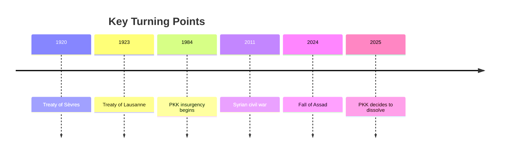

# The Kurdish Question Across Turkey, Syria, Iraq, and Iran

## 1. Executive Summary

The Kurdish question cannot be read as a single line of conflict between "the Kurds" and "the states around them." In Turkey it is a problem of insurgency and domestic integration; in Syria it is a question of autonomy inside postwar state reconstruction; in Iraq it is a problem of federalism, oil, and security; and in Iran it is mainly a problem of regime security and fragmented opposition. As of 2026, Syria's post-Assad transition, the PKK's 2025 decision to dissolve and disarm, and the slow implementation of Damascus-SDF integration talks have changed the regional baseline. <SourceNote>[Britannica, Kurd](https://www.britannica.com/topic/Kurd), [Britannica, Syria](https://www.britannica.com/place/Syria), [AP, PKK says it will disarm and dissolve after Ocalan's call](https://apnews.com/article/9f4347a04cba48ceb509d2e82023a19e) support this reading.</SourceNote>

The practical takeaway is simple. Kurds live across four states, but their legal status, armed organizations, party systems, and room for autonomy differ sharply by country. Turkish security language tends to bundle PKK-linked groups together, yet that simplification does not fit local politics. Refugee flows, autonomy claims, counterterrorism, and border control are linked, so a move in one arena spills into the others. <SourceNote>[Britannica, Turkey](https://www.britannica.com/place/Turkey), [Britannica, Kurd](https://www.britannica.com/topic/Kurd), [AP, Turkey, Iraq agree to cooperate on security and oil pipeline talks](https://apnews.com/article/6ebdab07362d4402c6ec4d01c79c192b) support this interpretation.</SourceNote>

The bottom line is that this is a minority-rights issue and a state-formation issue at the same time. The right question is not "Who are the Kurds?" but "Which state, which institution, which armed actor, and which social pressure is colliding in which place?" <SourceNote>[Britannica, Kurd](https://www.britannica.com/topic/Kurd), [Britannica, Iraq](https://www.britannica.com/place/Iraq) support this framing.</SourceNote>

## 2. Historical Backbone

After the collapse of the Ottoman Empire, the Kurdish population was split across four states. The 1920 Treaty of Sèvres pointed toward Kurdish autonomy or even independence, but the 1923 Treaty of Lausanne removed that premise. The modern Middle East was therefore consolidated without a Kurdish state, and that unresolved promise still shapes the issue today. <SourceNote>[Britannica, Kurd](https://www.britannica.com/topic/Kurd) supports this background.</SourceNote>

Each state then built a different order. In Turkey, republican state-building turned the Kurdish question into a security and assimilation issue. In Iraq, Kurdish autonomy became institutionalized inside a federal framework. In Syria, Ba'ath rule restricted Kurdish citizenship and cultural rights. In Iran, Kurdish regions remained on the state periphery, where opposition and security policy became intertwined. <SourceNote>[Britannica, Turkey](https://www.britannica.com/place/Turkey), [Britannica, Iraq](https://www.britannica.com/place/Iraq), [Britannica, Syria](https://www.britannica.com/place/Syria), [Britannica, Kurd](https://www.britannica.com/topic/Kurd) support this summary.</SourceNote>

Since the 1990s, the issue has multiplied rather than narrowed. The PKK insurgency, the consolidation of autonomy in northern Iraq, self-rule in northeastern Syria after 2011, and the cross-border activism of Iranian Kurdish groups have created several different Kurdish political arenas. The Syrian civil war was especially important because the anti-ISIS campaign and U.S. support helped create a new security and governance structure in the northeast. <SourceNote>[Britannica, Kurd](https://www.britannica.com/topic/Kurd), [AP, Syria's Kurdish forces to merge into country's institutions in deal with Damascus](https://apnews.com/article/8de0e2723f04f5a9d4c78540a9f47d5) support this point.</SourceNote>

The meaning of this timeline is not that the Kurdish question is frozen in the past. It is that treaties, republics, civil wars, cross-border militancy, and autonomy talks have repeatedly changed its form. The 2025 PKK decision, for example, does not end the issue; it opens a new phase in which fighters, autonomy projects, border control, and returns all have to be re-sorted. <SourceNote>[AP, PKK says it will disarm and dissolve after Ocalan's call](https://apnews.com/article/9f4347a04cba48ceb509d2e82023a19e) supports this inference.</SourceNote>

## 3. Four Arenas

The Kurdish question is closer to four connected arenas than to one front line.

| Country / arena | Main Kurdish actors | Core issue | Reading as of 2026 |
| --- | --- | --- | --- |
| Turkey | PKK, legal parties, Kurdish voters | Security, counterterrorism, assimilation, electoral politics | The state still treats PKK-linked actors as the central threat while also trying to manage domestic political tension |
| Syria | SDF, YPG, northeast self-administration | Autonomy, state reconstruction, anti-ISIS, anti-Turkey security | The post-Assad transition has left the northeast in a negotiated and unstable middle ground |
| Iraq | KRG, KDP, PUK, PKK rear areas | Federalism, oil, budgets, border security | Autonomy is institutionalized, but Baghdad and Ankara keep applying pressure |
| Iran | PDKI, Komala, PJAK, other opposition groups | Regime security, border control, opposition fragmentation | Kurdish opposition is split and is usually treated by Tehran as a security problem first |

In Turkey, the Kurdish question has been a security issue since the republic's state-building phase. The PKK's armed struggle, which began in 1984, has remained central to state doctrine, and the 2025 decision to disarm and dissolve changed the political map without erasing Kurdish demands or Kurdish politics. <SourceNote>[Britannica, Turkey](https://www.britannica.com/place/Turkey), [AP, PKK says it will disarm and dissolve after Ocalan's call](https://apnews.com/article/9f4347a04cba48ceb509d2e82023a19e) support this claim.</SourceNote>

In Syria, Kurdish self-rule expanded because of civil war and the anti-ISIS campaign. The SDF gained legitimacy as a U.S.-backed partner against ISIS, but Damascus also saw it as a quasi-state actor filling a sovereignty vacuum. The 2025 integration deal was therefore less a final settlement than an attempt to define how much of the northeast would be returned to central control. <SourceNote>[AP, Syria's Kurdish forces to merge into country's institutions in deal with Damascus](https://apnews.com/article/8de0e2723f04f5a9d4c78540a9f47d5), [Britannica, Syria](https://www.britannica.com/place/Syria) support this reading.</SourceNote>

In Iraq, the Kurdish question is no longer mainly a rebellion against the state. It is a question of how federalism works in practice. The KRG has formal autonomy, but oil revenue, budget transfers, the integration of the peshmerga, the presence of PKK rear areas, and coordination with Turkey all remain active problems. Autonomy does not eliminate friction; in some ways it makes the bargaining permanent. <SourceNote>[Britannica, Kurd](https://www.britannica.com/topic/Kurd), [AP, Turkey, Iraq agree to cooperate on security and oil pipeline talks](https://apnews.com/article/6ebdab07362d4402c6ec4d01c79c192b) support this point.</SourceNote>

In Iran, Kurdish politics is squeezed into a narrower space. Cross-border opposition groups exist, but the state treats them as territorial-security problems, and it tends to frame Kurdish regions through regime security rather than rights. Some Iranian Kurdish organizations based in Iraqi Kurdistan are better understood as parts of a fragmented opposition field than as a single independence movement. <SourceNote>[Britannica, Kurd](https://www.britannica.com/topic/Kurd), [AP, Iranian Kurdish opposition groups struggle to find common ground](https://apnews.com/article/6beae57e9fdc3546a61ec8f1432eef4b) support this interpretation.</SourceNote>

## 4. Syria, ISIS, and Turkish Military Operations

The Syrian civil war was the main event that pulled the Kurdish question back into regional geopolitics. From 2011 onward, Kurdish forces in the northeast built a quasi-autonomous order out of state collapse, ISIS expansion, and the U.S.-led anti-ISIS campaign. That was both an expansion of autonomy and a forward-loading of state-like responsibilities. Schools, prisons, checkpoints, oil fields, and defense were all managed locally, but the area did not enjoy the protection of a sovereign state. <SourceNote>[AP, Syria's Kurdish forces to merge into country's institutions in deal with Damascus](https://apnews.com/article/8de0e2723f04f5a9d4c78540a9f47d5), [Britannica, Kurd](https://www.britannica.com/topic/Kurd) support this point.</SourceNote>

Turkey's perspective was the reverse. Ankara viewed the Kurdish armed structures in northern Syria as an extension of the PKK and therefore as a direct security threat. Cross-border operations since 2016, allegations of abuses after the Afrin occupation, and the remaking of the border zone all pushed Turkish security interests, Syrian sovereignty, and northeastern Syrian autonomy in opposite directions. The same military action can therefore be described as self-defense, occupation, or stabilization, depending on the actor speaking. <SourceNote>[AP, Turkish occupation, abuses in Afrin and northern Syria reported by rights groups](https://apnews.com/article/f34b15d7cefc44adb380660dde75838e), [Britannica, Turkey](https://www.britannica.com/place/Turkey) support this point.</SourceNote>

The humanitarian backlog also remains unresolved. Detention camps such as al-Hol, family reunification, the separation of combatants from civilians, and the legal status of returnees are still not solved. The anti-ISIS war was therefore not only a military campaign; it left behind an incomplete postwar order that Kurdish institutions continue to administer. <SourceNote>[AP, Syria's Kurdish forces to merge into country's institutions in deal with Damascus](https://apnews.com/article/8de0e2723f04f5a9d4c78540a9f47d5) supports this claim.</SourceNote>

## 5. Civilian Sentiment and Security Language

The most difficult part of the issue is the clash between civilian lived experience and state security language. In Turkey, the government foregrounds territorial integrity and counterterrorism, while Kurdish citizens and activists focus on language, local government, mobility, and relief from police and military pressure. In Syria, some residents want autonomy and others want a return to central rule. In Iraq, salaries, budgets, jobs, and security are often more immediate than ethnic slogans. <SourceNote>[Britannica, Turkey](https://www.britannica.com/place/Turkey), [Britannica, Iraq](https://www.britannica.com/place/Iraq), [Britannica, Syria](https://www.britannica.com/place/Syria) support this summary.</SourceNote>

The Kurdish side is not homogeneous either. Urban voters, mountain insurgents, administrators in autonomous institutions, camp residents, diaspora communities, and tribal networks do not all rank the same goals in the same order. So the phrase "support the Kurds" is too vague to be operational. It does not say whose safety, autonomy, or return is being protected. <SourceNote>[Britannica, Kurd](https://www.britannica.com/topic/Kurd) supports this reading. This is an inference from public information.</SourceNote>

State security language is also not homogeneous. Turkey reads the issue through PKK-centric domestic security and border control. Iraq emphasizes federal order and the containment of cross-border militancy. Damascus prioritizes sovereignty restoration. Iran prioritizes deterrence against dissent and separatism. Put differently, states are usually less afraid of "the Kurds" as an ethnicity than of governance being rewritten from across the border. <SourceNote>[AP, Turkey, Iraq agree to cooperate on security and oil pipeline talks](https://apnews.com/article/6ebdab07362d4402c6ec4d01c79c192b), [AP, Iranian Kurdish opposition groups struggle to find common ground](https://apnews.com/article/6beae57e9fdc3546a61ec8f1432eef4b), [Britannica, Turkey](https://www.britannica.com/place/Turkey) support this point.</SourceNote>

## 6. Assistance, Sanctions, and Security Lenses

For Japanese policymakers and companies, this is not a single "Middle East ethnic issue" but a multi-jurisdictional risk problem. In foreign assistance, it matters that northeastern Syria, Turkish Kurdish voters, the KRG, and Iranian Kurdish opposition groups are not interchangeable. In sanctions screening and security review, PKK-related, SDF-related, and KRG-related cases need to be reviewed by jurisdiction and by actual control on the ground. <SourceNote>[Britannica, Kurd](https://www.britannica.com/topic/Kurd), [AP, PKK says it will disarm and dissolve after Ocalan's call](https://apnews.com/article/9f4347a04cba48ceb509d2e82023a19e), [AP, Turkey, Iraq agree to cooperate on security and oil pipeline talks](https://apnews.com/article/6ebdab07362d4402c6ec4d01c79c192b) support this recommendation.</SourceNote>

Four practical questions matter most.

1. How far can Turkey's domestic politics absorb Kurdish claims without returning to a pure security frame?
1. Does the Damascus-SDF integration track become autonomy reduction or a step toward a looser federal arrangement?
1. Will the KRG remain a durable autonomous layer, or will fiscal and security pressure erode it?
1. Can Iranian Kurdish opposition groups connect back to domestic politics, or will they remain fragmented cross-border actors?

These questions are linked. If northeastern Syria is reintegrated into central structures, Turkey's border calculus changes. If Turkey's domestic reconciliation channel narrows, cross-border operations and security pressure will squeeze autonomy spaces elsewhere. <SourceNote>[AP, Syria's Kurdish forces to merge into country's institutions in deal with Damascus](https://apnews.com/article/8de0e2723f04f5a9d4c78540a9f47d5), [AP, Turkey, Iraq agree to cooperate on security and oil pipeline talks](https://apnews.com/article/6ebdab07362d4402c6ec4d01c79c192b) support this point.</SourceNote>

## 7. Limits and Watchpoints

The main limitation of this report is that the Kurdish question mixes emotion, security, autonomy, sect, tribe, refugees, and cross-border militancy, so public sources cannot fully reveal internal decision-making. In addition, local statements are politically loaded, so military and security claims should not be treated as transparent facts. The report therefore uses public information as the basis for an informed reading rather than a final verdict. <SourceNote>[Britannica, Kurd](https://www.britannica.com/topic/Kurd), [AP, Syria's Kurdish forces to merge into country's institutions in deal with Damascus](https://apnews.com/article/8de0e2723f04f5a9d4c78540a9f47d5) support this limitation statement.</SourceNote>

The next watchpoints are straightforward.

1. Will PKK disarmament actually move from declaration to implementation?
1. Will the SDF-Damascus deal appear in real command structures?
1. Can Turkey-Iraq security cooperation be kept from eroding KRG autonomy?
1. Will displacement and property-transfer disputes in Afrin and northern Syria be corrected?
1. Will Iranian Kurdish groups remain fragmented, or develop a common strategy?

If none of these move, "resolution" will remain rhetorical. If they do move, the Kurdish question can shift from a frozen ethnic conflict toward a sequence of institutional bargains. <SourceNote>[AP, PKK says it will disarm and dissolve after Ocalan's call](https://apnews.com/article/9f4347a04cba48ceb509d2e82023a19e), [AP, Turkey, Iraq agree to cooperate on security and oil pipeline talks](https://apnews.com/article/6ebdab07362d4402c6ec4d01c79c192b), [AP, Iranian Kurdish opposition groups struggle to find common ground](https://apnews.com/article/6beae57e9fdc3546a61ec8f1432eef4b) support this conclusion.</SourceNote>

## 8. References

- [Britannica, Kurd](https://www.britannica.com/topic/Kurd)
- [Britannica, Turkey](https://www.britannica.com/place/Turkey)
- [Britannica, Iraq](https://www.britannica.com/place/Iraq)
- [Britannica, Syria](https://www.britannica.com/place/Syria)
- [AP, PKK says it will disarm and dissolve after Ocalan's call](https://apnews.com/article/9f4347a04cba48ceb509d2e82023a19e)
- [AP, Syria's Kurdish forces to merge into country's institutions in deal with Damascus](https://apnews.com/article/8de0e2723f04f5a9d4c78540a9f47d5)
- [AP, Turkey, Iraq agree to cooperate on security and oil pipeline talks](https://apnews.com/article/6ebdab07362d4402c6ec4d01c79c192b)
- [AP, Iranian Kurdish opposition groups struggle to find common ground](https://apnews.com/article/6beae57e9fdc3546a61ec8f1432eef4b)
- [AP, Turkish occupation, abuses in Afrin and northern Syria reported by rights groups](https://apnews.com/article/f34b15d7cefc44adb380660dde75838e)
