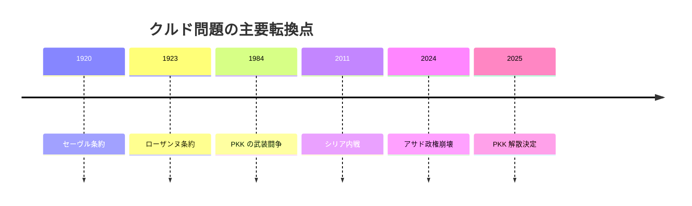

# トルコ・シリア・クルド問題を地域政治として整理する

## 1. エグゼクティブサマリー

クルド問題は、単一の「クルド民族 vs 各国政府」という一本線では読めない。トルコでは反乱鎮圧と国内統合の問題、シリアでは内戦後の自治と国家再建の問題、イラクでは連邦制と石油・治安の問題、イランでは治安維持と反体制勢力の分断の問題として現れる。2026 年時点では、アサド政権崩壊後のシリア再編、PKK の解散・武装解除決定、SDF とダマスカスの統合交渉の停滞が重なり、地域全体の前提が 2010 年代とは変わっている。<SourceNote>[Britannica, Kurd](https://www.britannica.com/topic/Kurd)、[Britannica, Syria](https://www.britannica.com/place/Syria)、[AP, PKK says it will disarm and dissolve after Ocalan's call](https://apnews.com/article/9f4347a04cba48ceb509d2e82023a19e) に基づく。</SourceNote>

判断上の要点は三つある。第一に、クルド人は四カ国にまたがって暮らすが、各国で法的位置、武装組織、政党、自治の可能性が異なる。第二に、トルコの安全保障言説は PKK とその関連組織をひとまとめにしやすいが、現地政治はその単純化に収まらない。第三に、難民、自治、対テロ、国境管理は相互に連動しており、どこか一つを動かすと他の現場に波及する。<SourceNote>[Britannica, Turkey](https://www.britannica.com/place/Turkey)、[Britannica, Kurd](https://www.britannica.com/topic/Kurd)、[AP, Turkey, Iraq agree to cooperate on security and oil pipeline talks](https://apnews.com/article/6ebdab07362d4402c6ec4d01c79c192b) に基づく。</SourceNote>

結論だけ先に言えば、これは民族問題であると同時に、国家形成が未完のまま残した国境管理の問題である。したがって、政策判断では「クルド人は誰か」よりも、「どの国で、どの制度、どの武装主体、どの生活圧力が衝突しているか」を先に分けるべきである。<SourceNote>[Britannica, Kurd](https://www.britannica.com/topic/Kurd)、[Britannica, Iraq](https://www.britannica.com/place/Iraq) に基づく。</SourceNote>

## 2. 歴史の骨格

クルド人は、オスマン帝国崩壊後の国境再編の中で四カ国に分かれた。1920 年のセーヴル条約はクルド自治や独立の可能性を示したが、1923 年のローザンヌ条約ではその前提が消え、以後の中東秩序はクルド国家を持たないまま固定された。ここが、今日の「自決の約束が残ったまま国家化しなかった」起点である。<SourceNote>[Britannica, Kurd](https://www.britannica.com/topic/Kurd) に基づく。</SourceNote>

その後の各国は別々の制度を作った。トルコでは共和国建設と国民国家化の過程でクルド問題が治安・同化の論点になり、イラクでは連邦制の枠内にクルド地域が制度化され、シリアではバアス体制の下でクルド人が市民権や文化権の制約を受けた。イランではクルド地域は国家の周縁に置かれ、反体制政治と治安対策が結びついた。<SourceNote>[Britannica, Turkey](https://www.britannica.com/place/Turkey)、[Britannica, Iraq](https://www.britannica.com/place/Iraq)、[Britannica, Syria](https://www.britannica.com/place/Syria)、[Britannica, Kurd](https://www.britannica.com/topic/Kurd) に基づく。</SourceNote>

1990 年代以降は、PKK の武装闘争、イラク北部の自治強化、シリア内戦後の北東部自治、イラン系クルド反体制勢力の越境拠点化が重なり、クルド問題は一つの正面戦から複数の正面へ拡散した。2011 年以降のシリア内戦は特に大きく、ISIS 掃討戦と米国支援が、北東シリアの自治と治安機構を新たに作った。<SourceNote>[Britannica, Kurd](https://www.britannica.com/topic/Kurd)、[AP, Syria's Kurdish forces to merge into country's institutions in deal with Damascus](https://apnews.com/article/8de0e2723f04f5a9d4c78540a9f47d5a) に基づく。</SourceNote>

この年表の意味は、クルド問題が「古い民族紛争」のまま止まっているのではなく、条約、共和国、内戦、越境武装、自治交渉のたびに形を変えてきたという点にある。2025 年の PKK 解散決定も、それ自体で問題を終わらせるのではなく、残る武装勢力、自治構想、帰還、国境管理の再配置を始める契機に近い。<SourceNote>[AP, PKK says it will disarm and dissolve after Ocalan's call](https://apnews.com/article/9f4347a04cba48ceb509d2e82023a19e) に基づく。</SourceNote>

## 3. 4つの現場

クルド問題は一つの戦線ではなく、四つの現場として見るほうが現実に近い。

| 国・現場 | 主要なクルド勢力 | 中心争点 | 2026 年時点の読み |
| --- | --- | --- | --- |
| トルコ | PKK、合法政党、地方自治を求める有権者 | 治安、テロ対策、同化、選挙政治 | 国家は PKK を中心脅威とみなしつつ、国内政治の緊張管理も迫られている |
| シリア | SDF、YPG、北東シリア自治機構 | 自治、国家再編、対 ISIS、対トルコ安全保障 | アサド崩壊後の再編の中で、統合と自治の折衷が続いている |
| イラク | KRG、KDP、PUK、PKK の越境拠点 | 連邦制、石油、予算、国境治安 | 自治は制度化されているが、バグダッドとアンカラの圧力が常時かかる |
| イラン | PDKI、Komala、PJAK など | 反体制、治安、国境地帯の統制 | 反政府勢力は分裂しており、越境拠点は政治空間というより治安空間として扱われやすい |

トルコでは、クルド問題は共和国建設以来の治安問題であり、国内政治の争点でもある。PKK は 1984 年以来の武装闘争で国家を揺さぶり、2025 年には解散・武装解除を決めたが、関連組織や政治的要求が消えたわけではない。<SourceNote>[Britannica, Turkey](https://www.britannica.com/place/Turkey)、[AP, PKK says it will disarm and dissolve after Ocalan's call](https://apnews.com/article/9f4347a04cba48ceb509d2e82023a19e) に基づく。</SourceNote>

シリアでは、クルド自治は内戦と ISIS 掃討の副産物として拡大した。SDF は米国の対 ISIS パートナーとして正当性を得た一方、ダマスカスにとっては主権の空白を埋めた準国家主体でもあった。2025 年の統合合意は、北東シリアの現状を固定するというより、どこまで中央政府に戻すかをめぐる暫定線だった。<SourceNote>[AP, Syria's Kurdish forces to merge into country's institutions in deal with Damascus](https://apnews.com/article/8de0e2723f04f5a9d4c78540a9f47d5a)、[Britannica, Syria](https://www.britannica.com/place/Syria) に基づく。</SourceNote>

イラクでは、クルド問題は既に「国家に対する反乱」よりも「連邦制の運用」として現れる。KRG は制度上の自治を持つが、石油収入、予算配分、ペシュメルガの統合、PKK の越境拠点、トルコとの軍事・経済協調が常に絡む。つまり、自治があるから安定ではなく、自治があるからこそ調整コストが継続する。<SourceNote>[Britannica, Kurd](https://www.britannica.com/topic/Kurd)、[AP, Turkey, Iraq agree to cooperate on security and oil pipeline talks](https://apnews.com/article/6ebdab07362d4402c6ec4d01c79c192b) に基づく。</SourceNote>

イランでは、クルド政治はより狭い政治空間に押し込まれる。越境する反体制組織は存在するが、国家はそれを領土保全の問題として扱い、国内のクルド住民に対しても治安言説を優先しやすい。イラク北部に拠点を持つ一部のイラン系クルド勢力は、単一の「クルド独立運動」というより、分裂した反体制圏の一部として理解したほうが実態に近い。<SourceNote>[Britannica, Kurd](https://www.britannica.com/topic/Kurd)、[AP, Iranian Kurdish opposition groups struggle to find common ground](https://apnews.com/article/6beae57e9fdc3546a61ec8f1432eef4b) に基づく。</SourceNote>

## 4. シリア内戦、ISIS、トルコの軍事作戦

シリア内戦は、クルド問題を地域政治に引き戻した最大の要因だった。2011 年以降、北東部のクルド勢力は、ダマスカスの統治空白、ISIS の台頭、米国主導の対 ISIS 作戦の中で準自治体制を作った。これは自治の拡大であると同時に、統治責任の前倒しでもあった。学校、刑務所、検問、油田、防衛を引き受けることで、クルド側は国家のように見える部分を持ったが、国家の保護は持たなかった。<SourceNote>[AP, Syria's Kurdish forces to merge into country's institutions in deal with Damascus](https://apnews.com/article/8de0e2723f04f5a9d4c78540a9f47d5a)、[Britannica, Kurd](https://www.britannica.com/topic/Kurd) に基づく。</SourceNote>

トルコの見方は逆である。アンカラにとって、シリア北部のクルド武装勢力は PKK と地続きの安全保障脅威に見える。2016 年以降の越境作戦、アフリン占領後の人権侵害の指摘、国境地帯の再編は、トルコの安全保障とシリアの主権と北東シリアの自治を同時に圧迫した。ここでは、同じ軍事行動が「自衛」「占領」「治安回復」のどれに見えるかで、評価が大きく割れる。<SourceNote>[AP, Turkish occupation, abuses in Afrin and northern Syria reported by rights groups](https://apnews.com/article/f34b15d7cefc44adb380660dde75838e)、[Britannica, Turkey](https://www.britannica.com/place/Turkey) に基づく。</SourceNote>

人道面では、アル・ホールなどの拘束キャンプ、避難、家族再統合、戦闘員と市民の区分けが終わっていない。対 ISIS 戦争は軍事的には後退しても、収容、帰還、再教育、法的責任の問題として残る。つまり、クルド自治体が抱えたのは「勝利」ではなく、戦後秩序の不完全な請負だった。<SourceNote>[AP, Syria's Kurdish forces to merge into country's institutions in deal with Damascus](https://apnews.com/article/8de0e2723f04f5a9d4c78540a9f47d5a) に基づく。</SourceNote>

## 5. 市民感情と国家安全保障言説

この問題で厄介なのは、市民の生活感覚と国家の安全保障言説が正面衝突しやすいことだ。トルコ政府は領土保全と対テロを前面に出し、クルド側は言語、地方自治、移動の自由、警察・軍事による圧迫の軽減を求める。シリアでは、自治を求める住民もいれば、中央政府への復帰を望む人もおり、イラクでは給与、予算、雇用、治安のほうが民族標語より切実なことが多い。<SourceNote>[Britannica, Turkey](https://www.britannica.com/place/Turkey)、[Britannica, Iraq](https://www.britannica.com/place/Iraq)、[Britannica, Syria](https://www.britannica.com/place/Syria) に基づく。</SourceNote>

ここでの重要点は、クルド人の側にも単一の政治意識はないということだ。都市の有権者、山岳部の武装組織、自治機構の職員、難民キャンプの住民、ディアスポラ、部族ネットワークは、同じ民族名で束ねられても優先順位が違う。したがって、外部から「クルド人を支援する」と言うだけでは、誰の安全、誰の自律、誰の帰還を支援するのかが不明なままである。<SourceNote>[Britannica, Kurd](https://www.britannica.com/topic/Kurd) に基づく。ここでの分類は公開情報からの推定である。</SourceNote>

国家側の安全保障言説も一枚岩ではない。トルコは PKK を中心に国内治安と国境管理を読むが、イラク政府は連邦秩序と越境武装の抑制を重視し、ダマスカスは主権回復を優先し、イランは反体制と分離主義の抑止を重視する。言い換えると、同じ「クルド問題」でも、国家が恐れているのは民族そのものではなく、自国の統治が他所から上書きされることだ。<SourceNote>[AP, Turkey, Iraq agree to cooperate on security and oil pipeline talks](https://apnews.com/article/6ebdab07362d4402c6ec4d01c79c192b)、[AP, Iranian Kurdish opposition groups struggle to find common ground](https://apnews.com/article/6beae57e9fdc3546a61ec8f1432eef4b)、[Britannica, Turkey](https://www.britannica.com/place/Turkey) に基づく。</SourceNote>

## 6. 支援・制裁・安全保障での読み方

日本の政策担当者や企業にとって、このテーマは「中東の民族問題」ではなく、複数国にまたがる制度リスクである。対外援助では、シリア北東部の自治機構、トルコ国内のクルド有権者、イラクの KRG、イランの越境反体制勢力を同じ箱に入れないことが重要になる。安全保障やコンプライアンスでは、PKK 関連、SDF 関連、KRG 関連の案件を、法域ごとに分けて審査する必要がある。<SourceNote>[Britannica, Kurd](https://www.britannica.com/topic/Kurd)、[AP, PKK says it will disarm and dissolve after Ocalan's call](https://apnews.com/article/9f4347a04cba48ceb509d2e82023a19e)、[AP, Turkey, Iraq agree to cooperate on security and oil pipeline talks](https://apnews.com/article/6ebdab07362d4402c6ec4d01c79c192b) に基づく。</SourceNote>

見るべき論点は四つある。

1. トルコの国内政治と対クルド安全保障が、どこまで選挙政治に吸収されるか。
1. シリアで SDF とダマスカスの統合交渉が、自治の縮小か連邦化の入口か。
1. イラクで KRG の制度的自治が、石油と予算の交渉で弱体化するか、逆に固定化するか。
1. イランで反体制クルド勢力が、越境拠点から国内政治へ接続し直せるか。

この四点は互いに独立していない。たとえば、シリア北東部が中央政府に再統合されれば、トルコの国境安全保障の計算は変わるし、イラク北部への軍事圧力の置き方も変わる。逆に、トルコ国内の和解回路が細ると、越境作戦と治安圧力が他国の自治空間をさらに狭める。<SourceNote>[AP, Syria's Kurdish forces to merge into country's institutions in deal with Damascus](https://apnews.com/article/8de0e2723f04f5a9d4c78540a9f47d5a)、[AP, Turkey, Iraq agree to cooperate on security and oil pipeline talks](https://apnews.com/article/6ebdab07362d4402c6ec4d01c79c192b) に基づく。</SourceNote>

## 7. 限界と監視ポイント

この報告の限界は、クルド問題が感情、治安、自治、宗派、部族、難民、越境武装を同時に含むため、公開情報だけでは内部意思決定を完全に追えない点にある。さらに、現地組織の声明は政治的意図を強く帯びるので、軍事・治安の数字をそのまま実態とみなすのは危険である。したがって、本文は断定ではなく、公開情報からの推定を含む読みとして使うべきである。<SourceNote>[Britannica, Kurd](https://www.britannica.com/topic/Kurd)、[AP, Syria's Kurdish forces to merge into country's institutions in deal with Damascus](https://apnews.com/article/8de0e2723f04f5a9d4c78540a9f47d5) に基づく。</SourceNote>

今後の監視ポイントは次の五つである。

1. PKK の解散・武装解除が実行段階に入るか。
1. SDF とダマスカスの統合合意が、実際の指揮系統に反映されるか。
1. トルコとイラクの安全保障協力が、KRG の自治と競合しない形に収まるか。
1. アフリンやシリア北部での住民移転・資産移転の問題が是正されるか。
1. イラン系クルド勢力の分裂が続くか、それとも共通戦略が生まれるか。

これらが改善しない限り、地域の「解決」は言葉だけに留まる。逆に、ここが動けば、クルド問題は民族対立の固定化から、制度交渉の問題へ少しずつ移る。<SourceNote>[AP, PKK says it will disarm and dissolve after Ocalan's call](https://apnews.com/article/9f4347a04cba48ceb509d2e82023a19e)、[AP, Turkey, Iraq agree to cooperate on security and oil pipeline talks](https://apnews.com/article/6ebdab07362d4402c6ec4d01c79c192b)、[AP, Iranian Kurdish opposition groups struggle to find common ground](https://apnews.com/article/6beae57e9fdc3546a61ec8f1432eef4b) に基づく。</SourceNote>

## 8. 参考情報

- [Britannica, Kurd](https://www.britannica.com/topic/Kurd)
- [Britannica, Turkey](https://www.britannica.com/place/Turkey)
- [Britannica, Iraq](https://www.britannica.com/place/Iraq)
- [Britannica, Syria](https://www.britannica.com/place/Syria)
- [AP, PKK says it will disarm and dissolve after Ocalan's call](https://apnews.com/article/9f4347a04cba48ceb509d2e82023a19e)
- [AP, Syria's Kurdish forces to merge into country's institutions in deal with Damascus](https://apnews.com/article/8de0e2723f04f5a9d4c78540a9f47d5)
- [AP, Turkey, Iraq agree to cooperate on security and oil pipeline talks](https://apnews.com/article/6ebdab07362d4402c6ec4d01c79c192b)
- [AP, Iranian Kurdish opposition groups struggle to find common ground](https://apnews.com/article/6beae57e9fdc3546a61ec8f1432eef4b)
- [AP, Turkish occupation, abuses in Afrin and northern Syria reported by rights groups](https://apnews.com/article/f34b15d7cefc44adb380660dde75838e)
