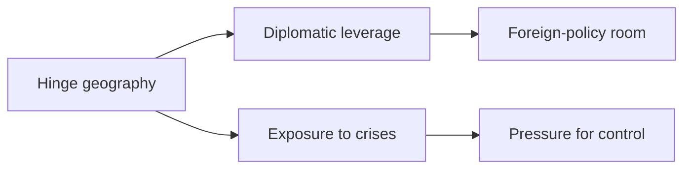
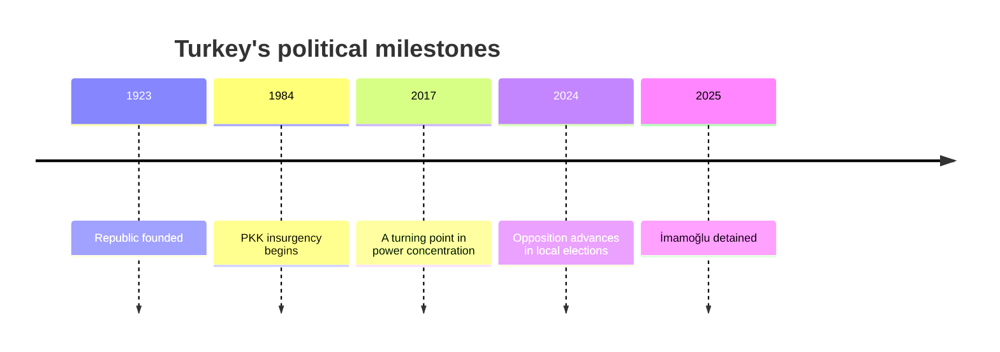
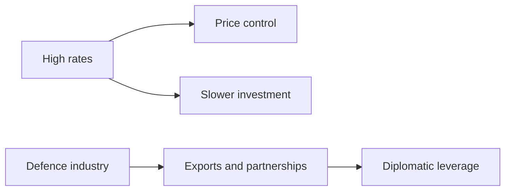

# Turkey Gets Heavier as It Sits on the Hinge

## 1. Executive Summary

Turkey sits at NATO's southeastern edge and also acts as a corridor linking the Black Sea, the eastern Mediterranean, the Middle East, and the Caucasus. <SourceNote>[AP, Erdogan's warm ties with Trump offer Turkey an edge ahead of NATO summit](https://apnews.com/article/c3fbddc43d7f4b0b12fcc2442ee03613) and [Republic of Türkiye Ministry of Foreign Affairs](https://www.mfa.gov.tr/default.en.mfa) support this point.</SourceNote>

The foreign ministry's 2026 page puts the EU, Russia, the Kurdistan Regional Government in Iraq, Syria, and Azerbaijan on the same operating map. <SourceNote>[Republic of Türkiye Ministry of Foreign Affairs](https://www.mfa.gov.tr/default.en.mfa)</SourceNote>

The Erdogan government uses that geography to negotiate abroad and to concentrate power in the presidency at home. <SourceNote>[Republic of Türkiye Ministry of Foreign Affairs](https://www.mfa.gov.tr/default.en.mfa)</SourceNote>

In the economy, the central bank kept the policy rate at 37 percent on 11 June 2026 and stayed focused on tightening and inflation control. <SourceNote>[Central Bank of the Republic of Türkiye](https://www.tcmb.gov.tr/wps/wcm/connect/EN/TCMB%2BEN)</SourceNote>

In politics, the opposition held the big cities in the 2024 local election, and pressure over courts and speech continued afterward. <SourceNote>[AP, In setback to Turkey's Erdogan, opposition makes huge gains in local election](https://apnews.com/article/8adc4df56cdbce24f78900e1d142ff21) and [AP, Turkish comedian sent to jail to await trial on charges of insulting Erdogan](https://apnews.com/article/b58784ab5e54dbcac37a239b933fdf37) support this point.</SourceNote>

The conclusion is simple. Turkey is a strong state, but the source of that strength is also a source of instability.

The diagram shows that geography creates leverage while also increasing exposure. Turkey's strength lies in adjustment, not escape. <SourceNote>[Republic of Türkiye Ministry of Foreign Affairs](https://www.mfa.gov.tr/default.en.mfa) and [AP, Erdogan's warm ties with Trump offer Turkey an edge ahead of NATO summit](https://apnews.com/article/c3fbddc43d7f4b0b12fcc2442ee03613) support the structure; the reading of exposure and adjustment is an inference from public information.</SourceNote>

## 2. Historical and State-Building Frame

Modern Turkey begins with the collapse of the Ottoman Empire and the founding of the republic. <SourceNote>[Britannica, Turkey](https://www.britannica.com/place/Turkey) supports this point.</SourceNote>

The republic put the army, the bureaucracy, secularism, and national integration at the center of state design. <SourceNote>[Britannica, Turkey](https://www.britannica.com/place/Turkey) supports this point.</SourceNote>

Turkish politics then moved through military interventions, party competition, EU alignment, and later power concentration. <SourceNote>[Britannica, Turkey](https://www.britannica.com/place/Turkey) supports this point.</SourceNote>

The 2024 local election showed that the opposition could still win major cities such as Istanbul and Ankara. <SourceNote>[AP, In setback to Turkey's Erdogan, opposition makes huge gains in local election](https://apnews.com/article/8adc4df56cdbce24f78900e1d142ff21) supports this claim.</SourceNote>

The point of the timeline is that Turkish politics has preserved the old republican frame while repeatedly rewriting its contents. The current conflict sits inside the institutions, not outside them.

## 3. Current Political System

Power now sits across the presidency, the ruling bloc, the bureaucracy, and the metropolitan municipalities. <SourceNote>[Republic of Türkiye Ministry of Foreign Affairs](https://www.mfa.gov.tr/default.en.mfa) and [AP, In setback to Turkey's Erdogan, opposition makes huge gains in local election](https://apnews.com/article/8adc4df56cdbce24f78900e1d142ff21) support this point.</SourceNote>

The foreign ministry homepage puts President Recep Tayyip Erdogan and Foreign Minister Hakan Fidan at the front. <SourceNote>[Republic of Türkiye Ministry of Foreign Affairs](https://www.mfa.gov.tr/default.en.mfa)</SourceNote>

That layout shows how foreign policy and domestic politics move along the same power line. The president holds the final line of coordination, the foreign ministry handles the surrounding crises, and local governments absorb the friction of daily life.

| Actor | Role | What to watch |
| --- | --- | --- |
| Presidency | Sets budgets and priorities | How concentrated the power remains |
| Ruling bloc | Supports bills and appointments | Coalition stability |
| Opposition | Pushes back through cities, courts, and prices | Durability of the urban vote |
| Bureaucracy | Carries out and contains policy | How far orders travel |
| Municipalities | Run housing, transport, and welfare | Friction with the center |
| Media and civil society | Measure legitimacy | How wide the criticism space is |

Pressure over courts and speech keeps the Erdogan system from looking monolithic. AP and the Guardian reported on the detention of Istanbul Mayor Ekrem Imamoğlu in 2025 and on the jailing of a satirical comedian in 2026. <SourceNote>[The Guardian, 'Entirely political': Istanbul mayor charged with 142 offences that could total 2,000 years in jail](https://www.theguardian.com/world/2025/nov/11/istanbul-mayor-ekrem-imamoglu-charged-bribery-extortion-turkey) and [AP, Turkish comedian sent to jail to await trial on charges of insulting Erdogan](https://apnews.com/article/b58784ab5e54dbcac37a239b933fdf37) support this point.</SourceNote>

The political picture is not decided by elections alone. Courts, permits, budgets, municipalities, and media all carry pressure, so power looks dispersed on the surface and then pulls back to the presidency at the end.

## 4. Security and External Relations

Turkey tries to stay aligned with the United States and Europe inside NATO while also balancing Russia and keeping room for mediation in the Black Sea war. <SourceNote>[AP, Erdogan's warm ties with Trump offer Turkey an edge ahead of NATO summit](https://apnews.com/article/c3fbddc43d7f4b0b12fcc2442ee03613) and [Republic of Türkiye Ministry of Foreign Affairs](https://www.mfa.gov.tr/default.en.mfa) support this point.</SourceNote>

The foreign ministry's 2026 updates place a Syria statement, a meeting with the KRG deputy prime minister, a Russia visit, and contacts with the EU and Canada in close proximity. <SourceNote>[Republic of Türkiye Ministry of Foreign Affairs](https://www.mfa.gov.tr/default.en.mfa)</SourceNote>

That list shows that Ankara does not manage each crisis separately. Syria, Iraq, Russia, and the EU are all simultaneous management problems, not separate foreign-policy cards.

| Counterpart | Core issue | Turkish reading |
| --- | --- | --- |
| United States and NATO | Alliance, F-16s, deterrence | Security foundation |
| Russia | Ukraine, the Black Sea, energy | Coexistence of conflict and bargaining |
| Syria | Border, refugees, PKK-linked actors | An extension of domestic security |
| Iraq's KRG | Border, security, trade | A partner in regional order management |
| Caucasus | Azerbaijan, Armenia, corridors | A connection point and influence zone |

Turkey lifted direct trade restrictions with Armenia in May 2026. <SourceNote>[AP, Turkey removes trade restrictions with Armenia after years of solidarity with Azerbaijan](https://apnews.com/article/50f619ba2699b8e7968755c2f2fa6e20) supports this point.</SourceNote>

That move is not a grand reconciliation, but it does show that the South Caucasus has become a little less frozen. Turkey has not closed the door on Armenia, even while keeping solidarity with Azerbaijan.

## 5. Economy, Currency, and Industry

Turkey's economy sits under simultaneous pressure from inflation, currency weakness, foreign-currency funding, and slower growth. <SourceNote>[Central Bank of the Republic of Türkiye](https://www.tcmb.gov.tr/wps/wcm/connect/EN/TCMB%2BEN) supports this framing.</SourceNote>

The 11 June 2026 central bank decision was an attempt to hold that pressure down with high rates. <SourceNote>[Central Bank of the Republic of Türkiye](https://www.tcmb.gov.tr/wps/wcm/connect/EN/TCMB%2BEN)</SourceNote>

High rates help with prices, but they weigh on households, investment, and public finance. Turkish economic policy has to pursue growth and credibility at the same time.

The defence industry partly offsets that weight. Baykar's official page lists the TB2, Akıncı, Kızılelma, and TB3, and its June 2026 news shows K-SWARM tests with Leonardo. <SourceNote>[Baykar](https://www.baykartech.com/en/) supports this point.</SourceNote>

That shows Turkey treating drones not only as weapons, but also as export products, technology partnerships, and diplomatic tools. <SourceNote>[Baykar](https://www.baykartech.com/en/) and the public record support this inference.</SourceNote>

The diagram shows that macro tightening and industrial foreign-currency earning move separately. Currency defense belongs to the central bank, but export capacity also belongs to industrial policy.

## 6. The Kurdish Question, Refugees, and Secularism

The Kurdish question is both a domestic security issue in Turkey and a regional political issue across Syria, Iraq, and Iran. <SourceNote>[Britannica, Kurd](https://www.britannica.com/topic/Kurd) and [AP, PKK says it will disarm and dissolve after Ocalan's call](https://apnews.com/article/9f4347a04cba48ceb509d2e82023a19e) support this point.</SourceNote>

The PKK announced in 2025 that it would dissolve and disarm, but the legal response, local politics, and cross-border networks still remain. <SourceNote>[AP, PKK says it will disarm and dissolve after Ocalan's call](https://apnews.com/article/9f4347a04cba48ceb509d2e82023a19e) supports this point.</SourceNote>

So the real question is not whether the issue is over, but whether the armed question can be converted into an institutional one. <SourceNote>[AP, PKK says it will disarm and dissolve after Ocalan's call](https://apnews.com/article/9f4347a04cba48ceb509d2e82023a19e) supports this inference.</SourceNote>

Refugees and migrants work in the same way. Syrian displacement still touches labor markets, rent, schools, hospitals, and security, and it creates different political feelings in cities and in provincial towns.

The tension between religion and secularism is also not a simple binary. The republic's secular institutions still stand, but conservative social norms now sit inside both electoral politics and daily life.

## 7. Implications for Japan and East Asia

From Japan's perspective, Turkey is not just one Middle Eastern state. It is a connection point across the Black Sea, Syria, the Caucasus, and Europe, and the same news item can carry sanctions, shipping, NATO, drones, and currency risk at once.

Japanese companies should read Turkey as a dual-use and sanctions-compliance intersection, not only as an emerging market. Baykar-style drones, logistics between Europe and the Middle East, and Turkey's room to maneuver with Russia all affect procurement and compliance.

For government readers, the implication is that Turkey's Syria, Russia, and Caucasus policies should be read as corridor management rather than as isolated episodes. <SourceNote>[Republic of Türkiye Ministry of Foreign Affairs](https://www.mfa.gov.tr/default.en.mfa) and [AP, Turkey removes trade restrictions with Armenia after years of solidarity with Azerbaijan](https://apnews.com/article/50f619ba2699b8e7968755c2f2fa6e20) support this point.</SourceNote>

If domestic control becomes too tight, foreign-policy flexibility falls. If economic tightening loosens too much, the currency and inflation start pulling the government back the other way.

## 8. Watchpoints

1. Will the Erdogan government keep pressure on the courts, media, and municipalities?
1. Will high rates stabilize prices more than they slow growth?
1. Will the Syria and Iraq files keep moving through diplomacy instead of cross-border coercion?
1. Will the Kurdish question move from PKK dissolution rhetoric toward institutional bargaining?
1. Will the drone industry become a durable source of foreign exchange rather than a one-off success story?

The bigger the geography, the heavier the movement. When you read Turkey, do not separate strength from fragility.

## References

- [Republic of Türkiye Ministry of Foreign Affairs](https://www.mfa.gov.tr/default.en.mfa)
- [Central Bank of the Republic of Türkiye](https://www.tcmb.gov.tr/wps/wcm/connect/EN/TCMB%2BEN)
- [Baykar](https://www.baykartech.com/en/)
- [AP, Erdogan's warm ties with Trump offer Turkey an edge ahead of NATO summit](https://apnews.com/article/c3fbddc43d7f4b0b12fcc2442ee03613)
- [AP, In setback to Turkey's Erdogan, opposition makes huge gains in local election](https://apnews.com/article/8adc4df56cdbce24f78900e1d142ff21)
- [AP, Turkish comedian sent to jail to await trial on charges of insulting Erdogan](https://apnews.com/article/b58784ab5e54dbcac37a239b933fdf37)
- [AP, Turkey removes trade restrictions with Armenia after years of solidarity with Azerbaijan](https://apnews.com/article/50f619ba2699b8e7968755c2f2fa6e20)
- [AP, PKK says it will disarm and dissolve after Ocalan's call](https://apnews.com/article/9f4347a04cba48ceb509d2e82023a19e)
- [Britannica, Turkey](https://www.britannica.com/place/Turkey)
- [Britannica, Kurd](https://www.britannica.com/topic/Kurd)
