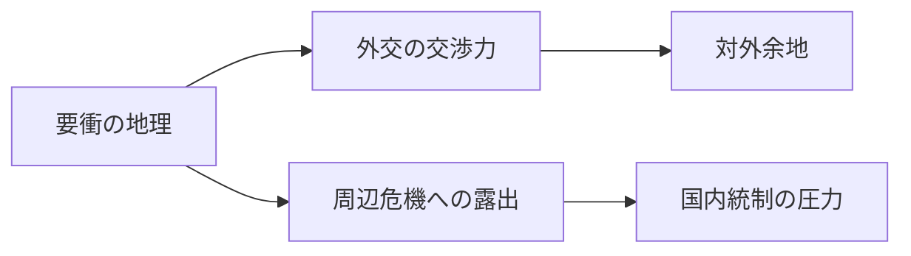
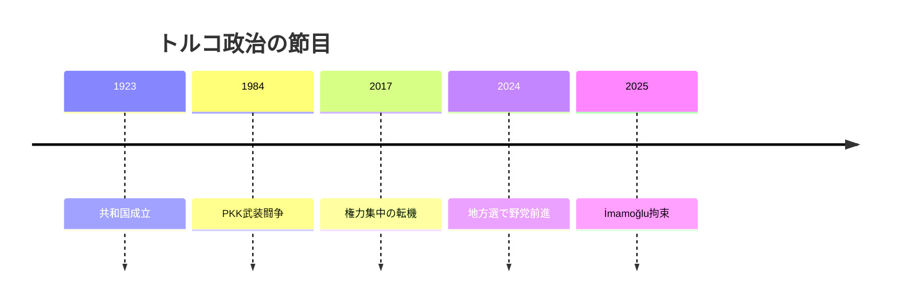
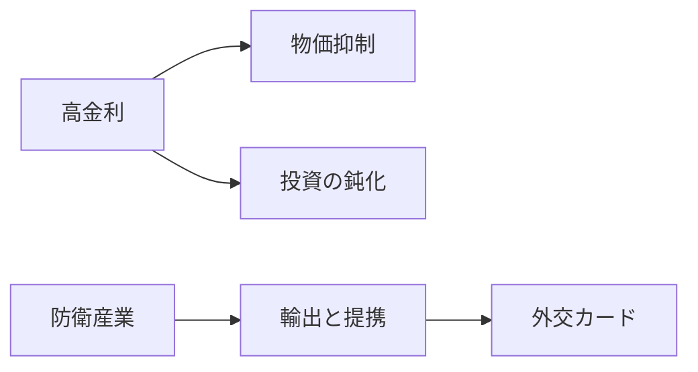

# 要衝であるほど、トルコは身動きが重い

## 1. エグゼクティブサマリー

トルコは、NATOの南東端に位置する要衝であり、黒海、東地中海、中東、コーカサスをつなぐ回廊でもある。<SourceNote>[AP, Erdogan's warm ties with Trump offer Turkey an edge ahead of NATO summit](https://apnews.com/article/c3fbddc43d7f4b0b12fcc2442ee03613) と [Republic of Türkiye Ministry of Foreign Affairs](https://www.mfa.gov.tr/default.en.mfa) に基づく。</SourceNote>

2026年夏の外務省ページでも、EU、ロシア、イラクのクルディスタン地域政府、シリア、アゼルバイジャンが同じ動線に並ぶ。<SourceNote>[Republic of Türkiye Ministry of Foreign Affairs](https://www.mfa.gov.tr/default.en.mfa)</SourceNote>

エルドアン政権は、対外的には回廊管理で交渉力を取り、対内的には大統領府に権力を集めている。<SourceNote>[Republic of Türkiye Ministry of Foreign Affairs](https://www.mfa.gov.tr/default.en.mfa)</SourceNote>

経済では、中央銀行が2026年6月11日に政策金利を37%で据え置き、緊縮と物価抑制を優先している。<SourceNote>[Central Bank of the Republic of Türkiye](https://www.tcmb.gov.tr/wps/wcm/connect/EN/TCMB%2BEN)</SourceNote>

政治では、2024年の地方選で野党が大都市を押さえ、その後も司法と言論をめぐる圧力が続いている。<SourceNote>[AP, In setback to Turkey's Erdogan, opposition makes huge gains in local election](https://apnews.com/article/8adc4df56cdbce24f78900e1d142ff21) と [AP, Turkish comedian sent to jail to await trial on charges of insulting Erdogan](https://apnews.com/article/b58784ab5e54dbcac37a239b933fdf37) に基づく。</SourceNote>

結論は単純である。トルコは強い国家だが、強さの源泉はそのまま不安定さの源泉でもある。

この図は、地理が交渉力を生む一方で、同じ地理が危機への露出も増やすことを示す。トルコの強さは、回避ではなく調整の能力にある。<SourceNote>[Republic of Türkiye Ministry of Foreign Affairs](https://www.mfa.gov.tr/default.en.mfa) と [AP, Erdogan's warm ties with Trump offer Turkey an edge ahead of NATO summit](https://apnews.com/article/c3fbddc43d7f4b0b12fcc2442ee03613) をもとにした構図であり、危機露出と調整能力の読みは公開情報からの推定である。</SourceNote>

## 2. 歴史と国家形成

現代トルコの出発点は、オスマン帝国の崩壊と共和国の建設である。<SourceNote>[Britannica, Turkey](https://www.britannica.com/place/Turkey) に基づく。</SourceNote>

共和国は、軍、官僚制、世俗主義、国民統合を国家の中核に置いた。<SourceNote>[Britannica, Turkey](https://www.britannica.com/place/Turkey) に基づく。</SourceNote>

その後の政治は、軍の介入、党派政治、EU接近、そして権力集中を行き来してきた。<SourceNote>[Britannica, Turkey](https://www.britannica.com/place/Turkey) に基づく。</SourceNote>

2024年の地方選では、イスタンブールとアンカラを含む大都市で野党が強さを見せた。<SourceNote>[AP, In setback to Turkey's Erdogan, opposition makes huge gains in local election](https://apnews.com/article/8adc4df56cdbce24f78900e1d142ff21) に基づく。</SourceNote>

この年表の意味は、トルコ政治が古い共和国の枠を保ちながら、その中身を何度も組み替えてきたという点にある。今の対立は、制度の外ではなく制度の内部で起きている。

## 3. 現在の政治体制

現在の権力の中心は、大統領府、与党ブロック、官僚機構、そして大都市自治体のあいだにある。<SourceNote>[Republic of Türkiye Ministry of Foreign Affairs](https://www.mfa.gov.tr/default.en.mfa) と [AP, In setback to Turkey's Erdogan, opposition makes huge gains in local election](https://apnews.com/article/8adc4df56cdbce24f78900e1d142ff21) に基づく。</SourceNote>

外務省のトップページは、レジェプ・タイイップ・エルドアン大統領とハカン・フィダン外相を前面に出している。<SourceNote>[Republic of Türkiye Ministry of Foreign Affairs](https://www.mfa.gov.tr/default.en.mfa)</SourceNote>

これは、外交と国内政治が同じ権力線の上で動いていることを示す。大統領が最終調整を握り、外務省は周辺危機を処理し、地方自治体は生活の摩擦を引き受ける。

| アクター | 役割 | 見るべき点 |
| --- | --- | --- |
| 大統領府 | 予算と優先順位を決める | 権力集中の強さ |
| 与党ブロック | 法案と任命を支える | 連立の安定度 |
| 野党 | 都市、司法、物価で対抗する | 都市票の持続性 |
| 官僚機構 | 実装と統制を担う | 指令の貫通度 |
| 自治体 | 住宅、交通、福祉を回す | 中央との摩擦 |
| メディアと市民社会 | 正当性を測る | 批判空間の広さ |

司法と言論をめぐる圧力は、エルドアン体制の支持基盤を一枚岩に見せない。APとGuardianは、2025年にイスタンブールのエクレム・イマムオール市長の拘束と、2026年の風刺芸人の拘束を伝えている。<SourceNote>[The Guardian, 'Entirely political': Istanbul mayor charged with 142 offences that could total 2,000 years in jail](https://www.theguardian.com/world/2025/nov/11/istanbul-mayor-ekrem-imamoglu-charged-bribery-extortion-turkey) と [AP, Turkish comedian sent to jail to await trial on charges of insulting Erdogan](https://apnews.com/article/b58784ab5e54dbcac37a239b933fdf37) に基づく。</SourceNote>

政治の実像は、選挙の勝敗だけでは決まらない。裁判、許認可、予算、自治体、報道の順で圧力がかかるため、権力は分散して見えても、最後は大統領府に吸い寄せられる。

## 4. 安全保障と対外関係

トルコは、NATOの中で米欧と足並みをそろえつつ、ロシアとは交渉と牽制を同時に続け、ウクライナ戦争では黒海の安全と仲介の余地を追っている。<SourceNote>[AP, Erdogan's warm ties with Trump offer Turkey an edge ahead of NATO summit](https://apnews.com/article/c3fbddc43d7f4b0b12fcc2442ee03613) と [Republic of Türkiye Ministry of Foreign Affairs](https://www.mfa.gov.tr/default.en.mfa) に基づく。</SourceNote>

外務省の2026年の掲示では、シリアへの対応声明、イラクのKRG副首相との会談、ロシア訪問、EUやカナダとの接触が近接している。<SourceNote>[Republic of Türkiye Ministry of Foreign Affairs](https://www.mfa.gov.tr/default.en.mfa)</SourceNote>

その並び方自体が、アンカラがどの危機も別々に処理していないことを示す。シリア、イラク、ロシア、EUは、外交カードではなく同時進行の管理対象である。

| 相手 | 争点 | トルコ側の読み |
| --- | --- | --- |
| 米国とNATO | 同盟、F-16、抑止 | 安保の基盤 |
| ロシア | ウクライナ、黒海、エネルギー | 対立と取引の併存 |
| シリア | 国境、難民、PKK関連勢力 | 国内安全保障の延長 |
| イラクのKRG | 国境、治安、通商 | 地域秩序の調整相手 |
| コーカサス | アゼルバイジャン、アルメニア、回廊 | 連結点と影響圏 |

2026年5月にトルコは、アルメニアとの直接貿易制限を解除した。<SourceNote>[AP, Turkey removes trade restrictions with Armenia after years of solidarity with Azerbaijan](https://apnews.com/article/50f619ba2699b8e7968755c2f2fa6e20) に基づく。</SourceNote>

この一手は大きな和解ではないが、南コーカサスでの硬直が少し緩んだことは示す。トルコはアゼルバイジャンとの連帯を保ちながら、アルメニアとの接続も完全には閉じていない。

## 5. 経済、通貨、産業

トルコ経済は、インフレ、通貨安、外貨調達、成長鈍化の同時圧力の下にある。<SourceNote>[Central Bank of the Republic of Türkiye](https://www.tcmb.gov.tr/wps/wcm/connect/EN/TCMB%2BEN) に基づく。</SourceNote>

2026年6月11日の中央銀行決定は、この圧力を抑えるための高金利維持だった。<SourceNote>[Central Bank of the Republic of Türkiye](https://www.tcmb.gov.tr/wps/wcm/connect/EN/TCMB%2BEN)</SourceNote>

高金利は物価を抑えるが、家計、企業投資、財政運営には重くのしかかる。トルコの経済政策は、成長を刺激する話と信用を守る話を同時に追わざるをえない。

防衛産業は、その重さを一部で相殺している。Baykarの公式ページは、TB2、Akıncı、Kızılelma、TB3を並べ、2026年6月にはLeonardoとのK-SWARM試験を掲示している。<SourceNote>[Baykar](https://www.baykartech.com/en/) に基づく。</SourceNote>

これは、トルコが無人機を単なる兵器ではなく、輸出、技術提携、外交の道具として扱っていることを示す。<SourceNote>[Baykar](https://www.baykartech.com/en/) をもとにした公開情報からの推定。</SourceNote>

この図は、マクロの締め付けと産業の外貨獲得が別々に動いていることを示す。通貨防衛は中央銀行の仕事だが、外貨を稼ぐ力は産業政策の仕事でもある。

## 6. クルド問題、難民、宗教と世俗主義

クルド問題は、トルコ国内の治安問題であると同時に、シリア、イラク、イランをまたぐ地域政治でもある。<SourceNote>[Britannica, Kurd](https://www.britannica.com/topic/Kurd) と [AP, PKK says it will disarm and dissolve after Ocalan's call](https://apnews.com/article/9f4347a04cba48ceb509d2e82023a19e) に基づく。</SourceNote>

PKKは2025年に解散と武装解除を表明したが、法的処理、地方政治、越境ネットワークはまだ残っている。<SourceNote>[AP, PKK says it will disarm and dissolve after Ocalan's call](https://apnews.com/article/9f4347a04cba48ceb509d2e82023a19e) に基づく。</SourceNote>

だから、争点は「終わったかどうか」ではなく、「武力の問題が制度の問題に変わるかどうか」である。<SourceNote>[AP, PKK says it will disarm and dissolve after Ocalan's call](https://apnews.com/article/9f4347a04cba48ceb509d2e82023a19e) をもとにした公開情報からの推定。</SourceNote>

難民と移民も同じ構造で読むべきである。シリア難民の存在は、労働、家賃、学校、医療、治安のすべてに触れ、都市と地方で違う政治感情を生む。

宗教と世俗主義の対立も、単純な二項対立ではない。共和国の世俗的制度は残っているが、保守的な社会規範は選挙政治と日常生活の両方に入り込んでいる。

## 7. 日本・東アジアへの含意

日本から見ると、トルコは中東の一国ではない。黒海、シリア、コーカサス、欧州をまたぐ接続点であり、制裁、海上輸送、NATO、無人機、通貨の不安定さが同じニュースに出てくる国である。

日本企業は、トルコを単なる新興国としてではなく、デュアルユースと制裁順守の交差点として見るべきである。Baykar型の無人機、欧州と中東をまたぐ物流、ロシアとの間合いは、調達とコンプライアンスの両方に効く。

政府にとっての含意は、トルコの対シリア、対ロシア、対コーカサス政策を、その都度の事件ではなく回廊管理として読むことにある。<SourceNote>[Republic of Türkiye Ministry of Foreign Affairs](https://www.mfa.gov.tr/default.en.mfa) と [AP, Turkey removes trade restrictions with Armenia after years of solidarity with Azerbaijan](https://apnews.com/article/50f619ba2699b8e7968755c2f2fa6e20) に基づく。</SourceNote>

もしトルコの国内統制が強まりすぎれば、外交の柔軟性は下がる。逆に、経済の締め付けが緩みすぎれば、通貨と物価が再び政権の足を引っ張る。

## 8. 監視ポイント

1. エルドアン政権が、司法、メディア、自治体に対する圧力をどこまで維持するか。
1. 中央銀行の高金利が、物価安定と成長鈍化のどちらに強く効くか。
1. シリアとイラクの案件が、越境軍事圧力ではなく外交交渉で処理され続けるか。
1. クルド問題が、PKKの解散表明の先で制度交渉に移るか。
1. 無人機産業が、話題性だけでなく持続的な外貨稼ぎになるか。

この国は、地理が大きいほど動きが重くなる。トルコを読むときは、強さと脆さを別々に見ない方がよい。

## 参考情報

- [Republic of Türkiye Ministry of Foreign Affairs](https://www.mfa.gov.tr/default.en.mfa)
- [Central Bank of the Republic of Türkiye](https://www.tcmb.gov.tr/wps/wcm/connect/EN/TCMB%2BEN)
- [Baykar](https://www.baykartech.com/en/)
- [AP, Erdogan's warm ties with Trump offer Turkey an edge ahead of NATO summit](https://apnews.com/article/c3fbddc43d7f4b0b12fcc2442ee03613)
- [AP, In setback to Turkey's Erdogan, opposition makes huge gains in local election](https://apnews.com/article/8adc4df56cdbce24f78900e1d142ff21)
- [AP, Turkish comedian sent to jail to await trial on charges of insulting Erdogan](https://apnews.com/article/b58784ab5e54dbcac37a239b933fdf37)
- [AP, Turkey removes trade restrictions with Armenia after years of solidarity with Azerbaijan](https://apnews.com/article/50f619ba2699b8e7968755c2f2fa6e20)
- [AP, PKK says it will disarm and dissolve after Ocalan's call](https://apnews.com/article/9f4347a04cba48ceb509d2e82023a19e)
- [Britannica, Turkey](https://www.britannica.com/place/Turkey)
- [Britannica, Kurd](https://www.britannica.com/topic/Kurd)
