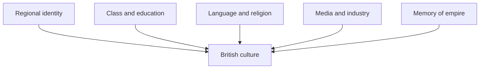

## 1. Executive Summary

British culture is not a single "Britishness". It is a layered culture made from England, Scotland, Wales, Northern Ireland, migrant communities, class, region, media, memories of empire, and urban and rural life. It is not enough to list the monarchy, Parliament, tea, pubs, football, the BBC, the British Museum, literature, and rock music. The distinctive feature is that old institutions and modern diversity coexist.

Language is the best entry point. English is a world language and the base of much British cultural export. But Welsh in Wales, Gaelic and Scots in Scotland, and Irish and Ulster Scots in Northern Ireland are not just dialects or tourist symbols. They are tied to identity, education, public signage, broadcasting, and political consciousness. In Census 2021, 17.8% of people aged three and over in Wales, around 538,000 people, said they could speak Welsh. Scotland's Census 2022 reported that 2.5% of people aged three and over had some Gaelic skills and 46.2% had some Scots skills. <SourceNote>[ONS, Welsh language, Wales: Census 2021](https://www.ons.gov.uk/peoplepopulationandcommunity/culturalidentity/language/bulletins/welshlanguagewales/census2021), [Scotland's Census 2022, Ethnic group, national identity, language and religion](https://www.scotlandscensus.gov.uk/2022-reports/scotland-s-census-2022-ethnic-group-national-identity-language-and-religion/).</SourceNote>

Multicultural change is the other entry point. In England and Wales, Census 2021 recorded the high-level White category at 81.7%, down from 86.0% in 2011, while Asian, Asian British or Asian Welsh stood at 9.3%. In London, the share identifying as "White: English, Welsh, Scottish, Northern Irish or British" had fallen to 36.8%. British culture can no longer be explained as white, English-speaking, and Anglican. <SourceNote>[ONS, Ethnic group, England and Wales: Census 2021](https://www.ons.gov.uk/peoplepopulationandcommunity/culturalidentity/ethnicity/bulletins/ethnicgroupenglandandwales/census2021) documents ethnic composition and London's diversity.</SourceNote>

## 2. Language and Regional Culture

English is Britain's largest cultural export. Literature, film, music, universities, finance, diplomacy, scientific publishing, sports broadcasting, and much internet culture travel through English. But Britain's internal culture is not made from one English. Received Pronunciation, Cockney, Estuary English, Scouse, Geordie, Brummie, Yorkshire, Scottish English, Welsh English, and Northern Irish English all carry social meaning.

Accent signals not only where someone is from, but also class, education, occupation, and media identity. In Britain, how something is said can matter almost as much as what is said. That is a legacy of class society, but also a source of regional pride.

In Wales, Welsh is central to public culture. It is present in schools, road signs, administration, broadcasting, music, sport, and literature. The Census 2021 figure of 17.8% shows a decline in the share of speakers, but it also shows why language policy remains a central cultural issue. <SourceNote>[Welsh Government, Welsh language in Wales (Census 2021)](https://www.gov.wales/welsh-language-wales-census-2021-html) also reports 538,300 people and 17.8%, and explains the decline since 2011.</SourceNote>

In Scotland, Gaelic is numerically small but symbolically important for the Highlands and Islands, broadcasting, music, education, place names, and cultural revival. Scots has a wider everyday and literary reach, tied to Burns, song, spoken culture, and regional identity. Scotland's Census reported Gaelic skills rising from 1.7% in 2011 to 2.5% in 2022, and Scots skills from 37.7% to 46.2%. <SourceNote>[Scotland's Census news release on religion, ethnic group, language and national identity](https://www.scotlandscensus.gov.uk/news-and-events/scotland-s-census-religion-ethnic-group-language-and-national-identity-results/) reports increases in Gaelic and Scots skills.</SourceNote>

## 3. Class, Education, and Everyday Codes

Class is unavoidable in British culture. It is not only income. It appears in accent, school, university, profession, neighbourhood, clothing, humour, holidays, newspapers, sport, food, and housing. Traditional labels such as aristocracy, upper middle class, professional class, and working class are simplified, but private schools, Oxbridge, London finance and law, post-industrial towns, public housing, and suburbs still carry cultural meaning.

Everyday culture is built around queues, understatement, self-deprecating humour, privacy, small talk, pubs, Sunday roast, tea, football, gardens, charity shops, and the local high street. These are not just tourist signs. They reflect how public space, neighbourliness, class difference, and regional variation work.

British humour often depends on irony, indirectness, tolerance of failure, and mocking authority. Political satire, sitcoms, panel shows, stand-up comedy, and newspaper cartoons have made authority something to be laughed at as much as obeyed.

## 4. Religion and Secularisation

British culture carries deep Christian institutions, but society has secularised rapidly. England has the Church of England, with traces in monarchy, coronations, Parliament, schools, local churches, and the festival calendar. But Census 2021 in England and Wales recorded Christian identification at 46.2% and No religion at 37.2%. <SourceNote>[ONS, Religion, England and Wales: Census 2021](https://www.ons.gov.uk/peoplepopulationandcommunity/culturalidentity/religion/bulletins/religionenglandandwales/census2021) shows Christian identification falling below half and No religion rising.</SourceNote>

Scotland shows the same shift. Scotland's Census 2022 reported No religion at 51.1% and Church of Scotland at 20.4%. This does not mean religious culture has disappeared. It means religious traces in weddings, funerals, schools, charity, local community, architecture, music, and festivals coexist with personal secularisation. <SourceNote>[Scotland's Census 2022](https://www.scotlandscensus.gov.uk/2022-reports/scotland-s-census-2022-ethnic-group-national-identity-language-and-religion/) covers religion, language, ethnicity, and national identity.</SourceNote>

Britain is also increasingly multi-religious. Islam, Hinduism, Sikhism, Judaism, Buddhism, Caribbean and African churches, Eastern European Catholicism, and non-religion shape food, festivals, schools, local politics, music, and fashion. Church calendars, Ramadan, Diwali, Vaisakhi, Notting Hill Carnival, and Pride coexist in the same urban space.

## 5. Media, Public Broadcasting, and Literature

Public broadcasting is central to British culture. The BBC, ITV, Channel 4, Channel 5, BBC radio, local radio, newspapers, magazines, podcasts, and YouTube all make national and regional culture. The BBC has long provided a common cultural platform through news, education, drama, sport, children's programming, radio, and the World Service.

But media culture is changing. Ofcom's Media Nations 2025 reported that in 2024 weekly reach for broadcast TV declined across all age groups, with 73.8% of people watching broadcast TV on TV sets each week. The figure was 94% among those aged 65 and over, but 45% among 16-24s. The shared cultural space is dispersing from national broadcast television toward YouTube, streaming, social media, and podcasts. <SourceNote>[Ofcom, Media Nations 2025](https://www.ofcom.org.uk/media-use-and-attitudes/media-habits-adults/media-nations-2025) and the report PDF show the decline in broadcast TV reach and the age divide.</SourceNote>

British literature connects the canon and modern multicultural experience: Shakespeare, Austen, Dickens, the Brontës, Woolf, Orwell, Tolkien, Lessing, Rushdie, Zadie Smith, Kazuo Ishiguro, Bernardine Evaristo, and Ali Smith. Literature is not only polite culture. It is where class, empire, city life, gender, migration, colonial experience, and region are contested.

## 6. Museums, Heritage, and the Memory of Empire

British culture is visible through museums and heritage. The British Museum, National Gallery, Tate, Victoria and Albert Museum, Natural History Museum, Science Museum, British Library, National Museums Scotland, Amgueddfa Cymru, and Ulster Museum are nodes of education, tourism, urban economy, and national memory.

According to DCMS, DCMS-sponsored museums and galleries received around 10.5 million visits from January to March 2026. Visits were 9.3% higher than the same period in 2025, but 8.5% lower than the comparable pre-pandemic period in 2019. Cultural institutions are recovering, but not uniformly back to pre-pandemic levels. <SourceNote>[GOV.UK, Museums and galleries monthly visits](https://www.gov.uk/government/statistical-data-sets/museums-and-galleries-monthly-visits) reports visits for January to March 2026 and year-on-year and 2019 comparisons.</SourceNote>

Museum culture is also inseparable from empire. Collections from ancient Egypt, Greece, Benin, India, China, the Middle East, Africa, and the Pacific are presented as universal knowledge, but they also raise questions about colonial rule, acquisition, restitution, conservation responsibility, and international research partnerships. A celebratory view of British culture misses this tension.

## 7. Sport, Music, and Food

Sport is one of Britain's strongest everyday languages. Football, rugby, cricket, tennis, golf, horse racing, darts, snooker, and boxing connect class, region, empire, schools, pubs, and television. Football combines working-class culture, city identity, global capital, migrant players, and broadcast rights. Cricket and rugby carry stronger memories of empire, public schools, and the Commonwealth. Wimbledon turns tradition into international ritual.

Music runs from the Beatles, Rolling Stones, Led Zeppelin, Pink Floyd, punk, new wave, Britpop, grime, UK garage, drum and bass, jungle, electronic music, folk revival, Celtic music, and South Asian British music. The strength of British music is that local class and city cultures can become global. Liverpool, Manchester, London, Bristol, Birmingham, Glasgow, Belfast, and Cardiff all carry distinct sounds.

Food culture is often underrated. Fish and chips, Sunday roast, pies, full English breakfast, pub food, and afternoon tea sit alongside curry, Caribbean food, Chinese takeaway, kebab shops, Polish groceries, vegan food, craft beer, and speciality coffee. The fact that chicken tikka masala can be described as British food shows the mixture of migration, empire, urban life, home cooking, and the restaurant economy.

## 8. Creative Industries and Soft Power

British culture is also an economy. DCMS Creative Industries Economic Estimates 2025 cover GVA, business counts, and employment, while the House of Commons Library summarised the creative industries as contributing around £124 billion in GVA in 2023, about 5% of total UK output. <SourceNote>[GOV.UK, Creative Industries Economic Estimates 2025](https://www.gov.uk/government/statistics/creative-industries-economic-estimates-2025), [House of Commons Library, Creative Industries](https://commonslibrary.parliament.uk/research-briefings/cdp-2025-0017/).</SourceNote>

The creative industries include film, TV, music, games, design, architecture, advertising, fashion, publishing, software, museums, and performing arts. The key point is that culture is not only tradition. It is tied to exports, jobs, urban regeneration, tourism, international relations, education, and the AI-era content economy.

The sector also faces regional concentration, freelance insecurity, London dominance, pressure on arts education, post-Brexit constraints on touring and labour mobility, and uncertainty over public broadcasting finance. Soft power is a real asset, but it is not self-maintaining.

## 9. How to Read British Culture

British culture is best described as a culture that everyday-ises old institutions while constantly renewing itself through migration, media, and regional identity. Royal ritual, Oxford and Cambridge, public schools, parliamentary language, pubs, football, the BBC, Shakespeare, and the British Museum form older layers. London's multiculturalism, Welsh and Gaelic revival, grime, streaming, diaspora food, Pride, decolonisation debates, and local music scenes form newer layers.

British culture is therefore not a choice between tradition and multiculturalism. Because tradition is strong, participation, rejection, reinterpretation, and satire become cultural acts. Because diversity is growing, English, public broadcasting, sport, museums, schools, and local festivals are repeatedly tested as shared spaces. The tension is the culture.

## References

- [ONS, Ethnic group, England and Wales: Census 2021](https://www.ons.gov.uk/peoplepopulationandcommunity/culturalidentity/ethnicity/bulletins/ethnicgroupenglandandwales/census2021)
- [ONS, Religion, England and Wales: Census 2021](https://www.ons.gov.uk/peoplepopulationandcommunity/culturalidentity/religion/bulletins/religionenglandandwales/census2021)
- [ONS, Welsh language, Wales: Census 2021](https://www.ons.gov.uk/peoplepopulationandcommunity/culturalidentity/language/bulletins/welshlanguagewales/census2021)
- [Scotland's Census 2022, Ethnic group, national identity, language and religion](https://www.scotlandscensus.gov.uk/2022-reports/scotland-s-census-2022-ethnic-group-national-identity-language-and-religion/)
- [Ofcom, Media Nations 2025](https://www.ofcom.org.uk/media-use-and-attitudes/media-habits-adults/media-nations-2025)
- [GOV.UK, Museums and galleries monthly visits](https://www.gov.uk/government/statistical-data-sets/museums-and-galleries-monthly-visits)
- [GOV.UK, Creative Industries Economic Estimates 2025](https://www.gov.uk/government/statistics/creative-industries-economic-estimates-2025)
- [House of Commons Library, Creative Industries](https://commonslibrary.parliament.uk/research-briefings/cdp-2025-0017/)
