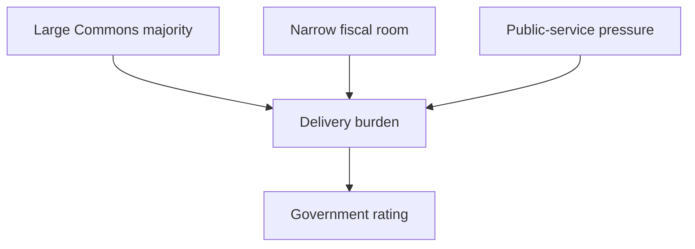

## 1. Executive Summary

As of June 17, 2026, UK politics is best read as a system where Labour has a large House of Commons majority but faces weak public tolerance, fiscal constraints, service backlogs, local fragmentation, and a House of Lords it does not control. Labour holds 402 of 650 Commons seats and forms the majority government, with a working majority of 166. The Conservatives have 116 seats, the Liberal Democrats 72, Reform UK 8, and the SNP and Sinn Féin 7 each. <SourceNote>Based on [UK Parliament, State of the parties - House of Commons](https://members.parliament.uk/parties/commons) and [His Majesty's Government: The Cabinet](https://members.parliament.uk/government/cabinet). Party affiliation can change through by-elections, whip changes, and defections, so these are the official-page figures checked on June 17, 2026.</SourceNote>

The central domestic issues are living costs and interest rates, fiscal space, work and inactivity, migration, the NHS, housing, and the post-Brexit growth model. CPI inflation was 2.8% in April 2026, Bank Rate was 3.75%, unemployment was 5.0% in January to March 2026, and economic inactivity was 20.9%. Inflation is no longer at its peak, but it has not eased enough to make households, mortgages, rents, or public services feel easy. <SourceNote>[ONS, Consumer price inflation, UK: April 2026](https://www.ons.gov.uk/economy/inflationandpriceindices/bulletins/consumerpriceinflation/april2026), [Bank of England, Interest rates and Bank Rate](https://www.bankofengland.co.uk/monetary-policy/the-interest-rate-bank-rate), [ONS, Labour market overview, UK: May 2026](https://www.ons.gov.uk/employmentandlabourmarket/peopleinwork/employmentandemployeetypes/bulletins/uklabourmarket/may2026). At the June 17, 2026 check, the latest ONS CPI bulletin body remained the April 2026 release.</SourceNote>

The Commons numbers make the government look stable. The post-May 2026 local and devolved election issue, however, is the mismatch between national seat strength and local governing capacity. The Institute for Government argued after the elections that the fracturing of British politics is not a temporary aberration and has immediate practical consequences for local government. YouGov's post-local-election survey found that 43% of voters said they backed the party that best reflected their values, 29% cited the best policies for local issues, and the top specific issues were the economy and cost of living at 27% and immigration at 26%. <SourceNote>[Institute for Government, The significance of the 2026 elections for UK government](https://www.instituteforgovernment.org.uk/comment/significance-2026-elections-uk-government), [YouGov, Local elections 2026](https://yougov.com/en-gb/articles/54840-local-elections-2026-what-decided-peoples-votes-when-did-they-make-up-their-minds-and-how-have-they-reacted-to-the-outcome)</SourceNote>

## 2. Party Distribution

In the Commons, Labour's majority is large. But the UK should not be read simply as a one-party Labour system. The Conservatives are much smaller than before, while the Liberal Democrats, Reform UK, Greens, regional parties, and independents matter more than a two-party headline suggests. Reform UK's seat count is small, but its pressure on immigration, tax, net zero, and anti-establishment politics is a major constraint on Conservative recovery.

| Party or group                    | Commons seats |
| --------------------------------- | ------------: |
| Labour                            |           402 |
| Conservative                      |           116 |
| Liberal Democrat                  |            72 |
| Independent                       |            12 |
| Reform UK                         |             8 |
| Scottish National Party           |             7 |
| Sinn Féin                         |             7 |
| Democratic Unionist Party         |             5 |
| Green Party                       |             5 |
| Plaid Cymru                       |             4 |
| Social Democratic & Labour Party  |             2 |
| Your Party                        |             2 |
| Others, Speaker, and vacant seats |             8 |

<SourceNote>Based on [UK Parliament, State of the parties - House of Commons](https://members.parliament.uk/parties/commons), checked on June 17, 2026.</SourceNote>

The Lords has a different distribution. There are 773 eligible members, including Conservative 245, Labour 216, Crossbench 156, Liberal Democrat 74, Non-affiliated 45, and Bishops 22. That means Labour can pass legislation through the Commons but must still manage scrutiny, amendments, delay, and political bargaining in the Lords. <SourceNote>[UK Parliament, Lords membership - by peerage](https://members.parliament.uk/parties/lords/by-peerage)</SourceNote>

At local level, Reform UK and Green gains are not only anti-government signals; they are now governing constraints. The Institute for Government argues that Reform UK gains in West Yorkshire, the North East, and the West Midlands could make it harder for Labour mayors to pass budgets, housing plans, transport plans, and investment strategies. Birmingham City Council illustrates the fragmentation: Reform UK 23 seats, Greens 19, Labour 17, Conservatives 16, Liberal Democrats 12, and 14 independent or smaller-party councillors. <SourceNote>[Institute for Government, Reform UK's local election gains pose new challenges for Labour mayors](https://www.instituteforgovernment.org.uk/comment/reform-uks-local-election-challenges-labour-mayors)</SourceNote>

## 3. Ranked Issues

### 1. Living costs, interest rates, and energy

Living costs are the top issue. CPI inflation fell to 2.8% in April 2026, but Bank Rate remained at 3.75%, with the next decision due on June 18, 2026. The inflation rate looks calmer than during the peak, but cumulative pressure from mortgages, rents, food, transport, and utilities still shapes political judgement. <SourceNote>[ONS, Consumer price inflation, UK: April 2026](https://www.ons.gov.uk/economy/inflationandpriceindices/bulletins/consumerpriceinflation/april2026), [Bank of England, April 2026 Monetary Policy Summary](https://www.bankofengland.co.uk/monetary-policy-summary-and-minutes/2026/april-2026)</SourceNote>

### 2. Fiscal space and growth

The main constraint on the Labour government is not a shortage of policy ideas; it is fiscal space. The OBR's March 2026 Economic and fiscal outlook describes a challenging fiscal context, with public debt much higher than two decades earlier and borrowing around 5% of GDP over the previous four years. Tax rises, spending restraint, and higher growth all carry political costs, so the government has to improve public services while preserving fiscal credibility. <SourceNote>[OBR, Economic and fiscal outlook - March 2026](https://obr.uk/economic-and-fiscal-outlooks/)</SourceNote>

### 3. Migration, asylum, and border management

Migration has entered a lower statistical phase but remains a political issue. ONS provisional estimates put long-term net migration at 171,000 for the year ending December 2025, almost half the updated 331,000 figure for the previous year. The main driver was a 47% fall in non-EU+ work-related arrivals. <SourceNote>[ONS, Long-term international migration, provisional: year ending December 2025](https://www.ons.gov.uk/peoplepopulationandcommunity/populationandmigration/internationalmigration/bulletins/longterminternationalmigrationprovisional/yearendingdecember2025)</SourceNote>

Voters are not only reacting to net migration. They are also reacting to irregular arrival, asylum processing, settlement rules, and skills policy. The Home Office's 2025 white paper linked the immigration, skills, and visa systems to growing the domestic workforce and reducing reliance on overseas labour. In the year ending March 2026, there were 43,806 detected arrivals via illegal routes, with small boats accounting for 90% of those arrivals. On June 15, 2026, the Home Office's small-boats dashboard recorded 710 arrivals in 11 boats. <SourceNote>[Home Office, Restoring control over the immigration system](https://www.gov.uk/government/publications/restoring-control-over-the-immigration-system-white-paper), [GOV.UK, How many people come to the UK via illegal entry routes?](https://www.gov.uk/government/statistics/immigration-system-statistics-year-ending-march-2026/how-many-people-come-to-the-uk-via-illegal-entry-routes), [Home Office and Border Force, Small boat arrivals: last 7 days](https://www.gov.uk/government/publications/migrants-detected-crossing-the-english-channel-in-small-boats/migrants-detected-crossing-the-english-channel-in-small-boats-last-7-days)</SourceNote>

Even when the headline number falls, housing, wages, public services, asylum processing, Channel crossings, and integration remain joined together in politics. Labour has to show control and administrative competence. Conservatives and Reform UK compete for stricter restriction. Liberal Democrats and Greens usually put more weight on humanitarian standards, local integration, and public-service capacity.

### 4. The NHS and social care

The NHS is the most tangible domestic public-service issue. In April 2026, the consultant-led elective-care waiting list stood at 7.22 million cases, representing about 6.11 million individual patients, with about 2.53 million waiting over 18 weeks. Health waiting lists are not just an administrative metric; they affect work participation, local satisfaction, and trust in government. <SourceNote>[GOV.UK, Referral to treatment waiting times statistics for consultant-led elective care for April 2026](https://www.gov.uk/government/statistics/referral-to-treatment-waiting-times-statistics-for-consultant-led-elective-care-for-april-2026), [BMA, NHS backlog data analysis](https://www.bma.org.uk/advice-and-support/nhs-delivery-and-workforce/pressures/nhs-backlog-data-analysis)</SourceNote>

The 2025 Spending Review made this a measurable political promise. It provided a £29 billion real-terms increase in annual NHS England day-to-day spending from 2023-24 to 2028-29 and set an end-of-Parliament target for 92% of patients to start non-urgent consultant-led treatment within 18 weeks of referral. <SourceNote>[HM Treasury, Spending Review 2025](https://www.gov.uk/government/publications/spending-review-2025-document/spending-review-2025-html)</SourceNote>

### 5. Housing, infrastructure, and regional inequality

Housing connects living costs, young people's asset formation, migration, urban productivity, and local politics. Even flat house prices do not feel affordable when rates and rents remain high. ONS April 2026 figures put average UK monthly private rents up 3.5% to £1,381 in the 12 months to March 2026, while average UK house prices rose 1.2% to £268,000 in the 12 months to February 2026. The government has pledged 1.5 million homes over the Parliament and announced a planning overhaul in December 2024. <SourceNote>[ONS, Private rent and house prices, UK: April 2026](https://www.ons.gov.uk/economy/inflationandpriceindices/bulletins/privaterentandhousepricesuk/april2026), [GOV.UK, Planning overhaul to reach 1.5 million new homes](https://www.gov.uk/government/news/planning-overhaul-to-reach-15-million-new-homes)</SourceNote>

Increasing housing supply requires planning reform, local-government capacity, construction labour, environmental rules, and transport investment to move together. It is not solvable through one popular short-term measure. Local political fragmentation after the 2026 elections also matters because housing plans and transport investments need local agreement.

### 6. Defence, security, and industrial policy

The war in Ukraine, the Russian threat, drones, autonomous systems, and NATO burden-sharing pull British politics beyond a purely domestic cost-of-living frame. In remarks on June 5, 2026, the prime minister said the government would publish a Defence Investment Plan before the NATO summit, linking future capability, autonomous technology, regional jobs, and defence-industrial capacity. In a narrow fiscal environment, defence spending competes with the NHS and housing for political and budgetary room. <SourceNote>[GOV.UK, PM remarks: 5 June 2026](https://www.gov.uk/government/speeches/pm-remarks-5-june-2026)</SourceNote>

### 7. The Union and the post-Brexit position

Scotland, Northern Ireland, Wales, and English regions do not move as one political unit. The SNP has only 7 Commons seats, but Scottish autonomy and independence politics have not disappeared. In Northern Ireland, the DUP, Sinn Féin, Alliance, SDLP, UUP, and TUV connect UK party politics with the politics of the island of Ireland. Post-Brexit EU relations remain a long-term issue across trade, regulation, migration, Northern Ireland, diplomacy, and security.

## 4. Domestic Problem Structure

The UK's domestic problem is best understood as the layering of low growth, high demand for public services, housing constraints, regional inequality, and institutional fatigue. In the labour market, employment was 75.0%, unemployment 5.0%, inactivity 20.9%, and vacancies 705,000 in the latest ONS release. Nominal wages were still growing, but real pay improvement was small. <SourceNote>[ONS, Labour market overview, UK: May 2026](https://www.ons.gov.uk/employmentandlabourmarket/peopleinwork/employmentandemployeetypes/bulletins/uklabourmarket/may2026)</SourceNote>

The government will therefore be judged less on whether it can pass bills and more on whether it can change the felt experience of waiting lists, rents, real income, local transport, and border management. A Commons majority is necessary; it is not sufficient. Post-election local fragmentation also increases friction when national pledges have to become planning decisions, permits, transport schemes, housing delivery, and social-care services.

## 5. Outlook

Four questions dominate the outlook. First, how much will Bank Rate and inflation continue to pressure mortgages, rents, and consumption? Second, can NHS waiting lists and public-service performance visibly improve? Third, will Reform UK consolidate right-wing voters before the Conservatives rebuild? Fourth, can the government maintain governing coalitions around housing, transport, skills, defence industry, and regional investment in a more fragmented party system?

The current state of UK politics is not Labour comfort. It is Labour responsibility. The party distribution shows Labour advantage; the domestic issue distribution shows the breadth of problems it cannot avoid.

## References

- [UK Parliament, State of the parties - House of Commons](https://members.parliament.uk/parties/commons)
- [UK Parliament, Lords membership - by peerage](https://members.parliament.uk/parties/lords/by-peerage)
- [UK Parliament, His Majesty's Government: The Cabinet](https://members.parliament.uk/government/cabinet)
- [ONS, Consumer price inflation, UK: April 2026](https://www.ons.gov.uk/economy/inflationandpriceindices/bulletins/consumerpriceinflation/april2026)
- [Bank of England, Interest rates and Bank Rate](https://www.bankofengland.co.uk/monetary-policy/the-interest-rate-bank-rate)
- [OBR, Economic and fiscal outlook - March 2026](https://obr.uk/economic-and-fiscal-outlooks/)
- [ONS, Labour market overview, UK: May 2026](https://www.ons.gov.uk/employmentandlabourmarket/peopleinwork/employmentandemployeetypes/bulletins/uklabourmarket/may2026)
- [ONS, Long-term international migration, provisional: year ending December 2025](https://www.ons.gov.uk/peoplepopulationandcommunity/populationandmigration/internationalmigration/bulletins/longterminternationalmigrationprovisional/yearendingdecember2025)
- [GOV.UK, Referral to treatment waiting times statistics for consultant-led elective care for April 2026](https://www.gov.uk/government/statistics/referral-to-treatment-waiting-times-statistics-for-consultant-led-elective-care-for-april-2026)
- [BMA, NHS backlog data analysis](https://www.bma.org.uk/advice-and-support/nhs-delivery-and-workforce/pressures/nhs-backlog-data-analysis)
- [Institute for Government, The significance of the 2026 elections for UK government](https://www.instituteforgovernment.org.uk/comment/significance-2026-elections-uk-government)
- [Institute for Government, Reform UK's local election gains pose new challenges for Labour mayors](https://www.instituteforgovernment.org.uk/comment/reform-uks-local-election-challenges-labour-mayors)
- [YouGov, Local elections 2026](https://yougov.com/en-gb/articles/54840-local-elections-2026-what-decided-peoples-votes-when-did-they-make-up-their-minds-and-how-have-they-reacted-to-the-outcome)
- [Home Office, Restoring control over the immigration system](https://www.gov.uk/government/publications/restoring-control-over-the-immigration-system-white-paper)
- [GOV.UK, Immigration system statistics, year ending March 2026](https://www.gov.uk/government/statistics/immigration-system-statistics-year-ending-march-2026)
- [Home Office and Border Force, Small boat arrivals: last 7 days](https://www.gov.uk/government/publications/migrants-detected-crossing-the-english-channel-in-small-boats/migrants-detected-crossing-the-english-channel-in-small-boats-last-7-days)
- [HM Treasury, Spending Review 2025](https://www.gov.uk/government/publications/spending-review-2025-document/spending-review-2025-html)
- [ONS, Private rent and house prices, UK: April 2026](https://www.ons.gov.uk/economy/inflationandpriceindices/bulletins/privaterentandhousepricesuk/april2026)
- [GOV.UK, PM remarks: 5 June 2026](https://www.gov.uk/government/speeches/pm-remarks-5-june-2026)
