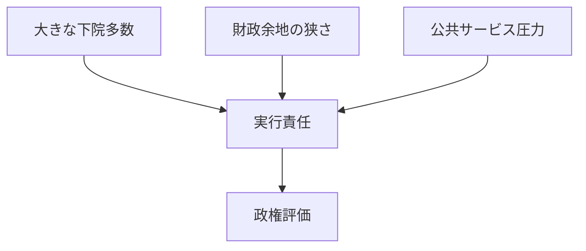

## 1. エグゼクティブサマリー

2026年6月17日時点のイギリス政治は、「下院では労働党が大多数を持つが、世論・地方・上院・経済制約では脆い」という構図で読むのがよい。下院650議席のうち、Labourは402議席で多数政府を形成し、作業多数は166である。一方、Conservativeは116議席まで縮み、Liberal Democratが72議席、Reform UKが8議席、SNPとSinn Féinが各7議席という分布になっている。<SourceNote>[UK Parliament, State of the parties - House of Commons](https://members.parliament.uk/parties/commons) と [His Majesty's Government: The Cabinet](https://members.parliament.uk/government/cabinet) に基づく。政党所属は離党・補選・院内会派変更で動くため、2026年6月17日時点の公式ページ確認値として扱う。</SourceNote>

国内問題の中心は、生活費と金利、財政余地、雇用・不活発、移民、NHS、住宅、脱EU後の成長モデルである。2026年4月のCPIは前年同月比2.8%、Bank Rateは3.75%、2026年1-3月の失業率は5.0%、経済的不活発率は20.9%だった。つまり、インフレはピークを過ぎたが、家計・住宅ローン・公共サービスを同時に楽にするほどには緩んでいない。<SourceNote>[ONS, Consumer price inflation, UK: April 2026](https://www.ons.gov.uk/economy/inflationandpriceindices/bulletins/consumerpriceinflation/april2026), [Bank of England, Interest rates and Bank Rate](https://www.bankofengland.co.uk/monetary-policy/the-interest-rate-bank-rate), [ONS, Labour market overview, UK: May 2026](https://www.ons.gov.uk/employmentandlabourmarket/peopleinwork/employmentandemployeetypes/bulletins/uklabourmarket/may2026)。2026年6月17日の確認時点でONSの最新CPI本文は2026年4月分だった。</SourceNote>

下院議席だけを見ると政権は安定している。しかし、2026年5月の地方・分権選挙後の論点は、国政議席と地方統治のズレである。Institute for Governmentは、2026年選挙を受けて英国政治の断片化は一時的現象ではなく、地方政府の実務にも直ちに影響すると分析した。YouGovの地方選後調査では、投票理由として「価値観に最も合う政党」が43%、地域課題に対する最良政策が29%、争点別では経済・生活費27%、移民26%が上位だった。<SourceNote>[Institute for Government, The significance of the 2026 elections for UK government](https://www.instituteforgovernment.org.uk/comment/significance-2026-elections-uk-government), [YouGov, Local elections 2026](https://yougov.com/en-gb/articles/54840-local-elections-2026-what-decided-peoples-votes-when-did-they-make-up-their-minds-and-how-have-they-reacted-to-the-outcome)</SourceNote>

## 2. 政党分布

下院では、Labourの多数はかなり大きい。だが、英国政治を「Labour一強」とだけ読むと誤る。2024年総選挙後の保守党後退は大きく、二大政党制の外側でLiberal Democrat、Reform UK、Green、地域政党、無所属が存在感を持つ。とくにReform UKは議席数だけでは小さいが、移民、税、ネットゼロ、反エスタブリッシュメントをめぐる保守票の流出先として、保守党再建の制約条件になっている。

| 会派・政党                       | 下院議席 |
| -------------------------------- | -------: |
| Labour                           |      402 |
| Conservative                     |      116 |
| Liberal Democrat                 |       72 |
| Independent                      |       12 |
| Reform UK                        |        8 |
| Scottish National Party          |        7 |
| Sinn Féin                        |        7 |
| Democratic Unionist Party        |        5 |
| Green Party                      |        5 |
| Plaid Cymru                      |        4 |
| Social Democratic & Labour Party |        2 |
| Your Party                       |        2 |
| その他・Speaker・Vacant          |        8 |

<SourceNote>[UK Parliament, State of the parties - House of Commons](https://members.parliament.uk/parties/commons) の2026年6月17日確認値に基づく。</SourceNote>

上院は別の権力分布を持つ。House of Lordsの有資格メンバーは773人で、Conservative 245、Labour 216、Crossbench 156、Liberal Democrat 74、Non-affiliated 45、Bishops 22などである。これは、下院でLabourが大多数を持っていても、上院では政府法案が修正・遅延されやすいことを意味する。上院は最終拒否権を持つ機関ではないが、法案の技術的精査、政治的圧力、修正協議の場として効く。<SourceNote>[UK Parliament, Lords membership - by peerage](https://members.parliament.uk/parties/lords/by-peerage) は、Conservative 245、Labour 216、Crossbench 156、Liberal Democrat 74、合計773を示している。</SourceNote>

地方政治では、Reform UKとGreenの伸長が「反政府票」だけでなく統治課題になっている。Institute for Governmentは、West Yorkshire、North East、West MidlandsなどでReform UKの地方議席増がLabour系メトロ市長の予算、住宅、交通、投資計画の合意形成を難しくすると指摘した。West MidlandsではBirmingham City Councilの構成がReform UK 23、Green 19、Labour 17、Conservative 16、Liberal Democrat 12、その他14という断片化を示している。<SourceNote>[Institute for Government, Reform UK's local election gains pose new challenges for Labour mayors](https://www.instituteforgovernment.org.uk/comment/reform-uks-local-election-challenges-labour-mayors) は、地方選結果がmayoral strategic authorityの合意形成に与える影響を具体例で整理している。</SourceNote>

## 3. 主要論点ランキング

### 1. 生活費、金利、エネルギー

最上位の論点は生活費である。CPIは2026年4月に2.8%まで下がったが、Bank of Englandの政策金利は3.75%で、次回決定は2026年6月18日に予定されている。インフレ率だけを見ると落ち着いたように見えるが、住宅ローン、家賃、食品、交通、光熱費の累積負担は家計の政治感覚を強く縛る。<SourceNote>[ONS, Consumer price inflation, UK: April 2026](https://www.ons.gov.uk/economy/inflationandpriceindices/bulletins/consumerpriceinflation/april2026), [Bank of England, April 2026 Monetary Policy Summary](https://www.bankofengland.co.uk/monetary-policy-summary-and-minutes/2026/april-2026)</SourceNote>

### 2. 財政余地と成長

労働党政権の最大の制約は、政策アイデアの不足ではなく財政余地の不足である。OBRは2026年3月のEconomic and fiscal outlookで、債務比率が過去20年で大きく上がり、公共部門純借入が過去4年ほどGDP比約5%の高水準にあったと説明している。増税、歳出抑制、成長率引き上げのどれを選んでも政治的痛みがあるため、政権は「公共サービス改善」と「財政信認」を同時に満たす必要がある。<SourceNote>[OBR, Economic and fiscal outlook - March 2026](https://obr.uk/economic-and-fiscal-outlooks/) は、2030-31年までの経済・財政見通しと財政持続性リスクを提示している。</SourceNote>

### 3. 移民、亡命、国境管理

移民は、統計上は減少局面に入っても政治争点として残る。ONSの暫定推計では、2025年暦年の長期国際純移民は171,000人で、2024年の331,000人からほぼ半減した。非EU+国籍者の就労関連流入が47%減ったことが大きい。一方、非EU+純移民はなお350,000人、EU+と英国籍者は純流出である。<SourceNote>[ONS, Long-term international migration, provisional: year ending December 2025](https://www.ons.gov.uk/peoplepopulationandcommunity/populationandmigration/internationalmigration/bulletins/longterminternationalmigrationprovisional/yearendingdecember2025)</SourceNote>

ただし、有権者の関心は純移民だけではなく、不正規入国、亡命処理、定住資格、技能政策に広がる。Home Officeの2025年白書は、移民制度を技能・ビザ・国内労働力育成と結びつけ、海外労働への依存を下げる方針を示した。さらに2026年3月までの1年間には、検知された不正規入国が43,806件あり、その90%を小舟到着が占めた。2026年6月15日には、Home Officeの小舟データで710人・11隻の到着が記録されている。<SourceNote>[Home Office, Restoring control over the immigration system](https://www.gov.uk/government/publications/restoring-control-over-the-immigration-system-white-paper), [GOV.UK, How many people come to the UK via illegal entry routes?](https://www.gov.uk/government/statistics/immigration-system-statistics-year-ending-march-2026/how-many-people-come-to-the-uk-via-illegal-entry-routes), [Home Office and Border Force, Small boat arrivals: last 7 days](https://www.gov.uk/government/publications/migrants-detected-crossing-the-english-channel-in-small-boats/migrants-detected-crossing-the-english-channel-in-small-boats-last-7-days)</SourceNote>

政治的には、数字が下がっても、住宅、賃金、公共サービス、難民認定、海峡越え、地域社会の統合が一体の争点として残る。Labourは管理強化と制度運用の改善を示す必要があり、ConservativeとReform UKはより厳しい抑制策を競う。Liberal DemocratやGreenは人道・地域統合・公共サービス投資を重視しやすい。

### 4. NHSと社会保障

NHSは、英国国内問題の中で最も体感されやすい公共サービスである。2026年4月のconsultant-led elective care待機リストは7.22百万件、約6.11百万人の患者に相当し、約2.53百万人が18週超待っていた。医療待機は単なる行政指標ではなく、労働参加、地域の生活満足、政府信頼に直結する。<SourceNote>[GOV.UK, Referral to treatment waiting times statistics for consultant-led elective care for April 2026](https://www.gov.uk/government/statistics/referral-to-treatment-waiting-times-statistics-for-consultant-led-elective-care-for-april-2026), [BMA, NHS backlog data analysis](https://www.bma.org.uk/advice-and-support/nhs-delivery-and-workforce/pressures/nhs-backlog-data-analysis)</SourceNote>

政府は2025年Spending Reviewで、2023-24年から2028-29年までにNHS Englandの日常支出を年額で実質290億ポンド増やし、議会任期末までに非緊急のconsultant-led treatmentで92%が18週以内に開始される目標を掲げた。これは財政投入のニュースであると同時に、政権評価の測定可能な約束でもある。<SourceNote>[HM Treasury, Spending Review 2025](https://www.gov.uk/government/publications/spending-review-2025-document/spending-review-2025-html) は、NHS day-to-day spendingの実質290億ポンド増と18週以内92%目標を明記している。</SourceNote>

### 5. 住宅、インフラ、地域格差

住宅は、生活費、若年層の資産形成、移民受け入れ、都市生産性をつなぐ論点である。価格が横ばいでも、金利と家賃が高ければ体感負担は重い。ONSの2026年4月統計では、平均UK月額民間賃料は2026年3月までの12か月で3.5%増の1,381ポンド、平均UK住宅価格は2026年2月までの12か月で1.2%増の268,000ポンドだった。政府は議会任期中の150万戸建設を掲げ、2024年12月に計画制度改革を発表している。<SourceNote>[ONS, Private rent and house prices, UK: April 2026](https://www.ons.gov.uk/economy/inflationandpriceindices/bulletins/privaterentandhousepricesuk/april2026), [GOV.UK, Planning overhaul to reach 1.5 million new homes](https://www.gov.uk/government/news/planning-overhaul-to-reach-15-million-new-homes)</SourceNote>

住宅供給を増やすには、計画制度、地方自治体、建設労働、環境規制、交通投資を同時に動かす必要があり、短期の人気政策だけでは解けない。地方選後に地方議会が断片化したことは、住宅計画や交通投資の合意形成にも影響する。

### 6. 国防、安全保障、産業政策

ウクライナ戦争、ロシア脅威、ドローン・自律システム、NATO負担の増大は、英国政治を「生活費だけの内政」から引き戻している。2026年6月5日の首相発言では、Strategic Defence Reviewを踏まえたDefence Investment PlanをNATOサミット前に公表し、防衛能力と雇用・産業基盤を結びつける方針が示された。財政余地が狭いなか、防衛支出はNHSや住宅と同じ予算制約の中で競合する。<SourceNote>[GOV.UK, PM remarks: 5 June 2026](https://www.gov.uk/government/speeches/pm-remarks-5-june-2026) は、Defence Investment Plan、技術変化、自律能力、ロシア脅威、地域雇用との接続を説明している。</SourceNote>

### 7. 連合王国の結束と脱EU後の位置取り

スコットランド、北アイルランド、ウェールズ、イングランド地方の政治は一枚岩ではない。SNPは下院では7議席に後退したが、スコットランド自治と独立論は消えていない。北アイルランドではDUP、Sinn Féin、Alliance、SDLP、UUP、TUVが並び、英国政治とアイルランド島政治が接続する。脱EU後の対EU関係は、貿易、規制、移民、北アイルランド、外交安保をまたぐ長期課題である。

## 4. 国内問題の見取り図

英国国内の問題は、単独の失政というより、低成長、高い公共サービス需要、住宅制約、地域格差、制度疲労が重なったものとして見るべきである。労働市場では、2026年1-3月の雇用率が75.0%、失業率が5.0%、経済的不活発率が20.9%、求人は705,000件まで減っている。賃金は名目では伸びているが、実質賃金の改善は小さい。<SourceNote>[ONS, Labour market overview, UK: May 2026](https://www.ons.gov.uk/employmentandlabourmarket/peopleinwork/employmentandemployeetypes/bulletins/uklabourmarket/may2026)</SourceNote>

このため、政権評価は「法案を通せるか」よりも「待機リスト、家賃、実質所得、地方交通、国境管理の体感を変えられるか」で決まる。下院多数は必要条件であり、十分条件ではない。さらに、地方選後の断片化は、中央政府の公約が地方の計画、許認可、交通、住宅、社会保障サービスへ落ちる段階で摩擦を増やす。

## 5. 見通し

今後の焦点は四つである。第一に、Bank Rateとインフレが住宅ローン・家賃・消費をどこまで圧迫するか。第二に、NHS待機リストと公共サービス改善が目に見える形で進むか。第三に、Conservativeが再建できる前にReform UKが右派票を固定化するかである。第四に、地方選後に強まった政党断片化の中で、住宅、交通、技能、防衛産業、地域投資の合意形成を政府が維持できるかである。

英国政治の現在地は、労働党政権の安定ではなく、労働党政権に結果責任が集中する局面である。政党分布はLabour優位を示すが、国内問題の分布は「政権が逃げられない課題の広さ」を示している。

## 参考情報

- [UK Parliament, State of the parties - House of Commons](https://members.parliament.uk/parties/commons)
- [UK Parliament, Lords membership - by peerage](https://members.parliament.uk/parties/lords/by-peerage)
- [UK Parliament, His Majesty's Government: The Cabinet](https://members.parliament.uk/government/cabinet)
- [ONS, Consumer price inflation, UK: April 2026](https://www.ons.gov.uk/economy/inflationandpriceindices/bulletins/consumerpriceinflation/april2026)
- [Bank of England, Interest rates and Bank Rate](https://www.bankofengland.co.uk/monetary-policy/the-interest-rate-bank-rate)
- [OBR, Economic and fiscal outlook - March 2026](https://obr.uk/economic-and-fiscal-outlooks/)
- [ONS, Labour market overview, UK: May 2026](https://www.ons.gov.uk/employmentandlabourmarket/peopleinwork/employmentandemployeetypes/bulletins/uklabourmarket/may2026)
- [ONS, Long-term international migration, provisional: year ending December 2025](https://www.ons.gov.uk/peoplepopulationandcommunity/populationandmigration/internationalmigration/bulletins/longterminternationalmigrationprovisional/yearendingdecember2025)
- [GOV.UK, Referral to treatment waiting times statistics for consultant-led elective care for April 2026](https://www.gov.uk/government/statistics/referral-to-treatment-waiting-times-statistics-for-consultant-led-elective-care-for-april-2026)
- [BMA, NHS backlog data analysis](https://www.bma.org.uk/advice-and-support/nhs-delivery-and-workforce/pressures/nhs-backlog-data-analysis)
- [Institute for Government, The significance of the 2026 elections for UK government](https://www.instituteforgovernment.org.uk/comment/significance-2026-elections-uk-government)
- [Institute for Government, Reform UK's local election gains pose new challenges for Labour mayors](https://www.instituteforgovernment.org.uk/comment/reform-uks-local-election-challenges-labour-mayors)
- [YouGov, Local elections 2026](https://yougov.com/en-gb/articles/54840-local-elections-2026-what-decided-peoples-votes-when-did-they-make-up-their-minds-and-how-have-they-reacted-to-the-outcome)
- [Home Office, Restoring control over the immigration system](https://www.gov.uk/government/publications/restoring-control-over-the-immigration-system-white-paper)
- [GOV.UK, Immigration system statistics, year ending March 2026](https://www.gov.uk/government/statistics/immigration-system-statistics-year-ending-march-2026)
- [Home Office and Border Force, Small boat arrivals: last 7 days](https://www.gov.uk/government/publications/migrants-detected-crossing-the-english-channel-in-small-boats/migrants-detected-crossing-the-english-channel-in-small-boats-last-7-days)
- [HM Treasury, Spending Review 2025](https://www.gov.uk/government/publications/spending-review-2025-document/spending-review-2025-html)
- [ONS, Private rent and house prices, UK: April 2026](https://www.ons.gov.uk/economy/inflationandpriceindices/bulletins/privaterentandhousepricesuk/april2026)
- [GOV.UK, PM remarks: 5 June 2026](https://www.gov.uk/government/speeches/pm-remarks-5-june-2026)
