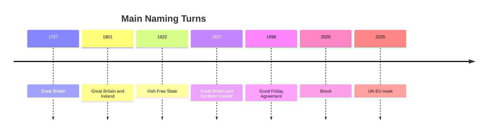
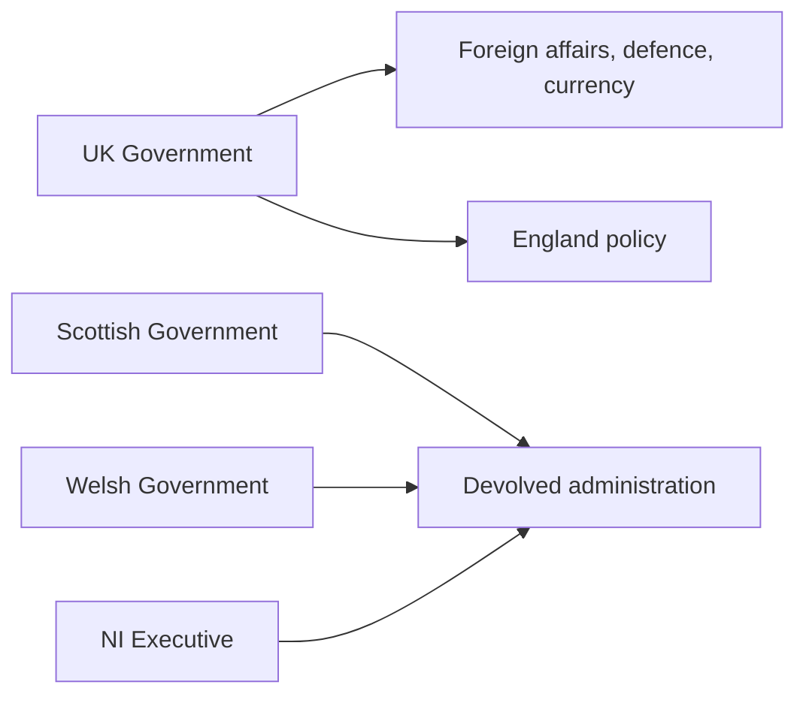

## 1. Executive Summary

The formal English name of the country is **United Kingdom of Great Britain and Northern Ireland**. The key point is that this is not the name of a single ethnic nation. It is the name of a union state produced by multiple kingdoms, parliaments, islands, and the partial separation of Ireland. <SourceNote>[UK Parliament, Act of Union 1707](https://www.parliament.uk/about/living-heritage/evolutionofparliament/legislativescrutiny/act-of-union-1707/) explains that the 1707 Acts of Union passed by the English and Scottish Parliaments created a united kingdom called Great Britain.</SourceNote>

The naming layers are easiest to separate into three steps. First, **Great Britain** refers to the island containing England, Scotland, and Wales, and to the kingdom created after 1707. Second, **United Kingdom** originally referred to the state formed in 1801 when Great Britain and Ireland were united. Third, the present name was settled after the Irish Free State was created in 1922 and the six north-eastern counties remained within the UK as Northern Ireland; in 1927 the state and Parliament were restyled around Great Britain and Northern Ireland.

To understand the UK in 2026, the historical name must be read alongside the current politics of its constituent countries. England is the demographic, fiscal, and parliamentary centre. Scotland remains shaped by the SNP and the independence question. Wales has been transformed by the 2026 Senedd election and Plaid Cymru's advance. Northern Ireland remains a power-sharing polity positioned between the UK internal market and the EU single market. The Republic of Ireland is the UK's closest institutional neighbour, while the EU is the main post-Brexit relationship being rebuilt.

## 2. Where the Formal Name Comes From

The casual word "Britain" often hides several different meanings. England is one constituent country, not the whole UK. Great Britain usually means the island containing England, Scotland, and Wales, and the post-1707 kingdom. The British Isles is a geographical phrase that can include Ireland and the Crown Dependencies, but it is politically sensitive in Ireland.

The 1707 Acts of Union made the Kingdom of England and the Kingdom of Scotland into the Kingdom of Great Britain. Wales did not enter this union as a separate kingdom; by then it was already tied into the English legal and political order. Great Britain is therefore both an island name and a state name created by union. <SourceNote>[UK Parliament, Act of Union 1707](https://www.parliament.uk/about/living-heritage/evolutionofparliament/legislativescrutiny/act-of-union-1707/) states that a united kingdom called Great Britain came into being on May 1, 1707.</SourceNote>

The 1800 Acts of Union joined Great Britain and Ireland into the United Kingdom of Great Britain and Ireland. In other words, the phrase United Kingdom originally meant a union that included Ireland, not only Great Britain.

The current formal name is the result of Irish separation. The Irish Free State was created in 1922, while six north-eastern counties remained in the UK as Northern Ireland. The Royal and Parliamentary Titles Act 1927 changed the style of the Westminster Parliament to the Parliament of the United Kingdom of Great Britain and Northern Ireland, and clarified the meaning of United Kingdom in later public documents. <SourceNote>[Hansard, Royal And Parliamentary Titles Bill, March 9, 1927](https://hansard.parliament.uk/commons/1927-03-09/debates/865b4ad3-08c3-471e-9c06-ba358e5d8c5d/RoyalAndParliamentaryTitlesBill) records the argument that the old name no longer matched constitutional reality.</SourceNote>

## 3. The Structure of the Union State

The UK is a unitary state with constituent countries and devolved institutions. Foreign policy, defence, currency, and much macro-fiscal policy sit with Westminster and the UK Government. Scotland, Wales, and Northern Ireland have devolved institutions that handle different combinations of health, education, transport, local government, environment, and parts of justice. England has no separate English Parliament, so many England-specific policies are decided at Westminster.

| Term | Includes | Excludes | Main Caution |
| --- | --- | --- | --- |
| England | England | Scotland, Wales, Northern Ireland | Not a synonym for the UK |
| Great Britain | England, Scotland, Wales | Northern Ireland, Republic of Ireland | Both island and post-1707 kingdom |
| United Kingdom | Great Britain, Northern Ireland | Republic of Ireland, Crown Dependencies | The present sovereign state |
| British Isles | Great Britain, Ireland, nearby islands | Not a political unit | Politically sensitive in Ireland |

England has overwhelming demographic weight. ONS mid-2024 estimates put the UK population at 69.3 million. The population grew by 1.2% in England, 0.7% in Scotland, 0.6% in Wales, and 0.4% in Northern Ireland. Growth was mainly driven by international migration, while natural change was negative in Scotland and Wales. <SourceNote>[ONS, Population estimates for the UK, England, Wales, Scotland and Northern Ireland: mid-2024](https://www.ons.gov.uk/peoplepopulationandcommunity/populationandmigration/populationestimates/bulletins/annualmidyearpopulationestimates/mid2024) provides the UK population total, constituent-country growth rates, and components of change.</SourceNote>

## 4. Relations with Neighbouring Countries and Jurisdictions

The Republic of Ireland is the UK's closest institutional neighbour. The relationship covers trade and culture, but also Northern Ireland peace, borders, the EU single market, the Common Travel Area, and bilateral UK-Ireland institutions. At the March 2026 UK-Ireland Summit, the governments discussed SMEs, digitalisation, AI, infrastructure, clean energy, maritime security, and cultural ties. <SourceNote>[GOV.UK, Statement between Prime Minister Keir Starmer and Taoiseach Micheál Martin in Cork, March 13, 2026](https://www.gov.uk/government/news/statement-between-prime-minister-keir-starmer-and-taoiseach-micheal-martin-in-cork-13-march-2026) sets out a broad economic, maritime, cultural, and technology agenda.</SourceNote>

Northern Ireland is both inside the UK and part of the political order of the island of Ireland. The Good Friday Agreement made consent central to Northern Ireland's constitutional status. After Brexit, the Windsor Framework gave Northern Ireland a special position to avoid a hard land border while managing its relationship with the UK internal market and the EU single market.

The EU relationship has moved from post-Brexit confrontation toward practical rebuilding. The 2025 UK-EU Common Understanding covers security, defence, youth mobility, Erasmus+, electricity, SPS, emissions trading, competition, policing, judicial cooperation, and irregular migration. The SPS strand is especially important because it could simplify agri-food movements between Great Britain and the EU while also affecting Northern Ireland's dual-access position. <SourceNote>[GOV.UK, UK-EU Summit Common Understanding](https://www.gov.uk/government/publications/ukeu-summit-key-documentation/uk-eu-summit-common-understanding-html) covers the Security and Defence Partnership, youth experience scheme, SPS, ETS, and migration cooperation.</SourceNote>

France matters through the Channel, migration, fisheries, defence, energy, and EU relations. The UK is an island state, but Dover-Calais, Eurotunnel, Channel crossings, North Sea energy, and NATO make it structurally tied to continental Europe. The UK's neighbourhood therefore includes Ireland, France, the EU, NATO, the Crown Dependencies, and the Isle of Man.

## 5. Current Situation of Each Constituent Country

### England

England is the centre of UK population, tax, Commons seats, finance, media, universities, and cultural industries. But it has no separate English Parliament, which makes UK devolution asymmetrical. London and the South East attract capital, migration, high-wage employment, and global services, while northern, coastal, and post-industrial regions often experience weaker public services and political discontent. ONS regional labour data for December 2025 to February 2026 showed the highest employment rate in the South East at 78.6%, while London had the highest unemployment rate at 7.4%. <SourceNote>[ONS, Labour market in the regions of the UK: April 2026](https://www.ons.gov.uk/employmentandlabourmarket/peopleinwork/employmentandemployeetypes/bulletins/regionallabourmarket/april2026) gives regional employment, unemployment, and inactivity figures.</SourceNote>

England's main current issues are the NHS, housing, migration, local transport, urban renewal, university finance, and post-Brexit industrial competitiveness. Nationally it is the core base of the Labour government, but local government is more fragmented by Reform UK, Liberal Democrats, Greens, Conservatives, and independents.

### Scotland

Scotland has the most clearly distinct political arena inside the UK. In the 2026 Scottish Parliament election, the SNP remained the largest party with 58 seats, down six from 2021. Reform UK and Scottish Labour tied for second with 17 seats each; the Conservatives had 12, the Greens 15, and the Liberal Democrats 10. <SourceNote>[Scottish Parliament Information Centre, Election 2026 - The result](https://www.parliament.scot/chamber-and-committees/research-prepared-for-parliament/research-briefings/2026/5/12/sb-2626#dp64214) summarises the post-election seat distribution and changes from 2021.</SourceNote>

Scotland's current situation turns on the SNP's continuing lead, the independence question, public service pressures, fiscal limits, energy transition, and population ageing. Independence is not only an identity claim; it raises institutional questions about EU membership, currency, fiscal transfers, North Sea energy, defence, and borders.

### Wales

Wales changed sharply at the 2026 Senedd election. The House of Commons Library says the May 7, 2026 election gave Plaid Cymru the most seats, followed by Reform UK Wales. It was the first Senedd election since devolution began in 1999 in which Labour did not win the most seats, and the first under the new system of 16 constituencies each electing six members. <SourceNote>[House of Commons Library, Senedd Cymru/Welsh Parliament elections 2026](https://commonslibrary.parliament.uk/research-briefings/cbp-10838/) summarises Plaid Cymru's lead, Reform UK Wales' position, Labour's setback, and the new electoral system.</SourceNote>

Wales' current issues are health care, local economic development, transport, Welsh language policy, decarbonisation, tourism, and debates over independence or further autonomy. The Welsh Government's programme sets out five-year commitments to improve public services and living conditions, but the post-election party distribution makes policy bargaining harder. <SourceNote>[Welsh Government, Programme for government](https://www.gov.wales/programme-government) sets out government commitments for Wales.</SourceNote>

### Northern Ireland

Northern Ireland is the part of the UK where border and identity questions are most deeply institutionalised. The Executive agreed the 2024-2027 Programme for Government on February 27, 2025, aiming to make practical improvements to people's lives. <SourceNote>[Northern Ireland Executive, Programme for Government 2024-2027](https://www.northernireland.gov.uk/articles/programme-government-2024-2027-our-plan-doing-what-matters-most) records the Executive's agreement to the programme.</SourceNote>

The central issues are the stability of power-sharing, health, finance, housing, education, policing, community division, and the Windsor Framework. Northern Ireland is part of the UK, but it has a special position in goods regulation and EU market access. That creates both economic opportunity and political friction.

## 6. How to Read the UK

The UK has one central government, one head of state, and one currency, but politically it is a layered system of four constituent countries and several neighbouring relationships. The formal name preserves that layering. Great Britain records the union with Scotland; Northern Ireland records the partition of Ireland and the peace settlement; United Kingdom binds both into one sovereign state.

The basic correction is that Britain is not simply England. The deeper point is that the UK is unified but not homogeneous. Its formal name is a record of union and separation, and its present politics still moves on that record.

## References

- [UK Parliament, Act of Union 1707](https://www.parliament.uk/about/living-heritage/evolutionofparliament/legislativescrutiny/act-of-union-1707/)
- [Hansard, Royal And Parliamentary Titles Bill, March 9, 1927](https://hansard.parliament.uk/commons/1927-03-09/debates/865b4ad3-08c3-471e-9c06-ba358e5d8c5d/RoyalAndParliamentaryTitlesBill)
- [ONS, Population estimates: mid-2024](https://www.ons.gov.uk/peoplepopulationandcommunity/populationandmigration/populationestimates/bulletins/annualmidyearpopulationestimates/mid2024)
- [Scottish Parliament, Election 2026 - The result](https://www.parliament.scot/chamber-and-committees/research-prepared-for-parliament/research-briefings/2026/5/12/sb-2626#dp64214)
- [House of Commons Library, Senedd Cymru/Welsh Parliament elections 2026](https://commonslibrary.parliament.uk/research-briefings/cbp-10838/)
- [Northern Ireland Executive, Programme for Government 2024-2027](https://www.northernireland.gov.uk/articles/programme-government-2024-2027-our-plan-doing-what-matters-most)
- [GOV.UK, UK-EU Summit Common Understanding](https://www.gov.uk/government/publications/ukeu-summit-key-documentation/uk-eu-summit-common-understanding-html)
- [GOV.UK, UK-Ireland Summit statement, March 13, 2026](https://www.gov.uk/government/news/statement-between-prime-minister-keir-starmer-and-taoiseach-micheal-martin-in-cork-13-march-2026)
