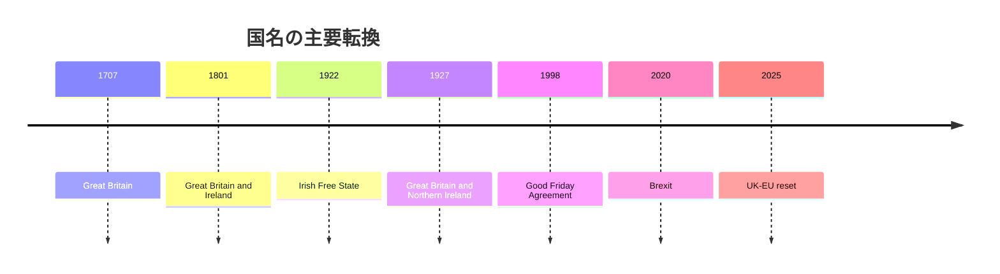
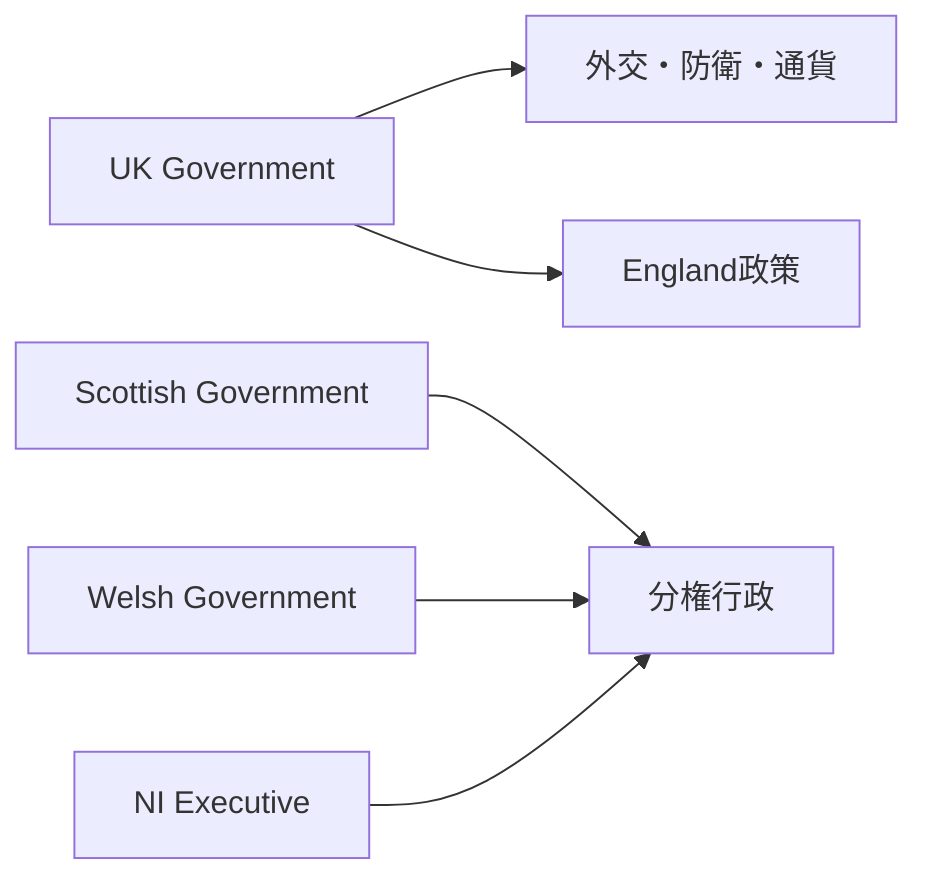

## 1. エグゼクティブサマリー

イギリスの正式国名は、英語では **United Kingdom of Great Britain and Northern Ireland**、日本語では通常「グレートブリテン及び北アイルランド連合王国」と訳される。ここでの要点は、United Kingdomが単一民族国家名ではなく、複数の王国・議会・島嶼関係・アイルランド分離を経て残った「連合国家」の名前だという点である。<SourceNote>[UK Parliament, Act of Union 1707](https://www.parliament.uk/about/living-heritage/evolutionofparliament/legislativescrutiny/act-of-union-1707/) は、1707年にEnglandとScotlandの議会が合同し、Great Britainという united kingdom が成立したと説明している。</SourceNote>

名前の層は三つに分けると理解しやすい。第一に、**Great Britain**はイングランド、スコットランド、ウェールズを含む島と、1707年以降の王国名を指す。第二に、**United Kingdom**は1801年にGreat BritainとIrelandが合同して生まれた国家枠組みである。第三に、現在の国名は、1922年にアイルランド自由国が成立し、北東部六県が北アイルランドとしてUKに残った後、1927年に「Great Britain and Northern Ireland」として整理された。

2026年時点の英国を見るには、国名の歴史だけでなく、構成国ごとの政治状況を見る必要がある。Englandは人口・財政・下院議席の中心で、ScotlandはSNP最大党と独立論、Walesは2026年Senedd選挙後のPlaid Cymru伸長、Northern Irelandは権力分担行政とWindsor Framework、Republic of Irelandは英国にとって最も制度的に密接な隣国、EUはBrexit後の再接近相手である。

## 2. 正式国名の由来

「イギリス」という日本語は便利だが、厳密には複数の英語名をまとめて呼んでいる。Englandは構成国の一つであり、UK全体ではない。Great Britainは主にEngland、Scotland、Walesがある島および1707年以後の王国名であり、Northern Irelandを含まない。British Islesは地理表現としてIrelandやCrown Dependenciesまで含みうるが、アイルランドでは政治的含意を帯びやすいため注意が必要である。

1707年のActs of Unionは、Kingdom of EnglandとKingdom of Scotlandを一つのKingdom of Great Britainにした。ウェールズはこの時点で独立王国として合同したのではなく、すでにイングランド法体系と結びついた地域として扱われていた。そのため「Great Britain」は、単に大きな島名であると同時に、1707年に作られた国家名でもある。<SourceNote>[UK Parliament, Act of Union 1707](https://www.parliament.uk/about/living-heritage/evolutionofparliament/legislativescrutiny/act-of-union-1707/) は、1707年5月1日にGreat Britainと呼ばれる united kingdom が生まれたとする。</SourceNote>

1800年のActs of Unionは、Great BritainとIrelandを一つのUnited Kingdomにした。ここで成立したのは、United Kingdom of Great Britain and Irelandである。つまりUnited Kingdomという言葉は、もともと「Great BritainだけでなくIrelandも含む連合」という意味を持っていた。アイルランドは単なる周辺地域ではなく、英国名そのものを変えた相手だった。

現在の正式国名は、アイルランド分離の結果である。1922年にアイルランド自由国が成立し、多くのアイルランド島地域がUKから離れた。一方、北東部六県はNorthern IrelandとしてUKに残った。1927年のRoyal and Parliamentary Titles Actは、Westminsterの議会名を「Parliament of the United Kingdom of Great Britain and Northern Ireland」に改め、以後の公文書でUnited KingdomがGreat Britain and Northern Irelandを意味することを整理した。<SourceNote>[Hansard, Royal And Parliamentary Titles Bill, 9 March 1927](https://hansard.parliament.uk/commons/1927-03-09/debates/865b4ad3-08c3-471e-9c06-ba358e5d8c5d/RoyalAndParliamentaryTitlesBill) は、旧称が現実に合わなくなったため、Parliamentの名称をGreat Britain and Northern Irelandへ合わせる趣旨を説明している。</SourceNote>

## 3. 連合国家としての構造

英国は、単一国家でありながら、内部に構成国と分権議会・政府を持つ。外交、防衛、通貨、多くのマクロ財政はWestminsterとUK Governmentが担う。一方、Scotland、Wales、Northern Irelandには分権機関があり、医療、教育、交通、地方政府、環境、司法の一部などをそれぞれ異なる範囲で扱う。Englandには単独のEngland Parliamentはなく、多くのEngland政策はWestminsterで決まる。

| 呼称 | 含むもの | 含まないもの | 注意点 |
| --- | --- | --- | --- |
| England | イングランド | Scotland、Wales、Northern Ireland | UK全体の同義語ではない |
| Great Britain | England、Scotland、Wales | Northern Ireland、Republic of Ireland | 島名であり1707年以後の王国名でもある |
| United Kingdom | Great Britain、Northern Ireland | Republic of Ireland、Crown Dependencies | 現在の主権国家 |
| British Isles | Great Britain、Ireland、周辺島嶼 | 政治単位ではない | アイルランドでは避けられることがある |

人口面ではEnglandの重みが圧倒的である。ONSのmid-2024推計では、UK人口は69.3百万人に達し、増加率はEnglandが1.2%、Scotlandが0.7%、Walesが0.6%、Northern Irelandが0.4%だった。人口増は主に国際移民によって支えられ、ScotlandとWalesでは自然増がマイナスだった。<SourceNote>[ONS, Population estimates for the UK, England, Wales, Scotland and Northern Ireland: mid-2024](https://www.ons.gov.uk/peoplepopulationandcommunity/populationandmigration/populationestimates/bulletins/annualmidyearpopulationestimates/mid2024) は、UK人口69.3百万人、構成国別増加率、移民・出生・死亡の寄与を示している。</SourceNote>

## 4. 周辺諸国との関係性

英国にとって最も密接な隣国はRepublic of Irelandである。関係は、貿易や文化交流だけでなく、北アイルランドの和平、国境、EU単一市場、Common Travel Area、英国・アイルランド二国間制度にまたがる。2026年3月のUK-Ireland Summitでは、両政府がSME、デジタル化、AI、インフラ、クリーンエネルギー、海洋安全保障、文化的結びつきを協議している。<SourceNote>[GOV.UK, Statement between Prime Minister Keir Starmer and Taoiseach Micheál Martin in Cork, 13 March 2026](https://www.gov.uk/government/news/statement-between-prime-minister-keir-starmer-and-taoiseach-micheal-martin-in-cork-13-march-2026) は、英国・アイルランド関係を経済、海洋、文化、技術協力へ広げる内容を示している。</SourceNote>

Northern Irelandは、UK内部であると同時に、アイルランド島の政治秩序の一部でもある。Good Friday Agreementは、Northern IrelandがUKに残るか、将来Irelandと統合するかを、住民の同意原則に委ねる枠組みを作った。Brexit後は、陸上国境を硬化させないため、Windsor Frameworkが北アイルランドをUK内部市場とEU単一市場の間に置く特別な制度にしている。

EUとの関係は、Brexit後の対立から実務的再接近へ向かっている。2025年のUK-EU Common Understandingは、安全保障、防衛、若者交流、Erasmus+、電力市場、SPS、排出量取引、競争、警察・司法、移民対策を協議対象にした。特にSPSでは、Great BritainとEUの農食品移動を簡素化し、Northern Irelandの二重アクセスにも影響する。<SourceNote>[GOV.UK, UK-EU Summit Common Understanding](https://www.gov.uk/government/publications/ukeu-summit-key-documentation/uk-eu-summit-common-understanding-html) は、Security and Defence Partnership、youth experience scheme、SPS、ETS、irregular migration cooperationなどを整理している。</SourceNote>

Franceとの関係は、海峡、移民、漁業、防衛、エネルギー、EU関係の接点である。英国は地理的には島国だが、Dover-Calais、Eurotunnel、Channel crossings、北海エネルギー、NATOを通じて欧州大陸と切れていない。したがって英国の「周辺国関係」は、Ireland、France、EU、NATO、Crown Dependencies、Isle of Manまでを含む制度網として見る必要がある。

## 5. 各構成国の現在

### England

EnglandはUK人口、税収、下院議席、金融・メディア・大学・文化産業の中心である。一方で、England単独の議会はなく、分権の非対称性を抱える。LondonとSouth Eastは人口・資本・国際移民・高賃金雇用を引きつけるが、北部・沿岸部・旧工業地帯との格差が政治不満を生む。ONSの地域労働市場統計では、2025年12月から2026年2月の雇用率はSouth Eastが78.6%で最も高く、Londonの失業率は7.4%で最も高かった。<SourceNote>[ONS, Labour market in the regions of the UK: April 2026](https://www.ons.gov.uk/employmentandlabourmarket/peopleinwork/employmentandemployeetypes/bulletins/regionallabourmarket/april2026) は、地域別雇用率・失業率・不活発率を示す。</SourceNote>

Englandの現在の論点は、NHS、住宅、移民、地方交通、都市再生、大学財政、脱EU後の産業競争力である。政治的にはLabour政権の中心基盤でありながら、地方レベルではReform UK、Liberal Democrat、Green、保守党、地域無所属が政策実行を複雑にしている。

### Scotland

Scotlandは、UK内部で最も明確に「別の政治空間」を持つ。2026年Scottish Parliament electionではSNPが58議席で最大党となったが、2021年から6議席減らした。Reform UKとScottish Labourは各17議席で並び、Conservativeは12議席、Greenは15議席、Liberal Democratは10議席となった。<SourceNote>[Scottish Parliament Information Centre, Election 2026 - The result](https://www.parliament.scot/chamber-and-committees/research-prepared-for-parliament/research-briefings/2026/5/12/sb-2626#dp64214) は、2026年選挙後の議席分布と2021年比の変化を整理している。</SourceNote>

Scotlandの情勢は、SNP最大党の継続、独立論の持続、公共サービスと財政制約、エネルギー転換、人口高齢化で読む必要がある。独立論は単なる感情ではなく、EU再加盟、通貨、財政移転、北海エネルギー、国防、国境管理を含む制度設計の問題である。

### Wales

Walesは、2026年Senedd選挙で大きく変わった。House of Commons Libraryによれば、2026年5月7日の選挙ではPlaid Cymruが最多議席を獲得し、Reform UK Walesが続いた。これは、1999年の分権開始以降、Labourが最多議席を取らなかった初めてのSenedd選挙だった。さらに、16選挙区が各6人を選ぶ新制度の最初の選挙でもあった。<SourceNote>[House of Commons Library, Senedd Cymru/Welsh Parliament elections 2026](https://commonslibrary.parliament.uk/research-briefings/cbp-10838/) は、Plaid Cymru最多、Reform UK Wales続伸、新選挙制度、Labour後退を整理している。</SourceNote>

Walesの現在の論点は、医療、地方経済、交通、言語政策、脱炭素、観光、独立・自治拡大論である。Welsh GovernmentのProgramme for governmentは、5年間で生活と公共サービスを改善するコミットメントを掲げるが、選挙後の政党分布は政策合意を難しくする。<SourceNote>[Welsh Government, Programme for government](https://www.gov.wales/programme-government) は、今後5年間の政府コミットメントを示す。</SourceNote>

### Northern Ireland

Northern Irelandは、UKの中で最も国境とアイデンティティの問題が制度化された地域である。2024-2027年のProgramme for Governmentは、2025年2月27日にExecutiveが合意し、住民生活に実質的な差を出すことを掲げている。<SourceNote>[Northern Ireland Executive, Programme for Government 2024-2027](https://www.northernireland.gov.uk/articles/programme-government-2024-2027-our-plan-doing-what-matters-most) は、Executiveが2025年2月27日にProgramme for Governmentを合意したと説明している。</SourceNote>

情勢の中心は、権力分担の安定、医療・財政、住宅、教育、警察、コミュニティ分断、Windsor Frameworkである。Northern IrelandはUKの一部だが、goods regulationとEU市場アクセスの一部では特別な位置にある。この特殊性は、経済機会にも政治摩擦にもなる。

## 6. 見取り図

現在の英国は、中央政府が一つ、国家元首が一つ、通貨が一つである一方、政治的には四つの構成国と複数の隣接関係が重なっている。正式国名はこの重なりをそのまま示している。Great BritainはScotlandとの合同を記憶し、Northern Irelandはアイルランド島の分断と和平を記憶し、United Kingdomはその二つを一つの国家として束ねる言葉である。

したがって、英国を理解する入口は「イギリスはEnglandではない」という単純な訂正にとどまらない。より重要なのは、英国が「統一された国家」でありながら「同質的な国家」ではないことを理解することである。国名は過去の合同と分離の記録であり、現在の政治はその記録の上で動いている。

## 参考情報

- [UK Parliament, Act of Union 1707](https://www.parliament.uk/about/living-heritage/evolutionofparliament/legislativescrutiny/act-of-union-1707/)
- [Hansard, Royal And Parliamentary Titles Bill, 9 March 1927](https://hansard.parliament.uk/commons/1927-03-09/debates/865b4ad3-08c3-471e-9c06-ba358e5d8c5d/RoyalAndParliamentaryTitlesBill)
- [ONS, Population estimates: mid-2024](https://www.ons.gov.uk/peoplepopulationandcommunity/populationandmigration/populationestimates/bulletins/annualmidyearpopulationestimates/mid2024)
- [Scottish Parliament, Election 2026 - The result](https://www.parliament.scot/chamber-and-committees/research-prepared-for-parliament/research-briefings/2026/5/12/sb-2626#dp64214)
- [House of Commons Library, Senedd Cymru/Welsh Parliament elections 2026](https://commonslibrary.parliament.uk/research-briefings/cbp-10838/)
- [Northern Ireland Executive, Programme for Government 2024-2027](https://www.northernireland.gov.uk/articles/programme-government-2024-2027-our-plan-doing-what-matters-most)
- [GOV.UK, UK-EU Summit Common Understanding](https://www.gov.uk/government/publications/ukeu-summit-key-documentation/uk-eu-summit-common-understanding-html)
- [GOV.UK, UK-Ireland Summit statement, 13 March 2026](https://www.gov.uk/government/news/statement-between-prime-minister-keir-starmer-and-taoiseach-micheal-martin-in-cork-13-march-2026)
