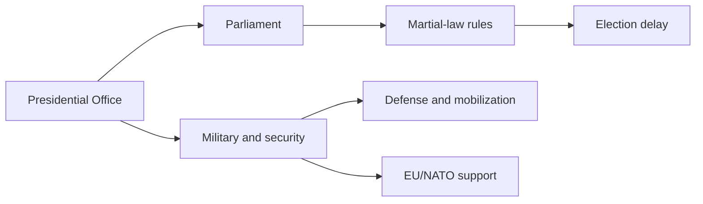
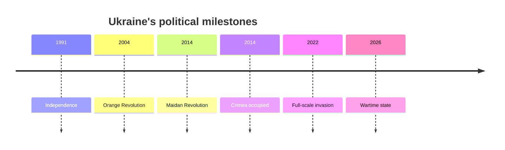

# Ukraine as a Wartime State

## 1. Executive Summary

When you read Ukraine, the core frame is the full-scale war with Russia, wartime law, European integration, and reconstruction. As of October 2026, Ukraine is still a sovereign state, but it is operating as a wartime state that has redirected a large share of national capacity toward mobilization and defense. <SourceNote>[Ukraine MFA, Four years of full-scale Russian aggression against Ukraine](https://mfa.gov.ua/en/news/four-years-full-scale-russian-aggression-against-ukraine), [President of Ukraine, Decree No. 342/2026](https://www.president.gov.ua/documents/3422026-50133)</SourceNote>

Election delay under martial law is better understood as wartime constitutional order than as a simple suspension of institutions. In spring 2026, a working group in the Verkhovna Rada reconfirmed the premise that nationwide elections cannot be held under martial law. <SourceNote>[Verkhovna Rada of Ukraine, working group materials on elections under martial law](https://www.rada.gov.ua/en/news/News/263700.html), [Constitution of Ukraine](https://zakon.rada.gov.ua/laws/show/254%D0%BA/96-%D0%B2%D1%80#Text)</SourceNote>

European integration is not an abstract future goal. It is a live bundle of fiscal support, institutional reform, anti-corruption pressure, and rule-of-law conditionality. The EU is moving accession talks forward, NATO is sustaining military support and interoperability, and reconstruction funding is being lined up before the war ends. <SourceNote>[European Commission, EU-Ukraine relations](https://neighbourhood-enlargement.ec.europa.eu/ukraine_en), [Council of the European Union, Ukraine support decisions](https://www.consilium.europa.eu/en/policies/ukraine-support/), [NATO, NATO's support for Ukraine](https://www.nato.int/cps/en/natohq/topics_37750.htm)</SourceNote>

Daily life is shaped by displacement, inflation, jobs, housing, power supply, and family separation at the same time. Public sentiment is not a simple blend of morale or fatigue; it is closer to a society that still backs independence, defense, and a European future while absorbing a long war's costs. <SourceNote>[UNHCR, Ukraine situation](https://data.unhcr.org/en/situations/ukraine), [World Bank, Ukraine overview](https://www.worldbank.org/en/country/ukraine/overview), [KIIS, Survey of public sentiment in Ukraine, spring 2026](https://www.kiis.com.ua/?cat=reports&id=1619&lang=eng&page=1)</SourceNote>

## 2. Historical Background and State Formation

Modern Ukrainian political memory has layered 1991 independence, the 2004 Orange Revolution, the 2014 Maidan Revolution and Russian occupation of Crimea, and the 2022 full-scale invasion. The state began as a successor to the Soviet Union, but its relation with Russia has been redefined as a struggle over separation from the same imperial space. <SourceNote>[Ukraine MFA, History of Ukraine](https://mfa.gov.ua/en/ukraine), [Britannica, Ukraine](https://www.britannica.com/place/Ukraine), [European Parliament, Russia's war against Ukraine](https://www.europarl.europa.eu/thinktank/en/document/EPRS_BRI(2024)760353)</SourceNote>

Seen through that history, Ukraine's national question is not how far to drift back toward a Russian order. It is how much sovereignty to preserve, which institutions to align with European standards, and which territories can be reintegrated. <SourceNote>[Ukraine MFA, History of Ukraine](https://mfa.gov.ua/en/ukraine), [European Commission, EU-Ukraine relations](https://neighbourhood-enlargement.ec.europa.eu/ukraine_en)</SourceNote>

## 3. Wartime Governance and Political Institutions

The current system is built from the overlap of the constitution, wartime law, the military, local administration, the courts, and a powerful coordinating role for the presidential office. Formally, Ukraine still keeps parliamentary and electoral institutions, but in practice it operates with security-first centralized governance. <SourceNote>[Constitution of Ukraine](https://zakon.rada.gov.ua/laws/show/254%D0%BA/96-%D0%B2%D1%80#Text), [President of Ukraine, martial law decree](https://www.president.gov.ua/documents/3422026-50133)</SourceNote>

| Actor | Role | How to read it |
| --- | --- | --- |
| Presidential Office | Final coordination for diplomacy, military command, and crisis response | The point of concentration |
| Verkhovna Rada | Laws, budgets, wartime extensions, election rules | The source of formal legitimacy |
| Military and security bodies | Defense, mobilization, rear-area security | The state’s survival function |
| Local governments | Evacuation support, repairs, daily services | The on-the-ground implementer |
| Anti-corruption bodies | Trust in funds and EU conditionality | A condition for continued support |

Election delay is not explained well if you treat wartime law as arbitrary. More precisely, continued fighting, population displacement, absent voters from occupied territories, and the lack of safe election administration have broken the normal preconditions for nationwide voting. <SourceNote>[Verkhovna Rada of Ukraine, working group materials on elections under martial law](https://www.rada.gov.ua/en/news/News/263700.html), [Council of Europe, elections and martial law in Ukraine](https://www.coe.int/en/web/kyiv/-/ukraine-elections-should-not-be-held-under-martial-law-says-venice-commission)</SourceNote>

Anti-corruption is not a moral sidebar. It is a test of governing capacity. The IMF and the EU treat judicial reform, prosecutorial independence, asset transparency, and state-owned enterprise governance as conditions for financing and accession. <SourceNote>[IMF, Ukraine and the IMF](https://www.imf.org/en/Countries/UKR), [European Commission, Ukraine reform and enlargement reporting](https://neighbourhood-enlargement.ec.europa.eu/ukraine_en), [NABU, reports and statistics](https://nabu.gov.ua/en/reports/)</SourceNote>

## 4. Main International Disputes

Ukraine's external relations are best read through six channels: the EU, NATO, the United States, the G7, international financial institutions, and UN humanitarian agencies. The EU links accession talks to institutional reform, NATO supports air defense, training, equipment, and interoperability, and the financial institutions support macro stability and reconstruction. <SourceNote>[European Commission, EU-Ukraine relations](https://neighbourhood-enlargement.ec.europa.eu/ukraine_en), [NATO, NATO's support for Ukraine](https://www.nato.int/cps/en/natohq/topics_37750.htm), [IMF, Ukraine and the IMF](https://www.imf.org/en/Countries/UKR), [World Bank, Ukraine overview](https://www.worldbank.org/en/country/ukraine/overview)</SourceNote>

| Partner | Main issue | How to read current conditions |
| --- | --- | --- |
| EU | Accession talks, reconstruction money, rule of law | The main integration track |
| NATO | Defense support, training, deterrence | Near-term defense comes before membership |
| US and G7 | Fiscal support, equipment, sanctions | The long-term support architecture |
| UN and UNHCR | Humanitarian aid, displaced people | The absorber of civilian damage |
| Japan | Reconstruction, sanctions, maritime security | Not a distant edge of the European war |

Security guarantees are still not the final postwar settlement. For now, bilateral security agreements, multilateral support lines, and continuing military assistance are the main devices that reinforce Ukraine's deterrence. <SourceNote>[Council of the European Union, Ukraine support decisions](https://www.consilium.europa.eu/en/policies/ukraine-support/), [NATO, NATO's support for Ukraine](https://www.nato.int/cps/en/natohq/topics_37750.htm)</SourceNote>

The occupied territories question is not a side issue. The Ukrainian government treats Russian occupation as covering Crimea, Sevastopol, Donetsk, Luhansk, Kherson, and Zaporizhzhia, so territory and sovereignty become joint issues whenever ceasefire or talks appear. <SourceNote>[Ukraine MFA, temporarily occupied territories](https://mfa.gov.ua/en/about-ukraine/temporarily-occupied-territories), [European Parliament, Russia's war against Ukraine](https://www.europarl.europa.eu/thinktank/en/document/EPRS_BRI(2024)760353)</SourceNote>

## 5. Civilian Life, Displacement, Language, and Identity

The weight of civilian life does not show up in military headlines alone. The World Bank's spring update points to high poverty, weak employment, household borrowing, and intermittent electricity, heating, and water disruptions, which shows that the war is also a question of infrastructure for daily life. <SourceNote>[World Bank, Ukraine overview](https://www.worldbank.org/en/country/ukraine/overview), [World Bank, Listening to Ukraine Update: Spring 2026](https://thedocs.worldbank.org/en/doc/3df3ca7530237868137cf8a73f9b36b2-0080062026/original/Listening-to-Ukraine-Update-Spring-2026.pdf)</SourceNote>

Displacement is still large, and UNHCR continues to treat both internal displacement and cross-border displacement as major features of the country. Reconstruction is therefore not a project that starts after a ceasefire. It is a long-term task of rebuilding return, rental housing, schools, health care, and local finance at the same time. <SourceNote>[UNHCR, Ukraine situation](https://data.unhcr.org/en/situations/ukraine)</SourceNote>

Social identity is changing too. KIIS's spring 2026 survey shows a strong tendency to reduce the public role of Russian, continued support for independence, and a strong European self-identification, so language is both a fault line and a measure of wartime cohesion. <SourceNote>[KIIS, Survey of public sentiment in Ukraine, spring 2026](https://www.kiis.com.ua/?cat=reports&id=1619&lang=eng&page=1)</SourceNote>

The public-information inference is that the mainstream social mood is not simple wartime euphoria. It is closer to a realistic demand to preserve independence, stay on a European path, and rebuild daily life at the same time. The longer the war lasts, the more trust in administration, jobs, housing, and education shape the support base, not military endurance alone. <SourceNote>[World Bank, Listening to Ukraine Update: Spring 2026](https://thedocs.worldbank.org/en/doc/3df3ca7530237868137cf8a73f9b36b2-0080062026/original/Listening-to-Ukraine-Update-Spring-2026.pdf), [KIIS, Survey of public sentiment in Ukraine, spring 2026](https://www.kiis.com.ua/?cat=reports&id=1619&lang=eng&page=1)</SourceNote>

## 6. Implications for Japan and East Asia

For Japan, Ukraine is not a distant European war. Sanctions compliance, energy and shipping disruption, reconstruction demand, air defense and drones, and the posture of the international order all come back as policy choices, not just as indirect effects. <SourceNote>[Council of the European Union, Ukraine support decisions](https://www.consilium.europa.eu/en/policies/ukraine-support/), [World Bank, Ukraine overview](https://www.worldbank.org/en/country/ukraine/overview)</SourceNote>

For Japanese firms, reconstruction should not be treated as a one-off donation or a communications exercise. Energy, construction, telecoms, logistics, health care, insurance, and finance each create different needs for sanctions screening, counterparty checks, cyber defense, and conflict-risk management. <SourceNote>[World Bank, Ukraine overview](https://www.worldbank.org/en/country/ukraine/overview), [IMF, Ukraine and the IMF](https://www.imf.org/en/Countries/UKR)</SourceNote>

For East Asian security, the war is a stress test for territorial revision by force, the effectiveness of sanctions, and the durability of allied support. Japan should read it as one line that connects sanctions on Russia, deterrence toward China, dual-use technology, and reconstruction finance, rather than as a crisis that belongs only to Europe. <SourceNote>[NATO, NATO's support for Ukraine](https://www.nato.int/cps/en/natohq/topics_37750.htm), [European Commission, EU-Ukraine relations](https://neighbourhood-enlargement.ec.europa.eu/ukraine_en)</SourceNote>

## 7. Monitoring Points

When you track Ukraine going forward, five points make change easier to see. First, how the legal conditions for ending martial law and restarting elections are shaped. Second, how far EU accession talks and anti-corruption reforms are implemented. Third, how return migration and outward displacement feed back into the labor market. Fourth, where US and European support begins to thin out across fiscal aid, air defense, and reconstruction. Fifth, whether language and identity integration stays resilient across generations. <SourceNote>[European Commission, Ukraine enlargement reporting](https://neighbourhood-enlargement.ec.europa.eu/ukraine_en), [World Bank, Ukraine overview](https://www.worldbank.org/en/country/ukraine/overview), [KIIS, Survey of public sentiment in Ukraine, spring 2026](https://www.kiis.com.ua/?cat=reports&id=1619&lang=eng&page=1)</SourceNote>

These five points are the practical way to read Ukraine as the overlap of state formation, social reorganization, and European integration, rather than as a war story alone. <SourceNote>[Ukraine MFA, History of Ukraine](https://mfa.gov.ua/en/ukraine), [European Commission, EU-Ukraine relations](https://neighbourhood-enlargement.ec.europa.eu/ukraine_en)</SourceNote>

## 8. Risks and Limits

This report has three limits. First, the war and sanctions change quickly, so fixed conclusions are risky. Second, occupied territory, casualties, fiscal figures, and reconstruction numbers are easy to mix up because the same number can refer to different definitions. Third, public opinion polling cannot fully capture the silence of wartime or the bias created by displacement. <SourceNote>[OHCHR, Ukraine civilian casualty updates](https://www.ohchr.org/en/country/ukraine), [UNHCR, Ukraine situation](https://data.unhcr.org/en/situations/ukraine), [KIIS, Survey of public sentiment in Ukraine, spring 2026](https://www.kiis.com.ua/?cat=reports&id=1619&lang=eng&page=1)</SourceNote>

The public-information inference is that the issue is more likely to shift from "how to end the war" to "how to sustain a wartime state under the remaining institutions." Policymakers therefore need to watch elections, budgets, reconstruction, and social fatigue alongside military outcomes. <SourceNote>[Constitution of Ukraine](https://zakon.rada.gov.ua/laws/show/254%D0%BA/96-%D0%B2%D1%80#Text), [World Bank, Ukraine overview](https://www.worldbank.org/en/country/ukraine/overview)</SourceNote>

## References

- [Ukraine MFA, Four years of full-scale Russian aggression against Ukraine](https://mfa.gov.ua/en/news/four-years-full-scale-russian-aggression-against-ukraine)
- [President of Ukraine, Decree No. 342/2026](https://www.president.gov.ua/documents/3422026-50133)
- [Verkhovna Rada of Ukraine, working group materials on elections under martial law](https://www.rada.gov.ua/en/news/News/263700.html)
- [European Commission, EU-Ukraine relations](https://neighbourhood-enlargement.ec.europa.eu/ukraine_en)
- [Council of the European Union, Ukraine support decisions](https://www.consilium.europa.eu/en/policies/ukraine-support/)
- [NATO, NATO's support for Ukraine](https://www.nato.int/cps/en/natohq/topics_37750.htm)
- [World Bank, Ukraine overview](https://www.worldbank.org/en/country/ukraine/overview)
- [World Bank, Listening to Ukraine Update: Spring 2026](https://thedocs.worldbank.org/en/doc/3df3ca7530237868137cf8a73f9b36b2-0080062026/original/Listening-to-Ukraine-Update-Spring-2026.pdf)
- [UNHCR, Ukraine situation](https://data.unhcr.org/en/situations/ukraine)
- [KIIS, Survey of public sentiment in Ukraine, spring 2026](https://www.kiis.com.ua/?cat=reports&id=1619&lang=eng&page=1)
