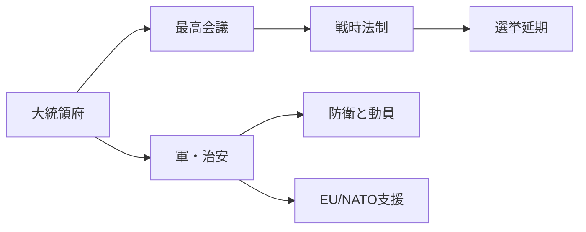
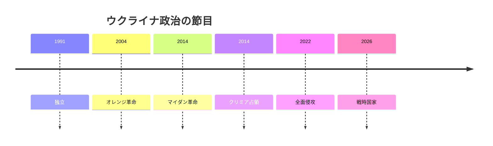

# 戦時国家としてのウクライナ

## 1. エグゼクティブサマリー

ウクライナを読むときの中心軸は、ロシアとの全面戦争、戦時法制、欧州統合、そして復興の四つである。2026年10月時点のウクライナは、独立国家であると同時に、国家機能のかなりの部分を動員と防衛に振り向けた戦時国家として運営されている。<SourceNote>[Ukraine MFA, Four years of full-scale Russian aggression against Ukraine](https://mfa.gov.ua/en/news/four-years-full-scale-russian-aggression-against-ukraine), [President of Ukraine, Decree No. 342/2026](https://www.president.gov.ua/documents/3422026-50133)</SourceNote>

戦時下の選挙延期は、制度の停止というより、憲法秩序を戦時法制の上に載せている状態と理解したほうがよい。2026年春の最高会議の作業部会は、戦時法制の下では全国選挙の実施はできないという前提を再確認した。<SourceNote>[Verkhovna Rada of Ukraine, working group materials on elections under martial law](https://www.rada.gov.ua/en/news/News/263700.html), [Constitution of Ukraine](https://zakon.rada.gov.ua/laws/show/254%D0%BA/96-%D0%B2%D1%80#Text)</SourceNote>

欧州統合は、抽象的な将来像ではなく、財政支援、制度改革、腐敗対策、法の支配を束ねる現在進行形の条件である。EU は加盟交渉を進め、NATO は軍事支援と相互運用性を維持し、復興資金は戦争終結後ではなく戦時から前倒しで組まれている。<SourceNote>[European Commission, EU-Ukraine relations](https://neighbourhood-enlargement.ec.europa.eu/ukraine_en), [Council of the European Union, Ukraine support decisions](https://www.consilium.europa.eu/en/policies/ukraine-support/), [NATO, NATO's support for Ukraine](https://www.nato.int/cps/en/natohq/topics_37750.htm)</SourceNote>

市民生活では、避難、物価、雇用、住宅、電力、家族分断が同時に重なる。国民感情は単純な戦意高揚でも厭戦でもなく、独立、防衛、欧州帰属を支えつつ、長期化する負担に耐えている姿として読むのが近い。<SourceNote>[UNHCR, Ukraine situation](https://data.unhcr.org/en/situations/ukraine), [World Bank, Ukraine overview](https://www.worldbank.org/en/country/ukraine/overview), [KIIS, Survey of public sentiment in Ukraine, spring 2026](https://www.kiis.com.ua/?cat=reports&id=1619&lang=eng&page=1)</SourceNote>

## 2. 歴史的背景と国家形成

現代ウクライナの政治記憶は、1991年の独立、2004年のオレンジ革命、2014年のマイダン革命とロシアによるクリミア占領、そして2022年の全面侵攻で層をなしている。国家はソ連の後継国家として出発したが、ロシアとの関係は「同じ帝国空間からの分離」をめぐる争いとして再定義されてきた。<SourceNote>[Ukraine MFA, History of Ukraine](https://mfa.gov.ua/en/ukraine), [Britannica, Ukraine](https://www.britannica.com/place/Ukraine), [European Parliament, Russia's war against Ukraine](https://www.europarl.europa.eu/thinktank/en/document/EPRS_BRI(2024)760353)</SourceNote>

この歴史を踏まえると、ウクライナの国民的争点は「どこまでロシア的な秩序に戻るか」ではない。むしろ、どこまで主権を守り、どの制度を欧州標準に接続し、どの地域を再統合できるかである。<SourceNote>[Ukraine MFA, History of Ukraine](https://mfa.gov.ua/en/ukraine), [European Commission, EU-Ukraine relations](https://neighbourhood-enlargement.ec.europa.eu/ukraine_en)</SourceNote>

## 3. 戦時体制と政治制度

現在の政治制度は、憲法、戦時法制、軍、地方行政、司法、そして大統領府の強い調整機能が重なってできている。形式上は議会制と選挙制を維持しながら、実務上は安全保障優先の集中型ガバナンスになっている。<SourceNote>[Constitution of Ukraine](https://zakon.rada.gov.ua/laws/show/254%D0%BA/96-%D0%B2%D1%80#Text), [President of Ukraine, martial law decree](https://www.president.gov.ua/documents/3422026-50133)</SourceNote>

| アクター | 役割 | 読み方 |
| --- | --- | --- |
| 大統領府 | 対外交渉、軍事指揮、危機対応の最終調整 | 権限の集中点 |
| 最高会議 | 法律、予算、戦時延長、選挙法制 | 制度の正統性を担う |
| 軍・治安機関 | 防衛、動員、後方治安 | 国家の生存機能 |
| 地方政府 | 避難民支援、復旧、生活インフラ | 現場の実装部隊 |
| 反汚職機関 | 資金の信頼性、EU対応 | 支援継続の条件 |

選挙延期は、戦時法制の恣意的利用としてだけ見ると外れる。より正確には、戦闘継続、避難民の移動、占領地の不在有権者、安全な投票管理の不足が重なり、通常選挙の前提が崩れている。<SourceNote>[Verkhovna Rada of Ukraine, working group materials on elections under martial law](https://www.rada.gov.ua/en/news/News/263700.html), [Council of Europe, elections and martial law in Ukraine](https://www.coe.int/en/web/kyiv/-/ukraine-elections-should-not-be-held-under-martial-law-says-venice-commission)</SourceNote>

汚職対策は、道徳論ではなく統治能力の問題である。IMF と EU は、司法、検察、資産透明性、国有企業統治の改善を、資金供与と加盟交渉の前提として扱っている。<SourceNote>[IMF, Ukraine and the IMF](https://www.imf.org/en/Countries/UKR), [European Commission, Ukraine reform and enlargement reporting](https://neighbourhood-enlargement.ec.europa.eu/ukraine_en), [NABU, reports and statistics](https://nabu.gov.ua/en/reports/)</SourceNote>

## 4. 国際政治の争点

対外関係は、EU、NATO、米国、G7、国際金融機関、そして国連人道機関の六つでおおむね整理できる。EU は加盟交渉と制度改革を結びつけ、NATO は防空、訓練、装備、相互運用性を支え、金融機関はマクロ安定と復興を支える。<SourceNote>[European Commission, EU-Ukraine relations](https://neighbourhood-enlargement.ec.europa.eu/ukraine_en), [NATO, NATO's support for Ukraine](https://www.nato.int/cps/en/natohq/topics_37750.htm), [IMF, Ukraine and the IMF](https://www.imf.org/en/Countries/UKR), [World Bank, Ukraine overview](https://www.worldbank.org/en/country/ukraine/overview)</SourceNote>

| 相手 | 主要論点 | 現在値の読み方 |
| --- | --- | --- |
| EU | 加盟交渉、復興資金、法の支配 | 統合の本線 |
| NATO | 防衛支援、訓練、抑止 | 加盟より当面の防衛優先 |
| 米国・G7 | 財政、装備、制裁 | 長期支援の設計図 |
| 国連・UNHCR | 人道支援、避難民 | 民間被害の受け皿 |
| 日本 | 復興、制裁、海上安全保障 | 欧州戦争の外縁ではない |

安全保障保証は、まだ戦後の最終合意ではない。現時点では、二国間の安全保障協定、多国間の支援枠、軍事援助の継続が、ウクライナの抑止力を補う主な仕組みである。<SourceNote>[Council of the European Union, Ukraine support decisions](https://www.consilium.europa.eu/en/policies/ukraine-support/), [NATO, NATO's support for Ukraine](https://www.nato.int/cps/en/natohq/topics_37750.htm)</SourceNote>

占領地の問題は、外交の付属論点ではない。ロシアの占領は、クリミア、セヴァストポリ、ドネツク、ルハンシク、ヘルソン、ザポリージャに及ぶとウクライナ政府は扱っており、停戦や交渉のたびに領土と主権が同時に争点化する。<SourceNote>[Ukraine MFA, temporarily occupied territories](https://mfa.gov.ua/en/about-ukraine/temporarily-occupied-territories), [European Parliament, Russia's war against Ukraine](https://www.europarl.europa.eu/thinktank/en/document/EPRS_BRI(2024)760353)</SourceNote>

## 5. 市民生活、避難、言語、アイデンティティ

市民生活の重さは、軍事ニュースだけでは見えない。世界銀行の春季アップデートでは、貧困率の高さ、雇用の弱さ、家計の借り入れ、電力・暖房・水道の断続的な障害が並び、戦争が生活インフラの問題でもあることが示されている。<SourceNote>[World Bank, Ukraine overview](https://www.worldbank.org/en/country/ukraine/overview), [World Bank, Listening to Ukraine Update: Spring 2026](https://thedocs.worldbank.org/en/doc/3df3ca7530237868137cf8a73f9b36b2-0080062026/original/Listening-to-Ukraine-Update-Spring-2026.pdf)</SourceNote>

避難はなお大規模で、UNHCR はウクライナ国内避難民と国外避難民の双方が依然として大きいと整理している。したがって、復興は「停戦後に始まる事業」ではなく、帰還、賃貸住宅、学校、医療、地方財政を同時に再建する長期課題である。<SourceNote>[UNHCR, Ukraine situation](https://data.unhcr.org/en/situations/ukraine)</SourceNote>

社会的なアイデンティティも変化している。KIIS の2026年春の調査では、ロシア語の公的使用を減らしたいという傾向や、独立支持、欧州的自己認識が強く示されており、言語は分裂の線であると同時に、戦時の国家統合を測る指標でもある。<SourceNote>[KIIS, Survey of public sentiment in Ukraine, spring 2026](https://www.kiis.com.ua/?cat=reports&id=1619&lang=eng&page=1)</SourceNote>

公表情報からの推定として、ウクライナ社会の主流は「単純な戦意高揚」ではなく、「独立の維持、欧州帰属、生活再建を同時に求める現実主義」に近い。戦争が長引くほど、軍事的忍耐だけではなく、行政の信頼、雇用、住宅、教育が支持基盤を左右する。<SourceNote>[World Bank, Listening to Ukraine Update: Spring 2026](https://thedocs.worldbank.org/en/doc/3df3ca7530237868137cf8a73f9b36b2-0080062026/original/Listening-to-Ukraine-Update-Spring-2026.pdf), [KIIS, Survey of public sentiment in Ukraine, spring 2026](https://www.kiis.com.ua/?cat=reports&id=1619&lang=eng&page=1)</SourceNote>

## 6. 日本・東アジアへの含意

日本にとってのウクライナは、遠い欧州戦争ではない。制裁順守、エネルギーと海運の混乱、復興需要、防空と無人機、国際秩序への姿勢が、間接的にではなく政策判断として戻ってくる。<SourceNote>[Council of the European Union, Ukraine support decisions](https://www.consilium.europa.eu/en/policies/ukraine-support/), [World Bank, Ukraine overview](https://www.worldbank.org/en/country/ukraine/overview)</SourceNote>

日本企業の実務で重要なのは、ウクライナ復興を単発の寄付や広報で捉えないことだ。エネルギー、建設、通信、物流、医療、保険、金融のどこに参加するかで、必要な制裁確認、契約相手確認、サイバー対策、紛争リスク管理は変わる。<SourceNote>[World Bank, Ukraine overview](https://www.worldbank.org/en/country/ukraine/overview), [IMF, Ukraine and the IMF](https://www.imf.org/en/Countries/UKR)</SourceNote>

東アジアの安全保障に引きつけると、ウクライナ戦争は、武力による現状変更、制裁の実効性、同盟支援の持続性を測る試験紙である。日本は、欧州の危機として距離を取るより、対露制裁、対中抑止、軍民両用技術、復興金融を一本の線で読む必要がある。<SourceNote>[NATO, NATO's support for Ukraine](https://www.nato.int/cps/en/natohq/topics_37750.htm), [European Commission, EU-Ukraine relations](https://neighbourhood-enlargement.ec.europa.eu/ukraine_en)</SourceNote>

## 7. 監視点

今後のウクライナを見るときは、次の五点を追うと変化が掴みやすい。第一に、戦時法制と選挙再開の条件がどう整えられるか。第二に、EU 加盟交渉と反汚職改革がどこまで実装されるか。第三に、避難民の帰還と人口流出が労働市場にどう反映されるか。第四に、米欧の支援が財政・防空・復興のどこで細るか。第五に、言語とアイデンティティの統合が世代差を超えて維持されるか。<SourceNote>[European Commission, Ukraine enlargement reporting](https://neighbourhood-enlargement.ec.europa.eu/ukraine_en), [World Bank, Ukraine overview](https://www.worldbank.org/en/country/ukraine/overview), [KIIS, Survey of public sentiment in Ukraine, spring 2026](https://www.kiis.com.ua/?cat=reports&id=1619&lang=eng&page=1)</SourceNote>

この五点は、ロシアとの戦争を単独で見るより、国家形成、社会再編、欧州統合の重なりとして読むための実務的な観測軸である。<SourceNote>[Ukraine MFA, History of Ukraine](https://mfa.gov.ua/en/ukraine), [European Commission, EU-Ukraine relations](https://neighbourhood-enlargement.ec.europa.eu/ukraine_en)</SourceNote>

## 8. リスク・限界

本稿の限界は三つある。第一に、戦況と制裁は短期間で変わるため、固定的な結論は危険である。第二に、占領地、死傷者、財政、復興額は定義が混ざりやすく、同じ数字でも意味が異なる。第三に、公開世論調査は戦時の沈黙や避難の偏りを完全には反映できない。<SourceNote>[OHCHR, Ukraine civilian casualty updates](https://www.ohchr.org/en/country/ukraine), [UNHCR, Ukraine situation](https://data.unhcr.org/en/situations/ukraine), [KIIS, Survey of public sentiment in Ukraine, spring 2026](https://www.kiis.com.ua/?cat=reports&id=1619&lang=eng&page=1)</SourceNote>

公表情報からの推定として、当面の争点は「戦争を終える条件」より「戦時国家をどの制度で持続させるか」に移りやすい。したがって、政策担当者は、軍事の勝敗だけでなく、選挙、財政、復興、社会的疲労の四つを同時に見なければならない。<SourceNote>[Constitution of Ukraine](https://zakon.rada.gov.ua/laws/show/254%D0%BA/96-%D0%B2%D1%80#Text), [World Bank, Ukraine overview](https://www.worldbank.org/en/country/ukraine/overview)</SourceNote>

## 参考情報

- [Ukraine MFA, Four years of full-scale Russian aggression against Ukraine](https://mfa.gov.ua/en/news/four-years-full-scale-russian-aggression-against-ukraine)
- [President of Ukraine, Decree No. 342/2026](https://www.president.gov.ua/documents/3422026-50133)
- [Verkhovna Rada of Ukraine, working group materials on elections under martial law](https://www.rada.gov.ua/en/news/News/263700.html)
- [European Commission, EU-Ukraine relations](https://neighbourhood-enlargement.ec.europa.eu/ukraine_en)
- [Council of the European Union, Ukraine support decisions](https://www.consilium.europa.eu/en/policies/ukraine-support/)
- [NATO, NATO's support for Ukraine](https://www.nato.int/cps/en/natohq/topics_37750.htm)
- [World Bank, Ukraine overview](https://www.worldbank.org/en/country/ukraine/overview)
- [World Bank, Listening to Ukraine Update: Spring 2026](https://thedocs.worldbank.org/en/doc/3df3ca7530237868137cf8a73f9b36b2-0080062026/original/Listening-to-Ukraine-Update-Spring-2026.pdf)
- [UNHCR, Ukraine situation](https://data.unhcr.org/en/situations/ukraine)
- [KIIS, Survey of public sentiment in Ukraine, spring 2026](https://www.kiis.com.ua/?cat=reports&id=1619&lang=eng&page=1)
