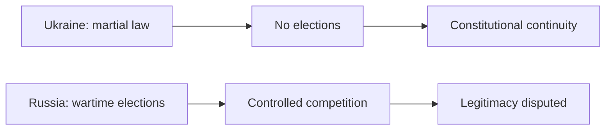

# Election postponement and regime legitimacy in wartime Ukraine and Russia

## 1. Executive Summary

As of May 2026, Ukraine and Russia are both wartime states, but they handle elections in opposite ways. Ukraine has stopped nationwide elections under martial law and continued the incumbent's authority according to its constitution. Russia has kept elections going, but the 2024 presidential election could not be monitored by the OSCE/ODIHR, and competition was heavily constrained by pressure on opposition figures and independent media. <SourceNote>[Council of Europe PACE, elections in times of crisis and martial law](https://assembly.coe.int/nw/xml/XRef/X2H-Xref-ViewHTML.asp?FileID=35715&Lang=EN), [OSCE/ODIHR, Russia presidential election 2024](https://www.osce.org/odihr/elections/russia), [UN Special Rapporteur on the situation of human rights in the Russian Federation](https://digitallibrary.un.org/record/4071308)</SourceNote>

The key distinction is between `legal continuity` and `electoral legitimacy`. Ukraine prioritizes the first by suspending voting, while Russia preserves the appearance of the second without preserving competitive conditions. The two countries therefore diverge even though both are under wartime constraints. <SourceNote>This distinction is an inference drawn from Ukraine's constitutional and martial-law rules and from OSCE/UN assessments of Russia. Ukraine-side sources include [Article 108 of the Constitution of Ukraine](https://zakon.rada.gov.ua/laws/show/en/254%D0%BA/96-%D0%B2%D1%80) and [the Law on Martial Law](https://zakon.rada.gov.ua/laws/show/en/389-19/ed20210801/print).</SourceNote>

<SourceNote>This diagram compares the standards used to judge legitimacy, not a timeline. On the Ukraine side it summarizes [Article 108 of the Constitution of Ukraine](https://zakon.rada.gov.ua/laws/show/en/254%D0%BA/96-%D0%B2%D1%80) and [the Law on Martial Law](https://zakon.rada.gov.ua/laws/show/en/389-19/ed20210801/print); on the Russia side it summarizes [OSCE/ODIHR's Russia 2024 election page](https://www.osce.org/odihr/elections/russia) and [the UN Special Rapporteur report](https://digitallibrary.un.org/record/4071308).</SourceNote>

## 2. Bottom line

The same word "election" means different things in the two systems. Ukraine postpones voting until war conditions change. Russia keeps voting on schedule, but holding a vote does not by itself create democratic legitimacy. International institutions focus less on whether an election happened and more on whether free competition, monitoring, media access, and opposition activity were actually possible. <SourceNote>[PACE, elections in times of crisis and martial law](https://assembly.coe.int/nw/xml/XRef/X2H-Xref-ViewHTML.asp?FileID=35715&Lang=EN), [OSCE/ODIHR, Russia presidential election 2024](https://www.osce.org/odihr/elections/russia), [UN Special Rapporteur report](https://digitallibrary.un.org/record/4071308)</SourceNote>

| Issue | Ukraine | Russia | How to read it |
| --- | --- | --- | --- |
| Near-term election outlook | No nationwide election under martial law; post-war preparation continues | State Duma election is planned for September 2026, and the 2024 presidential election was already held | The key question is not whether elections are scheduled, but whether wartime conditions allow credible voting |
| Constitutional treatment | Elections are suspended under martial law, while office continuity is preserved | The regular election cycle continues | Ukraine "suspends and continues"; Russia "continues and continues" |
| Monitoring | The focus shifts to post-war election design | The 2024 presidential election could not be monitored by the OSCE/ODIHR | Monitoring is what turns a vote into a trusted election |
| Opposition and media | Wartime constraints exist, but post-war election planning is moving forward | Pressure on opposition, restrictions on independent media, and political imprisonment are documented | The key difference is how much competition power actually allows |
| International reading | Generally understood as wartime institutional continuity | More likely to be treated as a vote with weak democratic credibility | Legal continuity and democratic continuity are not the same |

<SourceNote>The Ukraine column is based on [PACE](https://assembly.coe.int/nw/xml/XRef/X2H-Xref-ViewHTML.asp?FileID=35715&Lang=EN), [Article 108 of the Constitution of Ukraine](https://zakon.rada.gov.ua/laws/show/en/254%D0%BA/96-%D0%B2%D1%80), [the Law on Martial Law](https://zakon.rada.gov.ua/laws/show/en/389-19/ed20210801/print), [the CEC Ukraine statement](https://www.cvk.gov.ua/zmi-pro-tsvk/oleg-didenko-golova-tsentralnoi-viborchoi-komisii-ukraini-zakon-pro-voienniy-stan-peredbachaie-shho-ni-prezidentski-ni-parlamentski-ni-mistsevi-vibori-ne-organizovuyutsya-i-ne-provodyatsya.html), and [the CEC roadmap](https://www.cvk.gov.ua/wp-content/uploads/2025/12/Roadmap-FDI-EN.pdf). The Russia column is based on [OSCE/ODIHR](https://www.osce.org/odihr/elections/russia), [the UN Special Rapporteur report](https://digitallibrary.un.org/record/4071308), and [Rossiyskaya Gazeta's reporting on 2026 election planning](https://rg.ru/2026/05/14/kandidaty-gotoviatsia-k-gonke.html).</SourceNote>

## 3. Why Ukraine postpones elections

Ukraine's election postponement is not just a political choice; it is embedded in the martial-law legal framework. The president's powers continue until a newly elected president takes office, and elections are not held under martial law. The 2026 martial-law extension was also adopted formally, so there is still no basis for nationwide elections in the near term. <SourceNote>[Article 108 of the Constitution of Ukraine](https://zakon.rada.gov.ua/laws/show/en/254%D0%BA/96-%D0%B2%D1%80), [the Law on Martial Law](https://zakon.rada.gov.ua/laws/show/en/389-19/ed20210801/print), [Decree 342/2026](https://zakon.rada.gov.ua/laws/show/342/2026?lang=en)</SourceNote>

The Ukrainian CEC has explicitly said that presidential, parliamentary, and local elections are not organized under martial law. It has also published a roadmap for post-war elections. So the issue is no longer "can voting happen at any time?" but "how do you rebuild the conditions for safe registration, voting, displaced voters, and occupied territories?" <SourceNote>[CEC Ukraine statement](https://www.cvk.gov.ua/zmi-pro-tsvk/oleg-didenko-golova-tsentralnoi-viborchoi-komisii-ukraini-zakon-pro-voienniy-stan-peredbachaie-shho-ni-prezidentski-ni-parlamentski-ni-mistsevi-vibori-ne-organizovuyutsya-i-ne-provodyatsya.html), [CEC roadmap](https://www.cvk.gov.ua/wp-content/uploads/2025/12/Roadmap-FDI-EN.pdf)</SourceNote>

PACE also treats the suspension of nationwide elections under war and martial law as consistent with constitutional order. The important point is that the postponement is framed as wartime institutional continuity, not as private ownership of power. <SourceNote>[PACE, elections in times of crisis and martial law](https://assembly.coe.int/nw/xml/XRef/X2H-Xref-ViewHTML.asp?FileID=35715&Lang=EN)</SourceNote>

## 4. Why Russia keeps elections running

Russia does not stop elections in wartime. The March 2024 presidential election was held, and a State Duma election is planned for September 2026. Formally, this looks like business as usual. But when you look at observers and competition conditions, it becomes clear that whether a wartime election carries democratic legitimacy is a separate question. <SourceNote>[OSCE/ODIHR, Russia presidential election 2024](https://www.osce.org/odihr/elections/russia), [Rossiyskaya Gazeta on 2026 election planning](https://rg.ru/2026/05/14/kandidaty-gotoviatsia-k-gonke.html)</SourceNote>

The OSCE/ODIHR said Russia did not invite observers for the 2024 presidential election, so independent monitoring was impossible. The OSCE assessment also emphasized deteriorating competition conditions and the absence of a fair basis for outside evaluation. <SourceNote>[OSCE/ODIHR, Russia presidential election 2024](https://www.osce.org/odihr/elections/russia)</SourceNote>

The UN Special Rapporteur on the situation of human rights in the Russian Federation reported severe deterioration of political rights, pressure on opposition actors, and restrictions on independent media. A separate UN report said 50 media professionals were imprisoned. In other words, the vote exists, but the competitive field is thin. <SourceNote>[UN Special Rapporteur report](https://digitallibrary.un.org/record/4071308), [UN report on media professionals and political prisoners](https://digitallibrary.un.org/record/4094567/files/A_HRC_60_59-EN.pdf)</SourceNote>

## 5. How the international community reads legitimacy

The international reading is not one-dimensional. Ukraine's suspension of elections under martial law is generally seen as a continuation of constitutional order. Russia's elections, by contrast, are easier to describe as votes that took place without the competitive conditions that make them democratically meaningful. <SourceNote>[PACE, elections in times of crisis and martial law](https://assembly.coe.int/nw/xml/XRef/X2H-Xref-ViewHTML.asp?FileID=35715&Lang=EN), [OSCE/ODIHR, Russia presidential election 2024](https://www.osce.org/odihr/elections/russia), [UN Special Rapporteur report](https://digitallibrary.un.org/record/4071308)</SourceNote>

The easier way to understand this is to separate `legal continuity` from `democratic continuity`. Ukraine protects the former by postponing voting. Russia preserves the appearance of the latter while using the election process as a tool of regime control. That is an inference from the public record, not a single official doctrine. <SourceNote>This evaluation is an inference from the PACE, OSCE/ODIHR, and UN documents above, not a single formal joint statement.</SourceNote>

## 6. What is actually different

If you compare wartime elections by the same standard, four questions matter.

1. Is voting legally suspended, or is it still being held?
2. Can independent monitoring enter?
3. Can opposition figures and media genuinely compete?
4. Does the result carry replaceable-mandate legitimacy?

Under that standard, Ukraine preserves legal legitimacy by stopping elections in wartime, while Russia preserves procedure by continuing elections, but weakens the quality of democratic competition. <SourceNote>[Article 108 of the Constitution of Ukraine](https://zakon.rada.gov.ua/laws/show/en/254%D0%BA/96-%D0%B2%D1%80), [the Law on Martial Law](https://zakon.rada.gov.ua/laws/show/en/389-19/ed20210801/print), [OSCE/ODIHR](https://www.osce.org/odihr/elections/russia), [UN Special Rapporteur report](https://digitallibrary.un.org/record/4071308)</SourceNote>

## 7. Reading Elections, Normalization, and Sanctions Risk

For Japanese policy makers, exporters, shipping, insurance, energy, and investment teams, the safe assumption is that "there is an election" does not mean "normalization is underway." In Ukraine, martial-law extension and post-war election preparation remain the key variables. In Russia, voting may continue, but that does not mean competition conditions improve. <SourceNote>[CEC Ukraine roadmap](https://www.cvk.gov.ua/wp-content/uploads/2025/12/Roadmap-FDI-EN.pdf), [OSCE/ODIHR](https://www.osce.org/odihr/elections/russia), [UN Special Rapporteur report](https://digitallibrary.un.org/record/4071308)</SourceNote>

Three items are worth watching:

1. Ukraine's martial-law extensions and the CEC's post-war election work.
2. Russia's 2026 election calendar and whether monitoring missions are accepted.
3. Any new international reporting on opposition pressure, independent media, and political prisoners.

Here, the point is not whether the war ends soon, but whether the institutions can hold up over time. <SourceNote>[Decree 342/2026](https://zakon.rada.gov.ua/laws/show/342/2026?lang=en), [Rossiyskaya Gazeta on 2026 election planning](https://rg.ru/2026/05/14/kandidaty-gotoviatsia-k-gonke.html), [UN Special Rapporteur report](https://digitallibrary.un.org/record/4071308)</SourceNote>

## 8. Risks and limitations

There are three limits to this report. First, state statements are self-serving, so they are not automatically neutral facts. Second, election legitimacy is not decided by statutes alone; it also depends on monitoring, media, and opposition activity. Third, Ukraine's election design can still change if martial law is extended, the battlefield changes, or occupied territories are reclassified. <SourceNote>[PACE](https://assembly.coe.int/nw/xml/XRef/X2H-Xref-ViewHTML.asp?FileID=35715&Lang=EN), [OSCE/ODIHR](https://www.osce.org/odihr/elections/russia), [UN Special Rapporteur report](https://digitallibrary.un.org/record/4071308)</SourceNote>

So the conclusion is not "which side is fully legitimate?" but "which kind of legitimacy is each side trying to preserve?" Ukraine preserves legal continuity by suspending elections. Russia preserves procedural continuity by holding them. Democratic quality is judged on a different scale. <SourceNote>This conclusion is an inference drawn from the official and institutional sources above.</SourceNote>

## 9. References

- [Council of Europe PACE, elections in times of crisis and martial law](https://assembly.coe.int/nw/xml/XRef/X2H-Xref-ViewHTML.asp?FileID=35715&Lang=EN)
- [Article 108 of the Constitution of Ukraine](https://zakon.rada.gov.ua/laws/show/en/254%D0%BA/96-%D0%B2%D1%80)
- [Law on Martial Law](https://zakon.rada.gov.ua/laws/show/en/389-19/ed20210801/print)
- [Decree 342/2026 on martial law extension](https://zakon.rada.gov.ua/laws/show/342/2026?lang=en)
- [CEC Ukraine statement on elections under martial law](https://www.cvk.gov.ua/zmi-pro-tsvk/oleg-didenko-golova-tsentralnoi-viborchoi-komisii-ukraini-zakon-pro-voienniy-stan-peredbachaie-shho-ni-prezidentski-ni-parlamentski-ni-mistsevi-vibori-ne-organizovuyutsya-i-ne-provodyatsya.html)
- [CEC Ukraine roadmap for post-war elections](https://www.cvk.gov.ua/wp-content/uploads/2025/12/Roadmap-FDI-EN.pdf)
- [OSCE/ODIHR, Russia presidential election 2024](https://www.osce.org/odihr/elections/russia)
- [UN Special Rapporteur report on the Russian Federation](https://digitallibrary.un.org/record/4071308)
- [UN report on media professionals and political prisoners](https://digitallibrary.un.org/record/4094567/files/A_HRC_60_59-EN.pdf)
- [Rossiyskaya Gazeta, Russia's 2026 election planning](https://rg.ru/2026/05/14/kandidaty-gotoviatsia-k-gonke.html)
