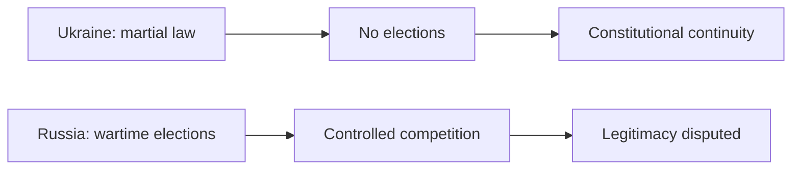

# 戦時下のウクライナとロシアの選挙・政権正統性

## 1. エグゼクティブサマリー

2026年5月時点で、ウクライナとロシアはどちらも戦争当事国だが、選挙の扱いは正反対である。ウクライナは戒厳令のもとで全国選挙を止め、現職の権限を憲法どおり継続させている。一方ロシアは選挙を続けているが、2024年大統領選はOSCE/ODIHR が監視できず、独立メディアや反対派への圧力の中で競争条件が大きく損なわれている。<SourceNote>[Council of Europe PACE, elections in times of crisis and martial law](https://assembly.coe.int/nw/xml/XRef/X2H-Xref-ViewHTML.asp?FileID=35715&Lang=EN), [OSCE/ODIHR, Russia presidential election 2024](https://www.osce.org/odihr/elections/russia), [UN Special Rapporteur on the situation of human rights in the Russian Federation](https://digitallibrary.un.org/record/4071308)</SourceNote>

ここで分けて考えるべきなのは、`法的正統性` と `選挙正統性` である。ウクライナは前者を優先して制度を止め、ロシアは後者の見かけを維持しながら競争条件を狭めている。したがって、両国は同じ「戦時下」でも、正統性の作り方が違う。<SourceNote>この区別は、ウクライナの憲法・戒厳令法と、ロシアに関する OSCE/UN の評価を並べて読んだ場合に導かれる公表情報からの推定である。ウクライナ側は [Zakon Rada, Constitution of Ukraine, Article 108](https://zakon.rada.gov.ua/laws/show/en/254%D0%BA/96-%D0%B2%D1%80)、[Law on Martial Law](https://zakon.rada.gov.ua/laws/show/en/389-19/ed20210801/print) に基づく。</SourceNote>

<SourceNote>この図は時系列ではなく、正統性の判定基準を左右で比較するためのものだ。ウクライナ側は [Constitution of Ukraine Article 108](https://zakon.rada.gov.ua/laws/show/en/254%D0%BA/96-%D0%B2%D1%80) と [Law on Martial Law](https://zakon.rada.gov.ua/laws/show/en/389-19/ed20210801/print) を、ロシア側は [OSCE/ODIHR の 2024 年ロシア大統領選ページ](https://www.osce.org/odihr/elections/russia) と [UN Special Rapporteur report](https://digitallibrary.un.org/record/4071308) を要約している。</SourceNote>

## 2. まず結論

同じ「選挙」でも、ウクライナは「戦争が終わるまで投票を止める」モデルで、ロシアは「戦争中でも予定どおり投票を実施する」モデルだ。ただし、後者は投票の実施そのものが民主的正統性を意味しない。国際機関が見る焦点は、投票が行われたかではなく、自由な競争、監視、メディア環境、反対派の活動が確保されていたかにある。<SourceNote>[PACE, elections in times of crisis and martial law](https://assembly.coe.int/nw/xml/XRef/X2H-Xref-ViewHTML.asp?FileID=35715&Lang=EN), [OSCE/ODIHR, Russia presidential election 2024](https://www.osce.org/odihr/elections/russia), [UN Special Rapporteur report](https://digitallibrary.un.org/record/4071308)</SourceNote>

| 論点 | ウクライナ | ロシア | 読み方 |
| --- | --- | --- | --- |
| 近い選挙予定 | 戒厳令下では全国選挙なし。解除後の実施準備を進める | 2026年9月の国家院選挙が予定され、2024年大統領選も実施済み | 予定があるかではなく、戦時下で投票条件を確保できるかが分岐点 |
| 憲法・法制度 | 戒厳令下で選挙は止まり、現職権限は継続 | 定期選挙のサイクルは維持される | ウクライナは「停止して継続」、ロシアは「実施して継続」 |
| 監視 | 戦時下で国際監視の対象は将来の復旧設計に移る | 2024年は OSCE/ODIHR が監視できなかった | 監視の有無が、選挙の信用を左右する |
| 反対派・メディア | 戦争のため制約はあるが、制度上はポスト戦の選挙準備が進む | 反対派への圧力、独立メディア制約、政治犯化が指摘される | 権力が競争をどこまで許すかが差になる |
| 国際評価 | 「戦時の制度維持」として概ね理解される | 「実施されたが自由競争条件を欠く」と見なされやすい | 法的継続と民主的継続は別物 |

<SourceNote>ウクライナの列は [PACE](https://assembly.coe.int/nw/xml/XRef/X2H-Xref-ViewHTML.asp?FileID=35715&Lang=EN)、[Zakon Rada, Constitution Article 108](https://zakon.rada.gov.ua/laws/show/en/254%D0%BA/96-%D0%B2%D1%80)、[Law on Martial Law](https://zakon.rada.gov.ua/laws/show/en/389-19/ed20210801/print)、[CEC Ukraine statement](https://www.cvk.gov.ua/zmi-pro-tsvk/oleg-didenko-golova-tsentralnoi-viborchoi-komisii-ukraini-zakon-pro-voienniy-stan-peredbachaie-shho-ni-prezidentski-ni-parlamentski-ni-mistsevi-vibori-ne-organizovuyutsya-i-ne-provodyatsya.html)、[CEC roadmap](https://www.cvk.gov.ua/wp-content/uploads/2025/12/Roadmap-FDI-EN.pdf) に基づく。ロシアの列は [OSCE/ODIHR](https://www.osce.org/odihr/elections/russia)、[UN Special Rapporteur report](https://digitallibrary.un.org/record/4071308)、および [Rossiyskaya Gazeta reporting on 2026 election planning](https://rg.ru/2026/05/14/kandidaty-gotoviatsia-k-gonke.html) に基づく。</SourceNote>

## 3. ウクライナ: なぜ延期されるのか

ウクライナの選挙延期は、単なる政治判断ではなく、戒厳令の法体系に乗っている。大統領の権限は新大統領が就任するまで継続し、戒厳令下では選挙が実施されない。2026年の戒厳令延長も公式に行われており、少なくとも 2026 年夏までは全国選挙を行う前提がない。<SourceNote>[Constitution of Ukraine, Article 108](https://zakon.rada.gov.ua/laws/show/en/254%D0%BA/96-%D0%B2%D1%80), [Law on Martial Law](https://zakon.rada.gov.ua/laws/show/en/389-19/ed20210801/print), [Decree 342/2026](https://zakon.rada.gov.ua/laws/show/342/2026?lang=en)</SourceNote>

CEC は、戒厳令下では大統領選、議会選、地方選はいずれも実施されないと明言している。さらに、ポスト戦の選挙を想定したロードマップも公表されており、問題は「いつでも選べるか」ではなく、「安全・避難・投票所・有権者名簿・占領地域の扱いをどう再構成するか」に移っている。<SourceNote>[CEC Ukraine statement](https://www.cvk.gov.ua/zmi-pro-tsvk/oleg-didenko-golova-tsentralnoi-viborchoi-komisii-ukraini-zakon-pro-voienniy-stan-peredbachaie-shho-ni-prezidentski-ni-parlamentski-ni-mistsevi-vibori-ne-organizovuyutsya-i-ne-provodyatsya.html), [CEC roadmap](https://www.cvk.gov.ua/wp-content/uploads/2025/12/Roadmap-FDI-EN.pdf)</SourceNote>

PACE も、戦時・戒厳令のもとでは全国選挙を停止することは憲法秩序に沿うと整理している。重要なのは、停止が「権力の私物化」ではなく、戦時の制度維持として説明されている点である。<SourceNote>[PACE, elections in times of crisis and martial law](https://assembly.coe.int/nw/xml/XRef/X2H-Xref-ViewHTML.asp?FileID=35715&Lang=EN)</SourceNote>

## 4. ロシア: なぜ実施できるのか

ロシアは戦時下でも選挙を止めない。2024年3月の大統領選は実施され、2026年には国家院選挙が予定されている。形式上は「通常運転」だが、観察者の有無や競争条件を見ると、戦時下の選挙が民主的正統性をどこまで持つかは別問題になる。<SourceNote>[OSCE/ODIHR, Russia presidential election 2024](https://www.osce.org/odihr/elections/russia), [Rossiyskaya Gazeta on 2026 election planning](https://rg.ru/2026/05/14/kandidaty-gotoviatsia-k-gonke.html)</SourceNote>

OSCE/ODIHR は、2024年大統領選についてロシア当局からの招待がなく、独立した監視ができなかった。OSCE 側の評価では、競争環境の悪化、圧力、制約のため、公平な外部評価の前提が崩れていた。<SourceNote>[OSCE/ODIHR, Russia presidential election 2024](https://www.osce.org/odihr/elections/russia)</SourceNote>

国連の特別報告者は、ロシア連邦における人権状況の報告で、政治的権利の著しい悪化、反対派の抑圧、独立メディアへの制約を指摘している。別の報告では、50人のメディア関係者が収監されているとされる。つまり、投票は存在しても、競争の土台が薄い。<SourceNote>[UN Special Rapporteur report](https://digitallibrary.un.org/record/4071308), [UN report on media professionals and political prisoners](https://digitallibrary.un.org/record/4094567/files/A_HRC_60_59-EN.pdf)</SourceNote>

## 5. 国際社会はどう評価しているか

国際社会の評価は、1本の尺度ではない。ウクライナについては、戒厳令下の選挙停止を憲法秩序の延長として見る傾向が強い。ロシアについては、選挙が行われても、監視の欠如と競争条件の歪みのために、民主的正統性は低く評価されやすい。<SourceNote>[PACE, elections in times of crisis and martial law](https://assembly.coe.int/nw/xml/XRef/X2H-Xref-ViewHTML.asp?FileID=35715&Lang=EN), [OSCE/ODIHR, Russia presidential election 2024](https://www.osce.org/odihr/elections/russia), [UN Special Rapporteur report](https://digitallibrary.un.org/record/4071308)</SourceNote>

この読み方は、`法的な継続` と `民主的な継続` を切り分けるとわかりやすい。ウクライナは前者を守るために後者を延期している。ロシアは後者の見かけを保ちながら、前者を自国の権力維持のために使っている、というのが公表情報からの推定である。<SourceNote>この評価は、上記の PACE、OSCE/ODIHR、UN の文書を合わせて読んだ場合の推定であり、単一の公式見解ではない。</SourceNote>

## 6. 何が違うのか

戦時下の選挙を同じ基準で比べるなら、見るべき論点は 4 つに絞れる。

1. 選挙が法的に止まっているか、形式上は続いているか。
2. 監視が入っているか、外部評価が可能か。
3. 反対派とメディアが実際に競争できるか。
4. その結果として、政権交代可能性を伴う正統性があるか。

この基準で見ると、ウクライナは「戦時のため投票を止める」ことで法的正統性を維持し、ロシアは「投票を続ける」ことで形式を維持するが、競争正統性は大きく損なわれている。<SourceNote>[Constitution of Ukraine Article 108](https://zakon.rada.gov.ua/laws/show/en/254%D0%BA/96-%D0%B2%D1%80), [Law on Martial Law](https://zakon.rada.gov.ua/laws/show/en/389-19/ed20210801/print), [OSCE/ODIHR](https://www.osce.org/odihr/elections/russia), [UN Special Rapporteur report](https://digitallibrary.un.org/record/4071308)</SourceNote>

## 7. 実務的な含意

日本の政策担当者、輸出管理、海運・保険、エネルギー、投資の実務では、「選挙があるから正常化する」とは読まないほうがよい。ウクライナでは戒厳令解除と選挙制度の再起動が必要であり、ロシアでは投票があっても競争条件が改善したとは限らない。<SourceNote>[CEC Ukraine roadmap](https://www.cvk.gov.ua/wp-content/uploads/2025/12/Roadmap-FDI-EN.pdf), [OSCE/ODIHR](https://www.osce.org/odihr/elections/russia), [UN Special Rapporteur report](https://digitallibrary.un.org/record/4071308)</SourceNote>

特に注視すべきは次の 3 点である。

1. ウクライナの戒厳令延長と CEC のポスト戦選挙準備。
2. ロシアの 2026 年選挙日程と、監視団の受け入れ有無。
3. 反対派・独立メディア・政治犯に関する追加の国際報告。

ここでの判断は、戦争終結の見込みではなく、制度の持久力を見るためのものだ。<SourceNote>[Decree 342/2026](https://zakon.rada.gov.ua/laws/show/342/2026?lang=en), [Rossiyskaya Gazeta on 2026 election planning](https://rg.ru/2026/05/14/kandidaty-gotoviatsia-k-gonke.html), [UN Special Rapporteur report](https://digitallibrary.un.org/record/4071308)</SourceNote>

## 8. リスク・限界

本稿の限界は三つある。第一に、国家の公式発表は自己正当化を含むため、そのまま中立的事実とは限らない。第二に、選挙の正統性は法文だけでは決まらず、監視、メディア、反対派の活動条件を総合して判断する必要がある。第三に、将来の戒厳令延長、戦況、占領地域の扱いによって、ウクライナの選挙設計は変わりうる。<SourceNote>[PACE](https://assembly.coe.int/nw/xml/XRef/X2H-Xref-ViewHTML.asp?FileID=35715&Lang=EN), [OSCE/ODIHR](https://www.osce.org/odihr/elections/russia), [UN Special Rapporteur report](https://digitallibrary.un.org/record/4071308)</SourceNote>

したがって、結論は「どちらが完全に正統か」ではなく、「どの種類の正統性を守ろうとしているか」で読むのが妥当である。ウクライナは制度停止を通じて法的継続を守り、ロシアは選挙実施を通じて手続の継続を守るが、民主的競争の質は別の基準で評価される。<SourceNote>この結論は、上記の公式文書と国際機関の評価を総合した公表情報からの推定である。</SourceNote>

## 9. 参考情報

- [Council of Europe PACE, elections in times of crisis and martial law](https://assembly.coe.int/nw/xml/XRef/X2H-Xref-ViewHTML.asp?FileID=35715&Lang=EN)
- [Zakon Rada, Constitution of Ukraine, Article 108](https://zakon.rada.gov.ua/laws/show/en/254%D0%BA/96-%D0%B2%D1%80)
- [Zakon Rada, Law on Martial Law](https://zakon.rada.gov.ua/laws/show/en/389-19/ed20210801/print)
- [Decree 342/2026 on martial law extension](https://zakon.rada.gov.ua/laws/show/342/2026?lang=en)
- [CEC Ukraine statement on elections under martial law](https://www.cvk.gov.ua/zmi-pro-tsvk/oleg-didenko-golova-tsentralnoi-viborchoi-komisii-ukraini-zakon-pro-voienniy-stan-peredbachaie-shho-ni-prezidentski-ni-parlamentski-ni-mistsevi-vibori-ne-organizovuyutsya-i-ne-provodyatsya.html)
- [CEC Ukraine roadmap for post-war elections](https://www.cvk.gov.ua/wp-content/uploads/2025/12/Roadmap-FDI-EN.pdf)
- [OSCE/ODIHR, Russia presidential election 2024](https://www.osce.org/odihr/elections/russia)
- [UN Special Rapporteur report on the Russian Federation](https://digitallibrary.un.org/record/4071308)
- [UN report on media professionals and political prisoners](https://digitallibrary.un.org/record/4094567/files/A_HRC_60_59-EN.pdf)
- [Rossiyskaya Gazeta, Russia's 2026 election planning](https://rg.ru/2026/05/14/kandidaty-gotoviatsia-k-gonke.html)
