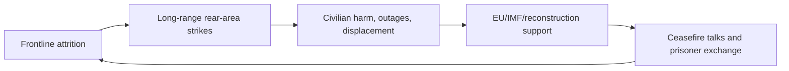

# Current status and situation of the Ukraine-Russia war

## 1. Executive Summary

As of May 2026, the Ukraine-Russia war is at a stage where a "war of attrition on the front lines" and "long-range attacks on the rear" are progressing simultaneously, even though there is talk of a short-term ceasefire. The main theaters of war that are easy to mutually confirm with public information are the Pokrovsk-Kostiantynivka axis in Donetsk Oblast, the Kupiansk direction in the northeast, the Sumy border area in the north, and drone and missile attacks targeting cities and infrastructure. No decisive breakthrough has been confirmed, and localized advances and high attrition continue. Source notes: [Reuters, fighting reaches outskirts of Kostiantynivka](https://www.investing.com/news/world-news/fighting-reaches-outskirts-of-ukraines-stronghold-kostiantynivka-4654763), [Reuters, Ukraine war front line and gains](https://www.investing.com/news/world-news/ukraine-war-live-russia-and-ukraine-to-hold-talks-after-brief-ceasefire-3959412), [Reuters, Sumy region attack coverage](https://uk.marketscreener.com/news/russian-missile-drone-strikes-kill-four-in-ukraine-s-northern-regions-officials-say-ce7f5adbdd8ef424).
Civilian casualties remain serious, with OHCHR confirming 238 civilian deaths and 1,404 injuries in April 2026. This is the worst month since July 2025, with not only long-range attacks but also drone, artillery and infrastructure attacks near the front lines eroding livelihoods. The number of displaced persons is still large, with the latest figures released by UNHCR putting the number of refugees outside Ukraine at approximately 5.3 million and the number of internally displaced persons at approximately 3.7 million. Source notes: [OHCHR, Ukraine civilian casualty update](https://www.ohchr.org/en/news/2026/05/ukraine-civilian-casualty-update-april-2026), [UNHCR data portal for Ukraine](https://data.unhcr.org/en/situations/ukraine), [UNHCR, latest displacement figures](https://www.unhcr.org/us/news/briefing-notes/after-brutal-winter-millions-ukrainians-face-deepening-displacement-and).
Ceasefire negotiations remain a limited humanitarian measure rather than a comprehensive peace. The UN welcomed a short-term ceasefire between May 9 and 11, but fighting on the front has continued since then, with Reuters reporting that rifts over territorial disputes are at the heart of stalled negotiations. International support is still large, with the EU's multi-year support, the IMF's extended credit provision, and the World Bank/European Commission/UN's reconstruction estimates indicating financial and reconstruction support based on the assumption that the war will be prolonged. Source note: [UN Secretary-General statement on Ukraine ceasefire](https://www.un.org/sg/en/content/sg/statements/2026-05-09/statement-attributable-the-spokesperson-for-the-secretary-general-ukraine-and-the-russian-federation), [Reuters on stalled talks](https://www.reuters.com/world/europe/ukraine-russia-toughest-issue-how-to-bridge-their-gaps-in-peace-talks-2026-05-16/), [EU support loan](https://www.consilium.europa.eu/en/press/press-releases/2026/04/23/council-finalises-90-billion-support-loan-to-ukraine/), [IMF program](https://www.imf.org/en/News/Articles/2026/02/26/pr-26066-ukraine-imf-executive-board-approves-usd-8-1-billion-under-an-eff-arrangement), [World Bank RDNA5](https://www.worldbank.org/en/news/press-release/2026/02/23/updated-ukraine-recovery-and-reconstruction-needs-assessment-released).
Source note: This article prioritizes primary information from Reuters and public analysis for front lines and military attrition, OHCHR and UNHCR for civilian damage and evacuation, UN and Reuters for ceasefire negotiations, and primary information from the EU, IMF, and World Bank for international assistance. The "war situation" here does not simply adopt the unverified claims of the Russian Ministry of Defense and the Ukrainian Ministry of Defense, but is limited to the extent that they are mutually corroborated.

## 2. How to read the current war situation

This war is not a simple "advancement of the occupation line," but is driven by front-line pressure, long-range attacks on cities, damage to economic and power infrastructure, and a cycle of support and negotiation. Therefore, rather than looking only at advances and retreats on a single day, it is more practical to understand in which theaters losses are accumulating, which attacks are spilling over into civilian life, and over what period of time support. Source notes: [OHCHR civilian casualty update](https://www.ohchr.org/en/news/2026/05/ukraine-civilian-casualty-update-april-2026), [Reuters front-line reporting](https://www.investing.com/news/world-news/ukraine-war-live-russia-and-ukraine-to-hold-talks-after-brief-ceasefire-3959412), [EU/IMF/World Bank support links](https://www.consilium.europa.eu/en/press/press-releases/2026/04/23/council-finalises-90-billion-support-loan-to-ukraine/).
Source note: This chart is a simplification of OHCHR civilian casualties, Reuters combat coverage, and EU/IMF/World Bank aid announcements. The purpose of the diagram is to show a "circle of cause and effect" rather than a chronological sequence.

## 3. Main areas of the front line

The most consistently strong axis in public information is the Pokrovsk-Kostiantynivka axis in Donetsk Oblast. Reuters reported that the area around Pokrovsk was one of the toughest theaters of war, with Russian forces closing in on Kostiantynivka. This shows that Russia will continue to apply pressure on a wide front, while Ukraine will protect key cities and supply lines. What is important here is not a "major breakthrough," but rather the gradual movement of the front line due to the accumulation of localized pressure and attrition. Source note: [Reuters, fighting reaches outskirts of Kostiantynivka](https://www.investing.com/news/world-news/fighting-reaches-outskirts-of-ukraines-stronghold-kostiantynivka-4654763), [Reuters, Ukraine war live on front line pressure](https://www.investing.com/news/world-news/ukraine-war-live-russia-and-ukraine-to-hold-talks-after-brief-ceasefire-3959412).
In the northeast, the Kupiansk direction in Kharkiv Oblast continues to be a near-front theater. Public reports state that the front line extends not only to Donetsk Oblast but also to a wide swath of the northeast, and that the Russian military's offensive extends to "almost the entire front." Although it is difficult to cross-verify individual military claims regarding Kupiansk, it is reasonable to assume that the theater of war remains close to the front lines, and pressure continues to undermine the defense line in the northeast. Source note: [Reuters, battles near Kupiansk](https://www.reuters.com/world/europe/battles-near-kupiansk-eastern-ukraine-exposed-endless-drone-warfare-2026-05-08/), [Reuters, front-line pressure across almost entire front](https://www.investing.com/news/world-news/ukraine-war-live-russia-and-ukraine-to-hold-talks-after-brief-ceasefire-3959412).
The Sumy border area in the north has also been subject to localized cross-border pressure and drone attacks. Reuters continues to report on fighting and attacks around Sumy, and it appears that there is an attempt to use the border itself to create a buffer zone. Rather than a fixed line of occupation, this area is more realistically viewed as a "zone of friction" where attacks, infiltration, and small-scale battles with quick reactions accumulate. Source note: [Reuters, northern regions attack report](https://uk.marketscreener.com/news/russian-missile-drone-strikes-kill-four-in-ukraine-s-northern-regions-officials-say-ce7f5adbdd8ef424), [Reuters, Sumy fighting coverage](https://www.reuters.com/world/europe/ukraine-russia-toughest-issue-how-to-bridge-their-gaps-in-peace-talks-2026-05-16/).
| Battlefield | Current situation as seen from public information | Accuracy |
| --- | --- | --- |
| Pokrovsk-Kostiantynivka axis | The strongest pressure on the Eastern Front. Approaching Russian troops and local advances are reported | High |
| Toward Kupiansk, Kharkiv region | Continued as a theater near the front line. There is a lot of unverified information regarding individual results | Medium |
| Sumy border area | Cross-border pressure and small-scale fighting continue. Attempts to create a buffer zone can be seen | Medium |
Source note: Line 1 is based on [Reuters, Kostiantynivka](https://www.investing.com/news/world-news/fighting-reaches-outskirts-of-ukraines-stronghold-kostiantynivka-4654763) and [Reuters, front-line pressure](https://www.investing.com/news/world-news/ukraine-war-live-russia-and-ukraine-to-hold-talks-after-brief-ceasefire-3959412). The second line is based on [Reuters, battles near Kupiansk](https://www.reuters.com/world/europe/battles-near-kupiansk-eastern-ukraine-exposed-endless-drone-warfare-2026-05-08/). The third line is based on [Reuters, northern regions attack report](https://uk.marketscreener.com/news/russian-missile-drone-strikes-kill-four-in-ukraine-s-northern-regions-officials-say-ce7f5adbdd8ef424). Accuracy is the author's evaluation based on the density of public sources and ease of mutual confirmation.

## 4. Military attrition

The essence of this war is that each side does not try to destroy the other's military strength with a single blow, but rather uses replenishment, air superiority, artillery, drones, and production capacity to reduce each other's endurance. Public reports in the spring of 2026 indicate that while Russia maintains front-line pressure, Ukraine is increasingly using long-range drones to attack military and logistics bases in Russia's rear. In other words, the battlefield has a two-layer structure: the front and the rear. Source note: [Reuters, front-line pressure and ceasefire reporting](https://www.investing.com/news/world-news/ukraine-war-live-russia-and-ukraine-to-hold-talks-after-brief-ceasefire-3959412), [Reuters, Ukraine steps up medium-range strikes](https://www.investing.com/news/commodities-news/ukraine-steps-up-mediumrange-strikes-on-russian-forces-4658831).
Ukraine's long-range attacks have a greater purpose of destabilizing Russia's fuel, maintenance, accumulation, and air defenses than achieving tactical results on the front lines. Reuters reported that Ukraine increased its medium-range drone attacks on Russian critical infrastructure in April. This should be seen as part of asymmetric warfare, which shakes up the rear and slows down the operational tempo, since there is no perfect symmetry in ground combat. Source note: [Reuters, medium-range strikes report](https://www.investing.com/news/commodities-news/ukraine-steps-up-mediumrange-strikes-on-russian-forces-4658831).
The Russian side, on the other hand, is combining missile and drone attacks on cities with sustained artillery shelling near the front lines. Militarily, the aim is to simultaneously "push" the front lines and "deplete" Ukrainian society's air defense, power, transportation, and repair capabilities. This is a war of attrition that cannot be measured by tactical advances alone. Source note: [OHCHR, April 2026 civilian casualty update](https://www.ohchr.org/en/news/2026/05/ukraine-civilian-casualty-update-april-2026), [Reuters, northern regions strike report](https://uk.marketscreener.com/news/russian-missile-drone-strikes-kill-four-in-ukraine-s-northern-regions-officials-say-ce7f5adbdd8ef424).
Source note: Military attrition is best understood when combined with Reuters' frontline and long-range drone coverage, and OHCHR's civilian casualty reports. "Asymmetric warfare" here means that the quality of attrition on both sides differs, so it is better not to draw conclusions based solely on the geography of the front lines.

## 5. Civilian damage/displacement/infrastructure attacks

Civilian casualties remain the central cost of war. OHCHR confirmed the number of civilian casualties in April 2026: 238 dead and 1,404 injured. This is the worst month since July 2025 and shows that long-range weapons and near-frontline attacks are simultaneously spilling over into civilian areas. Even in the cumulative period from January to April 2026, damage remains at a higher level than the same period last year. Source note: [OHCHR, April 2026 update](https://www.ohchr.org/en/news/2026/05/ukraine-civilian-casualty-update-april-2026).
What is important about the damage breakdown is that the attack was not just a single urban bombardment. OHCHR explains that infrastructure such as energy, railways and ports have been repeatedly attacked. This means that the premise that "the rear, away from the front lines, is safe" no longer holds true, and the ability to restore power, logistics, transportation, and medical care has itself become a military goal. Source note: [OHCHR, April 2026 update](https://www.ohchr.org/en/news/2026/05/ukraine-civilian-casualty-update-april-2026).
The scale of the evacuation is also large. According to the latest figures published by UNHCR, there are approximately 5.3 million refugees outside Ukraine and approximately 3.7 million internally displaced persons. In other words, wars have become long-term crises that involve not only territorial disputes but also population outflows and the reorganization of livelihoods. Recovery in education, housing, the labor market, and local finances will take a long time, regardless of whether there is a ceasefire or not. Source note: [UNHCR Ukraine situation portal](https://data.unhcr.org/en/situations/ukraine), [UNHCR briefing note](https://www.unhcr.org/us/news/briefing-notes/after-brutal-winter-millions-ukrainians-face-deepening-displacement-and).
Source note: Civilian damage was confirmed starting from [OHCHR, Ukraine civilian casualties update](https://www.ohchr.org/en/news/2026/05/ukraine-civilian-casualty-update-april-2026), and evacuees were confirmed at [UNHCR Ukraine situation portal](https://data.unhcr.org/en/situations/ukraine). The term "long-term crisis" here refers to an evaluation that includes not only the number of deaths but also the costs of evacuation, recovery, and reconstruction.

## 6. Current status of ceasefire negotiations

The ceasefire talks are moving more like a limited ceasefire or prisoner exchange than full-scale peace negotiations. The UN welcomed the short-term ceasefire of May 9-11 and called for a broader ceasefire, but fighting continued thereafter. Reuters reports that substantive negotiations have stalled as disagreements over territorial conditions remain significant. Source note: [UN ceasefire statement](https://www.un.org/sg/en/content/sg/statements/2026-05-09/statement-attributable-the-spokesperson-for-the-secretary-general-ukraine-and-the-russian-federation), [Reuters, peace-talk gap analysis](https://www.reuters.com/world/europe/ukraine-russia-toughest-issue-how-to-bridge-their-gaps-in-peace-talks-2026-05-16/).
What is important is that the issues in the negotiations have shifted from "whether there is a ceasefire" to "at what line should it stop?" and "Who will guarantee security?" Territory, the status of occupied territories, sanctions relief, reconstruction funds, prisoner exchanges, and security guarantees are interconnected, and even if one is resolved, the whole does not necessarily move forward. Therefore, in the short term, it is more realistic to build up piecemeal agreements than to pursue a comprehensive peace. Source note: [Reuters, peace-talk gap analysis](https://www.reuters.com/world/europe/ukraine-russia-toughest-issue-how-to-bridge-their-gaps-in-peace-talks-2026-05-16/), [UN ceasefire statement](https://www.un.org/sg/en/content/sg/statements/2026-05-09/statement-attributable-the-spokesperson-for-the-secretary-general-ukraine-and-the-russian-federation).
Source note: Current status regarding ceasefire is based on [UN Secretary-General statement](https://www.un.org/sg/en/content/sg/statements/2026-05-09/statement-attributable-the-spokesperson-for-the-secretary-general-ukraine-and-the-russian-federation) and [Reuters の交渉報道](https://www.reuters.com/world/europe/ukraine-russia-toughest-issue-how-to-bridge-their-gaps-in-peace-talks-2026-05-16/). The "piecemeal agreement" here is an estimate based on publicly available information and is not an official roadmap, so it will be treated as `公表情報からの推定`.

## 7. Current status of international support

International aid continues at three levels: not only military aid, but also filling gaps in finances and preparing for reconstruction. The EU will provide liquidity and long-term support in 2026 within the framework of the Ukraine Facility, and the Council is proceeding with the design of support totaling 90 billion euros. This is support to maintain national functions on the assumption that the war will be prolonged. Source note: [Council finalises 90 billion support loan](https://www.consilium.europa.eu/en/press/press-releases/2026/04/23/council-finalises-90-billion-support-loan-to-ukraine/), [European Commission, Ukraine Facility](https://commission.europa.eu/strategy-and-policy/eu-budget/eu-borrowings/ukraine-facility_en).
The IMF also approved an Extended Credit Facility (EFF) of approximately $8.1 billion in February 2026. This directly leads to the stabilization of wartime finances, currency, and revenue. In addition, the World Bank, European Commission, UN, and Government of Ukraine's Fifth Rapid Damage and Needs Assessment (RDNA5) estimates recovery and reconstruction costs over the next 10 years at approximately $588 billion, indicating that the scale of post-war reconstruction is already difficult for a country to absorb on its own. Source note: [IMF, Ukraine EFF approval](https://www.imf.org/en/News/Articles/2026/02/26/pr-26066-ukraine-imf-executive-board-approves-usd-8-1-billion-under-an-eff-arrangement), [World Bank, RDNA5](https://www.worldbank.org/en/news/press-release/2026/02/23/updated-ukraine-recovery-and-reconstruction-needs-assessment-released).
The practical meaning of support is twofold. First, Ukraine maintains its wartime economy while relying on international organizations and the EU for short-term funding. Second, donor countries are designing funding, air defense, and infrastructure restoration based on the "premise that the ceasefire will be delayed," rather than "post-ceasefire reconstruction." In other words, aid is not a gamble to end the war, but rather functions as an insurance policy against prolonging the war. Source notes: [EU support loan](https://www.consilium.europa.eu/en/press/press-releases/2026/04/23/council-finalises-90-billion-support-loan-to-ukraine/), [IMF Ukraine program](https://www.imf.org/en/News/Articles/2026/02/26/pr-26066-ukraine-imf-executive-board-approves-usd-8-1-billion-under-an-eff-arrangement), [World Bank RDNA5](https://www.worldbank.org/en/news/press-release/2026/02/23/updated-ukraine-recovery-and-reconstruction-needs-assessment-released).
Source note: The total amount and system of support was confirmed for [EU Ukraine Facility](https://commission.europa.eu/strategy-and-policy/eu-budget/eu-borrowings/ukraine-facility_en), [IMF Ukraine program](https://www.imf.org/en/News/Articles/2026/02/26/pr-26066-ukraine-imf-executive-board-approves-usd-8-1-billion-under-an-eff-arrangement), and [World Bank RDNA5](https://www.worldbank.org/en/news/press-release/2026/02/23/updated-ukraine-recovery-and-reconstruction-needs-assessment-released). It should be noted that the numbers indicate the "total amount" and "required amount" of support, and do not correspond to the actual amount disbursed each month.

## 8. Short-term outlook

Based on publicly available information, there are three base scenarios for the coming months:

1. Pressure continues on the Eastern Front, especially on the Pokrovsk-Kostiantynivka axis.
2. Drone and missile attacks continue in the rear, leaving a burden on power, transportation, and maintenance bases.
3. Even if ceasefire negotiations continue, a limited ceasefire and humanitarian measures will take precedence over a comprehensive agreement.
   The premise of this assumption is not that Russia has military superiority, but that "both sides do not yet have the conditions to settle the issue in the short term." Although Russia maintains the ability to continue its offensive, it has not achieved a decisive breakthrough. Ukraine is holding out through defense and asymmetric attacks, but the cumulative damage is significant. Therefore, what is most likely to occur is a development in which civilian damage and diplomatic pressure increase while minor adjustments on the front line continue. Source notes: [Reuters front-line reporting](https://www.investing.com/news/world-news/ukraine-war-live-russia-and-ukraine-to-hold-talks-after-brief-ceasefire-3959412), [OHCHR April update](https://www.ohchr.org/en/news/2026/05/ukraine-civilian-casualty-update-april-2026), [Reuters peace-talk gap analysis](https://www.reuters.com/world/europe/ukraine-russia-toughest-issue-how-to-bridge-their-gaps-in-peace-talks-2026-05-16/).
   Source note: This is not a complete prediction, but a compilation of publicly available information `公表情報からの推定`. Since there is no official roadmap, it is appropriate to look at the four signals simultaneously: front lines, civilian damage, support, and negotiations.

## 9. Risks for Policy and Business Decisions

For Japanese policymakers and businesses, this war is not a "distant war in Europe." At least the following four are direct practical issues.

1. Energy/Shipping/Insurance
   - Long-range attacks and peripheral risks will increase volatility in energy prices and logistics insurance.
2. Sanctions/Export Control
   - Confirmation of bypass exports to Russia, dual-use parts, and transactions via third countries will be required.
3. Supply chain
   - Power equipment, railways, ports, construction machinery, and drone countermeasures will be affected by constraints as well as restoration demands.
4. Reconstruction and support business
   - Recovery plans begin before the ceasefire, so construction, power, communications, air defense, medical, and financial projects are prepared in advance.
     Source note: These are risk summaries drawn from [OHCHR civilian-damage materials](https://www.ohchr.org/en/news/2026/05/ukraine-civilian-casualty-update-april-2026), [UNHCR の避難規模](https://data.unhcr.org/en/situations/ukraine), [EU/IMF/World Bank の支援枠](https://www.consilium.europa.eu/en/press/press-releases/2026/04/23/council-finalises-90-billion-support-loan-to-ukraine/). Here, it is not treated as legal advice, but as a risk summary for policy and business decisions.

## 10. Risks/Limitations

The limitations of this paper are clear. First, the detailed position of the front changes daily and cannot be completely tracked even with public OSINT. Second, since announcements by the parties concerned are laced with propaganda, it is necessary to avoid making conclusions based on a single source. Third, the total amount of support and damages differ in the "approval amount," "required amount," and "actual execution amount," so even the same numbers have different meanings. Fourth, ceasefire negotiations involve significant political discontinuity, and the premises may change in a matter of weeks. Source notes: [Reuters front-line reporting](https://www.investing.com/news/world-news/ukraine-war-live-russia-and-ukraine-to-hold-talks-after-brief-ceasefire-3959412), [OHCHR April update](https://www.ohchr.org/en/news/2026/05/ukraine-civilian-casualty-update-april-2026), [EU support loan](https://www.consilium.europa.eu/en/press/press-releases/2026/04/23/council-finalises-90-billion-support-loan-to-ukraine/), [Reuters peace-talk gap analysis](https://www.reuters.com/world/europe/ukraine-russia-toughest-issue-how-to-bridge-their-gaps-in-peace-talks-2026-05-16/).
Source note: This section integrates the limitations of each published material listed up to the previous section. In particular, it is important to remember that front lines are not "lines" but "bands", and that there is a difference between "approval amount" and "receipt amount" for support.

## 11. Reference information

- [Reuters, Kostiantynivka report](https://www.investing.com/news/world-news/fighting-reaches-outskirts-of-ukraines-stronghold-kostiantynivka-4654763)
- [Reuters, Kupiansk report](https://www.reuters.com/world/europe/battles-near-kupiansk-eastern-ukraine-exposed-endless-drone-warfare-2026-05-08/)
- [Reuters, Sumy report](https://uk.marketscreener.com/news/russian-missile-drone-strikes-kill-four-in-ukraine-s-northern-regions-officials-say-ce7f5adbdd8ef424)
- [OHCHR, Ukraine civilian casualties update](https://www.ohchr.org/en/news/2026/05/ukraine-civilian-casualty-update-april-2026)
- [UNHCR, Ukraine situation portal](https://data.unhcr.org/en/situations/ukraine)
- [UN, ceasefire-related statement](https://www.un.org/sg/en/content/sg/statements/2026-05-09/statement-attributable-the-spokesperson-for-the-secretary-general-ukraine-and-the-russian-federation)
- [EU, Ukraine Facility](https://commission.europa.eu/strategy-and-policy/eu-budget/eu-borrowings/ukraine-facility_en)
- [IMF, Ukraine EFF approval](https://www.imf.org/en/News/Articles/2026/02/26/pr-26066-ukraine-imf-executive-board-approves-usd-8-1-billion-under-an-eff-arrangement)
- [World Bank, Ukraine RDNA5](https://www.worldbank.org/en/news/press-release/2026/02/23/updated-ukraine-recovery-and-reconstruction-needs-assessment-released)
