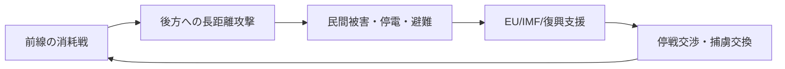

# ウクライナ・ロシア戦争の現状と戦況

## 1. エグゼクティブサマリー

2026年5月時点のウクライナ・ロシア戦争は、短期停戦の話が出ても、実態としては「前線の消耗戦」と「後方への長距離攻撃」が同時進行する段階にある。公開情報で相互確認しやすい中心戦域は、ドネツク州の Pokrovsk-Kostiantynivka 軸、北東部の Kupiansk 方向、北部の Sumy 国境地帯、そして都市・インフラを狙う無人機・ミサイル攻撃である。決定的な戦線突破は確認されておらず、局地的な前進と高い損耗が続いている。<SourceNote>[Reuters, fighting reaches outskirts of Kostiantynivka](https://www.investing.com/news/world-news/fighting-reaches-outskirts-of-ukraines-stronghold-kostiantynivka-4654763), [Reuters, Ukraine war front line and gains](https://www.investing.com/news/world-news/ukraine-war-live-russia-and-ukraine-to-hold-talks-after-brief-ceasefire-3959412), [Reuters, Sumy region attack coverage](https://uk.marketscreener.com/news/russian-missile-drone-strikes-kill-four-in-ukraine-s-northern-regions-officials-say-ce7f5adbdd8ef424).</SourceNote>

民間被害は依然として深刻で、OHCHR は 2026年4月に民間人238人死亡、1,404人負傷を確認した。これは 2025年7月以来の最悪月であり、長距離攻撃だけでなく、前線近傍のドローン・砲撃・インフラ攻撃が生活基盤を削っている。避難民もなお大規模で、UNHCR の最新公開値では、ウクライナ国外の難民は約530万人、国内避難民は約370万人である。<SourceNote>[OHCHR, Ukraine civilian casualty update](https://www.ohchr.org/en/news/2026/05/ukraine-civilian-casualty-update-april-2026), [UNHCR data portal for Ukraine](https://data.unhcr.org/en/situations/ukraine), [UNHCR, latest displacement figures](https://www.unhcr.org/us/news/briefing-notes/after-brutal-winter-millions-ukrainians-face-deepening-displacement-and).</SourceNote>

停戦交渉は、包括和平よりも限定的な人道措置に留まっている。UN は 5月9日から11日の短期停戦を歓迎したが、その後も前線の戦闘は続き、Reuters は領土問題をめぐる溝が交渉停滞の中心だと報じている。国際支援はなお大きく、EU の多年度支援、IMF の拡張信用供与、World Bank/欧州委員会/UN の再建見積もりが、戦争長期化を前提にした財政・復興支援を示している。<SourceNote>[UN Secretary-General statement on Ukraine ceasefire](https://www.un.org/sg/en/content/sg/statements/2026-05-09/statement-attributable-the-spokesperson-for-the-secretary-general-ukraine-and-the-russian-federation), [Reuters on stalled talks](https://www.reuters.com/world/europe/ukraine-russia-toughest-issue-how-to-bridge-their-gaps-in-peace-talks-2026-05-16/), [EU support loan](https://www.consilium.europa.eu/en/press/press-releases/2026/04/23/council-finalises-90-billion-support-loan-to-ukraine/), [IMF program](https://www.imf.org/en/News/Articles/2026/02/26/pr-26066-ukraine-imf-executive-board-approves-usd-8-1-billion-under-an-eff-arrangement), [World Bank RDNA5](https://www.worldbank.org/en/news/press-release/2026/02/23/updated-ukraine-recovery-and-reconstruction-needs-assessment-released).</SourceNote>

<SourceNote>本稿は、前線と軍事消耗に Reuters と公開分析、民間被害と避難は OHCHR と UNHCR、停戦交渉は UN と Reuters、国際支援は EU・IMF・World Bank の一次情報を優先して整理した。ここでの「戦況」は、ロシア国防省・ウクライナ国防省の未検証主張をそのまま採用したものではなく、相互に裏づけられる範囲に限定している。</SourceNote>

## 2. いまの戦況をどう読むか

この戦争は、単純な「占領線の前進」ではなく、前線の圧力、都市への長距離攻撃、経済・電力インフラへの打撃、そして支援と交渉の循環で動いている。したがって、1日の前進・後退だけを見るより、どの戦域で損耗が積み上がっているか、どの攻撃が民間生活に波及しているか、そして支援がどの期間をつなぐのかで理解したほうが実務的である。<SourceNote>[OHCHR civilian casualty update](https://www.ohchr.org/en/news/2026/05/ukraine-civilian-casualty-update-april-2026), [Reuters front-line reporting](https://www.investing.com/news/world-news/ukraine-war-live-russia-and-ukraine-to-hold-talks-after-brief-ceasefire-3959412), [EU/IMF/World Bank support links](https://www.consilium.europa.eu/en/press/press-releases/2026/04/23/council-finalises-90-billion-support-loan-to-ukraine/).</SourceNote>

<SourceNote>この図は、OHCHR の民間被害、Reuters の戦闘報道、EU/IMF/World Bank の支援公表を単純化したものである。図の目的は時系列ではなく「因果の循環」を示すことにある。</SourceNote>

## 3. 前線の主要地域

公開情報で最も一貫して強いのは、ドネツク州の Pokrovsk-Kostiantynivka 軸である。Reuters は、ロシア軍が Kostiantynivka に迫り、Pokrovsk 周辺が最も厳しい戦域の一つだと報じた。これは、ロシア側が広い前線で継続的に圧力をかけ、ウクライナ側が要衝都市と補給線を守る構図を示す。ここで重要なのは、「大突破」ではなく、局地的な圧迫と消耗の累積で前線がじわじわ動く点である。<SourceNote>[Reuters, fighting reaches outskirts of Kostiantynivka](https://www.investing.com/news/world-news/fighting-reaches-outskirts-of-ukraines-stronghold-kostiantynivka-4654763), [Reuters, Ukraine war live on front line pressure](https://www.investing.com/news/world-news/ukraine-war-live-russia-and-ukraine-to-hold-talks-after-brief-ceasefire-3959412).</SourceNote>

北東部では、ハルキウ州の Kupiansk 方向が引き続き前線近傍の戦域である。公開報道では、前線はドネツク州だけでなく、北東部の広い帯状地帯にまたがっており、ロシア軍の攻勢も「ほぼ全前線」に及ぶと整理されている。Kupiansk をめぐる個別の戦果主張は相互検証が難しいが、戦域としては依然として前線近傍にあり、北東部の防衛線を削る圧力が続いているとみるのが妥当である。<SourceNote>[Reuters, battles near Kupiansk](https://www.reuters.com/world/europe/battles-near-kupiansk-eastern-ukraine-exposed-endless-drone-warfare-2026-05-08/), [Reuters, front-line pressure across almost entire front](https://www.investing.com/news/world-news/ukraine-war-live-russia-and-ukraine-to-hold-talks-after-brief-ceasefire-3959412).</SourceNote>

北部の Sumy 国境地帯も、局地的な越境圧力と無人機攻撃の対象になっている。Reuters は、Sumy 周辺での戦闘や攻撃を継続的に報じており、国境線そのものを使った緩衝地帯化の試みが見える。ここは、占領の固定線というより、襲撃・浸透・反応の速い小規模戦闘が積み重なる「摩擦の帯」として見るほうが現実に近い。<SourceNote>[Reuters, northern regions attack report](https://uk.marketscreener.com/news/russian-missile-drone-strikes-kill-four-in-ukraine-s-northern-regions-officials-say-ce7f5adbdd8ef424), [Reuters, Sumy fighting coverage](https://www.reuters.com/world/europe/ukraine-russia-toughest-issue-how-to-bridge-their-gaps-in-peace-talks-2026-05-16/).</SourceNote>

| 戦域 | 公開情報から読める現状 | 確度 |
| --- | --- | --- |
| Pokrovsk-Kostiantynivka 軸 | 東部戦線で最も強い圧力。ロシア軍の接近と局地的前進が報じられる | 高 |
| ハルキウ州 Kupiansk 方向 | 前線近傍の戦域として継続。個別戦果は未検証情報が多い | 中 |
| Sumy 国境地帯 | 越境圧力と小規模戦闘が続く。緩衝地帯化の試みが見える | 中 |

<SourceNote>1行目は [Reuters, Kostiantynivka](https://www.investing.com/news/world-news/fighting-reaches-outskirts-of-ukraines-stronghold-kostiantynivka-4654763) と [Reuters, front-line pressure](https://www.investing.com/news/world-news/ukraine-war-live-russia-and-ukraine-to-hold-talks-after-brief-ceasefire-3959412) に基づく。2行目は [Reuters, battles near Kupiansk](https://www.reuters.com/world/europe/battles-near-kupiansk-eastern-ukraine-exposed-endless-drone-warfare-2026-05-08/) に基づく。3行目は [Reuters, northern regions attack report](https://uk.marketscreener.com/news/russian-missile-drone-strikes-kill-four-in-ukraine-s-northern-regions-officials-say-ce7f5adbdd8ef424) に基づく。確度は、公開ソースの密度と相互確認のしやすさを基準にした筆者評価である。</SourceNote>

## 4. 軍事的消耗

この戦争の本質は、双方が相手の戦力を一撃で崩すのではなく、補給、航空優勢、砲兵、無人機、生産能力を通じて持久力を削り合う点にある。2026年春の公開報道では、ロシアは前線圧力を維持しつつ、ウクライナは長距離無人機でロシア後方の軍需・物流拠点を叩く傾向が強まっている。つまり、戦場は前線と後方の二層構造になっている。<SourceNote>[Reuters, front-line pressure and ceasefire reporting](https://www.investing.com/news/world-news/ukraine-war-live-russia-and-ukraine-to-hold-talks-after-brief-ceasefire-3959412), [Reuters, Ukraine steps up medium-range strikes](https://www.investing.com/news/commodities-news/ukraine-steps-up-mediumrange-strikes-on-russian-forces-4658831).</SourceNote>

ウクライナ側の長距離攻撃は、前線の戦術的成果よりも、ロシアの燃料・整備・集積・防空を不安定化させる目的が大きい。Reuters は、ウクライナが4月にロシアの重要インフラへの中距離無人機攻撃を増やしたと報じた。これは、地上戦での完全な対称性がないため、後方を揺さぶって作戦テンポを落とす非対称戦の一部とみるべきである。<SourceNote>[Reuters, medium-range strikes report](https://www.investing.com/news/commodities-news/ukraine-steps-up-mediumrange-strikes-on-russian-forces-4658831).</SourceNote>

一方、ロシア側は都市へのミサイル・ドローン攻撃と、前線近傍での持続的な砲撃を組み合わせている。軍事的には、前線を「押す」ことと、ウクライナ社会の防空・電力・輸送・補修能力を「疲弊させる」ことが同時に狙われている。これは、戦術上の前進だけでは測れない消耗戦である。<SourceNote>[OHCHR, April 2026 civilian casualty update](https://www.ohchr.org/en/news/2026/05/ukraine-civilian-casualty-update-april-2026), [Reuters, northern regions strike report](https://uk.marketscreener.com/news/russian-missile-drone-strikes-kill-four-in-ukraine-s-northern-regions-officials-say-ce7f5adbdd8ef424).</SourceNote>

<SourceNote>軍事的消耗は、Reuters の前線報道と長距離無人機報道、OHCHR の民間被害報告を組み合わせて読むと分かりやすい。ここでの「非対称戦」は、双方の損耗の質が異なるという意味であり、前線の地理だけで結論づけないほうがよい。</SourceNote>

## 5. 民間被害・避難民・インフラ攻撃

民間被害は、いまも戦争の中心的コストである。OHCHR は 2026年4月の民間人被害を、死亡238人・負傷1,404人と確認した。これは 2025年7月以来の最悪月で、長距離兵器と前線近傍の攻撃が同時に民間地域へ波及していることを示す。2026年の1〜4月累計でも、被害は前年同期より高い水準で推移している。<SourceNote>[OHCHR, April 2026 update](https://www.ohchr.org/en/news/2026/05/ukraine-civilian-casualty-update-april-2026).</SourceNote>

被害の内訳で重要なのは、攻撃が単発の都市砲撃だけではないことだ。OHCHR は、エネルギー、鉄道、港湾などのインフラが繰り返し攻撃されていると説明している。これは「前線から離れた後方は安全」という前提が成り立たないことを意味し、電力、物流、輸送、医療の復旧能力そのものが軍事目標になっている。<SourceNote>[OHCHR, April 2026 update](https://www.ohchr.org/en/news/2026/05/ukraine-civilian-casualty-update-april-2026).</SourceNote>

避難の規模も大きい。UNHCR の最新公開値では、ウクライナ国外の難民は約530万人、国内避難民は約370万人である。つまり、戦争は領土争奪だけでなく、人口流出と生活基盤の再編を伴う長期危機になっている。教育、住宅、労働市場、地方財政の回復は、停戦の有無にかかわらず長い時間がかかる。<SourceNote>[UNHCR Ukraine situation portal](https://data.unhcr.org/en/situations/ukraine), [UNHCR briefing note](https://www.unhcr.org/us/news/briefing-notes/after-brutal-winter-millions-ukrainians-face-deepening-displacement-and).</SourceNote>

<SourceNote>民間被害は [OHCHR, Ukraine civilian casualties update](https://www.ohchr.org/en/news/2026/05/ukraine-civilian-casualty-update-april-2026) を起点に、避難民は [UNHCR Ukraine situation portal](https://data.unhcr.org/en/situations/ukraine) で確認した。ここでの「長期危機」は、死亡者数だけでなく、避難・復旧・再建のコストを含めた評価である。</SourceNote>

## 6. 停戦交渉の現状

停戦交渉は、全面的な和平交渉というより、限定停戦や捕虜交換に近い形で動いている。UN は 5月9日から11日の短期停戦を歓迎し、より広い停戦を求めたが、その後も戦闘は続いた。Reuters は、領土条件をめぐる不一致が依然として大きく、実質交渉は停滞していると伝えている。<SourceNote>[UN ceasefire statement](https://www.un.org/sg/en/content/sg/statements/2026-05-09/statement-attributable-the-spokesperson-for-the-secretary-general-ukraine-and-the-russian-federation), [Reuters, peace-talk gap analysis](https://www.reuters.com/world/europe/ukraine-russia-toughest-issue-how-to-bridge-their-gaps-in-peace-talks-2026-05-16/).</SourceNote>

重要なのは、交渉の論点が「停戦の有無」から「どの線で止めるか」「誰が安全保障を担保するか」に移っていることだ。領土、占領地の地位、制裁解除、復興資金、捕虜交換、安全の保証は互いに結びついており、どれか1つが解けても全体が前進するとは限らない。したがって、短期的には、包括和平よりも断片的な合意の積み上げを前提にしたほうが現実的である。<SourceNote>[Reuters, peace-talk gap analysis](https://www.reuters.com/world/europe/ukraine-russia-toughest-issue-how-to-bridge-their-gaps-in-peace-talks-2026-05-16/), [UN ceasefire statement](https://www.un.org/sg/en/content/sg/statements/2026-05-09/statement-attributable-the-spokesperson-for-the-secretary-general-ukraine-and-the-russian-federation).</SourceNote>

<SourceNote>停戦をめぐる現状は [UN Secretary-General statement](https://www.un.org/sg/en/content/sg/statements/2026-05-09/statement-attributable-the-spokesperson-for-the-secretary-general-ukraine-and-the-russian-federation) と [Reuters の交渉報道](https://www.reuters.com/world/europe/ukraine-russia-toughest-issue-how-to-bridge-their-gaps-in-peace-talks-2026-05-16/) に依拠する。ここでの「断片的な合意」は、公開情報からの推定であり、公式ロードマップではないため `公表情報からの推定` として扱う。</SourceNote>

## 7. 国際支援の現状

国際支援は、軍事支援だけでなく、財政の穴埋めと復興準備の三層で続いている。EU は Ukraine Facility の枠組みで 2026年の流動性と長期支援を供給し、Council は総額 900億ユーロ規模の支援設計を進めている。これは、戦争が長引く前提で国家機能を維持させる支援である。<SourceNote>[Council finalises 90 billion support loan](https://www.consilium.europa.eu/en/press/press-releases/2026/04/23/council-finalises-90-billion-support-loan-to-ukraine/), [European Commission, Ukraine Facility](https://commission.europa.eu/strategy-and-policy/eu-budget/eu-borrowings/ukraine-facility_en).</SourceNote>

IMF も、2026年2月に約81億ドルの拡張信用供与（EFF）を承認した。これは、戦時財政・通貨・歳入の安定化に直結する。加えて、World Bank と欧州委員会、UN、ウクライナ政府の第5次迅速損害・ニーズ評価（RDNA5）は、今後10年の復旧・再建費用を約5,880億ドルと見積もっており、戦後復興の規模がすでに国家単独では吸収しにくいことを示している。<SourceNote>[IMF, Ukraine EFF approval](https://www.imf.org/en/News/Articles/2026/02/26/pr-26066-ukraine-imf-executive-board-approves-usd-8-1-billion-under-an-eff-arrangement), [World Bank, RDNA5](https://www.worldbank.org/en/news/press-release/2026/02/23/updated-ukraine-recovery-and-reconstruction-needs-assessment-released).</SourceNote>

支援の実務的な意味は二つある。第一に、ウクライナは短期の資金繰りを国際機関と EU で持ちこたえつつ、戦時経済を維持する。第二に、支援国側は「停戦後の復興」ではなく「停戦が遅れる前提」で資金・防空・インフラ復旧を設計している。つまり、支援は戦争終結の賭けではなく、戦争長期化への保険として機能している。<SourceNote>[EU support loan](https://www.consilium.europa.eu/en/press/press-releases/2026/04/23/council-finalises-90-billion-support-loan-to-ukraine/), [IMF Ukraine program](https://www.imf.org/en/News/Articles/2026/02/26/pr-26066-ukraine-imf-executive-board-approves-usd-8-1-billion-under-an-eff-arrangement), [World Bank RDNA5](https://www.worldbank.org/en/news/press-release/2026/02/23/updated-ukraine-recovery-and-reconstruction-needs-assessment-released).</SourceNote>

<SourceNote>支援の総額と制度は [EU Ukraine Facility](https://commission.europa.eu/strategy-and-policy/eu-budget/eu-borrowings/ukraine-facility_en) 、[IMF Ukraine program](https://www.imf.org/en/News/Articles/2026/02/26/pr-26066-ukraine-imf-executive-board-approves-usd-8-1-billion-under-an-eff-arrangement) 、[World Bank RDNA5](https://www.worldbank.org/en/news/press-release/2026/02/23/updated-ukraine-recovery-and-reconstruction-needs-assessment-released) を確認した。数字は支援の「総枠」と「必要額」を示し、毎月の実際の執行額とは一致しない点に注意が必要である。</SourceNote>

## 8. 短期見通し

公表情報からの推定として、今後数か月のベースシナリオは次の3点である。

1. 東部戦線、とくに Pokrovsk-Kostiantynivka 軸で圧力が続く。
2. 後方では無人機・ミサイル攻撃が継続し、電力・交通・整備拠点への負荷が残る。
3. 停戦交渉は続いても、包括合意より限定停戦や人道措置が先行する。

この見立ての前提は、ロシアが軍事的に優位という意味ではなく、「双方とも短期で決着できる条件をまだ持っていない」ことである。ロシアは攻勢継続能力を維持しているが、決定的突破には至っていない。ウクライナは防衛と非対称攻撃で持ちこたえているが、被害の累積は大きい。したがって、最も起こりやすいのは、前線の微修正が続く一方で、民間被害と外交圧力が増幅する展開である。<SourceNote>[Reuters front-line reporting](https://www.investing.com/news/world-news/ukraine-war-live-russia-and-ukraine-to-hold-talks-after-brief-ceasefire-3959412), [OHCHR April update](https://www.ohchr.org/en/news/2026/05/ukraine-civilian-casualty-update-april-2026), [Reuters peace-talk gap analysis](https://www.reuters.com/world/europe/ukraine-russia-toughest-issue-how-to-bridge-their-gaps-in-peace-talks-2026-05-16/).</SourceNote>

<SourceNote>ここは完全な予測ではなく、公開情報を束ねた `公表情報からの推定` である。公式ロードマップは存在しないため、前線・民間被害・支援・交渉の4シグナルを同時に見るのが妥当である。</SourceNote>

## 9. 実務的な含意

日本の政策担当者と企業にとって、この戦争は「欧州の遠い戦争」ではない。少なくとも次の4つは直接の実務論点になる。

1. エネルギー・海運・保険
   - 長距離攻撃と周辺リスクで、エネルギー価格と物流保険のボラティリティが上がる。
2. 制裁・輸出管理
   - ロシア向け迂回輸出、デュアルユース部材、第三国経由取引の確認が必要になる。
3. サプライチェーン
   - 電力設備、鉄道、港湾、建設機械、ドローン対策は、復旧需要と同時に制約の影響を受ける。
4. 復興・支援ビジネス
   - 停戦前から復旧計画が走るため、建設、電力、通信、防空、医療、金融の案件は先行して準備される。

<SourceNote>これらは [OHCHR のインフラ被害](https://www.ohchr.org/en/news/2026/05/ukraine-civilian-casualty-update-april-2026)、[UNHCR の避難規模](https://data.unhcr.org/en/situations/ukraine)、[EU/IMF/World Bank の支援枠](https://www.consilium.europa.eu/en/press/press-releases/2026/04/23/council-finalises-90-billion-support-loan-to-ukraine/) を実務に落とした含意である。ここでは法的助言ではなく、政策・事業判断のためのリスク整理として扱う。</SourceNote>

## 10. リスク・限界

本稿の限界は明確である。第一に、前線の細かな位置は日々変動し、公開OSINTでも完全には追えない。第二に、当事国の発表にはプロパガンダが混じるため、単独ソースでの断定は避ける必要がある。第三に、支援総額や損害額は「承認額」「必要額」「実執行額」が異なるため、同じ数字でも意味が違う。第四に、停戦交渉は政治的な不連続性が大きく、数週間で前提が変わる可能性がある。<SourceNote>[Reuters front-line reporting](https://www.investing.com/news/world-news/ukraine-war-live-russia-and-ukraine-to-hold-talks-after-brief-ceasefire-3959412), [OHCHR April update](https://www.ohchr.org/en/news/2026/05/ukraine-civilian-casualty-update-april-2026), [EU support loan](https://www.consilium.europa.eu/en/press/press-releases/2026/04/23/council-finalises-90-billion-support-loan-to-ukraine/), [Reuters peace-talk gap analysis](https://www.reuters.com/world/europe/ukraine-russia-toughest-issue-how-to-bridge-their-gaps-in-peace-talks-2026-05-16/).</SourceNote>

<SourceNote>この節は、前節までに挙げた各公表資料の限界を統合したものだ。特に、前線は「線」ではなく「帯」、支援は「承認額」と「着金額」の差がある点を忘れないほうがよい。</SourceNote>

## 11. 参考情報

- [Reuters, Kostiantynivka report](https://www.investing.com/news/world-news/fighting-reaches-outskirts-of-ukraines-stronghold-kostiantynivka-4654763)
- [Reuters, Kupiansk report](https://www.reuters.com/world/europe/battles-near-kupiansk-eastern-ukraine-exposed-endless-drone-warfare-2026-05-08/)
- [Reuters, Sumy report](https://uk.marketscreener.com/news/russian-missile-drone-strikes-kill-four-in-ukraine-s-northern-regions-officials-say-ce7f5adbdd8ef424)
- [OHCHR, Ukraine civilian casualties update](https://www.ohchr.org/en/news/2026/05/ukraine-civilian-casualty-update-april-2026)
- [UNHCR, Ukraine situation portal](https://data.unhcr.org/en/situations/ukraine)
- [UN, ceasefire-related statement](https://www.un.org/sg/en/content/sg/statements/2026-05-09/statement-attributable-the-spokesperson-for-the-secretary-general-ukraine-and-the-russian-federation)
- [EU, Ukraine Facility](https://commission.europa.eu/strategy-and-policy/eu-budget/eu-borrowings/ukraine-facility_en)
- [IMF, Ukraine EFF approval](https://www.imf.org/en/News/Articles/2026/02/26/pr-26066-ukraine-imf-executive-board-approves-usd-8-1-billion-under-an-eff-arrangement)
- [World Bank, Ukraine RDNA5](https://www.worldbank.org/en/news/press-release/2026/02/23/updated-ukraine-recovery-and-reconstruction-needs-assessment-released)
