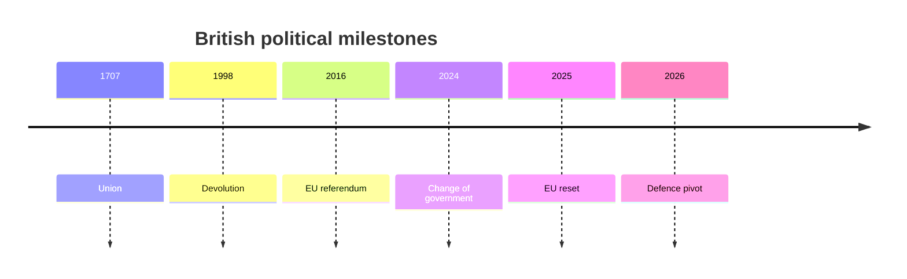

# Britain's Double Constraint

## 1. Executive Summary

Britain still carries external weight as a NATO and G7 member, a permanent member of the UN Security Council, a nuclear power, and the core of global finance in London. <SourceNote>[UK Parliament, State of the parties - House of Commons](https://members.parliament.uk/parties/commons) and [The Royal Family, The King](https://www.royal.uk/the-king) are useful entry points to the current institutional core.</SourceNote>

But the key to reading Britain in 2026 is less that status than the way post-Brexit reconnection and domestic fragmentation collide in the same political space. <SourceNote>[GOV.UK, UK-EU Summit Common Understanding](https://www.gov.uk/government/publications/ukeu-summit-key-documentation/uk-eu-summit-common-understanding-html) and the [Cabinet Office referendum feature](https://www.gov.uk/government/organisations/cabinet-office) point in that direction.</SourceNote>

In the House of Commons, Labour holds 403 seats and the Conservatives 117, giving Labour a working majority of 165. <SourceNote>[UK Parliament, State of the parties - House of Commons](https://members.parliament.uk/parties/commons) as checked on 29 June 2026.</SourceNote>

Even so, the Lords, local government, Scotland, fiscal limits, and fragmented public opinion all narrow the government's room for manoeuvre. <SourceNote>[UK Parliament, Lords membership - by peerage](https://members.parliament.uk/parties/lords/by-peerage) shows that the upper chamber works with a different balance of power.</SourceNote>

Modern Britain sits on layers of the 1707 union, 1998 devolution, the 2016 EU referendum, the 2024 change of government, and the post-2025 search for a reset with the EU. <SourceNote>[UK Parliament, Act of Union 1707](https://www.parliament.uk/about/living-heritage/evolutionofparliament/legislativescrutiny/act-of-union-1707/) and [GOV.UK, UK-EU Summit Common Understanding](https://www.gov.uk/government/publications/ukeu-summit-key-documentation/uk-eu-summit-common-understanding-html) support that reading.</SourceNote>

In Scotland in 2026, the SNP remains the largest party with 58 seats, but Reform UK and Scottish Labour are tied on 17. <SourceNote>[Scottish Parliament, Election 2026 - The result](https://www.parliament.scot/chamber-and-committees/research-prepared-for-parliament/research-briefings/2026/5/12/sb-2626) is the source.</SourceNote>

This does not mean independence has disappeared; it means it is now embedded in a new fragmentation that also includes anti-establishment voting. <SourceNote>[Scottish Parliament, Election 2026 - The result](https://www.parliament.scot/chamber-and-committees/research-prepared-for-parliament/research-briefings/2026/5/12/sb-2626) and [UK Parliament, State of the parties - House of Commons](https://members.parliament.uk/parties/commons) show fragmentation at both the national and constituent-country levels.</SourceNote>

The 2025 UK-EU Common Understanding placed the Windsor Framework, SPS, electricity markets, and security cooperation on the practical agenda for reconnection. <SourceNote>[GOV.UK, UK-EU Summit Common Understanding](https://www.gov.uk/government/publications/ukeu-summit-key-documentation/uk-eu-summit-common-understanding-html) is the basis for that summary.</SourceNote>

Britain is not trying to return to the EU; it is testing how much of the post-exit friction it can reduce. <SourceNote>[Cabinet Office referendum feature](https://www.gov.uk/government/organisations/cabinet-office) and [GOV.UK, UK-EU Summit Common Understanding](https://www.gov.uk/government/publications/ukeu-summit-key-documentation/uk-eu-summit-common-understanding-html) support that inference.</SourceNote>

In security policy, support for Ukraine, NATO, European deterrence, and industrial cooperation with allies all sit on one line. <SourceNote>[GOV.UK, PM remarks: 5 June 2026](https://www.gov.uk/government/speeches/pm-remarks-5-june-2026) supports that reading.</SourceNote>

A 5 June 2026 statement by the prime minister set out a rise in defence spending to 2.6 percent and linked a strategic review with a defence investment plan that ties equipment to jobs. <SourceNote>[GOV.UK, PM remarks: 5 June 2026](https://www.gov.uk/government/speeches/pm-remarks-5-june-2026) is the source.</SourceNote>

This sits in the broader logic of allied practical cooperation, including arrangements such as AUKUS. <SourceNote>[GOV.UK, PM remarks: 5 June 2026](https://www.gov.uk/government/speeches/pm-remarks-5-june-2026) and [GOV.UK, UK-EU Summit Common Understanding](https://www.gov.uk/government/publications/ukeu-summit-key-documentation/uk-eu-summit-common-understanding-html) support this public-information inference.</SourceNote>

At home, finance and advanced services remain strong, while migration, housing, the NHS, and real wages dominate political feeling. <SourceNote>[Bank of England, Interest rate: Bank Rate](https://www.bankofengland.co.uk/monetary-policy/the-interest-rate-bank-rate), [ONS, Labour market overview, UK: May 2026](https://www.ons.gov.uk/employmentandlabourmarket/peopleinwork/employmentandemployeetypes/bulletins/uklabourmarket/may2026), and [ONS, Private rent and house prices, UK: April 2026](https://www.ons.gov.uk/economy/inflationandpriceindices/bulletins/privaterentandhousepricesuk/april2026) show how tight the household environment remains.</SourceNote>

On 18 June 2026, the Bank of England held Bank Rate at 3.75 percent and put inflation at 2.8 percent. <SourceNote>[Bank of England, Interest rate: Bank Rate](https://www.bankofengland.co.uk/monetary-policy/the-interest-rate-bank-rate) is the source.</SourceNote>

The latest ONS release showed long-term net migration falling to 171,000 for the year to December 2025, while private rents rose 3.4 percent in the year to March 2026 and UK house prices rose 1.2 percent in the year to February 2026. <SourceNote>[ONS, Long-term international migration, provisional: year ending December 2025](https://www.ons.gov.uk/peoplepopulationandcommunity/populationandmigration/internationalmigration/bulletins/longterminternationalmigrationprovisional/yearendingdecember2025) and [ONS, Private rent and house prices, UK: April 2026](https://www.ons.gov.uk/economy/inflationandpriceindices/bulletins/privaterentandhousepricesuk/april2026) provide the figures.</SourceNote>

That means lower migration pressure does not automatically make housing costs easier. <SourceNote>[ONS, Private rent and house prices, UK: April 2026](https://www.ons.gov.uk/economy/inflationandpriceindices/bulletins/privaterentandhousepricesuk/april2026) supports that interpretation.</SourceNote>

The NHS backlog is not just a statistical line; it feeds directly into working time, local trust, and government approval. <SourceNote>[GOV.UK, Referral to treatment waiting times statistics for consultant-led elective care for April 2026](https://www.gov.uk/government/statistics/referral-to-treatment-waiting-times-statistics-for-consultant-led-elective-care-for-april-2026) is the official release to watch.</SourceNote>

The monarchy and Parliament are symbols that support British integration, but they also make the differences among the constituent nations visible. <SourceNote>[The Royal Family, The King](https://www.royal.uk/the-king) and [UK Parliament, State of the parties - House of Commons](https://members.parliament.uk/parties/commons) frame that point.</SourceNote>

British civic integration appears not as a single national sentiment, but as an overlap of class, region, generation, ethnicity, religion, and constituent-country differences. <SourceNote>[ONS, Population estimates: mid-2024](https://www.ons.gov.uk/peoplepopulationandcommunity/populationandmigration/populationestimates/bulletins/annualmidyearpopulationestimates/mid2024) and [Scottish Parliament, Election 2026 - The result](https://www.parliament.scot/chamber-and-committees/research-prepared-for-parliament/research-briefings/2026/5/12/sb-2626) make that easier to see.</SourceNote>

From Japan's perspective, Britain is not just one European market but an ally where sanctions, finance, shipping, defence, and rule-setting intersect. <SourceNote>[GOV.UK, UK-EU Summit Common Understanding](https://www.gov.uk/government/publications/ukeu-summit-key-documentation/uk-eu-summit-common-understanding-html) and [GOV.UK, PM remarks: 5 June 2026](https://www.gov.uk/government/speeches/pm-remarks-5-june-2026) are the main official references.</SourceNote>

Japanese firms should therefore read Britain not only as an entry point to the EU, but as an institutional node connecting NATO, European security, and the Indo-Pacific. <SourceNote>[GOV.UK, PM remarks: 5 June 2026](https://www.gov.uk/government/speeches/pm-remarks-5-june-2026) supports this public-information inference.</SourceNote>

The watch points in this country profile are the pace of EU reconnection, the reorganisation of Scottish politics, the execution of defence investment, and the extent to which cost-of-living pressure eases. <SourceNote>[GOV.UK, UK-EU Summit Common Understanding](https://www.gov.uk/government/publications/ukeu-summit-key-documentation/uk-eu-summit-common-understanding-html), [Scottish Parliament, Election 2026 - The result](https://www.parliament.scot/chamber-and-committees/research-prepared-for-parliament/research-briefings/2026/5/12/sb-2626), [GOV.UK, PM remarks: 5 June 2026](https://www.gov.uk/government/speeches/pm-remarks-5-june-2026), and [Bank of England, Interest rate: Bank Rate](https://www.bankofengland.co.uk/monetary-policy/the-interest-rate-bank-rate) support that list.</SourceNote>

## 2. Historical and Institutional Core

Britain's international politics is best understood as the product of empire, industrial revolution, two world wars, decolonisation, European integration, the Northern Ireland peace process, and Brexit layered on top of one another. <SourceNote>[UK Parliament, Act of Union 1707](https://www.parliament.uk/about/living-heritage/evolutionofparliament/legislativescrutiny/act-of-union-1707/) and the [Cabinet Office referendum feature](https://www.gov.uk/government/organisations/cabinet-office) help anchor that history.</SourceNote>

Britain's system is not built on a single codified constitution; it layers parliamentary sovereignty, the Crown, the courts, devolution, convention, and treaty practice. <SourceNote>[The Royal Family, The King](https://www.royal.uk/the-king) and [UK Parliament, Lords membership - by peerage](https://members.parliament.uk/parties/lords/by-peerage) are enough to see that architecture.</SourceNote>

That means a prime minister can set direction, but the Lords, courts, local government, constituent-country governments, and civil service all reshape the speed of implementation. <SourceNote>[UK Parliament, Lords membership - by peerage](https://members.parliament.uk/parties/lords/by-peerage) and [UK Parliament, State of the parties - House of Commons](https://members.parliament.uk/parties/commons) support that structural reading.</SourceNote>

## 3. Power Map

In the House of Commons, Labour has 403 seats, the Conservatives 117, the Liberal Democrats 71, Reform UK 8, and the SNP 8. <SourceNote>[UK Parliament, State of the parties - House of Commons](https://members.parliament.uk/parties/commons) as checked on 29 June 2026.</SourceNote>

Those numbers make the government look secure, but British politics is more complicated in practice. <SourceNote>[UK Parliament, State of the parties - House of Commons](https://members.parliament.uk/parties/commons) and [UK Parliament, Lords membership - by peerage](https://members.parliament.uk/parties/lords/by-peerage) need to be read together.</SourceNote>

The Lords contains a large crossbench and non-affiliated bloc, so government bills are often revised and delayed. <SourceNote>[UK Parliament, Lords membership - by peerage](https://members.parliament.uk/parties/lords/by-peerage) is the source.</SourceNote>

| Actor | Role | Reading |
| --- | --- | --- |
| Prime Minister and Cabinet Office | The centre of external strategy and fiscal control | They can set direction, but implementation depends on Parliament and the bureaucracy |
| Commons majority | The base for legislation and budgets | Even a large majority wears down quickly when public opinion splits |
| Lords | A chamber for revision and delay | It absorbs rough edges, but also raises the political cost |
| Scotland | Constituent-country politics | It now includes independence politics and anti-establishment voting |
| The monarchy | Symbolic integration | It does not make policy, but it expresses state continuity |

Scottish politics in 2026 places independence politics inside a more unstable party landscape. <SourceNote>[Scottish Parliament, Election 2026 - The result](https://www.parliament.scot/chamber-and-committees/research-prepared-for-parliament/research-briefings/2026/5/12/sb-2626) is the source.</SourceNote>

## 4. External Strategy

Britain's external strategy is built between the EU, NATO, the United States, Ireland, Ukraine, and a limited but important Indo-Pacific engagement. <SourceNote>[GOV.UK, UK-EU Summit Common Understanding](https://www.gov.uk/government/publications/ukeu-summit-key-documentation/uk-eu-summit-common-understanding-html) and [GOV.UK, PM remarks: 5 June 2026](https://www.gov.uk/government/speeches/pm-remarks-5-june-2026) support that framing.</SourceNote>

| Partner or area | Current reading |
| --- | --- |
| EU | Lower friction and selective reconnection, not re-entry |
| NATO | A continuing base for European deterrence |
| Ukraine | A junction for sanctions, support, training, and industrial cooperation |
| Ireland and Northern Ireland | A space where trade, border management, peace, and institutional design intersect |
| AUKUS and the Indo-Pacific | On the public record, best read as an extension of allied practice and advanced defence industry cooperation |

The 2025 UK-EU Common Understanding lists the Windsor Framework, SPS, electricity markets, and security cooperation, which shows Britain trying to manage the friction of exit. <SourceNote>[GOV.UK, UK-EU Summit Common Understanding](https://www.gov.uk/government/publications/ukeu-summit-key-documentation/uk-eu-summit-common-understanding-html) is the basis for that summary.</SourceNote>

A 5 June 2026 statement by the prime minister made clear that defence spending would rise, that a strategic review would follow, and that a defence investment plan would connect equipment with jobs. <SourceNote>[GOV.UK, PM remarks: 5 June 2026](https://www.gov.uk/government/speeches/pm-remarks-5-june-2026) is the source.</SourceNote>

This flow sits in the wider logic of allied practical cooperation, including arrangements such as AUKUS. <SourceNote>[GOV.UK, PM remarks: 5 June 2026](https://www.gov.uk/government/speeches/pm-remarks-5-june-2026) and [GOV.UK, UK-EU Summit Common Understanding](https://www.gov.uk/government/publications/ukeu-summit-key-documentation/uk-eu-summit-common-understanding-html) support this public-information inference.</SourceNote>

## 5. Domestic Pressure

At home, finance and advanced services remain strong, while migration, housing, the NHS, and real wages dominate political feeling. <SourceNote>[Bank of England, Interest rate: Bank Rate](https://www.bankofengland.co.uk/monetary-policy/the-interest-rate-bank-rate), [ONS, Labour market overview, UK: May 2026](https://www.ons.gov.uk/employmentandlabourmarket/peopleinwork/employmentandemployeetypes/bulletins/uklabourmarket/may2026), and [ONS, Private rent and house prices, UK: April 2026](https://www.ons.gov.uk/economy/inflationandpriceindices/bulletins/privaterentandhousepricesuk/april2026) make that clear.</SourceNote>

On 18 June 2026, the Bank of England held Bank Rate at 3.75 percent and put inflation at 2.8 percent. <SourceNote>[Bank of England, Interest rate: Bank Rate](https://www.bankofengland.co.uk/monetary-policy/the-interest-rate-bank-rate) is the source.</SourceNote>

The latest ONS release showed long-term net migration falling to 171,000 for the year to December 2025, while private rents rose 3.4 percent in the year to March 2026 and UK house prices rose 1.2 percent in the year to February 2026. <SourceNote>[ONS, Long-term international migration, provisional: year ending December 2025](https://www.ons.gov.uk/peoplepopulationandcommunity/populationandmigration/internationalmigration/bulletins/longterminternationalmigrationprovisional/yearendingdecember2025) and [ONS, Private rent and house prices, UK: April 2026](https://www.ons.gov.uk/economy/inflationandpriceindices/bulletins/privaterentandhousepricesuk/april2026) provide the figures.</SourceNote>

That means lower migration pressure does not automatically make housing costs easier. <SourceNote>[ONS, Private rent and house prices, UK: April 2026](https://www.ons.gov.uk/economy/inflationandpriceindices/bulletins/privaterentandhousepricesuk/april2026) supports that interpretation.</SourceNote>

The NHS backlog is not just a statistical line; it feeds directly into working time, local trust, and government approval. <SourceNote>[GOV.UK, Referral to treatment waiting times statistics for consultant-led elective care for April 2026](https://www.gov.uk/government/statistics/referral-to-treatment-waiting-times-statistics-for-consultant-led-elective-care-for-april-2026) is the official release to watch.</SourceNote>

## 6. Civic Integration

The monarchy and Parliament are symbols that support British integration, but they also make the differences among the constituent nations visible. <SourceNote>[The Royal Family, The King](https://www.royal.uk/the-king) and [UK Parliament, State of the parties - House of Commons](https://members.parliament.uk/parties/commons) frame that point.</SourceNote>

British civic integration appears not as a single national sentiment, but as an overlap of class, region, generation, ethnicity, religion, and constituent-country differences. <SourceNote>[ONS, Population estimates: mid-2024](https://www.ons.gov.uk/peoplepopulationandcommunity/populationandmigration/populationestimates/bulletins/annualmidyearpopulationestimates/mid2024) and [Scottish Parliament, Election 2026 - The result](https://www.parliament.scot/chamber-and-committees/research-prepared-for-parliament/research-briefings/2026/5/12/sb-2626) make that easier to see.</SourceNote>

The media sphere remains central, but it also amplifies the differences of region, class, migration, and generation rather than dissolving them. <SourceNote>This sentence is a synthesis, not a direct statistic.</SourceNote>

## 7. Implications for Japan and East Asia

From Japan's perspective, Britain is not just one European market but an ally where sanctions, finance, shipping, defence, and rule-setting intersect. <SourceNote>[GOV.UK, UK-EU Summit Common Understanding](https://www.gov.uk/government/publications/ukeu-summit-key-documentation/uk-eu-summit-common-understanding-html) and [GOV.UK, PM remarks: 5 June 2026](https://www.gov.uk/government/speeches/pm-remarks-5-june-2026) are the main official references.</SourceNote>

Japanese firms should therefore read Britain not only as an entry point to the EU, but as an institutional node connecting NATO, European security, and the Indo-Pacific. <SourceNote>[GOV.UK, PM remarks: 5 June 2026](https://www.gov.uk/government/speeches/pm-remarks-5-june-2026) supports this public-information inference.</SourceNote>

Britain's finance and legal practices also reach East Asian firms through funding, sanctions, M&A, insurance, shipping, data, and intellectual property channels. <SourceNote>[Bank of England, Interest rate: Bank Rate](https://www.bankofengland.co.uk/monetary-policy/the-interest-rate-bank-rate) and [GOV.UK, UK-EU Summit Common Understanding](https://www.gov.uk/government/publications/ukeu-summit-key-documentation/uk-eu-summit-common-understanding-html) support that structural reading.</SourceNote>

## 8. Risks and Watch Points

The watch points in this country profile are the pace of EU reconnection, the reorganisation of Scottish politics, the execution of defence investment, and the extent to which cost-of-living pressure eases. <SourceNote>[GOV.UK, UK-EU Summit Common Understanding](https://www.gov.uk/government/publications/ukeu-summit-key-documentation/uk-eu-summit-common-understanding-html), [Scottish Parliament, Election 2026 - The result](https://www.parliament.scot/chamber-and-committees/research-prepared-for-parliament/research-briefings/2026/5/12/sb-2626), [GOV.UK, PM remarks: 5 June 2026](https://www.gov.uk/government/speeches/pm-remarks-5-june-2026), and [Bank of England, Interest rate: Bank Rate](https://www.bankofengland.co.uk/monetary-policy/the-interest-rate-bank-rate) support that list.</SourceNote>

Britain is a country that still carries a global strategy while continuing to pay the cost of domestic integration. <SourceNote>[UK Parliament, State of the parties - House of Commons](https://members.parliament.uk/parties/commons) and [UK Parliament, Lords membership - by peerage](https://members.parliament.uk/parties/lords/by-peerage) summarise the institutional structure behind that statement.</SourceNote>

Once that double constraint is visible, British news reads less like the story of a great power and more like the management of friction required to remain one. <SourceNote>This is a synthesis of the public information above.</SourceNote>

## References

- [UK Parliament, State of the parties - House of Commons](https://members.parliament.uk/parties/commons)
- [UK Parliament, Lords membership - by peerage](https://members.parliament.uk/parties/lords/by-peerage)
- [Cabinet Office referendum feature](https://www.gov.uk/government/organisations/cabinet-office)
- [GOV.UK, UK-EU Summit Common Understanding](https://www.gov.uk/government/publications/ukeu-summit-key-documentation/uk-eu-summit-common-understanding-html)
- [GOV.UK, PM remarks: 5 June 2026](https://www.gov.uk/government/speeches/pm-remarks-5-june-2026)
- [Bank of England, Interest rate: Bank Rate](https://www.bankofengland.co.uk/monetary-policy/the-interest-rate-bank-rate)
- [ONS, Long-term international migration, provisional: year ending December 2025](https://www.ons.gov.uk/peoplepopulationandcommunity/populationandmigration/internationalmigration/bulletins/longterminternationalmigrationprovisional/yearendingdecember2025)
- [ONS, Private rent and house prices, UK: April 2026](https://www.ons.gov.uk/economy/inflationandpriceindices/bulletins/privaterentandhousepricesuk/april2026)
- [GOV.UK, Referral to treatment waiting times statistics for consultant-led elective care for April 2026](https://www.gov.uk/government/statistics/referral-to-treatment-waiting-times-statistics-for-consultant-led-elective-care-for-april-2026)
- [Scottish Parliament, Election 2026 - The result](https://www.parliament.scot/chamber-and-committees/research-prepared-for-parliament/research-briefings/2026/5/12/sb-2626)
- [The Royal Family, The King](https://www.royal.uk/the-king)
