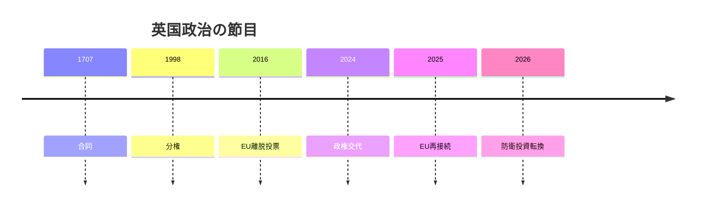

# 島国の大国、英国の二重拘束

## 1. エグゼクティブサマリー

英国は、NATO、G7、国連安保理常任理事国、核保有国、ロンドン金融の中心として、まだ外向きの重みを保っている。<SourceNote>[UK Parliament, State of the parties - House of Commons](https://members.parliament.uk/parties/commons) と [The Royal Family, The King](https://www.royal.uk/the-king) は、現在の制度の核を確認できる入口になる。</SourceNote>

だが2026年の英国を読む鍵は、そうした地位よりも、Brexit後の再接続と国内の分断が同じ政治空間でぶつかっている点にある。<SourceNote>[GOV.UK, UK-EU Summit Common Understanding](https://www.gov.uk/government/publications/ukeu-summit-key-documentation/uk-eu-summit-common-understanding-html) と [Cabinet Office, 10th anniversary of the referendum feature](https://www.gov.uk/government/organisations/cabinet-office) を参照した。</SourceNote>

下院ではLabourが403議席、Conservativeが117議席で、労働党は作業多数165を持つ。<SourceNote>[UK Parliament, State of the parties - House of Commons](https://members.parliament.uk/parties/commons) に基づく 2026年6月29日確認値。</SourceNote>

それでも上院、地方、スコットランド、財政制約、世論の断片化が、政府の射程を細かく削る。<SourceNote>[UK Parliament, Lords membership - by peerage](https://members.parliament.uk/parties/lords/by-peerage) は、上院が下院とは別の力学で動くことを示している。</SourceNote>

英国の現在は、1707年の合同、1998年の分権、2016年のEU離脱投票、2024年の政権交代、2025年以降のEU再接続の模索を重ねた上にある。<SourceNote>[UK Parliament, Act of Union 1707](https://www.parliament.uk/about/living-heritage/evolutionofparliament/legislativescrutiny/act-of-union-1707/) と [GOV.UK, UK-EU Summit Common Understanding](https://www.gov.uk/government/publications/ukeu-summit-key-documentation/uk-eu-summit-common-understanding-html) を参照した。</SourceNote>

2026年時点のスコットランドでは、SNPが58議席で最大党だが、Reform UKとScottish Labourが17議席で並ぶ。<SourceNote>[Scottish Parliament, Election 2026 - The result](https://www.parliament.scot/chamber-and-committees/research-prepared-for-parliament/research-briefings/2026/5/12/sb-2626) を参照した。</SourceNote>

これは独立論が消えたのではなく、反エスタブリッシュメント票を含む新しい断片化に埋め込まれたことを意味する。<SourceNote>[Scottish Parliament, Election 2026 - The result](https://www.parliament.scot/chamber-and-committees/research-prepared-for-parliament/research-briefings/2026/5/12/sb-2626) と [UK Parliament, State of the parties - House of Commons](https://members.parliament.uk/parties/commons) を合わせると、英国政治の断片化は国政と構成国の両方で進んでいる。</SourceNote>

2025年のUK-EU Common Understandingは、Windsor Framework、SPS、電力市場、治安協力を再接続の実務課題として並べた。<SourceNote>[GOV.UK, UK-EU Summit Common Understanding](https://www.gov.uk/government/publications/ukeu-summit-key-documentation/uk-eu-summit-common-understanding-html) に基づく。</SourceNote>

英国はEUに戻ろうとしているのではなく、離脱後の摩擦をどこまで減らせるかを探っている。<SourceNote>[Cabinet Office, 10th anniversary of the referendum feature](https://www.gov.uk/government/organisations/cabinet-office) と [GOV.UK, UK-EU Summit Common Understanding](https://www.gov.uk/government/publications/ukeu-summit-key-documentation/uk-eu-summit-common-understanding-html) を踏まえた公開情報からの推定である。</SourceNote>

安全保障では、対ウクライナ支援、NATO、欧州の抑止、そして同盟国との産業協力が一本の線でつながる。<SourceNote>[GOV.UK, PM remarks: 5 June 2026](https://www.gov.uk/government/speeches/pm-remarks-5-june-2026) を参照した。</SourceNote>

2026年6月5日の首相発言は、防衛費を2.6%へ引き上げ、戦略見直しと防衛投資計画で装備と雇用を結ぶ方針を示した。<SourceNote>[GOV.UK, PM remarks: 5 June 2026](https://www.gov.uk/government/speeches/pm-remarks-5-june-2026) に基づく。</SourceNote>

これはAUKUSのような高度防衛産業協力を含む広い同盟実務の文脈にある。<SourceNote>[GOV.UK, PM remarks: 5 June 2026](https://www.gov.uk/government/speeches/pm-remarks-5-june-2026) と [GOV.UK, UK-EU Summit Common Understanding](https://www.gov.uk/government/publications/ukeu-summit-key-documentation/uk-eu-summit-common-understanding-html) からの公表情報を踏まえた推定である。</SourceNote>

国内では、金融と高度サービスが強い一方、移民、住宅、NHS、実質賃金が政治感情を支配する。<SourceNote>[Bank of England, Interest rate: Bank Rate](https://www.bankofengland.co.uk/monetary-policy/the-interest-rate-bank-rate) と [ONS, Labour market overview, UK: May 2026](https://www.ons.gov.uk/employmentandlabourmarket/peopleinwork/employmentandemployeetypes/bulletins/uklabourmarket/may2026) を合わせて読むと、金融条件と家計環境の双方が重い。</SourceNote>

Bank of Englandは2026年6月18日にBank Rateを3.75%で据え置き、インフレ率を2.8%と示した。<SourceNote>[Bank of England, Interest rate: Bank Rate](https://www.bankofengland.co.uk/monetary-policy/the-interest-rate-bank-rate) に基づく。</SourceNote>

ONSの最新公表では、2025年末までの長期純移民は171,000人に下がったが、賃料は2026年3月までの1年で3.4%上がり、英国住宅価格は2026年2月までの1年で1.2%上がった。<SourceNote>[ONS, Long-term international migration, provisional: year ending December 2025](https://www.ons.gov.uk/peoplepopulationandcommunity/populationandmigration/internationalmigration/bulletins/longterminternationalmigrationprovisional/yearendingdecember2025) と [ONS, Private rent and house prices, UK: April 2026](https://www.ons.gov.uk/economy/inflationandpriceindices/bulletins/privaterentandhousepricesuk/april2026) に基づく。</SourceNote>

つまり、移民圧力が弱まっても、住まいの負担はほとんど自動的には下がらない。<SourceNote>[ONS, Private rent and house prices, UK: April 2026](https://www.ons.gov.uk/economy/inflationandpriceindices/bulletins/privaterentandhousepricesuk/april2026) を踏まえた解釈である。</SourceNote>

NHSの待機問題は、統計の一項目ではなく、働く時間、地域の信頼、政権評価に直結する。<SourceNote>[GOV.UK, Referral to treatment waiting times statistics for consultant-led elective care for April 2026](https://www.gov.uk/government/statistics/referral-to-treatment-waiting-times-statistics-for-consultant-led-elective-care-for-april-2026) を参照した。</SourceNote>

王室と議会は、英国の統合を支える象徴であると同時に、構成国の差異を見えやすくする装置でもある。<SourceNote>[The Royal Family, The King](https://www.royal.uk/the-king) と [UK Parliament, State of the parties - House of Commons](https://members.parliament.uk/parties/commons) を参照した。</SourceNote>

英国の市民統合は、単一の国民感情ではなく、階級、地域、世代、民族、宗教、そして構成国ごとの差の重なりとして現れる。<SourceNote>[ONS, Population estimates: mid-2024](https://www.ons.gov.uk/peoplepopulationandcommunity/populationandmigration/populationestimates/bulletins/annualmidyearpopulationestimates/mid2024) と [Scottish Parliament, Election 2026 - The result](https://www.parliament.scot/chamber-and-committees/research-prepared-for-parliament/research-briefings/2026/5/12/sb-2626) を踏まえた観察である。</SourceNote>

日本から見ると、英国は欧州の一市場ではなく、制裁、金融、海運、防衛、ルール形成が交差する同盟国である。<SourceNote>[GOV.UK, UK-EU Summit Common Understanding](https://www.gov.uk/government/publications/ukeu-summit-key-documentation/uk-eu-summit-common-understanding-html) と [GOV.UK, PM remarks: 5 June 2026](https://www.gov.uk/government/speeches/pm-remarks-5-june-2026) を参照した。</SourceNote>

したがって、日本企業は英国をEUの入口としてだけでなく、NATOと対欧州安全保障、そしてインド太平洋に接続する制度ノードとして読むべきだ。<SourceNote>[GOV.UK, PM remarks: 5 June 2026](https://www.gov.uk/government/speeches/pm-remarks-5-june-2026) を踏まえた公表情報からの推定である。</SourceNote>

この国別プロファイルの注視点は、EU再接続の速度、スコットランド政治の再編、防衛投資の実装、そして生活費圧力がどこまで和らぐかである。<SourceNote>[GOV.UK, UK-EU Summit Common Understanding](https://www.gov.uk/government/publications/ukeu-summit-key-documentation/uk-eu-summit-common-understanding-html)、[Scottish Parliament, Election 2026 - The result](https://www.parliament.scot/chamber-and-committees/research-prepared-for-parliament/research-briefings/2026/5/12/sb-2626)、[GOV.UK, PM remarks: 5 June 2026](https://www.gov.uk/government/speeches/pm-remarks-5-june-2026)、[Bank of England, Interest rate: Bank Rate](https://www.bankofengland.co.uk/monetary-policy/the-interest-rate-bank-rate) を参照した。</SourceNote>

## 2. 歴史と制度の骨格

英国の国際政治は、帝国、産業革命、二度の世界大戦、脱植民地化、欧州統合、北アイルランド和平、Brexitを重ねた結果として理解するのがよい。<SourceNote>[UK Parliament, Act of Union 1707](https://www.parliament.uk/about/living-heritage/evolutionofparliament/legislativescrutiny/act-of-union-1707/) と [Cabinet Office, 10th anniversary of the referendum feature](https://www.gov.uk/government/organisations/cabinet-office) に基づく。</SourceNote>

英国の制度は、成文憲法一枚ではなく、議会主権、王室、司法、分権、慣行、条約が重なっている。<SourceNote>[The Royal Family, The King](https://www.royal.uk/the-king) と [UK Parliament, Lords membership - by peerage](https://members.parliament.uk/parties/lords/by-peerage) を参照した。</SourceNote>

そのため、首相が方針を変えても、上院、裁判所、地方政府、構成国政府、官僚機構、条約実務が実装速度を変える。<SourceNote>[UK Parliament, Lords membership - by peerage](https://members.parliament.uk/parties/lords/by-peerage) と [UK Parliament, State of the parties - House of Commons](https://members.parliament.uk/parties/commons) を踏まえた構造的観察である。</SourceNote>

## 3. 権力配置

下院ではLabourが403議席、Conservativeが117議席、Liberal Democratが71議席、Reform UKが8議席、SNPが8議席である。<SourceNote>[UK Parliament, State of the parties - House of Commons](https://members.parliament.uk/parties/commons) に基づく 2026年6月29日確認値。</SourceNote>

この数字だけを見ると政権は安定して見えるが、英国政治の実務はそれほど単純ではない。<SourceNote>[UK Parliament, State of the parties - House of Commons](https://members.parliament.uk/parties/commons) と [UK Parliament, Lords membership - by peerage](https://members.parliament.uk/parties/lords/by-peerage) を合わせて読む必要がある。</SourceNote>

上院にはCrossbenchと非所属の大きな塊があり、政府法案はしばしば修正と遅延を受ける。<SourceNote>[UK Parliament, Lords membership - by peerage](https://members.parliament.uk/parties/lords/by-peerage) に基づく。</SourceNote>

| アクター | 役割 | 読み方 |
| --- | --- | --- |
| 首相官邸と内閣 | 対外戦略と財政の中枢 | 方向は出せるが、実装は議会と官庁に依存する |
| 下院多数 | 法案と予算の基盤 | 大きい多数でも、世論が割れると摩耗が速い |
| 上院 | 修正と遅延の装置 | 政策の粗さを吸収するが、政治的負担も増やす |
| スコットランド | 構成国の分権政治 | 独立論だけでなく、反エスタブリッシュメント票を含む |
| 王室 | 象徴的統合 | 政策決定者ではないが、国家連続性の表現になる |

2026年のスコットランド政治は、独立論と分権政治が、より不安定な党派配置の中に置かれている。<SourceNote>[Scottish Parliament, Election 2026 - The result](https://www.parliament.scot/chamber-and-committees/research-prepared-for-parliament/research-briefings/2026/5/12/sb-2626) を参照した。</SourceNote>

## 4. 対外戦略

英国の対外戦略は、EU、NATO、米国、アイルランド、ウクライナ、そして限定的だが重要なインド太平洋関与のあいだで組み立てられている。<SourceNote>[GOV.UK, UK-EU Summit Common Understanding](https://www.gov.uk/government/publications/ukeu-summit-key-documentation/uk-eu-summit-common-understanding-html) と [GOV.UK, PM remarks: 5 June 2026](https://www.gov.uk/government/speeches/pm-remarks-5-june-2026) を参照した。</SourceNote>

| 相手・領域 | 現在の読み方 |
| --- | --- |
| EU | 再加盟ではなく、摩擦の低減と選択的再接続 |
| NATO | 欧州抑止の中核であり続ける基盤 |
| ウクライナ | 制裁、支援、訓練、産業協力の結節点 |
| アイルランドと北アイルランド | 貿易、国境、平和、制度設計が交差する領域 |
| AUKUSとインド太平洋 | 公表情報からは、同盟実務と先端防衛産業の延長として読むのが妥当 |

2025年のUK-EU Common Understandingは、Windsor Framework、SPS、電力市場、治安協力を並べており、英国が離脱後の摩擦管理を進めていることを示す。<SourceNote>[GOV.UK, UK-EU Summit Common Understanding](https://www.gov.uk/government/publications/ukeu-summit-key-documentation/uk-eu-summit-common-understanding-html) に基づく。</SourceNote>

2026年6月5日の首相発言は、防衛費の引き上げ、戦略見直し、防衛投資計画を通じて、装備と雇用をつなぐ方針を明確にした。<SourceNote>[GOV.UK, PM remarks: 5 June 2026](https://www.gov.uk/government/speeches/pm-remarks-5-june-2026) に基づく。</SourceNote>

この流れは、AUKUSのような高度防衛産業協力を含む同盟実務の広い文脈にある。<SourceNote>[GOV.UK, PM remarks: 5 June 2026](https://www.gov.uk/government/speeches/pm-remarks-5-june-2026) と [GOV.UK, UK-EU Summit Common Understanding](https://www.gov.uk/government/publications/ukeu-summit-key-documentation/uk-eu-summit-common-understanding-html) を踏まえた公表情報からの推定である。</SourceNote>

## 5. 国内圧力

国内では、金融と高度サービスが強い一方、移民、住宅、NHS、実質賃金が政治感情を支配する。<SourceNote>[Bank of England, Interest rate: Bank Rate](https://www.bankofengland.co.uk/monetary-policy/the-interest-rate-bank-rate)、[ONS, Labour market overview, UK: May 2026](https://www.ons.gov.uk/employmentandlabourmarket/peopleinwork/employmentandemployeetypes/bulletins/uklabourmarket/may2026)、[ONS, Private rent and house prices, UK: April 2026](https://www.ons.gov.uk/economy/inflationandpriceindices/bulletins/privaterentandhousepricesuk/april2026) を合わせて読むと、家計の圧力が見えやすい。</SourceNote>

Bank of Englandは2026年6月18日にBank Rateを3.75%で据え置き、インフレ率を2.8%と示した。<SourceNote>[Bank of England, Interest rate: Bank Rate](https://www.bankofengland.co.uk/monetary-policy/the-interest-rate-bank-rate) に基づく。</SourceNote>

ONSの最新公表では、2025年末までの長期純移民は171,000人に下がったが、賃料は2026年3月までの1年で3.4%上がり、英国住宅価格は2026年2月までの1年で1.2%上がった。<SourceNote>[ONS, Long-term international migration, provisional: year ending December 2025](https://www.ons.gov.uk/peoplepopulationandcommunity/populationandmigration/internationalmigration/bulletins/longterminternationalmigrationprovisional/yearendingdecember2025) と [ONS, Private rent and house prices, UK: April 2026](https://www.ons.gov.uk/economy/inflationandpriceindices/bulletins/privaterentandhousepricesuk/april2026) に基づく。</SourceNote>

つまり、移民圧力が弱まっても、住まいの負担はほとんど自動的には下がらない。<SourceNote>[ONS, Private rent and house prices, UK: April 2026](https://www.ons.gov.uk/economy/inflationandpriceindices/bulletins/privaterentandhousepricesuk/april2026) を踏まえた解釈である。</SourceNote>

NHSの待機問題は、統計の一項目ではなく、働く時間、地域の信頼、政権評価に直結する。<SourceNote>[GOV.UK, Referral to treatment waiting times statistics for consultant-led elective care for April 2026](https://www.gov.uk/government/statistics/referral-to-treatment-waiting-times-statistics-for-consultant-led-elective-care-for-april-2026) を参照した。</SourceNote>

## 6. 市民統合

王室と議会は、英国の統合を支える象徴であると同時に、構成国の差異を見えやすくする装置でもある。<SourceNote>[The Royal Family, The King](https://www.royal.uk/the-king) と [UK Parliament, State of the parties - House of Commons](https://members.parliament.uk/parties/commons) を参照した。</SourceNote>

英国の市民統合は、単一の国民感情ではなく、階級、地域、世代、民族、宗教、そして構成国ごとの差の重なりとして現れる。<SourceNote>[ONS, Population estimates: mid-2024](https://www.ons.gov.uk/peoplepopulationandcommunity/populationandmigration/populationestimates/bulletins/annualmidyearpopulationestimates/mid2024) と [Scottish Parliament, Election 2026 - The result](https://www.parliament.scot/chamber-and-committees/research-prepared-for-parliament/research-briefings/2026/5/12/sb-2626) を踏まえた観察である。</SourceNote>

メディアの中心性はなお高いが、それは統合の装置であると同時に、地方、階級、移民、世代の差を増幅する装置でもある。<SourceNote>この文は公表統計の直接集計ではなく、上記の制度構造と世論環境からの整理である。</SourceNote>

## 7. 日本・東アジアへの含意

日本から見ると、英国は欧州の一市場ではなく、制裁、金融、海運、防衛、ルール形成が交差する同盟国である。<SourceNote>[GOV.UK, UK-EU Summit Common Understanding](https://www.gov.uk/government/publications/ukeu-summit-key-documentation/uk-eu-summit-common-understanding-html) と [GOV.UK, PM remarks: 5 June 2026](https://www.gov.uk/government/speeches/pm-remarks-5-june-2026) を参照した。</SourceNote>

したがって、日本企業は英国をEUの入口としてだけでなく、NATOと対欧州安全保障、そしてインド太平洋に接続する制度ノードとして読むべきだ。<SourceNote>[GOV.UK, PM remarks: 5 June 2026](https://www.gov.uk/government/speeches/pm-remarks-5-june-2026) を踏まえた公表情報からの推定である。</SourceNote>

英国の金融と法律実務は、資金調達、制裁、M&A、保険、海運、データ、知財の回路を通じて東アジア企業にも届く。<SourceNote>[Bank of England, Interest rate: Bank Rate](https://www.bankofengland.co.uk/monetary-policy/the-interest-rate-bank-rate) と [GOV.UK, UK-EU Summit Common Understanding](https://www.gov.uk/government/publications/ukeu-summit-key-documentation/uk-eu-summit-common-understanding-html) を合わせた構造的読解である。</SourceNote>

## 8. リスクと注視点

この国別プロファイルの注視点は、EU再接続の速度、スコットランド政治の再編、防衛投資の実装、そして生活費圧力がどこまで和らぐかである。<SourceNote>[GOV.UK, UK-EU Summit Common Understanding](https://www.gov.uk/government/publications/ukeu-summit-key-documentation/uk-eu-summit-common-understanding-html)、[Scottish Parliament, Election 2026 - The result](https://www.parliament.scot/chamber-and-committees/research-prepared-for-parliament/research-briefings/2026/5/12/sb-2626)、[GOV.UK, PM remarks: 5 June 2026](https://www.gov.uk/government/speeches/pm-remarks-5-june-2026)、[Bank of England, Interest rate: Bank Rate](https://www.bankofengland.co.uk/monetary-policy/the-interest-rate-bank-rate) を参照した。</SourceNote>

英国は、世界戦略を持ちながら、国内の統合コストを支払い続ける国である。<SourceNote>[UK Parliament, State of the parties - House of Commons](https://members.parliament.uk/parties/commons) と [UK Parliament, Lords membership - by peerage](https://members.parliament.uk/parties/lords/by-peerage) から見える制度構造を要約した表現である。</SourceNote>

その二重拘束を押さえると、英国のニュースは「大国の話」ではなく、「大国であり続けるための摩擦管理」として読める。<SourceNote>これは上記の公表情報を統合した解釈である。</SourceNote>

## 参考情報

- [UK Parliament, State of the parties - House of Commons](https://members.parliament.uk/parties/commons)
- [UK Parliament, Lords membership - by peerage](https://members.parliament.uk/parties/lords/by-peerage)
- [Cabinet Office, 10th anniversary of the referendum feature](https://www.gov.uk/government/organisations/cabinet-office)
- [GOV.UK, UK-EU Summit Common Understanding](https://www.gov.uk/government/publications/ukeu-summit-key-documentation/uk-eu-summit-common-understanding-html)
- [GOV.UK, PM remarks: 5 June 2026](https://www.gov.uk/government/speeches/pm-remarks-5-june-2026)
- [Bank of England, Interest rate: Bank Rate](https://www.bankofengland.co.uk/monetary-policy/the-interest-rate-bank-rate)
- [ONS, Long-term international migration, provisional: year ending December 2025](https://www.ons.gov.uk/peoplepopulationandcommunity/populationandmigration/internationalmigration/bulletins/longterminternationalmigrationprovisional/yearendingdecember2025)
- [ONS, Private rent and house prices, UK: April 2026](https://www.ons.gov.uk/economy/inflationandpriceindices/bulletins/privaterentandhousepricesuk/april2026)
- [GOV.UK, Referral to treatment waiting times statistics for consultant-led elective care for April 2026](https://www.gov.uk/government/statistics/referral-to-treatment-waiting-times-statistics-for-consultant-led-elective-care-for-april-2026)
- [Scottish Parliament, Election 2026 - The result](https://www.parliament.scot/chamber-and-committees/research-prepared-for-parliament/research-briefings/2026/5/12/sb-2626)
- [The Royal Family, The King](https://www.royal.uk/the-king)
