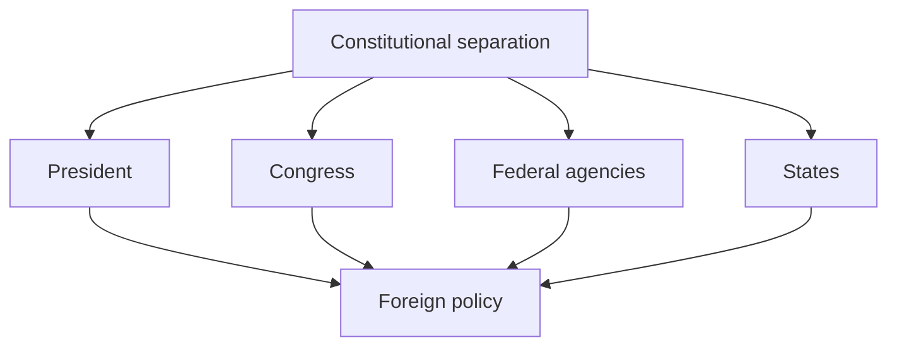
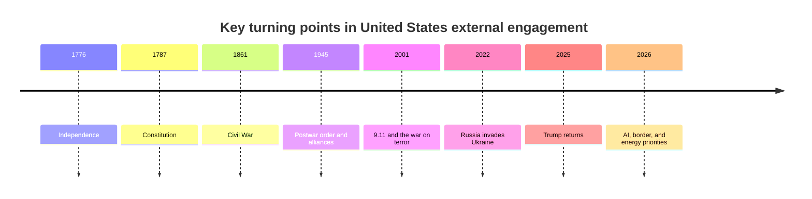
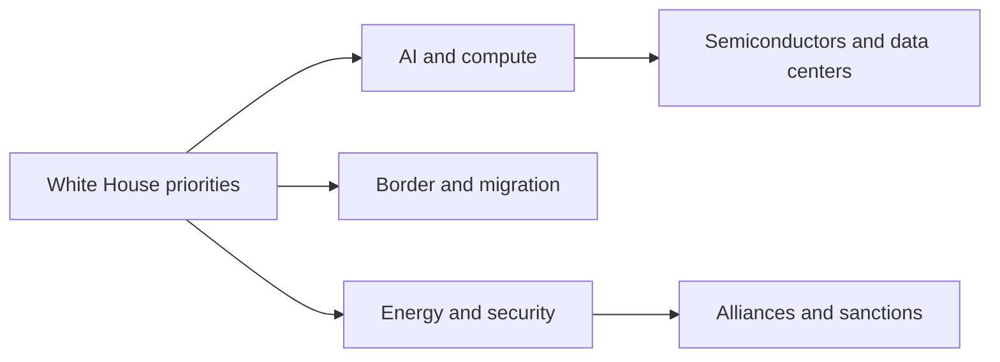

# United States Geopolitical Profile 2026

## 1. Executive Summary

Reading United States geopolitics requires more than looking at military power. Constitutional separation of powers, federalism, state discretion, and a polarized Congress continually change the speed and shape of foreign policy. The current administration puts AI, the economy, national security, border control, and energy at the top of its agenda, while House Republican leadership is visible around Speaker Mike Johnson. <SourceNote>[The White House](https://www.whitehouse.gov/) lists President Donald J. Trump and Vice President JD Vance and highlights AI, the economy, national security, the border, and energy as top priorities. [House of Representatives Leadership](https://www.house.gov/leadership) shows Speaker Mike Johnson and Republican leadership.</SourceNote>

In the May 2026 BLS releases, CPI was up 4.2 percent year over year and unemployment was 4.3 percent. The economy is not breaking down, but households still do not feel much slack. Foreign policy does not move on abstract national interest alone; it is always pulled by prices, jobs, energy costs, and migration pressure. <SourceNote>[BLS, Consumer Price Index Summary - 2026 M05 Results](https://www.bls.gov/news.release/cpi.nr0.htm), [BLS, Employment Situation Summary - 2026 M05 Results](https://www.bls.gov/news.release/empsit.nr0.htm)</SourceNote>

The United States remains central to NATO and to support for Ukraine, while also putting AI at the center of national security and industrial competition. NATO's public page says allies are using PURL to jointly buy United States equipment and that NSATU bundles support and training. The AI portal says the United States is in a race for AI leadership and organizes policy around Innovation, Infrastructure, and International Diplomacy and Security. <SourceNote>[NATO, NATO's support for Ukraine](https://www.nato.int/en/what-we-do/partnerships-and-cooperation/natos-support-for-ukraine), [AI.Gov](https://www.ai.gov/)</SourceNote>

The practical point is not whether the United States is simply strong or weak. The point is that different domestic coalitions push different policies through different institutional channels, which changes alliances, sanctions, export controls, migration, and AI standards. For Japan, it is more useful to read the United States as a system in which domestic politics rewires diplomacy, trade, and technology control.

## 2. Historical and Institutional Base

The basic structure of the United States is a constitutional system that divides power among the legislative, judicial, and executive branches and then layers checks and balances on top. USA.gov explains that Congress passes laws and budgets, the President can veto and command, and the Supreme Court can overturn unconstitutional laws. <SourceNote>[USA.gov, Branches of government](https://www.usa.gov/branches-of-government)</SourceNote>

Since the founding, the United States has swung between isolation and intervention, protection and free trade, state power and federal power. Since 1945, however, a durable pattern has emerged: the United States combines alliance networks, financial sanctions, technology advantage, and maritime power. Current policy is an extension of that pattern, filtered through domestic political costs.

## 3. Current Power Configuration

What matters now is that the federal system creates many policy paths. Because the federal government is split into legislative, judicial, and executive branches and the states retain their own power, foreign policy is not made by the President alone. <SourceNote>[USA.gov, Branches of government](https://www.usa.gov/branches-of-government)</SourceNote>

| Layer | Current center of gravity | Foreign-policy effect |
| --- | --- | --- |
| White House | Donald J. Trump, JD Vance, priorities around AI, security, the border, and energy | Executive orders, diplomacy, and agency direction |
| House of Representatives | Mike Johnson and Republican leadership | Budgets, oversight, legislation, and foreign spending |
| Treasury / OFAC | Sanctions enforcement | Asset blocking, trade limits, and financial screening |
| AI portal and commerce-related policy | AI Action Plan and compute infrastructure | AI, semiconductors, data centers, and exports |
| States and localities | Immigration, policing, elections, and education | Implementation speed and political friction |

<SourceNote>[The White House](https://www.whitehouse.gov/), [House of Representatives Leadership](https://www.house.gov/leadership), [OFAC, Sanctions Programs and Country Information](https://ofac.treasury.gov/sanctions-programs-and-country-information), [AI.Gov](https://www.ai.gov/), [USA.gov, Branches of government](https://www.usa.gov/branches-of-government)</SourceNote>

OFAC uses sanctions as a tool of foreign policy and national security through asset blocking and trade restrictions. The current sanctions list includes Russia, Iran, cyber, and North Korea, which shows that the United States routinely turns finance and logistics into geopolitical pressure points. <SourceNote>[OFAC, Sanctions Programs and Country Information](https://ofac.treasury.gov/sanctions-programs-and-country-information)</SourceNote>

## 4. Main External Arenas

### 1. NATO and Ukraine

The United States is still central to NATO, but the real support model is no longer just a United States burden. NATO says allies are jointly buying United States equipment through PURL and that NSATU bundles support and training. <SourceNote>[NATO, NATO's support for Ukraine](https://www.nato.int/en/what-we-do/partnerships-and-cooperation/natos-support-for-ukraine)</SourceNote>

That pattern shows that alliance burden-sharing, allied budgets, and industrial capacity all shape deterrence. For Japan, the United States defense industrial base is shared infrastructure for both Europe and the Indo-Pacific. That is an inference from the public record.

### 2. China Competition and AI

The AI portal describes the United States as engaged in a race for AI leadership and organizes policy around Innovation, Infrastructure, and International Diplomacy and Security. It also names the export of the American AI technology stack and faster federal permitting for data center infrastructure. <SourceNote>[AI.Gov](https://www.ai.gov/)</SourceNote>

AI is therefore not just a new industry. For the United States it is a national security, standards, cloud, compute, chip supply, export control, and allied coordination issue. Semiconductor policy shows up here as a question of who gets access to what compute stack and under what conditions.

### 3. Border and Migration

The White House's current priorities include a secure border. That means migration is treated not only as a labor-market or welfare issue, but also as a law-enforcement issue, an election issue, and a federalism issue that touches state power and foreign relations. <SourceNote>[The White House](https://www.whitehouse.gov/)</SourceNote>

Migration supports the population and labor force, but it also touches security, wages, education, local budgets, and border management at the same time. That is why border control does not stay inside domestic politics.

### 4. Sanctions and Finance

OFAC sanctions show how the United States turns finance and trade rules into geopolitics. Sanctions on Russia and Iran raise the cost of banking, insurance, shipping, re-export, and technology transfer in addition to direct military pressure. <SourceNote>[OFAC, Sanctions Programs and Country Information](https://ofac.treasury.gov/sanctions-programs-and-country-information)</SourceNote>

I am not quantifying dollar dominance here, but in practice United States sanctions can change the operating conditions of third-country firms very quickly. For Japanese firms, counterpart screening, end use, re-export, shipping insurance, and payment rails need to be treated as one compliance problem.

## 5. Civil Society and Polarization

United States civil society is not one bloc. Urban and rural politics, educational attainment, religion, migration generations, race, and industrial structure all shape political coalitions. Because Congress, the courts, the states, and federal agencies all act as veto points, foreign policy moves only when domestic consensus is strong enough. That is an inference from the institutional structure. <SourceNote>[USA.gov, Branches of government](https://www.usa.gov/branches-of-government)</SourceNote>

The May 2026 BLS data show CPI at 4.2 percent year over year and unemployment at 4.3 percent. Inflation is not extreme, but it is not low enough to create a feeling of slack. In that environment, voters tend to react more strongly to visible changes in prices, jobs, housing, safety, and the border than to abstract foreign-policy language. <SourceNote>[BLS, Consumer Price Index Summary - 2026 M05 Results](https://www.bls.gov/news.release/cpi.nr0.htm), [BLS, Employment Situation Summary - 2026 M05 Results](https://www.bls.gov/news.release/empsit.nr0.htm)</SourceNote>

That is why the scope of foreign engagement is not unlimited. Ukraine aid, China competition, Middle East crises, border control, and AI investment all matter, but if prices or employment worsen, political resources are redirected inward first.

## 6. Implications for Japan and East Asia

First, the stability of the Japan-United States alliance is not determined by treaty text alone. The more domestic politics pulls Washington toward the border, energy, AI, and fiscal issues, the more Asia policy has to be justified to voters and Congress.

Second, AI and semiconductors are not just technology policy. They are geopolitical policy that combines standards, cloud, data centers, and export controls. As the AI portal makes clear, the United States wants to expand its AI stack abroad while also securing its own compute base. <SourceNote>[AI.Gov](https://www.ai.gov/)</SourceNote>

Third, sanctions and financial screening feed directly into Japanese business decisions. As long as OFAC sanctions are used broadly, United States foreign policy changes payment, insurance, shipping, and supply-chain conditions in Asia, not only military relationships. <SourceNote>[OFAC, Sanctions Programs and Country Information](https://ofac.treasury.gov/sanctions-programs-and-country-information)</SourceNote>

Fourth, the supply of United States equipment visible in NATO is not only a Europe issue. When industrial capacity tightens, the same factories, parts, and munitions can compete between Europe and the Indo-Pacific. That is an inference from the public record. <SourceNote>[NATO, NATO's support for Ukraine](https://www.nato.int/en/what-we-do/partnerships-and-cooperation/natos-support-for-ukraine)</SourceNote>

## 7. Monitoring Points

If you want to read the United States as a country profile for news consumption, five indicators matter most.

1. Whether White House priorities move toward AI, the border, energy, or national security.
1. Whether BLS inflation and unemployment widen or narrow the political space for foreign commitments.
1. Whether new OFAC sanctions expand into Russia, Iran, cyber, or technology transfer.
1. Whether NATO support moves further from United States-only burden-bearing toward joint procurement.
1. Whether House politics and state politics slow budgets and implementation.

These five indicators will change real United States behavior before the rhetoric does.

## 8. Risks and Limits

This profile has three limits. First, it relies on public information as of June 17, 2026, so new executive orders, sanctions, elections, or wars can change the baseline quickly. Second, the current House leadership is visible, but the more subtle Senate bargaining dynamic is not the center of this profile. Third, a full quantitative treatment of dollar centrality and semiconductor supply chains would belong in a separate report.

As a matter of public-information inference, the near-term United States is likely to remain more domestically selective while still active in alliances, sanctions, and AI standards. Foreign policy is more likely to be prioritized by what is easiest to explain at home than by any simple retreat from the world. <SourceNote>[The White House](https://www.whitehouse.gov/), [AI.Gov](https://www.ai.gov/), [OFAC, Sanctions Programs and Country Information](https://ofac.treasury.gov/sanctions-programs-and-country-information), [NATO, NATO's support for Ukraine](https://www.nato.int/en/what-we-do/partnerships-and-cooperation/natos-support-for-ukraine)</SourceNote>

## References

- [The White House](https://www.whitehouse.gov/)
- [USA.gov, Branches of government](https://www.usa.gov/branches-of-government)
- [House of Representatives Leadership](https://www.house.gov/leadership)
- [AI.Gov](https://www.ai.gov/)
- [OFAC, Sanctions Programs and Country Information](https://ofac.treasury.gov/sanctions-programs-and-country-information)
- [NATO, NATO's support for Ukraine](https://www.nato.int/en/what-we-do/partnerships-and-cooperation/natos-support-for-ukraine)
- [BLS, Consumer Price Index Summary - 2026 M05 Results](https://www.bls.gov/news.release/cpi.nr0.htm)
- [BLS, Employment Situation Summary - 2026 M05 Results](https://www.bls.gov/news.release/empsit.nr0.htm)
