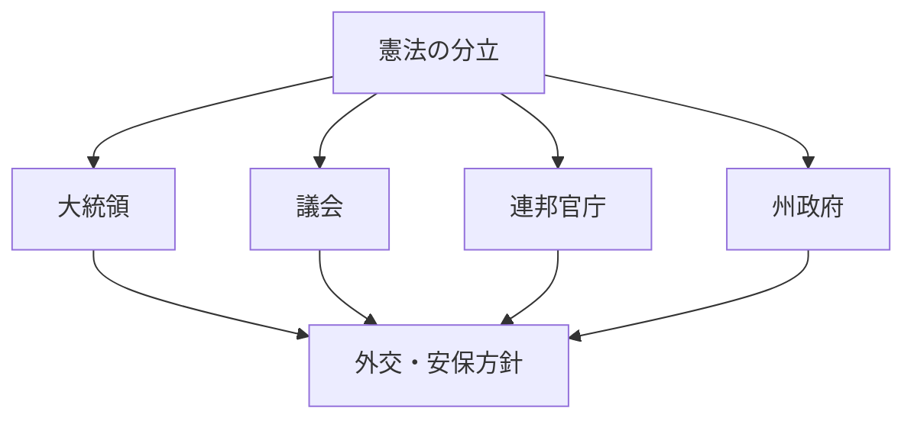
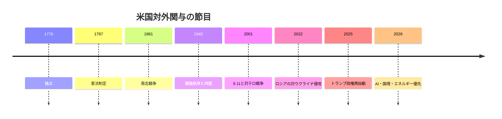
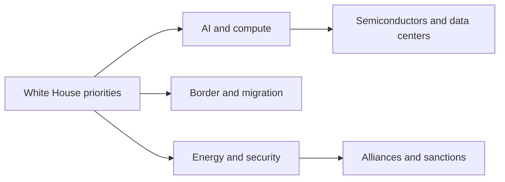

# 米国の国際政治プロファイル 2026年版

## 1. エグゼクティブサマリー

米国の国際政治を読むときは、軍事力だけでは足りない。憲法上の分立、連邦制、州の裁量、そして党派化した議会が、対外関与の速度と形を常に変える。現政権では、ホワイトハウスの優先順位に AI、経済、国家安全保障、国境管理、エネルギーが並び、下院ではマイク・ジョンソン議長を軸に共和党指導部が前面に出ている。<SourceNote>[The White House](https://www.whitehouse.gov/) のトップページは President Donald J. Trump と Vice President JD Vance を示し、AI、経済、国家安全保障、国境、エネルギーを主要優先事項として掲げている。[House of Representatives Leadership](https://www.house.gov/leadership) は Speaker Mike Johnson と Republican leadership を示す。</SourceNote>

2026年5月のBLS統計では、CPIは前年同月比4.2%、失業率は4.3%だった。つまり、景気は崩れていないが、家計の感覚はまだ余裕とは言いがたい。対外政策は抽象的な国益だけで動くのではなく、物価、雇用、エネルギー価格、移民の圧力に常に引きずられる。<SourceNote>[BLS, Consumer Price Index Summary - 2026 M05 Results](https://www.bls.gov/news.release/cpi.nr0.htm), [BLS, Employment Situation Summary - 2026 M05 Results](https://www.bls.gov/news.release/empsit.nr0.htm)</SourceNote>

米国は依然としてNATOとウクライナ支援の中心であり、同時にAIを国家安全保障と産業競争の中核に置いている。NATOの公表ページは、PURLを通じて米国製装備の共同調達を進め、NSATUが支援と訓練を束ねていると説明する。AI.Govは、米国がAI覇権競争にあり、政策柱を Innovation、Infrastructure、International Diplomacy and Security の三つに整理している。<SourceNote>[NATO, NATO's support for Ukraine](https://www.nato.int/en/what-we-do/partnerships-and-cooperation/natos-support-for-ukraine), [AI.Gov](https://www.ai.gov/)</SourceNote>

この国の実務上のポイントは、米国が強いか弱いかではない。どの国内連合が、どの政策を、どの制度経路で押し出すかで、同盟、制裁、輸出管理、移民、AI標準が変わることにある。日本にとっては、米国を単独の国家ではなく、国内政治が外交通商と技術統制を再配線するシステムとして読むほうが有益である。

## 2. 歴史と制度の骨格

米国の基本構造は、憲法が立法・司法・行政の三権を分け、checks and balances で相互牽制することである。USAGov の説明では、議会は法案と予算、指名承認、宣戦権を持ち、大統領は拒否権と指揮権を持ち、最高裁は違憲法を覆せる。<SourceNote>[USA.gov, Branches of government](https://www.usa.gov/branches-of-government)</SourceNote>

建国以来の米国は、孤立と介入、自由貿易と保護、州権と連邦権のあいだを揺れてきた。だが1945年以降は、同盟網、金融制裁、技術優位、海上覇権を組み合わせる方式が定着した。現在の対外政策は、その延長線上で、国内の政治コストをどう吸収するかという設計問題になっている。

## 3. 現在の権力配置

今の米国を読むうえで重要なのは、連邦政府の制度経路が多いことだ。連邦政府は立法・司法・行政に分かれ、州政府と地方政府も独自の権限を持つため、外交は大統領だけで決まらない。<SourceNote>[USA.gov, Branches of government](https://www.usa.gov/branches-of-government)</SourceNote>

| レイヤー | 現在の中心 | 外交への効き方 |
| --- | --- | --- |
| White House | Donald J. Trump, JD Vance, AI・安全保障・国境・エネルギー重視 | 行政命令、交渉方針、官庁の優先順位 |
| House of Representatives | Mike Johnson と Republican leadership | 予算、監視、法案、対外支出 |
| Treasury / OFAC | 制裁プログラムの執行主体 | 資産凍結、貿易制限、金融審査 |
| AI.Gov と商務関連政策 | AI Action Plan と計算基盤の整備 | AI、半導体、データセンター、輸出 |
| 州・地方政府 | 移民、警察、選挙、教育 | 実装の速度と政治摩擦 |

<SourceNote>[The White House](https://www.whitehouse.gov/), [House of Representatives Leadership](https://www.house.gov/leadership), [OFAC, Sanctions Programs and Country Information](https://ofac.treasury.gov/sanctions-programs-and-country-information), [AI.Gov](https://www.ai.gov/), [USA.gov, Branches of government](https://www.usa.gov/branches-of-government)</SourceNote>

OFAC は制裁を、資産凍結と貿易制限を使う対外・安保の道具として運用する。現在の制裁プログラム一覧には、ロシア、イラン、サイバー、北朝鮮などが並んでおり、外交の圧力は軍事力だけではなく金融と物流の規制で発揮される。<SourceNote>[OFAC, Sanctions Programs and Country Information](https://ofac.treasury.gov/sanctions-programs-and-country-information)</SourceNote>

## 4. 対外政策の主戦場

### 1. NATO とウクライナ

米国は依然として NATO の中心だが、現実の支援は「米国単独の負担」ではなく、同盟国の資金を使って米国製装備を共同調達する形に寄っている。NATO のページは、PURL による米国装備の共同調達と、NSATU による支援の束ね役を説明している。<SourceNote>[NATO, NATO's support for Ukraine](https://www.nato.int/en/what-we-do/partnerships-and-cooperation/natos-support-for-ukraine)</SourceNote>

この構図は、ワシントンの支援意志だけでなく、同盟国がどこまで在庫と予算を出せるかが、欧州の抑止を左右することを示す。日本にとっても、米国の弾薬・防空・産業基盤は、欧州とアジアの両方の抑止を支える共通インフラである。これは公表情報からの推定である。

### 2. 対中競争と AI

AI.Gov は、米国を AI の世界的主導権競争の当事者として位置づけ、Innovation、Infrastructure、International Diplomacy and Security を三本柱に据える。そこでは、米国の AI 技術スタックの輸出、連邦のデータセンター許認可の迅速化、計算資源の整備が明示されている。<SourceNote>[AI.Gov](https://www.ai.gov/)</SourceNote>

したがって、AI は単なる新産業ではない。米国にとっては、標準、クラウド、計算基盤、チップ供給、輸出管理、同盟国との技術協調を束ねる安全保障案件である。ここでの半導体政策は、工場だけでなく、どの計算基盤を誰に渡すかという管理問題として現れる。

### 3. 国境と移民

The White House の現在の優先事項には secure border が含まれる。これは、移民を単なる社会福祉や労働市場の問題ではなく、法執行、選挙、州と連邦の権限配分、対外関係をまたぐ政治問題として扱っていることを意味する。<SourceNote>[The White House](https://www.whitehouse.gov/)</SourceNote>

移民は米国の人口動態を支える一方で、治安、賃金、教育、地方財政、国境管理に同時に触れる。だからこそ、対外関与の文脈でも、国境管理は国内問題に閉じない。

### 4. 制裁と金融

OFAC の制裁プログラムは、米国が金融と貿易のルールを通じて地政学を動かすことを示している。ロシアやイランに対する制裁は、軍事的な圧力に加えて、銀行、保険、海運、再輸出、技術移転のコストを引き上げる。<SourceNote>[OFAC, Sanctions Programs and Country Information](https://ofac.treasury.gov/sanctions-programs-and-country-information)</SourceNote>

ドル基軸そのものの詳細統計はここでは追わないが、米国の制裁が第三国企業の取引条件に直結しやすいことは実務上の前提である。日本企業にとっては、相手先、最終用途、再輸出、保険、決済を一体で見る必要がある。

## 5. 市民社会と国内分断

米国の市民社会は一枚岩ではない。都市と地方、大学教育の有無、宗教、移民世代、人種、産業構造が重なって政治連合を形づくる。議会、裁判所、州政府、連邦官庁がそれぞれ veto point になるため、対外政策も国内の合意形成ができた部分からしか進みにくい。これは制度構造からの推定である。<SourceNote>[USA.gov, Branches of government](https://www.usa.gov/branches-of-government)</SourceNote>

2026年5月のBLSデータでは、CPIは前年同月比4.2%、失業率は4.3%だった。インフレは極端ではないが、家計の余裕を回復させるほど低くもない。こうした環境では、有権者は抽象的な対外戦略よりも、物価、雇用、住宅、治安、国境の可視的な改善に反応しやすい。<SourceNote>[BLS, Consumer Price Index Summary - 2026 M05 Results](https://www.bls.gov/news.release/cpi.nr0.htm), [BLS, Employment Situation Summary - 2026 M05 Results](https://www.bls.gov/news.release/empsit.nr0.htm)</SourceNote>

そのため、対外関与の幅は無限ではない。ウクライナ支援、対中競争、中東危機、国境管理、AI投資はすべて重要だが、国内の価格と雇用が悪化すると、政治資源はまず内向きに再配分される。

## 6. 日本・東アジアへの含意

第一に、日米同盟の安定は条約文だけでは決まらない。米国の国内政治が国境、エネルギー、AI、財政に引っ張られるほど、アジアへの資源配分は説明責任を伴うものになる。

第二に、AI と半導体は、単なる技術政策ではなく、標準化、クラウド、データセンター、輸出管理をまとめた地政学案件である。AI.Gov が示すように、米国は AI 技術スタックを外に広げつつ、自国の計算基盤も囲い込もうとしている。<SourceNote>[AI.Gov](https://www.ai.gov/)</SourceNote>

第三に、制裁と金融審査は日本企業に直接跳ね返る。OFAC の制裁プログラムが広く使われる限り、米国の対外政策は軍事同盟だけでなく、決済、保険、海運、サプライチェーンの条件を通じてアジアの商流を変える。<SourceNote>[OFAC, Sanctions Programs and Country Information](https://ofac.treasury.gov/sanctions-programs-and-country-information)</SourceNote>

第四に、NATO で可視化される米国製装備の供給は、欧州だけの問題ではない。産業基盤が細ると、同じ工場、同じ部品、同じ弾薬が欧州とインド太平洋の両方で競合する。これは公表情報からの推定である。<SourceNote>[NATO, NATO's support for Ukraine](https://www.nato.int/en/what-we-do/partnerships-and-cooperation/natos-support-for-ukraine)</SourceNote>

## 7. 監視点

米国をニュース読解用の国別プロファイルとして見るなら、次の5点を定点観測するのがよい。

1. White House の優先事項が AI、国境、エネルギー、国家安全保障のどこに寄るか。
1. BLS の CPI と失業率が、対外関与の政治余地をどれだけ広げるか。
1. OFAC の新規制裁が、ロシア、イラン、サイバー、技術移転のどこに伸びるか。
1. NATO の支援枠組みが、米国単独負担から共同調達へどこまで移るか。
1. House と州政治の組み合わせが、予算と実装をどれだけ遅らせるか。

この5点は、外交の文言より先に、実際の米国の行動を変える。

## 8. リスク・限界

本稿の限界は三つある。第一に、2026年6月17日時点の公開情報に依拠しているため、直近の大統領令、制裁、選挙、戦争の進展はすぐに前提を変えうる。第二に、下院の現在の党派分布は確認できても、上院の微妙な力学までは本稿の中心に置いていない。第三に、ドル基軸や半導体供給網の詳細な数量分析は、別稿で補うほうが読みやすい。

公表情報からの推定として、当面の米国は「国内優先を強めつつ、同盟・制裁・AI標準では世界に残る」方向を取りやすい。外交は縮むというより、国内に説明しやすいテーマから順に配分されるとみるのが妥当である。<SourceNote>[The White House](https://www.whitehouse.gov/), [AI.Gov](https://www.ai.gov/), [OFAC, Sanctions Programs and Country Information](https://ofac.treasury.gov/sanctions-programs-and-country-information), [NATO, NATO's support for Ukraine](https://www.nato.int/en/what-we-do/partnerships-and-cooperation/natos-support-for-ukraine)</SourceNote>

## 参考情報

- [The White House](https://www.whitehouse.gov/)
- [USA.gov, Branches of government](https://www.usa.gov/branches-of-government)
- [House of Representatives Leadership](https://www.house.gov/leadership)
- [AI.Gov](https://www.ai.gov/)
- [OFAC, Sanctions Programs and Country Information](https://ofac.treasury.gov/sanctions-programs-and-country-information)
- [NATO, NATO's support for Ukraine](https://www.nato.int/en/what-we-do/partnerships-and-cooperation/natos-support-for-ukraine)
- [BLS, Consumer Price Index Summary - 2026 M05 Results](https://www.bls.gov/news.release/cpi.nr0.htm)
- [BLS, Employment Situation Summary - 2026 M05 Results](https://www.bls.gov/news.release/empsit.nr0.htm)
