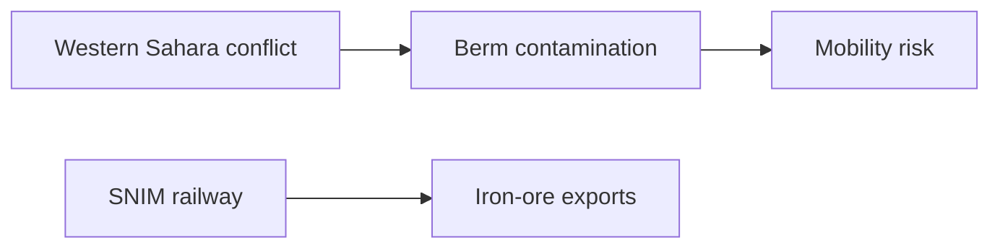

# Landmine belts and railways in Western Sahara and Mauritania

## 1. Executive Summary

The desert zone stretching from Western Sahara toward Mauritania is not an empty space. Mine, explosive-ordnance, and cluster-munition contamination remains around the Moroccan Berm in Western Sahara, while Mauritania has the internationally known SNIM iron-ore railway. These are not the same problem. The former is tied to the Western Sahara conflict and ceasefire monitoring; the latter is a mining, export, and state-infrastructure issue. <SourceNote>Mine and explosive-ordnance context is based on [UNMAS, Territory of Western Sahara](https://unmas.org/en/where-we-work/territory-of-western-sahara) and [MINURSO, Mine action](https://minurso.unmissions.org/en/mine-action). Railway facts are based on [SNIM, RAPPORT P3P SNIM V FINAL OCT 2024 PDF](https://snim.com/sites/default/files/RAPPORT%20P3P%20SNIM%20V%20FINAL%20OCT%202024.pdf).</SourceNote>

The mine-affected area is better understood as a linear hazard around the Berm than as one clean area total. UNMAS says much contamination is concentrated along the 1,465 km sand berm dividing the region, and that since 2008 it has released approximately 150 million square meters of hazardous land. The broader Moroccan Wall/Berm is often described as roughly 2,700 km long, so figures vary depending on the exact boundary and operational definition. <SourceNote>[UNMAS, Territory of Western Sahara](https://unmas.org/en/where-we-work/territory-of-western-sahara) and [Mine Action Review, Western Sahara](https://www.mineactionreview.org/country/western-sahara/) are the sources.</SourceNote>

Mauritania's SNIM railway links the mining zone around Zouerate with the ore port at Nouadhibou. SNIM's 2024 stakeholder participation plan describes the existing railway as a 704 km single-track line from the M'Haoudatt side to Nouadhibou, with 17 passing sidings. The iron-ore train that appears in travel writing and film discussion is industrial infrastructure, not the mine belt or the Western Sahara military boundary. <SourceNote>[SNIM, RAPPORT P3P SNIM V FINAL OCT 2024 PDF](https://snim.com/sites/default/files/RAPPORT%20P3P%20SNIM%20V%20FINAL%20OCT%202024.pdf).</SourceNote>

## 2. How Large Are the Mine-Affected Areas?

Western Sahara's landmine problem is not one shaded polygon on a map. UNMAS says landmines and explosive ordnance are a legacy of the 1975-1991 conflict and that much contamination is concentrated along the 1,465 km sand berm dividing the region. Since 2008, UNMAS Western Sahara reports releasing approximately 150 million square meters of hazardous land, including 43 of 67 known minefields and 508 of 541 cluster munition strike areas. <SourceNote>[UNMAS, Territory of Western Sahara](https://unmas.org/en/where-we-work/territory-of-western-sahara). The page gives data as of January 2026 and shows a June 2026 update date.</SourceNote>

MINURSO's mine-action page gives lower cumulative figures: more than 84 million square meters released, 42 of 66 known minefields released, and 505 of 540 cluster strike areas released. The difference appears to reflect update timing and scope. The important point is not a single definitive contaminated square-kilometer total. The area is managed through known hazardous areas, suspected hazardous areas, released areas, route verification, and the Berm's length. <SourceNote>[MINURSO, Mine action](https://minurso.unmissions.org/en/mine-action) compared with [UNMAS](https://unmas.org/en/where-we-work/territory-of-western-sahara).</SourceNote>

Mauritania's remaining contamination is also a legacy of the Western Sahara conflict. Landmine Monitor says Mauritania's contamination stems from the 1975-1978 Western Sahara conflict and that, as of the end of 2024, Mauritania reported 22 confirmed hazardous areas for antipersonnel mines, nine confirmed hazardous areas for cluster munition remnants, 1.5 square kilometers of suspected hazardous area for cluster munition remnants, and 16.88 square kilometers of suspected hazardous area for explosive remnants of war. <SourceNote>[Landmine and Cluster Munition Monitor, Mauritania impact profile](https://the-monitor.org/country-profile/mauritania/impact).</SourceNote>

## 3. Where Are the Railways?

Mauritania's SNIM iron-ore railway is a powerful symbol of desert mobility, but its purpose is ore transport rather than ordinary passenger mobility. SNIM's 2024 stakeholder participation plan states that the existing railway is a 704 km single-track line linking M'Haoudatt station to the Nouadhibou ore port, with 17 passing sidings. SNIM holds the railway right-of-way from Zouerate to Nouadhibou. <SourceNote>[SNIM, RAPPORT P3P SNIM V FINAL OCT 2024 PDF](https://snim.com/sites/default/files/RAPPORT%20P3P%20SNIM%20V%20FINAL%20OCT%202024.pdf).</SourceNote>

Morocco is modernizing and expanding its rail system, but that should not be confused with the Western Sahara Berm or Mauritania's iron-ore railway. The 2025 expansion plan reported by Reuters and France 24 focuses on major investment and a high-speed extension to Marrakech by 2030. Future concepts, tourist routes, and the existing industrial railway need to be kept separate. <SourceNote>[Reuters, Morocco launches $10 billion rail expansion plan](https://www.reuters.com/world/africa/morocco-launches-10-billion-rail-expansion-plan-2025-04-24/) and [France 24](https://www.france24.com/en/africa/20250424-morocco-green-lights-10-billion-rail-expansion-plan).</SourceNote>

## 4. Conflict History

Western Sahara was a Spanish colony until 1976. During decolonization, Morocco and Mauritania claimed the territory, while the Frente POLISARIO opposed both claims. After the 1975 Madrid Accords transferred Spain's administrative responsibilities to Morocco and Mauritania, armed conflict broke out between the Polisario Front and the two states. Mauritania gave up its claim in 1979; Morocco then administered the area vacated by Mauritania. <SourceNote>[MINURSO, Background](https://minurso.unmissions.org/en/background) and [Britannica, Western Sahara](https://www.britannica.com/place/Western-Sahara).</SourceNote>

In 1991, Security Council Resolution 690 established MINURSO to prepare a referendum. The referendum was never held because of disputes over implementation, including voter identification. MINURSO continues to monitor military developments and reduce explosive-ordnance threats. In 2020, the Polisario Front announced withdrawal from the ceasefire and a resumption of armed struggle. Resolution 2797 in 2025 renewed MINURSO for one year and gave more weight to Morocco's autonomy proposal as a basis for negotiations, while the Polisario Front and Algeria continued to emphasize self-determination. <SourceNote>[MINURSO, Mandate](https://minurso.unmissions.org/en/mandate), [MINURSO, Background](https://minurso.unmissions.org/en/background), and [Security Council Report, Western Sahara April 2026](https://www.securitycouncilreport.org/monthly-forecast/2026-04/western-sahara-16.php).</SourceNote>

## 5. Social issues and mining-risk reading

In Western Sahara, Freedom House describes the territory as a UN-listed non-self-governing territory and says Morocco controls more than three-quarters of it. It also reports restrictions on Sahrawi activists and journalists who support self-determination. The mine issue is therefore both a humanitarian danger and part of an unresolved political-status problem. <SourceNote>[Freedom House, Western Sahara 2025](https://freedomhouse.org/country/western-sahara/freedom-world/2025), [Amnesty International, Morocco and Western Sahara](https://www.amnesty.org/en/location/middle-east-and-north-africa/north-africa/morocco-and-western-sahara/report-morocco-and-western-sahara/), and [Human Rights Watch, Morocco/Western Sahara](https://www.hrw.org/middle-east/north-africa/morocco/western-sahara).</SourceNote>

In Mauritania, the key social issues are the legacy of slavery, discrimination against Haratine and Afro-Mauritanians, pressure on activists, employment, and dependence on extractive industries. The SNIM train is easy to consume as an adventure-travel icon, but it is mining infrastructure tied to employment, regional development, export earnings, and state revenue. Climate pressure adds another layer: the PIK/GIZ climate profile projects a 2.0-4.5 degree Celsius temperature increase by 2080 compared with pre-industrial levels, with impacts on water, agriculture, pastoral livelihoods, drought, flooding, and desertification. <SourceNote>[Freedom House, Mauritania 2025](https://freedomhouse.org/country/mauritania/freedom-world/2025) and [PIK/GIZ, Climate Risk Profile: Mauritania](https://www.pik-potsdam.de/en/institute/departments/climate-resilience/projects/project-pages/agrica/giz_climate-risk-profile-mauritania_en_final).</SourceNote>

The safety point is to separate mine belts, railways, desert tourism, and music events. Mines and explosive ordnance are security issues that require UNMAS/MINURSO and official travel-safety checks. The SNIM railway is mining infrastructure. Desert events are questions of organizer, permit status, and transport route. They may look close on a map, but their risk types and responsible actors differ. <SourceNote>This conclusion is an inference from the UNMAS, MINURSO, Landmine Monitor, SNIM, Freedom House, and PIK/GIZ sources cited above.</SourceNote>

## References

- [UNMAS, Territory of Western Sahara](https://unmas.org/en/where-we-work/territory-of-western-sahara)
- [MINURSO, Mine action](https://minurso.unmissions.org/en/mine-action)
- [Landmine and Cluster Munition Monitor, Mauritania impact profile](https://the-monitor.org/country-profile/mauritania/impact)
- [Mine Action Review, Western Sahara](https://www.mineactionreview.org/country/western-sahara/)
- [SNIM, Plan de participation des parties prenantes PDF](https://snim.com/sites/default/files/RAPPORT%20P3P%20SNIM%20V%20FINAL%20OCT%202024.pdf)
- [MINURSO, Background](https://minurso.unmissions.org/en/background)
- [MINURSO, Mandate](https://minurso.unmissions.org/en/mandate)
- [Security Council Report, Western Sahara April 2026](https://www.securitycouncilreport.org/monthly-forecast/2026-04/western-sahara-16.php)
- [Freedom House, Western Sahara 2025](https://freedomhouse.org/country/western-sahara/freedom-world/2025)
- [Freedom House, Mauritania 2025](https://freedomhouse.org/country/mauritania/freedom-world/2025)
- [PIK/GIZ, Climate Risk Profile: Mauritania](https://www.pik-potsdam.de/en/institute/departments/climate-resilience/projects/project-pages/agrica/giz_climate-risk-profile-mauritania_en_final)
