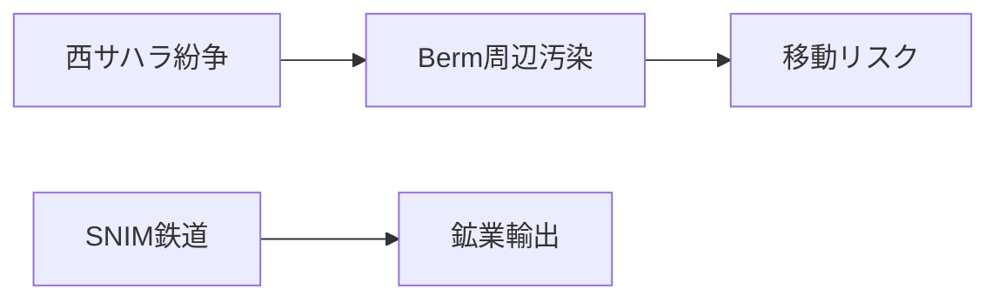

# 西サハラ・モーリタニアの地雷帯と鉄道

## 1. エグゼクティブサマリー

西サハラからモーリタニアにかけての砂漠地域は、空白地帯ではない。西サハラの Moroccan Berm 周辺には地雷・不発弾・クラスター弾残存物が残り、モーリタニア側には世界的に知られる SNIM の鉄鉱石鉄道が走る。地雷帯と鉄道は同じ「砂漠の危険」ではなく、前者は西サハラ紛争と停戦監視、後者は鉱業・輸出・国家インフラの問題である。<SourceNote>地雷・不発弾は [UNMAS, Territory of Western Sahara](https://unmas.org/en/where-we-work/territory-of-western-sahara) と [MINURSO, Mine action](https://minurso.unmissions.org/en/mine-action)、鉄道は [SNIM, RAPPORT P3P SNIM V FINAL OCT 2024 PDF](https://snim.com/sites/default/files/RAPPORT%20P3P%20SNIM%20V%20FINAL%20OCT%202024.pdf) に基づく。</SourceNote>

地雷・不発弾の範囲は、単一の面積よりも Moroccan Berm とその周辺の線的な危険として理解した方がよい。UNMAS は、汚染の多くが地域を分断する 1,465km の砂の Berm 沿いに集中するとし、2008年以降に約1億5000万平方メートルの危険地を解放したと報告する。一方で、Moroccan Wall / Berm 全体は約2,700kmと説明されることもあり、どの長さ・範囲を指すかで数字が変わる。<SourceNote>[UNMAS, Territory of Western Sahara](https://unmas.org/en/where-we-work/territory-of-western-sahara) と [Mine Action Review, Western Sahara](https://www.mineactionreview.org/country/western-sahara/) に基づく。</SourceNote>

モーリタニアの SNIM 鉄道は、Zouerate 周辺の鉱山地帯と Nouadhibou の鉱石港を結ぶ産業鉄道である。SNIM の2024年ステークホルダー参加計画は、既存鉄道を M'Haoudatt 側から Nouadhibou までの 704km 単線と説明し、17か所の待避線があるとする。旅行記や映像で目立つ鉄鉱石列車は、地雷帯や軍事境界ではなく、鉱業輸出と国家収入に結びつくインフラである。<SourceNote>[SNIM, RAPPORT P3P SNIM V FINAL OCT 2024 PDF](https://snim.com/sites/default/files/RAPPORT%20P3P%20SNIM%20V%20FINAL%20OCT%202024.pdf) に基づく。</SourceNote>

## 2. 地雷帯はどこまで広がっているのか

西サハラの地雷問題は、地図上の一つの塗りつぶし面積ではない。UNMAS は、1975-1991年の紛争の遺産として、地雷と不発弾の多くが地域を分断する 1,465km の砂の Berm 沿いに集中していると説明する。2008年以降、UNMAS Western Sahara は約1億5000万平方メートルの危険地を解放し、既知地雷原67件中43件、クラスター弾着弾区域541件中508件を解放したとする。<SourceNote>[UNMAS, Territory of Western Sahara](https://unmas.org/en/where-we-work/territory-of-western-sahara) に基づく。同ページは 2026年1月時点データと 2026年6月更新表示を示す。</SourceNote>

MINURSO の mine action ページでは、2008年以降に 8,400万平方メートル超の危険地解放、66件中42件の既知地雷原解放、540件中505件のクラスター弾着弾区域解放が示される。UNMAS の別ページより数字が小さいのは、更新時点や集計範囲が違うためと見られる。重要なのは、総面積を一つに固定することではなく、既知区域、疑い区域、解放済み区域、Berm 長、ルート確認を分けることである。<SourceNote>[MINURSO, Mine action](https://minurso.unmissions.org/en/mine-action) と [UNMAS](https://unmas.org/en/where-we-work/territory-of-western-sahara) の数値を比較した。</SourceNote>

モーリタニア国内の汚染も、西サハラ紛争の遺産である。Landmine Monitor は、モーリタニアの汚染が1975-1978年の西サハラ紛争に由来し、2024年末時点で対人地雷の confirmed hazardous area が22件、クラスター弾残存物の confirmed hazardous area が9件、さらにクラスター弾残存物の suspected hazardous area 1.5平方キロメートル、不発弾等の suspected hazardous area 16.88平方キロメートルがあると整理する。<SourceNote>[Landmine and Cluster Munition Monitor, Mauritania impact profile](https://the-monitor.org/country-profile/mauritania/impact) に基づく。</SourceNote>

## 3. 鉄道はどこにあるのか

モーリタニアの SNIM 鉄鉱石鉄道は、砂漠地域の移動を象徴する存在だが、目的は旅客交通ではなく鉱石輸送である。SNIM の資料は、既存鉄道が 704km の単線で、M'Haoudatt 駅から Nouadhibou の鉱石港までを結び、17か所の待避線で列車交換を可能にしていると説明する。SNIM は Zouerate から Nouadhibou までの鉄道敷を保有するとされる。<SourceNote>[SNIM, RAPPORT P3P SNIM V FINAL OCT 2024 PDF](https://snim.com/sites/default/files/RAPPORT%20P3P%20SNIM%20V%20FINAL%20OCT%202024.pdf) に基づく。</SourceNote>

モロッコ側は鉄道網の近代化・高速鉄道延伸を進めているが、現在の西サハラ Berm 周辺やモーリタニアの鉱石鉄道と同じものではない。2025年に報じられた約960億ディルハム規模の鉄道拡張計画は、2030年までの高速鉄道 Marrakech 延伸などが中心である。将来構想、観光ルート、現存の鉱石鉄道を混同すると、実際の移動可能性を誤る。<SourceNote>[Reuters, Morocco launches $10 billion rail expansion plan](https://www.reuters.com/world/africa/morocco-launches-10-billion-rail-expansion-plan-2025-04-24/) と [France 24](https://www.france24.com/en/africa/20250424-morocco-green-lights-10-billion-rail-expansion-plan) に基づく。</SourceNote>

## 4. 紛争史との関係

西サハラは1976年までスペイン植民地であり、脱植民地化の過程でモロッコとモーリタニアが領有を主張し、Frente POLISARIO が反対した。1975年の Madrid Accords でスペインの行政責任がモロッコとモーリタニアに移されると、POLISARIO と両国の間で武力紛争が起きた。モーリタニアは1979年に領有主張を放棄し、モロッコがその部分も管理するようになった。<SourceNote>[MINURSO, Background](https://minurso.unmissions.org/en/background) と [Britannica, Western Sahara](https://www.britannica.com/place/Western-Sahara) に基づく。</SourceNote>

1991年、安保理決議690で MINURSO が設立され、住民投票を準備する予定だった。しかし、有権者認定などをめぐる対立で投票は実施されず、MINURSO は停戦監視、軍事動向の監視、地雷・不発弾リスク低減を続けている。2020年には POLISARIO が停戦離脱と武装闘争再開を宣言し、停戦は以前のような安定を失った。2025年の安保理決議2797は MINURSO 任務を1年延長し、モロッコの自治提案を交渉の基礎として扱う方向を強めたが、POLISARIO とアルジェリアは自己決定権を主張し続けている。<SourceNote>[MINURSO, Mandate](https://minurso.unmissions.org/en/mandate)、[MINURSO, Background](https://minurso.unmissions.org/en/background)、[Security Council Report, Western Sahara April 2026](https://www.securitycouncilreport.org/monthly-forecast/2026-04/western-sahara-16.php) に基づく。</SourceNote>

## 5. 社会問題と鉱業リスクの読み方

西サハラでは、Freedom House が同地域を国連上の非自治地域とし、モロッコが4分の3超を支配していると整理する。モロッコ統治下では、サハラウィの自己決定を支持する活動家やジャーナリストへのハラスメント、逮捕、移動・表現の制約が指摘される。地雷問題は人道上の危険であると同時に、未解決の政治的地位問題と切り離せない。<SourceNote>[Freedom House, Western Sahara 2025](https://freedomhouse.org/country/western-sahara/freedom-world/2025)、[Amnesty International, Morocco and Western Sahara](https://www.amnesty.org/en/location/middle-east-and-north-africa/north-africa/morocco-and-western-sahara/report-morocco-and-western-sahara/)、[Human Rights Watch, Morocco/Western Sahara](https://www.hrw.org/middle-east/north-africa/morocco/western-sahara) に基づく。</SourceNote>

モーリタニアでは、奴隷制の制度的遺産、Haratine や Afro-Mauritanian への差別、活動家への圧力、雇用と抽出産業依存が中心論点である。SNIM 鉄道は冒険旅行のアイコンとして消費されやすいが、実態は鉱業に依存する国家経済と労働・地域開発のインフラである。気候面では、GIZ/PIK の Climate Risk Profile が、2080年までに気温が産業化以前比で 2.0-4.5度上昇し、水資源、農牧業、干ばつ・洪水、砂漠化が生計に影響すると予測している。<SourceNote>[Freedom House, Mauritania 2025](https://freedomhouse.org/country/mauritania/freedom-world/2025) と [PIK/GIZ, Climate Risk Profile: Mauritania](https://www.pik-potsdam.de/en/institute/departments/climate-resilience/projects/project-pages/agrica/giz_climate-risk-profile-mauritania_en_final) に基づく。</SourceNote>

安全評価では、地雷帯、鉄道、砂漠観光、音楽イベントを同じ「砂漠の危険」として扱わないことが重要である。地雷・不発弾は UNMAS/MINURSO と各国渡航情報で確認すべき安全保障問題であり、SNIM 鉄道は鉱業インフラであり、砂漠イベントは主催者・許認可・移動経路の問題である。地図上で近く見えても、リスクの種類と責任主体は異なる。<SourceNote>この結論は、UNMAS、MINURSO、Landmine Monitor、SNIM、Freedom House、PIK/GIZ の公表資料を統合した判断である。</SourceNote>

## 参考情報

- [UNMAS, Territory of Western Sahara](https://unmas.org/en/where-we-work/territory-of-western-sahara)
- [MINURSO, Mine action](https://minurso.unmissions.org/en/mine-action)
- [Landmine and Cluster Munition Monitor, Mauritania impact profile](https://the-monitor.org/country-profile/mauritania/impact)
- [Mine Action Review, Western Sahara](https://www.mineactionreview.org/country/western-sahara/)
- [SNIM, Plan de participation des parties prenantes PDF](https://snim.com/sites/default/files/RAPPORT%20P3P%20SNIM%20V%20FINAL%20OCT%202024.pdf)
- [MINURSO, Background](https://minurso.unmissions.org/en/background)
- [MINURSO, Mandate](https://minurso.unmissions.org/en/mandate)
- [Security Council Report, Western Sahara April 2026](https://www.securitycouncilreport.org/monthly-forecast/2026-04/western-sahara-16.php)
- [Freedom House, Western Sahara 2025](https://freedomhouse.org/country/western-sahara/freedom-world/2025)
- [Freedom House, Mauritania 2025](https://freedomhouse.org/country/mauritania/freedom-world/2025)
- [PIK/GIZ, Climate Risk Profile: Mauritania](https://www.pik-potsdam.de/en/institute/departments/climate-resilience/projects/project-pages/agrica/giz_climate-risk-profile-mauritania_en_final)
