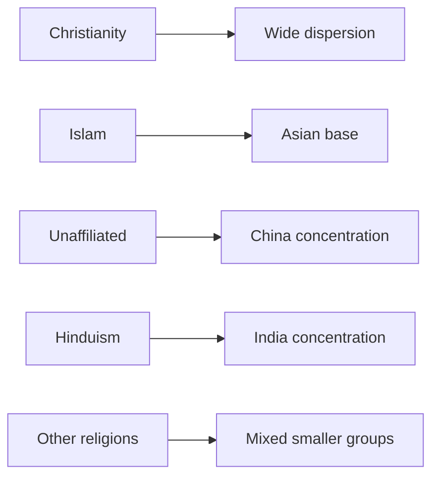

# World Religions by Population

## 1. Executive Summary

Global religious demography counts affiliation before it counts the intensity of belief. Pew Research Center's June 2025 estimates for 2010 and 2020 put Christians at 2.269 billion people in 2020, Muslims at 2.023 billion, the religiously unaffiliated at 1.905 billion, and Hindus at 1.178 billion. Christianity remained the largest category, but its share of world population fell between 2010 and 2020. Islam grew faster than any other major category, and the unaffiliated share also rose through religious disaffiliation. <SourceNote>[Pew Research Center, How the Global Religious Landscape Changed From 2010 to 2020](https://www.pewresearch.org/religion/2025/06/09/how-the-global-religious-landscape-changed-from-2010-to-2020/) gives 2020 shares of 28.8% Christian, 25.6% Muslim, 24.2% unaffiliated, 14.9% Hindu, 4.1% Buddhist, 2.2% other religions, and 0.2% Jewish.</SourceNote>

| Category | 2020 estimate | World share | How to read it |
| --- | ---: | ---: | --- |
| Christianity | 2.269 billion | 28.8% | Widely dispersed |
| Islam | 2.023 billion | 25.6% | Thick Asian base |
| Religiously unaffiliated | 1.905 billion | 24.2% | Strong China concentration |
| Hinduism | 1.178 billion | 14.9% | India concentration |
| Buddhism | 324 million | 4.1% | East and Southeast Asia focus |
| Other religions | 172 million | 2.2% | Folk traditions, Sikhs, Jains, and others |
| Judaism | 14.8 million | 0.2% | Israel and U.S. concentration |

Ranking religions by size is not enough. Christianity is the world's largest group, yet the United States, its largest country population, accounts for less than one-tenth of the world's Christians. Islam has large populations in Indonesia, Pakistan, India, and Bangladesh. Hinduism is concentrated in India and Nepal. Buddhism's largest populations are in Thailand, China, Myanmar, and Japan. Smaller religions require a separate reading because Pew's seven-category table groups many traditions into "other religions."

## 2. What the Counts Measure

Religious population statistics usually do not directly measure what people believe. Censuses and surveys ask people about religious affiliation, then researchers group those answers. Pew's 2025 estimates use seven categories: Christians, Muslims, Hindus, Buddhists, Jews, people who belong to other religions, and the religiously unaffiliated. Pew covers 201 countries and territories that had at least 100,000 people in 2010 or 2020, together covering 99.98% of the world's population. <SourceNote>[Pew Research Center, Dataset of Global Religious Composition Estimates for 2010 and 2020](https://www.pewresearch.org/dataset/dataset-of-global-religious-composition-estimates-for-2010-and-2020/) describes the seven categories, 201 countries and territories, more than 2,700 data sources, and the use of UN World Population Prospects 2024 totals.</SourceNote>

Religious population therefore differs from the number of regular worshippers or doctrinal believers. In East Asia, people may report no religious affiliation while still practicing ancestor rites, visiting temples and shrines, or maintaining folk religious customs. Among affiliated populations, some people participate rarely. Religious population distribution is best read as a social and statistical affiliation map. <SourceNote>[Pew Research Center, Measuring Religion in China](https://www.pewresearch.org/religion/2023/08/30/measuring-religion-in-china/) and [Our World in Data, Religion](https://ourworldindata.org/religion) discuss how self-reporting, question wording, and cultural context shape religious measurement.</SourceNote>

## 3. Major Religions by Population

### 3.1 Christianity

Christians numbered 2.269 billion in 2020, equal to 28.8% of world population. The top 10 countries together accounted for 46.8% of the world's Christians, so Christianity is more geographically dispersed than several other major religions. Natural increase in sub-Saharan Africa and Christian disaffiliation in Europe moved the regional center of gravity southward. <SourceNote>[Pew's 2025 report PDF](https://www.pewresearch.org/wp-content/uploads/sites/20/2025/06/PR_2025.06.09_global-religious-change_report.pdf) country tables put the top 10 Christian countries at 1.062 billion people, or 46.8% of the world's Christians. Pew's text also reports that sub-Saharan Africa had surpassed Europe by 2020 as the region with the most Christians.</SourceNote>

| Country | People | Country share | World group share |
| --- | ---: | ---: | ---: |
| United States | 217.3 million | 64.0% | 9.6% |
| Brazil | 168.3 million | 80.7% | 7.4% |
| Mexico | 113.1 million | 89.2% | 5.0% |
| Philippines | 102.5 million | 91.5% | 4.5% |
| Russia | 102.4 million | 69.9% | 4.5% |
| Nigeria | 92.8 million | 43.4% | 4.1% |
| DR Congo | 92.4 million | 96.3% | 4.1% |
| Ethiopia | 73.2 million | 61.6% | 3.2% |
| South Africa | 51.6 million | 85.3% | 2.3% |
| Italy | 48.2 million | 80.5% | 2.1% |

Pew's 2020 seven-category table does not split Christians by denomination. Pew's 2011 Global Christianity report, using a 2010 Christian total of 2.18 billion, grouped Christians as about 50% Catholic, 37% Protestant broadly defined, 12% Orthodox, and 1% other Christians. This older denominator should not be treated as a fresh 2020 denominational table, but it remains a useful guide to the main Christian families. <SourceNote>[Pew Research Center, Global Christianity](https://www.pewresearch.org/religion/2011/12/19/global-christianity-exec/) reports that about half of Christians were Catholic, 37% Protestant broadly defined, 12% Orthodox, and 1% other Christians in 2010. The page now notes that Pew revised 2010 religious composition estimates in the 2025 report.</SourceNote>

### 3.2 Islam

Muslims numbered 2.023 billion in 2020, equal to 25.6% of world population. The top four countries were Indonesia, Pakistan, India, and Bangladesh, so the world's Muslim population cannot be understood through the Middle East and North Africa alone. India has a Hindu majority, but it also has one of the world's largest Muslim populations in absolute terms.

| Country | People | Country share | World group share |
| --- | ---: | ---: | ---: |
| Indonesia | 239.0 million | 87.0% | 11.8% |
| Pakistan | 226.9 million | 96.5% | 11.2% |
| India | 213.1 million | 15.2% | 10.5% |
| Bangladesh | 151.4 million | 91.1% | 7.5% |
| Nigeria | 120.0 million | 56.1% | 5.9% |
| Egypt | 104.0 million | 95.2% | 5.1% |
| Iran | 87.5 million | 99.8% | 4.3% |
| Turkey | 83.6 million | 97.1% | 4.1% |
| Sudan | 46.3 million | 98.9% | 2.3% |
| Algeria | 43.3 million | 98.4% | 2.1% |

Pew's 2009 sectarian estimate put 87% to 90% of Muslims worldwide in Sunni Islam and 10% to 13% in Shia Islam. It estimated that 68% to 80% of Shias lived in four countries: Iran, Pakistan, India, and Iraq. Pew also cautioned that Sufi practice crosses Sunni and Shia communities, and that reliable global figures for Sufi practice are not available. <SourceNote>[Pew Research Center, Mapping the Global Muslim Population](https://www.pewresearch.org/religion/2009/10/07/mapping-the-global-muslim-population/) estimated 87% to 90% Sunni, 10% to 13% Shia, and a strong Shia concentration in Iran, Pakistan, India, and Iraq.</SourceNote>

### 3.3 Religiously Unaffiliated

The religiously unaffiliated numbered 1.905 billion in 2020, equal to 24.2% of world population. This category includes atheists, agnostics, and people with no particular religion, but it does not mean that everyone in the category lacks ritual practice or ancestral observance. China alone accounted for 67.1% of the world's unaffiliated population.

| Country | People | Country share | World group share |
| --- | ---: | ---: | ---: |
| China | 1.278 billion | 89.6% | 67.1% |
| United States | 100.9 million | 29.7% | 5.3% |
| Japan | 72.6 million | 57.5% | 3.8% |
| Vietnam | 66.4 million | 67.7% | 3.5% |
| Germany | 30.2 million | 36.1% | 1.6% |
| Russia | 29.6 million | 20.2% | 1.6% |
| Brazil | 28.1 million | 13.5% | 1.5% |
| France | 28.1 million | 42.6% | 1.5% |
| United Kingdom | 27.1 million | 40.2% | 1.4% |
| South Korea | 25.0 million | 48.3% | 1.3% |

Unaffiliated growth does not come from a high-fertility population base. Pew argues that people leaving the religion in which they were raised, especially Christianity, helped raise the unaffiliated share despite older age structure and low fertility. In China and Japan, an unaffiliated response should not be read as the absence of religious culture.

### 3.4 Hinduism

Hindus numbered 1.178 billion in 2020, equal to 14.9% of world population. India alone accounted for 94.5% of the world's Hindus. India and Nepal together accounted for more than 96%, which makes Hinduism large globally but highly concentrated geographically.

| Country | People | Country share | World group share |
| --- | ---: | ---: | ---: |
| India | 1.113 billion | 79.4% | 94.5% |
| Nepal | 23.5 million | 81.2% | 2.0% |
| Bangladesh | 13.1 million | 7.9% | 1.1% |
| Pakistan | 5.0 million | 2.1% | 0.4% |
| Indonesia | 4.4 million | 1.6% | 0.4% |
| Sri Lanka | 3.3 million | 14.5% | 0.3% |
| United States | 3.0 million | 0.9% | 0.3% |
| Malaysia | 2.1 million | 6.1% | 0.2% |
| United Kingdom | 1.1 million | 1.7% | 0.1% |
| United Arab Emirates | 1.1 million | 11.8% | 0.1% |

Hindu traditions include Vaishnavism, centered on Vishnu; Shaivism, centered on Shiva; and Shaktism, centered on goddess traditions. Reliable global subgroup counts are scarce. Pew's India survey found that 61% of Indian Hindus said there is one God with many manifestations, and that Hindus most often named Shiva at 44%, Hanuman at 35%, and Ganesha at 32% as deities they felt close to. That survey measured closeness to deities, not formal denominational membership. <SourceNote>[Pew Research Center, Beliefs about God in India](https://www.pewresearch.org/religion/2021/06/29/beliefs-about-god-in-india/) reports that 61% of Indian Hindus selected "one God with many manifestations," and that 44% felt close to Shiva, 35% to Hanuman, and 32% to Ganesha.</SourceNote>

### 3.5 Buddhism

Buddhists numbered 324 million in 2020, equal to 4.1% of world population. The top 10 countries together accounted for 91.2% of the world's Buddhists, showing strong Asia-Pacific concentration. Pew treats Buddhism as the only major category that declined in absolute population between 2010 and 2020.

| Country | People | Country share | World group share |
| --- | ---: | ---: | ---: |
| Thailand | 67.6 million | 94.4% | 20.9% |
| China | 53.4 million | 3.7% | 16.5% |
| Myanmar | 47.2 million | 89.1% | 14.6% |
| Japan | 47.0 million | 37.2% | 14.5% |
| Vietnam | 22.6 million | 23.0% | 7.0% |
| Cambodia | 16.2 million | 97.1% | 5.0% |
| Sri Lanka | 15.7 million | 69.6% | 4.8% |
| South Korea | 9.9 million | 19.0% | 3.0% |
| India | 9.6 million | 0.7% | 2.9% |
| Malaysia | 6.4 million | 18.9% | 2.0% |

Buddhism is often described through three broad branches: Mahayana, Theravada, and Vajrayana. Pew's 2012 overview said Mahayana is prevalent in countries with large Buddhist populations such as China, Japan, South Korea, and Vietnam; Theravada is concentrated in Thailand, Myanmar, Sri Lanka, Laos, and Cambodia; and Vajrayana is concentrated in Tibet, Nepal, Bhutan, and Mongolia. Most censuses do not measure Buddhist branches, so 2020 country counts and branch counts cannot be placed on the same statistical footing. <SourceNote>[Pew Research Center, Buddhists](https://www.pewresearch.org/religion/2012/12/18/global-religious-landscape-buddhist/) explains the three major branches and their country concentrations.</SourceNote>

### 3.6 Other Religions and Smaller Traditions

Pew's 2020 seven-category table put other religions at 172 million people, or 2.2% of world population. This category includes Baha'is, Daoists, Jains, Shintoists, Sikhs, adherents of folk religions, Wiccans, Zoroastrians, and many other groups. China, India, Taiwan, and Brazil are large in this combined category, but the category means different things in different countries.

| Country or territory | People | Country share | World group share |
| --- | ---: | ---: | ---: |
| China | 43.1 million | 3.0% | 25.1% |
| India | 35.7 million | 2.5% | 20.7% |
| Taiwan | 12.2 million | 51.7% | 7.1% |
| Brazil | 11.9 million | 5.7% | 6.9% |
| North Korea | 6.6 million | 25.2% | 3.8% |
| South Africa | 5.4 million | 8.9% | 3.1% |
| United States | 4.1 million | 1.2% | 2.4% |
| Japan | 3.6 million | 2.9% | 2.1% |
| South Sudan | 3.5 million | 32.8% | 2.0% |
| Laos | 2.5 million | 34.2% | 1.5% |

Pew's seven-category table is not enough to count smaller religions by name. For example, Indian government data based on the 2011 census counted 20.8 million Sikhs, 4.45 million Jains, and 8.44 million Buddhists in India. These are India counts, not world totals, but they anchor any reading of Sikh and Jain distribution. <SourceNote>[Press Information Bureau, Government of India](https://www.pib.gov.in/PressReleaseIframePage.aspx?PRID=1797307) gives 2011 census counts of 20,833,116 Sikhs, 4,451,753 Jains, and 8,442,972 Buddhists in India.</SourceNote>

| Tradition | Countries or regions to check first | How to read the count |
| --- | --- | --- |
| Sikhism | India, Canada, United Kingdom, United States | 20.8 million in India in 2011 |
| Jainism | India, United States, United Kingdom | 4.45 million in India in 2011 |
| Daoism and Chinese folk religion | China, Taiwan, Chinese diaspora communities | Often inside Pew's "other religions" for China and Taiwan |
| Shinto | Japan | May appear inside Pew's "other religions" for Japan |
| Baha'i, Zoroastrian, Wiccan, and others | Dispersed across countries | Often not separated in national census categories |

### 3.7 Judaism

Jews numbered about 14.78 million in 2020, equal to 0.2% of world population. Israel and the United States together accounted for 84.7% of the world's Jews. Pew's global table counts Jewish religious affiliation, so it does not match broader estimates of ethnic or cultural Jewish identity.

| Country | People | Country share | World group share |
| --- | ---: | ---: | ---: |
| Israel | 6.78 million | 77.0% | 45.9% |
| United States | 5.73 million | 1.7% | 38.8% |
| France | 460,000 | 0.7% | 3.1% |
| Canada | 350,000 | 0.9% | 2.4% |
| United Kingdom | 300,000 | 0.4% | 2.0% |
| Argentina | 170,000 | 0.4% | 1.2% |
| Russia | 120,000 | 0.1% | 0.8% |
| Germany | 120,000 | 0.1% | 0.8% |
| Australia | 110,000 | 0.4% | 0.7% |
| Brazil | 90,000 | 0.0% | 0.6% |

For U.S. denominational identity, Pew's Jewish Americans in 2020 survey found that 37% of U.S. Jewish adults identified with Reform Judaism, 17% with Conservative Judaism, 9% with Orthodox Judaism, 32% with no particular denomination, and 4% with smaller branches such as Reconstructionist or Humanist Judaism, or multiple streams. These figures describe U.S. adults, not global Judaism. <SourceNote>[Pew Research Center, Jewish identity and belief in the U.S.](https://www.pewresearch.org/religion/2021/05/11/jewish-identity-and-belief/) gives U.S. Jewish adult branch identification of 37% Reform, 17% Conservative, 9% Orthodox, 32% no denomination, and 4% other or multiple streams.</SourceNote>

## 4. How to Connect Judaism, Evangelicals, and Palestine

Judaism and evangelical Protestantism should be connected in one specific setting: when explaining the pro-Israel political coalition in the United States. The connection should not become a claim that Jews and evangelicals form one religious or political bloc. Judaism is a small global religious and ethnic community, while White evangelical Protestants are a large U.S. Christian conservative constituency. They often overlap in support for Israel, but they differ in theology, history, population size, and party composition. <SourceNote>[PRRI, 2023 Census of American Religion](https://prri.org/research/census-2023-american-religion/) estimates White evangelical Protestants at 13% of the U.S. population and Jewish Americans at 2%. Pew's global table puts Jews worldwide at about 14.78 million in 2020.</SourceNote>

| Lens | Judaism and U.S. Jews | White evangelicals | How to read it |
| --- | --- | --- | --- |
| Population | About 14.78 million worldwide, 5.73 million in the U.S. | About 13% of the U.S. population | Evangelicals carry larger electoral weight in U.S. politics |
| Link to Israel | Peoplehood, religion, family history, security | Biblical interpretation, conservative politics, Middle East policy | The reasons for support differ |
| Internal variation | Reform, Conservative, Orthodox, no denomination | Generational, racial, and church differences | Avoid treating either side as one bloc |
| Palestine frame | Security, hostages, antisemitism, criticism of government | Hamas criticism, Israel alliance, religious-right politics | Separate Palestinians, the PA, and Hamas |

U.S. Jews and White evangelical Protestants often appear close in U.S. opinion data on Israel. Pew's 2024 survey found that 89% of U.S. Jews and 74% of White evangelical Protestants said Israel had valid reasons to fight Hamas. In the same survey, 62% of U.S. Jews and 61% of White evangelicals said Israel's military response was at least somewhat acceptable. But 31% of Jews said the way both Israel and Hamas were fighting was unacceptable, compared with 15% of White evangelicals. Similar pro-Israel toplines can hide different room for criticizing the Israeli government. <SourceNote>[Pew Research Center, Views of the Israel-Hamas war](https://www.pewresearch.org/2024/03/21/views-of-the-israel-hamas-war/) reports religious-group differences in views of Israel's reasons for fighting and its conduct of the war.</SourceNote>

It is risky both to detach U.S. Jews from Israel too much and to equate them with Israel. Pew's 2020 survey found that 45% of U.S. Jews said caring about Israel is essential to what being Jewish means to them, and another 37% said it is important but not essential. Together, 82% called it important or essential. Yet views of Israeli governments, settlements, military conduct, and Palestinian policy vary. The religious population category "Jewish" should not be collapsed into the state of Israel, the Netanyahu government, or the political opinions of U.S. Jews. <SourceNote>[Pew Research Center, U.S. Jews' connections with and attitudes toward Israel](https://www.pewresearch.org/religion/2021/05/11/u-s-jews-connections-with-and-attitudes-toward-israel/) reports that 45% of U.S. Jews call caring about Israel essential and 37% call it important.</SourceNote>

Views of Palestine need at least four separate objects: Palestinians as a people, the Palestinian Authority, Hamas, and the Israeli government's conduct. In the U.S., Pew's 2025 survey found that 70% of Democrats and Democratic leaners viewed the Palestinian people favorably, compared with 37% of Republicans and Republican leaners. At the same time, 68% of U.S. adults viewed the Palestinian Authority unfavorably and 84% viewed Hamas unfavorably. Sympathy for Palestinians therefore does not imply support for the PA or Hamas. <SourceNote>[Pew Research Center, Americans' views of Israelis, Palestinians and their political leadership](https://www.pewresearch.org/politics/2025/10/03/americans-views-of-israelis-palestinians-and-their-political-leadership/) separates views of Israelis, the Israeli government, Palestinians, the Palestinian Authority, and Hamas.</SourceNote>

Outside the United States, the broader climate has become much more critical of Israel. Pew's 2026 survey across 36 countries found a median of 67% with an unfavorable view of Israel and 25% with a favorable view. Negative views were especially strong in surveyed Muslim-majority places, Europe, and among many younger or left-leaning publics. Some sub-Saharan African countries remained more favorable. This is not a direct measure of support for Palestinians, but it shows that post-Gaza-war international opinion increasingly reads Palestine through criticism of the Israeli government, concern over civilian harm, and dissatisfaction with U.S. policy. <SourceNote>[Pew Research Center, Negative views of Israel, low confidence in Netanyahu across 36 countries](https://www.pewresearch.org/short-reads/2026/06/04/most-people-across-36-countries-have-negative-views-of-israel-and-little-confidence-in-netanyahu/) reports a 36-country median of 67% unfavorable and 25% favorable toward Israel.</SourceNote>

Israeli public opinion is also not monolithic. Pew's 2024 Israel survey found that 39% of Israelis said the military response to Hamas had been about right, 34% said it had not gone far enough, and 19% said it had gone too far. On the Israeli left, 55% said the response had gone too far, compared with 5% on the right. Views of Palestine therefore move along different axes in international opinion, U.S. religious politics, Israeli domestic politics, and Palestinian internal politics. Religious population tables should not be used to infer diplomatic positions or views of war directly. <SourceNote>[Pew Research Center, Israeli Views of the Israel-Hamas War](https://www.pewresearch.org/global/2024/05/30/israeli-views-of-the-israel-hamas-war/) reports Israeli views of military response and ideological differences.</SourceNote>

## 5. Country-Level Diversity

The world looks religiously plural, but most countries have one dominant category. Pew's 2026 Religious Diversity Index analysis found that in 194 of 201 countries and territories, at least half the population falls into one religious category. In 43 places, at least 95% of the population belongs to one category. A world with several large religions does not automatically produce high interreligious contact inside every country. <SourceNote>[Pew Research Center, Religious Diversity Around the World](https://www.pewresearch.org/religion/2026/02/12/religious-diversity-around-the-world/) reports one majority category in 194 countries and territories, and 95% concentration in 43 places.</SourceNote>

Highly diverse countries are not always the largest countries. Pew ranked Singapore as the most religiously diverse country in 2020. Among very large countries, the United States, Nigeria, Russia, India, and Brazil ranked relatively high. The Middle East and North Africa was 94% Muslim in Pew's regional classification, making it the least diverse region in the index. <SourceNote>[Pew Research Center, Religious diversity by region](https://www.pewresearch.org/religion/2026/02/12/religious-diversity-around-the-world/#religious-diversity-by-region) ranks Asia-Pacific as the most diverse region and Middle East-North Africa as the least diverse region.</SourceNote>

## 6. Reading Projections

Religious population projections depend on assumptions about fertility, age structure, mortality, migration, and religious switching. Pew's 2015 projection estimated that Christians would account for 31% and Muslims for 30% of world population in 2050. But that projection used the 2010 baseline available at the time. Pew revised 2010 estimates and added 2020 estimates in its 2025 work, so the 2015 2050 figures should be read as an older demographic scenario rather than a current fixed forecast. <SourceNote>[Pew Research Center, The Future of World Religions](https://www.pewresearch.org/religion/2015/04/02/religious-projections-2010-2050/) projected about 2.9 billion Christians and 2.8 billion Muslims in 2050. Pew's 2025 estimates revised the earlier 2010 baseline, so older projections need cautious use.</SourceNote>

Two forces matter for the 2020s and beyond. Some regions with high religious affiliation still have relatively high fertility. At the same time, religious disaffiliation has grown in parts of Europe, North America, East Asia, and Oceania. Global religion is neither a simple secularization story nor a simple religious resurgence story. Regional population growth and religious switching need to be read together.

## 7. Uses and Limits

Religious population distribution helps with international relations, migration, education, welfare, party politics, conflict research, and regional business analysis. The numbers do not explain societies on their own. Christianity, Islam, Buddhism, Hinduism, and other traditions contain internal differences by denomination, practice, institution, state relationship, and generation. Pew's seven categories support global comparison, but they compress local religious life.

A careful reading uses three steps. First, read global counts and shares. Second, check regional and country concentration. Third, keep self-reporting, survey design, and cultural-practice limits in view. Religious demography is a map of population and social classification, not a map of inner belief.
