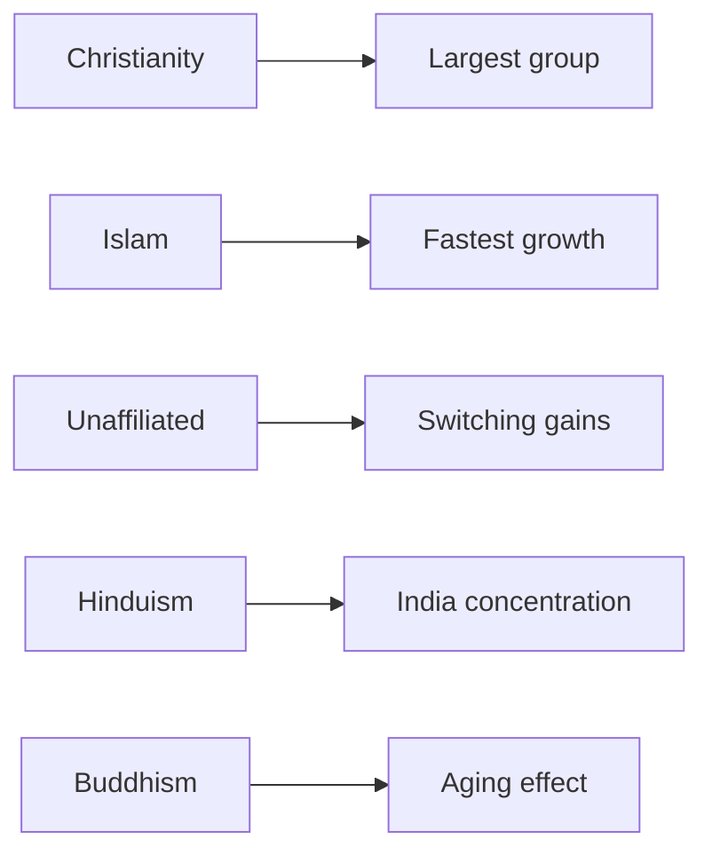

# World Religions by Population

## 1. Executive Summary

Global religious demography measures affiliation before it measures intensity of belief. Pew Research Center's 2025 estimates for 2010 and 2020 put Christians at about 2.3 billion people in 2020, Muslims at about 2.0 billion, the religiously unaffiliated at about 1.9 billion, and Hindus at about 1.2 billion. Christians remained the largest group, but their share of world population fell from 2010 to 2020. Muslims grew faster than any other major category, and the unaffiliated share also rose through religious switching and disaffiliation. <SourceNote>[Pew Research Center, How the Global Religious Landscape Changed From 2010 to 2020](https://www.pewresearch.org/religion/2025/06/09/how-the-global-religious-landscape-changed-from-2010-to-2020/) gives 2020 shares of 28.8% Christian, 25.6% Muslim, 24.2% unaffiliated, and 14.9% Hindu.</SourceNote>

| Category | 2020 estimated population | World share | Change since 2010 |
| --- | ---: | ---: | --- |
| Christian | About 2.3 billion | 28.8% | Count rose, share fell |
| Muslim | About 2.0 billion | 25.6% | Count and share rose |
| Religiously unaffiliated | About 1.9 billion | 24.2% | Count and share rose |
| Hindu | About 1.2 billion | 14.9% | Grew near global pace |
| Buddhist | About 324 million | 4.1% | Count fell |
| Other religions | About 170 million scale | 2.2% | Share held steady |
| Jewish | About 14.8 million | 0.2% | Share held steady |

The table also shows why a ranking alone misleads. Christianity is the most geographically dispersed group. Islam has large populations across Asia, North Africa, the Middle East, and sub-Saharan Africa. Hinduism is heavily concentrated in India. Buddhism is centered in East and Southeast Asia and is exposed to low fertility and population aging. The religiously unaffiliated are concentrated in China, Japan, and parts of Europe and North America. <SourceNote>[Our World in Data, Religion](https://ourworldindata.org/religion) explains that religious affiliation data records self-identification through surveys, censuses, and registers, rather than worship frequency or detailed belief.</SourceNote>

## 2. What the Counts Measure

Religious population statistics usually do not directly measure belief. Censuses and surveys ask people about religious affiliation, then researchers group those answers. Pew's 2025 estimates use seven categories: Christians, Muslims, Hindus, Buddhists, Jews, people who belong to other religions, and the religiously unaffiliated. Pew covers 201 countries and territories that had at least 100,000 people in 2010 or 2020, together covering 99.98% of the world population. <SourceNote>[Pew Research Center, Dataset of Global Religious Composition Estimates for 2010 and 2020](https://www.pewresearch.org/dataset/dataset-of-global-religious-composition-estimates-for-2010-and-2020/) describes the seven categories, 201 countries and territories, more than 2,700 data sources, and use of UN World Population Prospects 2024 totals.</SourceNote>

Religious population therefore differs from the number of regular worshippers or doctrinal believers. In East Asia, people may report no religious affiliation while still practicing ancestor rites, visiting temples and shrines, or maintaining folk religious customs. In affiliated populations, some people participate rarely. Religious population distribution is best read as a social and statistical affiliation map. <SourceNote>[Pew Research Center, Measuring Religion in China](https://www.pewresearch.org/religion/2023/08/30/measuring-religion-in-china/) and [Our World in Data, Data quality and biases](https://ourworldindata.org/religion#data-quality-and-biases) discuss how self-reporting, question wording, and cultural context shape religious measurement.</SourceNote>

## 3. Global Distribution

Christianity was the largest category in 2020. Its world share fell from 30.6% in 2010 to 28.8% in 2020. Pew attributes much of this decline to disaffiliation from Christianity. The Christian population grew in absolute terms, but it did not keep pace with total world population growth. <SourceNote>[Pew Research Center, Christian population change](https://www.pewresearch.org/religion/2025/06/09/christian-population-change/) reports that Christians grew from about 2.1 billion in 2010 to about 2.3 billion in 2020, while their world share fell from 31% to 29%.</SourceNote>

Muslims increased by about 347 million people from 2010 to 2020. That was the largest increase across Pew's seven categories, and the Muslim share of world population rose from 23.9% to 25.6%. Age structure and fertility in Muslim-majority and Muslim-minority countries explain more than conversion alone. <SourceNote>[Pew Research Center, Islam was the world's fastest-growing religion from 2010 to 2020](https://www.pewresearch.org/short-reads/2025/06/10/islam-was-the-worlds-fastest-growing-religion-from-2010-to-2020/) summarizes the increase to about 2.0 billion Muslims by 2020.</SourceNote>

The religiously unaffiliated formed the third-largest category in 2020. This group is highly concentrated in China, which accounts for about two-thirds of all unaffiliated people. Pew argues that the unaffiliated share rose despite an older age profile and lower fertility because many people left the religion in which they were raised, especially Christianity. <SourceNote>[Pew Research Center, Overview](https://www.pewresearch.org/religion/2025/06/09/how-the-global-religious-landscape-changed-from-2010-to-2020/) estimates the unaffiliated at about 1.9 billion people, 24.2% of world population, and China's unaffiliated population at about 1.3 billion.</SourceNote>

## 4. Regional Distribution

Regional geography changes the story. Christianity cannot be explained through Europe alone. By 2020, sub-Saharan Africa had surpassed Europe as the region with the largest number of Christians. Pew links that shift to natural increase in sub-Saharan Africa and Christian disaffiliation in Europe. <SourceNote>[Pew Research Center, Regional change](https://www.pewresearch.org/religion/2025/06/09/how-the-global-religious-landscape-changed-from-2010-to-2020/#regional-change) reports that 30.7% of the world's Christians lived in sub-Saharan Africa in 2020, compared with 22.3% in Europe.</SourceNote>

Islam is also broader than the Middle East and North Africa. Large Muslim populations live in South Asia, Southeast Asia, and sub-Saharan Africa. India has a Hindu majority, but it also has one of the world's largest Muslim populations in absolute terms. Religious demography needs both shares and counts. <SourceNote>[Our World in Data, Religion](https://ourworldindata.org/religion) notes that many Muslims live in Asia, with large shares also in North Africa, the Middle East, and sub-Saharan Africa.</SourceNote>

Hinduism is large globally but geographically concentrated. Pew's diversity analysis says 95% of Hindus live in India. Buddhism is also centered in Asia, but low fertility and aging in East and Southeast Asia contributed to its status as the only major category that declined in absolute population from 2010 to 2020. <SourceNote>[Pew Research Center, Religious Diversity Around the World](https://www.pewresearch.org/religion/2026/02/12/religious-diversity-around-the-world/) describes Hindu concentration in India and Buddhist distribution across countries with different diversity levels.</SourceNote>

## 5. Diversity at Country Scale

The world looks religiously plural, but most countries have one dominant category. Pew's 2026 Religious Diversity Index analysis finds that in 194 of 201 countries and territories, at least half of the population falls into one religious category. In 43 places, at least 95% of the population belongs to one category. A world with several large religions does not automatically produce daily interreligious contact everywhere. <SourceNote>[Pew Research Center, Religious Diversity Around the World](https://www.pewresearch.org/religion/2026/02/12/religious-diversity-around-the-world/) reports majority categories in 194 countries and territories and 95% concentration in 43 places.</SourceNote>

Highly diverse countries are not always the largest countries. Pew ranks Singapore as the most religiously diverse country in 2020. Among very large countries, the United States, Nigeria, Russia, India, and Brazil rank relatively high. The Middle East and North Africa, by contrast, is 94% Muslim in Pew's regional classification and is the least diverse region in the index. <SourceNote>[Pew Research Center, Religious diversity by region](https://www.pewresearch.org/religion/2026/02/12/religious-diversity-around-the-world/#religious-diversity-by-region) ranks Asia-Pacific as the most diverse region and Middle East-North Africa as the least diverse region.</SourceNote>

## 6. Reading Projections

Religious population projections depend on assumptions about fertility, age structure, mortality, migration, and religious switching. Pew's 2015 projection estimated that Christians would account for 31% and Muslims for 30% of the world population in 2050. That projection used a 2010 baseline, while Pew's 2025 work revised the 2010 estimates and added 2020 estimates. Treat the 2050 numbers as a scenario for demographic direction, not as a current best estimate. <SourceNote>[Pew Research Center, The Future of World Religions](https://www.pewresearch.org/religion/2015/04/02/religious-projections-2010-2050/) projected about 2.9 billion Christians and 2.8 billion Muslims in 2050. Pew's 2025 estimates revised the earlier 2010 baseline, so old projections need cautious use until updated projections appear.</SourceNote>

Two forces matter most for the 2020s and beyond. Religious affiliation remains high in many high-fertility regions. At the same time, religious disaffiliation has grown in parts of Europe, North America, East Asia, and Oceania. These forces move together, so global religion is neither a simple secularization story nor a simple religious resurgence story. Regional population growth and religious switching need to be read together. <SourceNote>[Our World in Data, Future changes in religious affiliation](https://ourworldindata.org/religion#future-changes-in-religious-affiliation) explains that countries with low religious affiliation often have very low fertility, while many highly religious countries still have faster population growth.</SourceNote>

## 7. Uses and Limits

Religious population distribution helps with international relations, migration, education, welfare, party politics, conflict research, and regional business analysis. The numbers do not explain societies on their own. Christianity, Islam, Buddhism, Hinduism, and other traditions contain internal differences by denomination, practice, institution, state relationship, and generation. Pew's seven categories support global comparison but compress many local differences.

A careful reading uses three steps. First, read global counts and shares. Second, check regional and country concentration. Third, keep self-reporting, survey design, and cultural practice as limits. Religious demography is a map of population and social classification, not a map of inner belief.
