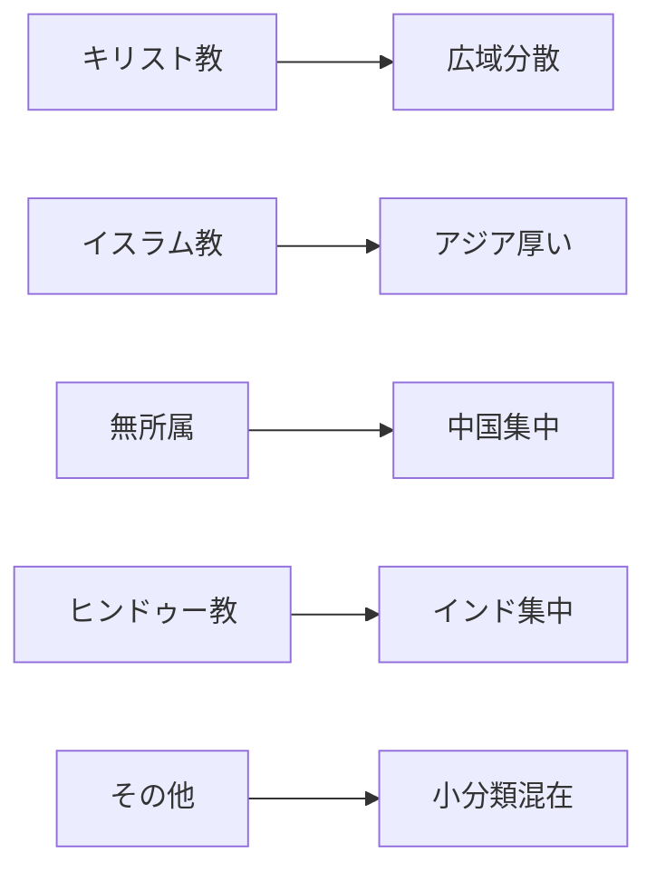

# 世界の宗教人口分布

## 1. エグゼクティブサマリー

世界の宗教人口を見るときは、信仰の強さではなく、まず本人または統計がどの宗教所属に分類したかを読む必要がある。Pew Research Centerが2025年6月に公表した2010年・2020年推計は、2020年時点でキリスト教徒を22.69億人、イスラム教徒を20.23億人、宗教的無所属を19.05億人、ヒンドゥー教徒を11.78億人と見積もる。キリスト教は最大分類だが、2010年から2020年にかけて世界人口に占める比率を下げた。イスラム教は主要分類の中で最も速く増え、無所属も宗教離脱の影響で比率を上げた。<SourceNote>[Pew Research Center, How the Global Religious Landscape Changed From 2010 to 2020](https://www.pewresearch.org/religion/2025/06/09/how-the-global-religious-landscape-changed-from-2010-to-2020/) は2020年推計として、キリスト教28.8%、イスラム教25.6%、無所属24.2%、ヒンドゥー教14.9%、仏教4.1%、その他の宗教2.2%、ユダヤ教0.2%を示す。</SourceNote>

| 分類 | 2020年推計 | 世界比 | 分布の読み方 |
| --- | ---: | ---: | --- |
| キリスト教 | 22.69億人 | 28.8% | 地理的に広い |
| イスラム教 | 20.23億人 | 25.6% | 南・東南アジアにも大きい |
| 宗教的無所属 | 19.05億人 | 24.2% | 中国に強く集中 |
| ヒンドゥー教 | 11.78億人 | 14.9% | インドに集中 |
| 仏教 | 3.24億人 | 4.1% | 東・東南アジア中心 |
| その他の宗教 | 1.72億人 | 2.2% | 民間信仰、シク教、ジャイナ教などを含む |
| ユダヤ教 | 0.15億人 | 0.2% | イスラエルと米国に集中 |

宗教人口は大きい順に並べるだけでは足りない。キリスト教は世界最大だが、最大国の米国でも世界のキリスト教徒の1割弱にとどまる。イスラム教はインドネシア、パキスタン、インド、バングラデシュに厚い人口を持つ。ヒンドゥー教はインドとネパールで世界の大半を占める。仏教はタイ、中国、ミャンマー、日本の合計が大きい。少数宗教は、Pewの七分類では「その他の宗教」にまとめられるため、国別のまとまりと、別資料で確認できるシク教・ジャイナ教などを分けて読む必要がある。

## 2. 何を数えているのか

宗教人口統計は、通常、何を信じているかを直接測らない。国勢調査や調査票は回答者に宗教所属を尋ね、研究者が回答を集約する。Pewの2025年推計は、キリスト教、イスラム教、ヒンドゥー教、仏教、ユダヤ教、その他の宗教、宗教的無所属という七分類で世界201カ国・地域を整理する。対象は2010年または2020年に人口10万人以上だった国・地域で、世界人口の99.98%を覆う。<SourceNote>[Pew Research Center, Dataset of Global Religious Composition Estimates for 2010 and 2020](https://www.pewresearch.org/dataset/dataset-of-global-religious-composition-estimates-for-2010-and-2020/) は七分類、201カ国・地域、2,700超の資料、UN World Population Prospects 2024の人口総数を方法上の基礎としている。</SourceNote>

このため、宗教人口は礼拝に通う人の数や特定教義を信じる人の数と一致しない。東アジアでは、宗教団体に所属しない人が祖先祭祀、寺社参拝、民間信仰、儒教的儀礼を続けることがある。逆に、宗教所属を持つ人の中にも、日常的な実践頻度が低い人がいる。宗教人口分布は、社会的・統計的な所属分布として読むのが妥当である。<SourceNote>[Pew Research Center, Measuring Religion in China](https://www.pewresearch.org/religion/2023/08/30/measuring-religion-in-china/) と [Our World in Data, Religion](https://ourworldindata.org/religion) は、自己申告、設問、文化的文脈が宗教分類に影響する点を説明している。</SourceNote>

## 3. 主要宗教別に見る

### 3.1 キリスト教

キリスト教徒は2020年に22.69億人、世界人口の28.8%だった。上位10カ国を足しても世界のキリスト教徒の46.8%であり、キリスト教は主要宗教の中で地理的分散が大きい。サハラ以南アフリカの自然増と欧州の宗教離脱が同時に進み、地域重心は欧州から南へ移った。<SourceNote>[Pew 2025年報告PDF](https://www.pewresearch.org/wp-content/uploads/sites/20/2025/06/PR_2025.06.09_global-religious-change_report.pdf) の国別表は、キリスト教徒上位10カ国が計10.62億人、世界のキリスト教徒の46.8%を占めると示す。Pewの本文も、2020年にサハラ以南アフリカが欧州を上回り、世界で最も多くのキリスト教徒が住む地域になったと説明する。</SourceNote>

| 国 | 人数 | 国内比 | 世界内比 |
| --- | ---: | ---: | ---: |
| 米国 | 2.17億人 | 64.0% | 9.6% |
| ブラジル | 1.68億人 | 80.7% | 7.4% |
| メキシコ | 1.13億人 | 89.2% | 5.0% |
| フィリピン | 1.03億人 | 91.5% | 4.5% |
| ロシア | 1.02億人 | 69.9% | 4.5% |
| ナイジェリア | 0.93億人 | 43.4% | 4.1% |
| コンゴ民主共和国 | 0.92億人 | 96.3% | 4.1% |
| エチオピア | 0.73億人 | 61.6% | 3.2% |
| 南アフリカ | 0.52億人 | 85.3% | 2.3% |
| イタリア | 0.48億人 | 80.5% | 2.1% |

宗派別の世界推計は、Pewの2020年七分類表には含まれない。Pewの2011年Global Christianityは、2010年時点のキリスト教徒21.8億人について、カトリック約50%、プロテスタント広義37%、正教会12%、その他のキリスト教1%と整理した。これは2020年の国別表とは時点が違うため、現在の宗派比そのものとしては使えないが、世界キリスト教の大分類を読む目安になる。<SourceNote>[Pew Research Center, Global Christianity](https://www.pewresearch.org/religion/2011/12/19/global-christianity-exec/) は2010年時点で、カトリック約半数、プロテスタント広義37%、正教会12%、その他1%と説明する。同ページには2025年版で2010年推計が改訂されたという注記がある。</SourceNote>

### 3.2 イスラム教

イスラム教徒は2020年に20.23億人、世界人口の25.6%だった。上位4カ国はインドネシア、パキスタン、インド、バングラデシュであり、中東・北アフリカだけでは世界のイスラム教人口を説明できない。インドはヒンドゥー教徒が多数派の国だが、人数では世界有数のイスラム教徒人口を持つ。

| 国 | 人数 | 国内比 | 世界内比 |
| --- | ---: | ---: | ---: |
| インドネシア | 2.39億人 | 87.0% | 11.8% |
| パキスタン | 2.27億人 | 96.5% | 11.2% |
| インド | 2.13億人 | 15.2% | 10.5% |
| バングラデシュ | 1.51億人 | 91.1% | 7.5% |
| ナイジェリア | 1.20億人 | 56.1% | 5.9% |
| エジプト | 1.04億人 | 95.2% | 5.1% |
| イラン | 0.88億人 | 99.8% | 4.3% |
| トルコ | 0.84億人 | 97.1% | 4.1% |
| スーダン | 0.46億人 | 98.9% | 2.3% |
| アルジェリア | 0.43億人 | 98.4% | 2.1% |

宗派別には、Pewの2009年推計が世界のイスラム教徒の87から90%をスンナ派、10から13%をシーア派とした。シーア派の68から80%はイラン、パキスタン、インド、イラクの4カ国に住む。Pewはスーフィズムについて、スンナ派にもシーア派にもまたがる実践で、世界比を出せる信頼できる推計はないと書いている。<SourceNote>[Pew Research Center, Mapping the Global Muslim Population](https://www.pewresearch.org/religion/2009/10/07/mapping-the-global-muslim-population/) は、2009年時点でスンナ派87から90%、シーア派10から13%、シーア派の多数がイラン、パキスタン、インド、イラクに住むと推計した。</SourceNote>

### 3.3 宗教的無所属

宗教的無所属は2020年に19.05億人、世界人口の24.2%だった。この分類は無神論者、不可知論者、特定宗教なしの人を含むが、宗教的慣行や祖先祭祀を一切持たない人だけを意味しない。中国だけで世界の無所属の67.1%を占める。

| 国 | 人数 | 国内比 | 世界内比 |
| --- | ---: | ---: | ---: |
| 中国 | 12.78億人 | 89.6% | 67.1% |
| 米国 | 1.01億人 | 29.7% | 5.3% |
| 日本 | 0.73億人 | 57.5% | 3.8% |
| ベトナム | 0.66億人 | 67.7% | 3.5% |
| ドイツ | 0.30億人 | 36.1% | 1.6% |
| ロシア | 0.30億人 | 20.2% | 1.6% |
| ブラジル | 0.28億人 | 13.5% | 1.5% |
| フランス | 0.28億人 | 42.6% | 1.5% |
| 英国 | 0.27億人 | 40.2% | 1.4% |
| 韓国 | 0.25億人 | 48.3% | 1.3% |

無所属の増加は、低出生率の地域で自然増が大きいからではない。Pewは、キリスト教を中心に、育った宗教から離脱する人が無所属人口の比率上昇を支えたと分析する。中国や日本では、無所属という回答が宗教文化の不在を意味しない点も重要である。

### 3.4 ヒンドゥー教

ヒンドゥー教徒は2020年に11.78億人、世界人口の14.9%だった。インドだけで世界のヒンドゥー教徒の94.5%を占める。ネパールを含めると96%を超え、宗教人口の大きさに比べて地理的集中が強い。

| 国 | 人数 | 国内比 | 世界内比 |
| --- | ---: | ---: | ---: |
| インド | 11.13億人 | 79.4% | 94.5% |
| ネパール | 0.24億人 | 81.2% | 2.0% |
| バングラデシュ | 0.13億人 | 7.9% | 1.1% |
| パキスタン | 0.05億人 | 2.1% | 0.4% |
| インドネシア | 0.04億人 | 1.6% | 0.4% |
| スリランカ | 0.03億人 | 14.5% | 0.3% |
| 米国 | 0.03億人 | 0.9% | 0.3% |
| マレーシア | 0.02億人 | 6.1% | 0.2% |
| 英国 | 0.01億人 | 1.7% | 0.1% |
| アラブ首長国連邦 | 0.01億人 | 11.8% | 0.1% |

ヒンドゥー教内部には、ヴィシュヌを中心にするヴァイシュナヴァ、シヴァを中心にするシヴァ派、女神信仰を重視するシャークタなどの系統がある。ただし、世界のヒンドゥー教徒を宗派別に数える信頼できる国際統計は乏しい。Pewのインド調査では、インドのヒンドゥー教徒の61%が「神は一つで、多くの現れがある」と答え、最も近い神としてシヴァ44%、ハヌマーン35%、ガネーシャ32%を選んだ。この設問は宗派登録ではなく、信仰上の近さを測ったものとして読む必要がある。<SourceNote>[Pew Research Center, Beliefs about God in India](https://www.pewresearch.org/religion/2021/06/29/beliefs-about-god-in-india/) は、インドのヒンドゥー教徒の61%が「一つの神、多くの現れ」を選び、近い神としてシヴァ44%、ハヌマーン35%、ガネーシャ32%を選んだと報告する。</SourceNote>

### 3.5 仏教

仏教徒は2020年に3.24億人、世界人口の4.1%だった。上位10カ国だけで世界の仏教徒の91.2%を占め、アジア太平洋地域への集中が強い。Pewは、仏教を主要分類の中で唯一、2010年から2020年に人数が減った宗教と位置づける。

| 国 | 人数 | 国内比 | 世界内比 |
| --- | ---: | ---: | ---: |
| タイ | 0.68億人 | 94.4% | 20.9% |
| 中国 | 0.53億人 | 3.7% | 16.5% |
| ミャンマー | 0.47億人 | 89.1% | 14.6% |
| 日本 | 0.47億人 | 37.2% | 14.5% |
| ベトナム | 0.23億人 | 23.0% | 7.0% |
| カンボジア | 0.16億人 | 97.1% | 5.0% |
| スリランカ | 0.16億人 | 69.6% | 4.8% |
| 韓国 | 0.10億人 | 19.0% | 3.0% |
| インド | 0.10億人 | 0.7% | 2.9% |
| マレーシア | 0.06億人 | 18.9% | 2.0% |

仏教の大きな系統は、大乗、上座部、金剛乗として説明されることが多い。Pewの2012年整理では、大乗は中国、日本、韓国、ベトナムなどの大人口国で広く、上座部はタイ、ミャンマー、スリランカ、ラオス、カンボジアに集中し、金剛乗はチベット、ネパール、ブータン、モンゴルに集中する。多くの国勢調査は仏教内部の系統まで測らないため、2020年の国別人数と系統別人数を同じ精度で並べることはできない。<SourceNote>[Pew Research Center, Buddhists](https://www.pewresearch.org/religion/2012/12/18/global-religious-landscape-buddhist/) は、仏教の三大系統として大乗、上座部、金剛乗を説明し、国別の集中地域を示す。</SourceNote>

### 3.6 その他の宗教と少数宗教

Pewの2020年七分類では、その他の宗教が1.72億人、世界人口の2.2%だった。この箱には、バハイ教、道教、ジャイナ教、神道、シク教、民間信仰、ウィッカ、ゾロアスター教など、多くの小分類が入る。国別には中国、インド、台湾、ブラジルが大きいが、同じ「その他」でも内容は国によって違う。

| 国・地域 | 人数 | 国内比 | 世界内比 |
| --- | ---: | ---: | ---: |
| 中国 | 0.43億人 | 3.0% | 25.1% |
| インド | 0.36億人 | 2.5% | 20.7% |
| 台湾 | 0.12億人 | 51.7% | 7.1% |
| ブラジル | 0.12億人 | 5.7% | 6.9% |
| 北朝鮮 | 0.07億人 | 25.2% | 3.8% |
| 南アフリカ | 0.05億人 | 8.9% | 3.1% |
| 米国 | 0.04億人 | 1.2% | 2.4% |
| 日本 | 0.04億人 | 2.9% | 2.1% |
| 南スーダン | 0.04億人 | 32.8% | 2.0% |
| ラオス | 0.03億人 | 34.2% | 1.5% |

少数宗教を個別名で把握するには、Pewの七分類だけでは足りない。たとえばインド政府が2011年国勢調査に基づいて公表した人数では、インド国内にシク教徒2,083万人、ジャイナ教徒445万人、仏教徒844万人がいた。これは世界合計ではなくインド国内値だが、シク教とジャイナ教の世界分布を読むうえで重要な基準になる。<SourceNote>[Press Information Bureau, Government of India](https://www.pib.gov.in/PressReleaseIframePage.aspx?PRID=1797307) は2011年国勢調査に基づき、インド国内のシク教徒20,833,116人、ジャイナ教徒4,451,753人、仏教徒8,442,972人などを示す。</SourceNote>

| 宗教・伝統 | 確認しやすい国・地域 | 人数の読み方 |
| --- | --- | --- |
| シク教 | インド、カナダ、英国、米国 | インド2011年で2,083万人 |
| ジャイナ教 | インド、米国、英国など | インド2011年で445万人 |
| 道教・中国民間信仰 | 中国、台湾、東南アジア華人社会 | Pewでは中国・台湾の「その他」に多く含まれる |
| 神道 | 日本 | Pewでは日本の「その他」に含まれうる |
| バハイ教、ゾロアスター教、ウィッカなど | 国別に散在 | 多くの国勢調査で単独分類されない |

### 3.7 ユダヤ教

ユダヤ教徒は2020年に約1,478万人、世界人口の0.2%だった。イスラエルと米国だけで世界のユダヤ教徒の84.7%を占める。Pewの世界表は宗教としてのユダヤ教所属を数えるため、民族的・文化的なユダヤ人アイデンティティを含む広い推計とは一致しない。

| 国 | 人数 | 国内比 | 世界内比 |
| --- | ---: | ---: | ---: |
| イスラエル | 678万人 | 77.0% | 45.9% |
| 米国 | 573万人 | 1.7% | 38.8% |
| フランス | 46万人 | 0.7% | 3.1% |
| カナダ | 35万人 | 0.9% | 2.4% |
| 英国 | 30万人 | 0.4% | 2.0% |
| アルゼンチン | 17万人 | 0.4% | 1.2% |
| ロシア | 12万人 | 0.1% | 0.8% |
| ドイツ | 12万人 | 0.1% | 0.8% |
| オーストラリア | 11万人 | 0.4% | 0.7% |
| ブラジル | 9万人 | 0.0% | 0.6% |

米国の宗派意識を見ると、PewのJewish Americans in 2020は、米国ユダヤ人成人の37%が改革派、17%が保守派、9%が正統派、32%が特定宗派なし、4%が再建派・ヒューマニストなど小分派または複数系統と答えた。これは米国成人の内訳であり、世界全体の宗派比ではない。<SourceNote>[Pew Research Center, Jewish identity and belief in the U.S.](https://www.pewresearch.org/religion/2021/05/11/jewish-identity-and-belief/) は、米国ユダヤ人成人の宗派自己認識として改革派37%、保守派17%、正統派9%、特定宗派なし32%などを示す。</SourceNote>

## 4. 国別多様性で見る

世界全体は多宗教的に見えるが、多くの国では一つの宗教分類が多数派を占める。Pewの2026年Religious Diversity Index分析は、201カ国・地域のうち194で、人口の少なくとも半分が一つの宗教分類に入ると報告した。43カ国・地域では、一つの分類が人口の95%以上を占める。世界に複数の大宗教があることと、各国の日常生活で宗教間接触が多いことは同じではない。<SourceNote>[Pew Research Center, Religious Diversity Around the World](https://www.pewresearch.org/religion/2026/02/12/religious-diversity-around-the-world/) は、194カ国・地域で一つの宗教分類が過半を占め、43カ国・地域で95%以上を占めると報告する。</SourceNote>

宗教多様性が高い国は、必ずしも人口大国ではない。Pewは2020年の宗教多様性でシンガポールを最上位に置く。人口大国では、米国、ナイジェリア、ロシア、インド、ブラジルが相対的に多様である。中東・北アフリカはPewの地域分類で94%がイスラム教徒であり、地域単位では最も多様性が低い。<SourceNote>[Pew Research Center, Religious diversity by region](https://www.pewresearch.org/religion/2026/02/12/religious-diversity-around-the-world/#religious-diversity-by-region) は、アジア太平洋を最も多様な地域、中東・北アフリカを最も多様性が低い地域と位置づける。</SourceNote>

## 5. 将来予測は慎重に読む

宗教人口の将来予測は、出生率、年齢構造、死亡率、移住、宗教転換を仮定して作る。Pewの2015年予測は、2050年にキリスト教徒が世界人口の31%、イスラム教徒が30%になると見積もった。ただし、その予測は当時の2010年基準に基づく。Pewは2025年版で2010年推計を改訂し、2020年推計を追加したため、2015年の2050年値は現在の確定的な見通しではなく、人口学的な方向性を読む古いシナリオとして扱うべきである。<SourceNote>[Pew Research Center, The Future of World Religions](https://www.pewresearch.org/religion/2015/04/02/religious-projections-2010-2050/) は2050年にキリスト教徒約29億人、イスラム教徒約28億人を予測した。2025年版は2010年基準を改訂したため、古い予測は慎重に使う必要がある。</SourceNote>

2020年代以降の宗教人口を読む軸は二つある。第一に、宗教所属が高い地域の中には出生率が相対的に高い地域がある。第二に、欧州、北米、東アジア、オセアニアの一部では宗教離脱が進んだ。世界の宗教人口は、単純な世俗化でも単純な宗教復興でも説明できない。地域別の人口成長と宗教離脱を一緒に見る必要がある。

## 6. 使い方と限界

宗教人口分布は、国際関係、移民、教育、福祉、政党政治、紛争研究、地域ビジネス理解に役立つ。ただし、数字だけで社会を説明してはいけない。キリスト教、イスラム教、仏教、ヒンドゥー教、その他の伝統は、宗派、実践、制度、国家との関係、世代によって内部差を持つ。Pewの七分類は世界比較に向くが、地域ごとの宗教生活を大きく圧縮する。

最も安全な読み方は三段階である。まず世界の人数と比率を読む。次に国別・地域別の集中を見る。最後に、自己申告、調査設計、文化的実践の限界を残す。宗教人口は世界観そのものの地図ではなく、人口学と社会分類の地図である。
