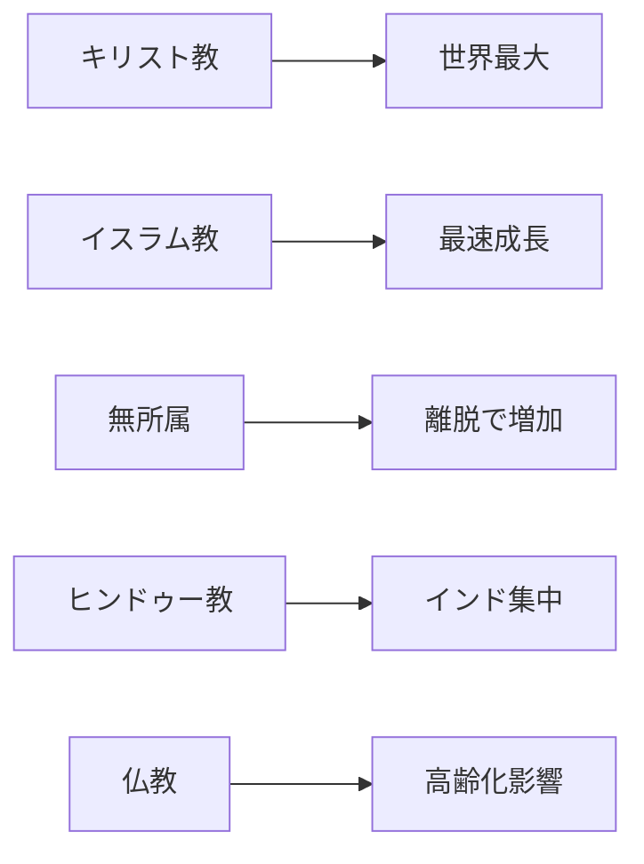

# 世界の宗教人口分布

## 1. エグゼクティブサマリー

世界の宗教人口を見るときは、「信仰の強さ」ではなく、まず「本人または統計がどの宗教所属に分類したか」を読む必要がある。Pew Research Centerが2025年6月に公表した2010年・2020年推計は、2020年時点でキリスト教徒を約23億人、イスラム教徒を約20億人、宗教的無所属を約19億人、ヒンドゥー教徒を約12億人と見積もる。キリスト教は最大集団だが、2010年から2020年にかけて世界人口に占める比率を下げた。イスラム教は主要分類の中で最も速く増え、無所属も改宗・離脱の影響で比率を上げた。<SourceNote>[Pew Research Center, How the Global Religious Landscape Changed From 2010 to 2020](https://www.pewresearch.org/religion/2025/06/09/how-the-global-religious-landscape-changed-from-2010-to-2020/) は2020年推計として、キリスト教28.8%、イスラム教25.6%、無所属24.2%、ヒンドゥー教14.9%などを示す。</SourceNote>

| 分類 | 2020年推計人口 | 世界人口比 | 2010年からの変化 |
| --- | ---: | ---: | --- |
| キリスト教 | 約23億人 | 28.8% | 人口は増加、比率は低下 |
| イスラム教 | 約20億人 | 25.6% | 人口・比率とも増加 |
| 宗教的無所属 | 約19億人 | 24.2% | 人口・比率とも増加 |
| ヒンドゥー教 | 約12億人 | 14.9% | 世界人口並みに増加 |
| 仏教 | 約3.24億人 | 4.1% | 人口は減少 |
| その他の宗教 | 約1.7億人規模 | 2.2% | 比率は横ばい |
| ユダヤ教 | 約1,480万人 | 0.2% | 比率は横ばい |

この表は、宗教人口を「大きい順」に並べるだけでは足りないことを示す。キリスト教は地理的に最も広く分布する。イスラム教はアジア、北アフリカ、中東、サハラ以南アフリカに厚い人口を持つ。ヒンドゥー教はインドに強く集中し、仏教は東アジア・東南アジアで低出生率と高齢化の影響を受ける。無所属は中国、日本、欧米の一部に大きく偏る。<SourceNote>[Our World in Data, Religion](https://ourworldindata.org/religion) はPewデータを使い、宗教所属は自己申告・国勢調査・人口登録に基づく分類であり、実践頻度や信念の中身とは別の指標だと説明する。</SourceNote>

## 2. 何を数えているのか

宗教人口統計は、通常「何を信じているか」を直接測らない。国勢調査や調査票は、回答者に宗教所属を尋ね、研究者が回答を集約する。Pewの2025年推計も、キリスト教、イスラム教、ヒンドゥー教、仏教、ユダヤ教、その他の宗教、宗教的無所属という七分類で世界201カ国・地域を整理する。対象は2010年または2020年に人口10万人以上だった国・地域で、世界人口の99.98%を覆う。<SourceNote>[Pew Research Center, Dataset of Global Religious Composition Estimates for 2010 and 2020](https://www.pewresearch.org/dataset/dataset-of-global-religious-composition-estimates-for-2010-and-2020/) は七分類、201カ国・地域、2,700超の資料、UN World Population Prospects 2024の人口総数を方法上の基礎としている。</SourceNote>

このため、宗教人口は「礼拝に通う人の数」や「特定教義を信じる人の数」と一致しない。たとえば、東アジアでは宗教団体に所属しない人が、祖先祭祀、寺社参拝、民間信仰、儒教的儀礼を生活の中で続けることがある。逆に、宗教所属を持つ人の中にも、日常的な実践頻度が低い人がいる。宗教人口分布は、まず社会的・統計的な所属分布として読むのが妥当である。<SourceNote>[Pew Research Center, Measuring Religion in China](https://www.pewresearch.org/religion/2023/08/30/measuring-religion-in-china/) と [Our World in Data, Data quality and biases](https://ourworldindata.org/religion#data-quality-and-biases) は、自己申告、設問、文化的文脈が宗教分類に影響する点を説明している。</SourceNote>

## 3. 世界全体の大きな分布

2020年時点の最大分類はキリスト教である。ただし、世界人口に占める比率は2010年の30.6%から2020年の28.8%へ下がった。Pewは、この低下を主にキリスト教から無所属への宗教離脱で説明する。人口そのものは増えたが、世界人口全体の伸びに追いつかなかった。<SourceNote>[Pew Research Center, Christian population change](https://www.pewresearch.org/religion/2025/06/09/christian-population-change/) は、キリスト教徒数が2010年の約21億人から2020年の約23億人へ増えた一方、世界人口比は31%から29%へ下がったと説明する。</SourceNote>

イスラム教は2010年から2020年にかけて、人数で約3.47億人増えた。これはPewの七分類の中で最大の増加幅であり、世界人口比も23.9%から25.6%へ上がった。主因は、イスラム教徒人口が比較的若く、出生率が高い国・地域に多く住むことにある。宗教転換だけでこの増加を説明するのは不十分である。<SourceNote>[Pew Research Center, Islam was the world's fastest-growing religion from 2010 to 2020](https://www.pewresearch.org/short-reads/2025/06/10/islam-was-the-worlds-fastest-growing-religion-from-2010-to-2020/) は、イスラム教徒が2010年から2020年に約3.47億人増え、約20億人になったと整理する。</SourceNote>

宗教的無所属は、2020年時点で世界第3の分類である。無所属は中国に強く集中し、中国だけで世界の無所属人口の約3分の2を占める。Pewは、無所属が高齢で低出生率という人口学的不利を持つにもかかわらず、キリスト教からの離脱などで世界比率を上げたと分析する。<SourceNote>[Pew Research Center, Overview](https://www.pewresearch.org/religion/2025/06/09/how-the-global-religious-landscape-changed-from-2010-to-2020/) は無所属を約19億人、24.2%とし、中国の無所属人口を約13億人、総人口比90%と示す。</SourceNote>

## 4. 地域で見ると構図が変わる

宗教人口の地理は、世界全体の順位とは違う読み方を求める。キリスト教は欧州発の近代史だけでは説明できない。2020年にはサハラ以南アフリカが世界最大のキリスト教徒居住地域となり、欧州を上回った。Pewは、サハラ以南アフリカの自然増と欧州の宗教離脱がこの変化を支えたと見る。<SourceNote>[Pew Research Center, Regional change](https://www.pewresearch.org/religion/2025/06/09/how-the-global-religious-landscape-changed-from-2010-to-2020/#regional-change) は、2020年時点で世界のキリスト教徒の30.7%がサハラ以南アフリカ、22.3%が欧州に住むと示す。</SourceNote>

イスラム教人口は中東・北アフリカだけに集中していない。南アジア、東南アジア、サハラ以南アフリカにも大きな人口がある。インドはヒンドゥー教多数派の国だが、絶対数では世界有数のイスラム教徒人口を持つ。宗教人口を読むときは、人口比と人口数を分けて見る必要がある。<SourceNote>[Our World in Data, Religion](https://ourworldindata.org/religion) は、イスラム教徒はアジアに多く住み、北アフリカ・中東・サハラ以南アフリカにも大きな比重があると整理する。</SourceNote>

ヒンドゥー教は世界人口比で約15%と大きいが、地理的には非常に集中している。Pewの宗教多様性分析は、世界のヒンドゥー教徒の95%がインドに住むと説明する。仏教もアジア中心だが、東アジア・東南アジアの低出生率と高齢化のため、2010年から2020年にかけて世界人口で減少した唯一の主要分類となった。<SourceNote>[Pew Research Center, Religious Diversity Around the World](https://www.pewresearch.org/religion/2026/02/12/religious-diversity-around-the-world/) は、ヒンドゥー教徒の95%がインドに住むこと、仏教徒が多様性水準の異なる国に分散して住むことを述べる。</SourceNote>

## 5. 多様性は国単位で見る

世界全体は多宗教的に見えるが、多くの国では一つの宗教分類が多数派を占める。Pewの2026年宗教多様性指数によると、201カ国・地域のうち194では、人口の50%以上が一つの宗教分類に入る。95%以上が同じ分類に属する国・地域も43ある。宗教が複数ある社会と、日常生活で宗教間接触が多い社会は同じではない。<SourceNote>[Pew Research Center, Religious Diversity Around the World](https://www.pewresearch.org/religion/2026/02/12/religious-diversity-around-the-world/) は、194カ国・地域で一分類が50%以上、43カ国・地域で一分類が95%以上を占めると報告する。</SourceNote>

宗教多様性が高い国は、必ずしも人口大国ではない。Pewの指数では、2020年時点でシンガポールが最も多様性の高い国とされる。大人口国だけを見ると、米国、ナイジェリア、ロシア、インド、ブラジルが比較的多様である。中東・北アフリカ地域は全体としてイスラム教が94%を占め、Pewの地域分類では最も多様性が低い。<SourceNote>[Pew Research Center, Religious diversity by region](https://www.pewresearch.org/religion/2026/02/12/religious-diversity-around-the-world/#religious-diversity-by-region) は、アジア太平洋を最も多様な地域、中東・北アフリカを最も多様性の低い地域とする。</SourceNote>

## 6. 将来予測は慎重に読む

宗教人口の将来予測は、出生率、年齢構造、死亡率、移住、宗教転換を仮定して作る。Pewの2015年予測は、2050年にキリスト教31%、イスラム教30%に近づくと見込んだ。ただし、この予測は2010年基準であり、2025年にPewが公表した2020年推計とは基準データが違う。2050年の厳密な数字としてではなく、人口学的な方向性を読む材料として使うべきである。<SourceNote>[Pew Research Center, The Future of World Religions](https://www.pewresearch.org/religion/2015/04/02/religious-projections-2010-2050/) は2050年にキリスト教徒約29億人、イスラム教徒約28億人の近接を予測した。Pew自身の2025年推計は2010年推計を改訂しているため、旧予測は更新待ちのシナリオとして扱う。</SourceNote>

2020年代以降の宗教人口を読む軸は二つある。一つは、高出生率の地域で宗教所属が強く維持されること。もう一つは、欧米、東アジア、オセアニアの一部で無所属が伸びることだ。この二つが同時に進むため、「世界は単純に世俗化している」とも「世界は一方向に宗教化している」とも言いにくい。地域別の人口成長と宗教離脱を一緒に見る必要がある。<SourceNote>[Our World in Data, Future changes in religious affiliation](https://ourworldindata.org/religion#future-changes-in-religious-affiliation) は、宗教所属の低い国で出生率が低く、宗教所属が高い国で人口成長が大きい傾向を説明する。</SourceNote>

## 7. 使い方と限界

宗教人口分布は、国際関係、移民、教育、福祉、政党政治、紛争研究、ビジネスの地域理解に役立つ。ただし、数字だけで社会を説明してはいけない。同じキリスト教、イスラム教、仏教、ヒンドゥー教の内部にも宗派、慣習、制度、国家との関係、世代差がある。Pewの七分類は世界比較に向くが、各地域の内部差をかなり圧縮する。

最も安全な読み方は、三段階に分けることだ。第一に、世界全体の人数と比率を見る。第二に、地域と国単位の集中を確認する。第三に、自己申告、調査制度、文化的実践の違いを限界として残す。宗教人口は世界観の地図ではなく、人口学と社会分類の地図である。
