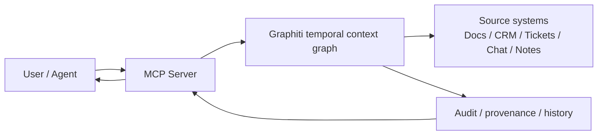
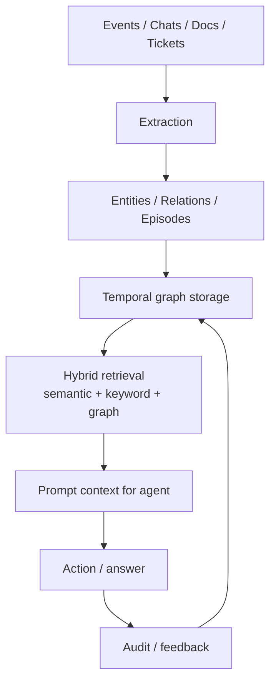
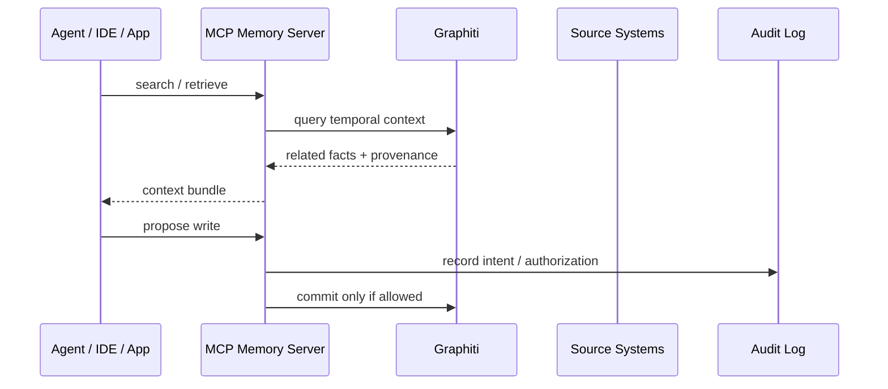
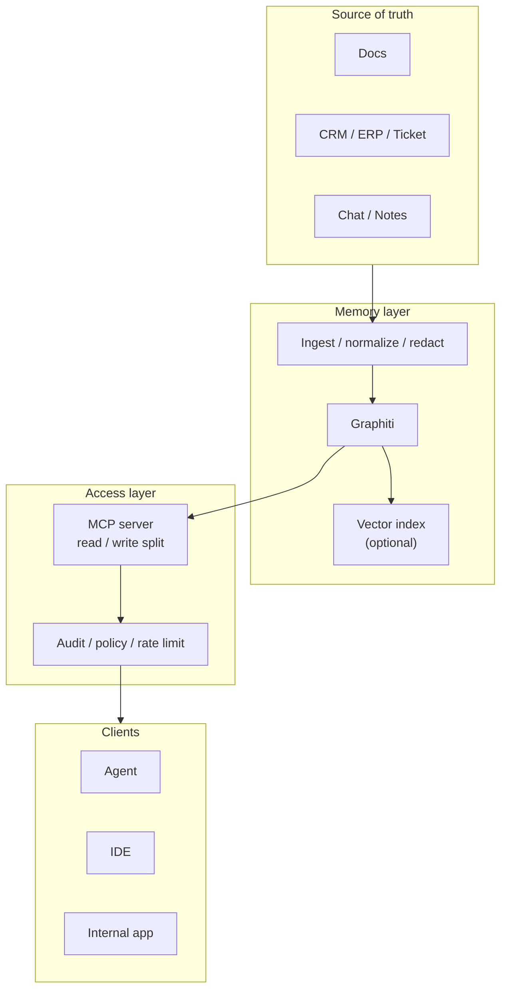

# Graphiti と MCP で作る AI エージェント記憶基盤

作成日: 2026-05-15
調査方式: 実務意思決定向けのナラティブレビュー
対象: Graphiti、MCP、temporal knowledge graph、agent memory、組織ナレッジ基盤、2026年時点のOSS/商用動向

## 引用方針

本文では、Graphiti、MCP、各ベンダーの機能主張、仕様、セキュリティ注意点を、できるだけ該当段落の近くに置く。製品主張は製品主張として扱い、公式ドキュメント、公式リポジトリ、一次論文を優先する。将来の方向性は、公式ロードマップがない限り `公表情報からの推定` と明記する。

## 1. エグゼクティブサマリー

Graphiti は、AIエージェントの記憶を「文書検索」ではなく、時間軸を持つ知識グラフとして扱う発想を前面に出した OSS である。README では、Graphiti を “temporal context graphs for AI agents” と説明し、事実の変化、provenance、prescribed / learned ontology を扱うとしている。これは、従来の RAG やベクトルDBが得意な「近い文章を拾う」問題よりも、`誰が・いつ・何を・どの根拠で・どの関係で` を継続的に保持したい問題に向く。
出典メモ: Graphiti README は [GitHub: getzep/graphiti](https://github.com/getzep/graphiti) を参照。Zep 側の論文は [Rasmussen et al., 2025](https://arxiv.org/abs/2501.13956)。

MCP は、この記憶基盤を AI クライアントに公開する際の標準的な接続層として有効である。MCP の公式仕様は、client-host-server の構造で `tools`、`resources`、`prompts` を公開する。したがって、記憶グラフを MCP サーバとして出すと、複数のエージェントや IDE、社内アシスタントから同じ記憶機能を再利用できる。一方で、MCP を付けただけでは権限、監査、PII、データ保持、プロンプトインジェクション対策は解決しない。
出典メモ: MCP の構造と機能は [Model Context Protocol architecture](https://modelcontextprotocol.io/docs/learn/architecture) と [MCP security best practices](https://modelcontextprotocol.io/docs/tutorials/security/security_best_practices) を参照。

実務上の結論は次の通りである。

1. Graphiti は、時間変化する関係と出典を残したい記憶に向く。
2. MCP は、記憶基盤を道具として再利用するための公開層として有効だが、権限境界を設計しないと危険が増す。
3. temporal knowledge graph は、組織ナレッジ、反復業務、関係性の推論、監査可能性が必要な場面で効く。
4. 単純な FAQ、静的文書検索、短命セッションの作業メモには、ベクトル検索や通常の RAG の方が安いことが多い。
5. 2026年時点では、`Graphiti/Zep`、`Mem0`、`Letta` が主要な候補で、どれも「何でも解決する記憶製品」ではない。

## 2. Graphiti は何を解こうとしているか

Graphiti が狙っているのは、`チャット履歴を埋め込んで再検索する` だけでは足りない記憶である。エージェントの実務では、同じ対象について情報が何度も更新される。たとえば、顧客の担当者変更、案件ステータス変更、ポリシー変更、障害の暫定対応、前回の例外処理などは、`最新値` だけでなく `変化の履歴` と `根拠` が必要になる。Graphiti の主張は、これを「時間を持つグラフ」として保持し、検索時に文脈、関係、変遷を合わせて取り出すことにある。
出典メモ: Graphiti README の説明は [GitHub: getzep/graphiti](https://github.com/getzep/graphiti)。Zep の論文は temporal knowledge graph architecture for agent memory を前提にしている [arXiv:2501.13956](https://arxiv.org/abs/2501.13956)。

従来の RAG / ベクトルDB / 知識グラフとの違いを、実務観点で整理すると次の通りである。

| アプローチ | 強み | 弱み | 向く用途 |
|---|---|---|---|
| ベクトルDB | 類似文書を安く速く拾える | 時系列、関係、根拠、状態変化が弱い | FAQ、文書検索、短期補助記憶 |
| RAG | 検索した根拠を生成に接続しやすい | 検索対象が文書中心だと業務状態を表しにくい | 文書QA、社内検索、説明生成 |
| 従来の知識グラフ | 明示的なノード/エッジ/制約で関係を表せる | 変化の履歴や増分更新が重いことがある | マスタデータ、参照関係、統制 |
| Graphiti | 時間付きの関係、provenance、増分記憶を扱いやすい | 抽出品質、スキーマ設計、運用負荷が成否を左右する | エージェント記憶、組織ナレッジ、監査可能な履歴 |

Graphiti の設計上の価値は、`何を覚えるか` を会話ログの偶然に任せず、`変化する事実` と `その由来` を構造化する点にある。LLM にとっては、同じ名前の対象が複数の時点で別の状態を持つことが普通にある。Graphiti は、その不確実さを `最近の会話を再投入する` だけでなく、グラフの更新として扱おうとする。
出典メモ: README の temporal context graph、facts change、provenance、ontology の説明は [GitHub: getzep/graphiti](https://github.com/getzep/graphiti) を参照。RAG の基礎は [Lewis et al., 2020](https://arxiv.org/abs/2005.11401)。

Graphiti のバックエンド選択も実務上重要である。README では Neo4j、FalkorDB、Kuzu、Amazon Neptune Database / Neptune Analytics 系のバックエンドが案内されている。これは、Graphiti を単体の SaaS として使うだけでなく、既存のグラフDB運用に乗せる余地があることを示す。
出典メモ: バックエンドの記述は [GitHub: getzep/graphiti](https://github.com/getzep/graphiti) を参照。

## 3. MCP サーバとして記憶基盤を公開する利点とリスク

MCP の利点は、記憶機能を個別アプリに埋め込むのではなく、標準インターフェースとして公開できる点にある。MCP の公式アーキテクチャは、`host` が `client` を内包し、`server` が `tools`、`resources`、`prompts` を提供する形で整理されている。記憶基盤を MCP サーバにすると、エージェント、IDE、社内チャットボット、検証ツールが同じ機能を使えるため、機能重複が減る。
出典メモ: MCP の構造は [Model Context Protocol architecture](https://modelcontextprotocol.io/docs/learn/architecture) を参照。公式の examples には [memory server](https://modelcontextprotocol.io/examples) がある。

利点は主に四つある。

1. 接続先の多様化: 1つの記憶基盤を複数クライアントから再利用できる。
2. 実装分離: エージェント側は検索ロジックではなく、意図とタスクに集中できる。
3. ツール化: `検索`、`要約`、`追記`、`差分確認` などを明示的な tool として切り出せる。
4. 監査しやすさ: 入出力がプロトコル化されるので、ログと権限境界を設計しやすい。

一方で、MCP 化はリスクも拡大する。特に重要なのは、`公開された memory tool は、そのまま write capability になる` という点である。MCP の公式セキュリティ文書は、prompt injection、認可、セッション境界、ローカルサーバの信頼、confused deputy を含む多くの論点を挙げている。記憶サーバが write を許すと、悪意あるプロンプトや誤った自動化がグラフを汚染する。
出典メモ: セキュリティ注意点は [MCP security best practices](https://modelcontextprotocol.io/docs/tutorials/security/security_best_practices) を参照。

Graphiti 系の MCP 化では、少なくとも次の設計を入れるべきである。

1. read と write を分ける。
2. write は最初から自動実行しない。
3. source of truth は業務システム側に置き、Graphiti は派生記憶とする。
4. PII と機密を明示的にマスキングする。
5. 追記前に `source`, `timestamp`, `actor`, `confidence` を必須化する。
6. 取り消し可能な更新モデルを採る。

## 4. temporal knowledge graph が効く場面、効かない場面

temporal knowledge graph が効くのは、`関係がある` だけでなく `関係が変わる` 場面である。逆に、変化しない文書や、単純な意味検索しか要らない場面では、グラフを作るコストが勝ちやすい。これは Graphiti だけの話ではなく、時間付きグラフ全般に当てはまる実務上の判断である。

| 場面 | 効く理由 | 典型的な失敗 |
|---|---|---|
| 個人研究の記憶 | 関心・仮説・メモの変遷を追える | ノートを全部グラフ化して維持不能になる |
| 組織ナレッジ | 顧客、案件、方針、例外、承認の関係を保持できる | 事実の更新を ETL で追えず stale になる |
| 業務エージェント | 前回の実行結果と次回の判断を結べる | write 権限を広く取りすぎる |
| 監査・説明責任 | `いつ誰が何を根拠に` を残せる | provenance が欠けると説明不能になる |
| 単純FAQ | 文書検索で十分 | グラフ化が過剰設計になる |
| 短命な会話メモ | セッション内だけで完結する | 恒久記憶のコストが高すぎる |

この表のうち、`効く理由` は設計上の推論であり、ベンダーの保証ではない。Graphiti や Zep の主張は、これらの場面に適したデータモデルを提供するというものであって、全ての業務記憶を自動解決するものではない。
出典メモ: Graphiti の対象は [GitHub: getzep/graphiti](https://github.com/getzep/graphiti)、Zep の論文は [arXiv:2501.13956](https://arxiv.org/abs/2501.13956)。

実務上の判断基準は次の順で考えるとよい。

1. その記憶は `変化` するか。
2. その記憶は `関係` を持つか。
3. その記憶は `根拠` を必要とするか。
4. その記憶は `複数セッション` にまたがるか。
5. その記憶は `監査` の対象か。

この5つのうち3つ以上が真なら、temporal knowledge graph を検討する価値が高い。逆に、1つか2つしか当てはまらないなら、RAG やベクトル検索の方が運用しやすいことが多い。

## 5. 個人研究・組織ナレッジ・業務エージェントでの実装パターン

### 5.1 個人研究

個人研究では、Graphiti を `長期メモリ` ではなく `検証可能な研究ノート` として使うのが良い。例えば、論点、仮説、反証、読んだ資料、関連人物、未解決の問いを entity と relation に落とす。MCP は、Obsidian、VS Code、研究用エージェントから同じノートグラフを読ませるための公開層になる。
出典メモ: この使い方は Graphiti の temporal context graph と MCP の tools/resources/prompts 構造からの実務的推論である。Graphiti 公式は [GitHub: getzep/graphiti](https://github.com/getzep/graphiti)、MCP 公式は [architecture](https://modelcontextprotocol.io/docs/learn/architecture) を参照。

### 5.2 組織ナレッジ

組織ナレッジでは、まず `顧客`、`案件`、`製品`、`障害`、`方針`、`例外`、`承認` のような業務オブジェクトを明示する。その上で、ソースシステムからイベント単位で Graphiti に取り込み、要約ではなく `状態変化` を記録する。MCP は、部門横断の社内アシスタントからこのグラフを引けるようにする公開ゲートになる。
出典メモ: Graphiti の ontology、provenance、事実変化の扱いは [GitHub: getzep/graphiti](https://github.com/getzep/graphiti)。RAG の限界を補う議論は [Lewis et al., 2020](https://arxiv.org/abs/2005.11401)。

### 5.3 業務エージェント

業務エージェントでは、`読む` と `書く` を分けるべきである。最初は read-only の MCP を用意し、提案だけさせる。十分な観測と評価が取れたら、限定的な write tool を追加する。更新時は、タスクID、承認者、信頼度、取り消し条件を記録する。これは、LLM を業務の実行者にするというより、`検証可能な意思決定補助` として閉じるための設計である。

| パターン | 先に作るもの | 避けるべきこと |
|---|---|---|
| 個人研究 | 小さなノートグラフ、検索、タグ、根拠リンク | 全ノートの自動抽出を先にやること |
| 組織ナレッジ | 業務オブジェクトの最小スキーマ、更新イベント | 文書の全文をそのまま全部投入すること |
| 業務エージェント | read-only MCP、監査ログ、承認フロー | 広い write 権限と自動修正 |

## 6. 2026年時点の主要 OSS / 商用サービスと成熟度

### 6.1 Graphiti / Zep

Graphiti は OSS の中核で、Zep はその上の商用プラットフォームとして理解すると分かりやすい。Zep の公式 FAQ では、Zep を `fully managed platform for context engineering` と説明し、Graphiti を `open-source graph framework` と位置づけている。つまり、Graphiti は実装核、Zep はその運用・マネージド提供に近い。
出典メモ: Graphiti は [GitHub: getzep/graphiti](https://github.com/getzep/graphiti)、Zep の公式説明は [getzep.com](https://www.getzep.com/) を参照。

### 6.2 Mem0

Mem0 は、一般的な `memory layer` として広く知られる OSS / 商用の候補で、Graphiti ほど temporal knowledge graph を前面には出さないが、長期メモリの抽出・更新・検索を提供する。公式ドキュメントは、memory API、managed offering、OpenMemory 系の案内を持ち、個人・チーム・アプリの記憶をまとめる層として整理しやすい。
出典メモ: 公式ドキュメントは [docs.mem0.ai](https://docs.mem0.ai/) を参照。

### 6.3 Letta

Letta は、持続的エージェントとメモリ管理を中心に据えた OSS / 商用の候補である。公式ドキュメントでは、エージェントの state、memory blocks、archival memory を中心に設計されており、Graphiti のような temporal KG とは別系統の `persistent agent` アプローチと見なせる。記憶の階層化、永続状態、外部ツール接続の設計を追うなら有力だが、業務オブジェクトの厳密なグラフモデリングは別途必要になることが多い。
出典メモ: 公式ドキュメントは [docs.letta.com](https://docs.letta.com/) を参照。

### 6.4 MCP memory reference server

MCP 公式の examples には memory server があり、プロトコルとしての最小実装を確認するには有用である。ただし、これは本番向けの完成品というより、`MCP で memory をどう見せるか` の参考実装と捉える方が安全である。
出典メモ: 参考実装は [MCP examples](https://modelcontextprotocol.io/examples) を参照。

| 候補 | 主な立ち位置 | 成熟度の見方 | 運用上の注意 |
|---|---|---|---|
| Graphiti | temporal KG OSS | 設計は強いが、抽出とスキーマ運用が鍵 | write 汚染、バックエンド選定、評価設計 |
| Zep | Graphiti 上の商用基盤 | 企業導入向けの本命候補 | ベンダー依存、データ境界、費用 |
| Mem0 | memory layer / platform | 導入しやすいが KG 厳密性の担保は別途検証が必要 | ストアの実体、更新方針、保持設計 |
| Letta | persistent agent / memory | エージェント中心で分かりやすい | 業務グラフとの接続は別設計が必要 |
| MCP memory server | 参考実装 | 標準化の土台 | そのまま本番採用しない |

## 7. 推奨アーキテクチャ

実務では、`ソースシステム`、`記憶グラフ`、`MCP 公開層`、`エージェント` を分けるのがよい。Graphiti は派生記憶であり、業務システムは source of truth のまま残す。MCP は `使うための窓口` であり、記憶そのものではない。

この構成で重要なのは、`グラフを主系にしない` ことである。ソースシステムが主、Graphiti は派生、MCP は接続、エージェントは消費者である。これを逆転させると、更新の責任、削除要求、権限、法務対応が一気に難しくなる。

## 8. 導入すべきケース / まだ避けるべきケース

### 導入すべきケース

1. 顧客、案件、方針、障害、例外など、時系列で変わる業務対象がある。
2. エージェントが複数セッションにまたがって同じ対象を扱う。
3. 根拠、出典、監査が必要である。
4. 既存の文書検索だけでは、関係や状態変化をうまく表せない。
5. 読み取りだけでなく、限定的な書き込み支援まで視野に入れる。

### まだ避けるべきケース

1. ほぼ静的な FAQ しかない。
2. ノート数が少なく、RAG だけで十分である。
3. PII や機密の扱いが未整備である。
4. 運用チームがグラフスキーマと抽出品質を維持できない。
5. write capability を監査なしで出したい。

## 9. リスク・限界

Graphiti と MCP の組み合わせは、適切に使えば強い。しかし、強いからこそ危険もある。最大のリスクは、`もっともらしい記憶` が `正しい記憶` に見えてしまうことだ。抽出が曖昧なら、グラフは誤った関係を増幅する。write 権限が広すぎると、誤変換が永続化する。MCP を通じて複数クライアントに公開すると、認可境界の設計ミスが一気に広がる。
出典メモ: MCP の認可・prompt injection の注意は [security best practices](https://modelcontextprotocol.io/docs/tutorials/security/security_best_practices) を参照。Graphiti の provenance / ontology は [GitHub: getzep/graphiti](https://github.com/getzep/graphiti) を参照。

実務の残課題は次の四つである。

1. 抽出品質をどう測るか。
2. 時間経過による stale fact をどう検知するか。
3. 権限と削除要求をどう実装するか。
4. どこまでを memory graph に入れ、どこからを source system に残すか。

## 10. 推奨方針

最初の導入先は、`関係が多く、時間変化があり、根拠が必要な業務` に絞るべきである。具体的には、顧客対応、案件運用、障害管理、社内ナレッジの承認済み要約、研究メモの時系列管理がよい。技術選定としては、`Graphiti + read-only MCP + 厳密な source of truth` から始め、実際に write が必要になった部分だけ限定的に開くのが安全である。

要するに、Graphiti は `記憶の構造` を与え、MCP は `記憶への接続` を標準化する。どちらも有効だが、どちらも単独では十分ではない。記憶基盤の成功条件は、モデル性能ではなく、スキーマ、権限、監査、評価、削除可能性を先に作ることにある。

## 参考情報

- [Graphiti GitHub repository](https://github.com/getzep/graphiti)
- [Zep official site](https://www.getzep.com/)
- [Zep temporal knowledge graph paper](https://arxiv.org/abs/2501.13956)
- [MCP architecture](https://modelcontextprotocol.io/docs/learn/architecture)
- [MCP security best practices](https://modelcontextprotocol.io/docs/tutorials/security/security_best_practices)
- [MCP examples](https://modelcontextprotocol.io/examples)
- [Mem0 docs](https://docs.mem0.ai/)
- [Letta docs](https://docs.letta.com/)
- [RAG paper](https://arxiv.org/abs/2005.11401)
