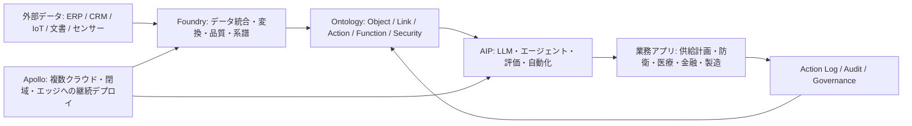
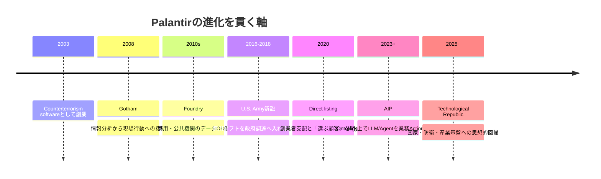
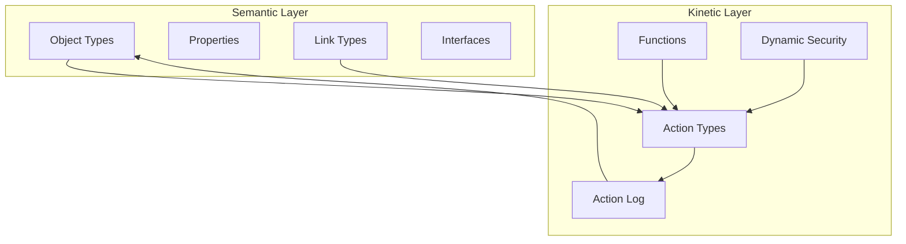
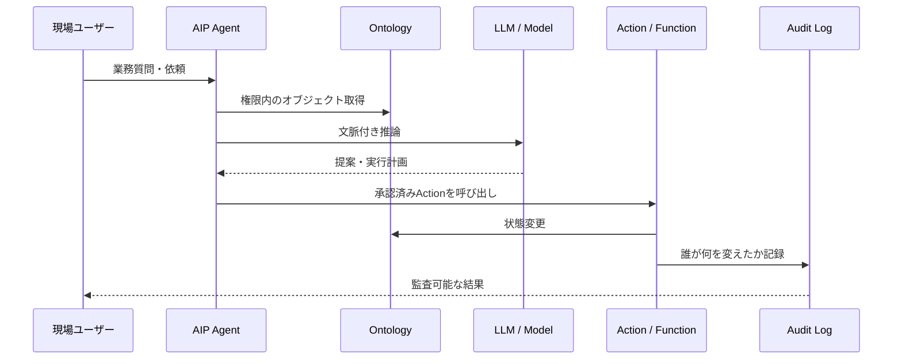
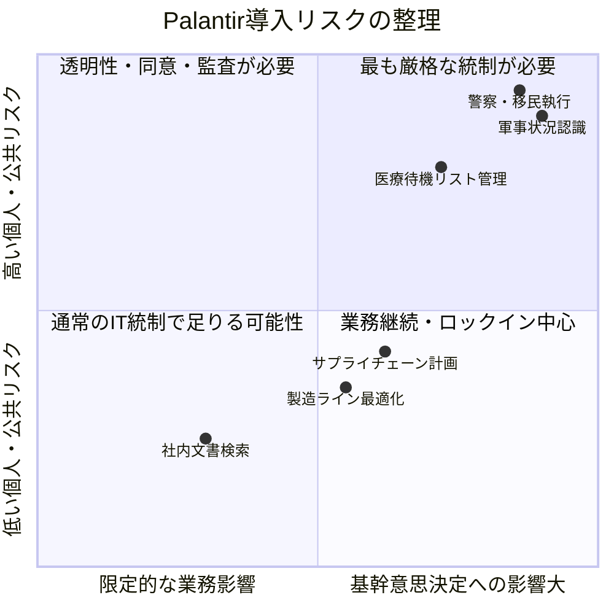

# Palantir調査レポート

作成日: 2026-05-07  
調査方式: 実務意思決定向けのナラティブレビュー  
カテゴリ: enterprise-ai-platforms  
対象: Palantir Technologies、Foundry、Ontology、AIP、Apollo、政府・商用導入、リスクと実務導入判断

## 引用方針

本文では、製品仕様・財務・契約・規制に関わる主張の近くに `出典メモ:` を置く。Palantir自身の説明は製品主張として扱い、SEC提出書類や公的機関資料を優先して事実確認する。批判資料は、事実認定と評価・主張を分けて扱う。将来展望は、公式ロードマップではなく「公表情報からの推定」と明記する。

## 1. エグゼクティブサマリー

Palantirは、単なる分析ツール企業でも、LLMアプリ企業でもない。中核は、企業や政府機関のデータ、業務オブジェクト、意思決定、権限、監査、アプリケーション、AIエージェントを一つの運用層に束ねる「operational AI platform」である。製品名で言えば、Foundryがデータ運用基盤、Ontologyが組織のオブジェクト/関係/アクション層、AIPが生成AIとエージェントの実行層、Apolloが複数環境への継続デプロイ基盤である。

出典メモ: Palantir公式ドキュメントは、AIPを「data and operations」にAIを接続するものと説明し、Foundry、AIP、Apolloを統合プラットフォームとして整理している。[AIP overview](https://www.palantir.com/docs/foundry/aip/overview)、[Integrated platforms: AIP, Foundry, and Apollo](https://www.palantir.com/docs/foundry/architecture-center/platforms) を参照。

本レポートの結論は次の通りである。

1. Palantirの差別化はモデル性能ではなく、Ontologyを中心に「現実の業務状態をAIが読め、変更でき、監査できる形」にする設計にある。
2. 2026年5月時点の成長は非常に強い。Palantirは2026年Q1に売上16.33億ドル、前年比85%成長、米国売上104%成長を発表し、2026年通期売上ガイダンスを76.50億-76.62億ドルへ引き上げた。
3. AIPの商用成長は、AIブームだけでなく、Bootcamp型の短期導入、Ontology上の業務アプリ化、ガバナンス込みの実装支援によって加速している。
4. 一方で、Palantirの強みはそのままリスクにもなる。組織横断データ統合、行為ログ、権限管理、現場業務への深い埋め込みは、導入組織に強い実行力を与えるが、監視、軍事・治安利用、医療データ、ベンダーロックイン、説明責任の問題を大きくする。
5. 実務導入で見るべき問いは「Palantirは便利か」ではなく、「自組織の意思決定・権限・説明責任・出口戦略までPalantir上に載せてよいか」である。

出典メモ: 2026年Q1数値はPalantirのSEC提出プレスリリース [a2026q1ex991pressrelease.htm](https://www.sec.gov/Archives/edgar/data/1321655/000132165526000026/a2026q1ex991pressrelease.htm) と [Q1 2026 Business Update PDF](https://investors.palantir.com/files/Palantir%20-%20Q1%202026%20Business%20Update.pdf) に基づく。

## 2. Palantirとは何か

Palantirは2003年創業の米国ソフトウェア企業で、政府・防衛・情報機関向けのGotham、商用・公共機関向けのFoundry、生成AI/エージェント基盤のAIP、デプロイ基盤のApolloを展開している。会社の自己定義は「データ、意思決定、オペレーションを大規模に統合するソフトウェア」であり、一般的なSaaSのように単一業務を置き換えるより、既存システムの上に横断的な運用層を作る方向で発展してきた。

出典メモ: 2025 Form 10-KのOverviewは、Palantirを「data, decisions, and operations」を統合するソフトウェア企業として説明している。[2025 FY PLTR 10-K](https://investors.palantir.com/files/2025%20FY%20PLTR%2010-K.pdf) を参照。

Palantirの製品体系は、従来の「データレイク + BI + 個別アプリ」とは異なる。データを集めるだけではなく、業務上の対象物をオブジェクトとして定義し、そのオブジェクトに対する行為、承認、履歴、権限を一体化する。このため、レポートを見るだけの分析基盤ではなく、現場が行動を変えるための operational layer として機能する。

出典メモ: PalantirのOntology公式説明は、Ontologyを「operational layer」とし、データセット、仮想テーブル、モデルの上に置かれ、物理資産、製品、注文、金融取引などの現実対象に接続すると説明している。[Ontology overview](https://www.palantir.com/docs/foundry/ontology/overview) を参照。

### 2.1 歴史から読むPalantirの深層構造

Palantirの歴史は、通常のSaaS企業の成長史ではなく、ポスト9.11の国家安全保障、PayPal由来の不正検知思想、政府調達への反抗、商用データOS化、生成AI時代の軍民両用プラットフォーム化が連続した物語として読むべきである。

S-1でPalantirは、2003年に counterterrorism operations 向けソフトウェアを作るために創業し、2008年に情報機関向けのGothamを最初のプラットフォームとして出したと説明している。Gothamは、膨大なデータセットの奥にあるパターンを見つけ、分析者から現場オペレーターへの引き渡し、脅威への実世界の対応計画・実行を支援するものとして位置づけられた。ここに、Palantirの原型がある。つまり「データを分析する会社」ではなく、「分析を行為へ接続する会社」として始まった。

出典メモ: 創業目的とGothamの説明はPalantirの [2020 Form S-1](https://www.sec.gov/Archives/edgar/data/1321655/000119312520230013/d904406ds1.htm) に基づく。同S-1は、2003年創業、2008年Gothamリリース、Gothamが分析者と operational users の引き渡しを支援することを説明している。

この起源は、現在のAIPまで一貫している。Gothamでは「脅威を見つけ、現場行動に渡す」ことが主題だった。Foundryでは、それが商用・公共機関向けに「業務データを統合し、組織の行動を変える」方向へ一般化された。AIPでは、そこにLLMとエージェントが接続され、「人間が読むダッシュボード」から「AIが業務状態を読み、制約付きActionを提案・実行する」方向へ進んでいる。

Palantirが特殊なのは、政府と大企業を「顧客」ではなく「制度的な巨大生物」として見ている点である。2022年のCEO年次書簡でKarpは、創業時は防衛・情報機関のためのソフトウェアを作る会社であり、彼らには予算と人員があったが必要なソフトウェアがなかったと書いた。また、二十世紀の堀は産業構造にあったが、今世紀の唯一の堀はソフトウェアだと主張した。この見方では、Palantirの競争相手は単なるBIベンダーではない。官僚制、旧来SI、部門別SaaS、Excel、調達制度、組織のデータ不全そのものが競争相手になる。

出典メモ: Karpの2022年書簡は、防衛・情報機関向け創業、巨大組織に必要なソフトウェア、そして「only moat is software」という主張を示している。[Palantir 2022 Annual Letter](https://www.palantir.com/2022-annual-letter/letter-en.pdf) を参照。

この歴史から得られる第一の洞察は、Palantirの製品は「導入される」のではなく「組織を作り替える」ことを前提にしている、という点である。Foundryを「central operating system for data」と呼び、FoundryのWorkshopを ontological data に読み書きするアプリビルダーとして説明していることは、データ基盤と業務アプリの境界を意図的に壊す設計を示している。導入企業は、データ基盤を買っているつもりでも、実際には意思決定の作法、権限、監査、現場Actionの流れまで再設計することになる。

出典メモ: Foundryの「central operating system for data」、Workshopの読み書き可能な業務アプリ構築は [2020 Form S-1](https://www.sec.gov/Archives/edgar/data/1321655/000119312520230013/d904406ds1.htm) の製品説明に基づく。

第二の洞察は、Palantirの「西側を選ぶ」という姿勢はマーケティングではなく、顧客選別、調達戦略、製品設計、採用ブランドに影響する経営原理だという点である。S-1は、Palantirが「Western liberal democracy and its strategic allies」を支援する使命と矛盾する顧客・政府とは一般に取引しないと書き、中国共産党とは仕事をせず、中国にプラットフォームをホストしないと明記した。この姿勢は、倫理的に中立なクラウド企業ではなく、地政学的に陣営を選ぶソフトウェア企業という自己定義である。

出典メモ: 顧客選別と中国に関する記述は [2020 Form S-1](https://www.sec.gov/Archives/edgar/data/1321655/000119312520230013/d904406ds1.htm) のリスク要因に基づく。

第三の洞察は、Palantirの政治性と商業性は矛盾していない、という点である。むしろ、国家安全保障と巨大組織向けソフトウェアを重ねることで、高単価、長期契約、深い組織浸透、規制産業への参入障壁を作ってきた。S-1では、2019年の上位20顧客の平均継続年数が6.6年であること、U.S. Armyに対する2016年訴訟が政府調達の商用ソフト採用に影響したこと、政府だけでなく商用領域へ拡大することが成長戦略として語られている。Palantirは「政府から商用へ横展開した会社」ではなく、「政府で鍛えた運用ソフトウェアの型を商用巨大組織へ輸出した会社」と見る方が正確である。

出典メモ: 上位顧客継続年数、U.S. Army訴訟、商用拡大戦略は [2020 Form S-1](https://www.sec.gov/Archives/edgar/data/1321655/000119312520230013/d904406ds1.htm) を参照。

第四の洞察は、`The Technological Republic` は突然出てきた思想書ではなく、S-1やCEO書簡にあったPalantirの自己理解を、AI時代の政治哲学として外部化したものだという点である。同書は、Silicon Valleyが国家安全保障や産業的課題から離れ、消費者向けの狭い問題へ向かったことを批判する。2026年4月にPalantirが同書を22項目のmanifesto風に要約して投稿し、AI兵器、国家奉仕、西側優位をめぐる批判を呼んだことは、Palantirがもはや「政治的に誤解されている企業」ではなく、自ら政治的な企業であることを前面に出していることを意味する。

出典メモ: 書籍の刊行意図は [Penguin Random House press release](https://sites.prh.com/technologicalrepublicpressrelease) を参照。2026年4月の22項目投稿への反応は [Fortune](https://fortune.com/2026/04/22/palantir-alex-karp-mini-manifesto-national-security-defense-tech-ai/) と [Euronews](https://www.euronews.com/next/2026/04/22/ramblings-of-a-supervillain-palantir-manifesto-claims-ai-weapons-and-cultural-inferiority) を参照。

第五の洞察は、Palantirの最大の価値と最大の危険は同じ場所にある、という点である。Ontology、Action、AIP、Apolloは、ばらばらの組織を一つの行為可能なシステムにする。これは、病院の待機リスト、工場の制約、軍の状況認識、金融犯罪対策では強力である。しかし同じ仕組みは、監視、移民執行、標的選定、公共データの目的外利用にも転用できる。技術が中立なのではなく、技術が「国家や巨大組織の意思」を増幅する。このため、Palantirを評価するには、製品機能より先に、どの制度に接続されるかを問う必要がある。

出典メモ: Palantir自身は2024年Q4資料で、イスラエル国防省との戦略的パートナーシップと戦争努力への技術提供を説明している。[Q4 2023 Business Update](https://investors.palantir.com/files/Palantir%20Q4%202023%20Business%20Update.pdf) を参照。国連特別報告者はPalantirのイスラエル軍事利用に関する懸念を示しているが、これは特別報告者の評価であり、裁判所の確定判断ではない。[UN A/HRC/59/23](https://www.un.org/unispal/document/a-hrc-59-23-from-economy-of-occupation-to-economy-of-genocide-report-special-rapporteur-francesca-albanese-palestine-2025/) を参照。

要するに、Palantirの歴史から得られる最も深い教訓は、AI時代の競争優位は「モデルを持つこと」ではなく、「組織の現実を、ソフトウェアが読めて、変えられて、監査できる構造に変換すること」にある、ということだ。Palantirはこの点で先行している。ただし、その能力は公共性を帯びる。だからPalantirを導入・投資・評価する際の中心質問は、「この会社はAIで何ができるか」ではなく、「この会社はどの制度の力を増幅しているのか」である。

## 3. 技術原理: Ontologyが中核である理由

Palantirを理解する鍵はOntologyである。一般的なRDF/OWL型のオントロジーは、概念、関係、制約を機械可読に表す知識表現の枠組みである。PalantirのOntologyはそれに近い「意味論」だけでは足りず、業務上の変更を実行する「運動論」を含む。オブジェクト、属性、リンク、インターフェースに加えて、Action types、Functions、dynamic security、action logが存在する。

出典メモ: W3CはOWLを「things, groups of things, and relations between things」を表すSemantic Web言語として説明している。[W3C OWL](https://www.w3.org/OWL/) を参照。Palantir側はOntologyに「semantic elements」と「kinetic elements」を含めると説明している。[Ontology overview](https://www.palantir.com/docs/foundry/ontology/overview) を参照。

この違いは実務上大きい。従来のBIでは、営業案件、在庫、患者、部品、警報、部隊、輸送計画の状態を表示できても、現場の変更行為は別システムに残ることが多い。Palantirは、変更そのものをActionとして扱い、誰が、いつ、どの対象を、どの理由で変更したかをOntologyのデータとして戻す。これにより、業務判断、監査、改善サイクルが同じ基盤に乗る。

出典メモ: PalantirのAction logは、Action提出をオブジェクトとしてモデル化し、意思決定やデータ編集をOntology内で分析可能にする仕組みである。[Action log](https://www.palantir.com/docs/foundry/action-types/action-log) を参照。

## 4. AIP: LLMを業務に接続する層

AIPは、単にチャットボットを社内データにつなぐ製品ではない。Palantirの説明では、AIPはOntology、開発ツール、評価、エージェント、オートメーション、LLM接続をまとめ、LLMが業務データ・業務ロジック・業務アクションにアクセスできるようにする。重要なのは、LLMが勝手に全データへアクセスするのではなく、既存のFoundry/Ontologyの権限、監査、系譜の上で動く点である。

出典メモ: AIP Featuresは、AIP Agent Studio、AIP Logic、AIP Evals、Ontology SDK、Palantir MCPなどを挙げ、Ontologyデータ、ロジック、アクションに接続するAIアプリ構築を説明している。[AIP features](https://www.palantir.com/docs/foundry/aip/aip-features) を参照。

PalantirのAIPは、LLMを「回答生成エンジン」から「業務状態を読み、提案し、制御されたActionを起動するエージェント」に変える方向を狙う。この設計は、企業がLLM導入で直面する三つの問題、すなわちデータ接続、権限、業務実行に直接対応している。

## 5. Apollo: Palantirの隠れた強み

Palantirのもう一つの重要要素はApolloである。Apolloは、クラウド、オンプレミス、閉域、エアギャップ、エッジ環境にまたがってソフトウェアを管理・更新するデプロイ基盤である。政府・防衛・重要インフラ向けでは、通常のSaaSのように単一クラウドへ更新するだけでは済まない。認証、規制、接続性、環境差分をまたいで継続更新できることが、Palantirの政府・防衛案件での競争力につながっている。

出典メモ: Apollo公式ドキュメントは、接続環境と非接続・エアギャップ環境をまたいだ「autonomous deployment」と、FedRAMP、IL5、IL6などの厳格な認定フレームワークに必要な統制を説明している。[Apollo introduction](https://www.palantir.com/docs/apollo/core/introduction/) を参照。

## 6. 事業状況: AIP後の成長加速

Palantirの財務は、2024年から2026年にかけて大きく加速している。2025年通期の売上は44.75億ドル、粗利率は82%、営業キャッシュフローは21.34億ドル、2025年末の現金・現金同等物・短期米国債は72億ドルだった。2026年Q1には売上16.33億ドル、前年比85%成長、米国商用売上5.95億ドル、前年比133%成長を発表した。

出典メモ: 2025年通期の売上・粗利・キャッシュフロー・流動性は [2025 FY PLTR 10-K](https://investors.palantir.com/files/2025%20FY%20PLTR%2010-K.pdf) のMD&Aに基づく。2026年Q1は [SEC Exhibit 99.1](https://www.sec.gov/Archives/edgar/data/1321655/000132165526000026/a2026q1ex991pressrelease.htm) に基づく。

成長の読み方には注意がいる。Palantir自身はAIPと米国市場の加速を強調するが、政府案件、防衛需要、AI投資サイクル、営業手法、既存顧客拡大が同時に効いている。AIPだけが原因だと断定するのは過剰である。ただし、米国商用売上の伸び、顧客数、100万ドル以上の案件数を見る限り、少なくともAIPは商用拡大の販売メカニズムを強めている。

| 指標 | 2026年Q1 | 読み方 |
|---|---:|---|
| 売上 | 16.33億ドル | 前年比85%成長 |
| 米国売上 | 12.82億ドル | 前年比104%成長 |
| 米国商用売上 | 5.95億ドル | 前年比133%成長 |
| 米国政府売上 | 6.87億ドル | 前年比84%成長 |
| 100万ドル以上案件 | 206件 | 大口案件化が進む |
| 通期売上ガイダンス | 76.50億-76.62億ドル | 2026年通期で前年比71%成長見込み |

出典メモ: 上表は [Palantir Q1 2026 press release](https://www.sec.gov/Archives/edgar/data/1321655/000132165526000026/a2026q1ex991pressrelease.htm) のHighlightsとGuidanceに基づく。

## 7. 導入事例と公共部門での論点

Palantirは、商用では製造、サプライチェーン、エネルギー、金融、医療運用、防衛産業などに広がる。公共部門では、米国政府、防衛、国土安全保障、英国NHS、警察・規制当局などが論点になる。ここで重要なのは、Palantirの価値が「分断されたデータを統合し、意思決定を高速化する」ことにあるため、公共部門ほど効果と危険が同時に大きくなる点である。

NHS EnglandのFederated Data Platformは、Palantirを含むコンソーシアムが2023年11月に受注し、2024年3月に正式開始した。契約は最大7年だが、NHS Englandの説明では初期3年がコミットされ、2027年3月に初期期間が来る。NHS Englandは、FDPが患者ケアや効率化に役立つと説明している一方、政治・市民社会・医療従事者側からは、患者データ、透明性、公共調達、Palantirの防衛・治安領域との関係に対する懸念が継続している。

出典メモ: NHS契約の開始時期、コンソーシアム、期間は [NHS England contract explainer](https://www.england.nhs.uk/digitaltechnology/nhs-federated-data-platform/security-privacy/contract-explainer/) に基づく。2026年の反対論点はMedactの [Briefing: Concerns Regarding Palantir Technologies and NHS Data Systems](https://www.medact.org/2026/resources/briefings/briefing-palantir-fdp/) を参照。Medactは権利団体側の批判資料であり、評価・主張を含む。

防衛領域では、Maven Smart Systemが象徴的である。Palantirは2024年に米陸軍からMaven Smart Systemの契約を受け、2025年には契約上限の大幅拡大が報じられた。Mavenは、AI/MLを軍事的な状況認識・分析・意思決定に接続する文脈で語られる。これはPalantirの技術力を示す一方、標的選定、監視、戦争遂行へのAI関与という倫理的リスクを高める。

出典メモ: Maven契約についてはPalantirの [BusinessWire発表](https://www.businesswire.com/news/home/20240920746094/en/Palantir-Expands-Maven-Smart-System-AIML-Capabilities-to-Military-Services) と、防衛専門メディアによる契約上限拡大報道を参照した。後者は一次情報ではないため、金額・契約詳細は公的契約データで追加確認が必要である。

## 8. Palantirの強み

Palantirの強みは、AIモデルではなく「業務をAI化するための土台」にある。

第一に、Ontologyにより、組織のデータを業務オブジェクトとして扱える。単なるテーブルではなく、対象物、関係、状態、操作、権限、履歴をまとめて表現できるため、AIエージェントが業務上意味のある単位で推論・実行できる。

第二に、導入支援が製品の一部になっている。AIP Bootcampのような短期集中導入は、顧客の業務課題を短時間でプロトタイプ化し、営業・導入・価値検証を一体化する。これは、汎用LLM APIやBIツール単体では再現しにくい。

出典メモ: Palantir公式Getting startedは、AIP Bootcampを「hours or days」でユースケースに進む場として説明している。[Getting started with Palantir](https://www.palantir.com/docs/foundry/getting-started/overview/) を参照。

第三に、政府・防衛・規制産業で必要なデプロイ能力を持つ。Apolloにより、閉域・エアギャップ・複数クラウド・規制環境にまたがる継続更新を扱える。これは一般的なクラウドSaaSやLLMアプリ企業にとって参入障壁になる。

第四に、ガバナンス機能を製品価値として前面に出している。PalantirはPrivacy and Governance Whitepaperで、透明性、目的制限、データ最小化、保持・削除、説明責任などを製品機能に落とすと説明している。ただし、この主張はPalantir自身の説明であり、実際の統制品質は導入先の設定、契約、監査、運用に依存する。

出典メモ: Privacy and Governance Whitepaperは、FoundryがAIPの基盤であり、Gothamのベースレイヤーとしても使われること、透明性や目的制限などを製品機能として扱うことを説明している。[Palantir Privacy and Governance Whitepaper](https://www.palantir.com/assets/xrfr7uokpv1b/4lXOhv4ycKr5IEMMFybaBj/2d7011ad45d11d189970d13e474f62bd/Palantir_Privacy_and_Governance_Whitepaper__1_.pdf) を参照。

## 9. リスク・限界

Palantirのリスクは、機能不足よりも「強すぎる統合」にある。分断されたデータ、意思決定、権限、現場行為を一つの運用層に統合すると、業務効率は上がる。しかし、その統合層が不透明、外部ベンダー依存、政治的に争点化しやすい領域に置かれると、説明責任と民主的統制が難しくなる。

### 9.1 監視・軍事・治安利用

Palantirは、防衛、情報、国境管理、警察、移民執行と深く結びついてきた。Amnesty Internationalは2020年、PalantirのICE関連契約について、人権侵害への関与リスクと人権デューデリジェンス不足を指摘した。この評価はPalantirの全製品が不適切だという証明ではないが、公共部門や医療機関がPalantirを採用する際、ベンダーの他領域での利用実態が信頼・調達・倫理の問題になることを示している。

出典メモ: Amnesty Internationalの2020年報告 [Failing to do right](https://www.amnesty.org/en/documents/amr51/3124/2020/en/) は、Palantirの政府契約と人権責任を扱う。Palantir側の反論・説明も併読すべきである。

### 9.2 医療データと公共信頼

NHS FDPは、Palantirリスクが最も分かりやすく表れた事例である。NHS EnglandはFDPの目的を、分断された医療データを統合し、ケア・効率・待機リスト改善に使うことと説明する。反対側は、患者データの再利用、擬名化の限界、将来の政府横断利用、ベンダーロックイン、Palantirの軍事・治安領域との関係を懸念する。どちらの主張も、抽象的な「データ活用賛成/反対」では片づかない。医療データ基盤では、実際のデータ項目、アクセス主体、目的制限、削除、独立監査、契約終了時の移行可能性を文書で確認する必要がある。

出典メモ: NHS Englandは契約説明ページで、Palantir主導コンソーシアム、最大7年、初期3年コミットという契約構造を説明している。[NHS England contract explainer](https://www.england.nhs.uk/digitaltechnology/nhs-federated-data-platform/security-privacy/contract-explainer/) を参照。反対論点は [Medact briefing](https://www.medact.org/2026/resources/briefings/briefing-palantir-fdp/) を参照。

### 9.3 ベンダーロックイン

Palantirは、導入先の業務モデル、データ変換、アプリ、Action、権限、監査を深く統合する。これは価値の源泉だが、同時に移行困難性を生む。特に、Ontology設計、Functions、Workshopアプリ、Action Log、アクセス制御、現場運用手順がPalantir固有の実装に依存すると、契約終了時に「データは出せるが業務能力は出せない」状態になりやすい。

実務的には、導入前に次を契約・設計で固定すべきである。

- データとメタデータのエクスポート形式
- Ontology定義、Action定義、権限定義の可搬性
- 監査ログとAction Logの保存・移行権
- 顧客側エンジニアが独自に運用・改修できる範囲
- 代替基盤へ移る場合の費用・期間・協力義務

### 9.4 AIガバナンス

AIPは、LLMを業務Actionに接続するため、通常のチャットボットよりも高い統制が必要になる。NIST AI RMFはAIリスク管理を、Govern、Map、Measure、Manageの継続プロセスとして扱う。EU AI Actは、健康、安全、基本権に影響するAIシステムを高リスクとして扱う枠組みを採る。Palantir導入が医療、雇用、法執行、国境管理、防衛に関わる場合、技術評価だけでは不十分で、法務、倫理、監査、現場責任者を含む運用設計が必要である。

出典メモ: NIST AI RMFはAIリスク管理を組織的・継続的プロセスとして整理する。[NIST AI Risk Management Framework](https://www.nist.gov/itl/ai-risk-management-framework) を参照。EU AI ActはリスクベースのAI規制枠組みを採る。[European Commission AI Act](https://digital-strategy.ec.europa.eu/en/policies/regulatory-framework-ai) を参照。

## 10. 主要アプローチ比較

| 観点 | Palantir | Snowflake/Databricks + BI/ML | 自社データ基盤 + OSS Agent | 通常のLLM SaaS |
|---|---|---|---|---|
| 中核価値 | 業務OntologyとActionまで統合 | データ処理・分析・ML基盤 | 自由度と可搬性 | 導入速度 |
| 業務実行 | 強い。Action/Workflowまで含む | 個別実装が必要 | 自社開発が必要 | 弱い |
| ガバナンス | 製品機能は厚いが設定依存 | データガバナンス中心 | 設計次第 | サービス依存 |
| 導入速度 | Palantir支援で速い | 既存基盤次第 | 遅い | 速い |
| ロックイン | 高い | 中 | 低-中 | 中 |
| 公共・防衛適性 | 高い | 案件次第 | 高いが構築負荷大 | 低-中 |
| AIエージェント実行 | Ontology接続で強い | 別途構築 | 自由だが重い | 限定的 |
| 向く組織 | 複雑で高価値な運用課題を持つ大組織 | データチームが強い組織 | 技術主権を重視する組織 | 軽量な知識業務 |

## 11. 実務導入判断

Palantirが向くのは、データ統合だけでなく、意思決定と現場Actionまで変えたい大規模組織である。製造の制約最適化、サプライチェーン、航空・防衛、資源・エネルギー、金融犯罪対策、病院運営のように、データ分断が大きく、意思決定の遅れが高コストで、現場のActionが重要な領域では検討価値がある。

逆に、単なる社内検索、文書要約、BIダッシュボード、部門内の軽いLLM活用には過剰になりやすい。Palantirを入れると、ツール導入ではなく業務OS導入に近い変化が起きる。組織がOntology設計、権限、監査、現場プロセス、契約統制を引き受ける準備がない場合、強力な基盤がブラックボックス化する。

導入判断のチェックリストは次の通りである。

- **業務価値**: 年間で数億円以上の改善余地がある、または人命・安全保障・重要インフラに関わるか。
- **データ成熟度**: 主要データ源、品質責任者、マスタ管理、アクセス権が特定されているか。
- **Action責任**: AIやアプリが提案・実行する変更の責任者、承認者、停止条件が明確か。
- **監査可能性**: 誰が何を見て何を変えたか、外部監査で説明できるか。
- **出口戦略**: 契約終了時にデータ、Ontology、ログ、アプリ、運用知識を移行できるか。
- **公共信頼**: 医療・治安・国境・防衛では、住民、患者、職員、議会、監督機関への説明に耐えるか。

## 12. 公表情報からの推定: Palantirの今後

公式ロードマップとして将来機能が体系的に公開されているわけではない。公表情報からの推定として、Palantirは次の方向へ進む可能性が高い。

1. AIPを、LLMアプリではなく業務エージェントOSとして拡張する。
2. Ontologyを、企業AIの文脈・権限・Actionの標準接続層として売る。
3. Apolloを、ソブリンAI、閉域AI、エッジAI、防衛AIのデプロイ基盤として強化する。
4. 米国商用と米国政府を両輪にしつつ、同盟国政府・防衛・医療・規制領域へ広げる。
5. 反発が強い公共領域では、透明性、データ主権、監査、契約終了時移行をめぐる政治的・法的圧力が増す。

出典メモ: この節は公式ロードマップではなく、公表済みのAIP/Foundry/Apolloドキュメント、2026年Q1発表、NHSをめぐる議論からの推定である。

## 13. 推奨方針

技術・事業の観点では、Palantirは2026年時点で最も強力な enterprise AI operating platform の一つである。特にOntologyを中心に、データ、業務ロジック、アクション、AI、監査を結びつける設計は、LLM活用がPoCで止まりがちな組織にとって現実的な突破口になる。

ただし、採用判断は「AI導入」ではなく「組織運用基盤の外部委託」として扱うべきである。民間企業なら、価値仮説、ロックイン、データ主権、社内運用能力を契約前に詰める。公共機関なら、それに加えて、民主的統制、住民・患者・職員への説明、第三者監査、調達透明性、目的外利用防止を導入条件にする。

実務上の推奨は次である。

- **採用を検討すべき場合**: 高価値・高複雑度・高規制の業務で、データ統合からActionまで短期間で変える必要がある。
- **慎重にすべき場合**: 医療、治安、移民、軍事、教育、福祉のように、個人の権利や公共信頼への影響が大きい。
- **避けるべき場合**: 課題が単なる検索、要約、ダッシュボードであり、Palantir固有のOntology/Action/Apolloが不要な場合。
- **最低条件**: 導入前に、目的、データ範囲、権限、監査、モデル評価、Action承認、ログ保存、出口戦略を文書化する。

## 参考情報

- Palantir, [AIP overview](https://www.palantir.com/docs/foundry/aip/overview)
- Palantir, [AIP features](https://www.palantir.com/docs/foundry/aip/aip-features)
- Palantir, [Ontology overview](https://www.palantir.com/docs/foundry/ontology/overview)
- Palantir, [Action log](https://www.palantir.com/docs/foundry/action-types/action-log)
- Palantir, [Apollo introduction](https://www.palantir.com/docs/apollo/core/introduction/)
- Palantir, [Integrated platforms: AIP, Foundry, and Apollo](https://www.palantir.com/docs/foundry/architecture-center/platforms)
- Palantir, [Privacy and Governance Whitepaper](https://www.palantir.com/assets/xrfr7uokpv1b/4lXOhv4ycKr5IEMMFybaBj/2d7011ad45d11d189970d13e474f62bd/Palantir_Privacy_and_Governance_Whitepaper__1_.pdf)
- Palantir, [2025 FY PLTR 10-K](https://investors.palantir.com/files/2025%20FY%20PLTR%2010-K.pdf)
- SEC, [Palantir Q1 2026 press release Exhibit 99.1](https://www.sec.gov/Archives/edgar/data/1321655/000132165526000026/a2026q1ex991pressrelease.htm)
- NHS England, [FDP contract explainer](https://www.england.nhs.uk/digitaltechnology/nhs-federated-data-platform/security-privacy/contract-explainer/)
- Amnesty International, [Failing to do right](https://www.amnesty.org/en/documents/amr51/3124/2020/en/)
- Medact, [Concerns Regarding Palantir Technologies and NHS Data Systems](https://www.medact.org/2026/resources/briefings/briefing-palantir-fdp/)
- NIST, [AI Risk Management Framework](https://www.nist.gov/itl/ai-risk-management-framework)
- European Commission, [AI Act](https://digital-strategy.ec.europa.eu/en/policies/regulatory-framework-ai)
- W3C, [OWL - Semantic Web Standards](https://www.w3.org/OWL/)
