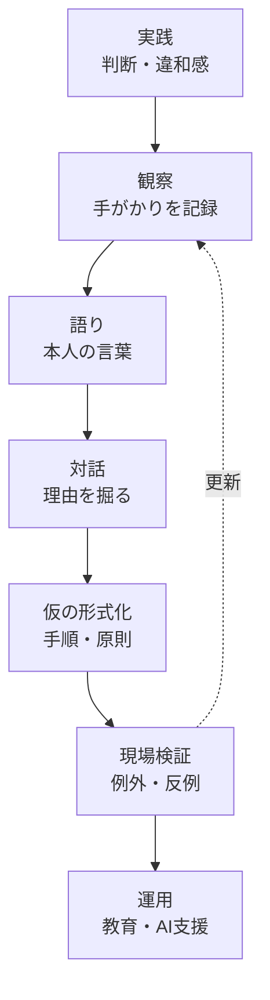
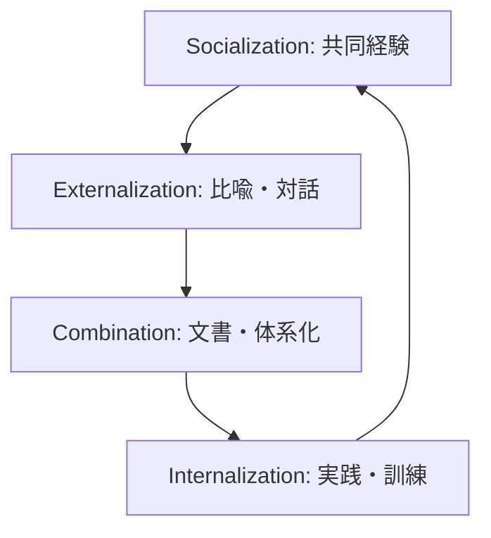
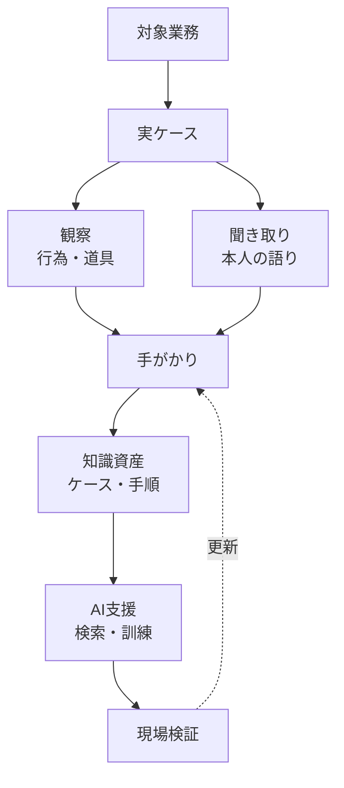

# 暗黙知の定義・ビジネス理論・生成AI時代のトレンド

作成日: 2026-05-18
調査方式: ナラティブレビュー
対象: 暗黙知の哲学的定義、組織知識創造論、実務ナレッジマネジメント、生成AI時代の知識共有

## 引用方針

本文では、定義、理論、最近の市場・技術動向の近くに `出典メモ:` を置く。長い逐語引用は避け、必要な原文句だけを短く示し、日本語で要約する。哲学・経営学・組織論の古典は二次解説に頼りすぎず、書籍情報、論文、Stanford Encyclopedia of Philosophy、出版社ページ、学術論文ページ、国際機関・企業公式レポートを優先する。

## 1. エグゼクティブサマリー

暗黙知は「言葉にできない知識」ではあるが、この短い定義だけではほとんど役に立たない。より正確には、ある行為、判断、観察、会話、研究、製造、営業、診断、設計を成り立たせているが、当人が焦点的に命題化して語っているわけではない背景的・身体的・社会的・状況依存的な知である。

ポランニーの有名な命題は「we can know more than we can tell」である。ただし、ここで重要なのは「語れない神秘」ではなく、焦点的に見ているものと、それを支える周辺的な手がかりの関係である。職人、研究者、医師、営業、エンジニア、マネージャーは、しばしば「どこを見ればよいか」「何が変か」「今は深追いすべきでないか」「誰に確認すべきか」を、チェックリストより先に身体化された注意として使っている。

出典メモ: University of Chicago Press の [The Tacit Dimension](https://press.uchicago.edu/ucp/books/book/chicago/T/bo6035368.html) は、ポランニーの中心命題を "we can know more than we can tell" と紹介し、暗黙知を科学的知識の中の伝統、実践、価値、先行判断に関わるものとして説明している。

ビジネス上の暗黙知論は、大きく三つの系譜に分けられる。第一に、Nonaka の SECI モデルのように、暗黙知と形式知の相互変換を通じて組織的知識創造を説明する系譜。第二に、Brown and Duguid や Wenger につながる communities of practice のように、実際の仕事、学習、革新が公式手順ではなく実践共同体に埋め込まれていると見る系譜。第三に、Cognitive Task Analysis のように、熟達者の認知、手がかり、判断の分岐、失敗回避を構造的に引き出す実務手法の系譜である。

生成AI時代のトレンドは、「暗黙知をAIに全部吸い出す」方向ではなく、「人が観察し、語り、反省し、検証するプロセスをAIで補助する」方向に進んでいる。LLM、RAG、会話型エージェント、業務ログ分析は、暗黙知の断片を拾うには有用である。しかし、暗黙知は文書の欠落ではなく、実践、状況、身体、共同体、評価規準に結びつくため、AIで作った要約をそのまま「組織知」と見なすと、現場の判断構造を壊す。

## 2. 暗黙知の定義

暗黙知は、形式知の反対語としてだけ理解すると誤る。形式知は、文書、数式、仕様、マニュアル、コード、データモデル、図表として共有しやすい。暗黙知は、言語化されていないだけの知識も含むが、それだけではない。そもそも言語化した瞬間に別の知識へ変形してしまうもの、身体操作や知覚のまとまりに乗っているもの、共同体の規範や文脈に依存するものも含む。

暗黙知は少なくとも次の四層に分けて考えると扱いやすい。

| 層           | 内容                               | ビジネス例                                   | 形式化のしやすさ |
| ------------ | ---------------------------------- | -------------------------------------------- | ---------------- |
| 未文書化知   | 語れるがまだ書かれていない         | ベテランだけが知る承認ルート、顧客別の注意点 | 高い             |
| 判断手がかり | 本人は使っているが説明が粗い       | 「この案件は危ない」と感じるシグナル         | 中程度           |
| 身体化技能   | 身体、知覚、反復練習に埋め込まれる | 職人技能、診察、接客、デバッグの手つき       | 低い             |
| 共同体的規範 | 言葉の使い方、評価規準、暗黙の合意 | 何を「良い設計」「筋の悪い提案」と呼ぶか     | 低いが観察可能   |

この分類の意義は、「暗黙知を形式知に変換せよ」という一枚岩の指示を避けることにある。未文書化知なら文書化すればよい。判断手がかりなら Cognitive Task Analysis やケースレビューが効く。身体化技能なら動画、模倣、練習、フィードバックが必要である。共同体的規範なら、個人インタビューよりも実践共同体の会話、レビュー、失敗処理を観察する必要がある。

出典メモ: Collins の [Tacit and Explicit Knowledge](https://www.degruyterbrill.com/document/doi/10.7208/9780226113821/html) は、暗黙知を relational、somatic、collective に分ける整理で知られる。出版社ページの要約も、従来一括りにされた暗黙知を三つに分解する点を説明している。

## 3. ポランニー: 暗黙知は「背景として働く知」

ポランニーのポイントは、知識を「明示命題の集まり」と見ないことである。人は顔を認識するとき、目、鼻、口、輪郭、声、雰囲気といった手がかりを一つずつ命題として足し合わせているわけではない。細部に依拠しながら、焦点的には「その人」を見ている。熟達した実務家も同じで、個別の手がかりに依拠しながら、焦点的には「これは品質事故になりそうだ」「この顧客はまだ納得していない」「この設計は将来詰まる」と把握する。

ここから、暗黙知には二つの重要な含意がある。第一に、暗黙知は反科学的な直感ではない。科学的発見や専門的判断にも、問題の見つけ方、実験の癖、測定値の違和感、妥当な問いの立て方という暗黙的な側面がある。第二に、暗黙知は完全に外部化できるとは限らない。語ることはできるが、語りは実践の置き換えではなく、実践へ戻るための手がかりである。

出典メモ: [The Tacit Dimension](https://press.uchicago.edu/ucp/books/book/chicago/T/bo6035368.html) の出版社解説は、暗黙知を tradition、inherited practices、implied values、prejudgments と結びつけている。これは、暗黙知を個人の勘だけでなく、科学や実践共同体の背景条件として読む根拠になる。

## 4. ウィトゲンシュタイン: 言い換えのリスクと実践の文法

ユーザーが読んだ『論理哲学論考』と『哲学探究』を暗黙知に接続するなら、前期と後期の落差が重要である。前期ウィトゲンシュタインは、命題が世界を写し取るという絵画説や、語りうるものの限界をめぐって考えた。ここでは、言語は世界の論理形式を写すものとして厳しく扱われる。後期の『哲学探究』では、意味は語の背後にある固定的対象ではなく、言語ゲーム、使用、形式の中にあると考えられる。

この転回は、暗黙知のビジネス利用に強い警告を与える。現場の言葉を別の言葉へ置き換えると、単に表現が変わるだけでなく、そこで使われていた判断規準、相手関係、確認の手つき、失敗時の責任、微妙な強弱が消えることがある。たとえば、ベテランが「この案件はまだ寝かせた方がいい」と言うとき、それを「優先度を下げる」と言い換えると、時間、相手の心理、社内政治、情報の熟成、次の観察ポイントが落ちるかもしれない。

出典メモ: Stanford Encyclopedia of Philosophy の [Ludwig Wittgenstein](https://plato.stanford.edu/archives/fall2023/entries/wittgenstein/) は、『哲学探究』における language-games を、行為と結びついた意味の理解として整理している。同じく [Rule-Following and Intentionality](https://plato.stanford.edu/entries/rule-following/index.html) は、規則遵守をめぐる議論が言語と思考の本性に関わることを説明している。

言い換えのリスクは、暗黙知の外部化で特に大きい。インタビューで「つまり、こういうことですね」と聞き手がまとめた瞬間、専門家は反論しにくくなる。要約は会話を前へ進めるが、同時に、現場で使われていた区別を消す。したがって暗黙知調査では、言い換えを成果物にする前に、元の語り、実際の場面、例外、反例、当人が嫌がる言い換えを残すべきである。

## 5. 猫ひねり問題: 観察が理論に先行する例

猫ひねり問題は、暗黙知の比喩として有用である。落下する身体が外部からトルクを受けずに向きを変えるように見える現象は、一見すると角運動量保存に反するように見える。しかし、対象を剛体として見る前提が間違っている。身体は変形し、形を変えながら、全体として向きを変える。

この例から得られる教訓は、「説明できないものは非合理」ではなく、「観察の粒度とモデルの前提が粗いと、正しい実践を誤って不可能に見積もる」ということだ。暗黙知も同じである。熟達者の行為を、固定的な手順、判断基準、入力と出力だけで見ると、なぜその判断ができるのかが見えない。だが、身体、視線、タイミング、環境、道具、相手の反応、共同体の規範まで観察すると、形式化できる部分と、実践として保持すべき部分が分かれる。

出典メモ: Nature Reviews Physics の [The physics of cats](https://www.nature.com/articles/s42254-025-00824-6) は、猫の立ち直り反射が角運動量保存に反するように見えた歴史的問題であり、19世紀末の連続写真や Kane and Scher (1969) の研究につながることを紹介している。ここでは、猫を剛体とみなす前提が観察を誤らせるという点を暗黙知の比喩として用いている。

## 6. ビジネス理論 1: Nonaka の SECI モデル

ビジネス領域で暗黙知を広めた代表理論が、Nonaka の組織的知識創造論である。Nonaka (1994) は、組織知識が暗黙知と形式知の継続的対話から生まれると論じ、四つの変換モードを示した。Socialization は暗黙知から暗黙知への共有、Externalization は暗黙知から形式知への表現、Combination は形式知から形式知への統合、Internalization は形式知から暗黙知への身体化である。

このモデルの強みは、知識を単なる情報処理ではなく、個人、チーム、組織、組織間へ広がる創造プロセスとして捉える点にある。特に、暗黙知を個人に閉じ込めず、組織が「場」「対話」「比喩」「実践」を設計する対象として扱った点は、ナレッジマネジメントの実務に大きな影響を与えた。

出典メモ: Nonaka の [A Dynamic Theory of Organizational Knowledge Creation](https://www.uky.edu/~gmswan3/575/Nonaka_1994.pdf) は、組織知識が tacit と explicit knowledge の継続的対話から作られると述べ、四つの変換モードと知識スパイラルを提示している。INFORMS の [論文ページ](https://pubsonline.informs.org/doi/abs/10.1287/orsc.5.1.14) でも DOI と掲載情報を確認できる。

ただし、SECI モデルは万能ではない。暗黙知を形式知へ変換できるという表現は、しばしば「すべて文書化できる」という誤解を生む。実際には、外部化できるのは暗黙知そのものではなく、暗黙知に依拠した語り、比喩、手順、判断例、ケース、モデルである。そこから再び実践へ戻って内面化しなければ、知識創造ではなく、現場から切り離された文書の増殖になる。

出典メモ: Frontiers in Psychology の [Managing Knowledge in Organizations](https://www.frontiersin.org/journals/psychology/articles/10.3389/fpsyg.2019.02730/full) は、SECI が知識管理の代表的理論である一方、実証的裏づけは断片的で、研究の多くが理論研究やケース研究に偏っていること、測定や一般化に課題があることを整理している。

## 7. ビジネス理論 2: Communities of Practice

Brown and Duguid の communities of practice は、公式手順と実際の仕事のズレに注目する。組織図、職務記述書、マニュアルは仕事を説明しているように見えるが、現場の学習と革新は、しばしば非公式な会話、共同作業、トラブル対応、失敗談、道具の使いこなし、周辺的参加の中で生まれる。

この視点では、暗黙知は「個人の頭の中にある資産」ではなく、「実践共同体の中で、参加しながら身につけるもの」である。したがって、暗黙知を失わせる典型的な経営施策は、ベテランへのインタビュー不足ではなく、実践共同体の破壊である。過度な分業、短期KPI、チャットへの過剰移行、レビュー時間の削減、オンボーディングの自習化、現場同行の廃止は、暗黙知の再生産回路を切る。

出典メモ: Brown and Duguid の [Organizational Learning and Communities-of-Practice](https://pubsonline.informs.org/doi/10.1287/orsc.2.1.40) は、仕事の公式記述が実際の働き方を覆い隠し、非公式な実践共同体が学習と革新を生むと論じている。

## 8. ビジネス理論 3: Cognitive Task Analysis

Cognitive Task Analysis は、熟達者が何を見て、どの手がかりを重視し、どの時点で判断を分岐し、どの失敗を避けているかを引き出す手法群である。単なる「コツを教えてください」というインタビューでは、専門家自身も自分の認知プロセスを説明しにくい。そこで、Critical Decision Method や Applied Cognitive Task Analysis のように、具体場面、重要判断、手がかり、代替案、例外、初心者が見落とす点を構造的に掘る。

ビジネス実務では、退職予定者の知識継承、事故・障害レビュー、営業案件レビュー、医療・製造・保守の熟達技能、ソフトウェア設計レビュー、セキュリティ判断、採用面接、投資判断などに応用できる。重要なのは、本人の抽象的な信念を聞くのではなく、実際のケースに戻すことである。

出典メモ: Brown, Power, and Gore の [Cognitive Task Analysis: Eliciting Expert Cognition in Context](https://journals.sagepub.com/doi/10.1177/10944281241271216) は、職場が複雑化する中で熟達者のスキルや暗黙知を失わず共有する価値が高まっていること、ACTA や CDM が専門家の手がかりや戦略を文書化するために使えることを説明している。

## 9. 暗黙知を扱うときの批判的論点

暗黙知という言葉は便利だが、危険でもある。第一に、単に文書化されていない情報まで「暗黙知」と呼ぶと、議論が曖昧になる。第二に、専門家が説明できないことをすべて尊重しすぎると、検証不能な権威主義になる。第三に、逆にすべてを明文化できると考えると、熟達、文脈、身体性、共同体規範を壊す。

特にビジネスでは、暗黙知という言葉が「属人化」の婉曲表現になることがある。属人化の中には、単にドキュメントが不足しているだけのもの、権限設計が悪いもの、業務プロセスが未成熟なもの、評価制度が知識共有を阻害しているものが混ざる。これを全部「暗黙知」と呼ぶと、現場観察ではなく、ナレッジベース整備プロジェクトだけが始まる。

したがって、暗黙知マネジメントの第一歩は、暗黙知を尊重することではなく、分類することである。

| 問うべき質問                                     | 分かること                                 |
| ------------------------------------------------ | ------------------------------------------ |
| それは本人が説明できるが、まだ書いていないだけか | 文書化・FAQ・手順化で足りる                |
| 具体場面に戻すと説明できるか                     | ケースレビューや CTA が有効                |
| 動画や同行でないと伝わらないか                   | 模倣、練習、フィードバックが必要           |
| 共同体の評価規準に依存するか                     | レビュー文化、用語、実践共同体の維持が必要 |
| AI 要約にすると何が落ちるか                      | 元発話、反例、文脈、境界条件を残す必要     |

## 10. 生成AI時代のトレンド

### 10.1 知識管理は「文書検索」から「対話と実践支援」へ移る

生成AIは、社内文書検索、FAQ、議事録要約、問い合わせ対応、提案書作成、オンボーディング支援を急速に変えている。しかし、暗黙知の観点では、文書を検索できるようにするだけでは足りない。むしろ重要なのは、熟達者の判断をケースベースで聞き出し、現場で使われた言葉を保ち、反例と境界条件を記録し、次の実践で検証する流れである。

出典メモ: Microsoft の [Work Trend Index 2025](https://www.microsoft.com/en-us/worklab/work-trend-index/2025-the-year-the-frontier-firm-is-born) は、31か国の知識労働者調査、LinkedIn 労働市場データ、Microsoft 365 の生産性シグナルをもとに、AI とエージェントが知識労働を変えると説明している。これは Microsoft の製品文脈を含む企業レポートであり、一般化には注意が必要である。

### 10.2 AI スキリングは、ツール研修だけでなく実践共同体の再設計になる

AI 導入では、プロンプト研修やツール配布だけでは足りない。何をAIに任せ、何を人間が観察し、どこで検証し、どの語りを保存し、どの語りを捨てるかを決める必要がある。これは、スキル研修であると同時に、実践共同体の再設計である。

出典メモ: OECD の [Bridging the AI skills gap](https://www.oecd.org/en/publications/bridging-the-ai-skills-gap_66d0702e-en.html) は、AI が職場で重要性を増し、専門家だけでなく一般労働者のAIリテラシー需要も高まる一方、訓練供給が十分かは限定的にしか分かっていないと述べる。OECD [Skills Outlook 2025](https://www.oecd.org/content/dam/oecd/en/publications/reports/2025/12/oecd-skills-outlook-2025_ac37c7d4/26163cd3-en.pdf) も、生成AIが代替と補完の両面を持つ複雑な影響を示している。

### 10.3 LLM による暗黙知抽出は研究段階から実装探索へ進んでいる

2025年以降、暗黙知の保存・移転に LLM や会話型エージェントを使う研究が増えている。方向性は、退職者インタビュー、オンボーディング、専門家のヒューリスティック抽出、組織内の知識保持者発見、会話からの断片的知識抽出である。ただし、これらはまだ研究・提案段階のものも多く、AI が暗黙知そのものを獲得したとまでは言えない。

出典メモ: Uchihira の [Tacit Knowledge Management with Generative AI](https://arxiv.org/abs/2603.21866) は、従来の知識管理が明示知に偏りがちで、生成AIを用いて暗黙知と形式知を統合的に扱う GenAI SECI を提案している。Benderoth et al. の [Socially Interactive Agents for Preserving and Transferring Tacit Knowledge in Organizations](https://arxiv.org/abs/2508.19942) は、LLM、RAG、対話型エージェントによる暗黙知移転支援を提案する。どちらも arXiv 論文であり、査読済み実証研究としてではなく新しい研究動向として扱う。

### 10.4 業務ログ、会話ログ、プロセスマイニングは観察の補助線になる

従来の暗黙知調査は、熟達者インタビューと現場観察に依存していた。今後は、チケット、Pull Request、Slack、CRM、通話録音、議事録、障害対応ログ、操作ログを組み合わせ、実際の判断の痕跡を追える。これは強力だが、ログは実践の全体ではない。ログに残るのは、行為の一部、しかも記録された後の痕跡である。沈黙、視線、言い淀み、場の空気、相手の反応、道具の使い方は、別途観察しなければならない。

## 11. 実務導入方針

暗黙知マネジメントは、ナレッジベース構築から始めるより、観察可能な業務リスクから始める方がよい。たとえば「ベテラン退職で障害対応が危ない」「営業案件の見極めが若手に伝わらない」「設計レビューの質が人によって違う」「AI要約で重要な文脈が落ちる」といった具体問題を選ぶ。

推奨プロセスは次の通りである。

1. 対象業務を一つ選ぶ。全社暗黙知ではなく、失敗コストが高い判断場面に絞る。
2. 実際のケースを集める。成功例だけでなく、失敗例、迷った例、例外処理を含める。
3. 熟達者の語りを元の言葉で残す。最初から標準用語に置き換えない。
4. 観察とインタビューを分ける。言ったことと、実際に見ていたものを混ぜない。
5. 判断手がかり、分岐、境界条件、初心者の誤解を抽出する。
6. 手順、チェックリスト、ケース集、動画、レビュー観点、AIプロンプトに分けて形式化する。
7. 現場で試し、反例を集めて更新する。

## 12. AI時代に守るべき原則

第一に、AI要約を正本にしない。暗黙知調査では、元発話、元ケース、観察メモ、動画、判断時点の状況を残す。AI要約は入口であり、証拠ではない。

第二に、言い換えには差分レビューを入れる。専門家の語りを標準用語へ置き換えるときは、「この言い換えで何が落ちたか」を確認する。特に、曖昧な語、比喩、ためらい、強調、順序、例外は落ちやすい。

第三に、暗黙知を人から奪う資産として扱わない。暗黙知の共有は、評価、信頼、帰属、権限、心理的安全性に依存する。退職者から知識を吸い出すだけのプロジェクトは、短期的には文書を増やしても、長期的には知識共有文化を壊す。

第四に、形式化した知識は必ず実践へ戻す。チェックリスト、RAG、FAQ、AIエージェントは、現場で判断を改善して初めて価値がある。形式化は終点ではなく、再訓練の素材である。

## 13. 推奨方針

ビジネス上、暗黙知を扱う最も現実的な方針は、「文書化できるものは文書化し、文書化できないものは観察・訓練・共同体・ケースレビューとして設計する」ことである。

暗黙知を全部AIに入れる、全部マニュアル化する、全部ベテランに聞く、という発想はどれも弱い。良い設計は、複数の媒体を使い分ける。

| 知識の種類     | 主な媒体                         | AIの使い方               | 注意点                         |
| -------------- | -------------------------------- | ------------------------ | ------------------------------ |
| 未文書化の事実 | Wiki、FAQ、手順書                | 検索、初稿作成、重複整理 | 承認者を明確にする             |
| 判断手がかり   | ケース集、レビュー観点           | 質問生成、類似ケース検索 | 元ケースを残す                 |
| 身体化技能     | 動画、同行、練習                 | 振り返り質問、教材生成   | 動画だけで習得できると思わない |
| 共同体規範     | レビュー、会話、オンボーディング | 議論の整理、論点抽出     | 標準語化しすぎない             |
| 戦略的洞察     | 意思決定ログ、仮説メモ           | 反証探索、前提整理       | 後付け合理化を疑う             |

今回の読書経験から引き出せる実務上の核心は、暗黙知とは「まだ言えていないもの」だけでなく、「言うことで変質するもの」でもあるという点である。したがって、暗黙知を扱う実務者は、説明者である前に観察者でなければならない。言い換える前に、どの言葉がどの場面で、誰に向けて、どの行為と結びついて使われているかを見なければならない。

## 参考情報

- Michael Polanyi, [The Tacit Dimension](https://press.uchicago.edu/ucp/books/book/chicago/T/bo6035368.html), University of Chicago Press.
- Ikujiro Nonaka, [A Dynamic Theory of Organizational Knowledge Creation](https://www.uky.edu/~gmswan3/575/Nonaka_1994.pdf), Organization Science, 1994.
- John Seely Brown and Paul Duguid, [Organizational Learning and Communities-of-Practice](https://pubsonline.informs.org/doi/10.1287/orsc.2.1.40), Organization Science, 1991.
- Harry Collins, [Tacit and Explicit Knowledge](https://www.degruyterbrill.com/document/doi/10.7208/9780226113821/html), University of Chicago Press, 2010.
- Stanford Encyclopedia of Philosophy, [Ludwig Wittgenstein](https://plato.stanford.edu/archives/fall2023/entries/wittgenstein/).
- Stanford Encyclopedia of Philosophy, [Rule-Following and Intentionality](https://plato.stanford.edu/entries/rule-following/index.html).
- Stanford Encyclopedia of Philosophy, [Private Language](https://plato.stanford.edu/entries/private-language/).
- Olivia Brown, Nicola Power, Julie Gore, [Cognitive Task Analysis: Eliciting Expert Cognition in Context](https://journals.sagepub.com/doi/10.1177/10944281241271216), Organizational Research Methods, 2025.
- OECD, [Bridging the AI skills gap](https://www.oecd.org/en/publications/bridging-the-ai-skills-gap_66d0702e-en.html), 2025.
- OECD, [Skills Outlook 2025](https://www.oecd.org/content/dam/oecd/en/publications/reports/2025/12/oecd-skills-outlook-2025_ac37c7d4/26163cd3-en.pdf), 2025.
- Microsoft, [Work Trend Index 2025](https://www.microsoft.com/en-us/worklab/work-trend-index/2025-the-year-the-frontier-firm-is-born), 2025.
- Naoshi Uchihira, [Tacit Knowledge Management with Generative AI: Proposal of the GenAI SECI Model](https://arxiv.org/abs/2603.21866), arXiv, 2026.
- Martin Benderoth et al., [Socially Interactive Agents for Preserving and Transferring Tacit Knowledge in Organizations](https://arxiv.org/abs/2508.19942), arXiv, 2025.
- Nature Reviews Physics, [The physics of cats](https://www.nature.com/articles/s42254-025-00824-6), 2025.
