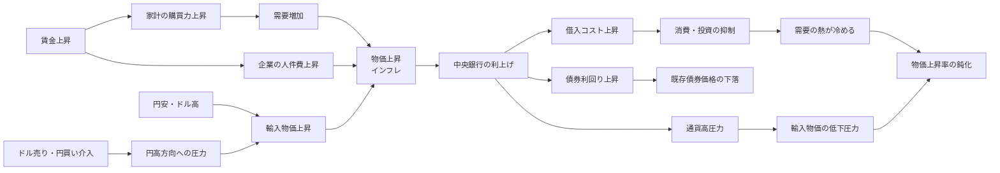
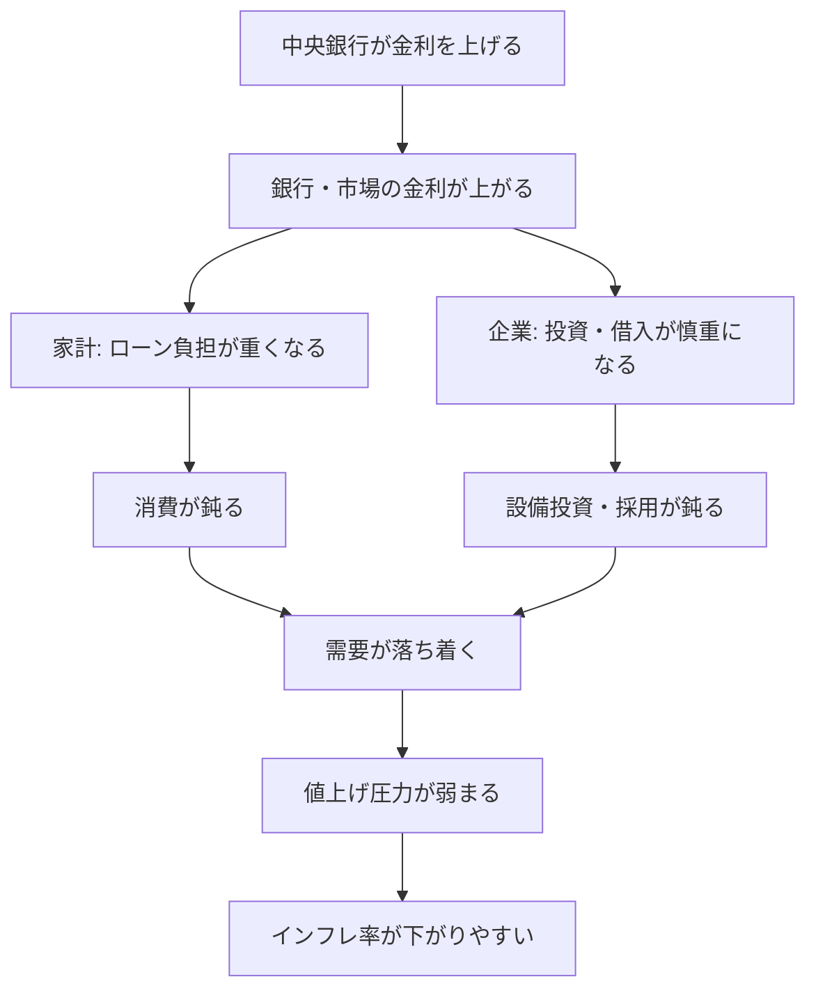
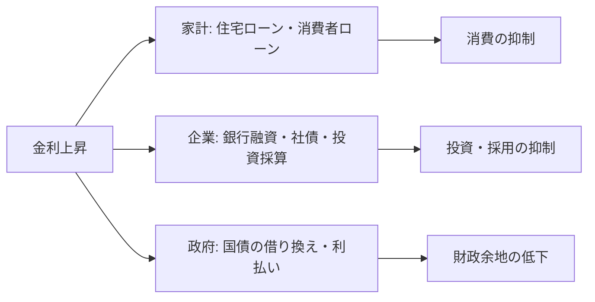
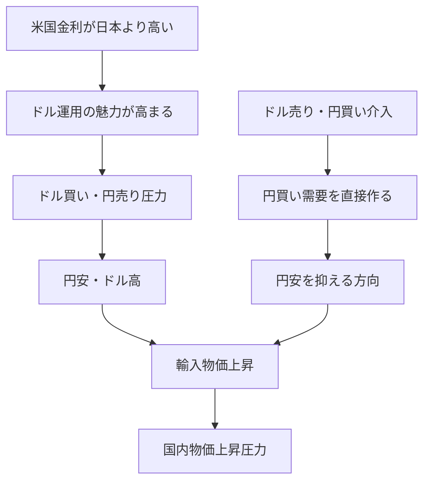
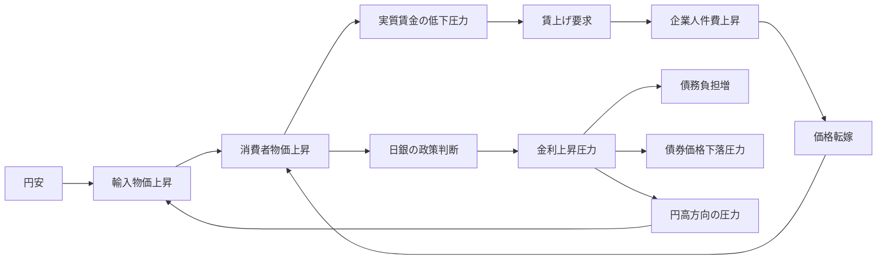

# 金利政策と物価・賃金・債券・債務・為替介入の入門レポート

作成日: 2026-05-10
調査方式: 初学者向けナラティブレビュー
カテゴリ: macro-finance
対象: 金利政策、物価、賃金、債券、債務、為替、ドル売り・円買い介入

## 引用方針

本文では、中央銀行・政府当局・公的機関の説明を優先し、重要な主張の近くに `出典メモ:` を置く。市場価格や将来見通しは日々変わるため、本レポートでは投資判断や相場予測を行わない。政策効果については、一般的なメカニズムと日本で起きやすい論点を分けて説明する。

## 1. エグゼクティブサマリー

金利政策は「お金を借りるコスト」を通じて、物価、賃金、債券価格、債務負担、為替レートに波及する。中央銀行が金利を上げると、住宅ローンや企業融資の負担は重くなり、消費・投資は抑えられやすい。需要が落ち着けば、物価上昇も弱まりやすい。一方で、既に発行済みの債券価格は下がりやすく、借金の多い家計・企業・政府には利払い負担が重くなる。

出典メモ: 日本銀行は、金融政策を「物価の安定」を目的として行い、金利形成に影響を与えるものとして説明している。[日本銀行, Monetary Policy](https://www.boj.or.jp/en/mopo/index.htm) と [Outline of Monetary Policy](https://www.boj.or.jp/en/mopo/outline/index.htm) を参照。米連邦準備制度は、政策金利が借入コスト、雇用、インフレへ波及すると説明している。[Federal Reserve, Monetary Policy: What Are Its Goals? How Does It Work?](https://www.federalreserve.gov/monetarypolicy/monetary-policy-what-are-its-goals-how-does-it-work.htm) を参照。

この仕組みは、単純な一本線ではない。賃金が上がると家計の購買力は増えるが、企業の人件費も上がる。円安が進むと輸入物価は上がりやすく、生活費を押し上げる。政府・当局がドル売り・円買い介入を行う場合、円安を抑えて輸入物価の上昇を和らげようとする狙いがある。ただし、為替介入だけで金利差や貿易収支などの根本要因を消せるわけではない。



## 2. まず押さえる用語

| 用語 | 一言でいうと | 金利政策との関係 |
|---|---|---|
| 金利 | お金を借りる料金 | 中央銀行が短期金利や市場金利に影響を与え、景気と物価を調整する中心 |
| 物価 | モノ・サービス全体の値段 | 上がりすぎると利上げ、弱すぎると利下げや金融緩和が検討される |
| 賃金 | 労働の対価 | 家計の購買力と企業コストの両方に影響し、物価と相互作用する |
| 債券 | 国・企業などが発行する借用証書 | 金利が上がると、既存債券の価格は下がりやすい |
| 債務 | 借金そのもの | 金利上昇で返済・借り換え負担が増えやすい |
| 為替 | 円とドルなど通貨の交換比率 | 金利差、貿易、投資資金の移動で変動し、輸入物価に影響する |
| ドル売り介入 | 当局がドルを売って円を買う操作 | 円安を抑える方向に働き、輸入物価上昇を和らげようとする |

金利政策を理解する入口は、「誰かの収入は、別の誰かの支出である」という見方である。家計にとって賃金は収入だが、企業にとってはコストである。銀行にとって貸出金利は収益だが、借り手にとっては負担である。国債は政府の資金調達手段だが、投資家にとっては運用商品である。金利政策は、この利害のつながり全体を動かす。

## 3. 金利政策の基本動作

中央銀行は、短期金利を中心に金融環境を調整する。金利を上げると、お金を借りるコストが上がる。住宅ローン、企業融資、クレジット、社債発行が高くなれば、家計と企業は支出を慎重にする。需要が弱まると、企業は値上げしにくくなり、物価上昇率は下がりやすい。

出典メモ: Fedは、政策金利が住宅ローン、自動車ローン、企業投資などの借入コストに波及し、総需要とインフレへ影響すると説明している。[Federal Reserve, Monetary Policy: What Are Its Goals? How Does It Work?](https://www.federalreserve.gov/monetarypolicy/monetary-policy-what-are-its-goals-how-does-it-work.htm) を参照。

反対に、金利を下げると借りやすくなる。家計は住宅や耐久消費財を買いやすくなり、企業は設備投資や採用を増やしやすい。景気が弱い局面ではこの効果が役に立つ。ただし、需要が強すぎると物価上昇や資産価格の上昇を招く。



重要なのは、金利政策には時間差があることだ。今日利上げしても、明日すべての物価が下がるわけではない。変動金利ローン、企業の借り換え、為替、賃金交渉、企業の価格改定を通じて、数か月から数年かけて効いていく。

## 4. 債券はなぜ金利で動くのか

債券は、国や企業が「一定期間お金を借り、利息を払い、満期に元本を返す」ための証券である。債券の価格と利回りは逆に動く。これが、金利政策と債券市場をつなぐ最重要ポイントである。

たとえば、年1%の利息を払う既存債券がある。その後、市場で年3%の新しい債券が買えるようになったら、年1%の債券は相対的に魅力が落ちる。買い手を見つけるには価格を下げる必要がある。価格が下がると、買った人から見た利回りは上がる。

```text
市場金利が上がる -> 新しい債券の利回りが上がる
                 -> 古い低利回り債券は売られやすい
                 -> 既存債券価格は下がる
```

出典メモ: SECのInvestor.govは、金利が上がると既存債券価格は通常下がり、金利が下がると既存債券価格は通常上がると説明している。[Investor.gov, Bonds](https://www.investor.gov/introduction-investing/investing-basics/investment-products/bonds-or-fixed-income-products/bonds) を参照。FINRAも、債券価格と金利は逆方向に動くと説明している。[FINRA, Bonds](https://www.finra.org/investors/investing/investment-products/bonds) を参照。

この関係は、金融機関や年金基金にも効く。金利上昇局面では、既に保有している長期債の評価損が出やすい。一方で、満期まで持てば額面が返ってくる債券もあるため、「価格変動の損」と「信用リスクによる損」を分けて考える必要がある。

## 5. 債務は誰に重くのしかかるか

債務は借金である。金利が上がると、新しく借りる人、変動金利で借りている人、借り換え時期を迎える人の負担が増える。

家計では、住宅ローンやカードローンの負担が増える。企業では、銀行融資、社債、設備投資の採算に影響する。政府では、国債の利払い費が増えやすくなる。ただし、すべての債務が同時に影響を受けるわけではない。固定金利で長期に借りている債務は、満期や借り換えまで影響が遅れる。



ここで誤解しやすいのは、「利上げは借金をしている人だけの問題」ではないという点だ。企業が借入コスト増を価格に転嫁すれば消費者に影響する。政府の利払い費が増えれば、将来の税・歳出の議論に影響する。銀行の貸出姿勢が厳しくなれば、借金をしていない人の雇用にも波及する。

## 6. 賃金と物価はどう結びつくか

賃金は、物価と二つの経路でつながる。第一に、賃金が上がると家計の購買力が増え、消費が増えやすい。需要が増えれば、企業は値上げしやすくなる。第二に、賃金は企業の人件費であり、企業が人件費増を商品・サービス価格に転嫁すれば、物価は上がる。

出典メモ: 日本銀行は、2%の物価安定目標を持続的・安定的に達成するには、賃金上昇を伴う形で物価が上がることが重要だと説明している。[日本銀行, 経済・物価情勢の展望](https://www.boj.or.jp/mopo/outlook/index.htm) および講演資料 [Economic Activity, Prices, and Monetary Policy in Japan](https://www.boj.or.jp/en/about/press/koen_2024/ko240423a.htm) を参照。

ただし、賃金上昇は常に悪いインフレを意味しない。良い循環は、企業の生産性や収益が上がり、賃金が上がり、家計消費が増え、企業がさらに投資できる状態である。悪い循環は、輸入物価やエネルギー価格の上昇で生活費だけが先に上がり、賃金が追いつかず、実質的な購買力が落ちる状態である。

```text
名目賃金 = 給料の額面
実質賃金 = 名目賃金から物価上昇分を差し引いた購買力
```

給料が3%上がっても、物価が5%上がれば、生活感としては苦しくなる。金利政策で見ているのは、単に賃金が上がったかではなく、賃金、物価、生産性、企業収益がどの組み合わせで動いているかである。

## 7. 為替とドル売り・円買い介入

為替レートは、金利差、貿易収支、投資資金の移動、リスク回避、政策期待などで動く。日本の文脈で円安・ドル高が進むと、輸入品、エネルギー、食料、原材料の円建て価格が上がりやすい。これは国内物価に上昇圧力をかける。

ドル売り・円買い介入は、政府・当局が保有するドルを売って円を買う操作である。市場では円を買う注文が増えるため、円安を抑える方向に働く。日本では、外国為替介入は財務大臣の権限で行われ、日本銀行は財務大臣の代理人として実務を担う。

出典メモ: 財務省は外国為替介入の実績を公表している。[財務省, Foreign Exchange Intervention Operations](https://www.mof.go.jp/english/policy/international_policy/reference/feio/index.html) を参照。日本銀行は、為替介入は財務大臣の権限で行われ、日本銀行が代理人として実施すると説明している。[日本銀行, Foreign Exchange Market Intervention](https://www.boj.or.jp/en/about/education/oshiete/intl/g18.htm) を参照。

為替介入は、物価政策そのものではない。目的は為替市場の過度な変動を抑えることにある。輸入物価を通じて物価に影響するが、中央銀行の金利政策とは役割が違う。特に、日米金利差が大きい局面では、ドルで運用する魅力が高まり、円安圧力が残りやすい。介入は流れを一時的に変えることはできても、金利差や市場期待を完全に消す手段ではない。



## 8. 日本で特に見えやすい連鎖

日本では、輸入エネルギーや食料の比重、長い低金利環境、政府債務、賃金停滞の歴史が重なり、金利政策の議論が複雑になりやすい。

第一に、円安は輸入物価を押し上げやすい。エネルギーや食料の価格が上がると、家計の生活費は増える。企業も原材料費や物流費の上昇を受けるため、価格転嫁が進めば国内物価も上がる。

第二に、賃金が物価に追いつくかが生活実感を左右する。物価だけが上がり、実質賃金が下がれば、家計は苦しくなる。中央銀行から見ると、賃金と物価がともに持続的に上がるか、一時的な輸入物価上昇に終わるかで政策判断が変わる。

第三に、国債市場への影響が大きい。長く低金利が続いた経済では、利上げは金融機関の債券評価、政府の利払い費、企業の借入コストに広く影響する。物価を抑えるための利上げは必要になり得るが、利上げの副作用も大きい。



## 9. よくある誤解

### 誤解1: 利上げすれば必ず物価はすぐ下がる

利上げは需要を冷やすが、物価には時間差がある。エネルギー価格、為替、賃金交渉、企業の価格改定、家計の支出行動が順番に動くためである。利上げ直後に物価が上がり続けることもある。

### 誤解2: 債券は安全資産なので価格は下がらない

信用力の高い国債でも、金利が上がれば市場価格は下がり得る。満期まで保有する場合と、途中で売却する場合ではリスクの見え方が違う。

### 誤解3: 賃金上昇はインフレに悪い

賃金上昇そのものが悪いわけではない。問題は、生産性や企業収益を伴わないコスト上昇が価格転嫁だけで続く場合である。賃金、物価、生産性がバランスよく上がるなら、生活水準の改善につながる。

### 誤解4: 為替介入で円安問題は解決できる

介入は市場に直接働きかける強い手段だが、金利差、貿易収支、投資資金の流れを消すものではない。持続的な為替の方向は、政策金利、インフレ見通し、成長率、国際収支、市場心理が組み合わさって決まる。

## 10. 実務・生活への読み替え

個人がニュースを読むときは、次の順番で見ると理解しやすい。

1. 物価は何で上がっているか。需要過熱か、輸入物価か、賃金か、税・制度要因か。
2. 賃金は物価に追いついているか。名目賃金ではなく実質賃金を見る。
3. 中央銀行は、物価上昇を一時的と見ているか、持続的と見ているか。
4. 金利上昇は誰に効くか。住宅ローン、企業債務、国債、金融機関のどこに負担が出るか。
5. 為替は金利差で動いているか、リスク回避や貿易要因で動いているか。
6. 為替介入は一時的な安定化策か、金利政策の代わりのように語られていないか。

この順番で読むと、「利上げすべきか」「円安は悪いか」「賃上げはインフレ要因か」といった議論を、単純な賛否ではなく、どの経路を重視している議論なのかに分解できる。

## 11. 限界と注意点

本レポートは、金利政策の基本的な波及経路を説明する入門資料であり、特定時点の政策判断や為替水準を予測するものではない。実際の政策判断では、消費者物価指数、期待インフレ、賃金統計、GDP、失業率、企業物価、国債市場、銀行貸出、国際金融環境などを総合的に見る必要がある。

また、同じ利上げでも、国や時期によって効果は異なる。住宅ローンの固定金利比率、企業の借入構造、政府債務の平均年限、輸入依存度、労働市場の強さが違うからである。したがって、「米国で効いたから日本でも同じように効く」とは限らない。

## 参考情報

- [日本銀行, Monetary Policy](https://www.boj.or.jp/en/mopo/index.htm)
- [日本銀行, Outline of Monetary Policy](https://www.boj.or.jp/en/mopo/outline/index.htm)
- [日本銀行, Foreign Exchange Market Intervention](https://www.boj.or.jp/en/about/education/oshiete/intl/g18.htm)
- [財務省, Foreign Exchange Intervention Operations](https://www.mof.go.jp/english/policy/international_policy/reference/feio/index.html)
- [Federal Reserve, Monetary Policy: What Are Its Goals? How Does It Work?](https://www.federalreserve.gov/monetarypolicy/monetary-policy-what-are-its-goals-how-does-it-work.htm)
- [Investor.gov, Bonds](https://www.investor.gov/introduction-investing/investing-basics/investment-products/bonds-or-fixed-income-products/bonds)
- [FINRA, Bonds](https://www.finra.org/investors/investing/investment-products/bonds)
