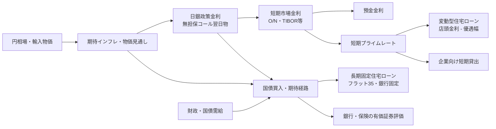
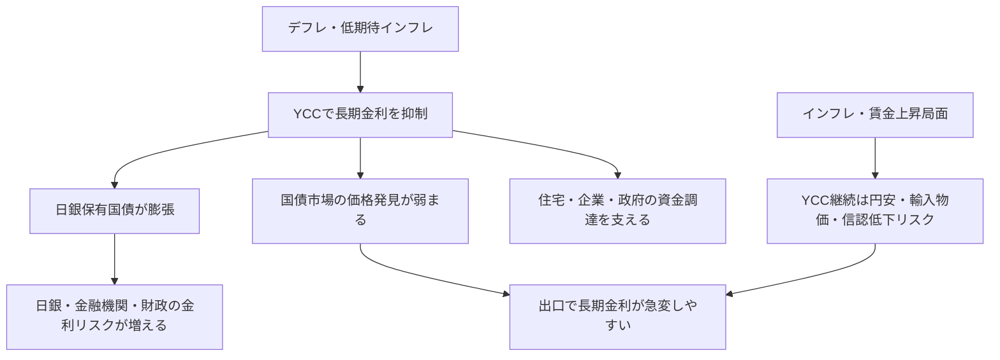

# 政策金利・銀行金利・住宅ローンと日本の長期金利政策

作成日: 2026-05-14
調査方式: 最新指標を用いた実務意思決定向けナラティブレビュー
カテゴリ: macro-finance
対象: 日本銀行の政策金利、銀行預金・貸出金利、住宅ローン、国債利回り、イールドカーブコントロール、長期的な金融政策設計

## 引用方針

金融政策・物価・GDP・住宅ローン金利・国債利回りに関する主張の近くに `出典メモ:` を置く。政策判断は、公式声明と統計で確認できる事実と、本レポートの評価・推奨を分ける。将来見通しは、日銀またはIMFの公表見通しを除き「公表情報からの推定」と明記する。

## 1. エグゼクティブサマリー

2026年5月14日時点の日本は、「インフレは一時的に鈍化して見えるが、基調インフレ・賃金・長期金利はすでにゼロ金利時代から離れている」局面にある。日銀は2026年4月28日の会合で、政策金利に相当する無担保コール翌日物を0.75%程度に据え置いた。ただし採決は6対3で、3人は1.0%への利上げを主張した。これは、据え置きが緩和継続の意思表示というより、中東情勢・原油価格・供給制約の不確実性を見ながら利上げペースを調整する判断だったことを示す。

出典メモ: 2026年4月28日の政策声明は、無担保コール翌日物を0.75%程度に維持し、反対した中川・高田・田村各委員が1.0%を提案したと記載している。[日本銀行, Statement on Monetary Policy, 2026-04-28](https://www.boj.or.jp/en/mopo/mpmdeci/mpr_2026/k260428a.pdf)。

本レポートの結論は次の通りである。

1. 政策金利は銀行の短期調達コストを通じて、普通預金、短期プライムレート、変動型住宅ローン、企業向け貸出へ波及する。長期固定住宅ローンは、政策金利そのものより、10年・20年・30年国債利回りやMBS/機構債の発行条件を強く反映する。
2. 2026年5月時点では、変動型住宅ローンへの波及は段階的だが、固定型住宅ローンと長期金利はすでに大きく上がっている。フラット35の2026年5月最頻金利は2.71%で、10年国債利回りは5月14日におおむね2.6%近辺で推移している。
3. 日銀の現在方針は「0.75%で一時停止しつつ、基調インフレが2%に近づくなら利上げを続ける」である。4月展望レポートは、2026年度の生鮮食品除くCPI中央値を2.8%、実質GDP中央値を0.5%と見込む。
4. 長期的に日本が採るべき政策は、短期政策金利を主手段にした通常のインフレ目標政策へ戻し、恒常的なYCCを再導入しないことである。YCCは市場機能、財政規律、円の信認を傷つけやすい。使うとしても、金融市場の機能不全時に期限・条件・出口を明示した非常時ツールに限るべきである。
5. 利上げは急ぎすぎても遅すぎても危険である。最も現実的な方針は、0.25%刻みの漸進的な利上げを基調にし、賃金、サービス価格、期待インフレ、円安・輸入物価、住宅ローン延滞、地域金融機関の含み損を同時に監視するデータ依存型の正常化である。

## 2. 金利の関係: 政策金利から銀行・住宅ローンへ

政策金利は、中央銀行が短期金融市場で誘導する最も短い金利である。日本では現在、日銀が無担保コール翌日物金利を誘導し、金融機関が日銀当座預金に置く資金の付利金利、短期資金の取引金利、銀行の調達コストに影響を与える。銀行はその調達コストと競争環境を見ながら、普通預金金利、定期預金金利、短期プライムレート、住宅ローン店頭金利を調整する。

出典メモ: 日銀ホームページは2026年5月14日時点で、補完当座預金制度適用利率0.75%、基準貸付利率1.0%、無担保コール翌日物を0.75%程度に誘導する方針を表示している。[日本銀行ホームページ](https://www.boj.or.jp/en/index.htm)。

変動型住宅ローンは、短期プライムレートや銀行の店頭基準金利を起点に、個別の優遇幅を差し引いて適用金利が決まることが多い。このため、政策金利が上がると、銀行の短期調達コスト、短期プライムレート、住宅ローン店頭金利の順に波及する。ただし実際の適用金利は、銀行間競争、優遇幅、既存契約の見直しルール、5年ルール・125%ルールの有無で遅れて動く。

出典メモ: 日銀の長・短期プライムレート統計は、主要行の短期プライムレート最頻値が2025年3月に1.875%、2026年2月に2.125%へ上がり、長期プライムレートが2026年5月8日に3.05%となったことを示している。[日本銀行, 長・短期プライムレート（主要行）の推移](https://www.boj.or.jp/statistics/dl/loan/prime/prime.htm)。

固定型住宅ローンは、短期政策金利より長期金利に近い。フラット35のような長期固定ローンは、貸出債権の証券化、住宅金融支援機構債、国債利回り、投資家が求めるスプレッドに左右される。したがって「日銀が0.75%だから35年固定も0.75%近辺になる」という理解は誤りである。2026年5月のフラット35最頻金利は、融資率9割以下・新機構団信付きで2.71%であり、政策金利よりかなり高い。

出典メモ: フラット35公式サイトは、2026年5月の最頻金利として、フラット35の6年目以降2.71%、フラット20の6年目以降2.39%を表示している。[フラット35公式サイト](https://www.flat35.com/)。

## 3. 最新指標: 2026年5月14日時点

最新の全国CPIは2026年3月分である。総合CPIは前年比1.5%、生鮮食品を除く総合は1.8%、生鮮食品及びエネルギーを除く総合は2.4%だった。表面上のコアCPIは2%を下回ったが、エネルギー補助や前年の食品価格上昇の反動を受けるため、基調インフレを判断するにはサービス価格、賃金、期待インフレ、コアコアを合わせて見る必要がある。

出典メモ: 総務省統計局の2026年3月全国CPIは、総合112.7・前年比1.5%、生鮮食品除く総合112.1・前年比1.8%、生鮮食品及びエネルギー除く総合111.9・前年比2.4%を示している。[総務省統計局, 2026年3月全国CPI PDF](https://www.stat.go.jp/data/cpi/sokuhou/tsuki/pdf/zenkoku.pdf)。

労働市場はまだ引き締まっている。2026年3月の完全失業率は季節調整値で2.7%だった。失業率は低位だが、実質賃金、労働参加、正規・非正規、企業規模別の賃上げ格差を見る必要がある。日銀が利上げを急ぎすぎると、名目賃金の上昇が実質所得の回復へつながる前に需要を冷やすリスクがある。

出典メモ: 統計局英語トップページは2026年3月の完全失業率を2.7%と表示している。[Statistics Bureau of Japan](https://www.stat.go.jp/english/index.htm)。

GDPは注意が必要である。2026年5月14日時点では、2026年1-3月期GDPの1次速報はまだ公表されていない。内閣府ESRIの公表予定では、2026年1-3月期の1次速報は2026年5月19日8時50分である。したがって、本レポートで利用できる最新の四半期GDP公式値は2025年10-12月期の2次速報で、実質GDPは前期比0.6%、年率2.6%だった。

出典メモ: 内閣府ESRIの公表予定は、2026年1-3月期GDP1次速報を2026年5月19日8時50分としている。[ESRI, Release Schedule](https://www.esri.cao.go.jp/en/sna/kouhyou/kouhyou_top.html)。2025年10-12月期2次速報の実質GDP前期比0.6%、年率2.6%は [ESRI, Quarterly Estimates of GDP Oct.-Dec. 2025 Second Preliminary](https://www.esri.cao.go.jp/en/sna/data/sokuhou/files/2025/qe254_2/pdf/gaiyou2542_e.pdf) に基づく。

長期金利は、すでにYCC時代とは別の水準に移った。2026年5月14日の国内債券市場では、10年国債利回りがおおむね2.6%近辺で推移した。これは、固定住宅ローン、国債利払い、銀行・保険会社の有価証券評価、企業の長期資金調達に直接効く。

出典メモ: 2026年5月14日の10年国債利回りについては、市場速報で2.599%前後、Investing.com日本版で21:51時点2.635%が確認できる。速報値であり、確報・日次統計とは扱いを分ける。[LIMO, 2026-05-14 国債利回り](https://limo.media/articles/-/124478)、[Investing.com 日本 国債利回り](https://jp.investing.com/rates-bonds/)。

| 指標 | 最新値・時点 | 政策判断上の読み方 |
|---|---:|---|
| 日銀政策金利 | 0.75%程度、2026-04-28会合で維持 | まだ実質金利は大きくマイナス。緩和度合いは残る |
| 全国CPI総合 | 1.5%、2026年3月 | エネルギー補助・反動を含む表面値 |
| 全国CPI生鮮除く | 1.8%、2026年3月 | 日銀目標2%を一時的に下回る |
| 全国CPI生鮮・エネルギー除く | 2.4%、2026年3月 | 基調価格圧力は残る |
| 完全失業率 | 2.7%、2026年3月 | 労働市場はなおタイト |
| 実質GDP | 前期比0.6%、年率2.6%、2025年10-12月 | 直近公式GDPは底堅いが、2026年1-3月は未公表 |
| フラット35最頻金利 | 2.71%、2026年5月 | 長期固定ローンは明確に上昇 |
| 10年国債利回り | 約2.6%、2026年5月14日 | 固定金利・財政・金融機関評価に効く |

## 4. 日銀の現在方針と今後の方針

日銀の現在方針は、単純な「様子見」ではない。2026年4月展望レポートは、2026年度の実質GDP成長率中央値を0.5%、生鮮食品除くCPI中央値を2.8%、生鮮食品・エネルギー除くCPI中央値を2.6%とした。2027年度も、生鮮食品除くCPI中央値2.3%、コアコア2.6%である。これは、日銀が「2026年は成長が鈍るが、物価は目標を上回りやすい」と見ていることを意味する。

出典メモ: 2026年4月展望レポートは、2026年度の実質GDP中央値0.5%、生鮮食品除くCPI中央値2.8%、生鮮食品・エネルギー除くCPI中央値2.6%、2027年度の同0.7%、2.3%、2.6%を示している。[日本銀行, Outlook for Economic Activity and Prices, April 2026](https://www.boj.or.jp/en/mopo/outlook/gor2604a.pdf)。

4月会合の主な意見は、委員会内部の重心が利上げ方向にあることを示す。複数の意見が、基調インフレが2%に近づき、実質政策金利が著しく低い以上、政策金利を引き上げて緩和度合いを調整することが適切だと述べている。一方で、中東情勢と供給制約の不確実性が大きいため、4月時点では据え置きが選ばれた。

出典メモ: 2026年4月会合の主な意見は、「基調的なCPIが2%に近づき、実質金利が著しく低い」ため利上げ継続が適切との意見と、4月会合では中東情勢を見極める必要があるとの意見を併記している。[日本銀行, Summary of Opinions, April 27 and 28, 2026](https://www.boj.or.jp/en/mopo/mpmsche_minu/opinion_2026/opi260428.pdf)。

今後の日銀方針は、公表情報からの推定では、次の三条件で利上げ再開に傾く。

1. サービス価格・賃金・期待インフレが2%近辺に定着する。
2. 原油高が一時的な供給ショックで終わらず、円安・輸入物価・物流費を通じて広範な価格転嫁に波及する。
3. 2026年1-3月GDPや家計消費が、利上げに耐えられる程度に底堅い。

逆に、供給制約が生産停滞、雇用悪化、消費失速として強く出る場合、日銀は利上げを遅らせるべきである。供給ショック時の金融政策は難しい。物価だけを見れば利上げだが、実質所得と生産が同時に傷む場合、利上げは需要をさらに冷やす。したがって、日銀の正しい反応関数は「インフレ率が高いから機械的に利上げ」ではなく、「基調インフレと期待インフレが目標を上回り、景気が潜在成長率近辺で持ちこたえるなら利上げ」である。

IMFも、おおむね同じ方向を支持している。2026年Article IVでは、日銀の緩和撤回は適切で、基調インフレが目標に近づくにつれて中立金利へ向けた漸進的利上げを続けるべきだとした。同時に、外部環境、中立金利、金融政策の波及には不確実性があるため、柔軟でデータ依存的な運営が必要だとしている。

出典メモ: IMF 2026 Article IVは、日銀が緩和を適切に撤回しており、基調インフレが目標へ近づくなかで中立的な政策スタンスに向けた漸進的利上げを続けるべきだと述べる。[IMF, 2026 Article IV Consultation with Japan](https://www.imf.org/en/news/articles/2026/04/02/pr-26105-japan-imf-executive-board-concludes-2026-article-iv-consult)。

## 5. YCCとは何だったか

イールドカーブコントロールは、中央銀行が短期金利だけでなく長期金利も目標にして国債を買う政策である。日本では2016年9月に「長短金利操作付き量的・質的金融緩和」として導入され、短期金利をマイナス、10年国債利回りをゼロ%程度に誘導する枠組みだった。目的は、デフレ脱却に必要な緩和を続けながら、長すぎる金利低下で金融機関収益や年金・保険運用を傷める副作用を抑えることにあった。

出典メモ: 日銀のQQE参考ページは、2016年9月にYCCを導入し、短期・長期金利を市場調節でコントロールすることを決めたと説明している。[日本銀行, Monetary Policy under QQE Introduced in 2013](https://www.boj.or.jp/en/mopo/outline/ref_qqe.htm)。

YCCはデフレ期には合理性があった。期待インフレが低く、名目金利がゼロ下限に張りつき、政府・企業・家計が低金利に慣れきっていた局面では、長期金利を抑えることで金融環境を強く緩和できた。しかし、インフレ率が2%近辺に近づき、日銀自身が「賃金と物価が相互に緩やかに上昇するメカニズム」の維持を見込む局面では、国債利回りを人為的に抑え続ける副作用が大きくなる。

2024年3月、日銀はQQE with YCCとマイナス金利政策が役割を果たしたと判断し、短期金利を主な政策手段にする枠組みへ移行した。これは重要な制度変更である。日銀は長期金利を完全に放置しているわけではなく、急激な長期金利上昇には国債買入増額や指値オペで対応できるとしたが、恒常的な10年金利目標は終了した。

出典メモ: 2024年3月19日の政策枠組み変更は、QQE with YCCとマイナス金利政策が役割を果たしたとし、短期金利を主な政策手段にする方針を示した。同時に、長期金利が急上昇する場合は国債買入増額や指値オペで機動的に対応するとした。[日本銀行, Changes in the Monetary Policy Framework, 2024-03-19](https://www.boj.or.jp/en/mopo/mpmdeci/state_2024/k240319a.htm)。

## 6. 日本にとって長期的に望ましい政策

長期的に望ましい金融政策は、短期金利を主手段にした柔軟なインフレ目標政策である。日銀は2%物価目標を維持しつつ、政策金利を中立金利へ近づける。ただし、日本の中立金利は推定誤差が大きい。人口動態、潜在成長率、財政プレミアム、グローバル金利、円のリスクプレミアムで変わるため、特定の数字を固定目標にするべきではない。

この枠組みでは、日銀は次の順序で政策を運営するのがよい。

1. 基調インフレ、サービス価格、賃金、期待インフレを主指標にする。
2. 0.25%刻みを基本に、会合ごとに利上げ・据え置きを判断する。
3. 実質政策金利が大きくマイナスの間は、景気が崩れない限り緩和度合いを減らす。
4. 長期金利は市場に価格発見させる。
5. 国債市場が機能不全になったときだけ、流動性供給・買入増額・指値オペを使う。

YCCを恒常政策として復活させるべきではない。理由は三つある。

第一に、インフレ局面のYCCは円安と輸入物価を悪化させる。長期金利を人為的に抑えると、海外との金利差が広がり、円安圧力が高まりやすい。日本のインフレはエネルギー・食料・輸入財の影響を強く受けるため、円安は家計の実質所得を傷める。

第二に、YCCは財政ファイナンスとの境界を曖昧にする。日銀が長期国債利回りを抑え続けると、政府は高債務でも低利払いを前提にしやすくなる。これは金融政策の独立性と財政規律を弱める。金利上昇による財政負担は現実の問題だが、それを金融政策で隠すと、出口のコストがより大きくなる。

第三に、YCCは市場機能を壊す。国債利回りは、物価、成長、財政、リスクプレミアムを反映する重要な価格である。中央銀行が長期間それを固定すると、価格発見、ヘッジ、担保評価、銀行・保険会社のALMが歪む。出口では、抑え込まれていた金利が一気に動き、むしろ金融安定リスクを高める。

ただし、YCC的な手段を完全に否定すべきではない。国債市場が流動性を失い、価格発見ではなく投げ売り・担保不安・決済不安が起きる場合、中央銀行は最後の市場安定化主体として介入する必要がある。その場合も、目標金利を恒久的に守るのではなく、期限、買入規模、対象年限、終了条件を明示し、金融政策の目的が「財政支援」ではなく「市場機能の回復」であることをはっきりさせるべきである。

## 7. 住宅ローン利用者・銀行・政府への含意

住宅ローン利用者にとって、重要なのは「政策金利が何%か」より、自分のローンがどの金利に連動しているかである。変動型は短期プライムレートと銀行の基準金利、固定型は長期国債利回りと市場調達コストを見なければならない。2026年5月時点では、固定型の上昇はすでに明確で、変動型は今後の追加利上げで遅れて効く可能性が高い。

銀行にとっては、利上げは利ざや改善と評価損拡大の両面を持つ。預金金利の上げ方が遅ければ利ざやは改善するが、保有国債の評価損、固定金利貸出の収益性、住宅ローン延滞、地域銀行の有価証券ポートフォリオには圧力がかかる。日銀が長期金利を完全に抑え込むと評価損は一時的に隠れるが、市場機能の回復は遅れる。

政府にとっては、金利正常化は財政運営の現実を取り戻す過程である。低金利が永続する前提で歳出を組む時代は終わった。財政政策は、インフレを刺激する一律給付や広範な補助金より、低所得層・中小企業・エネルギー供給安定への的を絞った支援に寄せるべきである。金融政策がインフレ抑制へ動く一方で、財政が需要を過度に刺激すれば、日銀はより高い金利で対応せざるを得なくなる。

## 8. 推奨方針

本レポートの推奨は、次の通りである。

1. 日銀は0.75%で長く止まりすぎるべきではない。2026年1-3月GDP、春闘賃上げの波及、サービス価格、期待インフレが底堅ければ、追加利上げを続けるべきである。
2. 利上げペースは急がない。原油・中東情勢が供給制約として生産と所得を同時に傷める場合、会合をまたいで据え置く柔軟性を残す。
3. YCCは復活させない。長期金利は市場に任せ、国債買入は量的引き締めと市場機能のバランスを見て調整する。
4. 市場機能不全時の介入ルールを明文化する。長期金利の水準防衛ではなく、流動性と決済の安定化を目的にする。
5. 政府は財政政策で日銀の足を引っ張らない。インフレ補助は低所得層・供給制約・構造投資に絞り、国債市場に「金融政策で財政を守る」という期待を作らない。
6. 住宅ローン利用者向けには、変動金利のストレステストを標準化する。政策金利1.0%、1.5%、2.0%の返済額を契約前に示し、5年ルール・125%ルールの有無を明記する。

最終判断として、日本は「デフレ対策としての超低金利」から「物価安定と金融安定を両立する通常政策」へ移るべきである。YCCはその移行期に最も強い誘惑になる。国債利回り、住宅ローン、財政利払いへの痛みを抑えたくなるからである。しかし、その痛みを中央銀行が長期金利固定で隠すと、円安、輸入インフレ、市場機能低下、財政規律の劣化として戻ってくる。日本に必要なのは、YCCへの回帰ではなく、金利のある経済に耐える財政・住宅・金融システムへの調整である。

## 参考情報

- [日本銀行, Statement on Monetary Policy, 2026-04-28](https://www.boj.or.jp/en/mopo/mpmdeci/mpr_2026/k260428a.pdf)
- [日本銀行, Outlook for Economic Activity and Prices, April 2026](https://www.boj.or.jp/en/mopo/outlook/gor2604a.pdf)
- [日本銀行, Summary of Opinions, April 27 and 28, 2026](https://www.boj.or.jp/en/mopo/mpmsche_minu/opinion_2026/opi260428.pdf)
- [日本銀行, Changes in the Monetary Policy Framework, 2024-03-19](https://www.boj.or.jp/en/mopo/mpmdeci/state_2024/k240319a.htm)
- [総務省統計局, 2026年3月全国CPI PDF](https://www.stat.go.jp/data/cpi/sokuhou/tsuki/pdf/zenkoku.pdf)
- [Statistics Bureau of Japan](https://www.stat.go.jp/english/index.htm)
- [ESRI, Release Schedule](https://www.esri.cao.go.jp/en/sna/kouhyou/kouhyou_top.html)
- [ESRI, Quarterly Estimates of GDP Oct.-Dec. 2025 Second Preliminary](https://www.esri.cao.go.jp/en/sna/data/sokuhou/files/2025/qe254_2/pdf/gaiyou2542_e.pdf)
- [フラット35公式サイト](https://www.flat35.com/)
- [日本銀行, 長・短期プライムレート（主要行）の推移](https://www.boj.or.jp/statistics/dl/loan/prime/prime.htm)
- [IMF, 2026 Article IV Consultation with Japan](https://www.imf.org/en/news/articles/2026/04/02/pr-26105-japan-imf-executive-board-concludes-2026-article-iv-consult)
