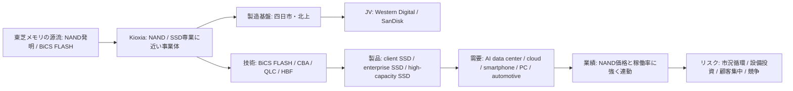
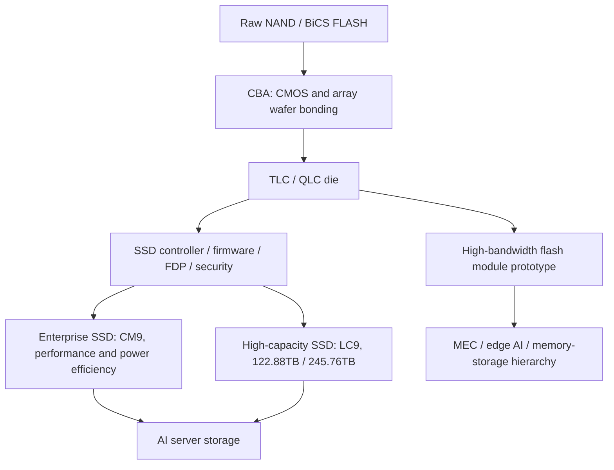

# キオクシア調査レポート

作成日: 2026-05-14
調査方式: 企業・技術・市場のナラティブレビュー
カテゴリ: semiconductor-memory
対象: キオクシアホールディングス、NANDフラッシュ、SSD、AIデータセンター向けストレージ、Western Digital/SanDiskとのJV、日本の半導体政策

## 1. エグゼクティブサマリー

キオクシアは、東芝メモリを源流とするNANDフラッシュ専業に近い半導体メモリ企業である。1987年に東芝がNANDフラッシュを発明し、2007年に3Dフラッシュメモリ技術BiCS FLASHを発表した流れを継承している。現在の事業は、スマートフォン/PC向けフラッシュ、企業・クラウド向けSSD、データセンター/AI向け高容量SSDを中心に構成される。

出典メモ: 1987年のNAND発明、2007年の3Dフラッシュ技術、2018年の東芝グループからの独立、2019年のKioxiaへのリブランド、2024年12月の東証プライム上場は、[Kioxia Integrated Report 2025](https://www.kioxia-holdings.com/content/dam/kioxia-hd/en-jp/ir/library/integrated-report/2025/asset/Integrated-Report-2025-all-print-en.pdf) p.7-8付近および [KIOXIA at a Glance](https://www.kioxia-holdings.com/en-jp/about/glance.html) に基づく。

本レポートの結論は次の通りである。

1. キオクシアの強みは、NANDの発明企業としての技術蓄積、四日市/北上の大規模生産、Western Digital/SanDiskとの長期JV、BiCS FLASH/CBA/QLC高容量SSDにある。
2. 2025年後半から2026年にかけて、AIデータセンター、enterprise SSD、nearline HDD不足、スマートデバイスの高容量化がNAND需給を引き締め、キオクシアのQ3 FY2025単体業績は売上収益5436億円、営業利益1428億円、四半期利益878億円まで回復した。
3. 一方、FY2025 Q3累計では前年同期比で売上収益と利益が低下しており、NAND市況の循環性は消えていない。メモリ企業としての本質的リスクは、価格、稼働率、設備投資、顧客集中、技術世代移行のタイミングにある。
4. 技術戦略は「最先端NAND単体」から「AI時代のストレージ階層」へ広がっている。245.76TB NVMe SSD、8th generation BiCS FLASH、5TB/64GB/s高帯域フラッシュモジュール試作は、GPU周辺のデータ供給、RAG/ベクトルDB、学習データ湖、エッジAIを意識した動きである。
5. 日本の半導体政策上、キオクシアはRapidusのようなロジック復興とは別の意味を持つ。信頼できる国内メモリ供給能力を維持する企業であり、経済安全保障上の価値は高い。ただし、NANDはDRAM/HBMとは別市場であり、AI半導体ブームをそのまま同じ倍率で受けるわけではない。

## 2. 会社の位置付け

キオクシアの社名は、日本語の「記憶」とギリシャ語の「価値」を意味するAxiaを組み合わせたものだ。旧東芝メモリは2018年に東芝グループから独立し、2019年10月にKioxiaブランドへ移行した。2024年12月18日には東京証券取引所プライム市場へ上場し、証券コードは285Aである。

出典メモ: 社名の由来は [About KIOXIA Group](https://www.kioxia-holdings.com/en-jp/about.html)。東証プライム上場はキオクシア公式発表 [Kioxia Holdings Lists on the Tokyo Stock Exchange Prime Market](https://www.kioxia-holdings.com/en-jp/news/2024/20241218-1.html) と [JPX initial listing outline](https://www.jpx.co.jp/english/listing/stocks/new/dh3otn000000libx-att/12KioxiaHoldings-OutlinetEN.pdf) に基づく。JPX資料は上場予定日を2024-12-18、Prime Market、証券コード285Aと示している。

事業の中核はMemory単一セグメントである。FY2024の売上収益は1兆7064億円で、用途別にはSSD & Storageが9911億円、Smart Devicesが5011億円、Otherが2142億円だった。外部顧客別ではApple Group、Sandisk Group、Dell Groupが主要顧客として開示されている。これはキオクシアが「汎用半導体メーカー」ではなく、NANDとSSDに深く集中した企業であることを示す。

出典メモ: 単一セグメント、FY2024用途別売上、主要顧客は [Annual Securities Report FY2024](https://www.kioxia-holdings.com/content/dam/kioxia-hd/en-jp/ir/library/securities/asset/Annual-Securities-Report-FY2024-EN.pdf) p.19-22付近。KIOXIA at a GlanceはFY2024連結売上収益を1,706.5 billion yenとしている。

上場後の株主構成には、旧親会社の東芝とBain Capital系のPangeaが大きく残る。2025年9月30日時点の主要株主として、Toshiba Corporation 27.25%、BCPE Pangea Cayman, L.P. 22.00%、BCPE Pangea Cayman2, Ltd. 14.34%などが開示されている。これは、キオクシアが公開会社になった後も、東芝再編とBain主導買収の影響を残す資本構造を持つことを意味する。

出典メモ: 主要株主は [Kioxia Stock Information](https://www.kioxia-holdings.com/en-jp/ir/stock/outline.html) の2025-09-30時点開示。2017年のBain/Pangea買収構成、SK hynixやApple/Dell/Kingston/Seagateの関与は [Toshiba 2017 press release PDF](https://www.kioxia.com/content/dam/kioxia/shared/about/news/2017/asset/20170928_1.pdf) に基づく。

## 3. 技術: NANDからAIストレージへ

キオクシアの技術軸は、NANDフラッシュを平面方向だけで微細化する時代から、3D積層、セルあたり多ビット化、CBA、コントローラ/ファームウェア、SSDシステム設計へ移ってきた。8th generation BiCS FLASHは218 world-lines、CBA、OPSを採用し、1Tb TLC製品で18.3Gb/mm2のメモリ密度を主張している。CBAはCMOS制御回路とメモリアレイを別ウェハで最適化し、後で接合する発想であり、性能、密度、電力効率を同時に押し上げる狙いがある。

出典メモ: 8th generation BiCS FLASHの218 world-lines、CBA、OPS、1Tb TLC 18.3Gb/mm2は [Kioxia R&D: Overview of new technologies applied to BiCS FLASH generation 8](https://www.kioxia.com/en-jp/rd/technology/topics/topics-66.html)。同ページはIEDM 2023での発表に基づく技術解説である。

AIデータセンター向けには、二つの製品方向が見える。第一はenterprise SSDの高性能化である。CM9 Seriesは8th generation BiCS FLASH TLCとCBAを使ったPCIe 5.0 NVMe SSDで、前世代CM7比でランダム書込最大約65%、ランダム読込約55%、シーケンシャル書込約95%の性能改善をうたう。第二は高容量化である。LC9 Seriesは122.88TBから245.76TBへ広がり、2Tb QLC dieと32-die stackを使って、生成AI環境のデータセット、RAG、ベクトルDB、データレイク向けに訴求している。

出典メモ: CM9 Seriesの仕様と性能改善は [Kioxia CM9 announcement, 2025-05-16](https://www.kioxia.com/en-jp/business/news/2025/20250516-1.html)。LC9 Series 245.76TB、32-die stack、2Tb QLC、生成AI/RAG用途は [Kioxia LC9 245.76TB announcement, 2025-07-22](https://apac.kioxia.com/en-apac/business/news/2025/20250722-1.html)。

さらに研究開発として、5TB容量、64GB/s帯域、40W未満の高帯域フラッシュメモリモジュールを試作している。これはDRAM/HBMを直接置き換えるものではないが、容量と帯域のトレードオフをフラッシュ側から詰める試みである。大規模AIモデルをエッジ/MEC側で扱う構想とも接続している。

出典メモ: 5TB/64GB/s/40W未満、PCIe 6.0、128Gbps PAM4、NEDO委託事業は [Kioxia high-bandwidth flash memory module announcement, 2025-08-20](https://www.kioxia.com/en-jp/about/news/2025/20250820-1.html)。

## 4. 需給と業績

NAND市場は、DRAMやHBM以上に価格循環の影響を受けやすい。2022-2023年の下落局面では、業界全体が在庫調整と減産に追い込まれた。FY2024には、データセンター/enterprise SSDの回復、生成AIによるデータ保存需要、スマートデバイス需要の改善で、キオクシアは大きく業績を戻した。

出典メモ: FY2024の回復、2022-2023年の下落、生成AIとデータセンター/enterprise SSDの寄与は [Kioxia Integrated Report 2025](https://www.kioxia-holdings.com/content/dam/kioxia-hd/en-jp/ir/library/integrated-report/2025/asset/Integrated-Report-2025-all-print-en.pdf) p.8付近。

FY2025 Q3累計では、売上収益は1兆3348億円、営業利益は2736億円、親会社所有者帰属利益は1468億円だった。前年同期比では売上収益が1.8%減、営業利益が34.0%減、親会社所有者帰属利益が41.8%減である。Q3単体で見ると、売上収益5436億円、営業利益1428億円、四半期利益878億円まで改善しており、足元の需給改善と価格上昇が強く反映されている。

出典メモ: FY2025 Q3累計とQ3単体の数値は [JPX TDnet: 2026年3月期 第3四半期決算短信](https://www2.jpx.co.jp/disc/285A0/140120260212556330.pdf) p.12-14付近。売上収益1,334,776百万円、営業利益273,574百万円、Q3単体売上収益543,631百万円、営業利益142,754百万円が記載されている。

外部市場データでも、2025年後半のNAND回復は確認できる。TrendForceは2025年2QにNAND上位5社の合計売上が前四半期比22%増の146.7億ドルになったとし、Kioxiaは21.4億ドル、前四半期比11.4%増、3位と報じた。SamsungとSK Groupのenterprise SSD/AI server向け伸長が目立つ一方で、KioxiaもAI server需要とPC/スマホ顧客の在庫正常化の恩恵を受けている。

出典メモ: 2025年2Q NAND市場、Kioxia売上21.4億ドル、前四半期比11.4%増、3位は [TrendForce, 2025-08-28](https://www.trendforce.com/presscenter/news/20250828-12688.html)。これは市場調査会社による推定であり、会社決算とは集計範囲が異なる可能性がある。

## 5. 生産基盤とパートナーシップ

キオクシアの製造基盤は、三重県四日市工場と岩手県北上工場に集約される。四日市工場は世界最大級のフラッシュメモリ製造拠点の一つであり、北上工場はFab1が2020年、Fab2が2025年9月に稼働した。両拠点はWestern Digital/SanDiskとのJVに深く結びついている。

出典メモ: 四日市工場の規模感は [KIOXIA at a Glance](https://www.kioxia-holdings.com/en-jp/about/glance.html)。北上Fab1/Fab2の稼働時期は [Kitakami Plant](https://www.kioxia.com/en-jp/about/kitakami.html)。SanDiskとの共同事業体と等しい意思決定権は [Annual Securities Report FY2024](https://www.kioxia-holdings.com/content/dam/kioxia-hd/en-jp/ir/library/securities/asset/Annual-Securities-Report-FY2024-EN.pdf) p.74付近に記載がある。

このJVは、キオクシアにとって規模と設備投資負担の分散をもたらす一方、戦略自由度を制約する。Western Digital側のフラッシュ事業はSanDiskとして分離されており、キオクシアとのJVはNAND業界再編の焦点になり続ける。過去のWestern Digitalとの統合交渉は実現しなかったが、製造・開発面での関係は続いている。

出典メモ: JV施設は2024年に最大1500億円の日本政府補助金承認を受けた。対象は四日市/北上の最新3Dフラッシュと将来世代ノードであり、キオクシアとWestern Digitalは20年以上のJVを強調している。[Kioxia and Western Digital JV subsidy announcement, 2024-02-06](https://www.kioxia.com/en-jp/about/news/2024/20240206-1.html) を参照。

日本政府の補助金は、単なる企業支援ではなく、信頼できるメモリ供給を国内に維持する政策である。AI/クラウド/自動運転/5Gに必要なストレージを国内で量産できることは、ロジック半導体やHBMとは異なる経済安全保障の柱になる。ただし、政策支援は市場循環を消せない。需要の読み違い、価格下落、稼働率低下が起きれば、補助金付き設備でも収益性は悪化する。

## 6. リスクと限界

第一のリスクは市況循環である。NANDはコモディティ性が強く、供給過剰になると価格が急落する。キオクシアが高容量SSDやAI用途へ寄せても、ビット供給が過剰になればマージンは縮む。FY2025 Q3単体の強さと、同累計の前年同期比減益が同時に存在する点が、この循環性をよく示している。

第二のリスクは競争である。Samsung、SK hynix/Solidigm、Micron、SanDisk、YMTCが、層数、QLC、enterprise SSD、コントローラ、顧客契約で競う。TrendForceは2025年2QにSamsungを首位、SK Groupを2位、Kioxiaを3位とした。特にSK GroupはSolidigmのenterprise SSDと321L NAND量産で伸びたとされ、AI server/data center向けの競争は激しい。

出典メモ: Samsung、SK Group、Kioxia、Micron、SanDiskの2025年2Q順位と成長要因は [TrendForce, 2025-08-28](https://www.trendforce.com/presscenter/news/20250828-12688.html)。

第三のリスクは財務レバレッジと資金調達制約である。2025年12月末時点で資産合計は3兆1948億円、負債合計は2兆2162億円、資本合計は9786億円である。Q3決算短信は、シニア・ファシリティ、リボルビング・クレジット・ファシリティ、連結レバレッジ・レシオ、連結デット・エクイティ・レシオ等の財務制限条項を開示している。メモリ事業は設備投資が重く、資本市場と銀行借入へのアクセスが競争力に直結する。

出典メモ: 財政状態、借入金、財務制限条項は [JPX TDnet: 2026年3月期 第3四半期決算短信](https://www2.jpx.co.jp/disc/285A0/140120260212556330.pdf) p.11, p.19-21付近。

第四のリスクは顧客集中と製品ミックスである。FY2024ではApple、Sandisk、Dellが主要顧客として開示されている。高容量enterprise SSDへ移るほど、大口クラウド、サーバーOEM、ストレージプラットフォーム事業者との長期契約が重要になる。需要が強い局面では安定販売につながるが、価格交渉力や仕様要求は厳しくなる。

第五の限界は、AIブームとの距離である。キオクシアはAIデータセンターの恩恵を受けるが、NVIDIA GPUやHBMほど直接的にAI計算需要を独占するわけではない。NANDは、学習データ、チェックポイント、RAG、ログ、ベクトルDB、推論周辺データ、HDD置換の需要を受ける。AI需要が伸びても、価格上昇、顧客の在庫調整、HDD/SSD/Tape/CXL/DRAM階層の選択によって収益効果は変わる。

## 7. 実務的な見方

キオクシアを評価する時は、半導体株として「AI銘柄かどうか」を見るより、NAND需給サイクルのどの地点にいるか、企業向けSSDへのミックス改善がどれだけ進むか、JVと資本構造がどれだけ柔軟になるかを見るべきである。

実務判断の観点は次の五つに絞れる。

| 観点 | 見るべき問い | 現時点の評価 |
|---|---|---|
| 技術 | BiCS/CBA/QLCで世代競争に残れるか | 8th generation BiCS、CM9、LC9、HBF試作は前向き材料 |
| 需要 | AI/クラウド需要がNAND価格を支えるか | 2025年後半から強いが、循環性は残る |
| 収益 | SSD & Storageの高付加価値化が進むか | FY2024とQ3 FY2025ではenterprise/data center寄与が大きい |
| 財務 | 設備投資と借入を耐えられるか | 利益回復で改善中だが、負債と財務制限条項は重要 |
| 政策 | 日本国内メモリ供給の戦略価値が続くか | 補助金と国内拠点の意味は大きいが、市場リスクの代替にはならない |

公表情報からの推定として、キオクシアの今後の焦点は、単なるNAND層数競争ではなく、AIインフラのストレージ階層で「どのワークロードを自社SSD/フラッシュモジュールで取るか」に移る。LC9のような超高容量QLC SSDは、HDD置換、データレイク、RAG、チェックポイント、AIログに向く。CM9のような高性能TLC SSDは、低遅延・高IOPSが必要な企業/クラウド用途に向く。HBF試作は、まだ研究開発段階だが、DRAMとSSDの間にある容量/帯域の空白を狙う動きとして重要である。

## 8. 推奨方針

技術・事業理解のためには、キオクシアを「日本の半導体復活」という大きな物語だけで読むべきではない。より正確には、キオクシアはNANDフラッシュの発明系譜、東芝再編、Bain主導買収、Western Digital/SanDisk JV、日本政府の経済安全保障政策、AIデータセンターのストレージ需要が重なった会社である。

投資・提携・採用・政策評価のどの文脈でも、次の順に確認するのがよい。

1. FY2025通期決算とFY2026見通しで、Q3単体の強さが一過性か継続的かを確認する。
2. enterprise/data center SSD比率、長期供給契約、平均販売価格、bit出荷の方向を追う。
3. Kitakami Fab2と四日市/北上の稼働率、補助金対象設備の量産寄与を確認する。
4. Samsung/SK hynix/Micron/SanDisk/YMTCとの世代別ロードマップを比較する。
5. AIストレージ需要を、GPU/HBM需要と混同せず、データ保存・検索・推論周辺・HDD置換の需要として分解する。

現時点の総合評価は、「AI時代のデータ保存需要を受ける日本の重要NAND企業。ただし、成長企業というより強烈なメモリサイクルの中で技術・資本・生産規模を競う企業」とするのが最も現実に近い。

## 参考情報

- [Kioxia Holdings Investor Relations](https://www.kioxia-holdings.com/en-jp/ir.html)
- [Kioxia Integrated Report 2025](https://www.kioxia-holdings.com/content/dam/kioxia-hd/en-jp/ir/library/integrated-report/2025/asset/Integrated-Report-2025-all-print-en.pdf)
- [Annual Securities Report FY2024](https://www.kioxia-holdings.com/content/dam/kioxia-hd/en-jp/ir/library/securities/asset/Annual-Securities-Report-FY2024-EN.pdf)
- [2026年3月期 第3四半期決算短信](https://www2.jpx.co.jp/disc/285A0/140120260212556330.pdf)
- [KIOXIA at a Glance](https://www.kioxia-holdings.com/en-jp/about/glance.html)
- [Kioxia Products & Technology](https://www.kioxia-holdings.com/en-jp/product-technology.html)
- [BiCS FLASH generation 8 technology](https://www.kioxia.com/en-jp/rd/technology/topics/topics-66.html)
- [CM9 Series announcement](https://www.kioxia.com/en-jp/business/news/2025/20250516-1.html)
- [LC9 245.76TB announcement](https://apac.kioxia.com/en-apac/business/news/2025/20250722-1.html)
- [High-bandwidth flash module announcement](https://www.kioxia.com/en-jp/about/news/2025/20250820-1.html)
- [Kioxia and Western Digital JV subsidy announcement](https://www.kioxia.com/en-jp/about/news/2024/20240206-1.html)
- [TrendForce NAND Flash 2Q25](https://www.trendforce.com/presscenter/news/20250828-12688.html)
