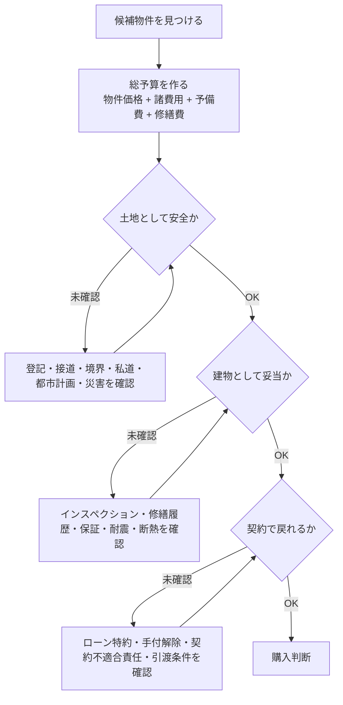
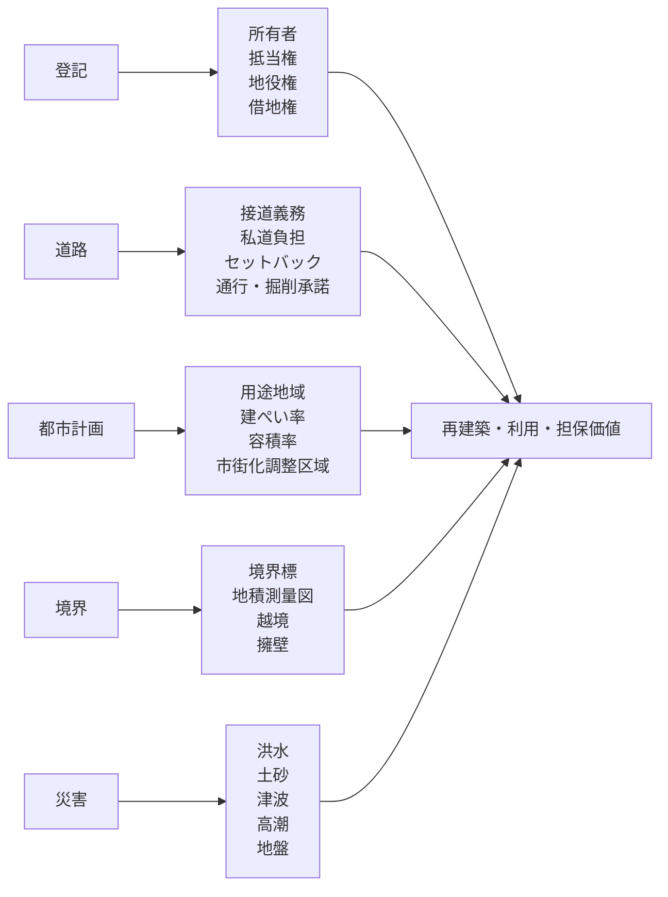

# Things to keep in mind when purchasing a detached house

## 1. Executive Summary

When purchasing a detached house, it is easy to make mistakes because you only look at the price of the property and neglect the total payment amount, land restrictions, contract cancellation conditions, building deterioration, disaster risk, and post-purchase maintenance costs. The first things you should look at are not the price, but "Is the land worth buying?" "Are there any terms that allow you to return in the contract?" and "Can you afford the cost of continuing to live there?"
The conclusions are as follows.

1. Miscellaneous expenses are incurred separately from the property price. See taxes, registration, brokerage fees, loan costs, insurance, moving, furniture and appliances, property tax settlement fees, and renovation/repair costs in the same table.
2. Before signing a contract, check the important matters explanation and sales contract by breaking them down into "terms of cancellation," "deposit," "special loan clause," "liability for nonconformity," "boundaries," "crossing borders," "private roads," and "possibility of rebuilding."
3. Regarding land, check whether it is owned or leased, rights on the register, mortgage/easement, road access obligation, building coverage ratio/floor area ratio, zoning, urbanization control area, setback, and presence or absence of fixed boundaries.
4. For used houses, leaks, exterior walls/roofs, foundations, sloped floors, termites, water supply and drainage, insulation, earthquake resistance, and illegal/unregistered additions are more important than appearance.
5. Even for new construction, check the scope of building performance, warranties, defect liability insurance, after-sales service, exterior construction, screens, curtains, lighting, air conditioning, and ground improvement costs.
6. Look at the surrounding environment not only during weekday afternoons, but also at night, on rainy days, on holidays, and during commuting hours. Check disasters, noise, odors, traffic, schools, hospitals, supermarkets, garbage storage sites, neighboring areas, and future city plans.
7. Detached houses do not have management fees or repair reserves, but instead you have to create your own repair reserves. The cost of updating the roof, exterior walls, water heater, plumbing, termite control, planting, and exterior structure are factored in from the time of purchase.

Source memo: The Ministry of Land, Infrastructure, Transport and Tourism's housing literacy materials are organized from the viewpoints of checking purchase costs, property taxes, surrounding environment, and disaster risks before purchasing. See [住まいにはどんな費用がかかる？](https://www.mlit.go.jp/sumai_literacy_pf/knowledge02/0005/) and [住まいを選ぶ際にまずその街を知ろう！](https://www.mlit.go.jp/sumai_literacy_pf/knowledge02/0001/).

## 2. List of required expenses

A financial plan for purchasing a house should be divided into at least "at the time of acquisition," "loan," "taxes," "moving/initial maintenance," "post-purchase fixed costs," and "savings for repairs." The "monthly repayment amount" in sales materials often does not include property taxes, insurance, repairs, cars, education, commuting costs, and increases in utility costs.

### 2.1 Main costs incurred during acquisition

| Cost items                                                             | Scenarios where this is likely to occur                                                                   | Points to check                                                                                                                                                       |
| ---------------------------------------------------------------------- | --------------------------------------------------------------------------------------------------------- | --------------------------------------------------------------------------------------------------------------------------------------------------------------------- |
| Sales price/Construction contract price                                | All                                                                                                       | Breakdown of land and buildings, subject to consumption tax, and scope of external structures, incidental works, and ground improvement.                              |
| Earnest money                                                          | At the time of sales contract                                                                             | Check the amount, cancellation deadline, and relationship with the special loan agreement.                                                                            |
| Brokerage fee                                                          | Buying and selling through a brokerage company                                                            | May not be necessary if selling directly to the seller. If you are an intermediary, check the upper limit of remuneration and consumption tax.                        |
| Stamp tax                                                              | Purchase and sale contracts, construction contract contracts, monetary loan contracts                     | It may vary depending on whether the contract is electronic or paper. The paper real estate sales contract confirms the period of mitigation measures.                |
| Registration costs                                                     | Ownership preservation/transfer, mortgage setting                                                         | Check registration license tax, judicial scrivener fees, and necessity of residential house certificate.                                                              |
| Real estate acquisition tax                                            | Post-acquisition                                                                                          | Local tax. The reduction system changes depending on the municipality and housing requirements. Check with your local government to see if a declaration is required. |
| Fixed asset tax/city planning tax settlement fee                       | Common for second-hand and built-up sales                                                                 | Check the starting date, daily calculation, and presence or absence of city planning tax.                                                                             |
| Mortgage loan administrative fees/guarantee fees                       | When using a loan                                                                                         | See the fixed amount type, fixed rate type, guarantee fee outer limit/inner limit, and handling of early repayments.                                                  |
| Fire insurance/earthquake insurance                                    | When using the loan/before delivery                                                                       | Check the scope of coverage, water disaster compensation, exemption, household goods, earthquake insurance, and insurance period.                                     |
| Group credit life insurance                                            | When using a loan                                                                                         | Check interest rate additions, coverage, and options if you cannot enroll.                                                                                            |
| Inspection costs                                                       | Important for used houses                                                                                 | Separate the scope of building condition investigation, seismic diagnosis, termite inspection, and equipment inspection.                                              |
| Surveying and boundary determination costs                             | In cases where the boundaries are undetermined, old land, or there is border crossing of neighboring land | In principle, whether the cost is to be paid by the seller or the buyer is included in the contract conditions.                                                       |
| Renovation/repair costs                                                | Additional work for used and pre-built properties                                                         | Get a rough estimate at the same time as the property price. If you place an order after delivery, the move-in period will be delayed.                                |
| Exterior, Curtains, Lighting, Air Conditioners, Screen Doors, Antennas | New Construction, Custom Homes                                                                            | Often not included in standard specifications.                                                                                                                        |
| Moving, Furniture, Home Appliances, Temporary Housing                  | All                                                                                                       | Anticipate busy seasons, replacement purchases, double rent, and temporary housing.                                                                                   |

Source note: The National Tax Agency provides an example in which acquisition costs include registration and license tax, real estate acquisition tax, stamp tax, purchase fee, etc., as expenses related to the purchase of land and buildings. See [土地や建物を購入するために支払った費用](https://www.keisan.nta.go.jp/r6yokuaru/ocat3/ocat32/cid1066.html). See also [住まいにはどんな費用がかかる？](https://www.mlit.go.jp/sumai_literacy_pf/knowledge02/0005/) of the Ministry of Land, Infrastructure, Transport and Tourism for examples of purchase costs for purchasing a home.

### 2.2 Things to especially check regarding taxes and fees

| Item                              | Guideline/How to view the system                                                                                                                                         | Points to note                                                                                                                                                                                                                                                                                        |
| --------------------------------- | ------------------------------------------------------------------------------------------------------------------------------------------------------------------------ | ----------------------------------------------------------------------------------------------------------------------------------------------------------------------------------------------------------------------------------------------------------------------------------------------------- |
| Brokerage Fees                    | Generally, for sales prices of over 4 million yen, a quick calculation formula is used: "3% of the sales price + 60,000 yen" plus consumption tax.                       | This is just an upper limit calculation. The handling changes depending on the seller's direct sale, agent, intermediary, inexpensive vacant house, etc.                                                                                                                                              |
| Stamp tax                         | Reduction measures are available for real estate transfer contracts with a stated amount exceeding 100,000 yen and created between April 1, 2014 and March 31, 2020.     | If the amount exceeds 10 million yen but does not exceed 50 million yen, it will be 10,000 yen after the reduction, and if the amount exceeds 50 million yen but does not exceed 100 million yen, it will be 30,000 yen after the reduction.                                                          |
| Registration and license tax      | Occurs in the transfer of ownership in land sales, preservation and transfer of buildings, and the establishment of mortgages.                                           | The 2020 tax reform outline outlines a policy to extend relief measures such as registration of ownership transfer through land sales for three years. Please check with a judicial scrivener regarding individual application.                                                                       |
| Real estate acquisition tax       | Prefectural tax. It is calculated based on the assessed value of fixed assets, and there is a reduction system for houses and residential land.                          | Guidance on declaration and mitigation procedures differs depending on the local government. In Tokyo, the general rule is to declare within 30 days of acquiring real estate, but there is an explanation that if you have already applied for registration, you do not need to report in principle. |
| Fixed asset tax/city planning tax | Taxed on owners as of January 1st of each year. This involves special provisions for residential land, and reductions for newly built homes and long-term quality homes. | Confirm the actual amount with the settlement amount in the first year of purchase, and with the tax bill from the following year onwards.                                                                                                                                                            |
| Home loan deduction               | Depends on housing performance, year of residence, income, floor area, loan period, etc.                                                                                 | The 2020 Tax Reform Outline indicates that the application deadline will be extended to December 31, 2020. Check the latest laws and National Tax Agency guidance.                                                                                                                                    |

Source note: The upper limit on brokerage fees is based on [宅地建物取引業者が宅地又は建物の売買等に関して受けることができる報酬の額](https://www.mlit.go.jp/notice/noticedata/sgml/1970/26197000/26197000.html) of the Ministry of Land, Infrastructure, Transport and Tourism. Stamp tax reduction is available from the National Tax Agency [不動産売買契約書の印紙税の軽減措置](https://www.nta.go.jp/law/shitsugi/inshi/08/10.htm). Registration and license taxes are paid by the National Tax Agency [No.7191 登録免許税の税額表](https://www.nta.go.jp/taxes/shiraberu/taxanswer/inshi/7191.htm) and the Ministry of Finance [令和8年度税制改正の大綱](https://www.mof.go.jp/tax_policy/tax_reform/outline/fy2026/08taikou_02.htm). For real estate acquisition tax, please refer to Tokyo Metropolitan Taxation Bureau [不動産取得税Q&A](https://www.tax.metro.tokyo.lg.jp/shitsumon/real_estate/f).

## 3. Points to note regarding contracts

In a contract, "conditions for return" and "who will fix what after delivery" are more important than "intention to buy." It is too late to read the important matters statement for the first time on the day of the contract. Receive a draft in advance, make a list of questions, and then receive explanations.

### 3.1 Items to look at when explaining important matters

Important matters explanation is a system in which real estate agents explain to buyers important matters that they should know about the property. Items to be checked include property display, rights, legal restrictions, roads, private roads, water, sewage, gas, electricity, maintenance of deposits, etc., contract cancellation, compensation for damages, liability for non-compliance with the contract, and whether or not there has been a building condition survey.
Source note: The Ministry of Land, Infrastructure, Transport and Tourism advises that buyers in real estate transactions receive an explanation of important matters they need to know about the property. See [不動産取引に関するお知らせ](https://www.mlit.go.jp/totikensangyo/const/1_6_bf_000013.html). For existing houses, from April 1, 2018, a summary of the results of existing house condition surveys may be subject to important matters explanation. See Ministry of Land, Infrastructure, Transport and Tourism [既存住宅状況調査技術者講習制度について](https://www.mlit.go.jp/jutakukentiku/house/kisonjutakuinspection.html).

### 3.2 Contract Clauses Checklist

| Terms                                    | Things to check                                                                                       | Dangerous conditions                                                                                      |
| ---------------------------------------- | ----------------------------------------------------------------------------------------------------- | --------------------------------------------------------------------------------------------------------- |
| Earnest money                            | Interpretation of the amount, deadline to release the deposit, and commencement of performance        | The deposit is large, but the cancellation conditions are short, and the conservation measures are vague. |
| Loan special agreement                   | Target financial institutions, amount, interest rate, deadline, cancellation method in case of denial | Conditions for "cancellation if loan is not approved" are too narrow.                                     |
| Liability for non-conformity to contract | Scope, period, notification method, scope of liability                                                | The seller does not inspect the building even though the liability is wide for second-hand goods.         |
| Delivery conditions                      | Remaining property, repairs, boundary markers, keys, equipment list, incidental equipment             | Unacknowledged costs will be incurred after delivery.                                                     |
| Boundary/Border Crossing                 | Boundary determination, border crossing objects, memorandum, future removal                           | Fences, roofs, piping, retaining walls, trees cross borders.                                              |
| Private road/passage excavation consent  | Equity, contribution, right of way, excavation consent                                                | Unable to obtain consent during water/gas work or rebuilding.                                             |
| List of incidental equipment             | Water heaters, air conditioners, dishwashers, lighting, shutters, etc.                                | "Equipments that we thought would be usable" are not covered by the warranty.                             |
| Land with construction conditions        | Period until contract, construction company, cancellation conditions                                  | Land contract and construction contract are substantially binding.                                        |

Source memo: When a real estate agent becomes the seller, security measures such as limits on the amount of deposit, release of deposit, and deposits become issues. Ministry of Land, Infrastructure, Transport and Tourism See [不動産取引に関するお知らせ](https://www.mlit.go.jp/totikensangyo/const/1_6_bf_000013.html) and [宅地建物取引業法の解釈・運用の考え方](https://www.mlit.go.jp/totikensangyo/const/1_6_bt_000268.html). Cooling-off is not a system that can always be used for real estate in general, and its application is limited to situations such as real estate companies and sellers.

## 4. Notes on land rights and laws and regulations

The inherent risk of detached houses is more likely to remain on the land than on the building. Buildings can be repaired, but access roads, zoning, disasters, private roads, boundaries, land lease rights, easements, and the impossibility of rebuilding are difficult to repair later.

### 4.1 What to look for in registration

Check the title section and rights section of the registration certificate for each piece of land/building. In the title section, you can see the location, lot number, land classification, land area, building type, structure, and floor area. Section A of the Rights Department looks at matters such as ownership, transfer of ownership, seizure, and provisional registration. In Ward O, we look at rights other than ownership, such as mortgages, surface rights, and easements.
Source memo: Legal Affairs Bureau materials explain that registration records are divided into a title section and a rights section for each land and building, with ownership rights recorded in Ward A and mortgages, superficies, easements, etc., recorded in Ward B. See [登記事項証明書と登記簿謄抄本とは，どう違うのですか？](https://houmukyoku.moj.go.jp/homu/content/000130939.pdf). For information on how to obtain registration certificates and map/drawing certificates, please contact the Legal Affairs Bureau [登記事項証明書（土地・建物）、地図・図面証明書を取得したい方](https://houmukyoku.moj.go.jp/homu/shomeisho_000001.html).

### 4.2 Ownership, leasehold rights, and private roads

Land rights are not as simple as ownership rights. If there is co-ownership, private road interest, easement, leasehold land, old mortgage, provisional registration, foreclosure, or incomplete inheritance registration, it will affect sales, loans, and rebuilding.
| Points of discussion | Things to check |
|---|---|
| Ownership | Is the seller the registered owner, or have all co-owners agreed to the sale? |
| Land Lease Rights | Check the ground rent, renewal fee, transfer consent, rebuilding consent, loan availability, and contract period. |
|Private road ownership | Check whether there is ownership, contributions, right of way, excavation consent, paving and drainage management. |
| Easements | Are there any other people's land use rights such as traffic, power transmission, drainage, etc.? |
| Boundary | Check boundary markers, land survey maps, adjacent land confirmation documents, and border crossing memorandum. |

### 4.3 Possibility of access/reconstruction

In urban planning areas, building sites must, in principle, be adjacent to a road for at least 2 meters according to the Building Standards Act. If the front road is narrow, setbacks may reduce the effective area of ​​the site. Flagpole areas, private roads, Section 2 roads, location-designated roads, and passageways that are not designated as roads under the Building Standards Act are directly linked to the feasibility of rebuilding and the evaluation of mortgage loans.
Source memo: Ministry of Land, Infrastructure, Transport and Tourism documents summarize the road contact obligation as follows: "In principle, a road must be in contact with a road with a width of 4 m or more by 2 m or more." See [建築基準法（集団規定）参考資料](https://www.mlit.go.jp/jutakukentiku/house/content/001854167.pdf) and [接道規制のあり方について](https://www.mlit.go.jp/jutakukentiku/house/content/001894185.pdf).

### 4.4 Urban planning/zoning/urbanization control area

Zoning, building coverage ratio, floor area ratio, height restrictions, fire prevention zones, district planning, and landscape ordinances will affect future additions, renovations, and reconstruction. Urbanization control areas are areas where urbanization should be controlled, and development activities are, in principle, restricted. The cheaper the land, the more restrictions there may be on rebuilding, expanding, changing uses, getting a mortgage, and selling.
Source memo: The Kinki Regional Development Bureau of the Ministry of Land, Infrastructure, Transport and Tourism explains that urbanization control areas are "areas where urbanization should be suppressed," and development activities are prohibited in principle. [区域区分](https://www-2.kkr.mlit.go.jp/kensei/town/tosi/02sigaika.html). For the development permit system, see Ministry of Land, Infrastructure, Transport and Tourism [開発許可制度の概要](https://www.mlit.go.jp/toshi/city_plan/toshi_city_plan_fr_000046.html).

## 5. Precautions for buildings

### 5.1 Newly built/custom homes

When it comes to new construction, it's not just "safe because it's new," but the scope of the contract and warranty that matters. When buying a house, look to see if the price includes the exterior, screen doors, curtain rails, lighting, air conditioners, TV antennas, dishwashers, delivery boxes, ground warranties, and long-term quality housing/performance evaluation. For custom-built homes, separate checks are made for ground improvement, water supply and drainage, construction, external structure, design changes, confirmation applications, water and sewage fees, temporary construction, disposal of surplus soil, curtains, lighting, and air conditioning.
Builders and real estate companies that supply new housing are liable for 10 years against defects in areas that are important for structural strength and in areas that prevent rainwater infiltration. In order to ensure that this responsibility is fulfilled, financial resources are required to be secured through deposits or insurance.
Source memo: The Ministry of Land, Infrastructure, Transport and Tourism's housing safety comprehensive support site explains that the seller/contractor of a newly built home is responsible for covering major structural parts against defects for 10 years, and the Housing Defect Warranty Performance Act requires them to make a deposit or take out insurance. See [新築住宅に関する法制度](https://www.mlit.go.jp/jutakukentiku/jutaku-kentiku.files/kashitanpocorner/consumer/newly_house.html) and [住宅瑕疵担保責任保険について](https://www.mlit.go.jp/jutakukentiku/jutaku-kentiku.files/kashitanpocorner/consumer/newly_house_warranty_insurance.html).

### 5.2 Used detached house

When buying a used house, look at "how much it will cost after buying" before negotiating the price. Check the building age, structure, expansion/renovation history, inspection certificate, confirmation certificate, drawings, repair history, rain leak history, termite control history, seismic diagnosis, insulation performance, water supply and drainage pipes, exterior walls/roof, foundation, floor slope, retaining wall, septic tank/well/propane, etc.
| Site | What to see | Typical risks |
|---|---|---|
| Roofs and exterior walls | Painting, sealing, cracks, floating, rain gutters, roofing materials | Expensive repairs including leaks, base rot, and scaffolding. |
| Foundation/Soil | Cracks, uneven settlement, floor tilt, retaining wall | Structural repairs, ground problems, liability issues with neighboring land. |
| Plumbing | Kitchen, bathroom, sink, toilet, water supply and drainage pipes | Replacement immediately after moving in, leakage, corrosion. |
| Water heaters and equipment | Manufacture year, warranty, operation | Sudden breakdowns, delivery delays, and the effects of winter on life. |
| Termite/decay | Under the floor, around the bathroom, entrance, outer wood | Damage to structural materials, extermination and repair costs. |
| Extension/renovation | Building confirmation, registration, floor area ratio/building coverage ratio | Illegal extension, unregistered, lower mortgage loan evaluation. |
| Insulation/Windows | Window types, insulation materials, condensation, mold | Utilities, health, renovation costs. |
Source memo: The Ministry of Land, Infrastructure, Transport and Tourism promotes building condition inspections by experts and the use of existing housing defect insurance through the existing housing condition investigation system. [既存住宅状況調査技術者講習制度について](https://www.mlit.go.jp/jutakukentiku/house/kisonjutakuinspection.html). Sumire Dial reports that cracks, leaks, and poor performance are the most commonly consulted issues with single-family homes, and that approximately 46% of the calls are for homes that were built less than three years ago. See [住宅トラブルのQ&A](https://www.chord.or.jp/planning/q_a.html).

### 5.3 Energy-saving and long-term quality housing

Houses that start construction after April 2025 are required to comply with energy conservation standards. In the future, it is planned to raise the standard to ZEH/ZEB by 2030, and insulation performance and equipment efficiency will affect not only comfort, but also future asset value, utility costs, and difficulty of renovation. Long-term quality housing has an obligation to maintain and maintain it appropriately based on a maintenance plan.
Source memo: The Ministry of Land, Infrastructure, Transport and Tourism explains that it will be mandatory for houses and other buildings that start construction after April 2025 to comply with energy-saving standards. See [省エネ基準引き上げへ。脱炭素化も。](https://www.mlit.go.jp/shoene-jutaku/). For long-term quality housing maintenance obligations, see Ministry of Land, Infrastructure, Transport and Tourism [長期優良住宅のページ](https://www.mlit.go.jp/jutakukentiku/house/jutakukentiku_house_tk4_000006.html).

## 6. Management and maintenance costs/post-purchase costs

Unlike condominiums, detached houses do not have management fees or reserves for repairs, but owners must set aside funds, place orders, and keep records on their own. If repairs are postponed, the lack of paint on the exterior walls will lead to leaks and rotting structural materials, resulting in high costs.

### 6.1 Annual/regular costs after purchase

| Item                                              | Frequency of occurrence                             | Points to note                                                                                              |
| ------------------------------------------------- | --------------------------------------------------- | ----------------------------------------------------------------------------------------------------------- |
| Mortgage repayments                               | Monthly                                             | If you have a variable interest rate, calculate the repayment amount if the interest rate rises.            |
| Fixed asset tax/city planning tax                 | Every year                                          | Tax amount is expected to increase after the new construction reduction ends.                               |
| Fire insurance/earthquake insurance               | Updated every few years                             | Check water disasters, earthquakes, household goods, personal compensation, and exemptions.                 |
| Save money for repairs                            | Save money by yourself every month                  | Save 20,000 to 50,000 yen per month in a separate account depending on the building age and specifications. |
| Termite control/inspection                        | Consider every 5 years                              | Varies depending on region, construction method, chemicals, and warranty.                                   |
| External walls/roof                               | Consider inspection and repair every 10 to 15 years | Tends to be expensive, including scaffolding costs.                                                         |
| Water heaters/equipment                           | Consider replacing every 10 to 15 years             | Lifestyle will be greatly affected if it breaks down.                                                       |
| Plumbing                                          | Consider updating every 15 to 25 years              | Anticipate the cost of updating the bathroom, kitchen, toilet, and sink.                                    |
| Garden trees/exterior                             | As needed                                           | Pruning, border crossing, fences, parking lots, drainage, and snow countermeasures.                         |
| Neighborhood Association/Neighborhood Association | Depends on the region                               | Check garbage duty, disaster prevention, festivals, cleaning, and membership fees.                          |

Source note: The Ministry of Land, Infrastructure, Transport and Tourism's housing literacy materials explain that if you own a single-family home, you need to save money for maintenance and updates yourself. See [住宅は若返る？ 長く、快適に住まいを保つ](https://www.mlit.go.jp/sumai_literacy_pf/knowledge03/0001/). For examples of renovation costs by area, please refer to the Ministry of Land, Infrastructure, Transport and Tourism document [部位別リフォーム費用一覧](https://www.mlit.go.jp/common/001023470.pdf).

### 6.2 Practical rules for maintenance costs

Make at least the following three things before purchasing.

1. **10-year repair list**: Parts that are likely to be replaced or repaired within 10 years of occupancy and estimated cost.
2. **30-year major repair list**: Includes roof, exterior walls, waterproofing, plumbing, piping, insulation, earthquake resistance, and exterior structure.
3. **Housing history file**: Save drawings, confirmation certificates, inspection certificates, warranties, inspection records, construction photos, estimates, receipts, and insurance policies.

## 7. Precautions regarding the surrounding environment

Confirm the surrounding environment by changing the time of day, weather, and day of the week, rather than just looking at the impression you get when you look inside. In particular, single-family homes are strongly affected by neighborhoods, roads, garbage, noise, odors, drainage, sunlight, school districts, disasters, and future plans.

### 7.1 Timing to visit

| Timing                            | What to see                                                                                                                                                        |
| --------------------------------- | ------------------------------------------------------------------------------------------------------------------------------------------------------------------ |
| Weekday mornings                  | Traffic volume for commuting to work and school, actual time to train stations and bus stops, taking out trash, and congestion around nursery schools and schools. |
| Weekday nights                    | Street lights, people walking, noise, crime prevention, returning from the station, sounds and smells from nearby stores.                                          |
| Daytime on holidays               | Noises from nearby residents, playing on the road, crowded commercial facilities, entering and exiting parking lots.                                               |
| Rainy days                        | Flooded roads, drainage on the premises, side gutters, the sound of rain, slopes, and moving to the station.                                                       |
| Assumptions for summer and winter | Solar radiation, ventilation, dew condensation, heating and cooling loads, snow, fallen leaves, and the setting sun.                                               |

### 7.2 Surrounding information to check

- Hazard maps: floods, inland waters, landslides, tsunamis, storm surges, liquefaction, reservoirs, evacuation centers.
- Convenience for daily life: supermarkets, hospitals, pharmacies, schools, nursery schools, stations, buses, government offices, financial institutions.
- Future plans: urban planning roads, redevelopment, rezoning, zone changes, nearby vacant lots and parking lots.
- Noise and odor: Main roads, railways, factories, restaurants, schools, parks, temples and shrines, farmland, livestock barns, and aviation routes.
- Traffic safety: Front road width, cut-offs, sidewalks, visibility, slopes, intersections, and school routes.
- Garbage/Neighborhood Association: Garbage storage, collection rules, duty, neighborhood membership fees, local events.
- Adjacent land: window position, outdoor unit, water heater, trees crossing the border, retaining wall, drainage, vacant house.
  Source memo: The Ministry of Land, Infrastructure, Transport and Tourism's hazard map portal site allows you to check disaster risks using the "Stacked Hazard Map" and "My Town Hazard Map." See [ハザードマップポータルサイト](https://shinsui-portal.mlit.go.jp/shinsuitaisaku/v/hazardmap/) and Ministry of Land, Infrastructure, Transport and Tourism [ハザードマップポータルサイトのリニューアルについて](https://www.mlit.go.jp/report/press/mizukokudo04_hh_000209.html). Information collection items for the city are Ministry of Land, Infrastructure, Transport and Tourism [住まいを選ぶ際にまずその街を知ろう！](https://www.mlit.go.jp/sumai_literacy_pf/knowledge02/0001/).

## 8. Common failure patterns

### 8.1 Having money

- Create a budget based only on the property price and forget about miscellaneous expenses, property taxes, insurance, repairs, furniture and appliances, moving, and exterior construction.
- Only look at repayments that are similar to monthly rent, and don't look at bonus payments, increases in variable interest rates, repair costs, and car maintenance costs.
- I bought the property with the assumption of mortgage deduction and subsidies, but it does not meet the requirements for performance, floor area, income, period of residence, and application deadline.
- I thought I bought a used item at a low price, but it ended up being expensive due to renovations, leaks, water heaters, plumbing, and exterior walls and roof before I moved in.

### 8.2 Is there a contract?

- Read and seal the Important Matters Explanation and Contract without understanding it on the day.
- If the deadline for the special loan agreement has passed, there is a risk that the deposit will not be returned even if the loan is rejected.
- If you get lost after the deadline for canceling your deposit has passed, you will incur a penalty fee.
- No building inspection is carried out even though the contract non-conformity liability is short or the exemption is wide.
- Without looking at the list of incidental equipment, they had trouble with the air conditioner, lighting, water heater, dishwasher, etc. after handing over the equipment.

### 8.3 Land/rights

- The reasons for the low price were the inability to rebuild, lack of road access, private roads, land lease rights, urbanization control areas, hazards, and retaining walls.
- No consent to excavate private road, resulting in blockage due to water/gas/drainage work.
- Problems with neighbors after purchase due to undetermined boundaries, border crossings, retaining walls, and block walls.
- For land with an old house, overlooking demolition costs, asbestos, underground objects, border crossings, and lost registration.
- Although the land area is available, the desired building cannot be built due to setbacks and diagonal line restrictions.

### 8.4 Buildings

- I thought it would be okay because it was a new building, so I didn't see any damage to the underfloor, attic, exterior slope, drainage, fittings, etc. during the viewing.
- Since it was a used item, I didn't look at it on a rainy day and didn't notice any leaks, drainage, moisture, or mold.
- There are no inspection certificates or drawings, making it difficult to judge the legality and earthquake resistance of expansions and renovations.
- Take a quick look at sloping floors, foundation cracks, exterior wall sealing, balcony waterproofing, and termites.
- Not looking at equipment warranties, removal costs, and renewal costs for solar power, storage batteries, EcoCute, floor heating, etc.

### 8.5 Is there a surrounding environment?

- It was quiet during the daytime inspection, but noise, odors, and traffic increase at night and on holidays.
- The actual commuting time is different from the station walking time. I don't see hills, traffic lights, railroad crossings, or bus delays.
- Garbage storage, neighborhood associations, festivals, cleaning duty, snow shoveling, and gutter cleaning have not been confirmed.
- A building will be built on the vacant land next door, changing the sunlight, view, and noise.
- Learn about the risks of flooding, sediment, storm surge, and liquefaction without looking at hazard maps.

## 9. Practical checklist

### 9.1 Before viewing

- In addition to the property price, have you prepared a total budget that includes miscellaneous expenses, repair costs, moving costs, furniture and appliances, taxes, and insurance?
- In addition to pre-screening for a loan, have you also done a stress test that takes into account increases in interest rates, decreases in income, education costs, and car maintenance costs?
- Have you looked at the register, maps, official maps, land survey maps, city plans, and hazard maps in advance?
- Have you broken down the reasons for the low price into roads, rights, age, disasters, surrounding environment, and seller circumstances?

### 9.2 Before contract

- Did you receive an explanation of important matters and a draft of the sales contract in advance?
- Have you confirmed the applicable financial institutions, amount, deadline, and cancellation method for the special loan agreement?
- Have you confirmed the deposit amount, cancellation deadline, and security measures?
- Have you checked the documents for boundary determination, border crossing, private road, excavation consent, and traffic consent?
- If it's a used car, have you checked the inspection, termites, leaks, earthquake resistance, and repair history?
- If it is a new building, have you checked the defect liability insurance, housing performance, after-sales service, standard specifications, and additional costs?

### 9.3 Before delivery

- Have you checked the remaining balance, registration, fire insurance, earthquake insurance, loan execution, keys, equipment list, and guarantee certificate?
- Are the repair agreements in writing, with clear deadlines and personnel?
- Have you checked the meters, equipment, rainwater/drainage, fittings, under the floor, behind the ceiling, exterior structure, and boundary markers?
- Did you plan renovations, air conditioners, curtains, lighting, and internet access before moving?

### 9.4 After moving in

- Have you created a housing history file?
- Have you made a calendar of inspection schedules for the 1st, 2nd, 5th, and 10th years?
- Have you checked the filing deadlines for fixed asset tax, real estate acquisition tax, mortgage deduction, and subsidies?
- Did you create a separate account for repair savings?

## 10. Recommended policy

The most practical way to proceed is to determine the "conditions under which you should not buy" before a candidate property comes up. For example, used houses that cannot be rebuilt, have undetermined boundaries and the seller does not respond, do not consent to excavate a private road, have high hazard risks but have no countermeasures, have weak loan clauses, are widely exempted from liability for non-compliance with the contract, and cannot provide estimates for repairs should be treated with caution even if the price is attractive.
On the other hand, there are very few properties that perfectly meet all the requirements. The main points of judgment are: "Can the risk be reflected in the price after knowing it?" "Can it be defeated with expert confirmation?" "Can it be explained when selling in the future?" When purchasing a detached house, ensuring contract conditions, boundaries/roads, building inspections, and repair budgets are more effective in avoiding long-term losses than discounts.

## Reference information

- Ministry of Land, Infrastructure, Transport and Tourism: [住まいにはどんな費用がかかる？](https://www.mlit.go.jp/sumai_literacy_pf/knowledge02/0005/)
- Ministry of Land, Infrastructure, Transport and Tourism: [住まいを選ぶ際にまずその街を知ろう！](https://www.mlit.go.jp/sumai_literacy_pf/knowledge02/0001/)
- Ministry of Land, Infrastructure, Transport and Tourism: [不動産取引に関するお知らせ](https://www.mlit.go.jp/totikensangyo/const/1_6_bf_000013.html)
- Ministry of Land, Infrastructure, Transport and Tourism: [宅地建物取引業法 法令改正・解釈について](https://www.mlit.go.jp/totikensangyo/const/1_6_bt_000268.html)
- Ministry of Land, Infrastructure, Transport and Tourism: [既存住宅状況調査技術者講習制度について](https://www.mlit.go.jp/jutakukentiku/house/kisonjutakuinspection.html)
- Ministry of Land, Infrastructure, Transport and Tourism: [住宅瑕疵担保履行法 新築住宅に関する法制度](https://www.mlit.go.jp/jutakukentiku/jutaku-kentiku.files/kashitanpocorner/consumer/newly_house.html)
- Ministry of Land, Infrastructure, Transport and Tourism: [省エネ基準引き上げへ。脱炭素化も。](https://www.mlit.go.jp/shoene-jutaku/)
- Ministry of Land, Infrastructure, Transport and Tourism: [ハザードマップポータルサイト](https://shinsui-portal.mlit.go.jp/shinsuitaisaku/v/hazardmap/)
- Legal Affairs Bureau: [登記事項証明書と登記簿謄抄本とは，どう違うのですか？](https://houmukyoku.moj.go.jp/homu/content/000130939.pdf)- Legal Affairs Bureau: [登記事項証明書、地図・図面証明書を取得したい方](https://houmukyoku.moj.go.jp/homu/shomeisho_000001.html)
- National Tax Agency: [不動産売買契約書の印紙税の軽減措置](https://www.nta.go.jp/law/shitsugi/inshi/08/10.htm)
- National Tax Agency: [No.7191 登録免許税の税額表](https://www.nta.go.jp/taxes/shiraberu/taxanswer/inshi/7191.htm)
- Ministry of Finance: [令和8年度税制改正の大綱](https://www.mof.go.jp/tax_policy/tax_reform/outline/fy2026/08taikou_01.htm)
- Tokyo Metropolitan Taxation Bureau: [不動産取得税Q&A](https://www.tax.metro.tokyo.lg.jp/shitsumon/real_estate/f)
- Housing Dispute Resolution Support Center: [住宅トラブルのQ&A](https://www.chord.or.jp/planning/q_a.html)
- Housing Dispute Resolution Support Center: [住宅相談統計年報2025](https://www.chord.or.jp/assets/NP2025_web..pdf)
