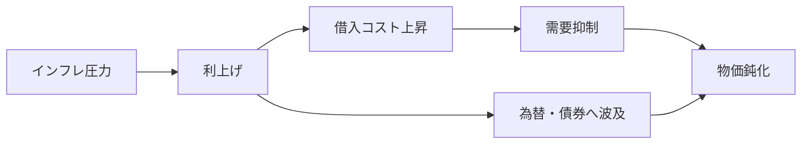
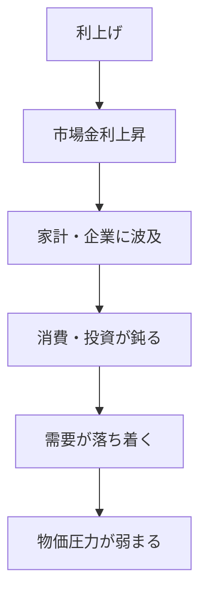
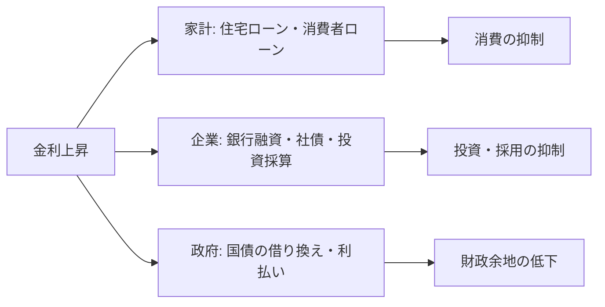
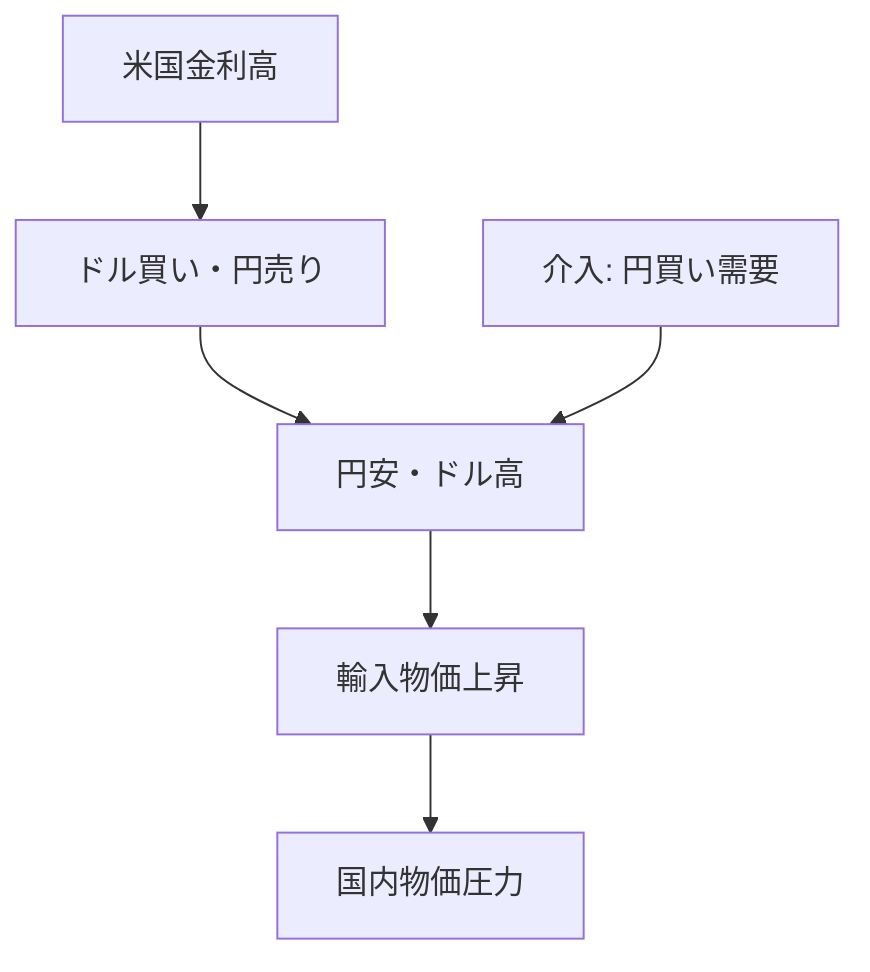
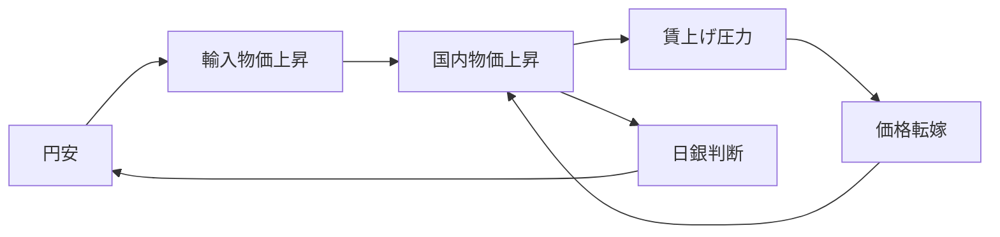

## 1. Executive Summary
Interest rate policy affects prices, wages, bond prices, debt burdens, and exchange rates through the ``cost of borrowing money.'' When the central bank raises interest rates, the burden of housing loans and corporate loans becomes heavier, which tends to curb consumption and investment. If demand subsides, price increases are likely to subside. On the other hand, the prices of bonds that have already been issued tend to fall, making the burden of interest payments heavier on households, businesses, and governments with large debts.
Source note: The Bank of Japan explains that monetary policy is conducted with the aim of "price stability" and that it influences interest rate formation. See [日本銀行, Monetary Policy](https://www.boj.or.jp/en/mopo/index.htm) and [Outline of Monetary Policy](https://www.boj.or.jp/en/mopo/outline/index.htm). The Federal Reserve says its policy rates have spillover effects on borrowing costs, employment and inflation. See [Federal Reserve, Monetary Policy: What Are Its Goals? How Does It Work?](https://www.federalreserve.gov/monetarypolicy/monetary-policy-what-are-its-goals-how-does-it-work.htm).
This mechanism is not a simple straight line. When wages rise, households' purchasing power increases, but companies' labor costs also rise. As the yen depreciates, import prices tend to rise, pushing up the cost of living. When governments and authorities intervene by selling dollars and buying yen, the aim is to suppress the yen's depreciation and cushion the rise in import prices. However, foreign exchange intervention alone cannot eliminate fundamental factors such as interest rate differentials and trade balances.


## 2. Terms to know first
| Terminology | In a nutshell | Relationship with interest rate policy |
| ---------- | ------------------------------ | ----------------------------------------------------------------- |
| Interest rates | Fees for borrowing money | The central bank influences short-term interest rates and market interest rates, and adjusts the economy and prices |
| Prices | Prices of all goods and services | If the price rises too much, interest rates will be raised; if it is too weak, interest rate cuts or monetary easing will be considered |
| Wages | Compensation for labor | Affects both household purchasing power and corporate costs, and interacts with prices |
| Bonds | Borrowing certificates issued by countries, companies, etc. | When interest rates rise, the prices of existing bonds tend to fall |
| Debt | Debt itself | Repayment and refinance burdens are likely to increase due to rising interest rates |
| Exchange rate | Exchange ratio of currencies such as the yen and the dollar | Fluctuations due to interest rate differences, trade, and movement of investment funds, affecting import prices |
| Dollar-selling intervention | Manipulation by the authorities to sell dollars and buy yen | Work to suppress the depreciation of the yen and try to moderate the rise in import prices |
The starting point for understanding interest rate policy is the perspective that ``one person's income is another person's expenditure.'' Wages are income for households, but costs for businesses. Loan interest is revenue for banks, but it is a burden for borrowers. Government bonds are a means of raising funds for governments, but for investors they are investment products. Interest rate policy moves this entire nexus of interests.
## 3. Basic operation of interest rate policy
The central bank adjusts the financial environment with a focus on short-term interest rates. Raising interest rates increases the cost of borrowing money. When mortgages, corporate loans, credit, and corporate bond issuance become more expensive, households and businesses become more cautious about spending. When demand weakens, companies find it difficult to raise prices, and the rate of inflation tends to fall.
Source note: The Fed explains that interest rates spill over into the cost of borrowing, such as mortgages, auto loans, and business investments, which in turn affects aggregate demand and inflation. See [Federal Reserve, Monetary Policy: What Are Its Goals? How Does It Work?](https://www.federalreserve.gov/monetarypolicy/monetary-policy-what-are-its-goals-how-does-it-work.htm).
On the other hand, lowering interest rates makes it easier to borrow money. It will be easier for households to buy housing and durable consumer goods, and it will be easier for companies to increase capital investment and hiring. This effect is useful when the economy is weak. However, if demand is too strong, it will cause inflation and asset prices to rise.


What is important is that there is a time lag in interest rate policy. Raising interest rates today does not mean that all prices will fall tomorrow. It works over months or years through variable rate loans, corporate refinancing, foreign exchange, wage negotiations, and corporate pricing changes.
## 4. Why do bonds move with interest rates?
Bonds are securities that allow countries and companies to borrow money for a certain period of time, pay interest, and return the principal at maturity. Bond prices and yields move in opposite directions. This is the most important point connecting interest rate policy and the bond market.
For example, there is an existing bond that pays 1% interest per year. After that, when new bonds that pay 3% a year become available on the market, bonds that pay 1% a year become relatively less attractive. To find a buyer, you need to lower the price. When the price falls, the yield seen by buyers rises.
```text
市場金利が上がる -> 新しい債券の利回りが上がる
                 -> 古い低利回り債券は売られやすい
                 -> 既存債券価格は下がる
```

Source note: The SEC's Investor.gov explains that when interest rates rise, the price of existing bonds typically falls, and when interest rates fall, the price of existing bonds typically rises. See [Investor.gov, Bonds](https://www.investor.gov/introduction-investing/investing-basics/investment-products/bonds-or-fixed-income-products/bonds). FINRA also explains that bond prices and interest rates move in opposite directions. See [FINRA, Bonds](https://www.finra.org/investors/investing/investment-products/bonds).
This relationship also applies to financial institutions and pension funds. When interest rates rise, long-term bonds already held are likely to suffer valuation losses. On the other hand, some bonds return their face value if they are held to maturity, so it is necessary to separate losses from price fluctuations and losses from credit risk.
## 5. On whom does debt weigh?
Debt is debt. When interest rates rise, the burden increases for new borrowers, those with variable interest rates, and those who are due to refinance.
In household finances, the burden of housing loans and credit card loans increases. For companies, it affects the profitability of bank loans, corporate bonds, and capital investment. For the government, interest payments on national bonds are likely to increase. However, not all debts will be affected at the same time. For long-term fixed-rate debt, the impact is delayed until maturity or refinancing.


What is easy to misunderstand here is that ``interest rate hikes are not just an issue for people who are in debt.'' If companies pass on increased borrowing costs to prices, it will affect consumers. If the government's interest payments increase, it will affect future tax and spending discussions. If banks' lending stance becomes stricter, it will also affect the employment of people who are not in debt.
## 6. How are wages and prices linked?
Wages are connected to prices in two ways. First, when wages rise, households' purchasing power increases, making consumption more likely to increase. If demand increases, it becomes easier for companies to raise prices. Second, wages are a company's labor cost, and if companies pass on increases in labor costs to the prices of goods and services, prices will rise.
Source note: The Bank of Japan explains that in order to achieve the 2% price stability target in a sustainable and stable manner, it is important that prices rise in the form of wage increases. See [日本銀行, 経済・物価情勢の展望](https://www.boj.or.jp/mopo/outlook/index.htm) and presentation material [Economic Activity, Prices, and Monetary Policy in Japan](https://www.boj.or.jp/en/about/press/koen_2024/ko240423a.htm).
However, rising wages do not always mean bad inflation. A virtuous cycle is a state in which companies' productivity and profits increase, wages rise, household consumption increases, and companies are able to invest further. In a vicious cycle, living costs go up first due to increases in import prices and energy prices, but wages cannot keep up and real purchasing power declines.
```text
名目賃金 = 給料の額面
実質賃金 = 名目賃金から物価上昇分を差し引いた購買力
```

Even if your salary goes up by 3%, if prices go up by 5%, your lifestyle will be difficult. What interest rate policy looks at is not simply whether wages have risen, but the combination of wages, prices, productivity, and corporate profits.
## 7. Foreign exchange and dollar selling/yen buying intervention
Exchange rates are influenced by interest rate differentials, trade balances, investment capital movements, risk aversion, policy expectations, and other factors. In the Japanese context, if the yen weakens and the dollar strengthens, the yen-denominated prices of imported goods, energy, food, and raw materials tend to rise. This puts upward pressure on domestic prices.
Dollar-selling/yen-buying intervention is an operation in which the government/authorities sell the dollars they hold and buy the yen. The number of orders to buy yen will increase in the market, which will help keep the yen from depreciating. In Japan, foreign exchange intervention is carried out under the authority of the Minister of Finance, with the Bank of Japan acting as the Minister's agent.
Source note: The Ministry of Finance publishes its track record of foreign exchange interventions. See [財務省, Foreign Exchange Intervention Operations](https://www.mof.go.jp/english/policy/international_policy/reference/feio/index.html). The Bank of Japan has explained that foreign exchange intervention is carried out under the authority of the Minister of Finance, with the Bank of Japan acting as its agent. See [日本銀行, Foreign Exchange Market Intervention](https://www.boj.or.jp/en/about/education/oshiete/intl/g18.htm).
Foreign exchange intervention is not price policy itself. The purpose is to suppress excessive fluctuations in the foreign exchange market. Although it affects prices through import prices, its role is different from that of the central bank's interest rate policy. In particular, when the difference in interest rates between Japan and the US is large, it becomes more attractive to invest in dollars, and pressure on the yen to depreciate remains. Although intervention can temporarily change the flow, it is not a means to completely eliminate interest rate differentials and market expectations.


## 8. Chains that are especially easy to see in Japan
In Japan, discussions on interest rate policy tend to become complicated due to the heavy use of imported energy and food, a long period of low interest rates, government debt, and a history of stagnant wages.
First, a weak yen tends to push up import prices. When energy and food prices rise, household living costs increase. Domestic prices will also rise as companies are also affected by increases in raw material and distribution costs, so if prices are passed on to higher prices, domestic prices will also rise.
Second, whether wages catch up with prices will determine how people feel about their lives. If prices rise and real wages fall, household finances will suffer. From the central bank's perspective, policy decisions will depend on whether both wages and prices rise sustainably or whether the rise in import prices ends up being temporary.
Third, the impact on the government bond market is significant. In an economy with long periods of low interest rates, interest rate hikes have a wide impact on financial institutions' bond valuations, government interest payments, and corporate borrowing costs. Raising interest rates may be necessary to keep prices in check, but the side effects of raising interest rates are also significant.


## 9. Common misconceptions
### Myth 1: If interest rates are raised, prices will immediately fall.
Raising interest rates will cool demand, but there is a time lag in prices. This is because energy prices, exchange rates, wage negotiations, corporate price revisions, and household spending behavior all move in sequence. Prices may continue to rise immediately after an interest rate hike.
### Myth 2: Bonds are safe assets, so their prices will not fall.
Even if government bonds have high creditworthiness, their market prices can fall if interest rates rise. The risk looks different if you hold the stock until maturity and if you sell it midway through.
### Myth 3: Higher wages are bad for inflation.
Wage increases themselves are not bad. The problem arises when cost increases that are not associated with productivity or corporate profits continue to be passed on to prices. If wages, prices, and productivity increase in a balanced manner, it will lead to an improvement in living standards.
### Myth 4: Foreign exchange intervention can solve the problem of yen depreciation
Intervention is a powerful tool for directly influencing markets, but it does not eliminate interest rate differentials, trade balances, and investment capital flows. The sustainable direction of exchange rates is determined by a combination of policy interest rates, inflation expectations, growth rates, balance of payments, and market sentiment.
## 10. Translation into practical and daily life
When individuals read the news, it is easier to understand if they are viewed in the following order.
1. Why are prices rising? Is it overheating demand, import prices, wages, tax/system factors?
2. Are wages keeping up with prices? Look at real wages rather than nominal wages.
3. Does the central bank view the rise in prices as temporary or persistent?
4. Who does rising interest rates affect? Where will the burden be placed on mortgages, corporate debt, government bonds, and financial institutions?
5. Are foreign exchange rates moving due to interest rate differences, or are they moving due to risk aversion and trade factors?
6. Is foreign exchange intervention a temporary stabilization measure, or is it being talked about as an alternative to interest rate policy?
If you read them in this order, you can break down arguments such as ``Should interest rates be raised?'', ``Is a weak yen bad?'' and ``Is a wage increase a cause of inflation?'' not just pros and cons, but also which route is being emphasized.
## 11. Limitations and precautions
This report is an introductory material that explains the basic transmission channels of interest rate policy, and is not intended to predict policy decisions or exchange rate levels at a specific point in time. In actual policy decisions, it is necessary to take a comprehensive look at factors such as the consumer price index, expected inflation, wage statistics, GDP, unemployment rate, corporate goods prices, government bond markets, bank lending, and the international financial environment.
Furthermore, even the same rate hike has different effects depending on the country and period. This is because the fixed interest rate ratio of housing loans, corporate borrowing structure, average maturity of government debt, import dependence, and strength of the labor market are different. Therefore, just because something works in the US doesn't necessarily mean it will work in Japan as well.
## Reference information
- [日本銀行, Monetary Policy](https://www.boj.or.jp/en/mopo/index.htm)
- [日本銀行, Outline of Monetary Policy](https://www.boj.or.jp/en/mopo/outline/index.htm)
- [日本銀行, Foreign Exchange Market Intervention](https://www.boj.or.jp/en/about/education/oshiete/intl/g18.htm)
- [財務省, Foreign Exchange Intervention Operations](https://www.mof.go.jp/english/policy/international_policy/reference/feio/index.html)
- [Federal Reserve, Monetary Policy: What Are Its Goals? How Does It Work?](https://www.federalreserve.gov/monetarypolicy/monetary-policy-what-are-its-goals-how-does-it-work.htm)
- [Investor.gov, Bonds](https://www.investor.gov/introduction-investing/investing-basics/investment-products/bonds-or-fixed-income-products/bonds)
- [FINRA, Bonds](https://www.finra.org/investors/investing/investment-products/bonds)
