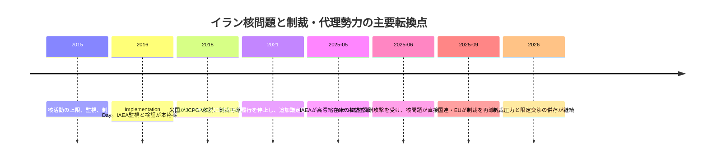
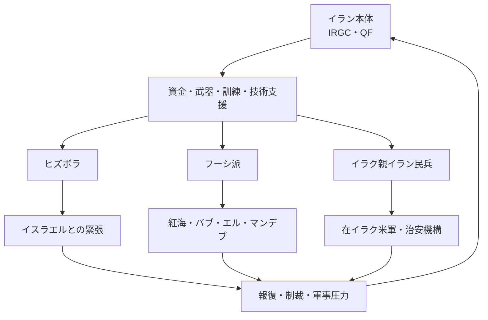

# Iran's nuclear development, sanctions, and regional proxy forces

## 1. Executive Summary

The Iranian issue needs to be viewed as an issue that integrates nuclear development, sanctions, regional proxy forces, and domestic governance. The 2015 JCPOA was a framework to curb nuclear development for a certain period of time, but it lost its effectiveness after the US withdrew from the agreement in 2018, and monitoring has weakened due to Iran's suspension of compliance from 2021 onwards. According to the IAEA report as of May 2025, the stock of enriched uranium was 9,247.6 kg, of which 408.6 kg was 60% enriched. In September 2025, a snapback of United Nations sanctions was implemented, and the EU also reintroduced sanctions, so the focus as of 2026 is on "pressure management and limited negotiations" rather than "restoring an agreement."
Source note: The establishment and reversal of the JCPOA were confirmed starting from [White House Archives, JCPOA adoption statement](https://obamawhitehouse.archives.gov/the-press-office/2015/07/14/statement-president-adoption-joint-comprehensive-plan-action) and [White House Archives, 2018 withdrawal statement](https://trumpwhitehouse.archives.gov/briefings-statements/statement-president-donald-j-trump-ending-united-states-participation-unacceptable-iran-deal/), and the suspension of implementation was confirmed at [IAEA GOV/2025/24](https://www.iaea.org/sites/default/files/25/06/gov2025-24.pdf) and [IAEA GOV/2025/25](https://www.iaea.org/sites/default/files/25/06/gov2025-25.pdf). The reintroduction of sanctions in September 2025 will be based on [UN Department of Political and Peacebuilding Affairs](https://dppa.dfs.un.org/en/mtg-sc-10079-usg-dicarlo-23-dec-2025) and [Council of the EU, Iran restrictive measures](https://www.consilium.europa.eu/en/press/press-releases/2025/09/29/iran-council-re-imposes-sanctions/).
Sanctions not only address the nuclear issue, but also target Iran's foreign currency acquisition, maritime transportation, insurance, payments, and support for proxy forces. In an April 2025 shipping advisory, the U.S. Treasury Department warned that Iran's crude oil and oil product exports depend on a maritime "shadow fleet," and in April 2026 added sanctions on related vessels and corporate networks.
Source note: The composition of maritime transport and sanctions evasion is based on [OFAC, Iran Shipping Advisory](https://ofac.treasury.gov/system/files/2025-04/Iran%20Shipping%20Advisory_4162025.pdf) and [U.S. Treasury, April 2026 sanctions action](https://home.treasury.gov/news/press-releases/sb0472). The latter indicates continued pressure on Iran's oil transportation network.
The damage to the domestic economy will also be significant. The World Bank predicts that Iran's economy will shrink by 2.7% in real GDP in 2025/26 as sanctions, conflict, social unrest, and water and energy shortages will weigh on activities. High inflation and falling real incomes will further weaken household purchasing power and import procurement.
Source note: Economic outlook was based on [World Bank, Iran overview](https://www.worldbank.org/ext/en/country/iran)'s 2025/26 estimates and commentary. It is appropriate to read the "blow" here as a composite effect of sanctions, transportation constraints, and domestic supply shortages, rather than a single factor.
Regional proxy forces are not simply "extensive influence." For Iran, it functions as a circuit for deterrence, retaliation, negotiation cards, information warfare, and financial circulation. Meanwhile, Hezbollah, the Houthis, and pro-Iranian militias in Iraq expand the regional theater of war and generate feedback that increases military pressure on mainland Iran.
Source Note: The functions of proxy forces are supported by US Treasury and State Department sanctions and designations for each organization. For example, [Treasury, Houthi sanctions action](https://home.treasury.gov/news/press-releases/sb0174) indicates the Houthis' maritime attack capabilities, [Treasury, Hizballah cash-economy networks](https://home.treasury.gov/news/press-releases/sb0420) indicates Hezbollah's funding circuit, and [Treasury, Iran-backed Iraqi militias](https://home.treasury.gov/news/press-releases/sb0277) indicates Iranian involvement in Iraqi militant groups.

## 2. Background and chronology

The JCPOA was a "trade-off" that granted sanctions relief in exchange for restricting Iran's enrichment, centrifuges, inventories, and verification for a period of time. In other words, it is not a treaty that will finally resolve nuclear weapons, but a political deal to buy time. The deal collapsed when the US withdrew in 2018, and Iran gradually removed the cap.
Source note: The basic structure of JCPOA can be seen in [White House Archives, 2015 adoption statement](https://obamawhitehouse.archives.gov/the-press-office/2015/07/14/statement-president-adoption-joint-comprehensive-plan-action) and [IAEA, Iran verification and monitoring reports](https://www.iaea.org/newscenter/focus/iran). The withdrawal in 2018 is due to [White House Archives, 2018 withdrawal statement](https://trumpwhitehouse.archives.gov/briefings-statements/statement-president-donald-j-trump-ending-united-states-participation-unacceptable-iran-deal/).
Since 2021, the IAEA has repeatedly indicated that Iran has ceased to comply with the JCPOA, resulting in the removal of surveillance equipment and the provisional suspension of the Additional Protocol. In a May 2025 board document, the IAEA stated that its nuclear material inventory as of the 17th was 9,247.6 kg, of which 408.6 kg was 60% enriched uranium, approximately 275 kg 20% ​​enriched, and approximately 5.5 t 5% enriched.
Source note: Inventory levels are based on [IAEA GOV/2025/24](https://www.iaea.org/sites/default/files/25/06/gov2025-24.pdf). In a separate document, the IAEA also explains that comprehensive monitoring and verification continuity has been lost since February 2021 [IAEA GOV/2025/25](https://www.iaea.org/sites/default/files/25/06/gov2025-25.pdf).
The September 2025 snapback meant "re-sanctions outside the deal" rather than a reconstruction of the deal. The United Nations acknowledges that political conflict continues over the reimposition of sanctions, but explains that the old sanctions were reinstated in response to the E3 notification. On the same day, the EU reintroduced nuclear, missile, and military-related sanctions.
Source note: See [UN DPPA brief](https://dppa.dfs.un.org/en/mtg-sc-10079-usg-dicarlo-23-dec-2025) and [Council of the EU press release](https://www.consilium.europa.eu/en/press/press-releases/2025/09/29/iran-council-re-imposes-sanctions/) for the history of snapback. In practice, "re-sanctions" here refers to tightening of finance, transportation, and trade.

## 3. Current status of nuclear development

In the IAEA's latest public assessment, the issue is less about Iran's enrichment capabilities than about its "reduced verifiability." Under the JCPOA, strict inventory control, caps on centrifuges, online monitoring, and surprise inspections were important, but after the suspension of implementation, these assumptions have collapsed. The 2025 report shows that while the amount of nuclear material in declared facilities has grown enormously, continuity of monitoring has been lost and the IAEA is unable to fully track past and present conditions.
Source note: Monitoring/verification disconnect relies on [IAEA GOV/2025/24](https://www.iaea.org/sites/default/files/25/06/gov2025-24.pdf) and [IAEA focus page](https://www.iaea.org/newscenter/focus/iran). What is important here is whether the IAEA is able to continuously track the amount, rather than simply "how many kilograms there are."
| Indicators | 2025 IAEA published values | Practical implications |
| --- | --- | --- |
| Total enriched uranium inventory | 9,247.6 kg | Significant deviation from the JCPOA upper limit |
| 60% concentrated | 408.6 kg | Stock near the high concentration area is quite large |
| 20% concentrated | Approximately 275 kg | Has technical "leap room" |
| 5% concentrated | Approx. 5.5 t | Large quantities in stock even at low concentrations |
| Monitoring and verification | Weak continuity | Lack of monitoring to connect past and present |
Source note: Table summarizes [IAEA GOV/2025/24](https://www.iaea.org/sites/default/files/25/06/gov2025-24.pdf). The numbers indicate the status of inventory management, but they do not alone determine the intention or degree of completion of weaponization.
The IAEA also stated in a separate safeguards document that Iran had not provided sufficient explanation regarding the traces originating from undeclared sites including Lavisan-Shian, Varamin, and Turquzabad near Tehran. This does not mean that Iran already possesses nuclear weapons, but it does indicate that undeclared past activities and current safeguards remain unresolved.
Source memo: The arrangement of undeclared sites is based on [IAEA GOV/2025/25](https://www.iaea.org/sites/default/files/25/06/gov2025-25.pdf). The IAEA has specified that explanations regarding undeclared nuclear material and activities are insufficient.
In June 2025, Iran's nuclear facilities came under military attack. Although the IAEA reported damage to facilities at Natanz, Esfahan, and Fordow, and no elevated radiation levels outside the facilities were reported at the time, the very fact that nuclear facilities were targeted for use of force significantly changed the landscape of deterrence and negotiations.
Source note: Initial assessment of the June 2025 attack is summarized in [IAEA Director General statements](https://www.iaea.org/newscenter/focus/iran). In the main text, it is safe to limit the scope to "no increase in radiation outside the facility was reported."

## 4. Sanction structure

Sanctions are easier to understand if they are understood in terms of three layers: the United Nations, the EU, and the United States. Although legally separate, they work in a mutually reinforcing manner for financial institutions, shipping companies, insurance companies, and business partners. Particularly in economies like Iran, which are highly dependent on dollar payments and maritime transport, sanctions manifest not only as an "embargo" but also as an "increase in the cost of credit."
Source note: The three-tier structure of sanctions can be easily understood by comparing [UN DPPA](https://dppa.dfs.un.org/en/mtg-sc-10079-usg-dicarlo-23-dec-2025), [Council of the EU](https://www.consilium.europa.eu/en/press/press-releases/2025/09/29/iran-council-re-imposes-sanctions/) and [U.S. Treasury](https://home.treasury.gov/news/press-releases/sb0472).
| Layers | Status as of 2026 | What to bind | Practical implications |
| --- | --- | --- | --- |
| United Nations | Snapback in September 2025 reinstates old sanctions | Nuclear and missile-related issues, arms transfers, and asset freezes | Re-increasing legal risks in transactions with Iran |
| EU | Nuclear-related sanctions to be reintroduced in September 2025 | Trade, finance, transport, individuals and organizations | Transit costs for European finance and shipping will rise |
| United States | Maximum pressure to continue in 2025-2026 | Energy, shipping, insurance, secondary sanctions | Recurring compliance burdens on trading partners and vessels |
Source note: UN and EU re-sanctions are based on the sources in the previous section. On the US side, by combining [OFAC Iran Shipping Advisory](https://ofac.treasury.gov/system/files/2025-04/Iran%20Shipping%20Advisory_4162025.pdf) and [Treasury April 2026 action](https://home.treasury.gov/news/press-releases/sb0472), pressure from shipping, insurance, delivery, and secondary sanctions can be seen.
An April 2025 OFAC advisory warned that Iran's exports of crude oil and refined products depend on shadow fleets that use AIS operations and ship-to-ship transfers. This shows that sanctions are working by increasing diversion costs and visibility, rather than achieving "zero exports."
Source note: [OFAC Iran Shipping Advisory](https://ofac.treasury.gov/system/files/2025-04/Iran%20Shipping%20Advisory_4162025.pdf) embodies the role of maritime transport networks, ship-to-ship transfers, insurance and intermediation. The text "Increasing detour costs" is a summary of this recommendation.

## 5. Impact on the domestic economy and citizens' lives

Sanctions have an impact on the domestic economy not only by reducing government revenue. Instability in obtaining foreign currency leads to currency depreciation, which increases import prices and the cost of food, medicine, parts, and energy equipment. When this is combined with domestic water shortages, electricity shortages, and logistics constraints, the supply shock directly impacts household finances.
Source note: The World Bank describes constraints on Iran's economy as a combination of sanctions, as well as conflict, water and energy shortages, and social unrest [World Bank, Iran overview](https://www.worldbank.org/ext/en/country/iran). "Direct spillover" here refers to price increases and supply disruptions of import-dependent goods.

In its 2026 briefing, the World Bank expects real GDP to contract by 2.7% in 2025/26, as sanctions, conflict, social unrest, and water and energy shortages weigh on activity. This shows that Iran's economy is not simply "sustainable because it has resources," but is constrained by vulnerabilities in export channels, payments, and domestic supplies.
Source note: Outlook for 2025/26 is based on [World Bank, Iran overview](https://www.worldbank.org/ext/en/country/iran). The World Bank also explains that high inflation and falling real incomes will put pressure on household budgets.
Iran's oil revenues have not completely stopped. In its April 2025 shipping advisory, the U.S. Treasury Department explained that Iran's seaborne crude oil exports remain at approximately 1.6 million barrels per day, or approximately 2 million barrels per day if petroleum products and condensate are included. In other words, sanctions do not result in an "export cutoff," but rather create "invisible selling methods and high transaction costs," which distort the flow of funds between states and subnational organizations.
Source note: Export scale is based on [OFAC Iran Shipping Advisory](https://ofac.treasury.gov/system/files/2025-04/Iran%20Shipping%20Advisory_4162025.pdf). The numbers here do not mean that sanctions are not effective, but rather that it is difficult to pass through normal financial, insurance, and port routes.

## 6. Functions of regional proxy forces

Iran's regional policy is close to a design that creates distributed pressure across multiple theaters through the IRGC and its outer networks. Hezbollah, the Houthis, and Iraq's pro-Iranian armed groups each have different local objectives, but for Iran they are connected as a layer of deterrence against Israel, Saudi Arabia, the UAE, and the United States.
Source note: The role of proxy forces can be gleaned from the US Treasury's targets of sanctions and the reasons for their designation. For example, [Treasury, Hizballah cash-economy networks](https://home.treasury.gov/news/press-releases/sb0420) indicates funding circuits, [Treasury, Houthi sanctions action](https://home.treasury.gov/news/press-releases/sb0174) indicates maritime attacks, and [Treasury, Iran-backed Iraqi militias](https://home.treasury.gov/news/press-releases/sb0277) indicates influence in Iraq.
| Actors | Roles | Latest Publications | Practical Implications |
| --- | --- | --- | --- |
| Hezbollah | Lebanon's armed and political organization, the core of deterrence against Israel | The US Treasury points out that in 2025, Iranian funds will flow to Hezbollah through money changers and cash channels | Lebanese finance and regional conflict are linked |
| Houthis | Yemen's rebel group threatens the Red Sea and Bab el-Mandeb shipping routes | Large-scale sanctions imposed by the US in 2025 due to maritime attack capabilities and external support | Shipping, insurance, and container logistics will be hit directly |
| Iraq's pro-Iranian militia | Pressure devices against the US and Israel are penetrating Iraq's domestic politics | In 2025, the US Treasury will impose sanctions on networks linked to Iran | Affecting Iraq's sovereignty, security, and investment environment |
| IRGC-QF | Core for funding, training, weapons and customer selection | Key target for sanctions and designations | Hub for the entire regional network |
Source Note: The table summarizes each sanctions announcement and does not indicate the exact chain of command between actors. In particular, Hezbollah's funding channels were referred to [Treasury, Hizballah cash-economy networks](https://home.treasury.gov/news/press-releases/sb0420), the Houthis to [Treasury, Houthi sanctions action](https://home.treasury.gov/news/press-releases/sb0174) and [State Department Yemen Travel Advisory](https://travel.state.gov/content/travel/en/traveladvisories/traveladvisories/yemen-travel-advisory.html?os=avefgi), and the Iraqi militia to [Treasury, Iran-backed Iraqi militias](https://home.treasury.gov/news/press-releases/sb0277).
Publicly available information suggests that proxy forces will be used for both "frontline expansion" and "defense of the homeland," but conversely, triggering an attack is likely to lead to retaliation or additional sanctions against the homeland. For the Iranian regime, proxies provide negotiating power, but they are also an escalation device that cannot be controlled.
Source Note: This paragraph is an estimate based on the sanctions announcement above. The reason for clearly stating that it is an estimate is because the full details of funding, command, and decision-making cannot be determined from public information alone.

## 7. Conflict between Israel and the Gulf States

Conflict with Israel is likely to be the most direct military risk, as nuclear development, missiles, proxy forces, and information warfare overlap. In the June 2025 attack, the IAEA confirmed damage to Natanz, Esfahan, and Fordow, once again demonstrating the reality that nuclear facilities can be targeted. What is important here is that the nuclear issue goes beyond diplomatic negotiations to a chain of events involving the use of force and retaliation.
Source note: Initial evaluations for June 2025 are summarized in [IAEA Director General Grossi’s Statement to UNSC](https://www.iaea.org/newscenter/statements/director-general-grossis-statement-to-unsc-on-situation-in-iran-13-june-2025) and [IAEA GOV/2025/50](https://www.iaea.org/sites/default/files/documents/gov2025-50.pdf). The latter reports attacks from June 13 to 24 and subsequent suspension of IAEA verification.
The conflict with the Gulf states is better understood as an "risk of entrapment" through the Strait of Hormuz, the Red Sea, aviation and shipping insurance, and remittance and re-export channels, rather than a direct targeting of Iran's capital. The Gulf's economies are highly dependent on oil exports, ports, finance, re-exports and international logistics, and tensions with Iran affect not only energy prices but also the risk tolerance of trading partners.
Source note: The practical entry points for the Strait of Hormuz and maritime logistics vulnerabilities are [World Bank, Iran overview](https://www.worldbank.org/ext/en/country/iran) and [OFAC Iran Shipping Advisory](https://ofac.treasury.gov/system/files/2025-04/Iran%20Shipping%20Advisory_4162025.pdf). The implications for the Gulf countries are best understood here as "increasing uncertainty in shipping routes, insurance, and re-exports."
Since the reintroduction of sanctions in September 2025, Iran has pursued a dual strategy of seeking to resume nuclear negotiations on the one hand, while maintaining deterrence through proxy forces on the other. For the Gulf states, attacks on shipping lanes, missiles and drones, port insurance, and spillovers to energy facilities are more of a practical threat than direct war with Iran.
Source note: This view is justified by reading the UN and EU re-sanctions alongside the US Treasury sanctions against the Houthis and shipping. [UN DPPA](https://dppa.dfs.un.org/en/mtg-sc-10079-usg-dicarlo-23-dec-2025) [Council of the EU](https://www.consilium.europa.eu/en/press/press-releases/2025/09/29/iran-council-re-imposes-sanctions/) [Treasury, Houthi sanctions action](https://home.treasury.gov/news/press-releases/sb0174).

## 8. Practical implications

For Japanese policymakers and businesses, Iran is not only a matter of "success or failure of the nuclear deal," but also a simultaneous management issue of energy, shipping, insurance, sanctions compliance, and regional conflicts. In particular, it is necessary to look at the following four points as a whole, rather than separately.

1. Do not design transactions based on the premise of sanctions relief.
2. Reflect shipping risks in the Strait of Hormuz, Red Sea, and Persian Gulf in insurance and contract terms.
3. Stricter secondary sanctions, re-exports, ship-to-ship transfers, and confirmation of actual control.
4. Treat both mainland Iran and its proxies as part of the same bundle of geopolitical risks.
   Source note: These are practical conclusions that can be drawn from [OFAC Iran Shipping Advisory](https://ofac.treasury.gov/system/files/2025-04/Iran%20Shipping%20Advisory_4162025.pdf), [Treasury April 2026 action](https://home.treasury.gov/news/press-releases/sb0472), and [World Bank, Iran overview](https://www.worldbank.org/ext/en/country/iran). Here, "viewing things as one" means not separating legal affairs, logistics, finance, and security too much.
   As estimated from publicly available information, the current base scenario is "Limited negotiations will continue, but it will be difficult to fully restore nuclear restrictions for the time being," "Pressure on proxy forces will continue, but it will be difficult to cut them off completely," and "Economic deterioration will create pressure to lift sanctions in the short term, but at the same time it will increase toughness overseas." Therefore, in practice, priority should be given to designs that withstand simultaneous deterioration of sanctions, routes, and retaliation over optimistic scenarios.
   Source note: This is an estimate based on [IAEA GOV/2025/24](https://www.iaea.org/sites/default/files/25/06/gov2025-24.pdf), [UN DPPA](https://dppa.dfs.un.org/en/mtg-sc-10079-usg-dicarlo-23-dec-2025), and [World Bank, Iran overview](https://www.worldbank.org/ext/en/country/iran). Since there is no official roadmap, it will be treated as `公表情報からの推定` here.

## 9. Risks/Limitations

There are three limitations to this paper. First, the IAEA can only grasp the scope of declarations and inspections, and cannot see the complete picture of undeclared activities. Second, the effectiveness of sanctions varies depending on each country's enforcement and evasion actions by the private sector, so even the same sanctions have varying effects on the economy. Third, the funding and chain of command of proxy forces can only be reconstructed piecemeal from public information alone.
Source note: IAEA constraints can be seen in [IAEA GOV/2025/25](https://www.iaea.org/sites/default/files/25/06/gov2025-25.pdf) and [IAEA GOV/2025/24](https://www.iaea.org/sites/default/files/25/06/gov2025-24.pdf), differences in sanctions enforcement can be seen in [OFAC Iran Shipping Advisory](https://ofac.treasury.gov/system/files/2025-04/Iran%20Shipping%20Advisory_4162025.pdf), and fragmentation of proxy forces can be seen in each Treasury announcement.
Therefore, while numbers are important, it is best not to jump to conclusions based on numbers alone. In practice, it would be more accurate to monitor "increases and decreases in nuclear stockpiles," "new designations of sanctions," "attacks on maritime routes," "inflows of funds to proxy forces," and "domestic inflation" on the same dashboard.
Source note: This paragraph is a practical proposal that integrates the published materials listed up to the previous section. This means that multiple signals should be bundled together, rather than a single statistical indicator.

## 10. Reference information

- [IAEA GOV/2025/24](https://www.iaea.org/sites/default/files/25/06/gov2025-24.pdf)
- [IAEA GOV/2025/25](https://www.iaea.org/sites/default/files/25/06/gov2025-25.pdf)
- [IAEA GOV/2025/50](https://www.iaea.org/sites/default/files/documents/gov2025-50.pdf)
- [IAEA Iran focus page](https://www.iaea.org/newscenter/focus/iran)
- [UN DPPA on the 2025 snapback process](https://dppa.dfs.un.org/en/mtg-sc-10079-usg-dicarlo-23-dec-2025)
- [Council of the EU, Iran: Council re-imposes sanctions](https://www.consilium.europa.eu/en/press/press-releases/2025/09/29/iran-council-re-imposes-sanctions/)
- [World Bank, Iran overview](https://www.worldbank.org/ext/en/country/iran)
- [OFAC, Iran Shipping Advisory](https://ofac.treasury.gov/system/files/2025-04/Iran%20Shipping%20Advisory_4162025.pdf)
- [U.S. Treasury, April 2026 sanctions action](https://home.treasury.gov/news/press-releases/sb0472)
- [U.S. Treasury, Houthi sanctions action](https://home.treasury.gov/news/press-releases/sb0174)
- [U.S. Treasury, Hizballah cash-economy networks](https://home.treasury.gov/news/press-releases/sb0420)
- [U.S. Treasury, Iran-backed Iraqi militias](https://home.treasury.gov/news/press-releases/sb0277)
