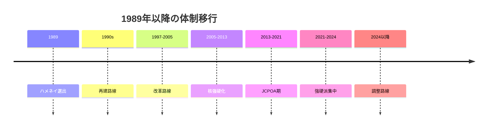
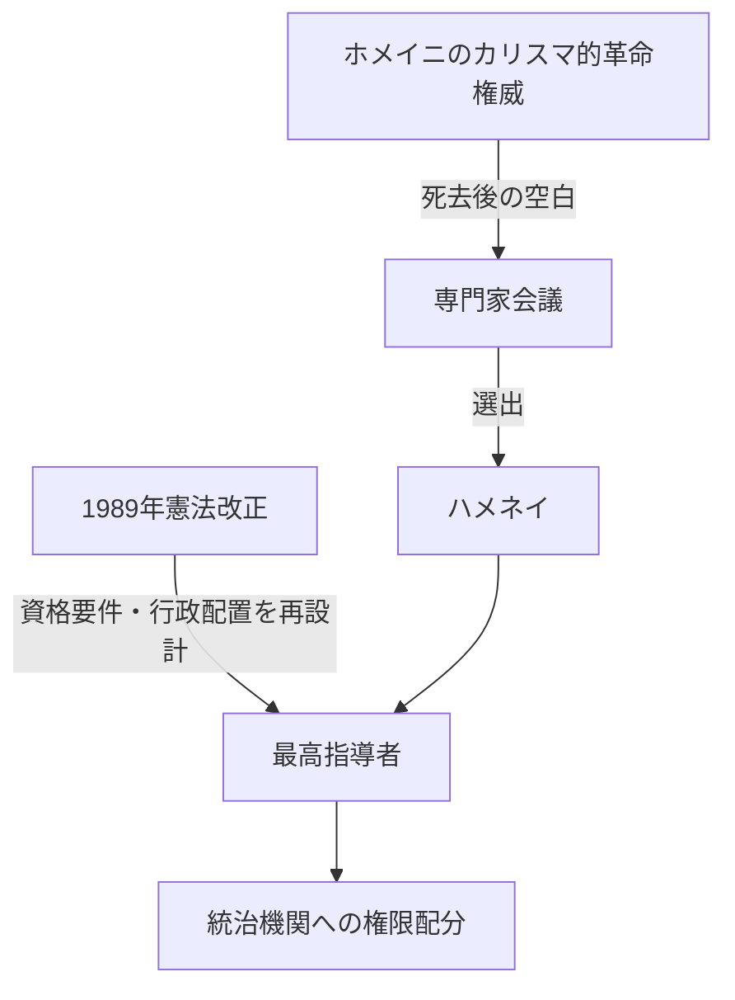
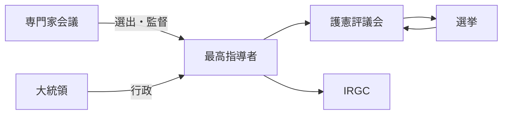

# Regime transition from Khomeini to Khamenei and reorganization of Iranian power structure
## 1. Executive Summary
The Iranian regime after Khomeini's death was not simply ``naturally inherited by the next religious leader.'' In reality, a combination of constitutional amendments in 1989, selection by the Assembly of Experts, a political coalition centered on Rafsanjani, a security apparatus including the Revolutionary Guards Corps (IRGC), and control by the Guardian Council created a new center of gravity for governance centered on Khamenei. What is important here is that religious orthodoxy was not determined solely by pure theological authority, but was reconstituted through institutional reforms and political coalitions. Source note: For details on the 1989 constitutional amendment and leadership selection, see [Encyclopaedia Iranica, Constitution of the Islamic Republic](https://www.iranicaonline.org/articles/constitution-of-the-islamic-republic/) and [USIP Iran Primer, The Assembly of Experts](https://iranprimer.usip.org/resource/assembly-experts).
The essence of this transition is threefold. First, Khamenei's authority was supported not only by his symbolism as the ``successor of the founder of the revolution,'' but also by the system that unified the military, judiciary, and supervisory institutions through the constitutional authority of the supreme leader. Second, the 1989 reform adjusted the qualification requirements for the supreme leader and the layout of state institutions, redesigning the system in a way that prioritized institutional continuity over individual charisma. Third, each subsequent administration has merely made fluctuations in economic, foreign, and nuclear policy to the extent permitted by the supreme leader, rather than changing policies freely. Source note: The constitutional power of the supreme leader is based on [Constitute Project, Constitution of the Islamic Republic of Iran](https://www.constituteproject.org/constitution/Iran_1989.pdf) and [USIP Iran Primer, The Supreme Leader](https://iranprimer.usip.org/resource/supreme-leader).
In foreign policy, the regime moved toward a combination of deterrence and negotiation through nuclear development, sanctions resistance, and the use of regional proxy forces, while suppressing the direct language of ``exporting revolution.'' The final strategic decision remains in the hands of the supreme leader and his surrounding organizations, including reconstruction during the Rafsanjani period, limited opening during the Khatami period, confrontation with the United States and nuclear acceleration during the Ahmadinejad period, JCPOA during the Rouhani period, hardening during the Raisi period, and the Pezeshkian administration in 2024. Source note: Relationship with each government is according to [USIP Iran Primer, Seven Presidents](https://iranprimer.usip.org/resource/seven-presidents) and [Reuters, July 2024 Iran election coverage](https://www.investing.com/news/world-news/iranians-vote-in-runoff-presidential-election-amid-widespread-apathy-3508560). The assumption that strategic authority will remain with the supreme leader even after 2024, even if a reformist president is elected, is an estimate based on publicly available information.

## 2. How was the succession established in 1989?
After Khomeini's death on June 3, 1989, the regime needed to avoid a succession vacuum. The Assembly of Experts selected Khamenei as its leader, and subsequent constitutional amendments created a system to support the supreme leader. What is important here is that the election was not an ``automatic succession of already established religious authority,'' but was a political decision to maintain the legitimacy of the revolution. Source note: Regarding the succession after Khomeini's death and the role of the Council of Experts, refer to [USIP Iran Primer, The Assembly of Experts](https://iranprimer.usip.org/resource/assembly-experts) and [Britannica, Ruhollah Khomeini](https://www.britannica.com/biography/Ruhollah-Khomeini).
The 1989 revision has great institutional significance. IRANICA shows that shortly before his death, Khomeini called for a constitutional amendment that adjusted the Supreme Leader qualification requirements, removed the `marja` requirement, and redesigned the constitution to assume a single Supreme Leader. Furthermore, the position of prime minister was abolished and executive power was reorganized to center on the president. As a result, the center of authority shifted from the ``council of multiple religious authorities'' to the ``constitutional apex concentrated in one leader.'' Source note: For the position of the 1989 revision, refer to [Encyclopaedia Iranica, Constitution of the Islamic Republic](https://www.iranicaonline.org/articles/constitution-of-the-islamic-republic/) and [USIP Iran Primer, Seven Presidents](https://iranprimer.usip.org/resource/seven-presidents).
The text of the Constitution also supports this relocation. Article 5 provides for the governance of jurists, Article 107 provides for the selection of leaders by the Assembly of Experts, and Article 110 provides for the supreme command of the military, the appointment of the chief justice, and the authority to appoint jurists to the Guardian Council. Articles 91, 94, and 99 provide for bill review and election supervision by the Guardian Council, while Articles 143 and 150 provide for the division of roles between the conventional military and the Revolutionary Guards. In other words, the succession in 1989 was not just a personnel matter, but a rewiring of the system. Source note: Refer to [Constitute Project, Constitution of the Islamic Republic of Iran](https://www.constituteproject.org/constitution/Iran_1989.pdf) for article confirmation.

## 3. What supported Khamenei's authority base?
Khamenei's authority base cannot be explained solely by his theological qualifications. According to publicly available documents, there were at least five pillars. First, the selection of leaders by a meeting of experts. Second, a transitional political coalition centered on Rafsanjani. Third, the entrance control of candidates and bills by the Guardian Council. Fourth, the power of appointment to the judiciary and security apparatus. Fifth is the security infrastructure for revolutionary defense centered on the IRGC. Source note: The institutional positions of the Assembly of Experts, the Guardian Council, the Judiciary, and the IRGC are organized into [USIP Iran Primer, The Assembly of Experts](https://iranprimer.usip.org/resource/assembly-experts), [The Guardian Council](https://iranprimer.usip.org/resource/guardian-council), [The Judiciary](https://iranprimer.usip.org/resource/judiciary), and [The Islamic Revolutionary Guard Corps](https://iranprimer.usip.org/resource/islamic-revolutionary-guard-corps).
Rafsanjani was a key figure in this transition. USIP describes the period from 1989 to 1997 as the era of "Rafsanjani as the most powerful public official," and explains that he was responsible for restructuring the system and post-war reconstruction. It is reasonable to read that Khamenei constructed both religious authority and political practice on a coalition of institutions that included Rafsanjani. ``Support'' here was not simple loyalty, but interdependence for the maintenance of the system. Source note: Referenced [USIP Iran Primer, Seven Presidents](https://iranprimer.usip.org/resource/seven-presidents).
Under the constitution, the supreme leader is placed above elected bodies through the supreme command of the military, the appointment of the head of the national broadcaster, the appointment of the head of the judiciary, and the appointment of the jurist of the Guardian Council. Therefore, Khamenei's authority operates not because he is ``religiously great,'' but as a bundle of authority that is institutionally wired to other institutions. This is a transformation of the revolutionary leadership of the Khomeini era into a more long-lasting system of governance. Source Note: Supreme Leader Authority referenced [Constitute Project, Constitution of the Islamic Republic of Iran](https://www.constituteproject.org/constitution/Iran_1989.pdf) and [USIP Iran Primer, The Supreme Leader](https://iranprimer.usip.org/resource/supreme-leader).
However, this foundation is not fixed. The Council of Experts is said to be responsible for selecting and supervising the supreme leader, but since candidates are examined by the Guardian Council, those who supervise are also subject to supervision. There is a tension here in which institutions tend to reproduce themselves, but cannot be completely closed off. Calling the Khamenei regime a ``gate-controlled quasi-oligarchy'' is closer to reality than a ``personal dictatorship.'' This is an estimate based on publicly available information. Source note: Referenced [USIP Iran Primer, The Assembly of Experts](https://iranprimer.usip.org/resource/assembly-experts) and [The Guardian Council](https://iranprimer.usip.org/resource/guardian-council).
## 4. How to organize the relationship with each government over time
### 4.1 Rafsanjani Period: Reconstruction and Practical Nationalization
The Rafsanjani period from 1989 to 1997 was a period in which the wartime regime of the revolutionary period focused on reconstruction and institutional stability. Externally, hard-line talk of exporting the revolution was suppressed, while internally, priority was given to economic recovery, administrative reorganization, and normalization of the system. At this stage, Khamenei strengthened his role as the final umpire for maintaining the regime, rather than advocating the purification of the revolution. Source note: Referenced [USIP Iran Primer, Seven Presidents](https://iranprimer.usip.org/resource/seven-presidents).
### 4.2 Khatami Period: Reforms expanded, but the ceiling remained
The Khatami period from 1997 to 2005 attracted attention for its reform policy that advocated freedom of speech, the rule of law, and civil society. However, due to the Guardian Council's review, the judiciary, and the institutional veto power of conservatives, the reform could not go beyond the institutional ceiling. What we saw here was a structure in which even if electoral politics expanded, the final decision-making power remained with the supreme leader. Source note: For the relationship between the Khatami period and the system upper limit, refer to [USIP Iran Primer, Seven Presidents](https://iranprimer.usip.org/resource/seven-presidents) and [USIP Iran Primer, The Guardian Council](https://iranprimer.usip.org/resource/guardian-council).
### 4.3 Ahmadinejad period: Confrontational stance and strengthening of the security state
The Ahmadinejad period from 2005 to 2013 brought anti-Western sentiments, revolutionary rhetoric, and nuclear hardening to the fore. This is not simply "the president's personality." This is because sanctions, domestic control, and the IRGC's economic and political influence have increased, and external confrontation has become a tool for domestic governance. The Khamenei regime further connected religious authority to the language of the security state during this period. Source note: Referenced [USIP Iran Primer, Seven Presidents](https://iranprimer.usip.org/resource/seven-presidents) and [USIP Iran Primer, The Islamic Revolutionary Guard Corps](https://iranprimer.usip.org/resource/islamic-revolutionary-guard-corps).
### 4.4 Rouhani period: nuclear negotiations and attempts at sanctions relief
The Rouhani period from 2013 to 2021 aimed at managing the nuclear issue and reducing external tensions, and reached the JCPOA in 2015. However, in 2018, when the United States withdrew from the JCPOA and re-strengthened economic sanctions, the diplomatic gains made by reformers and moderates were significantly diminished. Rouhani's policy was a tactical easing within the limits of the Supreme Leader's tolerance, and was not a fundamental shift in strategy. Source note: JCPOA and US withdrawal referenced [White House, Statement by the President on the JCPOA](https://trumpwhitehouse.archives.gov/briefings-statements/statement-president-jcpoa/) and [USIP Iran Primer, Seven Presidents](https://iranprimer.usip.org/resource/seven-presidents).
### 4.5 Raishi period: Refocusing the hardliners
When Raisi became president in 2021, the regime shifted back towards hardliners. He was originally known for his closeness to the Supreme Leader, and a 2021 article also emphasized his loyalty to Khamenei and his upholding of revolutionary values. This further aligned the executive branch with the supreme leader's political line. Source note: Referenced [USIP Iran Primer, Raisi's Ties to the Supreme Leader](https://iranprimer.usip.org/blog/2021/jul/21/raisi-ties-supreme-leader).
### 4.6 After Raisi's death and the Pezeshkian period: Tone adjustment, strategy unchanged
After Raisi's death in 2024, Pezeshkian was elected after an interim system. Although this indicated the possibility of softening the tone of foreign relations somewhat, it did not change the strategic authority of the supreme leader. Reuters reported that Pezeshkian won the July 2024 elections, while also suggesting that the president's powers will remain constrained in Iran's power structure. The conclusion here is that changes in election results and changes at the core of the system are two different things. Source note: Referenced [Reuters, Moderate Pezeshkian wins Iran's presidential runoff](https://www.investing.com/news/world-news/iranians-vote-in-runoff-presidential-election-amid-widespread-apathy-3508560) and [USIP Iran Primer, The Supreme Leader](https://iranprimer.usip.org/resource/supreme-leader). The assumption that strategic authority will remain with the supreme leader even if there is a presidential change is an estimate based on publicly available information.

## 5. How does it lead to nuclear development, sanctions, and regional proxy forces?
The foreign policy of the Khamenei regime can be easily understood by reading it in terms of three layers. First, nuclear development is both a security bargaining card and a survival strategy for the regime. Second, while sanctions are painful, they also provide an excuse to tighten domestic control. Third, regional proxy forces are a device for expanding influence while suppressing the costs of direct war. Source note: Nuclear, sanctions, and regional intervention framework referred to [Congressional Research Service, Iran: Background and U.S. Policy](https://crsreports.congress.gov/product/pdf/RL/RL32048) and [CFR, Iran's Regional Armed Network](https://www.cfr.org/article/irans-regional-armed-network/).
In terms of nuclear policy, while the Rouhani-era JCPOA showed a temporary success in ``containment through negotiations,'' with the US withdrawal in 2018, the Khamenei regime lost its domestic narrative that ``negotiate and get rewarded.'' Since then, nuclear issues have become not just a technical issue, but also an issue that simultaneously deals with the reliability of sanctions relief, deterrence, and domestic political legitimacy. In recent years, the IAEA has continued to report concerns regarding Iranian enrichment, inspections, and surveillance. Source note: Referenced [IAEA, Iran-related verification and monitoring reports](https://www.iaea.org/topics/iran) and [White House, JCPOA withdrawal statement](https://trumpwhitehouse.archives.gov/briefings-statements/statement-president-jcpoa/).
Sanctions act as economic pressure and at the same time change the distribution of power within the system. Under sanctions, it becomes difficult for ordinary private companies and reformist governments to produce results, and IRGC-affiliated networks and semi-governmental and private economic entities that have access to funds, logistics, and security become relatively stronger. As a result, sanctions not only weaken regimes but also often fatten the most hardline institutions. This is an estimate based on publicly available materials, but it is consistent with the long-term trend. Source note: Referenced [Congressional Research Service, Iran: Background and U.S. Policy](https://crsreports.congress.gov/product/pdf/RL/RL32048) and [USIP Iran Primer, The Islamic Revolutionary Guard Corps](https://iranprimer.usip.org/resource/islamic-revolutionary-guard-corps).
Regional proxy forces such as Hezbollah, Syrian regime forces, Iraqi pro-Iranian militias, and the Houthis have become targets for Iran's influence projection. Here again, the focus is not on the ``revolutionary idea'' itself, but on the national strategy that brings together deterrence, retaliation, negotiation, sanctions avoidance, and domestic legitimacy. Rather than emphasizing revolutionary universalism, it is reasonable to view the Khamenei regime as moving toward creating security depth through regional networks. Source note: Referenced [CFR, Iran's Regional Armed Network](https://www.cfr.org/article/irans-regional-armed-network/) and [USIP Iran Primer, The Islamic Revolutionary Guard Corps](https://iranprimer.usip.org/resource/islamic-revolutionary-guard-corps).
## 6. How should it be read in practice?
When reading this system in practice, it is more effective to look at ``which system controls candidates, legislation, the military, the judiciary, broadcasting, public security, and funding,'' rather than ``who is the president.'' The center of power in Iran is divided into the part visible through elections and the part surrounding elections. If we overlook the latter, we will make mistakes in our diplomacy toward Iran, in the design of sanctions, in our nuclear negotiations, and in our predictions of regional conflicts. Source note: Referenced [USIP Iran Primer, The Supreme Leader](https://iranprimer.usip.org/resource/supreme-leader), [The Guardian Council](https://iranprimer.usip.org/resource/guardian-council), [The Assembly of Experts](https://iranprimer.usip.org/resource/assembly-experts).
What is important is that Khamenei's regime is not a "fixed dictatorship." Although the system is stable, actual operation changes due to factional balance, sanctions, war, generational change, and attrition of regional proxy forces. Therefore, in order to predict the future, it is necessary to look not only at religious qualifications, but also at the IRGC's personnel affairs, the review trends of the Guardian Council, the composition of the Council of Experts, whether nuclear negotiations are possible, and the prospects for sanctions relief. This is an estimate based on publicly available information.
## 7. Limitations and remaining issues
Because this article focuses on the institutional design and political coalitions that can be seen from publicly available materials, it does not fully address the private factional negotiations, budget allocation, division of labor within the Revolutionary Guards, the state of religious property, or the personal relationships surrounding the supreme leader. Furthermore, it has not yet been determined how far the Pezeshkian administration will expand its policy space in the medium to long term after 2024. All that can be said at this point is that even if the tone of the administration changes, the ultimate institutional authority will remain with the supreme leader. Source note: Final institutional authority is based on [USIP Iran Primer, The Supreme Leader](https://iranprimer.usip.org/resource/supreme-leader) and [Constitute Project, Constitution of the Islamic Republic of Iran](https://www.constituteproject.org/constitution/Iran_1989.pdf).
## 8. Reference information
- [Encyclopaedia Iranica, Constitution of the Islamic Republic](https://www.iranicaonline.org/articles/constitution-of-the-islamic-republic/)
- [Britannica, Ruhollah Khomeini](https://www.britannica.com/biography/Ruhollah-Khomeini)
- [USIP Iran Primer, The Assembly of Experts](https://iranprimer.usip.org/resource/assembly-experts)
- [USIP Iran Primer, The Supreme Leader](https://iranprimer.usip.org/resource/supreme-leader)
- [USIP Iran Primer, The Guardian Council](https://iranprimer.usip.org/resource/guardian-council)
- [USIP Iran Primer, The Judiciary](https://iranprimer.usip.org/resource/judiciary)
- [USIP Iran Primer, The Islamic Revolutionary Guard Corps](https://iranprimer.usip.org/resource/islamic-revolutionary-guard-corps)
- [USIP Iran Primer, Seven Presidents](https://iranprimer.usip.org/resource/seven-presidents)
- [USIP Iran Primer, Raisi's Ties to the Supreme Leader](https://iranprimer.usip.org/blog/2021/jul/21/raisi-ties-supreme-leader)
- [Constitute Project, Constitution of the Islamic Republic of Iran](https://www.constituteproject.org/constitution/Iran_1989.pdf)
- [White House, Statement by the President on the JCPOA](https://trumpwhitehouse.archives.gov/briefings-statements/statement-president-jcpoa/)
- [IAEA, Iran-related verification and monitoring reports](https://www.iaea.org/topics/iran)
- [Congressional Research Service, Iran: Background and U.S. Policy](https://crsreports.congress.gov/product/pdf/RL/RL32048)
- [CFR, Iran's Regional Armed Network](https://www.cfr.org/article/irans-regional-armed-network/)
