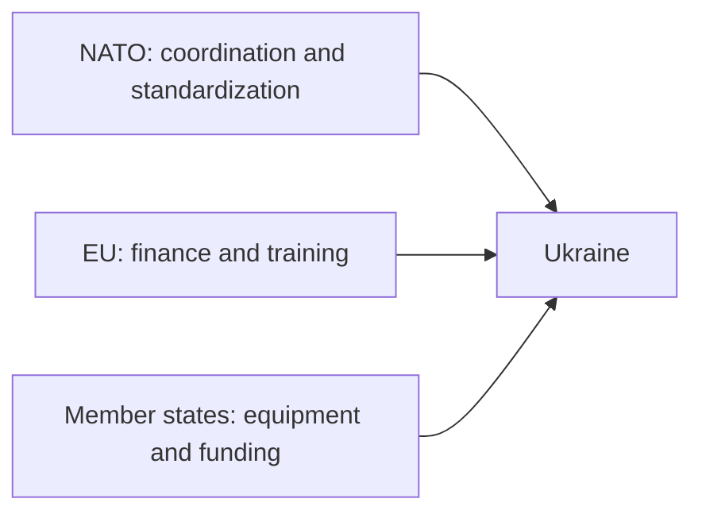

# Latest status of support for Ukraine by NATO and Western countries

## 1. Executive Summary

As of May 2026, assistance to Ukraine is not supported by NATO alone; NATO provides a "vessel for coordination, standardization, and training," while actual funding and equipment is shared by the EU, the United States, Britain, Germany, France, Northern Europe, and Eastern Europe. Even in NATO official documents, the majority of support comes from allies and partner countries, and NATO's own role is more of a facilitator through frameworks such as NSATU, CAP, JATEC, and PURL. Source note: [NATO, Ukraine support and NATO's role](https://www.nato.int/cps/en/natohq/topics_192648.htm), [NATO Summit, NATO's support for Ukraine](https://www.nato.int/cps/en/natohq/official_texts_236621.htm).
The EU is the center of gravity for financial support and training. In April 2026, the EU Council finalized the design for a total of EUR 90 billion in support loans to Ukraine, and the European Commission is providing medium-term liquidity through the Ukraine Facility. Furthermore, EUMAM Ukraine will carry out training for 90,000 personnel, and rather than directly intervene on the battlefield, its role will be to improve the endurance of the rear. Source notes: [Council, 90 billion support loan to Ukraine](https://www.consilium.europa.eu/en/press/press-releases/2026/04/23/council-finalises-90-billion-support-loan-to-ukraine/), [European Commission, Ukraine Facility](https://commission.europa.eu/strategy-and-policy/eu-budget/eu-borrowings/ukraine-facility_en), [NATO on EUMAM training numbers](https://www.nato.int/cps/en/natohq/topics_192648.htm).
The United States remains one of the largest single donors, but the nature of its assistance is leaning more toward a combination of existing military support quotas, contributions from allies, arms sales, and strengthening the industrial base, rather than an "additional large-scale supplementary budget." The latest announcement from the U.S. Department of Defense shows that by March 31, 2026, direct U.S. assistance to Ukraine will be worth $67.8 billion, and security assistance, including NATO allies and partner countries, will be worth about $130 billion. Additionally, the White House's Arms Transfer Strategy specifies a design that emphasizes military production capacity, supply chains, and the self-help efforts of allies. Source note: [DoD / OAR report, Ukraine assistance through 2026-03-31](https://media.defense.gov/2026/Apr/01/2003695701/-1/-1/0/US-DIRECT-ASSISTANCE-TO-UKRAINE-THROUGH-MARCH-31-2026.PDF), [The White House, America First Arms Transfer Strategy](https://www.whitehouse.gov/fact-sheets/2026/04/fact-sheet-president-donald-j-trump-unveils-the-america-first-arms-transfer-strategy/).
Britain, Germany, Scandinavia, the Baltics, and Poland stand out not only in terms of total size, but also in terms of training, artillery, air defense, drones, forward logistics, and joint production. In particular, the UK has training and continuous annual support, Germany has scale and air defense, Scandinavia has quick decision-making and a large ratio to GDP, and Baltic Poland has strong readiness due to its geographical proximity. France, on the other hand, has a strong presence in terms of security guarantees, coalition formation, and industrial cooperation, although the total amount disclosed is relatively thin. Source note: [UK government support for Ukraine](https://www.gov.uk/government/publications/uk-support-for-ukraine-factsheet/uk-support-for-ukraine-factsheet), [Germany support for Ukraine](https://www.bundesregierung.de/breg-en/news/support-to-ukraine-2328576), [France diplomatic support / coalition statements](https://www.elysee.fr/en/emmanuel-macron/2026/01/24/ukraine-european-leaders-summit), [Norway support for Ukraine](https://www.regjeringen.no/en/topics/foreign-affairs/peace-and-conflict/support-to-ukraine/id2958149/), [Denmark support for Ukraine](https://um.dk/en/foreign-policy/danish-support-for-ukraine), [Sweden support for Ukraine](https://www.government.se/government-policy/sweden-and-ukraine/), [Lithuania support for Ukraine](https://urm.lt/default/en/ukraine), [Estonia support for Ukraine](https://www.kaitseministeerium.ee/en/ukraine), [Poland support for Ukraine](https://www.gov.pl/web/diplomacy/poland-supports-ukraine).

In practical terms, the central issue regarding aid to Ukraine has shifted from "how much to spend?" to "which channels should we use for air defense, ammunition, drones, maintenance, training, and joint production." The key uncertainties going forward are the priorities of the US Congress and the executive branch, fiscal and political agreements within the EU, and production capacity for artillery shells and air defense missiles. Source notes: [NATO role page](https://www.nato.int/cps/en/natohq/topics_192648.htm), [EU Ukraine Facility](https://commission.europa.eu/strategy-and-policy/eu-budget/eu-borrowings/ukraine-facility_en), [White House arms transfer strategy](https://www.whitehouse.gov/fact-sheets/2026/04/fact-sheet-president-donald-j-trump-unveils-the-america-first-arms-transfer-strategy/).

## 2. First conclusion: NATO and support for each country are viewed as different things.

NATO is not a "fund wallet," but a place to design a system that bundles support from allied countries. According to official NATO documents, NATO itself is responsible for coordinating support, training, and standardizing equipment through NSATU, CAP, JATEC, PURL, etc., with most of the actual supply being borne by member and partner countries. Therefore, if readers only look at "how much NATO has contributed," they will only see half the truth. Source note: [NATO, Ukraine support and NATO's role](https://www.nato.int/cps/en/natohq/topics_192648.htm), [NATO Summit declaration](https://www.nato.int/cps/en/natohq/official_texts_236621.htm).
The EU is important in another way. The EU is stronger in budget, financing, training, and institutional maintenance than in providing equipment. As of spring 2026, the Ukraine Facility, EUMAM, and new support loan designs are supporting the wartime nation's liquidity. Source note: [Council, 90 billion support loan to Ukraine](https://www.consilium.europa.eu/en/press/press-releases/2026/04/23/council-finalises-90-billion-support-loan-to-ukraine/), [European Commission, Ukraine Facility](https://commission.europa.eu/strategy-and-policy/eu-budget/eu-borrowings/ukraine-facility_en).

## 3. Comparison table: Who is in charge of what now?

| Role                               | Main players                                            | Contents as of spring 2026                                                                                                 | Constraints                                                                          |
| ---------------------------------- | ------------------------------------------------------- | -------------------------------------------------------------------------------------------------------------------------- | ------------------------------------------------------------------------------------ | --- | ------------- | ------------------------------------------------- | ------------------------------------------------------------------------------------------------- | --------------------------------------------------------------------------------------- |
| NATO                               | NATO Main Body + Allies                                 | NSATU, CAP, JATEC, PURL, NATO-Ukraine Council. Coordinating, standardizing, training, and jointly procuring U.S. equipment | NATO itself does not have significant financial resources                            |
| EU                                 | European Commission, Council, Member States             | Ukraine Facility, EUMAM, support loans, macro-financial support                                                            | Fiscal agreement, alignment among Member States, transport and production capacity   |     | United States | Executive Branch, Congress, Department of Defense | Direct military support, arms sales, allied procurement support, information and training support | Domestic production priority, Congressional politics, inventory and production capacity |
| United Kingdom                     | British Government                                      | Annual military support, Interflex training, air defense and drone support                                                 | Stock replenishment and fiscal discipline                                            |
| Germany                            | German Government                                       | Major military and air defense support, training, and intra-European coordination                                          | Political agreements, manufacturing lead times                                       |
| France                             | French government                                       | Security guarantees, coalition formation, industrial cooperation, training and equipment support                           | Difficult to see total amount disclosed, speed of joint production ramp-up           |
| Northern Europe and Eastern Europe | Norway, Sweden, Denmark, Finland, Baltic States, Poland | High contribution relative to GDP, artillery shells, air defense, drones, frontline logistics, training                    | Smaller countries have stronger inventory constraints, but decision-making is faster |

Source note: NATO is based on [NATO role page](https://www.nato.int/cps/en/natohq/topics_192648.htm), EU is on [Council support loan](https://www.consilium.europa.eu/en/press/press-releases/2026/04/23/council-finalises-90-billion-support-loan-to-ukraine/) and [Ukraine Facility](https://commission.europa.eu/strategy-and-policy/eu-budget/eu-borrowings/ukraine-facility_en), US is on [DoD/OAR report](https://media.defense.gov/2026/Apr/01/2003695701/-1/-1/0/US-DIRECT-ASSISTANCE-TO-UKRAINE-THROUGH-MARCH-31-2026.PDF) and [White House strategy](https://www.whitehouse.gov/fact-sheets/2026/04/fact-sheet-president-donald-j-trump-unveils-the-america-first-arms-transfer-strategy/), UK is on [UK factsheet](https://www.gov.uk/government/publications/uk-support-for-ukraine-factsheet/uk-support-for-ukraine-factsheet), and Germany, France, Northern Europe, and Eastern Europe are based on government documents.

## 4. NATO: Engagement as an organization

NATO's involvement is not about direct participation in combat, but about standardizing and sustaining support. The following four points are particularly important.

1. Coordinate support operations with `NSATU`.
2. Support training and capacity building in `CAP`.
3. Bringing lessons from the Ukrainian military back into alliance capacity development in `JATEC`.
4. `PURL` will consolidate each country's burden through joint procurement of US-made equipment.
   NATO official documents state that allies and partner countries are responsible for almost all of the support, and separate the political and logistics layers of support. This means that viewing NATO as an "amplifier of support" rather than an "aid agency" is closer to reality. Source note: [NATO, Ukraine support and NATO's role](https://www.nato.int/cps/en/natohq/topics_192648.htm), [NATO Summit declaration](https://www.nato.int/cps/en/natohq/official_texts_236621.htm).

## 5. EU: Finance, training and institutional maintenance

The EU's strengths lie not in equipment alone, but in "money that supports national functions" and "training and procurement systems that operate within Europe." EU support for Spring 2026 will be a combination of medium-term liquidity from the Ukraine Facility, training from EUMAM and new support loans. According to official EU documents, the Ukraine Facility is a framework worth 50 billion euros, and the EU further finalized the design of support loans in April 2026 with a total amount of 90 billion euros. Source note: [European Commission, Ukraine Facility](https://commission.europa.eu/strategy-and-policy/eu-budget/eu-borrowings/ukraine-facility_en), [Council support loan](https://www.consilium.europa.eu/en/press/press-releases/2026/04/23/council-finalises-90-billion-support-loan-to-ukraine/).
Additionally, the EU's military assistance training mission EUMAM trains more than 87,500 soldiers, according to NATO data. This is not an immediate force on the front lines, but rather a support layer for rebuilding units, updating training materials, and maintaining rotations. Source note: [NATO, Ukraine support and NATO's role](https://www.nato.int/cps/en/natohq/topics_192648.htm).

## 6. The United States: the largest military supplier, but the way it provides support has changed

U.S. aid to Ukraine remains one of the largest in terms of overall size. However, looking at the latest published materials, the focus of support has shifted from "large-scale additions free of charge" to a combination of existing military support quotas, contributions from allies, arms sales, inventory replenishment, and strengthening of the industrial base. This is not a definitive statement, but an estimate based on publicly available information. Source note: [DoD / OAR report](https://media.defense.gov/2026/Apr/01/2003695701/-1/-1/0/US-DIRECT-ASSISTANCE-TO-UKRAINE-THROUGH-MARCH-31-2026.PDF), [White House arms transfer strategy](https://www.whitehouse.gov/fact-sheets/2026/04/fact-sheet-president-donald-j-trump-unveils-the-america-first-arms-transfer-strategy/).
The latest report from the Department of Defense estimates that by March 31, 2026, direct U.S. assistance will amount to $67.8 billion, and security assistance to NATO allies and partners will amount to approximately $130 billion. In other words, what is important is not just the amount of aid provided by the United States alone, but also the contribution of the entire alliance system. Source note: [DoD / OAR report](https://media.defense.gov/2026/Apr/01/2003695701/-1/-1/0/US-DIRECT-ASSISTANCE-TO-UKRAINE-THROUGH-MARCH-31-2026.PDF).

## 7. United Kingdom: continued military support and training

The UK has the most consistent combination of "ongoing annual support + training + arms supplies" in Europe. The government's 2026 release notes that the UK has a long-term military support framework for Ukraine, including into the 2025/26 financial year, and continues its training program `Operation Interflex`. Government documents make it clear that Britain's support for Ukraine is a major pillar of its military support. Source note: [UK government factsheet](https://www.gov.uk/government/publications/uk-support-for-ukraine-factsheet/uk-support-for-ukraine-factsheet), [UK government on Operation Interflex](https://www.gov.uk/government/news/operation-interflex-ukraine-training-programme-has-trained-over-50-000-ukrainian-recruits).
The UK's strength lies in the operational continuity of training and provision, rather than the annual amount itself. The reality is that it is not a country that issues flashy packages in a short period of time, but a country that can be effective through continuous deployment and human training. Source note: [UK government factsheet](https://www.gov.uk/government/publications/uk-support-for-ukraine-factsheet/uk-support-for-ukraine-factsheet).

## 8. Germany: core in size and air defense

Germany is one of continental Europe's largest suppliers, particularly in air defense, ammunition and training. According to documents released by the German federal government, as of spring 2026, Germany's aid to Ukraine totals more than 55 billion euros in military and civilian assistance, with the military focus mainly on air defense, armor, and artillery. Source note: [German government support page](https://www.bundesregierung.de/breg-en/news/support-to-ukraine-2328576).
Germany's position is not as a replacement for the United States, but as the "pinnacle of Europe" that absorbs changes in the United States. In particular, if supplies of air defense missiles, artillery shells, vehicle maintenance, and training cease, Ukraine's entire defense plan is likely to collapse. Source note: [German government support page](https://www.bundesregierung.de/breg-en/news/support-to-ukraine-2328576), [NATO role page](https://www.nato.int/cps/en/natohq/topics_192648.htm).

## 9. France: Coalition formation and security guarantees based on the total amount disclosed

Although France is not as "visible in total terms" as the UK or Germany, it is important in terms of diplomacy. In Paris in early 2026, France put security guarantees for Ukraine and European unity at the fore. In other words, France's role lies not only in the amount of equipment provided, but also in the formation of political coalitions and the design of postwar guarantees. This is an estimate based on publicly available information. Source note: [Elysée, robust security guarantees for a solid and lasting peace in Ukraine](https://www.elysee.fr/en/emmanuel-macron/2026/01/06/robust-security-guarantees-for-a-solid-and-lasting-peace-in-ukraine).
For this reason, when evaluating France, it is necessary to look not just at "how many billions of euros it spent" but also "did it move forward in building a European consensus" and "did it create a nexus for joint production and the defense industry?" Source note: [Elysée security guarantees statement](https://www.elysee.fr/en/emmanuel-macron/2026/01/06/robust-security-guarantees-for-a-solid-and-lasting-peace-in-ukraine).

## 10. Northern and Eastern Europe: Fast decision-making and high GDP ratio

The characteristics of Northern and Eastern European countries are not so much the absolute amount, but rather their "quickness" and "high ratio to GDP."
| Country | Characteristics as of Spring 2026 | How to read |
| ------------ | ------------------------------------------------------------------------------------- | ---------------------------------- |
| Norway | Large-scale assistance to Ukraine in 2026 under the Nansen Program. Including military support, unmanned aerial vehicles, and PURL | Continuing support that leverages the financial resources of resource-rich countries |
| Sweden | Clarifies the long-term framework for military support, emphasizing air defense, artillery, training, and industrial cooperation | Strong in equipment provision and industrial support among Scandinavia |
| Denmark | Continues to provide military support at a high ratio of GDP and operates the Ukraine Fund | Highly responsive despite being a small country |
| Finland | Due to geographical proximity, emphasis is placed on support and training via the EU and NATO | Contribution through institutional aspects rather than direct intervention |
| Lithuania | Clarifies support relative to defense budget, emphasizes joint production and air defense | Small country but strong political commitment |
| Estonia | Support policy equivalent to 0.25% GDP, with emphasis on unmanned aircraft and anti-drone | Strong niche support with a focus on technology |
| Poland | Logistics, training, ammunition, border infrastructure, and joint production are key battlegrounds | Geographical proximity determines support design |
Source notes: [Norway support to Ukraine](https://www.regjeringen.no/en/topics/foreign-affairs/peace-and-conflict/support-to-ukraine/id2958149/), [Sweden and Ukraine](https://www.government.se/government-policy/sweden-and-ukraine/), [Denmark support for Ukraine](https://um.dk/en/foreign-policy/danish-support-for-ukraine), [Lithuania / Ukraine page](https://urm.lt/default/en/ukraine), [Estonia support page](https://www.kaitseministeerium.ee/en/ukraine), [Poland support page](https://www.gov.pl/web/diplomacy/poland-supports-ukraine).
This group has a smaller inventory than the UK or Germany, but can move politically faster. In particular, Northern Europe has a fast pace of defense industry and joint procurement, while Baltic Poland is geographically close to the front lines, making it effective in supplying, repairing, training, and accepting evacuations. Source notes: [NATO role page](https://www.nato.int/cps/en/natohq/topics_192648.htm), [Estonia support page](https://www.kaitseministeerium.ee/en/ukraine), [Poland support page](https://www.gov.pl/web/diplomacy/poland-supports-ukraine).

## 11. Points to note when reading support packages

Although it appears that each country is providing the same amount of aid to Ukraine, the actual content is quite different. When making comparisons, it is necessary to distinguish the following four points.

1. `承認額` and `実執行額` are different.
2. `軍事支援` and `財政支援` have different bottlenecks.
3. `訓練` is not the same as immediate ammunition provision.
4. `兵器供与` is constrained by production capacity, not inventory.
   For example, EU aid loans support national finances, but they do not directly translate into shells that can be used tonight on the front lines. Conversely, British and Scandinavian ammunition and air defense support, while tactically immediate, do not directly fill holes in national finances. Source notes: [Council support loan](https://www.consilium.europa.eu/en/press/press-releases/2026/04/23/council-finalises-90-billion-support-loan-to-ukraine/), [UK support factsheet](https://www.gov.uk/government/publications/uk-support-for-ukraine-factsheet/uk-support-for-ukraine-factsheet), [NATO role page](https://www.nato.int/cps/en/natohq/topics_192648.htm).

## 12. Political constraints: what is delaying aid now

There are three main layers of political constraints.

1. US domestic politics
   - Changes in the executive branch's foreign aid priorities change the speed and form of delivery.
   - The White House's Arms Transfer Strategy emphasizes allies' self-help, supply chains, and industrial bases.
2. EU finances and consensus building
   - Support loans and funds are large, but agreements among member countries, handling of frozen assets, and budgetary discipline are always a problem.
3. Equipment production capacity
   - Air defense missiles, 155mm artillery shells, unmanned aerial vehicles, and repair parts will not increase immediately even if ordered.
     When these three points come together, donor countries will start thinking less about "what to send" and more about "what to put on the production line first." Therefore, support for 2026 will focus on joint production, long-term contracts, and ensuring interoperability, rather than the release of inventories. This is an estimate based on publicly available information. Source notes: [White House arms transfer strategy](https://www.whitehouse.gov/fact-sheets/2026/04/fact-sheet-president-donald-j-trump-unveils-the-america-first-arms-transfer-strategy/), [Council support loan](https://www.consilium.europa.eu/en/press/press-releases/2026/04/23/council-finalises-90-billion-support-loan-to-ukraine/), [NATO role page](https://www.nato.int/cps/en/natohq/topics_192648.htm).

## 13. Short-term outlook

Based on publicly available information, we estimate that three things are most likely to happen in the coming months:

1. NATO will use more "allied joint purchase of U.S. equipment" frameworks such as PURL and NSATU.
2. In the EU, financial support and training will continue, but production constraints for ammunition and air defense will be more acutely recognized.
3. In each country, multi-year contracts and industrial investments will increase rather than single-year large-scale announcements.
   Therefore, the evaluation of support should be shifted from "how many dollars spent" to "which functions were continued without interruption." In particular, what is important for Ukraine are frontline replenishment, air defense, maintenance, training, and energy and infrastructure restoration before the winter season, and countries with more concentrated resources in these areas are more effective. Source notes: [NATO role page](https://www.nato.int/cps/en/natohq/topics_192648.htm), [EU Ukraine Facility](https://commission.europa.eu/strategy-and-policy/eu-budget/eu-borrowings/ukraine-facility_en), [UK support factsheet](https://www.gov.uk/government/publications/uk-support-for-ukraine-factsheet/uk-support-for-ukraine-factsheet).

## 14. Practical implications

The implications for Japanese policymakers, export control officials, and supply chain officials are clear.

1. Supply networks for air defense, ammunition, drones and maintenance components are both a security concern for Europe and a market opportunity.
2. Joint production and licensing are more likely to result in ongoing projects than one-off deliveries.
3. Since the EU and NATO systems are different, it is necessary to consider financial quotas and military procurement quotas separately when designing projects.
4. Changes in U.S. policy will affect not only the speed of delivery but also how allies buy.
   For this reason, in practice, it is not enough to just track the amount announced by each donor country; unless you look at which countries are supplying what and what systems are being used, it is difficult to predict the continuity of projects and delivery dates. Source notes: [NATO role page](https://www.nato.int/cps/en/natohq/topics_192648.htm), [EU Ukraine Facility](https://commission.europa.eu/strategy-and-policy/eu-budget/eu-borrowings/ukraine-facility_en), [White House arms transfer strategy](https://www.whitehouse.gov/fact-sheets/2026/04/fact-sheet-president-donald-j-trump-unveils-the-america-first-arms-transfer-strategy/).

## 15. Risks/Limitations

There are four limitations to this paper. First, each country's aid amount tends to include a mix of "cumulative totals," "annual budgets," "approved quotas," and "actual deliveries." Second, although the NATO and EU frameworks overlap politically, they are legally separate, and the same aid is accounted for separately. Third, comparisons are difficult in countries such as France, where the total amount released is difficult to see. Fourth, since the availability of equipment changes depending on daily inventory and production capacity, the evaluation here is limited to information published as of May 23, 2026. Source notes: [NATO role page](https://www.nato.int/cps/en/natohq/topics_192648.htm), [Council support loan](https://www.consilium.europa.eu/en/press/press-releases/2026/04/23/council-finalises-90-billion-support-loan-to-ukraine/), [UK factsheet](https://www.gov.uk/government/publications/uk-support-for-ukraine-factsheet/uk-support-for-ukraine-factsheet).

## 16. Reference information

- [NATO, Ukraine support and NATO's role](https://www.nato.int/cps/en/natohq/topics_192648.htm)
- [NATO Summit declaration](https://www.nato.int/cps/en/natohq/official_texts_236621.htm)
- [Council of the EU, 90 billion support loan to Ukraine](https://www.consilium.europa.eu/en/press/press-releases/2026/04/23/council-finalises-90-billion-support-loan-to-ukraine/)
- [European Commission, Ukraine Facility](https://commission.europa.eu/strategy-and-policy/eu-budget/eu-borrowings/ukraine-facility_en)
- [DoD / OAR report, US direct assistance to Ukraine through 2026-03-31](https://media.defense.gov/2026/Apr/01/2003695701/-1/-1/0/US-DIRECT-ASSISTANCE-TO-UKRAINE-THROUGH-MARCH-31-2026.PDF)
- [The White House, America First Arms Transfer Strategy](https://www.whitehouse.gov/fact-sheets/2026/04/fact-sheet-president-donald-j-trump-unveils-the-america-first-arms-transfer-strategy/)
- [UK government, Support for Ukraine factsheet](https://www.gov.uk/government/publications/uk-support-for-ukraine-factsheet/uk-support-for-ukraine-factsheet)
- [German government, Support to Ukraine](https://www.bundesregierung.de/breg-en/news/support-to-ukraine-2328576)
- [Elysée, Ukraine European leaders summit](https://www.elysee.fr/en/emmanuel-macron/2026/01/24/ukraine-european-leaders-summit)
- [Norway, Support to Ukraine](https://www.regjeringen.no/en/topics/foreign-affairs/peace-and-conflict/support-to-ukraine/id2958149/)
- [Sweden, Sweden and Ukraine](https://www.government.se/government-policy/sweden-and-ukraine/)
- [Denmark, Danish support for Ukraine](https://um.dk/en/foreign-policy/danish-support-for-ukraine)
- [Lithuania, Ukraine](https://urm.lt/default/en/ukraine)
- [Estonia, Ukraine](https://www.kaitseministeerium.ee/en/ukraine)
- [Poland, Poland supports Ukraine](https://www.gov.pl/web/diplomacy/poland-supports-ukraine)
