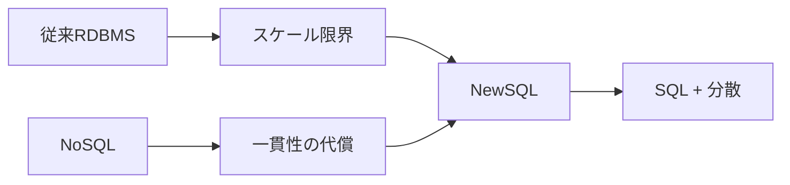
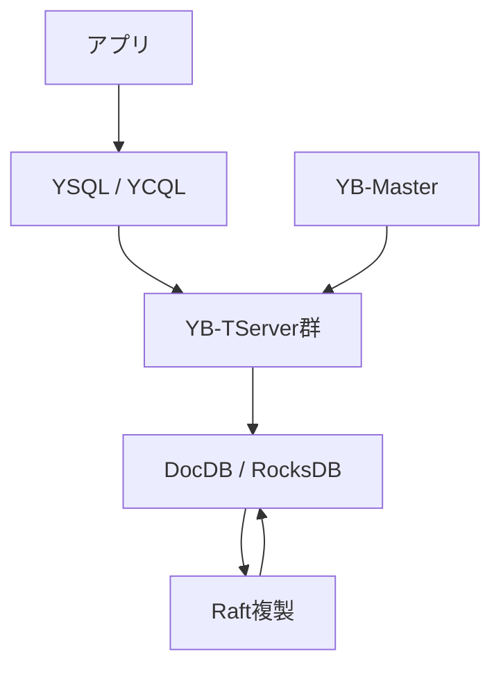
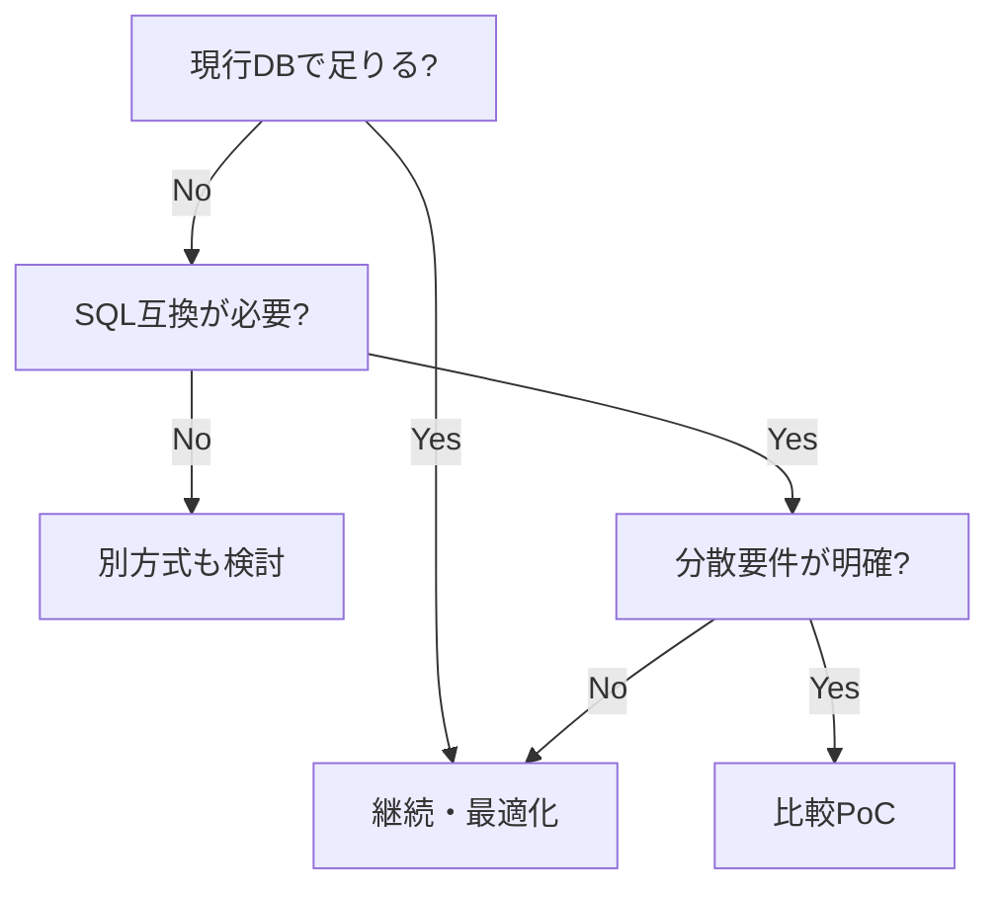

## 1. Executive Summary

NewSQL is a lineage that attempts to respond to the demands for horizontal scale and high availability spread by NoSQL without abandoning SQL, ACID transactions, and the relational model. Initially, the discussion was about "decentralizing RDBMS," but the current main battleground has shifted to `Distributed SQL`, `Cloud-native Postgres compatibility`, `multi-region active-active`, `serverless managed database`, and `AI/agent workloads`.
Source note: Cattell's SIGMOD Record study summarizes that Web 2.0-derived OLTP loads have pushed the horizontal scaling limits of traditional DBMSs, that NoSQL has sacrificed some ACID and consistency, and that new SQL-based systems aim to scale horizontally while maintaining SQL and ACID. See [Cattell, Scalable SQL and NoSQL Data Stores](https://sigmod.org/publications/sigmodRecord/1012/04.surveys.cattell.pdf).
YugabyteDB is a distributed SQL database that is part of this trend and features a PostgreSQL compatible API. The core services consist of YugabyteDB OSS, YugabyteDB Aeon fully managed, YugabyteDB Anywhere self-managed DBaaS, and YugabyteDB Voyager migration tools/services. If you were to listen to the story in 2026, it would be better to look at it as a company that is expanding to include multi-region, cloud/on-premises/Kubernetes, legacy DB migration, and AI application infrastructure while maintaining PostgreSQL compatibility, rather than just a "NewSQL product."
Source note: YugabyteDB's official product comparison organizes Aeon, Anywhere, OSS delivery format, PostgreSQL runtime compatibility, ACID transactions, multi-region, xCluster, CDC, Voyager, etc. See [Compare YugabyteDB Products](https://www.yugabyte.com/compare-products/).
Judging from publicly available information, Yugabyte is currently pushing strongly into the following four areas.

1. Enhanced PostgreSQL compatibility: Starting with v2025.1, we move to PostgreSQL 15 base and expand the functionality of Enhanced PostgreSQL Compatibility Mode.
2. Managed/hybrid provision: Aeon, Aeon BYOC, Anywhere allows you to choose "Leave the operation to Yugabyte/Control in your own environment".
3. Database modernization: Voyager supports migration from PostgreSQL, MySQL, Oracle, etc. and promotes AI-powered assessment/modernization.
4. AI/agent workload: Collaboration with pgvector, MCP Server, LangChain/LlamaIndex, etc., and agent-native data layer called Meko are starting to come to the fore.
   Source note: PostgreSQL 15ization is based on [YugabyteDB PostgreSQL 15 features](https://docs.yugabyte.com/stable/api/ysql/pg15-features/). AI/agent appeal and Meko are based on [YugabyteDB latest release](https://www.yugabyte.com/latest-release/) and [Meko documentation](https://docs.mekodata.ai/). The "focus" here is not an official roadmap, but an estimate based on published pages and product paths.

## 2. Key concepts of NewSQL

To put NewSQL in one sentence, it is "a group of OLTP databases that aim for NoSQL-level horizontal scaling, fault tolerance, and distributed operation while maintaining SQL and ACID." Traditionally, RDBMSs have had weaknesses in the operational complexity of single nodes, shared storage, vertical scaling, manual sharding, and replication/failover. NoSQL exploited this weakness and expanded sharding, replication, schema flexibility, and availability, but often limited SQL, JOINs, strong consistency, and multi-row transactions.
NewSQL emerged as a reaction. Importantly, NewSQL is not a single architecture name. There are multiple design lineages, including Spanner-based time APIs and consensus building, Calvin-based deterministic transaction ordering, SQL on distributed KVs replicated with Raft/Paxos, separation of storage and SQL layers, and implementations that emphasize compatibility with existing PostgreSQL/MySQL.
Source note: The Google Spanner paper describes a globally synchronously replicated database that supported externally consistent distributed transactions. See [Google Research, Spanner](https://research.google.com/archive/spanner.html).

The key concepts are:
| Concepts | Key points | Practical notes |
| ------------------------ | ----------------------------------------------------- | ------------------------------------------------------------ |
| Distributed SQL | It looks like a single SQL DB, but internally the data is divided and replicated | It does not have the same performance characteristics as PostgreSQL itself |
| Sharding / tablet | Split the table into small distributed units | Primary keys, hot keys, and monotonically increasing keys work |
| Raft / Paxos | Agree on committed data even in the event of failure | Writes are affected by network distance and quorum |
| Multi-region | Addressing regional failures, low latency, and data location | Delays are inevitable when performing strongly consistent writes across continents |
| PostgreSQL compatibility | Utilize ORM, driver, and SQL assets | Need to check differences in extensions, planner, DDL, and transaction semantics |

## 3. Recent trends

### 3.1 From "NewSQL" to "Postgres compatible distributed DB"

The value of NewSQL in its early days was its ability to scale horizontally without abandoning SQL and ACID. The reasons for purchasing in 2026 are a little more specific, such as "I want to take advantage of existing applications, ORM, operators, auditing, and SQL assets" and "However, a single PostgreSQL does not have enough multi-region or write scale." YugabyteDB claims PostgreSQL runtime compatibility, CockroachDB claims PostgreSQL wire/protocol compatibility, Spanner claims PostgreSQL interface, and Aurora DSQL claims PostgreSQL-compatible.
Source note: YugabyteDB explains that YSQL is designed to reuse a fork of the PostgreSQL query layer and operate data types, queries, expressions, functions, stored procedures, triggers, extensions, etc. in the same way as PostgreSQL. See [YugabyteDB PostgreSQL 15 features](https://docs.yugabyte.com/stable/api/ysql/pg15-features/). Spanner has two dialects: GoogleSQL and PostgreSQL. See [Spanner documentation](https://docs.cloud.google.com/spanner/docs?authuser=0).

### 3.2 Cloud/Serverless/Managed becomes standard

Reducing the operational load is a condition for adopting distributed SQL. Distributed DBs tend to be more operationally complex than traditional DBs because they include consensus building, leader placement, tablet/region placement, backup, upgrade, schema change, CDC, and disaster recovery. Therefore, companies are focusing on fully managed, serverless, BYOC, Kubernetes operators, Terraform providers, observability, and performance advisors.
Source note: YugabyteDB Aeon is described as fully managed DBaaS on AWS/Azure/GCP, and Anywhere is described as self-managed DBaaS in any environment. See [YugabyteDB Aeon FAQ](https://docs.yugabyte.com/stable/faq/yugabytedb-managed-faq/), [YugabyteDB Anywhere](https://docs.yugabyte.com/stable/yugabyte-platform/). Aurora DSQL is described as serverless and requires no infrastructure management. See [AWS Aurora DSQL documentation](https://docs.aws.amazon.com/aurora-dsql/latest/userguide/what-is-aurora-dsql.html).

### 3.3 Expansion to data infrastructure for AI/agent

From 2025 onwards, distributed SQL vendors will have a strong focus on AI applications. Even in AI apps, transaction data such as users, permissions, history, ratings, status updates, etc. remains. There is also a demand for handling vector searches, full text searches, JSON/documents, graph relationships, and audit logs on the same operational platform for RAG and agent memory.
YugabyteDB is promoting pgvector, HNSW indexing, MCP Server, LangChain/LlamaIndex/Bedrock/Vertex AI collaboration, and Meko. Spanner also focuses on vector search, graph, search, and AI/ML collaboration. TiDB also promotes AI agents, transactions, analytics, and vector search on the same page. As far as we can see from publicly available information, this is a movement in which distributed SQL is spreading not only to "global OLTP" but also to "AI-native operational data plane."
Source note: YugabyteDB latest release includes MCP Server, LangChain/OLLama/LlamaIndex/Bedrock/Vertex AI integration, pgvector, Performance Advisor, and Meko. See [YugabyteDB latest release](https://www.yugabyte.com/latest-release/). Spanner docs includes vector search, MCP, graph, and full-text search in the same product documentation. See [Spanner documentation](https://docs.cloud.google.com/spanner/docs?authuser=0). TiDB is promoting AI agents, ACID, transactions, analytics, and vector search. See [PingCAP](https://www.pingcap.com/).

## 4. YugabyteDB architecture

YugabyteDB is broadly divided into `YSQL/YCQLのquery layer` and `DocDB storage layer`. YSQL is a PostgreSQL-compatible SQL API, and YCQL is a Cassandra-inspired API. In the storage layer, data is divided into tablets, DocDB maintains the data on RocksDB, and Raft replicates the tablets. YB-Master is responsible for catalog management and cluster organization, and YB-TServer is responsible for holding tablets and processing queries.
Source note: YugabyteDB architecture describes the query layer and storage layer, YSQL/YCQL, DocDB on RocksDB, sharding, Raft replication, and YB-Master/YB-TServer. See [YugabyteDB Architecture](https://docs.yugabyte.com/stable/architecture/).

What is important to understand about YugabyteDB is that it does not simply run PostgreSQL on multiple machines, but rather connects a PostgreSQL-compatible query layer to a distributed storage layer. Therefore, while PostgreSQL's ecosystem compatibility is a strong value, its performance characteristics are not the same as a single PostgreSQL. Distributed DB design targets include primary key design, tablet partitioning, region placement, connection pooling, long transactions, schema migration, and sequence usage.

## 5. Services provided by Yugabyte

| Services            | Overview                                            | Points to check during the interview                                                          |
| ------------------- | --------------------------------------------------- | --------------------------------------------------------------------------------------------- |
| YugabyteDB OSS      | Apache 2.0 distributed SQL database                 | To what extent can OSS be used for production operations? Differences with commercial support |
| YugabyteDB Aeon     | fully managed DBaaS on AWS/Azure/GCP                | SLA, Regions, Backup, Security, and Operations Responsibilities                               |
| Aeon BYOC           | managed model on customer cloud                     | VPC, KMS, auditing, demarcation of responsibility, network requirements                       |
| YugabyteDB Anywhere | Self-managed DBaaS for on-premises/cloud/Kubernetes | Closed, Kubernetes, multiple cluster operations, upgrades                                     |
| YugabyteDB Voyager  | Migration tools/services from existing DB           | schema/transaction pattern stuck in Oracle/PostgreSQL/MySQL migration                         |
| Meko                | agent-native data layer                             | Maturity, pricing, relationship with YugabyteDB/Aeon, MCP and audit                           |

Source note: Aeon FAQ describes Aeon as a fully managed YugabyteDB-as-a-Service on AWS/Azure/GCP. See [YugabyteDB Aeon FAQ](https://docs.yugabyte.com/stable/faq/yugabytedb-managed-faq/). The Anywhere docs describe it as a self-managed DBaaS that deploys/operates YugabyteDB universes on-prem, public cloud, Kubernetes, and single-/multi-region topologies. See [YugabyteDB Anywhere](https://docs.yugabyte.com/stable/yugabyte-platform/). Voyager docs describes end-to-end migration from PostgreSQL, MySQL, and Oracle to YugabyteDB Aeon/Anywhere/OSS. See [YugabyteDB Voyager docs](https://docs.yugabyte.com/stable/yugabyte-voyager/).
Meko is an agent-native data layer that comes out separately from YugabyteDB itself. Meko's official page touts collective memory, shared knowledge, decision traces, single MCP endpoint, and unified data layer for multi-agent systems, and explains that it is built on YugabyteDB. At this point, rather than a mature general-purpose DB service, it is appropriate to view it as a signal that Yugabyte is betting on the data infrastructure of the AI ​​agent era.
Source note: Meko's official website says "The Data Layer for Agents That Learn Together" and explains MCP endpoint, vector/SQL/graph/search, and serverless architecture. See [Meko](https://mekodata.ai/), [Meko Documentation](https://docs.mekodata.ai/). The positioning here is an estimate based on publicly available information.

## 6. Areas that Yugabyte seems to be focusing on now

| Area                     | Movements visible from public information                                  | Things to ask at the interview                                                                       |
| ------------------------ | -------------------------------------------------------------------------- | ---------------------------------------------------------------------------------------------------- | --- | ---------------------- | ---------------------------------------------------------------------------------- | ------------------------------------------------------------------------------------------- |
| PostgreSQL compatibility | PG15 base, EPCM, CBO, Read Committed, parallel query, DDL/DML improvements | Which PostgreSQL extensions/SQL functions are not supported? What to look for in compatibility tests |
| Managed / BYOC           | Separating operational models between Aeon, Aeon BYOC, and Anywhere        | How to meet the network, KMS, audit, and data residency requirements of Japanese companies           |     | Database modernization | Promoting PostgreSQL/MySQL/Oracle migration and AI-powered assessment with Voyager | What schema/sequence/transaction patterns are likely to fail in Oracle/PostgreSQL migration |
| Multi-region resilience  | Synchronous multi-region, geo-partitioning, xCluster, read replicas        | Track record, latency, RPO/RTO design for Tokyo/Osaka and Japan+overseas configurations              |
| AI/agent workloads       | pgvector, MCP Server, LangChain/LlamaIndex collaboration, Meko             | Wins/limitations compared to dedicated vector DB for RAG/agent memory usage                          |
| Operational tooling      | Performance Advisor, observability, rolling upgrades, backup/PITR          | SLOs, alerts, fault training, and upgrade frequency that production SREs should look at              |

Source note: v2025.2 LTS release notes list features such as xCluster automatic mode, connection manager improvements, write pipelining, pgvector with indexing, HNSW, and PostgreSQL compatibility. See [YugabyteDB v2025.2 release notes](https://docs.yugabyte.com/stable/releases/ybdb-releases/v2025.2/). Focus areas are estimates from published releases and product pages rather than official roadmaps.

## 7. Perspectives for deciding on introduction

YugabyteDB is suitable for cases where the operational limits of a single PostgreSQL are clear and where you want to maintain SQL/ACID/existing tools. Typically, organizations are simultaneously concerned with multi-region availability, near-nondisruptive operations, write scale, data residency, leveraging PostgreSQL assets, and modernizing from Oracle/MySQL.
Conversely, if PostgreSQL/Aurora, which scales vertically in a single region, is stable enough, YugabyteDB is likely to be an over-investment. In exchange for fault tolerance and scale, distributed DBs introduce the costs of key design, transaction demarcation, region placement, operational visibility, and compatibility verification. NewSQL is not "complete upward compatibility with PostgreSQL," but "an option that allows distributed system constraints to be handled in SQL form."

## 8. Questions to ask a Yugabyte representative

1. At what granularity does YugabyteDB define "PostgreSQL compatible"? How should I understand which parts of wire protocol, SQL dialect, extension, planner behavior, DDL, and transaction semantics are not supported or have limitations?
2. After making PostgreSQL 15 based, what is the policy for following up on PG16/PG17? Which priority for compatibility is determined by customer requirements, PostgreSQL original, or safety as a distributed DB?
3. When migrating from Oracle/PostgreSQL/MySQL with Voyager, what schema patterns, sequences, stored procedures, triggers, and transaction patterns are most likely to cause blockages?
4. How do the boundaries of responsibility for Aeon, Aeon BYOC, and Anywhere compare in terms of failure response, backup restore, upgrade, KMS, audit logs, networking, and SLA?
5. Do you have any experience with multi-region configurations such as Tokyo/Osaka, Japan/US, and Japan/APAC in the Japan region or Japanese companies? What is the measured latency and recommended topology?
6. Which of the following is recommended for xCluster as a primary use: DR, migration, active-active, or analytics collaboration? What are the limitations of conflict handling and DDL operations for bidirectional replication?
7. What scale, update frequency, and search requirements are realistic for YugabyteDB's pgvector/HNSW? What are the conditions for winning and losing compared to dedicated vector DB?
8. At what stage is Meko a commercial service for YugabyteDB? For existing YugabyteDB/Aeon customers, what will happen to data boundaries, MCPs, audits, and charges when using Meko?
9. When compared to Aurora DSQL, Spanner, CockroachDB, and TiDB, which use cases are Yugabyte most likely to win, and which use cases would you honestly not recommend?
10. If I'm doing a PoC, which app-specific workload should I bring in before which benchmark?

## Reference information

This `content/blog/newsql-yugabyte-brief.mdx` is managed as the original text for the main text.
