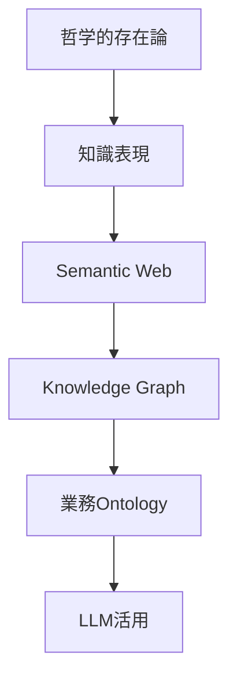
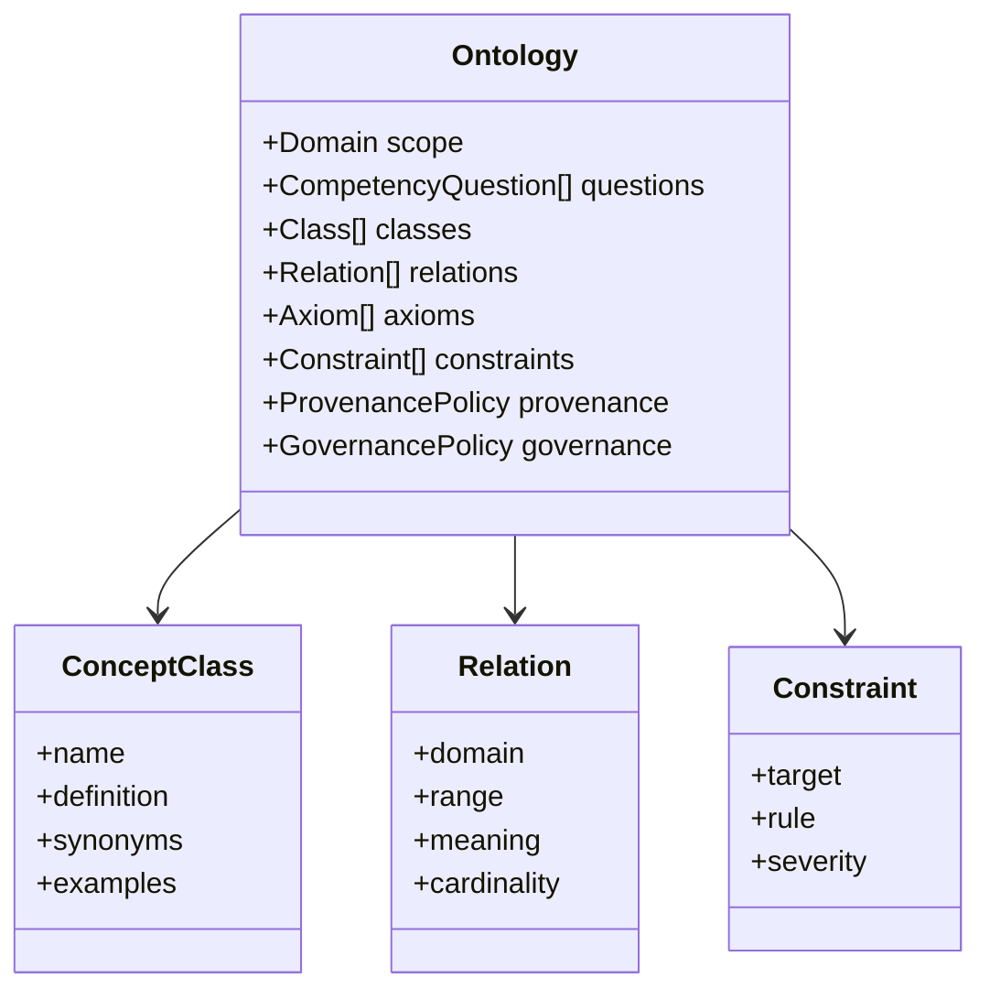
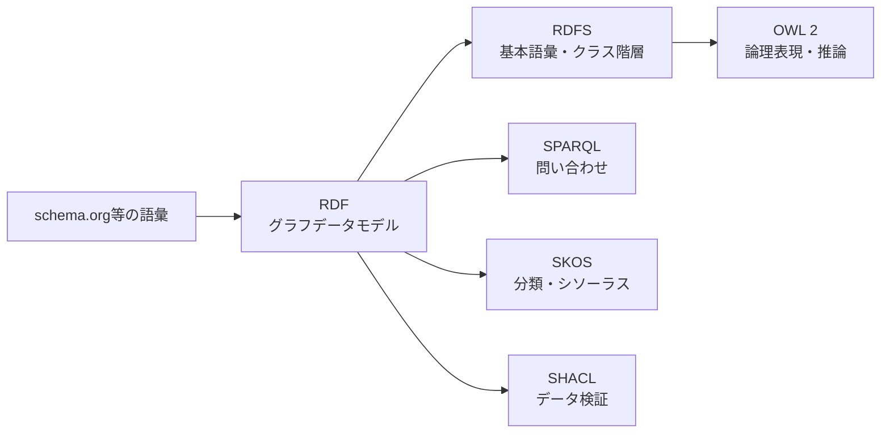
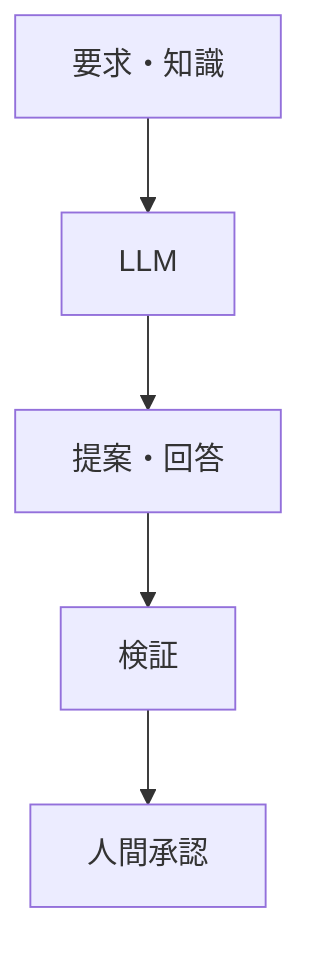
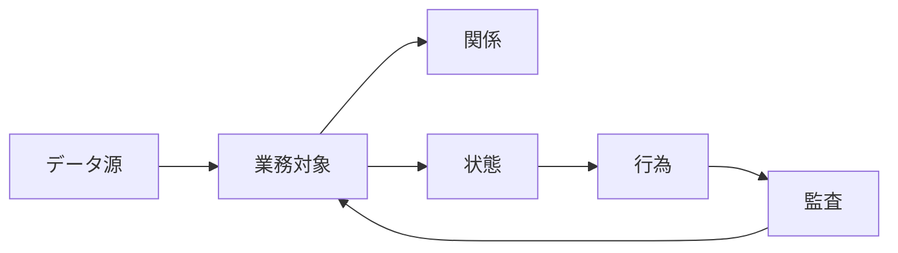
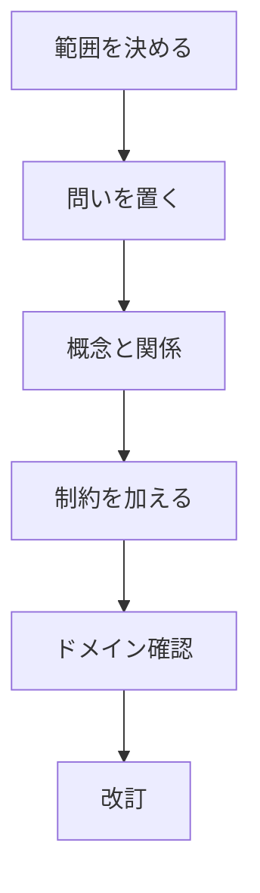
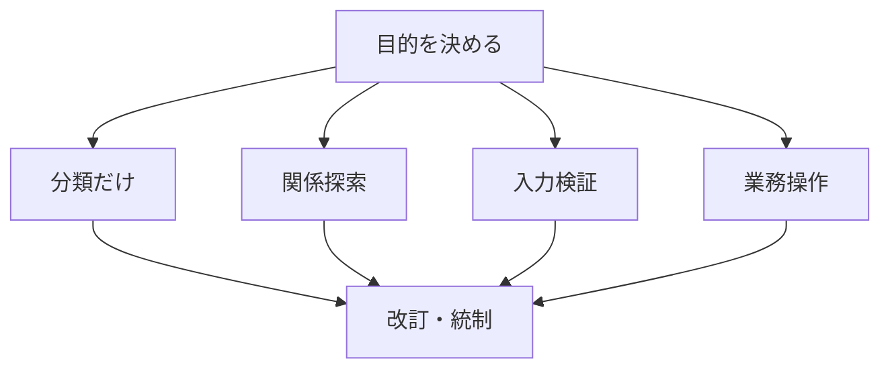
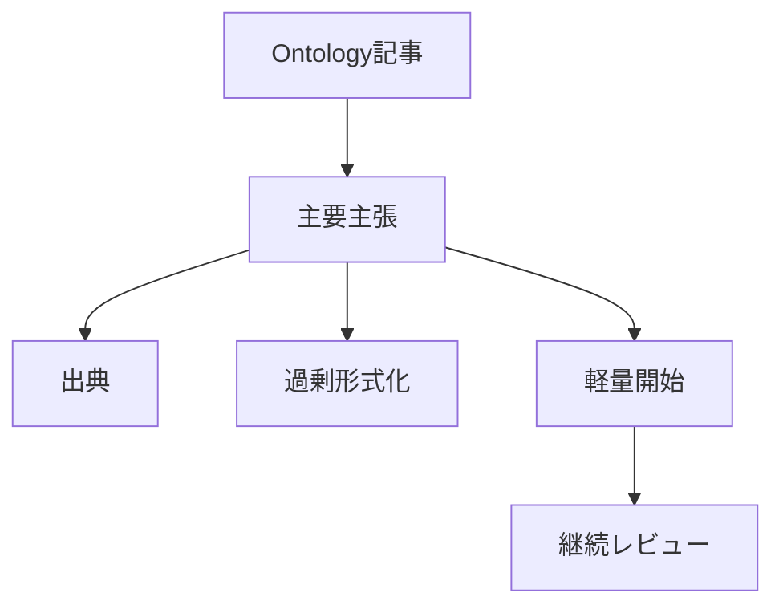

# Fundamentals of ontology concepts and practical application
## 1. Executive Summary
The meaning of ontology changes depending on the context. In philosophy, it is a field that asks ``what exists?'' In information science, it refers to ``the explicit definition of concepts, relationships, and constraints that exist in a certain area.'' In the context of business AI, it goes one step further and is used as a design philosophy to bring customers, issues, contracts, obstacles, approvals, actions, permissions, and audit logs onto the same business world model.
The conclusions of this report are as follows.
1. Ontology is not just a glossary of terms. Includes conceptual classification, relationships, attributes, constraints, inferrability, identity, sources, and update rules.
2. Taxonomy, controlled vocabulary, schema, data model, and knowledge graph overlap with ontology, but they are not the same. Ontology is a semantic model that specifies ``what should be treated as what.''
3. RDF/OWL is a representative standard for representing ontologies in a machine-readable manner on the Web, but OWL is not required in all practices. SKOS is required for classification systems, SHACL is required for verification, OWL is required for rigorous inference, and application-side authority/workflow design is required for business execution.
4. Ontology in the LLM era is not ``magic that injects semantic understanding into LLM.'' This is an information design that aligns vocabulary, targets, relationships, constraints, and trails when LLM references, searches, generates, and executes tools.
5. In practice, you should not start with a huge company-wide ontology. It is practical to start with an ontology lite that defines competency questions, key objects, relationships, constraints, sources, and update responsibilities for a specific use case.


## 2. First of all, what is confusing?
The reason the word ``ontology'' is confusing is that at least three traditions use the same word.
First, the ontology of philosophy is ontology. This asks questions like ``What exists?'' ``How can we classify existing beings?'' and ``What mode of existence do properties, relationships, events, time, whole parts, and possibilities have?'' It is not a term for information system design, but a basic philosophy that deals with the categories of existence and reality.
Source note: [Metaphysics](https://plato.stanford.edu/entries/metaphysics/) in the Stanford Encyclopedia of Philosophy organizes the range from Aristotle's first philosophy to modern metaphysics. Ontology here is treated not as a schema of an information system, but as a philosophical problem that questions existence in general.
Second, ontology of AI/knowledge representation is an explicit specification of conceptualization in a certain domain. Gruber's (1993) famous definition regards ontology as a ``specification of conceptualization.'' What is important here is not the target world itself, but how humans or systems conceptualize that realm.
Source note: Gruber's [A Translation Approach to Portable Ontology Specifications](https://doi.org/10.1006/knac.1993.1008) and author page's [definition note](https://tomgruber.org/writing/ontolingua-kaj-1993/) position ontologies as "specifications of conceptualization." Noy and McGuinness's [Ontology Development 101](https://protege.stanford.edu/publications/ontology_development/ontology101-noy-mcguinness.html) also expands this definition into practical development procedures.
Third, in recent business AI/data infrastructure, ontology is sometimes used in a meaning similar to semantic layer, canonical data model, business object layer, or digital twin. Palantir Foundry's Ontology is not an RDF/OWL specification itself, but is described as an operational layer that integrates data, objects, relationships, actions, functions, and dynamic security.
Source note: Palantir's [Ontology overview](https://www.palantir.com/docs/foundry/ontology/overview) describes Ontology as the operational layer of an organization and states that it includes semantic elements and kinetic elements. This is not a standard language description such as W3C OWL, but an executable semantic model on a business platform.
## 3. Short research history of ontology
Ontology in information science evolved from borrowing terms from philosophy and transplanting them to the problem of knowledge sharing and reuse in AI. In the knowledge-based systems of the 1980s and 1990s, attempts were made to express expert knowledge in rules and frames, but knowledge that was confined to individual systems was difficult to reuse. Ontologies have become a means of defining domain knowledge as portable and shareable specifications.
Gruber's (1993) definition treated ontologies as ``explicit specifications for knowledge sharing'' rather than ``internal implementations of specific systems.'' Formal ontology since Guarino (1998) has emphasized that a list of concept names is not enough. This is because when we get fundamental categories like identity, dependence, part-whole, property, role, and event wrong, the connections of meaning between systems break down.
Source note: Guarino's [Formal Ontology and Information Systems](https://www.loa.istc.cnr.it/wp-content/uploads/2020/03/FOIS98.pdf) presents an ontology-driven information systems perspective. Barry Smith's [Basic Concepts of Formal Ontology](https://ontology.buffalo.edu/smith/articles/fois1998.pdf) organizes the basic concepts of formal ontology for dealing with objects in the everyday world.
In the 2000s, the Semantic Web connected this lineage to web standards. RDF provided a data model that described Web resources using subject-predicate-object triples, and OWL provided richer representations for classes, properties, individuals, constraints, and inferences. SPARQL became a language for querying RDF graphs, and SKOS made it easier to share semi-formal knowledge organization systems such as classification systems and thesauri on the Web.
Source note: See Berners-Lee, Hendler, and Lassila, [The Semantic Web](https://lassila.org/publications/2001/SciAm.html), for the vision of the Semantic Web. See W3C [RDF 1.1 Primer](https://www.w3.org/TR/rdf-primer/) for the basics of RDF, and W3C [OWL 2 Primer](https://www.w3.org/TR/owl-primer/) and [OWL 2 Overview](https://www.w3.org/TR/owl2-overview/) for OWL 2.
Since the 2010s, the term knowledge graph has become widely used. A knowledge graph does not necessarily have a strict OWL ontology. In practice, it is often operated as large-scale graph data that handles nodes, edges, identifiers, sources, contexts, and update histories. Hogan et al. (2021) comprehensively organize knowledge graphs as graph-based knowledge representations for handling dynamic and large-scale data sets.
Source note: Hogan et al.'s [Knowledge Graphs](https://arxiv.org/abs/2003.02320) systematically addresses the data model, query language, schema, identifiers, context, creation, quality assessment, and publication of knowledge graphs. Knowledge graphs can include ontologies, but the two are not synonymous.
## 4. Elements that make up the ontology
In practice, an ontology consists of the following elements:
| Element | Meaning | Example |
| --------------------- | -------------------------- | ---------------------------------- |
| Domain | Target area | Technical research, medical care, manufacturing, sales, legal |
| Class / Type | Type, conceptual category | Source, Claim, Customer, Contract |
| Individual / Instance | Individual target | A paper, a client, a contract |
| Property / Attribute | Nature of subject | Creation date, author, contract amount, risk level |
| Relation | Relationship between objects | cites, supports, owns, dependsOn |
| Axiom / Rule | Constraints and inference rules that must hold | Contracts are always linked to customers |
| Constraint | Validation conditions that data must meet | Date required, status enumeration, duplicates prohibited |
| Provenance | Source/Provenance | Which document, who said it, which API result |
| Governance | Responsibility, approval, and authority for updating | Who can change definitions |
As you can see from this list, ontology is not a "dictionary that explains the meaning of words". If you just want to define a vocabulary, a controlled vocabulary is sufficient. If only hierarchical classification is required, taxonomy is sufficient. If only the data item type and required conditions are required, schema is sufficient. Ontologies include these and specify how to conceptualize the domain and which relationships and constraints are to be treated as legitimate.


Noy and McGuinness describe ontology development as a process of defining a target area and purpose, listing important terms, and iteratively creating class hierarchies, properties, constraints, and instances, rather than a definition process that can be completed in one go. The first question to ask is not ``How can I completely classify the world?'' but ``What questions do I want to answer with this ontology?'' These questions are called competency questions.
Source note: [Ontology Development 101](https://protege.stanford.edu/publications/ontology_development/ontology101-noy-mcguinness.html) describes ontology development as an iterative process, designing classes, slots, constraints, and instances in sequence. The practical policy here is to adapt the methods in the same guide to modern data and AI infrastructure.
## 5. Differences from similar concepts
The quickest way to understand ontology is to line it up with similar concepts.
| Concept | Main purpose | Typical example | Relationship with ontology |
| --------------------- | ---------------------- | ------------------------ | ------------------------------------- |
| Glossary | Explanation of terms | In-house glossary | There are definitions, but relationships, constraints, and inferences are weak |
| Controlled vocabulary | Suppression of spelling variations | List of tags, standard codes | Foundation of vocabulary control |
| Taxonomy | Hierarchical classification | Industry classification, product category | `is-a` Hierarchy can be part of ontology |
| Thesaurus | Synonyms, hypernyms, and related words | Library subject headings | Easy to express in SKOS |
| Schema | Data structure | JSON Schema, DB schema | Defines types, items, and essential conditions, but conceptual meaning is limited |
| Data model | Data design | ER diagram, UML class diagram | Often more implementation-oriented than ontology |
| Knowledge graph | Graph of entities and relationships | Wikidata, corporate KG | May be structured using ontologies |
| Semantic layer | Common semantic layer of BI/analysis | Indicator definition, metrics layer | Overlapping in terms of common business vocabulary |
| Operational ontology | Semantic layer of business objects and actions | Palantir Foundry Ontology | Adding actions, authorities, and audits to the semantic model |
Classification systems and glossaries are useful as an entry point to ontology. However, just by defining the terms ``customer'', ``contract'', and ``claim'', it is not clear whether a contract is necessarily linked to one or more customers, whether there are different classes of customers (corporate or individual), or under what conditions a claim may be canceled. When these relationships, constraints, state transitions, and authorities become necessary, we move from a simple glossary to ontology design.
SKOS is a practical standard that deals with this boundary area. Semi-formal knowledge organization systems such as thesauri, classification systems, and subject headings can be expressed in RDF. It is lighter than OWL, which aims for strict logical reasoning, and is suitable for making existing classification and tag systems machine readable.
Source note: W3C [SKOS Primer](https://www.w3.org/TR/skos-primer/) describes SKOS as an RDF vocabulary that represents knowledge organization systems such as thesauri, classification schemes, and subject headings. SKOS is positioned as a bridge between the rigor of OWL and weakly structured data on the Web.
## 6. Role of Semantic Web standards
W3C-based standards are still important when implementing ontologies. However, each standard has a different role.
| Standards/Vocabulary | Role | Practical use |
| -------------- | ------------------------------------- | ------------------------------------- |
| RDF | Graph data model of subject, predicate, and object | Connecting data with web identifiers and integrating disparate data |
| RDFS | Basic schema of RDF vocabulary | Basic definitions of classes, subclasses, and properties |
| OWL 2 | Logic-based ontology language | Consistency verification, classification reasoning, and making implicit knowledge explicit |
| OWL 2 Profiles | Adjustment of inference performance and expressiveness | Adjustment for large-scale classification, DB linkage, and rule-based reasoning |
| SPARQL | RDF graph query language | Searching, aggregating, and combining RDF data |
| SKOS | Classification/thesaurus representation | Tags, classification system, subject heading, lightweight vocabulary management |
| SHACL | RDF graph validation | Required items, types, ranges, consistency checks |
| schema.org | Structured Data Vocabulary on the Web | Semantic Annotations for Web Pages, Email, and JSON-LD |
RDF is a data model, OWL is an ontology language, and SHACL is a verification language. This distinction is of considerable practical importance. OWL treats ``what is not explicitly stated as not necessarily false'' under the open world assumption. Although this is suitable for distributed knowledge on the Web, it tends to create a sense of discomfort when verifying the input of business data. In a business system, if you want to say ``It's an error if the contract doesn't have a customer ID,'' SHACL or application-side verification is required.
Source note: W3C [RDF 1.1 Primer](https://www.w3.org/TR/rdf-primer/) describes RDF statements as triples of subject, predicate, and object. W3C [OWL 2 Primer](https://www.w3.org/TR/owl-primer/) describes OWL as an ontology language for the Semantic Web that deals with classes, properties, individuals, and data values. W3C [SHACL](https://www.w3.org/TR/shacl/) is defined as a constraint language that validates RDF graphs against shapes graphs.


OWL 2 has multiple profiles. OWL 2 EL, QL, and RL make certain reasoning tasks more pragmatically tractable at the cost of limiting their expressive power. This is a counterexample to the idea that a more rigorous ontology is always better. When designing an ontology, it is necessary to choose the degree of formality according to the questions to be answered, the amount of data, the need for inference, the frequency of updates, and the skills of the operator.
Source note: W3C [OWL 2 Profiles](https://www.w3.org/TR/owl2-profiles/) defines OWL 2 EL, QL, and RL as a more restricted syntactic subset than OWL DL. The choice depends on the ontology structure and the reasoning task.
## 7. Upper-level ontology and domain ontology
Ontologies have granularity.
| Types | Target | Examples | Advantages | Points to note |
| -------------------------- | --------------------------- | --------------------------- | -------------------------- | ------------------------ |
| Top-level / Upper ontology | Abstract categories that appear in any domain | object, process, quality, role | Interoperability between domains | High level of abstraction, far from the field |
| Domain ontology | Specific areas | Medical, manufacturing, legal, research management | Close to practical work | Difficult to expand outside the field |
| Application ontology | Specific applications/tasks | Troubleshooting, investigation report management | Ready to use | Low versatility |
| Task ontology | Specific tasks | Review, approve, search, recommend | Easy to connect to AI/workflow | Narrow scope |
BFO is a representative example of a higher-level ontology and has been standardized as ISO/IEC 21838-2:2021. Higher-level ontologies are useful when connecting different domain ontologies. However, in the practice of individuals or small teams, it is easier to achieve results by specifying the classes and relationships necessary for the target workflow than by introducing a higher-level ontology such as BFO from the beginning.
Source note: ISO's [ISO/IEC 21838-2:2021](https://www.iso.org/standard/74572.html) describes Basic Formal Ontology as meeting the requirements of a top-level ontology. BFO is effective for interoperability, but implementation requires an understanding of abstract concepts and modeling discipline.
## 8. Why ontology is important again in the LLM era
Although LLM can generate flexible responses from a large number of language patterns, it does not automatically correctly identify business targets. The entities referred to by "this customer," "this contract," "this failure," "this claim," and "this source" are not stable unless they are connected to external data, identifiers, authorities, sources, and states.
Rather than directly erasing the weaknesses of LLM, ontology creates a scaffolding of the external world for LLM to use.
1. **Make your vocabulary consistent**: Reduce the problem of calling the same meaning by another name, or calling different meanings by the same name.
2. **Identify the subject**: Connect the natural language "Customer A" to a unique object on the system.
3. **State the relationship**: Define the relationship: the claim is supported by the source, the failure affects the service, and the contract belongs to the customer.
4. **Provide constraints**: Define allowed state transitions, required attributes, privileges, and approval conditions.
5. **Improve your search**: Use hierarchies, synonyms, relationships, time, and sources that are difficult to pick up using vector searches alone.
6. **Enables evaluation**: LLM output can be verified against defined concepts, relationships, and constraints.
Pan et al. (2023) organizes the integration of LLM and knowledge graphs into three directions: KG-enhanced LLMs, LLM-augmented KGs, and Synergized LLMs + KGs. This arrangement also applies to the relationship between ontology and LLM. Ontologies can augment the input context of LLM, and LLM can support the construction, complementation, and validation of ontologies. However, it is dangerous to directly adopt the classes and relationships generated by LLM as a correct ontology.
Source note: Pan et al.'s [Unifying Large Language Models and Knowledge Graphs: A Roadmap](https://arxiv.org/abs/2306.08302) organizes the integration of LLM and KG into three frameworks. Hitzler et al.'s [Accelerating Knowledge Graph and Ontology Engineering with Large Language Models](https://arxiv.org/abs/2411.09601) argues that while LLM can accelerate ontology modeling, extension, population, alignment, etc., modularity and evaluation will be important.


## 9. Operational ontology in business AI
In business AI, ontology is not enough to simply represent static knowledge. If an AI agent is involved in a business, it is necessary to define which objects it can refer to, what it can do in what state, whose approval is required, and where the execution results are recorded. It is easier to understand if this layer is called operational ontology.
Palantir Foundry Ontology brings this idea to the fore. It includes not only semantic elements such as objects, properties, and links, but also kinetic elements such as actions, functions, and dynamic security. In other words, it does not simply define ``what is an order?'' but also ``who can do what with an order, and in which system the results will be reflected.''
Source note: Palantir [Ontology overview](https://www.palantir.com/docs/foundry/ontology/overview) explains that Ontology sits on top of datasets, virtual tables, and models and connects them to real-world objects. Palantir [Platform overview](https://www.palantir.com/docs/foundry/platform-overview/overview) describes Actions as corporate verbs that persist decisions into ontology or external systems.


This idea is not unique to Palantir. All platforms face the same issues when it comes to safely running business AI. Even if you can search for documents using RAG, whether the search results are currently valid, who can see them, and what operations they can be used for are other issues. Ontology makes these "meaning," "state," "possibility of action," and "responsibility" into one design target.
## 10. Practical steps to create an ontology
If you try to create a complete ontology from the beginning, you are likely to fail. In practice, make smaller pieces in the following order.
### 10.1 Write the scope in one sentence
Example: "This ontology is for managing themes, sources, claims, evidence, judgments, and risks in technical research reports."
Also clearly indicate what is outside the scope. For example, paper submission management, budget management, and personal learning history should be excluded from the initial scope.
### 10.2 Determine competency questions
Decide first which questions you want to answer using ontology.
- Which claims are supported by which sources.
- Which sources are primary information and which are secondary information?
- Which decisions depend on which risks and assumptions?
- Which research topic belongs to which category?
- Which information is likely to become outdated?
### 10.3 Define the minimal class
At first, 5 to 10 pieces is enough.
| Class | Definition |
| -------- | ------------------------------------- |
| Topic | Questions and themes to be investigated |
| Report | Document summarizing survey results |
| Source | Literature, official materials, and specifications referenced as evidence |
| Claim | Verifiable claims in the report |
| Evidence | Specific evidence supporting the claim |
| Decision | Practical judgment/recommendation |
| Risk | Limitations, unconfirmed matters, possibility of failure |
| Concept | Abstract concept that you want to reuse |
### 10.4 Define relationships
| Relation | Domain | Range | Meaning |
| ----------- | ----------------- | ---------------- | ------------------------------------- |
| hasSource | Claim | Source |
| supports | Evidence | Claim |
| contradicts | Source / Evidence | Claim |
| dependsOn | Decision | Claim / Risk |
| belongsTo | Report | Topic | Report belongs to theme |
| hasConcept | Report | Concept | Report deals with concepts |
| supersedes | Claim / Decision | Claim / Decision | New claim/decision replaces old |
### 10.5 Determine constraints and validation
The initial constraints may be fewer.
- A Claim has at least one Source or Evidence.
- Source has types of `primary` / `secondary` / `official` / `paper` / `spec`.
- Decisions have premises, reasons, and risks.
- Claims that are highly time-dependent have a confirmation date.
- Future forecasts that are not official roadmaps should be clearly marked as "estimated from published information."
These constraints can be written in RDF/SHACL, or implemented using Markdown templates, JSON Schema, TypeScript types, or CI checks. What is important is not the use of a formal language itself, but what semantic constraints to follow.


## 11. How formal should it be?
Failures in ontology design arise from both under-formalization and over-formalization. The criterion is "what do you want to achieve?"
| Purpose | Recommended level | Implementation candidates |
| -------------------------------- | -------------------------------------- | --------------------------------- |
| Reduce vocabulary swing | Controlled vocabulary | Markdown, CSV, Notion DB |
| I want to classify hierarchically | Taxonomy / SKOS | SKOS, YAML, DB |
| I want to trace relationships between reports and sources | Lightweight ontology / KG | property graph, RDF, JSON-LD |
| I want to validate data input | Schema + constraints | JSON Schema, SHACL, DB constraints |
| Want to infer implicit relationships | OWL / rule engine | OWL 2 profile, Datalog |
| Want to control business operations | Operational ontology | API, permissions, auditing, workflow |
For knowledge management by individuals or small teams, it is better to create an ontology lite in Markdown/JSON/YAML and graph only the necessary relationships, rather than suddenly defining all concepts in OWL. Consider RDF/OWL/SHACL when you need large-scale interoperability, external exposure, connectivity with standard vocabularies, and logical reasoning.


## 12. Risks and limitations
### 12.1 False precision
It's easy to feel like you've expressed the world accurately just by naming a concept as a class. In reality, definition boundaries, exceptions, synonyms, usage by organization, and responsibility for updating remain vague. An ontology is not a copy of reality, but a model for a purpose.
### 12.2 Lack of consensus building
Ontology development is both technical work and consensus building. The meanings of "customer," "contract," "completion," and "major failure" vary depending on the department and system. If vocabulary extracted through LLM is adopted without consensus, a model will be created that deviates from the practical meaning in the field.
Source note: [Ontology Development is Consensus Creation, Not (Merely) Representation](https://arxiv.org/abs/2210.12026) views reference ontology development as consensus building rather than mere knowledge expression. Automated generation by LLM can be an aid, but it is not a substitute for consensus building.
### 12.3 Overformalization
If you try to define everything strictly, the operational load will increase and you will end up with an ontology that is not updated. Updateability is often more important than completeness, especially when it comes to rapidly changing AI products, business rules, and organizational structures.
### 12.4 Confusion between open world and closed world
Web logic such as OWL does not consider anything that is not explicitly stated to be false. On the other hand, when verifying a business system, if a required item is missing, you want to set it as an error. Mixing the roles of ontology languages, verification languages, and application constraints results in different behavior than expected.
### 12.5 Risks of LLM
LLM is useful as an aid for generating lexical candidates, relationship candidates, definition sentences, and exceptional patterns. However, LLMs are not automatically aware of the formal definitions, authority, responsibilities, and unspoken rules within the organization. Ontologies created by LLMs must be verified with sources, examples, counterexamples, domain expert reviews, and test data.
## 13. Recommended policies in practice
When used in this repository or in personal research workflows, the first goal should not be a ``formally beautiful ontology,'' but a ``semantic model in which reusable knowledge assets can be placed without hesitation.''
The recommendations are as follows.
1. First, define ontology lite for `Topic`, `Report`, `Source`, `Claim`, `Evidence`, `Decision`, `Risk`, `Concept` in Markdown.
2. Place the main Claim and Source close to each other in each report. This works well with existing `出典メモ:` rules.
3. Have `確認日` for time-dependent claims. Be sure to double-check AI products, specifications, prices, and roadmaps.
4. Areas where classification alone is sufficient are treated in the SKOS manner. For example, `category/ai-systems` and `category/knowledge-systems` can be lightweight classifications.
5. If you want to strengthen search/visualization/MCP integration in the future, design it in a format that can be converted to Markdown frontmatter, JSON-LD, or a small property graph.
6. Consider OWL only when logical reasoning and rigorous interoperability with external vocabularies are needed.


As a minimal implementation, a frontmatter like the one below is quite valuable.
```yaml
topic: ontology-concept
category: knowledge-systems
concepts:
  - ontology
  - knowledge-graph
  - semantic-web
  - operational-ontology
claims:
  - id: claim-ontology-not-glossary
    status: supported
    sources:
      - gruber-1993
      - ontology-101
  - id: claim-llm-needs-grounding-layer
    status: supported
    sources:
      - pan-2023-llm-kg
      - palantir-ontology-overview
review:
  freshness_sensitive: true
  last_checked: 2026-05-09
```

## 14. Summary
Ontology is not a "complete classification table of the world." It is a semantic model that specifies what concepts, relationships, constraints, sources, and update responsibilities are used to treat a target domain for a certain purpose.
Philosophically, it questions the categories of existence. Knowledge representation involves creating sharable conceptual specifications. Semantic Web makes it machine readable on the web through RDF/OWL/SKOS/SPARQL/SHACL. In operational AI, it is expanded to operational ontology, which connects data, operational targets, states, actions, authorities, and audits.
What is important in the LLM era is not to mystify ontology. It is not a decoration to improve the quality of LLM's answers, but a design asset to prevent AI from incorrectly referencing or manipulating the reality of the organization. Start with small, specific questions and keep updating with real data and reviews.
## Reference information
- Tom Gruber, "A Translation Approach to Portable Ontology Specifications" https://doi.org/10.1006/knac.1993.1008
- Tom Gruber, "Definition of Ontology as Specification" https://tomgruber.org/writing/ontolingua-kaj-1993/
- Natalya F. Noy and Deborah L. McGuinness, "Ontology Development 101" https://protege.stanford.edu/publications/ontology_development/ontology101-noy-mcguinness.html
- Nicola Guarino, "Formal Ontology and Information Systems" https://www.loa.istc.cnr.it/wp-content/uploads/2020/03/FOIS98.pdf
- Barry Smith, "Basic Concepts of Formal Ontology" https://ontology.buffalo.edu/smith/articles/fois1998.pdf
- Tim Berners-Lee, James Hendler, Ora Lassila, "The Semantic Web" https://lassila.org/publications/2001/SciAm.html
- W3C, "RDF 1.1 Primer" https://www.w3.org/TR/rdf-primer/
- W3C, "OWL 2 Web Ontology Language Primer" https://www.w3.org/TR/owl-primer/
- W3C, "OWL 2 Web Ontology Language Document Overview" https://www.w3.org/TR/owl2-overview/
- W3C, "OWL 2 Web Ontology Language Profiles" https://www.w3.org/TR/owl2-profiles/
- W3C, "SKOS Simple Knowledge Organization System Primer" https://www.w3.org/TR/skos-primer/
- W3C, "SHACL Shapes Constraint Language" https://www.w3.org/TR/shacl/
- W3C, "SPARQL 1.1 Query Language" https://www.w3.org/TR/sparql11-query/
- ISO, "ISO/IEC 21838-2:2021 Basic Formal Ontology" https://www.iso.org/standard/74572.html
- Schema.org https://schema.org/
- Aidan Hogan et al., "Knowledge Graphs" https://arxiv.org/abs/2003.02320
- Shirui Pan et al., "Unifying Large Language Models and Knowledge Graphs: A Roadmap" https://arxiv.org/abs/2306.08302
- Pascal Hitzler et al., "Accelerating Knowledge Graph and Ontology Engineering with Large Language Models" https://arxiv.org/abs/2411.09601
- "Ontology Development is Consensus Creation, Not (Merely) Representation" https://arxiv.org/abs/2210.12026
- Palantir, "Ontology overview" https://www.palantir.com/docs/foundry/ontology/overview
- Palantir, "Platform overview" https://www.palantir.com/docs/foundry/platform-overview/overview
- Stanford Encyclopedia of Philosophy, "Metaphysics" https://plato.stanford.edu/entries/metaphysics/
